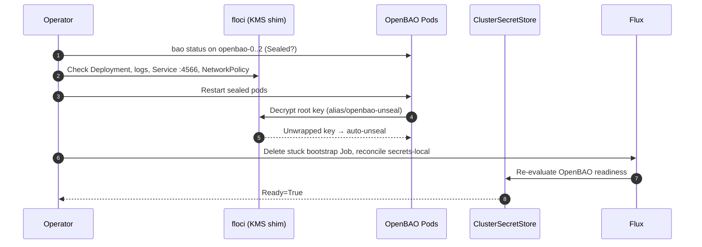

# OpenBAO Unseal And Stuck Reconciliation

Use this when OpenBAO pods are sealed, `ClusterSecretStore/openbao` returns 503, or Flux `secrets-local` is stuck.

| Fact | Value |
|---|---|
| Seal type | `awskms` auto-unseal via the in-cluster floci KMS emulator (ADR-024) |
| KMS endpoint | `http://floci.openbao.svc.cluster.local:4566`, key `alias/openbao-unseal` |
| Manual unseal | **Does not exist** — there is no Shamir unseal key on this platform |
| `openbao-init-keys` | Holds `recovery_key` (break-glass) + an **inert, revoked** `root_token` |

Pods self-unseal **at boot** by unwrapping the root key through floci. A pod
stuck sealed therefore means OpenBAO **could not reach floci (or the KMS
alias) when it started** — the fix is to repair the floci path and restart the
pods so they retry auto-unseal, not to type an unseal key.

The `recovery_key` is **not an unseal key**. It cannot unseal anything; its
only use is driving the `bao operator generate-root` ceremony for day-2 admin
access — see
[Add or write a KV secret on a live cluster](./add-secret-live-cluster.md).


```mermaid
sequenceDiagram
    autonumber
    participant Operator
    participant Floci as floci (KMS shim)
    participant BAO as OpenBAO Pods
    participant CSS as ClusterSecretStore
    participant Flux

    Operator->>BAO: bao status on openbao-0..2 (Sealed?)
    Operator->>Floci: Check Deployment, logs, Service :4566, NetworkPolicy
    Operator->>BAO: Restart sealed pods
    BAO->>Floci: Decrypt root key (alias/openbao-unseal)
    Floci-->>BAO: Unwrapped key → auto-unseal
    Operator->>Flux: Delete stuck bootstrap Job, reconcile secrets-local
    Flux->>CSS: Re-evaluate OpenBAO readiness
    CSS-->>Operator: Ready=True
```

## Procedure

1. **Confirm seal state on every node**

   ```bash
   for i in 0 1 2; do
     echo "openbao-$i:"
     kubectl exec -n openbao openbao-$i -- bao status 2>/dev/null | grep -E "Seal Type|Sealed|HA Mode"
   done
   ```

   `Seal Type awskms` + `Sealed true` means auto-unseal failed at boot →
   continue. (`Sealed false` everywhere → skip to step 5.)

2. **Check the floci KMS shim** — the usual root cause:

   ```bash
   # Deployment / pod up?
   kubectl get deploy,pods -n openbao -l app.kubernetes.io/name=floci

   # Logs (crash loops, storage errors on the floci-data PVC)
   kubectl logs -n openbao deploy/floci --tail=50

   # Service answering on 4566?
   kubectl get svc -n openbao floci

   # NetworkPolicy fencing floci — only openbao-namespace pods may connect
   kubectl describe networkpolicy -n openbao floci-allow-openbao
   ```

   If the `alias/openbao-unseal` KMS alias itself is suspect (fresh cluster,
   TTL-reaped init Job), check the `floci-kms-init` Job in
   `kubernetes/infra/controllers/secrets/floci/floci-kms-init.yaml` — it is
   idempotent and re-creates the alias.

3. **Check the OpenBAO pod logs for seal errors**

   ```bash
   kubectl logs -n openbao openbao-0 | grep -iE "seal|kms|unseal" | tail -20
   ```

   Typical failure: connection refused / DNS errors against
   `floci.openbao.svc.cluster.local:4566`, or `DescribeKey` failing on the alias.

4. **Restart the sealed pods to retry auto-unseal** (once floci is healthy):

   ```bash
   kubectl delete pod -n openbao openbao-0 openbao-1 openbao-2
   # Wait, then re-check:
   kubectl exec -n openbao openbao-0 -- bao status | grep Sealed
   ```

5. **Delete a stuck bootstrap Job** (if `openbao-bootstrap` is hanging on
   "Waiting for sealed:false") so Flux re-creates it:

   ```bash
   kubectl delete job openbao-bootstrap -n openbao
   ```

6. **Reconcile Flux** (order matters for `dependsOn`):

   ```bash
   flux reconcile kustomization secrets-local -n flux-system --with-source
   flux reconcile kustomization databases-local -n flux-system --with-source
   flux reconcile kustomization apps-local -n flux-system --with-source
   ```

7. **Verify**: `kubectl get clustersecretstore openbao` → Ready=True;
   `flux get ks -A` → `secrets-local` True.

## Cold-start notes

- Right after all pods unseal, the ClusterIP Service can briefly have **no
  Ready endpoints** (readinessProbe lag). The bootstrap script waits for
  `sealed:false` on `openbao-0` first, then optionally confirms the Service —
  if a login later fails, check `kubectl get endpoints -n openbao openbao`.
- Health checks must use `sealedcode=200&standbycode=200&uninitcode=200`
  query params (OpenBAO returns 503/429 otherwise and BusyBox `wget` treats
  any non-2xx as failure).

**Homelab only:** floci is a zero-auth KMS emulator fenced by NetworkPolicy —
production points the same `seal "awskms"` stanza at a real cloud KMS.

---

_Last updated: 2026-08-19 — Rewritten for awskms auto-unseal via floci (ADR-024); the manual Shamir unseal procedure never applied to this platform._
