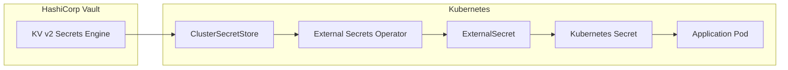

# Secrets Management Guide

> **Status**: Local/Dev environment using Vault (Dev Mode) + External Secrets Operator (ESO)
>
> **Target**: Standardized secret management across all microservices and infrastructure

---

## Overview

This project uses **HashiCorp Vault** as the source of truth for secrets, with **External Secrets Operator (ESO)** syncing secrets to Kubernetes. This approach:

- Centralizes secret management in Vault
- Eliminates plaintext secrets in Git (eventual goal)
- Provides audit trails for secret access
- Enables secret rotation without redeployment



---

## Architecture

### Components

| Component | Purpose | Namespace | Notes |
|-----------|---------|-----------|-------|
| Vault (Dev Mode) | Secret storage | `vault` | Ephemeral storage, `root` token |
| External Secrets Operator | Sync secrets to K8s | `external-secrets-system` | v0.13.0 |
| ClusterSecretStore | Vault connection config | cluster-scoped | `vault-dev` |
| ExternalSecret | Per-secret definition | app namespaces | Creates K8s Secrets |

### Vault Configuration

- **Mode**: Dev mode (no persistence, `root` token)
- **Auth Method**: Kubernetes (ServiceAccount-based)
- **Secrets Engine**: KV v2 at path `secret/`
- **Bootstrap**: Idempotent Job runs on each Vault restart

---

## Secret Paths (Vault)

All secrets are stored in Vault's KV v2 secrets engine under the `secret/` path.

### Database Credentials

| Vault Path | Description | Consumer |
|------------|-------------|----------|
| `secret/data/product/db` | Product DB credentials | product service |
| `secret/data/cart/db` | Cart DB credentials (transaction-db) | cart service |
| `secret/data/order/db` | Order DB credentials (transaction-db) | order service |

**Keys**: `username`, `password`

### Backup Credentials

| Vault Path | Description | Consumer |
|------------|-------------|----------|
| `secret/data/backups/rustfs` | RustFS S3 credentials | All DB clusters |

**Keys**: `access_key_id`, `secret_access_key`

### Pooler Credentials

| Vault Path | Description | Consumer |
|------------|-------------|----------|
| `secret/data/poolers/pgdog-product` | PgDog (product) credentials | pgdog-product pooler |
| `secret/data/poolers/pgcat-transaction` | PgCat (transaction) credentials | pgcat-transaction pooler |

**Keys (pgdog)**: `username`, `password`
**Keys (pgcat)**: `admin_username`, `admin_password`, `db_username`, `db_password`

---

## Kubernetes Secrets (ESO-managed)

### Naming Convention

ESO-managed secrets follow the pattern: `{original-name}-vault`

This enables **shadow-first migration**: new Vault-backed secrets coexist with original secrets until applications are switched over.

### Database Secrets

| K8s Secret | Namespace | Source | Status |
|------------|-----------|--------|--------|
| `product-db-secret-vault` | product | `secret/data/product/db` | Shadow |
| `transaction-db-secret-vault` | cart | `secret/data/cart/db` | Shadow |
| `transaction-db-secret-vault` | order | `secret/data/order/db` | Shadow |

### Backup Secrets

| K8s Secret | Namespace | Source | Key Format |
|------------|-----------|--------|------------|
| `pg-backup-rustfs-credentials-vault` | product | `secret/data/backups/rustfs` | CNPG format |
| `pg-backup-rustfs-credentials-vault` | cart | `secret/data/backups/rustfs` | CNPG format |
| `pg-backup-rustfs-credentials-vault` | auth | `secret/data/backups/rustfs` | WAL-G format |
| `pg-backup-rustfs-credentials-vault` | user | `secret/data/backups/rustfs` | WAL-G format |
| `pg-backup-rustfs-credentials-vault` | review | `secret/data/backups/rustfs` | WAL-G format |

**CNPG format**: `ACCESS_KEY_ID`, `ACCESS_SECRET_KEY`
**WAL-G format**: `AWS_ACCESS_KEY_ID`, `AWS_SECRET_ACCESS_KEY`

### Pooler Secrets

| K8s Secret | Namespace | Source | Status |
|------------|-----------|--------|--------|
| `pgdog-product-credentials-vault` | product | `secret/data/poolers/pgdog-product` | Available (not consumed) |
| `pgcat-transaction-credentials-vault` | cart | `secret/data/poolers/pgcat-transaction` | Available (not consumed) |

> **Note**: Pooler charts don't currently support `secretRef`. Secrets are created for future use.

---

## Migration Guide

### Current State

The project uses a **shadow-first migration strategy**:

1. **Original secrets** - Plaintext in Git (legacy)
2. **Shadow secrets** - Vault-backed via ESO (suffix `-vault`)

Applications currently use original secrets. Migration involves switching references.

### Switching an Application to Vault-backed Secrets

#### Step 1: Verify Shadow Secret Exists

```bash
# Check ExternalSecret status
kubectl get externalsecret -n <namespace>

# Verify secret was created
kubectl get secret <secret-name>-vault -n <namespace>

# Compare values (should match)
kubectl get secret <original-secret> -n <namespace> -o yaml
kubectl get secret <secret-name>-vault -n <namespace> -o yaml
```

#### Step 2: Update Application Reference

For `secretKeyRef`:

```yaml
# Before
env:
  - name: DB_PASSWORD
    valueFrom:
      secretKeyRef:
        name: product-db-secret
        key: password

# After
env:
  - name: DB_PASSWORD
    valueFrom:
      secretKeyRef:
        name: product-db-secret-vault  # Add -vault suffix
        key: password
```

For `envFrom`:

```yaml
# Before
envFrom:
  - secretRef:
      name: product-db-secret

# After
envFrom:
  - secretRef:
      name: product-db-secret-vault  # Add -vault suffix
```

#### Step 3: Test and Deploy

```bash
# Apply changes
flux reconcile kustomization apps-local --with-source

# Verify pod uses new secret
kubectl describe pod <pod-name> -n <namespace> | grep -A5 "Environment"
```

#### Step 4: (Optional) Remove Original Secret

After confirming Vault-backed secrets work, remove the plaintext secret from Git.

---

## Operations Guide

### Adding a New Secret

1. **Add to Vault bootstrap script**:

```bash
# In kubernetes/infra/configs/secrets/vault-bootstrap/configmap.yaml
vault kv put secret/<path> \
  key1="value1" \
  key2="value2"
```

2. **Create ExternalSecret**:

```yaml
# In kubernetes/infra/configs/secrets/external-secrets/<name>.yaml
apiVersion: external-secrets.io/v1beta1
kind: ExternalSecret
metadata:
  name: <secret-name>-vault
  namespace: <namespace>
spec:
  refreshInterval: 1h
  secretStoreRef:
    name: vault-dev
    kind: ClusterSecretStore
  target:
    name: <secret-name>-vault
  data:
    - secretKey: <k8s-key>
      remoteRef:
        key: secret/data/<path>
        property: <vault-key>
```

3. **Update kustomization**:

```yaml
# In kubernetes/infra/configs/secrets/external-secrets/kustomization.yaml
resources:
  - <name>.yaml
```

4. **Deploy**:

```bash
flux reconcile kustomization infrastructure-local --with-source
```

### Rotating a Secret

1. **Update in Vault**:

```bash
# Port-forward to Vault
kubectl port-forward svc/vault -n vault 8200:8200

# Update secret
export VAULT_ADDR=http://localhost:8200
export VAULT_TOKEN=root
vault kv put secret/<path> key="new-value"
```

2. **Wait for ESO sync** (default: 1 hour) or force refresh:

```bash
# Delete the K8s secret to trigger immediate re-sync
kubectl delete secret <secret-name>-vault -n <namespace>
```

3. **Restart affected pods**:

```bash
kubectl rollout restart deployment/<name> -n <namespace>
```

### Troubleshooting

#### ExternalSecret Not Syncing

```bash
# Check ExternalSecret status
kubectl get externalsecret -n <namespace> -o yaml

# Look for sync errors
kubectl describe externalsecret <name> -n <namespace>

# Verify ClusterSecretStore is ready
kubectl get clustersecretstore vault-dev
```

#### Vault Authentication Failing

```bash
# Check bootstrap job
kubectl logs job/vault-bootstrap -n vault

# Verify Vault Kubernetes auth
kubectl port-forward svc/vault -n vault 8200:8200
export VAULT_ADDR=http://localhost:8200
export VAULT_TOKEN=root
vault auth list
vault read auth/kubernetes/config
```

---

## File Reference

### Infrastructure Files

| File | Purpose |
|------|---------|
| `kubernetes/infra/controllers/secrets/vault/helmrelease.yaml` | Vault HelmRelease |
| `kubernetes/infra/controllers/secrets/external-secrets/helmrelease.yaml` | ESO HelmRelease |
| `kubernetes/infra/configs/secrets/vault-bootstrap/` | Vault bootstrap (Job, ConfigMap, SA) |
| `kubernetes/infra/configs/secrets/cluster-secret-store.yaml` | ClusterSecretStore |
| `kubernetes/infra/configs/secrets/external-secrets/` | ExternalSecret definitions |

### Helm Sources

| File | Purpose |
|------|---------|
| `kubernetes/clusters/local/sources/helm/hashicorp.yaml` | HashiCorp Helm repo |
| `kubernetes/clusters/local/sources/helm/external-secrets.yaml` | ESO Helm repo |

---

## Known Limitations

### Pooler Inline Passwords

**Issue**: PgDog and PgCat don't support `secretRef` in their Helm charts.

**Current State**: Inline passwords in HelmRelease/ConfigMap (dev-only, documented).

**Vault Secrets Available**:
- `pgdog-product-credentials-vault` (product namespace)
- `pgcat-transaction-credentials-vault` (cart namespace)

**Future Solutions**:
1. Request upstream chart support for `secretRef`
2. Implement initContainer-based config rendering
3. Switch to pooler that supports secrets (CNPG built-in PgBouncer)

### Dev Mode Vault

**Issue**: Vault dev mode loses all data on restart.

**Mitigation**: Idempotent bootstrap Job re-seeds secrets on every restart.

**Production**: Use persistent Vault with auto-unseal and HA.

---

## Security Considerations

### Local/Dev Environment

- Vault runs in dev mode with `root` token
- Secrets are seeded from bootstrap script (values in Git)
- Appropriate for development/testing only

### Production Recommendations

1. **Use persistent Vault** with proper storage backend
2. **Enable auto-unseal** (AWS KMS, Azure Key Vault, GCP KMS)
3. **Implement HA** with Raft or Consul storage
4. **Enable audit logging**
5. **Use AppRole or Kubernetes auth** with limited policies
6. **Rotate secrets regularly**
7. **Remove plaintext secrets from Git** after migration

---

## Related Documentation

- [External Secrets Operator Docs](https://external-secrets.io/)
- [HashiCorp Vault Docs](https://developer.hashicorp.com/vault/docs)
- [Vault Kubernetes Auth](https://developer.hashicorp.com/vault/docs/auth/kubernetes)
