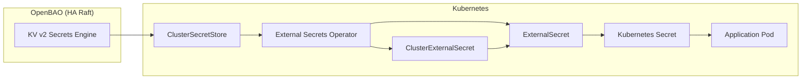

# Secrets Management Guide

> **Scope**: How application teams add, consume, and rotate secrets in this repo.
>
> For OpenBAO architecture (HA/Raft, seal, auth methods, secret engines, lease model) read [`README.md`](./README.md). For TLS read [`cert-manager.md`](./cert-manager.md) and [`trust-distribution.md`](./trust-distribution.md).

---

## Overview

This project uses **OpenBAO** (Apache 2.0 fork of HashiCorp Vault) as the source of truth for secrets, with **External Secrets Operator (ESO)** syncing secrets to Kubernetes. This approach:

- Centralizes secret management in OpenBAO
- Eliminates plaintext secrets in Git (eventual goal)
- Provides audit trails for secret access
- Enables secret rotation without redeployment
- Production-ready HA cluster (3-node Raft) — not dev mode



---

## Architecture

### Components

| Component | Purpose | Namespace | Version |
|-----------|---------|-----------|---------|
| OpenBAO (HA) | Secret storage (3-node Raft) | `openbao` | 2.5.2 (Chart 0.26.2) |
| External Secrets Operator | Sync secrets to K8s | `external-secrets-system` | **v2.1.0** |
| ClusterSecretStore | OpenBAO connection config | cluster-scoped | `openbao` |
| ClusterExternalSecret | Shared secrets across namespaces | cluster-scoped | Backup creds |
| ExternalSecret | Per-secret definition | app namespaces | Creates K8s Secrets |

### OpenBAO Configuration

- **Mode**: HA with Raft integrated storage (3 replicas, 10Gi PVC per node)
- **Auth Method**: Kubernetes (ServiceAccount-based via TokenReview API)
- **Secrets Engine**: KV v2 at path `secret/`
- **Audit Logging**: Stdout audit device (collected by Vector -> Loki)
- **Bootstrap**: Idempotent Job — init, unseal, configure on each deploy
- **Seal**: Shamir (1-share) for Kind; AWS KMS / GCP KMS for EKS/GKE

### Secret Organization (Hybrid Strategy)

Secrets are organized using a **hybrid strategy** for maintainability and scalability:

| Category | Location | Mechanism | Rationale |
|----------|----------|-----------|-----------|
| **DB credentials** | `configs/databases/clusters/*/secrets/` | ExternalSecret | Co-located with the DB cluster they serve |
| **Pooler credentials** | `configs/databases/clusters/*/secrets/` | ExternalSecret | Co-located with the pooler they serve |
| **Backup credentials** | `configs/secrets/cluster-external-secrets/` | ClusterExternalSecret | Shared across 5 namespaces via namespace labels |
| **Future shared secrets** | `configs/secrets/cluster-external-secrets/` | ClusterExternalSecret | Any secret needed by multiple namespaces |

---

## Path Naming Convention

All secret paths follow a standardized 4-level hierarchy:

```
secret/{environment}/{category}/{service-or-component}/{resource}
```

| Level | Values | Purpose |
|-------|--------|---------|
| `{environment}` | `local`, `staging`, `prod` | Environment isolation; same paths across envs |
| `{category}` | `databases`, `services`, `infra` | Top-level grouping; maps to policy templates |
| `{service-or-component}` | `auth`, `product`, `pgdog-cnpg`, `rustfs` | Specific service or infra component |
| `{resource}` | `credentials`, `jwt-signing-key`, `api-keys`, `backup-credentials` | Type of secret |

For the **full canonical KV catalog** (all paths currently seeded plus future-app placeholders) see [`README.md` §5.1 KV v2 — Static Secrets](./README.md#51-kv-v2--static-secrets).

> ⚠️ **Bootstrap-only secret**: `secret/local/infra/cloudflare/api-token` (key `api_token`) is operator-supplied and not in Git. Re-seed after every fresh cluster — see [Bootstrap-only secrets](#bootstrap-only-secrets) below.

---

## Kubernetes Secrets (ESO-managed)

### Naming Convention

ESO-managed secrets use the **same name** as the original secret they replace (e.g., `cnpg-db-secret`). The `managed-by: external-secrets` label identifies OpenBAO-backed secrets. No `-vault` suffix is used.

### Database Secrets (ExternalSecret per cluster)

| K8s Secret | Namespace | Source |
|------------|-----------|--------|
| `cnpg-db-secret` | product | `secret/data/local/databases/product/credentials` |
| `cnpg-db-cart-secret` | cart | `secret/data/local/databases/cart/credentials` |
| `cnpg-db-order-secret` | order | `secret/data/local/databases/order/credentials` |

### Backup Secrets (ClusterExternalSecret)

Backup credentials use **ClusterExternalSecret** with namespace labels to auto-deploy to all namespaces that need them:

| ClusterExternalSecret | Label Selector | Target Namespaces | Key Format |
|----------------------|----------------|-------------------|------------|
| `pg-backup-rustfs-cnpg` | `platform.duynhlab/backup: "cnpg"` | product, cart | CNPG/Barman: `ACCESS_KEY_ID`, `ACCESS_SECRET_KEY` |
| `pg-backup-rustfs-walg` | `platform.duynhlab/backup: "walg"` | auth, user, review | WAL-G: `AWS_ACCESS_KEY_ID`, `AWS_SECRET_ACCESS_KEY` |

**Adding backup credentials to a new namespace**: Add the appropriate label to the namespace in `kubernetes/infra/controllers/namespaces.yaml`:

```yaml
metadata:
  labels:
    platform.duynhlab/backup: "cnpg"   # For CloudNativePG clusters
    # or
    platform.duynhlab/backup: "walg"   # For Zalando/WAL-G clusters
```

**ResourceSet namespaces**: Microservice namespaces are also created by Flux **ResourceSet** templates under [`kubernetes/apps/domains/`](kubernetes/apps/domains/). If the `Namespace` resource there omits `platform.duynhlab/backup`, app reconciliation can overwrite metadata and **drop** the label from `controllers/namespaces.yaml`, so ClusterExternalSecret **stops** matching and `pg-backup-rustfs-credentials` is not created. Keep the label in the ResourceSet `Namespace` block (identity: fixed `walg`; catalog/checkout/comms: optional `platform_backup_label` in the ResourceSetInputProvider for `cnpg` where needed).

### Pooler Secrets

| K8s Secret | Namespace | Source | Status |
|------------|-----------|--------|--------|
| `pgdog-cnpg-credentials` | product | `secret/data/local/databases/pgdog-cnpg/credentials` | Available (not consumed) |

> **Note**: Pooler charts don't currently support `secretRef`. Secrets are created for future use.

### Infrastructure ExternalSecrets (per-namespace)

| K8s Secret | Namespace | Source path (OpenBAO) | Source key | K8s key |
|------------|-----------|-----------------------|------------|---------|
| `cloudflare-api-token` | `cert-manager` | `secret/data/local/infra/cloudflare/api-token` | `api_token` | `api-token` |

Defined at `kubernetes/infra/configs/secrets/cluster-external-secrets/cloudflare.yaml` (kind `ExternalSecret`, despite the directory name — the cert-manager ClusterIssuer only needs the Secret in one namespace).

---

## Monitoring

### ESO Metrics

External Secrets Operator exposes Prometheus metrics, scraped by the `external-secrets` ServiceMonitor in the `monitoring` namespace.

**Key metrics to monitor:**

| Metric | Description | Alert Threshold |
|--------|-------------|-----------------|
| `externalsecret_sync_calls_error_total` | Total sync failures | Any increase |
| `externalsecret_status_condition{condition="Ready",status="False"}` | Unhealthy ExternalSecrets | Any value > 0 |
| `externalsecret_reconcile_duration` | Reconcile latency | p99 > 30s |

**Verify ESO sync status:**

```bash
kubectl get externalsecret -A
kubectl get clusterexternalsecret
kubectl get clustersecretstore
```

---

## Operations Guide

### Adding a New Secret

1. **Add to OpenBAO bootstrap script** (`openbao-bootstrap/configmap.yaml`):

```bash
# Follow path convention: secret/{env}/{category}/{service}/{resource}
bao kv put secret/local/services/my-service/credentials key1="value1" key2="value2"
```

2. **Create ExternalSecret** (for namespace-specific secrets):

```yaml
apiVersion: external-secrets.io/v1
kind: ExternalSecret
metadata:
  name: <secret-name>
  namespace: <namespace>
spec:
  refreshInterval: 1h
  secretStoreRef:
    name: openbao
    kind: ClusterSecretStore
  target:
    name: <secret-name>
    creationPolicy: Owner
    deletionPolicy: Retain
  data:
    - secretKey: <k8s-key>
      remoteRef:
        key: secret/data/local/<category>/<service>/<resource>
        property: <openbao-key>
```

3. **Or use ClusterExternalSecret** (for secrets shared across namespaces):

```yaml
apiVersion: external-secrets.io/v1
kind: ClusterExternalSecret
metadata:
  name: <secret-name>
spec:
  namespaceSelector:
    matchLabels:
      <label-key>: <label-value>
  refreshTime: 1h
  externalSecretSpec:
    refreshInterval: 1h
    secretStoreRef:
      name: openbao
      kind: ClusterSecretStore
    target:
      name: <secret-name>
    data:
      - secretKey: <k8s-key>
        remoteRef:
          key: secret/data/local/<category>/<component>/<resource>
          property: <openbao-key>
```

4. **Deploy**: `make flux-push && make flux-sync`

### Bootstrap-only secrets

A few secrets are **operator-supplied** — they are not in Git and not seeded by the OpenBAO bootstrap script, so they must be re-applied after every fresh cluster:

| Path | Why | Used by |
|---|---|---|
| `secret/local/infra/cloudflare/api-token` (key `api_token`) | API tokens are personal credentials, must not be committed | cert-manager `letsencrypt-prod` / `letsencrypt-staging` ClusterIssuers → `kong-proxy-tls` |

```bash
ROOT=$(kubectl get secret -n openbao openbao-init-keys -o jsonpath='{.data.root_token}' | base64 -d)
kubectl exec -n openbao openbao-0 -- sh -c \
  "BAO_TOKEN=$ROOT bao kv put secret/local/infra/cloudflare/api-token api_token=cfut_..."
flux reconcile ks secrets-local --with-source
flux reconcile ks cert-manager-local --with-source
```

If cert-manager already failed waiting for the Secret, also force ESO to re-sync immediately:

```bash
kubectl annotate clustersecretstore openbao force-sync=$(date +%s) --overwrite
kubectl rollout restart deploy/cert-manager -n cert-manager
```

Long-term mitigation options are tracked in [`tamsu.md`](../../tamsu.md) (combination of a local `~/.homelab/secrets.env` bootstrap script + persisting the OpenBAO PVC across `make down`).

### Rotating a Secret

1. **Update in OpenBAO**:

```bash
kubectl port-forward svc/openbao -n openbao 8200:8200
export BAO_ADDR=http://localhost:8200
export BAO_TOKEN=$(kubectl get secret openbao-init-keys -n openbao -o jsonpath='{.data.root_token}' | base64 -d)
bao kv put secret/local/<category>/<service>/<resource> key="new-value"
```

2. **Wait for ESO sync** (default: 1 hour) or force refresh:

```bash
kubectl annotate es <name> -n <namespace> force-sync=$(date +%s) --overwrite
```

3. **Restart affected pods**:

```bash
kubectl rollout restart deployment/<name> -n <namespace>
```

### Troubleshooting

#### ExternalSecret Not Syncing

```bash
kubectl get externalsecret -n <namespace> -o yaml
kubectl describe externalsecret <name> -n <namespace>
kubectl get clustersecretstore openbao
```

#### OpenBAO Authentication Failing (`permission denied` from ESO ~1h after bootstrap)

Reviewer-JWT pitfall (commit `fb14349`) — root cause + runtime fix + persistent fix are documented in [`README.md` §13 — Authentication Failing](./README.md#authentication-failing). Also covers general K8s auth checks.

#### OpenBAO Sealed After Restart

See [`README.md` §12.2 Unseal After Node Restart](./README.md#122-unseal-after-node-restart).

---

## File Reference

See [`README.md` §16 File Reference](./README.md#16-file-reference) for the canonical list of OpenBAO + ESO + cert-manager files.

---

## Known Limitations

### Pooler Inline Passwords

**Issue**: PgDog and PgCat don't support `secretRef` in their Helm charts.

**Current State**: Inline passwords in HelmRelease/ConfigMap (dev-only, documented).

**OpenBAO Secrets Available**:
- `pgdog-cnpg-credentials` (product namespace)

**Future Solutions**:
1. Request upstream chart support for `secretRef`
2. Implement initContainer-based config rendering
3. Switch to pooler that supports secrets (CNPG built-in PgBouncer)

---

## Production Roadmap

### Phase 1: Dynamic Database Secrets

Use OpenBAO's database secrets engine to generate short-lived PostgreSQL credentials on demand (eliminates static passwords entirely).

### Phase 2: Auto-Unseal (EKS/GKE)

Replace Shamir with cloud KMS for automatic unseal:
- AWS KMS for EKS
- GCP Cloud KMS for GKE

### Phase 3: Advanced Patterns

- **PushSecret**: Push operator-generated secrets back to OpenBAO for centralized visibility
- **Secret scanning**: Pre-commit hooks (`gitleaks`, `trufflehog`) in CI pipeline
- **Namespace-scoped SecretStore**: Replace ClusterSecretStore with per-namespace SecretStore for team isolation
- **OIDC Auth + Identity Groups**: Dev/data team access patterns with 90-day rotation

---

## Security Considerations

### Local/Dev Environment

- OpenBAO runs in HA mode with Shamir seal (1 share, stored in K8s Secret)
- Secrets are seeded from bootstrap script (values in Git for local dev)
- Unseal key in `openbao-init-keys` Secret — for Kind only

### Production Recommendations

1. Use auto-unseal (AWS KMS, GCP KMS) — never store unseal keys in K8s
2. Enable TLS via cert-manager
3. Restrict root token access; use AppRole or Kubernetes auth
4. Enable audit logging to SIEM
5. Rotate secrets regularly (90-day policy for service credentials)
6. Remove plaintext secrets from Git after migration

---

## Related Documentation

- [OpenBAO Architecture & Operations](./README.md) — the canonical reference for OpenBAO internals
- [cert-manager](./cert-manager.md) — consumes the `cloudflare-api-token` Secret synced here
- [Trust Distribution](./trust-distribution.md) — distributes the homelab CA bundle
- [OpenBAO Production Plan](./production-plan.md) — EKS/GKE roadmap
- [Secrets Backlog (P1/P2)](./backlog.md) — pending improvements
- [External Secrets Operator Docs](https://external-secrets.io/)
- [OpenBAO Docs](https://openbao.org/docs/)
