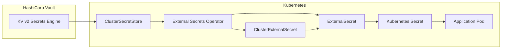

# Secrets Management Guide

> **Status**: Local/Dev environment using Vault (Dev Mode) + External Secrets Operator (ESO)
>
> **Target**: Standardized secret management across all microservices and infrastructure

---

## Overview

This project uses **HashiCorp Vault** as the source of truth for secrets, with **External Secrets Operator (ESO)** syncing secrets to Kubernetes. This approach:

- Centralizes secret management in Vault
- Eliminates plaintext secrets in Git (eventual goal)
- Provides audit trails for secret access
- Enables secret rotation without redeployment



---

## Architecture

### Components

| Component | Purpose | Namespace | Version |
|-----------|---------|-----------|---------|
| Vault (Dev Mode) | Secret storage | `vault` | 0.32.0 (Helm) |
| External Secrets Operator | Sync secrets to K8s | `external-secrets-system` | **v2.0.0** |
| ClusterSecretStore | Vault connection config | cluster-scoped | `vault-dev` |
| ClusterExternalSecret | Shared secrets across namespaces | cluster-scoped | Backup creds |
| ExternalSecret | Per-secret definition | app namespaces | Creates K8s Secrets |

### Vault Configuration

- **Mode**: Dev mode (no persistence, `root` token)
- **Auth Method**: Kubernetes (ServiceAccount-based)
- **Secrets Engine**: KV v2 at path `secret/`
- **Audit Logging**: File audit device to stdout (collected by Vector -> Loki)
- **Bootstrap**: Idempotent Job runs on each Vault restart

### Secret Organization (Hybrid Strategy)

Secrets are organized using a **hybrid strategy** for maintainability and scalability:

| Category | Location | Mechanism | Rationale |
|----------|----------|-----------|-----------|
| **DB credentials** | `configs/databases/clusters/*/secrets/` | ExternalSecret | Co-located with the DB cluster they serve |
| **Pooler credentials** | `configs/databases/clusters/*/secrets/` | ExternalSecret | Co-located with the pooler they serve |
| **Backup credentials** | `configs/secrets/cluster-external-secrets/` | ClusterExternalSecret | Shared across 5 namespaces via namespace labels |
| **Future shared secrets** | `configs/secrets/cluster-external-secrets/` | ClusterExternalSecret | Any secret needed by multiple namespaces |

---

## Path Naming Convention

All Vault paths follow a standardized 4-level hierarchy based on [HashiCorp recommended patterns](https://developer.hashicorp.com/vault/tutorials/recommended-patterns/pattern-centralized-secrets):

```
secret/{environment}/{category}/{service-or-component}/{resource}
```

| Level | Values | Purpose |
|-------|--------|---------|
| `{environment}` | `local`, `staging`, `prod` | Environment isolation; same paths across envs |
| `{category}` | `databases`, `services`, `infra` | Top-level grouping; maps to Vault policy templates |
| `{service-or-component}` | `auth`, `product`, `pgdog-product`, `rustfs` | Specific service or infra component |
| `{resource}` | `credentials`, `jwt-signing-key`, `api-keys`, `backup-credentials` | Type of secret |

This convention enables:

- **Granular Vault policies** per category (e.g., `secret/data/+/databases/*`)
- **Multi-environment** with the same paths (just swap `local` for `prod`)
- **Scalable onboarding** -- new services follow the same pattern
- **Self-documenting** -- the path tells you what, where, and why

## Secret Paths (Vault)

All secrets are stored in Vault's KV v2 secrets engine under the `secret/` path.

### Database Credentials

| Vault Path | Description | Consumer |
|------------|-------------|----------|
| `secret/local/databases/product/credentials` | Product DB credentials | product service |
| `secret/local/databases/cart/credentials` | Cart DB credentials (transaction-shared-db) | cart service |
| `secret/local/databases/order/credentials` | Order DB credentials (transaction-shared-db) | order service |

**Keys**: `username`, `password`

### Infrastructure Credentials

| Vault Path | Description | Consumer |
|------------|-------------|----------|
| `secret/local/infra/rustfs/backup-zalando` | RustFS S3 credentials (SA: backup-zalando, bucket: pg-backups-zalando) | Zalando clusters (auth-db, supporting-shared-db) |
| `secret/local/infra/rustfs/backup-cnpg` | RustFS S3 credentials (SA: backup-cnpg, bucket: pg-backups-cnpg) | CNPG clusters (product-db, transaction-shared-db) |

**Keys**: `access_key_id`, `secret_access_key`

### Pooler Credentials

| Vault Path | Description | Consumer |
|------------|-------------|----------|
| `secret/local/databases/pgdog-product/credentials` | PgDog (product) credentials | pgdog-product pooler |
| `secret/local/databases/pgcat-transaction/credentials` | PgCat (transaction) credentials | pgcat-transaction pooler |

**Keys (pgdog)**: `username`, `password`
**Keys (pgcat)**: `admin_username`, `admin_password`, `db_username`, `db_password`

### Future App Secrets (Ready for Onboarding)

| Vault Path | Use Case |
|------------|----------|
| `secret/local/services/auth/jwt-signing-key` | JWT signing key for auth service |
| `secret/local/services/notification/smtp-credentials` | Email provider credentials |
| `secret/local/services/product/stripe-api-key` | Payment integration |
| `secret/local/infra/otel-collector/api-token` | Observability infra |
| `secret/prod/services/auth/jwt-signing-key` | Same secret, production env |

---

## Kubernetes Secrets (ESO-managed)

### Naming Convention

ESO-managed secrets use the **same name** as the original secret they replace (e.g., `product-db-secret`). The `managed-by: external-secrets` label identifies Vault-backed secrets. No `-vault` suffix is used.

### Database Secrets (ExternalSecret per cluster)

| K8s Secret | Namespace | Source |
|------------|-----------|--------|
| `product-db-secret` | product | `secret/data/local/databases/product/credentials` |
| `transaction-shared-db-secret` | cart | `secret/data/local/databases/cart/credentials` |
| `transaction-shared-db-secret` | order | `secret/data/local/databases/order/credentials` |

### Backup Secrets (ClusterExternalSecret)

Backup credentials use **ClusterExternalSecret** with namespace labels to auto-deploy to all namespaces that need them:

| ClusterExternalSecret | Label Selector | Target Namespaces | Key Format |
|----------------------|----------------|-------------------|------------|
| `pg-backup-rustfs-cnpg` | `platform.duynhne/backup: "cnpg"` | product, cart | CNPG/Barman: `ACCESS_KEY_ID`, `ACCESS_SECRET_KEY` |
| `pg-backup-rustfs-walg` | `platform.duynhne/backup: "walg"` | auth, user, review | WAL-G: `AWS_ACCESS_KEY_ID`, `AWS_SECRET_ACCESS_KEY` |

**Adding backup credentials to a new namespace**: Add the appropriate label to the namespace in `namespaces.yaml`:

```yaml
metadata:
  labels:
    platform.duynhne/backup: "cnpg"   # For CloudNativePG clusters
    # or
    platform.duynhne/backup: "walg"   # For Zalando/WAL-G clusters
```

### Pooler Secrets

| K8s Secret | Namespace | Source | Status |
|------------|-----------|--------|--------|
| `pgdog-product-credentials` | product | `secret/data/local/databases/pgdog-product/credentials` | Available (not consumed) |
| `pgcat-transaction-credentials` | cart | `secret/data/local/databases/pgcat-transaction/credentials` | Available (not consumed) |

> **Note**: Pooler charts don't currently support `secretRef`. Secrets are created for future use.

---

## Monitoring

### ESO Metrics

External Secrets Operator exposes Prometheus metrics, scraped by the `external-secrets` ServiceMonitor in the `monitoring` namespace.

**Key metrics to monitor:**

| Metric | Description | Alert Threshold |
|--------|-------------|-----------------|
| `externalsecret_sync_calls_error_total` | Total sync failures | Any increase |
| `externalsecret_status_condition{condition="Ready",status="False"}` | Unhealthy ExternalSecrets | Any value > 0 |
| `externalsecret_reconcile_duration` | Reconcile latency | p99 > 30s |

**Verify ESO sync status:**

```bash
kubectl get externalsecret -A
kubectl get clusterexternalsecret
kubectl get clustersecretstore
```

---

## Migration Guide

### Current State

All database and backup secrets are Vault-backed via ESO. Secrets use the same name as the resource they serve (no `-vault` suffix).

### Switching an Application to Vault-backed Secrets

#### Step 1: Verify ExternalSecret is Synced

```bash
kubectl get externalsecret -n <namespace>
kubectl get secret <secret-name> -n <namespace> -o yaml
```

#### Step 2: Update Application Reference

For `secretKeyRef`:

```yaml
# Before
env:
  - name: DB_PASSWORD
    valueFrom:
      secretKeyRef:
        name: product-db-secret
        key: password

# After (ExternalSecret creates the same secret name, no suffix needed)
env:
  - name: DB_PASSWORD
    valueFrom:
      secretKeyRef:
        name: product-db-secret  # Vault-backed via ExternalSecret
        key: password
```

#### Step 3: Test and Deploy

```bash
flux reconcile kustomization apps-local --with-source

kubectl describe pod <pod-name> -n <namespace> | grep -A5 "Environment"
```

#### Step 4: (Optional) Remove Original Secret

After confirming Vault-backed secrets work, remove the plaintext secret from Git.

---

## Operations Guide

### Adding a New Secret

1. **Add to Vault bootstrap script** (`vault-bootstrap/configmap.yaml`):

```bash
# Follow path convention: secret/{env}/{category}/{service}/{resource}
vault kv put secret/local/services/my-service/credentials key1="value1" key2="value2"
```

2. **Create ExternalSecret** (for namespace-specific secrets):

```yaml
apiVersion: external-secrets.io/v1
kind: ExternalSecret
metadata:
  name: <secret-name>
  namespace: <namespace>
spec:
  refreshInterval: 1h
  secretStoreRef:
    name: vault-dev
    kind: ClusterSecretStore
  target:
    name: <secret-name>
    creationPolicy: Owner
    deletionPolicy: Retain
  data:
    - secretKey: <k8s-key>
      remoteRef:
        key: secret/data/local/<category>/<service>/<resource>
        property: <vault-key>
```

3. **Or use ClusterExternalSecret** (for secrets shared across namespaces):

```yaml
apiVersion: external-secrets.io/v1
kind: ClusterExternalSecret
metadata:
  name: <secret-name>
spec:
  namespaceSelector:
    matchLabels:
      <label-key>: <label-value>
  refreshTime: 1h
  externalSecretSpec:
    refreshInterval: 1h
    secretStoreRef:
      name: vault-dev
      kind: ClusterSecretStore
    target:
      name: <secret-name>
    data:
      - secretKey: <k8s-key>
        remoteRef:
          key: secret/data/local/<category>/<component>/<resource>
          property: <vault-key>
```

4. **Deploy**: `make flux-push && make flux-sync`

### Rotating a Secret

1. **Update in Vault**:

```bash
kubectl port-forward svc/vault -n vault 8200:8200
export VAULT_ADDR=http://localhost:8200
export VAULT_TOKEN=root
vault kv put secret/local/<category>/<service>/<resource> key="new-value"
```

2. **Wait for ESO sync** (default: 1 hour) or force refresh:

```bash
kubectl annotate es <name> -n <namespace> force-sync=$(date +%s) --overwrite
```

3. **Restart affected pods**:

```bash
kubectl rollout restart deployment/<name> -n <namespace>
```

### Troubleshooting

#### ExternalSecret Not Syncing

```bash
kubectl get externalsecret -n <namespace> -o yaml
kubectl describe externalsecret <name> -n <namespace>
kubectl get clustersecretstore vault-dev
```

#### Vault Authentication Failing

```bash
kubectl logs job/vault-bootstrap -n vault
kubectl port-forward svc/vault -n vault 8200:8200
export VAULT_ADDR=http://localhost:8200
export VAULT_TOKEN=root
vault auth list
vault read auth/kubernetes/config
```

---

## File Reference

### Infrastructure Files

| File | Purpose |
|------|---------|
| `kubernetes/infra/controllers/secrets/vault/helmrelease.yaml` | Vault HelmRelease |
| `kubernetes/infra/controllers/secrets/external-secrets/helmrelease.yaml` | ESO HelmRelease (v2.0.0) |
| `kubernetes/infra/configs/secrets/vault-bootstrap/` | Vault bootstrap (Job, ConfigMap, SA) |
| `kubernetes/infra/configs/secrets/cluster-secret-store.yaml` | ClusterSecretStore |
| `kubernetes/infra/configs/secrets/cluster-external-secrets/` | ClusterExternalSecret definitions |
| `kubernetes/infra/configs/databases/clusters/*/secrets/` | Per-cluster ExternalSecret definitions |
| `kubernetes/infra/configs/monitoring/servicemonitors/external-secrets.yaml` | ESO metrics ServiceMonitor |

### Helm Sources

| File | Purpose |
|------|---------|
| `kubernetes/clusters/local/sources/helm/hashicorp.yaml` | HashiCorp Helm repo |
| `kubernetes/clusters/local/sources/helm/external-secrets.yaml` | ESO Helm repo |

---

## Known Limitations

### Pooler Inline Passwords

**Issue**: PgDog and PgCat don't support `secretRef` in their Helm charts.

**Current State**: Inline passwords in HelmRelease/ConfigMap (dev-only, documented).

**Vault Secrets Available**:
- `pgdog-product-credentials` (product namespace)
- `pgcat-transaction-credentials` (cart namespace)

**Future Solutions**:
1. Request upstream chart support for `secretRef`
2. Implement initContainer-based config rendering
3. Switch to pooler that supports secrets (CNPG built-in PgBouncer)

### Dev Mode Vault

**Issue**: Vault dev mode loses all data on restart.

**Mitigation**: Idempotent bootstrap Job re-seeds secrets on every restart.

**Production**: Use persistent Vault with auto-unseal and HA (see [Production Readiness Roadmap](#production-readiness-roadmap)).

---

## Production Readiness Roadmap

Reference patterns from large-scale companies (Uber: 150K secrets/5K+ microservices, Spotify: 4K+ microservices).

### Phase 1: Vault Persistence (Standalone Mode)

Switch from dev mode to persistent Vault with Raft integrated storage:

```yaml
server:
  dev:
    enabled: false
  standalone:
    enabled: true
  dataStorage:
    enabled: true
    size: 10Gi
```

### Phase 2: Auto-Unseal

Configure cloud KMS for automatic unseal (eliminates manual key management):

- AWS KMS
- GCP Cloud KMS
- Azure Key Vault

### Phase 3: HA with Raft

Deploy 3-5 Vault nodes with integrated Raft storage for high availability:

```yaml
server:
  ha:
    enabled: true
    raft:
      enabled: true
      config: |
        storage "raft" { ... }
```

### Phase 4: Dynamic Secrets

Use Vault's database secrets engine to generate short-lived credentials on demand (eliminates static passwords entirely). This is the approach used by Spotify and other large-scale platforms.

### Phase 5: Advanced Patterns

- **PushSecret**: Push operator-generated secrets back to Vault for centralized visibility
- **Secret scanning**: Pre-commit hooks (`gitleaks`, `trufflehog`) in CI pipeline
- **Namespace-scoped SecretStore**: Replace ClusterSecretStore with per-namespace SecretStore for team isolation
- **Audit logging**: Enable Vault audit device for compliance

---

## Security Considerations

### Local/Dev Environment

- Vault runs in dev mode with `root` token
- Secrets are seeded from bootstrap script (values in Git)
- Appropriate for development/testing only

### Production Recommendations

1. Use persistent Vault with proper storage backend
2. Enable auto-unseal (AWS KMS, Azure Key Vault, GCP KMS)
3. Implement HA with Raft or Consul storage
4. Enable audit logging
5. Use AppRole or Kubernetes auth with limited policies
6. Rotate secrets regularly
7. Remove plaintext secrets from Git after migration

---

## Related Documentation

- [Vault Architecture & Bootstrap](./vault.md)
- [Secrets Backlog (P1/P2)](./backlog.md) - Detailed specs for pending improvements
- [External Secrets Operator Docs](https://external-secrets.io/)
- [HashiCorp Vault Docs](https://developer.hashicorp.com/vault/docs)
- [Vault Kubernetes Auth](https://developer.hashicorp.com/vault/docs/auth/kubernetes)
