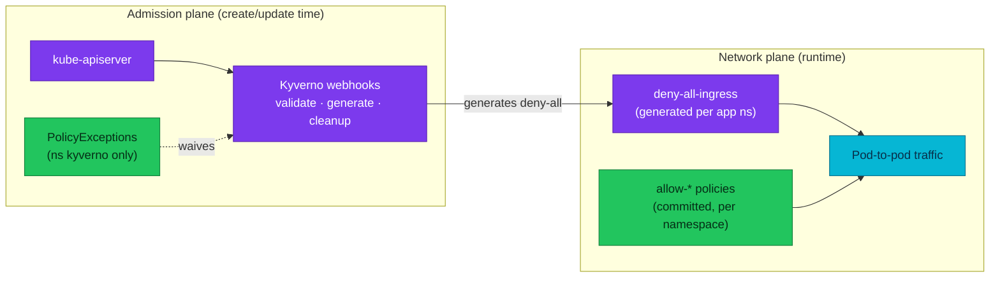

# Security: Admission & Segmentation

The platform's two runtime fences: **Kyverno** decides what may be admitted
(policy-as-code at the API server), **NetworkPolicy** decides who may talk to
whom once admitted (east-west micro-segmentation on kindnet, which enforces).

## Quick facts

| | |
|---|---|
| Admission engine | Kyverno (chart `3.8.2`, single-replica controllers on Kind) |
| Policies | 8 deployed (mostly Audit; `disallow-default-namespace` Enforce) + 3 planned — [catalog](policy-catalog.md) |
| PSS | `pss-baseline` Audit cluster-wide; `pss-restricted-apps` **disabled 2026-08-17** — [known gaps](policy-catalog.md#known-gaps--history) |
| Exceptions | 2 registered, owner + expiry mandatory, accepted only from ns `kyverno` — [registry](policy-exceptions.md) |
| Segmentation | 26 committed NetworkPolicies (12 namespaces) + floci fence + Kyverno-generated `deny-all-ingress` per app namespace — [caller matrix](network-policies.md) |
| Verification | `make validate` · `scripts/edge-isolation-sweep.sh` · `scripts/db-isolation-sweep.sh` |

## What to read

| Need | Doc |
|---|---|
| Which Kyverno policies run, in which mode, and the manifest acceptance criteria | [policy-catalog.md](policy-catalog.md) |
| Waive a policy for a workload (owner, expiry, registry contract) | [policy-exceptions.md](policy-exceptions.md) |
| Who may call whom: caller matrix, allowed-ingress topology, GitOps wiring | [network-policies.md](network-policies.md) |

## The two planes

## References

- [AGENTS.md § Kyverno admission rules](../../AGENTS.md) — the operative contract for every manifest
- [docs/platform/kyverno.md](../platform/kyverno.md) — controller deployment, rollout history
- [docs/api/api.md § edge exposure](../api/api.md) — audience doctrine the fences implement

---
_Last updated: 2026-08-19 — hub created (the folder was the last docs area without one)._
