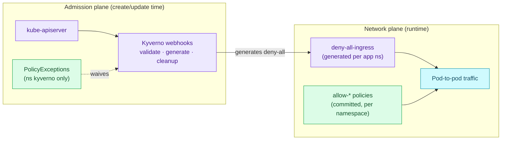

# Security: Admission & Segmentation

The platform's two runtime fences: **Kyverno** decides what may be admitted
(policy-as-code at the API server), **NetworkPolicy** decides who may talk to
whom once admitted (east-west micro-segmentation on kindnet, which enforces).

## Quick facts

| | |
|---|---|
| Admission engine | Kyverno (chart `3.9.1`, engine v1.19.1, single-replica controllers on Kind) |
| Policies | 7 deployed (Audit, except `disallow-default-namespace` which Enforces) + 1 disabled + 3 planned — [catalog](policy-catalog.md) |
| PSS | baseline Audit cluster-wide (ten CEL ValidatingPolicies under `cluster-policies/pss-baseline/`, ADR-078); `pss-restricted-apps` **disabled 2026-08-17** — [known gaps](policy-catalog.md#known-gaps--history) |
| Exceptions | none active (the last two were removed as inert on 2026-09-30, ADR-078 step 3); owner + expiry mandatory, accepted only from ns `kyverno` — [registry](policy-exceptions.md) |
| Segmentation | 15 committed NetworkPolicies (12 namespaces) + floci fence + Kyverno-generated `deny-all-ingress` per app namespace (its only owner) — [caller matrix](network-policies.md) |
| Verification | `make validate` · `scripts/edge-isolation-sweep.sh` · `scripts/db-isolation-sweep.sh` |

## What to read

| Need | Doc |
|---|---|
| Which Kyverno policies run, in which mode, and the manifest acceptance criteria | [policy-catalog.md](policy-catalog.md) |
| Waive a policy for a workload (owner, expiry, registry contract) | [policy-exceptions.md](policy-exceptions.md) |
| Who may call whom: caller matrix, allowed-ingress topology, GitOps wiring | [network-policies.md](network-policies.md) |

## The two planes

```mermaid
flowchart LR
    subgraph admission ["Admission plane (create/update time)"]
        api["kube-apiserver"]:::platform
        kyverno["Kyverno webhooks<br/>validate · generate · cleanup"]:::platform
        exc["PolicyExceptions<br/>(ns kyverno only)"]:::data
        api --> kyverno
        exc -.->|"waives"| kyverno
    end

    subgraph network ["Network plane (runtime)"]
        deny["deny-all-ingress<br/>(generated per app ns)"]:::platform
        allow["allow-* policies<br/>(committed, per namespace)"]:::data
        traffic["Pod-to-pod traffic"]:::service
        deny --> traffic
        allow --> traffic
    end

    kyverno -->|"generates deny-all"| deny

    classDef service fill:#cffafe,color:#164e63,stroke:#0891b2;
    classDef platform fill:#ede9fe,color:#4c1d95,stroke:#7c3aed;
    classDef data fill:#dcfce7,color:#14532d,stroke:#16a34a;
```

## References

- [AGENTS.md § Kyverno admission rules](../../AGENTS.md) — the operative contract for every manifest
- [docs/platform/kyverno.md](../platform/kyverno.md) — controller deployment, rollout history
- [docs/api/api.md § edge exposure](../api/api.md) — audience doctrine the fences implement
- [docs/platform/keycloak.md](../platform/keycloak.md) — the identity provider: its NetworkPolicy, exposed login surface, and credential handling
- [docs/api/identity.md](../api/identity.md) — where a token is verified, and why the edge is not authoritative
