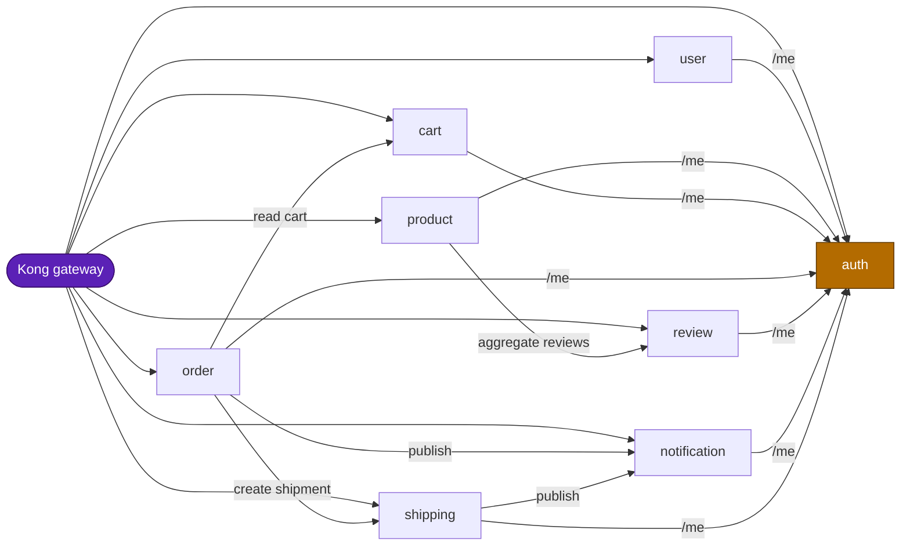
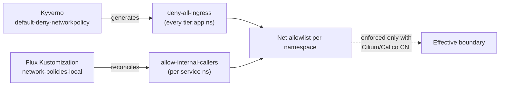

# NetworkPolicies — east-west micro-segmentation

| Attribute | Value |
|-----------|-------|
| **Status** | **Implemented (authored-ready)** — manifests reconciled by Flux; **inert on kindnet** until an enforcing CNI is installed |
| **Scope** | Ingress fencing between app-tier namespaces (`:8080` HTTP) |
| **Purpose** | Make the cluster the fence for `internal` audiences — internal routes are reachable only from explicitly allowed namespaces, not merely "absent from the Ingress" |
| **Last updated** | 2026-05-31 |
| **Related** | [`policy-catalog.md`](policy-catalog.md) (Kyverno catalog), [`../api/api-naming-convention.md`](../api/api-naming-convention.md) (audiences), [`../api/grpc-internal-comms.md`](../api/grpc-internal-comms.md) (gRPC `:9090`, Phase 3 adds NetworkPolicy for it) |

## TL;DR

- Every app namespace runs a **two-policy** stack: a `deny-all-ingress` baseline
  plus an `allow-internal-callers` allowlist. NetworkPolicies are **additive**, so
  the net effect is: *only* the namespaces named in `allow-internal-callers` can
  reach the pods on `:8080`; everything else is dropped.
- The allowlist is **per-callee** and follows the real call graph — `auth` accepts
  every service (it serves `/me`), while `shipping` accepts only `kong` + `order`.
- **kindnet does not enforce NetworkPolicy.** The manifests are authored ready and
  become effective the moment an enforcing CNI (Cilium / Calico) replaces kindnet.
  Treat them as the *declared* boundary, not an *active* one on the local Kind cluster.
- Policies currently fence **HTTP `:8080` only**. The gRPC `:9090` port is **not**
  covered yet — that is [gRPC roadmap Phase 3](../api/grpc-internal-comms.md#7-phased-roadmap).

---

## 1. The two-layer model

| Layer | Resource | Selector | Effect |
|-------|----------|----------|--------|
| Baseline | `deny-all-ingress` | `podSelector: {}` (all pods), `policyTypes: [Ingress]`, no rules | Once any policy selects a pod, **all** ingress is denied unless another policy allows it. |
| Allowlist | `allow-internal-callers` | `podSelector: {}`, ingress `from` a fixed set of `namespaceSelector`s on `:8080` | Adds the permitted sources back. |

Because Kubernetes evaluates NetworkPolicies as a **union (logical OR)**, the
combination resolves to a strict allowlist:

The baseline `deny-all-ingress` is also **generated automatically** into every
`platform.duynhlab.dev/tier: app` namespace by the Kyverno `default-deny-networkpolicy`
ClusterPolicy (`generateExisting: true`, `synchronize: true`), so a new app namespace
is fenced by default even before its explicit allow policy lands.

---

## 2. Caller matrix

Allowed **ingress** callers per callee (all on TCP `:8080`). `kong` is always
allowed (north-south gateway traffic); the rest mirror the east-west call graph.

| Callee | Allowed callers | Why |
|--------|-----------------|-----|
| **auth** | `kong` + **all 8 services** (incl. self) | Every service validates JWTs at `GET /auth/v1/private/me`. |
| **user** | `kong` | Browser-only today; no service-to-service caller. |
| **product** | `kong` | Browser-only; aggregates *outward* to review. |
| **cart** | `kong`, `order` | `order` reads the cart during checkout. |
| **order** | `kong` | Browser-only inbound; calls *out* to cart/shipping/notification/auth. |
| **review** | `kong`, `product` | `product` aggregates reviews into product details. |
| **notification** | `kong`, `order`, `shipping` | Both publish notifications (order-created, shipment updates). |
| **shipping** | `kong`, `order` | `order` looks up / creates shipments. |

> The matrix is **deny-by-default**: a caller not listed for a callee cannot reach
> it, even within the cluster. Adding a new east-west call means adding the caller's
> namespace to the callee's `allow-internal-callers` — not just opening an Ingress.

---

## 3. Allowed-ingress topology

Solid edges = explicit east-west allows; `auth` is the JWT-validation hub (every
service is permitted to it for `/me`); `kong` is permitted to every service.

> Edges are **ingress allows**, drawn caller → callee. Every edge is TCP `:8080`.
> Internal-audience routes (`notify/*`, shipping internal lookups) ride these same
> hops — the NetworkPolicy is the fence, never an Ingress rule.

---

## 4. How it is wired (GitOps)

- **Manifests:** `kubernetes/infra/configs/network-policies/{auth,user,product,cart,order,review,notification,shipping}.yaml`
  (+ `kustomization.yaml`). Each file holds `deny-all-ingress` + `allow-internal-callers`.
- **Generated baseline:** `kubernetes/infra/configs/kyverno/cluster-policies/default-deny-networkpolicy.yaml`.
- **Reconciliation:** Flux Kustomization `network-policies-local`
  (`kubernetes/clusters/local/network-policies.yaml`), `path: ./configs/network-policies`,
  `prune: true`, `wait: true`, `dependsOn: controllers-local` (namespaces must exist first).

### Adding or changing an allowed caller

1. Edit the **callee's** file under `kubernetes/infra/configs/network-policies/`,
   add a `namespaceSelector` for the caller's namespace under
   `allow-internal-callers.spec.ingress[0].from`.
2. `make validate` then `make flux-push` (or `make sync`); Flux reconciles.
3. Update the [caller matrix](#2-caller-matrix) and the [topology diagram](#3-allowed-ingress-topology) above.

---

## 5. Known limitations

- **Not enforced on kindnet.** The local Kind cluster's CNI ignores NetworkPolicy.
  The manifests are validated and reconciled but have **no runtime effect** until an
  enforcing CNI is installed. This is intentional — the boundary is declared and
  GitOps-managed so it activates without a code change.
- **HTTP `:8080` only.** gRPC `:9090` (the [east-west gRPC migration](../api/grpc-internal-comms.md))
  is not in the `allow-internal-callers` port list. When a service goes gRPC-primary,
  its policy must add `:9090` — tracked as **Phase 3** of the gRPC roadmap.
- **Ingress only.** No egress policies today; egress fencing is out of scope for now.
- **No DNS/observability carve-outs yet.** An enforcing CNI rollout will also need
  allows for kube-dns and the metrics/scrape path (VMAgent) — to be added with the CNI.
