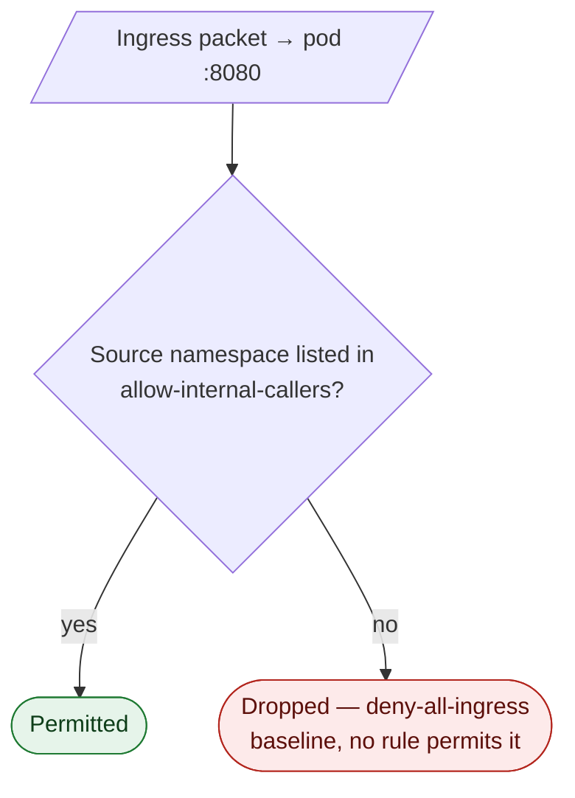
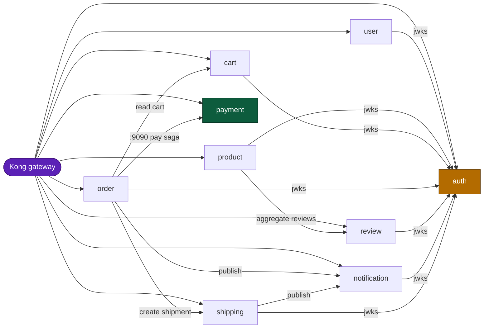
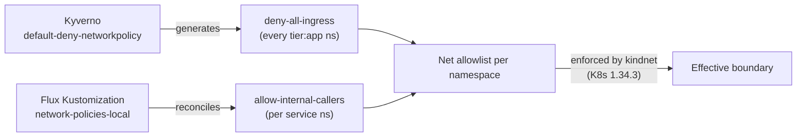

# NetworkPolicies — east-west micro-segmentation

| Attribute | Value |
|-----------|-------|
| **Status** | **Implemented and enforced** — manifests reconciled by Flux; **actively enforced by kindnet** on the local Kind cluster (K8s 1.34.3) |
| **Scope** | Ingress fencing across app-tier namespaces — app HTTP `:8080` / gRPC `:9090`, plus DB-tier ports (poolers, CNPG status, exporters) |
| **Purpose** | Make the cluster the fence for `internal` audiences — internal routes are reachable only from explicitly allowed namespaces, not merely "absent from the Ingress" |
| **Related** | [`policy-catalog.md`](policy-catalog.md) (Kyverno catalog), [`../api/api.md`](../api/api.md#audience-segments) (audiences), [gRPC security](../api/api.md#security) (`:9090` caller fences) |

## TL;DR

- Every app namespace runs a **two-policy** stack: a `deny-all-ingress` baseline
  plus an `allow-internal-callers` allowlist. NetworkPolicies are **additive**, so
  the net effect is: *only* the namespaces named in `allow-internal-callers` can
  reach the pods on `:8080`; everything else is dropped.
- The allowlist is **per-callee** and follows the real call graph — `auth` accepts
  all nine services incl. payment (they fetch the JWKS from `/auth/v1/public/auth/jwks`), while
  `shipping` accepts only `kong` + `order`, and `payment` (the 9th service) is the
  tightest: `kong`→`:8080` only, `order`→`:9090` only, plus intra-ns `payment`↔`mockpay`.
- **kindnet enforces NetworkPolicy** (verified on Kind K8s 1.34.3). These policies
  are the *active* boundary on the local Kind cluster today — any ingress not
  explicitly allowed is dropped. No additional CNI is required for enforcement.
- Policies fence both **HTTP `:8080`** and **gRPC `:9090`**. The gRPC callees
  (`shipping`, `review`, `notification`) allow `:9090` from their gRPC callers in
  the same `allow-internal-callers` rule. (auth is HTTP-only since RFC-0009
  Phase 5 — its gRPC `GetMe` server and `:9090` allow were removed.)

---

## 1. The two-layer model

| Layer | Resource | Selector | Effect |
|-------|----------|----------|--------|
| Baseline | `deny-all-ingress` | `podSelector: {}` (all pods), `policyTypes: [Ingress]`, no rules | Once any policy selects a pod, **all** ingress is denied unless another policy allows it. |
| Allowlist | `allow-internal-callers` | `podSelector: {}`, ingress `from` a fixed set of `namespaceSelector`s on `:8080` | Adds the permitted sources back. |

Because Kubernetes evaluates NetworkPolicies as a **union (logical OR)**, the
combination resolves to a strict allowlist:

The baseline `deny-all-ingress` is also **generated automatically** into every
`platform.duynhlab.dev/tier: app` namespace by the Kyverno `default-deny-networkpolicy`
ClusterPolicy (`generateExisting: true`, `synchronize: true`), so a new app namespace
is fenced by default even before its explicit allow policy lands.

---

## 2. Caller matrix

Allowed **ingress** callers per callee (TCP `:8080`; the gRPC callees
`shipping`, `review`, `notification` also allow `:9090` from their gRPC callers, and
`payment` allows `:9090` from `order` only).
`kong` is always
allowed (north-south gateway traffic); the rest mirror the east-west call graph.

| Callee | Allowed callers | Why |
|--------|-----------------|-----|
| **auth** | `kong` + **all 9 currently deployed service namespaces** (including self and payment; checkout joins at planned P5) | Every service refreshes the RS256 JWKS from `GET /auth/v1/public/auth/jwks` (`:8080`); JWTs are verified locally. |
| **user** | `kong` | Browser-only today; no service-to-service caller. |
| **product** | `kong` | Browser-only; aggregates *outward* to review. |
| **cart** | `kong`, `order` | `order` reads the cart during checkout. |
| **order** | `kong` | Browser-only inbound; calls *out* to cart/shipping/notification/auth. |
| **review** | `kong`, `product` | `product` aggregates reviews into product details. |
| **notification** | `kong`, `order`, `shipping` | Both publish notifications (order-created, shipment updates). |
| **shipping** | `kong`, `order` | `order` looks up / creates shipments. |
| **payment** | `kong` (`:8080` only), `order` (`:9090` only), intra-ns `payment` (`:8080`, for `mockpay`↔`payment`) | Payment moves money, so its allows are the tightest: the edge reaches only the HTTP API, the gRPC money transport admits only the order saga worker, and `mockpay`↔`payment` is fenced intra-namespace (ADR-008). |

> The matrix is **deny-by-default**: a caller not listed for a callee cannot reach
> it, even within the cluster. Adding a new east-west call means adding the caller's
> namespace to the callee's `allow-internal-callers` — not just opening an Ingress.

### DB-tier allows

The DB-hosting namespaces (`platform`, `product` — each hosts a
CloudNativePG cluster) also allow the operator, the metrics scraper, and pooler
traffic they depend on. Without these the operator cannot reach the database pods
and `databases-local` / `apps-local` never reconcile:

| Callee ns | Allowed source | Ports | Why |
|-----------|----------------|-------|-----|
| **platform** | `cloudnative-pg` operator | `:8000` (status), `:5432` | Operator extracts instance status + manages SQL. |
| **platform** | `auth`, `user`, `notification`, `shipping`, `review` (cross-ns) | `:6432` (PgDog), `:5432` (migrations) | Platform apps share `platform-db` via `pgdog-platform`. |
| **platform** | `temporal` (cross-ns) | `:5432` | Temporal server connects **direct** to `platform-db-rw` (no PgDog). |
| **platform** | intra-namespace | `:5432`, `:6432`, `:8000` | PgDog → Postgres, replica WAL streaming, pooler mesh. |
| **product** | `cloudnative-pg` operator | `:8000` (status), `:5432` | Operator extracts instance status + manages SQL. |
| **product** | `cart`, `order`, `payment` (cross-ns) | `:6432` (PgDog), `:5432` (`product-db-rw`) | `cart`/`order` use the pooler + migrate against the primary; `payment` connects **direct-TLS to `product-db-rw:5432`** for runtime (it bypasses PgDog) as well as migrations. |
| **product** | intra-namespace | `:5432`, `:6432`, `:8000` | PgDog → Postgres, replica WAL streaming, product-service → pooler. |
| **platform/product** | `monitoring` | `:9187` (exporter), `:9090` (PgDog metrics) | VMAgent scrapes the postgres/pooler exporters. |

---

## 3. Allowed-ingress topology

Solid edges = explicit east-west allows; `auth` is the JWKS hub (every service is
permitted to it to fetch `/auth/v1/public/auth/jwks`); `kong` is permitted to every service.

> Edges are **ingress allows**, drawn caller → callee. This diagram shows only the
> app HTTP/gRPC mesh (`:8080` / `:9090`); the DB-tier allows (operator → DB, app →
> pooler, monitoring → exporter) are in [§2 DB-tier allows](#db-tier-allows).
> Internal-audience routes (`notify/*`, shipping internal lookups) ride these same
> hops — the NetworkPolicy is the fence, never an Ingress rule.

---

## 4. How it is wired (GitOps)

- **Manifests:** `kubernetes/infra/configs/network-policies/{auth,user,product,platform,cart,order,review,notification,shipping,payment}.yaml`
  (+ `kustomization.yaml`). Each file holds `deny-all-ingress` + `allow-internal-callers`.
- **Generated baseline:** `kubernetes/infra/configs/kyverno/cluster-policies/default-deny-networkpolicy.yaml`.
- **Reconciliation:** Flux Kustomization `network-policies-local`
  (`kubernetes/clusters/local/network-policies.yaml`), `path: ./configs/network-policies`,
  `prune: true`, `wait: true`, `dependsOn: controllers-local` (namespaces must exist first).

### Adding or changing an allowed caller

1. Edit the **callee's** file under `kubernetes/infra/configs/network-policies/`,
   add a `namespaceSelector` for the caller's namespace under
   `allow-internal-callers.spec.ingress[0].from`.
2. `make validate` then `make flux-push` (or `make sync`); Flux reconciles.
3. Update the [caller matrix](#2-caller-matrix) and the [topology diagram](#3-allowed-ingress-topology) above.

---

## 5. Known limitations

- **Enforced by kindnet.** The local Kind cluster (K8s 1.34.3) enforces these
  NetworkPolicies at runtime — verified during the bring-up hardening pass. No
  extra CNI (Cilium/Calico) is required; any ingress not explicitly allowed is dropped.
- **HTTP `:8080` + gRPC `:9090`.** The gRPC callees (`shipping`, `review`,
  `notification`, and `payment` — the latter `:9090` from `order` only) fence `:9090`
  alongside `:8080` (auth is HTTP-only). mTLS on the gRPC port is the
  remaining Phase-3 item — deferred until it is wired app-side (the services use
  plaintext `insecure` credentials today); cert-manager config lands with that.
- **Ingress only.** No egress policies today; egress fencing is out of scope for now.
- **Metrics scrape allowed; egress not fenced.** The metrics/scrape path
  (monitoring → `:9187`/`:9090`) already has an allow rule. Policies are ingress-only,
  so egress (incl. kube-dns) is unfenced today — egress fencing is out of scope for now.

---

_Last updated: 2026-07-17 — RFC-0018: DB-tier allows for ns `platform` (`pgdog-platform` :6432, Temporal direct :5432); auth/user ns Postgres rules removed (apps egress to platform). Earlier: Zalando→CNPG migration; Patroni `:8008` / PgBouncer rows dropped._
