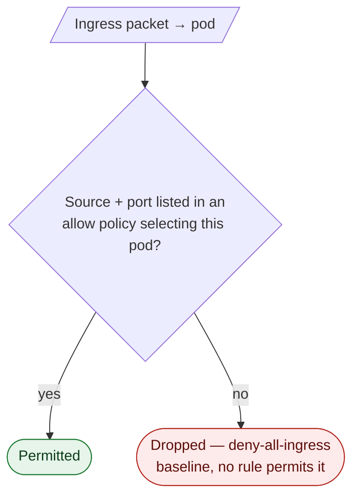
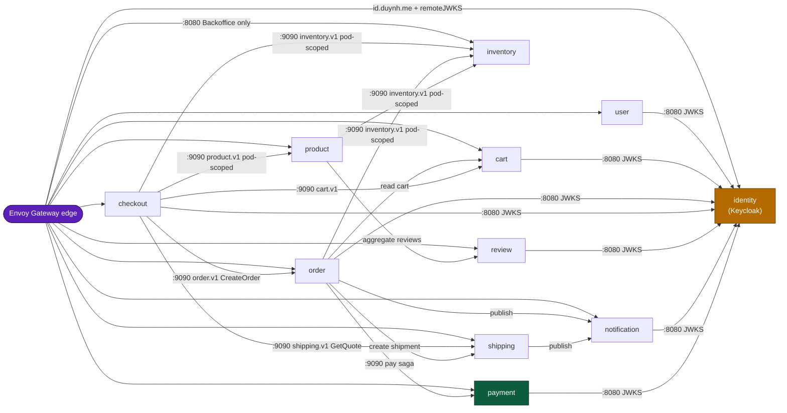
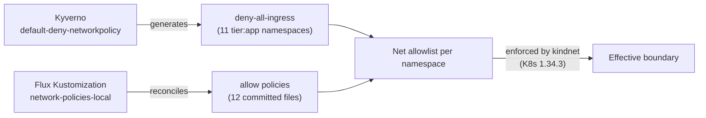

# NetworkPolicies — east-west micro-segmentation

| Attribute | Value |
|-----------|-------|
| **Status** | **Implemented and enforced** — manifests reconciled by Flux; **actively enforced by kindnet** on the local Kind cluster (K8s 1.34.3) |
| **Scope** | Ingress fencing across app-tier namespaces — app HTTP `:8080` / gRPC `:9090`, Keycloak (`identity`) `:8080`/`:9000`, plus DB-tier ports (poolers, CNPG status, exporters) |
| **Purpose** | Make the cluster the fence for `internal` audiences — internal routes are reachable only from explicitly allowed namespaces, not merely "absent from the Ingress" |
| **Related** | [`policy-catalog.md`](policy-catalog.md) (Kyverno catalog), [`../api/api.md`](../api/api.md#audience-segments) (audiences), [gRPC security](../api/api.md#security) (`:9090` caller fences) |

## TL;DR

- Every fenced namespace runs a `deny-all-ingress` baseline plus explicit allow
  policies. NetworkPolicies are **additive** (union), so the net effect is a
  strict allowlist: *only* the sources named in an allow policy can reach the
  pods on the listed ports; everything else is dropped.
- Most namespaces use a single namespace-wide `allow-internal-callers`;
  **`product` and `inventory` additionally carry pod-scoped allows**
  (`allow-product-grpc`, `allow-inventory-grpc`, `allow-inventory-protected-http`)
  that admit callers only to the service pods themselves — in `product` because
  PgDog also listens on `:9090` (openmetrics) and a namespace-wide `:9090` allow
  would hand the metrics port to app callers.
- **Keycloak (`identity` namespace) is the token issuer** (RFC-0024). Three
  sources hold an ingress allow into `identity`: `envoy-gateway` on `:8080`
  (the `id.duynh.me` route **and** the edge SecurityPolicy `remoteJWKS` fetches
  of `/realms/duynhlab/protocol/openid-connect/certs`), `monitoring` on `:9000`
  (Keycloak management/metrics), and — **added 2026-08-22** — the **ten service
  namespaces that run `pkg/authmw`** on `:8080`, for their own JWKS fetch.
  That third allow corrects a documented contradiction rather than widening a
  boundary casually. This page used to say *"no service namespace is admitted —
  JWT screening happens at the edge"*, while
  [`docs/api/api.md`](../api/api.md) names the edge check **coarse** and the
  in-service `pkg/authmw` verifier **authoritative**. The manifests implemented
  both, and `authmw` is fail-closed, so a
  JWKS it could not reach rejected every token. The result was that **every
  `private` and `protected` route in the cluster answered 401** — found by the
  Kind gate's K4.10 row, and the reason K4.5 onward had never passed on a
  cluster. The edge check is kept; it is the coarse first pass, not the only one.
- The checkout service is a pure gRPC **client** east-west: nothing dials into
  it on `:9090`, while it appears as a `:9090` caller on cart, order, product,
  shipping, and inventory.
- **kindnet enforces NetworkPolicy** (verified on Kind K8s 1.34.3). These
  policies are the *active* boundary on the local Kind cluster today — any
  ingress not explicitly allowed is dropped. No additional CNI is required.
- `payment` stays the tightest namespace-wide fence: `envoy-gateway`→`:8080`
  only, `order`→`:9090` only, plus the intra-namespace `payment`↔`mockpay`
  pair on `:8080`.

---

## 1. The layered model

| Layer | Resource | Selector | Effect |
|-------|----------|----------|--------|
| Baseline | `deny-all-ingress` | `podSelector: {}` (all pods), `policyTypes: [Ingress]`, no rules | Once any policy selects a pod, **all** ingress is denied unless another policy allows it. |
| Namespace-wide allowlist | `allow-internal-callers` | `podSelector: {}`, ingress `from` a fixed set of `namespaceSelector`s per port | Adds the permitted sources back for every pod in the namespace. |
| Pod-scoped allowlist | `allow-product-grpc`, `allow-inventory-grpc`, `allow-inventory-protected-http` | `podSelector` on `app.kubernetes.io/name`, ingress `from` `namespaceSelector`s | Adds sources back **only for the service pods** — other pods in the same namespace (e.g. PgDog, which also listens on `:9090`) stay behind the deny-all. |

So a namespace is *not* always exactly "deny-all + allow-internal-callers":
`product` runs all three shapes, and `inventory` runs **only** pod-scoped
allows (a pod there without the `app.kubernetes.io/name: inventory` label
receives no ingress at all).

Because Kubernetes evaluates NetworkPolicies as a **union (logical OR)**, the
combination resolves to a strict allowlist:

```mermaid
flowchart TD
    PKT[/"Ingress packet → pod"/] --> Q{"Source + port listed in an<br/>allow policy selecting this pod?"}
    Q -->|yes| OK(["Permitted"]):::ok
    Q -->|no| DROP(["Dropped — deny-all-ingress<br/>baseline, no rule permits it"]):::no

    classDef ok fill:#e6f4ea,stroke:#1f7a33,color:#0d3d18
    classDef no fill:#fdeaea,stroke:#b3261e,color:#5c0f0a
```

The baseline `deny-all-ingress` is also **generated automatically** into every
`platform.duynhlab.dev/tier: app` namespace by the Kyverno `default-deny-networkpolicy`
ClusterPolicy (`generateExisting: true`, `synchronize: true`), so a new app namespace
is fenced by default even before its explicit allow policy lands. (`identity` is
not labelled `tier: app` — its baseline is the committed `deny-all-ingress` in
`identity.yaml` only.)

---

## 2. Caller matrix

Allowed **ingress** callers per callee namespace, one row per committed policy
file. `envoy-gateway` (the Envoy Gateway proxy fleet — RFC-0024 P2.3 re-pointed
every edge allow from the retired `kong` namespace) carries the north-south
traffic; the rest mirror the east-west call graph. Ports are TCP.

| Callee ns | Allowed callers (policy) | Why |
|-----------|--------------------------|-----|
| **identity** (Keycloak) | `envoy-gateway` → `:8080`; `monitoring` → `:9000`; the ten `pkg/authmw` namespaces → `:8080` | The edge serves the `id.duynh.me` route and fetches the JWKS for its `remoteJWKS` SecurityPolicy; VMAgent scrapes the management interface. The **ten `pkg/authmw` services fetch the same JWKS themselves** — their verifier is the authoritative one ([`api.md`](../api/api.md)) and is fail-closed, so without this allow every `private` route 401s. The list first held seven, scoped by enumerating the Deployments that carried `OIDC_JWKS_URL`, and excluded `product`/`shipping`/`inventory` as having "no in-service verifier". **Corrected 2026-08-22:** all three build `pkg/authmw` in `cmd/main.go`; what they lacked was the env pair, so they used compiled defaults pointing at the public host. Enumerating by which manifest happened to set a variable found the symptom rather than the set. Still **not** `frontend`/`backoffice` (SPAs — the browser holds the token). `:9000` stays `monitoring`-only. |
| **user** | `envoy-gateway` → `:8080` | Browser-only today; no service-to-service caller. |
| **product** | `envoy-gateway` → `:8080`; `checkout` → `:9090` (**pod-scoped** `allow-product-grpc`) | Checkout re-validates prices via `product.v1` (RFC-0015). `order` was deliberately **removed** from the gRPC allow — RFC-0021 P4 deleted the saga's product stock activities, and keeping the allow would let a rolled-back build silently reserve stock at product again. DB-tier allows: [table below](#db-tier-allows). |
| **cart** | `envoy-gateway`, `order` → `:8080`; `checkout` → `:9090` | `order` reads the cart during checkout; the checkout service reads it over `cart.v1` gRPC only (RFC-0015), never the HTTP API. |
| **order** | `envoy-gateway` → `:8080`; `checkout` → `:9090` | Browser inbound via the edge; checkout's confirm handoff calls `order.v1/CreateOrder` (RFC-0015, ADR-018). Order itself calls *out* to cart/shipping/notification/payment/inventory. |
| **checkout** | `envoy-gateway` → `:8080` | gRPC **client** only (cart/product/order/shipping/inventory) — nothing dials into it on `:9090`; the worker takes no app traffic at all. |
| **inventory** | `checkout`, `order`, `product` → `:9090` (**pod-scoped** `allow-inventory-grpc`); `envoy-gateway` → `:8080` (**pod-scoped** `allow-inventory-protected-http`) | East-west inventory is gRPC-only (RFC-0021): checkout's confirm path and the order saga's stock activities reserve stock; product reads availability (`BatchGetAvailability`, live since RFC-0021 P4). The edge's only HTTP surface is the protected Backoffice route (RFC-0023). |
| **review** | `envoy-gateway`, `product` → `:8080` + `:9090` | `product` aggregates reviews into product details. |
| **notification** | `envoy-gateway`, `order`, `shipping` → `:8080` + `:9090` | Order and shipping publish notifications (order-created, shipment updates). |
| **shipping** | `envoy-gateway`, `order` → `:8080` + `:9090`; `checkout` → `:9090` | `order` looks up / creates shipments; checkout prices shipping via `shipping.v1/GetQuote` (RFC-0015 P3), gRPC only. |
| **payment** | `envoy-gateway` → `:8080`; `order` → `:9090`; intra-ns `payment` → `:8080` | Payment moves money, so its allows are the tightest: the edge reaches only the HTTP API (private routes + the public webhook receiver), the gRPC money transport admits only the order saga worker, and `mockpay`↔`payment` is fenced intra-namespace (ADR-008). |

> The matrix is **deny-by-default**: a caller not listed for a callee cannot reach
> it, even within the cluster. Adding a new east-west call means adding the caller's
> namespace to the callee's allow policy — not just opening a route at the edge.

### DB-tier allows

The DB-hosting namespaces (`platform`, `product` — each hosts a CloudNativePG
cluster) also allow the operator, the metrics scraper, and pooler traffic they
depend on. Without these the operator cannot reach the database pods and
`databases-local` / `apps-local` never reconcile:

| Callee ns | Allowed source | Ports | Why |
|-----------|----------------|-------|-----|
| **platform** | `cloudnative-pg` operator | `:8000` (status), `:5432` | Operator extracts instance status + manages SQL. |
| **platform** | `user`, `notification`, `shipping`, `review` (cross-ns) | `:5432` | Platform apps share `platform-db` via the CNPG PgBouncer `Pooler` `platform-db-pooler-rw` (ADR-026 — replaced `pgdog-platform`). PgBouncer listens on 5432, so runtime and migration traffic use the same port. |
| **platform** | `temporal` (cross-ns) | `:5432` | Temporal server connects **direct** to `platform-db-rw` (no pooler). |
| **platform** | `identity` (cross-ns) | `:5432` | Keycloak connects **direct** to `platform-db-rw` — no pooler (RFC-0022 OQ#8 / ADR-041). |
| **platform** | `openbao` (cross-ns) | `:5432` | OpenBAO database secrets engine rotates the notification role's password (static-role, RFC-0008 / ADR-025). |
| **platform** | intra-namespace | `:5432`, `:8000` | CNPG HA replica WAL streaming + PgBouncer → Postgres + operator status probe. (`:6432` is gone — ADR-026 removed PgDog from `platform`.) |
| **platform** | `monitoring` | `:9187` (postgres exporter), `:9127` (PgBouncer exporter, ADR-026) | VMAgent scrapes the postgres/pooler exporters. |
| **product** | `cloudnative-pg` operator | `:8000` (status), `:5432` | Operator extracts instance status + manages SQL. |
| **product** | `cart`, `order`, `payment`, `checkout`, `inventory` (cross-ns) | `:6432` (PgDog), `:5432` (`product-db-rw`) | Sibling apps use the PgDog pooler for runtime + the primary for migration initContainers; `payment` connects **direct-TLS to `product-db-rw:5432`** for runtime too (its config refuses cleartext and PgDog has no TLS yet). |
| **product** | intra-namespace | `:5432`, `:6432`, `:8000` | CNPG replica WAL streaming + product-service → PgDog + PgDog → Postgres + operator status probe. |
| **product** | `monitoring` | `:9187` (postgres exporter), `:9090` (PgDog openmetrics) | VMAgent scrapes the postgres/pooler exporters. |

---

## 3. Allowed-ingress topology

One question: **which app-mesh ingress is allowed?** Edges are ingress allows,
drawn caller → callee, HTTP `:8080` / gRPC `:9090` only — the DB-tier allows
(operator → DB, app → pooler, monitoring → exporter, and `identity`'s
`monitoring → :9000` scrape) live in [§2 DB-tier allows](#db-tier-allows) and
the matrix.

```mermaid
flowchart LR
    EDGE([Envoy Gateway edge]):::gw
    IDP["identity<br/>(Keycloak)"]:::idp
    USER[user]
    PRODUCT[product]
    CART[cart]
    ORDER[order]
    CHECKOUT[checkout]
    INV[inventory]
    REVIEW[review]
    NOTIF[notification]
    SHIP[shipping]
    PAYMENT[payment]:::pay

    %% North-south: the gateway's ingress allows
    EDGE --> USER & PRODUCT & CART & ORDER & CHECKOUT & REVIEW & NOTIF & SHIP & PAYMENT
    EDGE -->|"id.duynh.me + remoteJWKS"| IDP
    EDGE -->|":8080 Backoffice only"| INV

    %% The seven pkg/authmw services fetch the JWKS themselves (added 2026-08-22).
    %% Their verifier is the authoritative one and is fail-closed, so this is not
    %% redundancy with the edge -- without it every private route answers 401.
    USER & CART & ORDER & CHECKOUT & REVIEW & NOTIF & PAYMENT -->|":8080 JWKS"| IDP

    %% East-west business calls
    ORDER -->|read cart| CART
    CHECKOUT -->|":9090 cart.v1"| CART
    CHECKOUT -->|":9090 order.v1 CreateOrder"| ORDER
    CHECKOUT -->|":9090 product.v1 pod-scoped"| PRODUCT
    CHECKOUT -->|":9090 shipping.v1 GetQuote"| SHIP
    CHECKOUT & ORDER & PRODUCT -->|":9090 inventory.v1 pod-scoped"| INV
    PRODUCT -->|aggregate reviews| REVIEW
    ORDER -->|publish| NOTIF
    SHIP -->|publish| NOTIF
    ORDER -->|create shipment| SHIP
    ORDER -->|":9090 pay saga"| PAYMENT

    classDef gw fill:#5b21b6,color:#fff,stroke:#3b0d6e
    classDef idp fill:#b36b00,color:#fff,stroke:#5c3600
    classDef pay fill:#0d5c3d,color:#fff,stroke:#063020
```

> Note the arrow that does **not** exist: nothing → `checkout` on `:9090` (it is a
> gRPC client, never a server to the mesh). The seven `pkg/authmw` namespaces
> **do** reach `identity:8080` since 2026-08-22 — that arrow was missing from
> both this diagram and the policy, and its absence 401'd every authenticated
> route on the cluster. The
> `pod-scoped` labels mark allows that admit callers only to the service
> pods (`allow-product-grpc`, `allow-inventory-grpc`), not the whole
> namespace. Internal-audience routes ride these same hops — the
> NetworkPolicy is the fence, never a route rule.

---

## 4. How it is wired (GitOps)

```mermaid
flowchart LR
    KY["Kyverno<br/>default-deny-networkpolicy"] -->|generates| DENY["deny-all-ingress<br/>(11 tier:app namespaces)"]
    FLUX["Flux Kustomization<br/>network-policies-local"] -->|reconciles| ALLOW["allow policies<br/>(12 committed files)"]
    DENY --> NET["Net allowlist per namespace"]
    ALLOW --> NET
    NET -->|"enforced by kindnet<br/>(K8s 1.34.3)"| EFF["Effective boundary"]
```

- **Manifests:** `kubernetes/infra/configs/network-policies/{cart,checkout,identity,inventory,notification,order,payment,platform,product,review,shipping,user}.yaml`
  (+ `kustomization.yaml`) — 26 policy objects covering the **10 deployed
  services** plus `platform` (DB tier) and `identity` (Keycloak). Every file
  carries its own committed `deny-all-ingress`; most add one
  `allow-internal-callers`, while `product` and `inventory` add the pod-scoped
  policies described in [§1](#1-the-layered-model).
- **Generated baseline:** `kubernetes/infra/configs/kyverno/cluster-policies/default-deny-networkpolicy.yaml`
  generates `deny-all-ingress` into all **11 `tier: app` namespaces** (the 10
  service namespaces + `platform`); `identity` is not `tier: app` and relies on
  its committed baseline.
- **Secrets-tier policy:** `kubernetes/infra/controllers/secrets/floci/networkpolicy.yaml`
  ships `floci-allow-openbao` (namespace `openbao`, pod-scoped to the floci KMS
  emulator): only pods in the `openbao` namespace may reach `:4566` — anyone
  who can reach floci can decrypt OpenBAO's root key.
- **Reconciliation:** Flux Kustomization `network-policies-local`
  (`kubernetes/clusters/local/network-policies.yaml`), `path: ./configs/network-policies`,
  `prune: true`, `wait: true`, `dependsOn: controllers-local` (namespaces must
  exist first; `databases-local` depends on this so operators init behind an
  already-fenced network).
- **Verification:** `scripts/edge-isolation-sweep.sh` guards the edge allow
  list — manifest mode greps every committed file for its expected
  `envoy-gateway` allow (a missed file is a silent traffic blackhole: the route
  resolves, the pod is healthy, every request times out at the CNI), and
  `--live` mode TCP-probes each backend port from a pod in the `envoy-gateway`
  namespace.

### Adding or changing an allowed caller

1. Edit the **callee's** file under `kubernetes/infra/configs/network-policies/`,
   add a `namespaceSelector` for the caller's namespace under the right allow
   policy (namespace-wide `allow-internal-callers`, or the pod-scoped policy if
   the callee fences per-pod like `product`/`inventory`).
2. `make validate` then `make flux-push` (or `make sync`); Flux reconciles. Run
   `scripts/edge-isolation-sweep.sh` when the edge allow list changes.
3. Update the [caller matrix](#2-caller-matrix) and the [topology diagram](#3-allowed-ingress-topology) above.

---

## 5. Known limitations

- **Enforced by kindnet.** The local Kind cluster (K8s 1.34.3) enforces these
  NetworkPolicies at runtime — verified during the bring-up hardening pass. No
  extra CNI (Cilium/Calico) is required; any ingress not explicitly allowed is dropped.
- **HTTP `:8080` + gRPC `:9090`.** The gRPC callees (`shipping`, `review`,
  `notification`, `cart`, `order`, `product`, `inventory`, and `payment` — the
  latter `:9090` from `order` only) fence `:9090` alongside `:8080`. mTLS on
  the gRPC port is the remaining Phase-3 item — deferred until it is wired
  app-side (the services use plaintext `insecure` credentials today);
  cert-manager config lands with that.
- **Ingress only.** No egress policies today; egress fencing is out of scope for now.
- **Metrics scrape allowed; egress not fenced.** The metrics/scrape paths
  (monitoring → `:9187`/`:9127`/`:9090`, and → Keycloak `:9000`) already have
  allow rules. Policies are ingress-only, so egress (incl. kube-dns) is
  unfenced today — egress fencing is out of scope for now.

---

_Last updated: 2026-08-19 — rebuilt against the deployed manifests: auth residue removed (service retired, Keycloak/identity is the issuer), checkout/inventory/identity rows added, pod-scoped policy pattern documented, ADR-026 pooler swap reflected._
