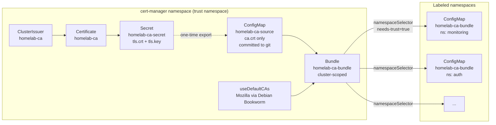

# Trust Distribution with trust-manager

> Distributes the homelab CA root certificate to every namespace that needs to
> verify TLS connections issued by `homelab-ca`. Combines the project's own CA
> with the public Mozilla CA bundle so workloads have a complete trust store.

**Repository paths:**

| Purpose | Path |
|---|---|
| trust-manager `HelmRelease` | [`kubernetes/infra/controllers/cert-manager/trust-manager-helmrelease.yaml`](../../kubernetes/infra/controllers/cert-manager/trust-manager-helmrelease.yaml) |
| Static CA copy (PEM) | [`kubernetes/infra/configs/cert-manager/ca-source/`](../../kubernetes/infra/configs/cert-manager/ca-source/) |
| `Bundle` CRD | [`kubernetes/infra/configs/cert-manager/bundles.yaml`](../../kubernetes/infra/configs/cert-manager/bundles.yaml) |
| Namespace opt-in label | `platform.duynhlab.dev/needs-trust: "true"` |

---

## 1. Why trust-manager?

`cert-manager` issues certificates inside one namespace per `Certificate`
resource. The matching `Secret` (e.g. `homelab-ca-secret` in `cert-manager`) is
not visible to any other namespace. Workloads in other namespaces that need to
**verify** TLS connections signed by the homelab CA — k6 load tests against
`https://gateway.duynhne.me`, Vector pushing logs to an HTTPS sink, in-cluster
HTTP clients calling sibling services through the gateway — would otherwise
resort to `InsecureSkipVerify=true` or hand-copied CA files.

trust-manager solves this exactly. Pros over reflector / kubernetes-replicator:

- **CA-only, no private keys**: the `Bundle` API never touches `tls.key`. You
  cannot accidentally fan a private key out across namespaces.
- **Combine sources**: one Bundle merges Mozilla CAs (`useDefaultCAs: true`) +
  homelab CA + any future inline / Secret / ConfigMap source. One
  `ca-bundle.pem` per workload.
- **Same upstream as cert-manager**: identical release cadence, GitOps flow,
  Helm chart, security review.
- **Output formats**: PEM by default, optional JKS / PKCS#12 for Java / .NET
  workloads (disabled here — Go uses PEM only).

---

## 2. Architecture



**Why the static `homelab-ca-source` ConfigMap?** trust-manager could read
`homelab-ca-secret` directly. We deliberately do not — see
[Section 5: Rotation](#5-rotation).

---

## 3. How to opt a namespace in

Add the label to the `Namespace` resource:

```yaml
apiVersion: v1
kind: Namespace
metadata:
  name: my-namespace
  labels:
    platform.duynhlab.dev/needs-trust: "true"
```

trust-manager reconciles within ~10s and creates:

```
ConfigMap/homelab-ca-bundle
data:
  ca-bundle.pem: |
    -----BEGIN CERTIFICATE-----   # Mozilla root #1
    -----BEGIN CERTIFICATE-----   # ...
    -----BEGIN CERTIFICATE-----   # homelab-ca
```

Verify:

```bash
kubectl get bundles
kubectl get cm homelab-ca-bundle -A
kubectl get cm homelab-ca-bundle -n my-namespace -o jsonpath='{.data.ca-bundle\.pem}' | grep -c BEGIN
```

**Currently labeled namespaces** (managed in
[`kubernetes/infra/controllers/namespaces.yaml`](../../kubernetes/infra/controllers/namespaces.yaml)):

| Namespace | Why |
|---|---|
| `monitoring` | Future Vector / Grafana outbound HTTPS to homelab-CA-signed targets |
| `auth` | Pilot — backend service that may call `https://gateway.duynhne.me` for cross-service traffic |

Add more namespaces by appending the label and merging via PR.

---

## 4. Mounting the bundle in a workload

```yaml
spec:
  containers:
    - name: app
      env:
        - name: SSL_CERT_FILE
          value: /etc/ssl/certs/ca-bundle.pem
      volumeMounts:
        - name: trust
          mountPath: /etc/ssl/certs/ca-bundle.pem
          subPath: ca-bundle.pem
          readOnly: true
  volumes:
    - name: trust
      configMap:
        name: homelab-ca-bundle
```

For Go workloads, setting `SSL_CERT_FILE` makes `crypto/tls` use the bundle as
its **only** trust store. If you also want the system root pool, mount at
`/etc/ssl/certs/homelab-ca.crt` (subPath) instead and let Go merge with system
defaults.

---

## 5. Rotation

The fundamental rule: **never overwrite a trust store atomically with a
different CA**. Workloads that hold a leaf cert signed by the *old* CA will
immediately fail verification when peers serve a leaf signed by the *new* CA
(and vice versa). You always need a window where **both** CAs are trusted.

That is why the Bundle reads from `homelab-ca-source` (a static, git-committed
PEM file) instead of from `homelab-ca-secret` (which cert-manager could rotate
under us at any moment).

### Rotation runbook

```bash
# 1. Generate the new CA via cert-manager (new Certificate name + secretName).
#    Edit kubernetes/infra/configs/cert-manager/clusterissuers.yaml: add
#    homelab-ca-v2 Certificate alongside homelab-ca, plus homelab-ca-v2 ClusterIssuer.

# 2. After Flux reconciles, export the new CA cert:
kubectl get secret homelab-ca-v2-secret -n cert-manager \
  -o jsonpath='{.data.tls\.crt}' | base64 -d \
  > kubernetes/infra/configs/cert-manager/ca-source/homelab-ca-v2.crt

# 3. Update kustomization.yaml to bundle BOTH PEMs into the source ConfigMap:
#    configMapGenerator:
#      - name: homelab-ca-source
#        files:
#          - ca.crt=homelab-ca.crt
#          - ca-v2.crt=homelab-ca-v2.crt
#    (trust-manager combines all keys from the source.)

# 4. PR + merge. Now every labeled namespace trusts BOTH old and new CAs.

# 5. Switch leaf Certificates (kong-proxy-tls, future ones) issuerRef to
#    homelab-ca-v2. Wait for cert-manager to reissue.

# 6. After all leaves are reissued (verify with `kubectl get certificate -A`):
#    PR removing homelab-ca.crt from kustomization.yaml + deleting the file.

# 7. Eventually delete the old homelab-ca Certificate + ClusterIssuer.
```

Each rotation step is a separate PR with its own review and rollback.

---

## 6. Bootstrap (first-time install)

Already done in this repo at commit `feat/trust-manager`. To redo from scratch
in another cluster:

```bash
# After cert-manager has issued homelab-ca-secret:
mkdir -p kubernetes/infra/configs/cert-manager/ca-source
kubectl get secret homelab-ca-secret -n cert-manager \
  -o jsonpath='{.data.tls\.crt}' | base64 -d \
  > kubernetes/infra/configs/cert-manager/ca-source/homelab-ca.crt

# kustomization.yaml — already in repo, no changes needed.
# Commit the .crt file. CA certs are public; only tls.key is sensitive.
```

---

## 7. Operations

```bash
# trust-manager pod
kubectl -n cert-manager get pods -l app.kubernetes.io/name=trust-manager
kubectl -n cert-manager logs deploy/trust-manager -f

# Bundles
kubectl get bundles
kubectl describe bundle homelab-ca-bundle

# Distributed ConfigMaps
kubectl get cm homelab-ca-bundle -A

# Reconcile after kustomize changes
flux reconcile kustomization cert-manager-config-local --with-source
```

### Troubleshooting

| Symptom | Check |
|---|---|
| Bundle status `False` | `kubectl describe bundle homelab-ca-bundle` — usually missing source ConfigMap or wrong key |
| ConfigMap not appearing in target ns | Namespace missing the label `platform.duynhlab.dev/needs-trust=true` |
| ConfigMap exists but is empty | trust-manager pod logs — most often the Mozilla pkg image failed to pull |
| Old CA still in bundle after rotation | Rebuild not triggered — `flux reconcile kustomization cert-manager-config-local --with-source` |

---

## 8. References

- trust-manager docs: <https://cert-manager.io/docs/trust/trust-manager/>
- trust-manager API reference: <https://cert-manager.io/docs/trust/trust-manager/api-reference/>
- cert-manager `Bundle` API: `trust.cert-manager.io/v1alpha1`
- cert-manager + Flux integration: [`docs/platform/cert-manager-flux.md`](../platform/cert-manager-flux.md)
- Why static CA copy is preferred over reading the cert-manager Secret directly:
  [trust-manager docs — Preparing for Production](https://cert-manager.io/docs/trust/trust-manager/#preparing-for-production)
