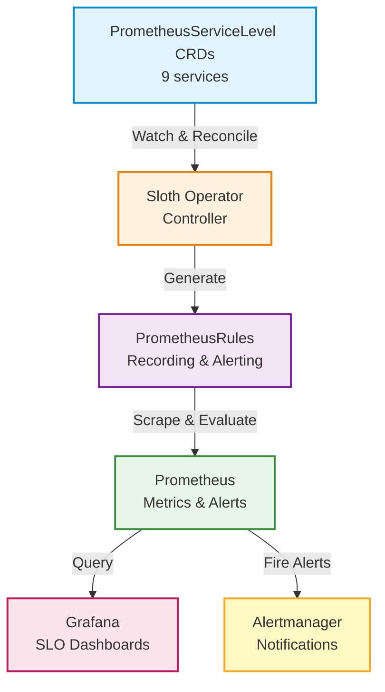

# SLO System Documentation

## Overview

This SLO (Service Level Objective) system provides comprehensive monitoring and alerting for all microservices using [Sloth Operator](https://sloth.dev) v0.15.0, following Google SRE best practices with multi-window multi-burn-rate alerts.

**Key Features**:
- Kubernetes-native using PrometheusServiceLevel CRDs
- Automatic rule generation via Sloth Operator
- Multi-window multi-burn-rate alerts
- Error budget tracking
- Grafana dashboards (auto-deployed)

## Quick Start

### Deploy SLO System (GitOps)

**SLO system is deployed automatically via Flux Operator:**

**Flux Kustomizations (controllers/configs pattern):**
- `controllers-local` ([kubernetes/clusters/local/controllers.yaml](../../kubernetes/clusters/local/controllers.yaml)) - installs Sloth Operator (CRDs/controllers)
- `configs-local` ([kubernetes/clusters/local/configs.yaml](../../kubernetes/clusters/local/configs.yaml)) - applies PrometheusServiceLevel CRs
- **Source:** OCI artifact `mop-registry:5000/flux-infra-sync:local`
- **Manifests:**
  - `kubernetes/infra/controllers/metrics/slo/` (Sloth Operator)
  - `kubernetes/infra/configs/monitoring/slo/` (PrometheusServiceLevel CRDs)
- **Reconciliation:** Every 10 minutes (automatic)
- **Dependencies:** `controllers-local` must be ready before `configs-local`

**Components deployed:**
1. **Sloth Operator** (v0.15.0) - HelmRelease
2. **PrometheusServiceLevel CRDs** - 9 services, 27 total SLOs

**Manual reconciliation (if needed):**
```bash
# Trigger Flux reconciliation
flux reconcile kustomization configs-local --with-source

# Check deployment status
flux get kustomizations
kubectl get pods -n monitoring | grep sloth

# Check SLO CRDs
kubectl get prometheusservicelevel -A

# Check generated PrometheusRules
kubectl get prometheusrule -n monitoring | grep sloth
```

**Verification:**
```bash
# Check Sloth Operator is running
kubectl get pods -n monitoring | grep sloth

# List all SLO definitions (27 SLOs across 9 services)
kubectl get prometheusservicelevel -A

# Check generated recording/alerting rules
kubectl get prometheusrule -n monitoring -l prometheus-operator.io/sloth-generated=true

# Query SLO metrics in Prometheus
kubectl port-forward -n monitoring svc/kube-prometheus-stack-prometheus 9090:9090
# Open: http://localhost:9090 and query: slo:sli_error:ratio_rate5m
```

**Legacy deployment (reference only):**
- Old script: `./scripts/backup/07-deploy-slo.sh`
- **Note:** This script is kept for reference but is no longer used. Use Flux GitOps workflow instead.

**Note:** Grafana dashboards are automatically deployed via Grafana Operator (IDs 14348, 14643).

## Architecture



## SLO Definitions

Each service has **3 SLOs**:

### 1. Availability (99.5% objective)
- Measures successful requests (non-5xx)
- Alert: `{Service}HighErrorRate`

### 2. Latency (95.0% objective)
- Measures requests faster than 500ms
- Alert: `{Service}HighLatency`

### 3. Error Rate (99.0% objective)
- Measures overall success rate (non-4xx/5xx)
- Alert: `{Service}HighOverallErrorRate`

## Services

| Service | Namespace | SLOs | Status |
|---------|-----------|------|--------|
| auth | auth | 3 | ✅ Active |
| user | user | 3 | ✅ Active |
| product | product | 3 | ✅ Active |
| cart | cart | 3 | ✅ Active |
| order | order | 3 | ✅ Active |
| review | review | 3 | ✅ Active |
| notification | notification | 3 | ✅ Active |
| shipping | shipping | 3 | ✅ Active |
| shipping-v2 | shipping | 3 | ✅ Active |

**Total: 27 SLOs** across 9 services

## Grafana Dashboards

Sloth dashboards are automatically deployed via Grafana Operator:

- **Detailed SLOs** (ID: 14348) - Per-service SLO metrics
- **Overview** (ID: 14643) - High-level SLO summary

**Access**: http://localhost:3000/dashboards (folder: SLO)

## Prometheus Metrics

Sloth Operator generates the following metrics for each SLO:

### Recording Rules

```promql
# Error rate over different windows
slo:sli_error:ratio_rate5m{service="auth", slo="availability"}
slo:sli_error:ratio_rate30m{service="auth", slo="availability"}
slo:sli_error:ratio_rate1h{service="auth", slo="availability"}
slo:sli_error:ratio_rate6h{service="auth", slo="availability"}

# Error budget
slo:error_budget_remaining:ratio{service="auth", slo="availability"}

# Burn rate
slo:error_budget_burn_rate:ratio{service="auth", slo="availability"}
```

### Alerting Rules

Multi-window multi-burn-rate alerts:

- **Page Alerts** (Critical) - Immediate action required
- **Ticket Alerts** (Warning) - Investigation needed


## Documentation

- **Manifests:**
  - Sloth Operator: `kubernetes/infra/controllers/metrics/slo/`
  - SLO CRDs: `kubernetes/infra/configs/monitoring/slo/`
- **Sloth Docs**: https://sloth.dev/
- **CRD Spec**: https://sloth.dev/usage/getting-started/
- **Alert Configuration**: [ALERTING.md](./ALERTING.md)
- **Error Budget Policy**: [ERROR_BUDGET_POLICY.md](./ERROR_BUDGET_POLICY.md)

