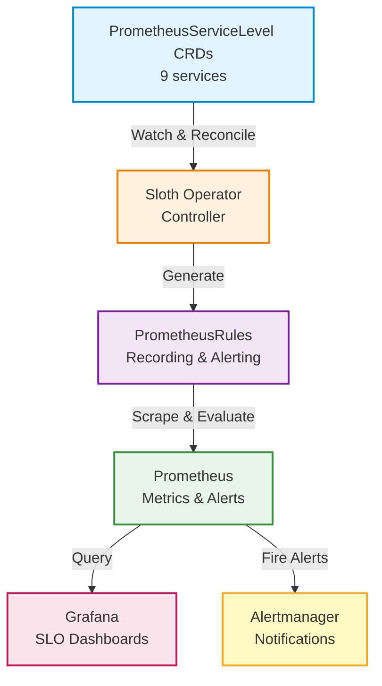

# SLO System Documentation

## Overview

This SLO (Service Level Objective) system provides comprehensive monitoring and alerting for all microservices using [Sloth Operator](https://sloth.dev) v0.15.0, following Google SRE best practices with multi-window multi-burn-rate alerts.

**Key Features**:
- Kubernetes-native using PrometheusServiceLevel CRDs
- Automatic rule generation via Sloth Operator
- Multi-window multi-burn-rate alerts
- Error budget tracking
- Grafana dashboards (auto-deployed)

## Quick Start

### Deploy SLO System

```bash
./scripts/08-deploy-slo.sh
```

This script:
- Adds Sloth Helm repository
- Deploys Sloth Operator to `monitoring` namespace
- Applies PrometheusServiceLevel CRDs (9 services)
- Verifies deployment

**Note:** Grafana dashboards are automatically deployed via Grafana Operator (IDs 14348, 14643).

## Architecture



## Directory Structure

```
├── slo/
│   └── definitions/          # Source of truth (YAML files, backup)
│       ├── auth.yaml
│       ├── user.yaml
│       ├── product.yaml
│       ├── cart.yaml
│       ├── order.yaml
│       ├── review.yaml
│       ├── notification.yaml
│       ├── shipping.yaml
│       └── shipping-v2.yaml
├── k8s/sloth/
│   ├── values.yaml           # Helm values for Sloth Operator
│   ├── README.md             # Deployment instructions
│   └── crds/                 # PrometheusServiceLevel CRDs (active)
│       ├── auth-slo.yaml
│       ├── user-slo.yaml
│       ├── product-slo.yaml
│       ├── cart-slo.yaml
│       ├── order-slo.yaml
│       ├── review-slo.yaml
│       ├── notification-slo.yaml
│       ├── shipping-slo.yaml
│       └── shipping-v2-slo.yaml
└── scripts/
    └── 08-deploy-slo.sh      # SLO deployment script (Helm-based)
```

## SLO Definitions

Each service has **3 SLOs**:

### 1. Availability (99.5% objective)
- Measures successful requests (non-5xx)
- Alert: `{Service}HighErrorRate`

### 2. Latency (95.0% objective)
- Measures requests faster than 500ms
- Alert: `{Service}HighLatency`

### 3. Error Rate (99.0% objective)
- Measures overall success rate (non-4xx/5xx)
- Alert: `{Service}HighOverallErrorRate`

## Services

| Service | Namespace | SLOs | Status |
|---------|-----------|------|--------|
| auth | auth | 3 | ✅ Active |
| user | user | 3 | ✅ Active |
| product | product | 3 | ✅ Active |
| cart | cart | 3 | ✅ Active |
| order | order | 3 | ✅ Active |
| review | review | 3 | ✅ Active |
| notification | notification | 3 | ✅ Active |
| shipping | shipping | 3 | ✅ Active |
| shipping-v2 | shipping | 3 | ✅ Active |

**Total: 27 SLOs** across 9 services

## Grafana Dashboards

Sloth dashboards are automatically deployed via Grafana Operator:

- **Detailed SLOs** (ID: 14348) - Per-service SLO metrics
- **Overview** (ID: 14643) - High-level SLO summary

**Access**: http://localhost:3000/dashboards (folder: SLO)

## Prometheus Metrics

Sloth Operator generates the following metrics for each SLO:

### Recording Rules

```promql
# Error rate over different windows
slo:sli_error:ratio_rate5m{service="auth", slo="availability"}
slo:sli_error:ratio_rate30m{service="auth", slo="availability"}
slo:sli_error:ratio_rate1h{service="auth", slo="availability"}
slo:sli_error:ratio_rate6h{service="auth", slo="availability"}

# Error budget
slo:error_budget_remaining:ratio{service="auth", slo="availability"}

# Burn rate
slo:error_budget_burn_rate:ratio{service="auth", slo="availability"}
```

### Alerting Rules

Multi-window multi-burn-rate alerts:

- **Page Alerts** (Critical) - Immediate action required
- **Ticket Alerts** (Warning) - Investigation needed

## Managing SLOs

### Add a New Service

1. Create PrometheusServiceLevel CRD:

```bash
cp k8s/sloth/crds/auth-slo.yaml k8s/sloth/crds/mynewservice-slo.yaml
# Edit with service-specific values
```

2. Apply CRD:

```bash
kubectl apply -f k8s/sloth/crds/mynewservice-slo.yaml
```

Sloth Operator automatically generates rules!

### Update an SLO

1. Edit the PrometheusServiceLevel CRD:

```bash
vim k8s/sloth/crds/auth-slo.yaml
```

2. Apply changes:

```bash
kubectl apply -f k8s/sloth/crds/auth-slo.yaml
```

Sloth Operator reconciles automatically.

### Delete an SLO

```bash
kubectl delete -f k8s/sloth/crds/auth-slo.yaml
```

## Verification

### Check Sloth Operator

```bash
kubectl get pods -n monitoring -l app.kubernetes.io/name=sloth
```

### Check PrometheusServiceLevel CRs

```bash
kubectl get prometheusservicelevels -n monitoring
```

### Check Generated Rules

```bash
kubectl get prometheusrules -n monitoring | grep sloth
```

### Query SLO Metrics

```bash
kubectl port-forward -n monitoring svc/kube-prometheus-stack-prometheus 9090:9090
curl 'http://localhost:9090/api/v1/query?query=slo:sli_error:ratio_rate5m'
```

## Troubleshooting

### Operator Not Running

```bash
kubectl get pods -n monitoring -l app.kubernetes.io/name=sloth
kubectl logs -n monitoring -l app.kubernetes.io/name=sloth
```

### Rules Not Generated

```bash
# Check CRD status
kubectl get prometheusservicelevels -n monitoring -o yaml

# Check operator logs
kubectl logs -n monitoring -l app.kubernetes.io/name=sloth --tail=100
```

### Metrics Not Appearing

```bash
# Check Prometheus rules
kubectl port-forward -n monitoring svc/kube-prometheus-stack-prometheus 9090:9090
# Open http://localhost:9090/rules

# Check source metrics
curl 'http://localhost:9090/api/v1/query?query=request_duration_seconds_count'
```

## Documentation

- **Deployment**: [k8s/sloth/README.md](../../k8s/sloth/README.md)
- **Sloth Docs**: https://sloth.dev/
- **CRD Spec**: https://sloth.dev/usage/getting-started/
- **Alert Configuration**: [ALERTING.md](./ALERTING.md)
- **Error Budget Policy**: [ERROR_BUDGET_POLICY.md](./ERROR_BUDGET_POLICY.md)

## Migration Notes

**From v4 (bash scripts) to v5 (Sloth Operator)**:

- ✅ No more manual rule generation
- ✅ Kubernetes-native CRD approach
- ✅ Automatic rule reconciliation
- ✅ Simplified deployment (single script)
- ✅ Dashboards auto-deployed
- ⚠️ `slo/definitions/` kept as backup (not actively used)
- ⚠️ Active SLOs: `k8s/sloth/crds/*.yaml`
