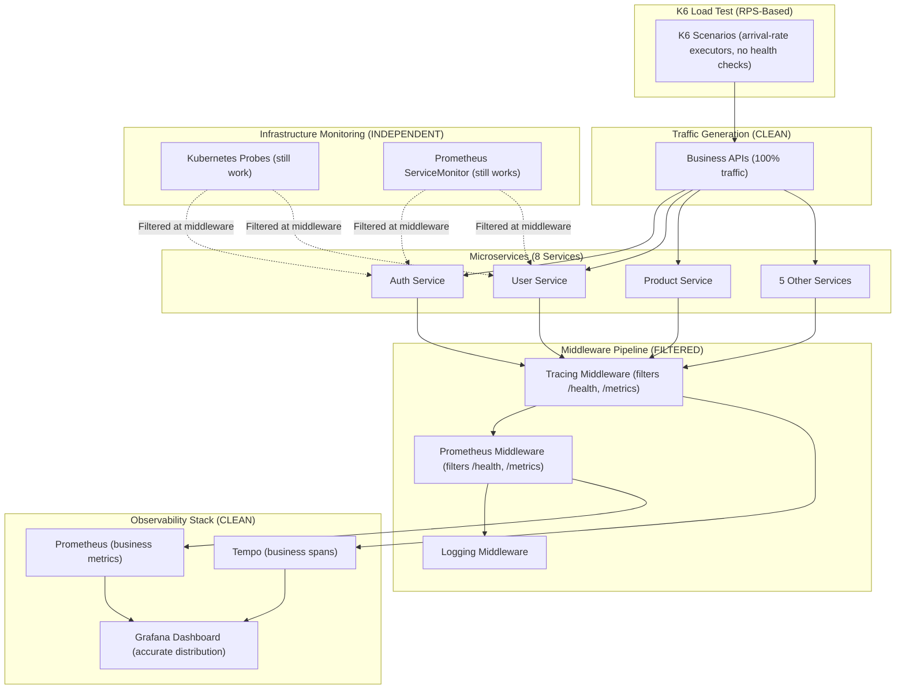

# k6 Load Testing

## Overview

k6 runs as a **continuous load generator** with realistic user journey functions to create traffic for all microservices for monitoring and distributed tracing. k6 is deployed via GitOps (Flux) using a HelmRelease in this repository.

## Architecture

### System Architecture (v0.6.14+)



**Key Design Principles:**
- ✅ K6 only calls business APIs - realistic traffic simulation
- ✅ Prometheus middleware filters infrastructure endpoints - defense in depth
- ✅ Tracing middleware filters infrastructure endpoints - cleaner traces
- ✅ Grafana shows 100% business traffic - accurate metrics
- ✅ Tempo has 0% health check spans - 79% storage savings
- ✅ Kubernetes probes still work - filtered at middleware, not blocked

**Traffic Flow:**
```
k6 → Business APIs → Microservices → Middleware (filters /health, /metrics) → Observability Stack
                                                                              ↓
                                          Kubernetes Probes → /health → Filtered (not recorded)
```

### Deployment Architecture

k6 is deployed using:
- **Helm Chart**: Reuses the same generic chart (`charts/`) used for microservices
- **Docker Image**: `ghcr.io/duynhne/k6:scenarios` (built from `k6/Dockerfile`)
- **Namespace**: Dedicated `k6` namespace
- **GitHub Actions**: Automated image builds via `.github/workflows/build-k6-images.yml`

### Request Flow Comparison

**Business Traffic (Recorded):**
```
k6 → /api/v1/users → Gin Handler → Prometheus Middleware ✅ Records metrics
                                  → Tracing Middleware ✅ Creates span
                                  → Logging Middleware ✅ Logs request
                                  → Response
```

**Infrastructure Traffic (Filtered):**
```
Kubernetes Probe → /health → Gin Handler → Prometheus Middleware ⏭️ SKIPS (early return)
                                          → Tracing Middleware ⏭️ SKIPS (filtered)
                                          → Logging Middleware ⏭️ Optional skip
                                          → Response ✅ Still returns 200 OK
```

**Result:**
- Business APIs: Full observability (metrics + traces + logs)
- Infrastructure endpoints: Still functional, just not recorded
- Storage: 75% reduction in datapoints
- Accuracy: 100% business traffic in metrics

---

## Files

- **HelmRelease**: `kubernetes/apps/k6.yaml` (Flux-managed)
- **Helm values**: embedded in the HelmRelease (`spec.values`)
- **Docker image**: `ghcr.io/duynhne/k6` (built and published from the k6 code repository/pipeline)

## Deployment

```bash
# Deploy via GitOps (Flux will reconcile k6 alongside other apps)
make up
make flux-status
```

**Result:**
- 1 pod running in `k6` namespace
- 9 scenarios total: 5 user personas + 4 production traffic patterns
- Peak: Up to 100 RPS (configurable via environment variables)
- Duration: 24 hours (production simulation)
- Arrival-rate executors for realistic traffic patterns

## Verify

```bash
# Check pod
kubectl get pods -n k6

# View logs
kubectl logs -n k6 -l app=k6 -f

# Check Helm release
helm list -n k6
```

## Enable/Disable

By default, k6 may be disabled in local to avoid consuming resources. To enable it, set `replicaCount` in `kubernetes/apps/k6.yaml` and reconcile:

```bash
# After changing manifests
make sync
```

## Load Test Details

### Professional High-Volume Test Configuration

**Duration:** 24 hours - Extended production simulation with realistic traffic patterns

**Load Pattern (Production Simulation - RPS-Based):**
- **Arrival-Rate Executors**: All scenarios use `ramping-arrival-rate` or `constant-arrival-rate` executors for realistic production traffic simulation
- **RPS-Based Load**: Traffic is controlled by requests per second (RPS) rather than virtual users (VUs)
- **Benefits**: More accurate production simulation, better capacity planning, realistic traffic patterns

**Peak Load:**
- **Total RPS**: Up to 100 RPS peak (configurable via `PEAK_RPS` environment variable)
- **Baseline RPS**: 30 RPS steady background traffic (configurable via `BASELINE_RPS`)
- **Burst RPS**: Up to 200 RPS during flash sales (configurable via `BURST_RPS`)
- **Max VUs**: 300 VUs allocated to handle peak traffic (auto-scaled by k6)

**Load Pattern Stages (Production Simulation):**
1. Morning Ramp-Up (30m): 0% → 60% RPS
2. Morning Peak (60m): 60% → 100% RPS (peak traffic)
3. Lunch Dip (30m): 100% → 70% RPS (reduced activity)
4. Afternoon Recovery (30m): 70% → 90% RPS
5. Evening Peak (60m): 90% → 100% RPS (second peak)
6. Evening Wind-Down (30m): 100% → 50% RPS
7. Night Low (15m): 50% → 20% RPS (minimal traffic)
8. Graceful Shutdown (5m): 20% → 0% RPS

**Journey Types (8 total):**
- 5 realistic user journeys (existing)
- 3 edge case journeys (new in v0.6.12):
  - Timeout/Retry Journey - Tests resilience
  - Concurrent Operations Journey - Tests race conditions
  - Error Handling Journey - Tests invalid inputs

**Traffic Focus (NEW in v0.6.14):**
- **Business traffic only** - No health checks or metrics endpoints
- **Separation of concerns**: 
  - Load testing → Simulates realistic user behavior
  - Infrastructure monitoring → Handled by Kubernetes probes
- **Why this matters**:
  - Metrics reflect actual user experience (not polluted by health checks)
  - APM traces show only business transactions
  - Storage efficiency (~75% reduction in Prometheus data)
  - Accurate SLO tracking

**Use Cases:**
- Production readiness validation
- Memory leak detection (6.5-hour extended soak test)
- Monitoring/tracing validation at scale
- Performance baseline establishment
- SLO compliance verification
- Overnight testing (conservative resource usage)

**Resource Requirements:**
- Cluster resources: Up to 300 VUs (auto-scaled) requires ~4GB RAM, 2 CPU cores for k6 pod
- Microservices: 8 services * 3 replicas * (500MB RAM + 200m CPU) = ~12GB RAM, 4.8 CPU cores
- Total: ~16GB RAM, ~6.8 CPU cores for duration of test
- **Note**: VUs are auto-scaled by k6 based on RPS requirements, not manually configured

---

### Multiple Scenarios Test (`load-test-multiple-scenarios.js`)

**Overview:**
- **9 scenarios total**: 5 user personas + 4 production traffic patterns
- **8 user journey functions** for realistic multi-service traces (5 existing + 3 edge cases)
- **Arrival-Rate Executors**: All scenarios use RPS-based executors for realistic production simulation
- **Full User Lifecycle**: All journeys include registration step (complete user flow from account creation)
- **Stack Layer & Operation Tags**: Automatic tagging for full-stack performance analysis

---

#### User Journey Functions

**Purpose:** Create deeper, more realistic distributed traces spanning multiple microservices, including:
- **Complete user lifecycle testing**: All journeys start with registration (full flow from account creation)
- **Edge case testing**: Resilience, error handling, and race condition scenarios
- **Full-stack coverage**: Tests web, logic, and database layers with automatic tagging
- **Production-ready patterns**: Realistic user behavior with proper error handling

**Journey Types:**

1. **E-commerce Shopping Journey** (8 services)
   - **Flow**: Auth → User → Product → Cart → Shipping → Order → Notification
   - **Steps**: **Register** → Login → Profile → Browse catalog → View product → Add to cart → View cart → Estimate shipping (GET) → Create order → Send notification
   - **Duration**: ~8 seconds per journey (includes registration)
   - **Features**:
     - **Complete user lifecycle**: Starts with registration (full flow from account creation)
     - Error handling for registration conflicts (409 retry logic)
     - Covers complete purchase flow
     - **Shipping**: Uses v1 GET `/api/v1/shipping/estimate` with query params
     - Session tracking (`session_id`, `user_id` tags)
     - Flow step tags (`1_register`, `2_login`, `3_profile`, ..., `10_notification`)
     - Stack layer tags: `database` for DB operations, `web` for API calls
     - Operation tags: `db_write` for registration/orders, `db_read` for queries

2. **Product Review Journey** (5 services)
   - **Flow**: Auth → User → Product → Review
   - **Steps**: **Register** → Login → Profile → View product → Read reviews → Write review
   - **Duration**: ~5 seconds per journey (includes registration)
   - **Features**: Complete user lifecycle with registration, stack layer and operation tags

3. **Order Tracking Journey** (6 services)
   - **Flow**: Auth → User → Order → Shipping → Notification
   - **Steps**: **Register** → Login → Profile → View orders → Order details → Track shipment → Check notifications
   - **Duration**: ~6 seconds per journey (includes registration)
   - **Features**: Complete user lifecycle with registration, stack layer and operation tags

4. **Quick Browse Journey** (4 services)
   - **Flow**: Product → Shipping → Cart (abandoned)
   - **Steps**: **Register** → Browse catalog → View product → Check shipping (GET) → Add to cart (abandon)
   - **Duration**: ~5 seconds per journey (includes registration)
   - **Features**: Complete user lifecycle with registration, stack layer and operation tags

5. **API Monitoring Journey** (7 services)
   - **Flow**: Auth, User, Product, Cart, Order, Review, Notification
   - **Steps**: Sequential health checks and data fetching across all services
   - **Duration**: ~1 second per journey (fast API client)

6. **Timeout/Retry Journey** (NEW in v0.6.12) - Edge Case
   - **Flow**: Product service with slow response + retries
   - **Steps**: Slow request → Retry 1 → Retry 2 → Retry 3 (exponential backoff)
   - **Duration**: ~5 seconds per journey
   - **Purpose**: Test system resilience with timeouts and retry logic

7. **Concurrent Operations Journey** (NEW in v0.6.12) - Edge Case
   - **Flow**: Cart service with parallel operations
   - **Steps**: Add item 1 + Add item 2 + View cart (simultaneous) → Verify cart
   - **Duration**: ~2 seconds per journey
   - **Purpose**: Test race conditions and deadlock scenarios

8. **Error Handling Journey** (NEW in v0.6.12) - Edge Case
   - **Flow**: Product → Cart → Order (all with invalid inputs)
   - **Steps**: Invalid product ID (404) → Invalid cart (400) → Invalid order (400)
   - **Duration**: ~1 second per journey
   - **Purpose**: Test error handling and validation

---

#### User Persona Integration

**1. Browser User (40%)** - Browse products, read reviews
   - 60% Quick Browse Journey (4 services)
   - 40% Simple browsing (legacy behavior)

**2. Shopping User (30%)** - Complete shopping flow (cart → checkout)
   - 80% E-commerce Shopping Journey (8 services)
   - 10% Concurrent Operations Journey (edge case)
   - 10% Simple shopping (legacy behavior)

**3. Registered User (15%)** - Authenticated actions (profile, orders)
   - 50% Order Tracking Journey (6 services)
   - 30% Product Review Journey (5 services)
   - 15% Error Handling Journey (edge case)
   - 5% Simple authenticated flow (legacy behavior)

**4. API Client (10%)** - High-volume API calls
   - 70% API Monitoring Journey (7 services)
   - 10% Timeout/Retry Journey (edge case)
   - 20% Fast endpoint testing (legacy behavior)

**5. Admin User (5%)** - Management operations
   - Management operations (unchanged from legacy)

---

#### Arrival-Rate Executors & RPS Stages

**Executor Types:**
- **`ramping-arrival-rate`**: Used for 5 user personas and 3 production traffic patterns
  - RPS-based load control (more realistic than VU-based)
  - Time-based stages with configurable RPS targets
  - Auto-scales VUs based on RPS requirements
- **`constant-arrival-rate`**: Used for baseline traffic scenario
  - Steady RPS throughout the day (30 RPS default)
  - 24-hour duration for continuous background traffic

**RPS-Based Load Patterns:**
- **Browser User**: 0 → 40 RPS peak (configurable via `PEAK_RPS` env var)
- **Shopping User**: 0 → 30 RPS peak
- **Registered User**: 0 → 15 RPS peak
- **API Client**: 0 → 10 RPS peak
- **Admin User**: 0 → 5 RPS peak
- **Baseline Traffic**: 30 RPS constant (24h duration)
- **Peak Hours**: 20 → 100 RPS (time-based patterns)
- **Flash Sale**: 0 → 200 RPS burst (configurable via `BURST_RPS`)
- **Marketing Campaign**: 0 → 300 RPS gradual ramp

**Load Pattern Stages (Production Simulation):**
- Morning Ramp-Up (30m): 0% → 60% RPS
- Morning Peak (60m): 60% → 100% RPS
- Lunch Dip (30m): 100% → 70% RPS
- Afternoon Recovery (30m): 70% → 90% RPS
- Evening Peak (60m): 90% → 100% RPS
- Evening Wind-Down (30m): 100% → 50% RPS
- Night Low (15m): 50% → 20% RPS
- Graceful Shutdown (5m): 20% → 0% RPS

**VU Allocation:**
- Pre-allocated VUs: 20% of peak (for efficiency)
- Max VUs: Auto-scaled by k6 based on RPS requirements (up to 300 VUs)
- VUs are dynamically allocated based on arrival rate, not manually configured

**Traffic:**
- Journey-based traffic (80% multi-service journeys, 20% legacy behavior)
- **Full user lifecycle**: All journeys start with registration (complete flow testing)
- Think times: 0.3-2 seconds between steps (realistic user pauses)
- **Stack layer & operation tags**: Automatic tagging for full-stack analysis
- Health checks: Removed from load tests (infrastructure monitoring handled separately)
  - Prometheus/Kubernetes probes handle health monitoring
  - 100% business traffic in metrics and traces
  - Focuses load testing on actual business API endpoints

**Thresholds:**
- Per-scenario thresholds (API client: p95 < 300ms)
- Shopping flow: p95 < 1000ms (có thể chậm hơn)

## Full Stack Testing Tags

k6 automatically tags all requests with `stack_layer` and `operation` tags for comprehensive full-stack performance analysis.

### Stack Layer Tags

**Purpose**: Identify which layer of the 3-layer architecture is being tested

**Values:**
- `web`: Web layer (HTTP handlers, request/response)
- `logic`: Logic layer (business logic, orchestration)
- `database`: Database layer (queries, transactions)

**Usage**: Filter metrics by layer to identify bottlenecks
```promql
# Database layer performance
rate(request_duration_seconds_count{stack_layer="database"}[5m])

# Web layer performance
rate(request_duration_seconds_count{stack_layer="web"}[5m])
```

### Operation Tags

**Purpose**: Identify the type of operation being performed

**Values:**
- `db_read`: Database read operations (SELECT queries)
- `db_write`: Database write operations (INSERT, UPDATE, DELETE)
- `api_call`: API calls without database operations

**Usage**: Filter metrics by operation type to analyze read vs write performance
```promql
# Database write performance
rate(request_duration_seconds_count{operation="db_write"}[5m])

# Database read performance
rate(request_duration_seconds_count{operation="db_read"}[5m])
```

### Automatic Tagging

The `makeRequest()` function automatically adds these tags to all requests:

```javascript
// Automatic tagging in makeRequest function
makeRequest('POST', url, body, tags, 'database', 'db_write');
// Adds: stack_layer="database", operation="db_write"

makeRequest('GET', url, null, tags, 'database', 'db_read');
// Adds: stack_layer="database", operation="db_read"
```

**Benefits:**
- Consistent tagging across all journeys
- Full-stack performance analysis in Prometheus/Grafana
- Easy filtering by layer or operation type
- Identify bottlenecks at specific layers or operations

## Metrics Flow

1. **k6** → Generates HTTP traffic with stack_layer and operation tags
2. **Go apps** → Export metrics (duration, RPS, errors, etc.) with tags
3. **Prometheus** → Scrapes metrics mỗi 15s (preserves tags)
4. **Grafana** → Visualizes trong dashboard (34 panels) with tag-based filtering

## Configuration

### Environment Variables

k6 load testing configuration can be externalized via environment variables, allowing RPS targets and traffic patterns to be adjusted without code changes.

#### RPS Targets

| Variable | Default | Description |
|----------|---------|-------------|
| `BASELINE_RPS` | `30` | Baseline traffic: Steady background RPS throughout the day |
| `PEAK_RPS` | `100` | Peak traffic: Maximum RPS during morning/evening peaks |
| `BURST_RPS` | `200` | Burst traffic: Maximum RPS during flash sales or traffic spikes |

#### Traffic Pattern Timing

| Variable | Default | Description |
|----------|---------|-------------|
| `BURST_DURATION` | `5m` | Duration to sustain burst traffic (e.g., `5m`, `10m`) |
| `BURST_TIMING` | `10:00-14:00` | Timing window for burst scenarios (e.g., `10:00-14:00` for 10 AM - 2 PM) |

### Configuration via Helm Values

Environment variables are configured in `charts/mop/values/k6.yaml` (and applied via Flux through `kubernetes/apps/k6.yaml`):

```yaml
env:
  - name: BASELINE_RPS
    value: "30"
  - name: PEAK_RPS
    value: "100"
  - name: BURST_RPS
    value: "200"
  - name: BURST_DURATION
    value: "5m"
  - name: BURST_TIMING
    value: "10:00-14:00"
```

### Updating Configuration

To change RPS targets or traffic patterns:

1. **Update Helm values:**
   ```bash
   # Edit charts/mop/values/k6.yaml
   # Change environment variable values
   ```

2. **Apply changes:**
   ```bash
   helm upgrade k6 charts/mop/ -f charts/mop/values/k6.yaml -n k6
   ```

3. **Verify configuration:**
   ```bash
   kubectl exec -n k6 <k6-pod> -- env | grep -E "BASELINE_RPS|PEAK_RPS|BURST_RPS"
   ```

### Traffic Pattern Scenarios

The k6 script includes 4 production traffic pattern scenarios that run concurrently with user persona scenarios:

#### 1. Baseline Traffic (`baseline_traffic`)

**Purpose**: Simulate steady background traffic throughout the day

**Configuration:**
- **Executor**: `constant-arrival-rate`
- **RPS**: 30 RPS (configurable via `BASELINE_RPS` environment variable)
- **Duration**: 24 hours
- **Pre-allocated VUs**: 50
- **Max VUs**: 200

**Use Case**: Continuous background load to test system stability and resource usage

#### 2. Peak Hours (`peak_hours`)

**Purpose**: Simulate realistic production traffic with morning/evening peaks and lunch dip

**Configuration:**
- **Executor**: `ramping-arrival-rate`
- **Start Rate**: 20 RPS (night low)
- **Peak Rate**: 100 RPS (configurable via `PEAK_RPS` environment variable)
- **Duration**: 24 hours
- **Pre-allocated VUs**: 50
- **Max VUs**: 300

**Stages:**
- Morning Peak (3h): 9 AM - 12 PM → Ramp to 100 RPS
- Lunch Dip (2h): 12 PM - 2 PM → Drop to 60 RPS
- Afternoon Recovery (4h): 2 PM - 6 PM → Ramp to 90 RPS
- Evening Peak (4h): 6 PM - 10 PM → Peak at 100 RPS
- Night Low (8h): 10 PM - 6 AM → Drop to 20 RPS
- Morning Ramp-Up (3h): 6 AM - 9 AM → Ramp to 100 RPS

**Use Case**: Production traffic pattern simulation for capacity planning

#### 3. Flash Sale (`flash_sale`)

**Purpose**: Simulate sudden traffic spikes during flash sales or viral events

**Configuration:**
- **Executor**: `ramping-arrival-rate`
- **Burst RPS**: 200 RPS (configurable via `BURST_RPS` environment variable)
- **Burst Duration**: 5 minutes (configurable via `BURST_DURATION` environment variable)
- **Pre-allocated VUs**: 50
- **Max VUs**: 400

**Stages:**
- Pre-event (30m): 0 → 50 RPS (anticipation)
- Burst (30s): 50 → 200 RPS (sudden spike)
- Sustain (5m): 200 RPS (peak load)
- Drop (2m): 200 → 100 RPS (gradual decrease)
- Post-event (30m): 100 → 20 RPS (return to baseline)

**Use Case**: Stress testing for sudden traffic spikes, flash sale events

#### 4. Marketing Campaign (`marketing_campaign`)

**Purpose**: Simulate gradual traffic increase from marketing campaigns

**Configuration:**
- **Executor**: `ramping-arrival-rate`
- **Peak RPS**: 300 RPS
- **Pre-allocated VUs**: 50
- **Max VUs**: 500

**Stages:**
- Campaign Start (1h): 0 → 50 RPS (campaign launch)
- Gradual Ramp-Up (3h): 50 → 200 RPS (viral spread)
- Peak Engagement (2h): 200 → 300 RPS (peak interest)
- Sustained Interest (3h): 300 RPS (maintained engagement)
- Gradual Wind-Down (2h): 300 → 150 RPS (interest fading)
- Return to Baseline (1h): 150 → 30 RPS (campaign ends)

**Use Case**: Marketing campaign simulation, gradual traffic growth testing

**Concurrent Execution:**
All 4 traffic pattern scenarios run concurrently with the 5 user persona scenarios, simulating realistic production traffic with multiple load patterns overlapping.

---
