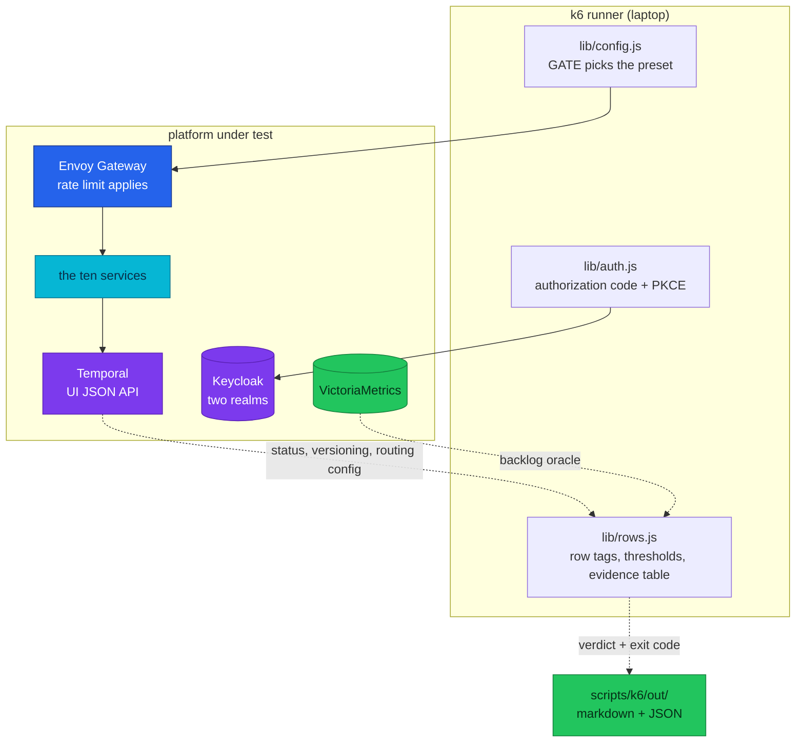

# k6 — the assertion layer for both E2E gates

The gates used to be read by eye; now a failed row is an exit code.

| | |
|---|---|
| **Status** | In use on the Kind gate; compose rows staged |
| **Lives in** | [`scripts/k6/`](../../scripts/k6/) — one suite, both gates |
| **Entry point** | `make e2e GATE=kind` (or `GATE=compose`) |
| **Decision record** | [ADR-056](../proposals/adr/ADR-056-k6-e2e-assertion-layer/) |
| **Gates it serves** | [`local-stack/docs/e2e-audit.md`](../../local-stack/docs/e2e-audit.md), [`kind-e2e-audit.md`](../platform/kind-e2e-audit.md) |
| **Needs** | `k6` on PATH (v2.x); a running stack; nothing else |

## Why

Both release gates were runbooks: paste a `curl`, read the status code, tick a
box. That shape has three costs, and all three were paid.

- **Nothing returns a verdict.** A row that regresses passes by going unread.
  There was no `make` target for e2e at all, so no CI job and no exit code could
  ever depend on one.
- **Rows can be written so they cannot pass.** K4.3 drove
  `https://127.0.0.1/…` and wanted `404`. SNI may not carry an IP literal, so no
  TLS filter chain matches and the connection is dropped before HTTP happens —
  `curl` reports exit 35. The row had never passed and its failure read as a
  broken edge.
- **Whole dimensions went unmeasured.** Across 104 rows there was exactly one
  numeric threshold. No row asserted throughput, none issued two requests at
  once, and neither gate tested the edge rate limiter — while the two gates were
  configured 25× apart.

## What it asserts

| Script | Rows | Claim |
|---|---|---|
| `smoke.js` | K4.1–K4.8, K5.2/K5.6/K5.8 (`A1`, `C6`, `C16`, `C21` on compose) | Redirect, TLS, host routing, both realms, token claims, the realm fence, and telemetry coverage |
| `saga.js` | K1.7 + K4.10 | An order completes with nobody touching it, ran `Pinned`, on the Current build id, no half-finished ramp |
| `ratelimit.js` | RL.1, RL.2 | Under the ceiling nothing is limited; over it, `429` carries the draft-03 headers a client needs to back off |
| `load.js` | LD.1 | Orders through the edge at a chosen rate, and the Temporal backlog it builds |

## How it works here


```mermaid
flowchart TD
  subgraph runner["k6 runner (laptop)"]
    cfg["lib/config.js<br/>GATE picks the preset"]
    auth["lib/auth.js<br/>authorization code + PKCE"]
    rows["lib/rows.js<br/>row tags, thresholds, evidence table"]
  end

  cfg --> edge
  auth --> kc
  subgraph platform["platform under test"]
    edge["Envoy Gateway<br/>rate limit applies"]
    kc[("Keycloak<br/>two realms")]
    svc["the ten services"]
    tem["Temporal<br/>UI JSON API"]
    vm[("VictoriaMetrics")]
  end

  edge --> svc
  svc --> tem
  rows -.->|"verdict + exit code"| out["scripts/k6/out/<br/>markdown + JSON"]
  tem -.->|"status, versioning, routing config"| rows
  vm -.->|"backlog oracle"| rows

  classDef edgeC fill:#2563eb,color:#fff,stroke:#1e3a8a;
  classDef service fill:#06b6d4,color:#082f49,stroke:#0e7490;
  classDef platformC fill:#7c3aed,color:#fff,stroke:#5b21b6;
  classDef data fill:#22c55e,color:#052e16,stroke:#15803d;

  class edge edgeC;
  class svc service;
  class kc,tem platformC;
  class vm,out data;
```

**One suite, two gates.** A unit declares a row id *per gate*, because the two
runbooks number the same assertion differently — a token mint is `A1` on compose
and `K4.5` on Kind — and some rows exist on only one side, since TLS rows are
meaningless against plain-HTTP compose. A unit with no id for the current gate is
reported as skipped, so the coverage asymmetry between the gates is a number in
the summary instead of something you notice by reading two files side by side.

**Rows become thresholds.** Every assertion is tagged with its row and every row
carries `checks{row:<id>}: rate==1.0`. A failed assertion breaches its threshold
and k6 exits non-zero. `handleSummary()` prints the PASS/FAIL table both
runbooks currently ask a human to type, and writes it to `scripts/k6/out/`.

**A row that never ran says so.** Declaring a threshold mints the submetric even
when nothing asserted against it, so zero-of-zero is reported as **DID NOT RUN**
rather than as a pass or a failure — the one outcome a green summary otherwise
cannot distinguish from success.

**PKCE is in JS, not bash.** Neither realm accepts a password grant, so every
token costs a full authorization-code round trip. Doing it in-script mints
per-VU, and avoids a trap the shell version cannot: under zsh, `USERNAME` is
already set to the OS user, so `USERNAME=alice ./keycloak-token.sh` logs in as
whoever is at the keyboard. The bash helper stays for hand-driven rows.

**Identity is modelled, not just concurrency.** Access tokens live 900s and the
services hold one active checkout session per user, so two VUs driving the same
identity evict each other and the failure surfaces as an unrelated `409`. One
identity per VU; four customer identities means four VUs is the ceiling for
order load, and that is a data constraint rather than a tuning choice.

**Everything goes through the edge.** Calling a ClusterIP directly would make
load trivial and the run worthless as gate evidence:
[ADR-046](../proposals/adr/ADR-046-e2e-gate-kind-fallback/) is explicit that a
tag may never be gated on a path that skips edge policy. Pacing is therefore
bounded by the limiter, and bounded *per route* — one order costs 2 requests on
`cart` and 5 on `checkout`, so the checkout bucket is what binds.

## Operations

```bash
make e2e GATE=kind          # smoke + saga
make e2e-ratelimit GATE=kind
make e2e-load GATE=kind ORDERS_PER_SEC=2
```

Evidence lands in `scripts/k6/out/` (git-ignored) as markdown ready to paste
into a PR, plus the raw summary JSON. Add `K6_WEB_DASHBOARD=true
K6_WEB_DASHBOARD_EXPORT=report.html` for an HTML report, or
`-o experimental-prometheus-rw` with `K6_PROMETHEUS_RW_SERVER_URL` pointed at
VictoriaMetrics to keep run metrics alongside the platform's own.

### Building a Temporal backlog

`load.js` is the only way this platform has produced a non-zero
`approximate_backlog_count` — the signal
[ADR-055](../proposals/adr/ADR-055-keda-worker-autoscaling/) proposes to scale
on. Two things to know before repeating it:

- **`kubectl scale` cannot drain a versioned worker.** The Worker Controller
  owns the replica count and restores it within seconds. Patch the CRD:
  `kubectl -n order patch wd order-fulfillment --type=merge -p '{"spec":{"replicas":0}}'`.
- **A single SKU carries finite seeded stock.** Sustained load meets
  `insufficient stock to reserve` and the saga fails — correctly, refusing to
  oversell. Past that point the run measures the inventory, not the platform.
  `saga.js` arms stock through the staff receipt endpoint for exactly this
  reason.

### Reading a failure

| Symptom | Meaning |
|---|---|
| `DID NOT RUN` | The row never executed — usually an earlier throw in the same scenario |
| `no login form for realm …` | The authorize step followed a redirect to the SPA; the VU already held an SSO session |
| `503` on `/protected/` | The service's staff JWKS is unreachable, not an identity outage — see [`api.md`](../api/api.md) |
| `429` below the ceiling | The configured number moved in `btp-api.yaml` and `config.js` is stale |

## References

- [ADR-056](../proposals/adr/ADR-056-k6-e2e-assertion-layer/) — the decision to assert with k6
- [ADR-045](../proposals/adr/ADR-045-local-first-edge-rate-limiting/) — edge rate limiting, and the sizing this suite measures
- [ADR-046](../proposals/adr/ADR-046-e2e-gate-kind-fallback/) — where the gate runs, and why load must not bypass the edge
- [Grafana k6 documentation](https://grafana.com/docs/k6/latest/)

_Last updated: 2026-08-22 — first cut: smoke, saga, rate limit and load, proven on a live Kind cluster._
