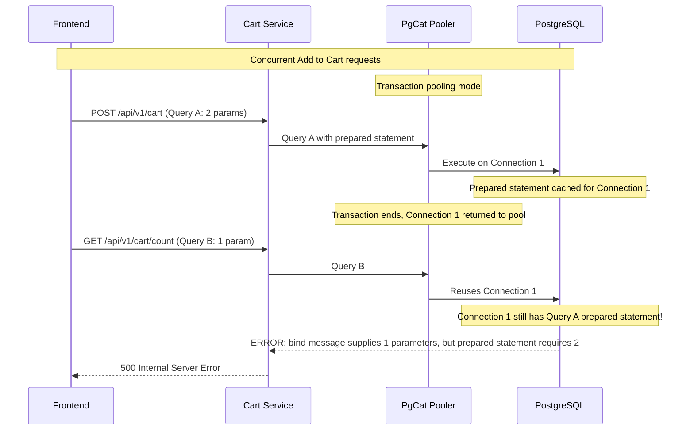

# PgCat Prepared Statement Error - Cart Count 500

## Problem

Intermittent 500 errors on `/api/v1/cart/count` when adding items to cart rapidly (>10 consecutive requests).

**Error Message:**

```
error: pq: bind message supplies 1 parameters, but prepared statement "" requires 2
```

**Stacktrace:** `CartHandler.GetCartCount` → `CartService.GetCartCount` → `PostgresCartRepository.GetItemCount`

## Root Cause



**Explanation:**

1. **PgCat transaction mode** returns connections to pool after each transaction
2. **Go `database/sql` driver** caches prepared statements per connection
3. When connection is **reused** for different query, **old prepared statement** may still be active
4. **Parameter mismatch** causes error

## Solution

**Replace** `binary_parameters=yes` **with** `prefer_simple_protocol=true` in DSN.

### Why This Works

| Parameter | Behavior | Effective? |
|-----------|----------|------------|
| `binary_parameters=yes` | Disables binary encoding, **still uses prepared statements** | ❌ No |
| Session mode pooling | Keeps connection per session, reduces pooling efficiency | ❌ No (tested) |
| `prefer_simple_protocol=true` | Disables prepared statements completely, uses simple query protocol | ✅ Yes |

### Files Changed

**Cart Service:** [`services/cart/internal/core/database.go`](../../services/cart/internal/core/database.go)

```go
// Before
return fmt.Sprintf("postgresql://%s:%s@%s:%s/%s?sslmode=%s&binary_parameters=yes", ...)

// After
return fmt.Sprintf("postgresql://%s:%s@%s:%s/%s?sslmode=%s&prefer_simple_protocol=true", ...)
```

**Order Service:** [`services/order/internal/core/database.go`](../../services/order/internal/core/database.go)

```go
// Same change as Cart service
```

## Testing

```bash
# Build and deploy
cd services
go build -o bin/cart cmd/cart/main.go
go build -o bin/order cmd/order/main.go

# Deploy to Kubernetes
make flux-push

# Load test
# Add to cart 20+ times consecutively
# Verify: No 500 errors, cart count always accurate
```

## Acceptance Criteria

- ✅ Add to cart 20+ times consecutively without 500 errors
- ✅ `/api/v1/cart/count` always returns 200 OK
- ✅ No "bind message supplies X parameters" errors in logs
- ✅ Cart count is accurate and stable

## References

- PostgreSQL Simple Query Protocol: https://www.postgresql.org/docs/current/protocol-flow.html#PROTOCOL-FLOW-SIMPLE-QUERY
- PgCat Transaction Pooling: https://github.com/postgresml/pgcat#pool-modes
- Go pq Driver Options: https://pkg.go.dev/github.com/lib/pq#hdr-Connection_String_Parameters

## Related Issues

- Affected services: Cart, Order (both use PgCat transaction pooler)
- Date discovered: 2026-01-21
- Fixed by: `prefer_simple_protocol=true` parameter
