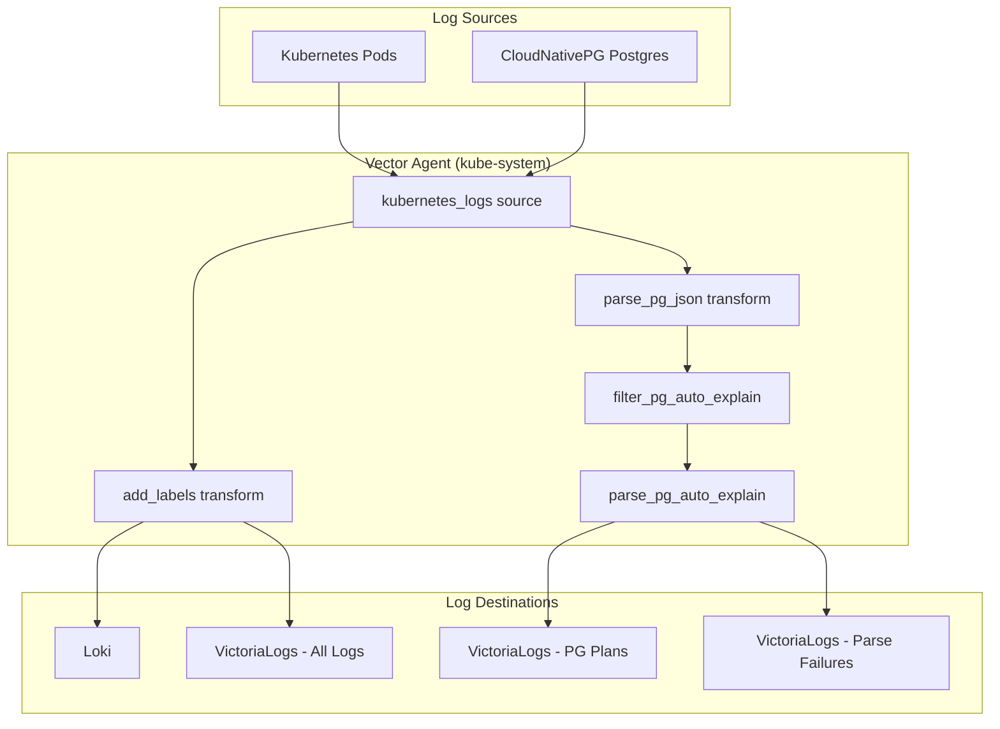

# VictoriaLogs

VictoriaLogs is deployed as an additional log storage backend alongside Loki. It provides high-performance log ingestion and querying using LogsQL.

## Architecture



### Single Vector Design

This deployment uses a **single cluster-wide Vector Agent** (`kube-system/vector`) that ships logs to **both** Loki and VictoriaLogs. The VictoriaLogs Helm chart's embedded Vector/collector is **disabled** to avoid conflicts.

**Why single Vector?**
- Eliminates duplicate log collection
- Simplifies configuration management
- Reduces resource overhead
- Consistent log processing across backends

## Components

| Component | Namespace | Purpose |
|-----------|-----------|---------|
| `victorialogs` | `monitoring` | Log storage and query engine |
| `vector` | `kube-system` | Log collection agent (DaemonSet) |

## Endpoints

### VictoriaLogs Service

- **Service**: `victorialogs-victoria-logs-single-server.monitoring.svc.cluster.local`
- **Port**: `9428`

### Ingestion Endpoints

| Endpoint | Purpose | Used By |
|----------|---------|---------|
| `/insert/jsonline` | JSON Lines ingestion | Vector sinks |
| `/insert/elasticsearch` | Elasticsearch-compatible bulk API | Alternative ingestion |
| `/select/logsql/query` | LogsQL query endpoint | Grafana datasource |

### Vector Sink Headers

The Vector sinks use the following VictoriaLogs-specific headers:

```yaml
request:
  headers:
    VL-Time-Field: timestamp      # Field containing log timestamp
    VL-Msg-Field: message         # Field containing log message
    VL-Stream-Fields: namespace,service,pod_name,container_name  # Stream indexing
    AccountID: "0"                # Multi-tenancy (default: 0)
    ProjectID: "0"                # Multi-tenancy (default: 0)
```

## Log Streams

### All Logs Stream

All Kubernetes logs are shipped to VictoriaLogs with these stream fields:
- `namespace`
- `service`
- `pod_name`
- `container_name`

### PostgreSQL Query Plans Stream

CloudNativePG auto_explain logs are parsed and stored with:
- `cluster_name` - CloudNativePG cluster name
- `namespace` - Kubernetes namespace
- `database` - PostgreSQL database name
- `query_id` - PostgreSQL query ID

## Configuration

### VictoriaLogs HelmRelease

Location: `kubernetes/infra/controllers/apm/victorialogs/helmrelease.yaml`

Key settings:
```yaml
values:
  server:
    retentionPeriod: 7d
    persistentVolume:
      enabled: true
      size: 20Gi
  
  # CRITICAL: Embedded Vector is disabled
  vector:
    enabled: false
```

### Vector HelmRelease

Location: `kubernetes/infra/controllers/apm/vector/vector.yaml`

The Vector config includes:
- **Sources**: `kubernetes_logs`
- **Transforms**: `add_labels`, `parse_pg_json`, `filter_pg_auto_explain`, `parse_pg_auto_explain`
- **Sinks**: `loki`, `victorialogs_all`, `victorialogs_pg_plans`, `victorialogs_pg_parse_failures`

## Verification

### Check Flux Reconciliation

```bash
# Check HelmRelease status
kubectl get helmrelease -n monitoring victorialogs
kubectl get helmrelease -n kube-system vector

# Check pods
kubectl get pods -n monitoring -l app.kubernetes.io/name=victoria-logs-single
kubectl get pods -n kube-system -l app.kubernetes.io/name=vector
```

### Check VictoriaLogs Health

```bash
# Port-forward to VictoriaLogs
kubectl port-forward -n monitoring svc/victorialogs-victoria-logs-single-server 9428:9428

# Check health endpoint
curl http://localhost:9428/health

# Query logs (LogsQL)
curl -G 'http://localhost:9428/select/logsql/query' \
  --data-urlencode 'query=_stream:{namespace="monitoring"}' \
  --data-urlencode 'limit=10'
```

### Check Vector Logs

```bash
# Check Vector logs for successful pushes
kubectl logs -n kube-system -l app.kubernetes.io/name=vector --tail=100 | grep -i victorialogs

# Check for errors
kubectl logs -n kube-system -l app.kubernetes.io/name=vector --tail=100 | grep -i error
```

### Verify PostgreSQL Plan Ingestion

```bash
# Query for PostgreSQL plans in VictoriaLogs
curl -G 'http://localhost:9428/select/logsql/query' \
  --data-urlencode 'query=_stream:{cluster_name!=""}' \
  --data-urlencode 'limit=10'
```

## Troubleshooting

### No Logs in VictoriaLogs

1. **Check Vector is running**:
   ```bash
   kubectl get pods -n kube-system -l app.kubernetes.io/name=vector
   ```

2. **Check Vector sink connectivity**:
   ```bash
   kubectl logs -n kube-system -l app.kubernetes.io/name=vector | grep -i "victorialogs\|connection\|error"
   ```

3. **Verify VictoriaLogs service is accessible**:
   ```bash
   kubectl run -it --rm debug --image=curlimages/curl -- \
     curl -s http://victorialogs-victoria-logs-single-server.monitoring.svc.cluster.local:9428/health
   ```

### PostgreSQL Plans Not Appearing

1. **Verify CloudNativePG clusters have auto_explain enabled** in PostgreSQL parameters

2. **Check filter is working**:
   ```bash
   kubectl logs -n kube-system -l app.kubernetes.io/name=vector | grep -i "pg_auto_explain"
   ```

3. **Generate a slow query** to trigger auto_explain:
   ```sql
   -- Connect to product-db or transaction-db
   SELECT pg_sleep(1);
   ```

### High Memory Usage in Vector

If Vector is consuming too much memory:

1. **Check current resource usage**:
   ```bash
   kubectl top pods -n kube-system -l app.kubernetes.io/name=vector
   ```

2. **Adjust buffer settings** in Vector HelmRelease:
   ```yaml
   buffer:
     type: memory
     max_events: 5000  # Reduce from 10000
     when_full: drop_newest
   ```

## Related Documentation

- **Official VictoriaLogs Docs**: https://docs.victoriametrics.com/victorialogs/
- **VictoriaLogs Vector Setup**: https://docs.victoriametrics.com/victorialogs/data-ingestion/vector
- **VictoriaLogs Helm Chart**: https://docs.victoriametrics.com/helm/victorialogs-single/
- **LogsQL Query Language**: https://docs.victoriametrics.com/victorialogs/logsql/
- **Vector Documentation**: https://vector.dev/docs/

## Manifest Locations

| Resource | Path |
|----------|------|
| VictoriaLogs OCI Source | `kubernetes/clusters/local/sources/oci/victorialogs-oci.yaml` |
| VictoriaLogs HelmRelease | `kubernetes/infra/controllers/apm/victorialogs/helmrelease.yaml` |
| Vector HelmRelease | `kubernetes/infra/controllers/apm/vector/vector.yaml` |
