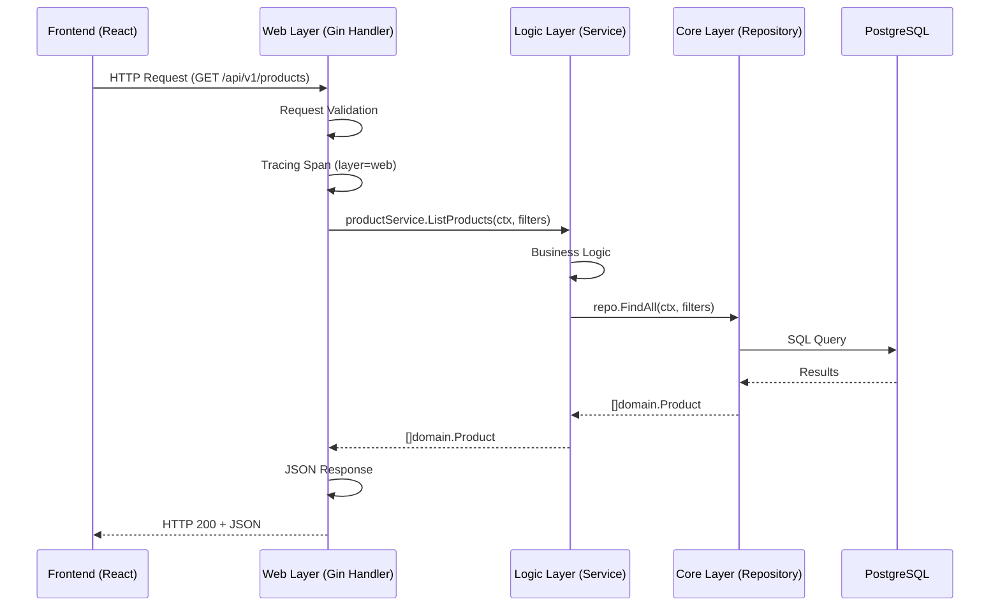

# Frontend - E-Commerce Monitoring App

React + Vite frontend application for the e-commerce microservices monitoring system.

## Prerequisites

- Node.js 24.x
- npm 10.x
- Backend API running (for full functionality)

## Local Development

### 1. Install Dependencies

```bash
npm install
```

### 2. Configure Environment (Optional)

Create `.env.local` for custom API URL:

```bash
VITE_API_BASE_URL=http://localhost:8080
```

**Default**: Uses Vite proxy to `http://localhost:8080` (no config needed)

### 3. Start Development Server

```bash
npm run dev
```

App available at **http://localhost:3000**

### 4. Backend Connection

Frontend expects backend at `http://localhost:8080`:

```bash
# Port-forward backend service
kubectl port-forward svc/product 8080:8080
```

## Build & Deploy

### Build-Time Configuration

API URL is **baked into the build** via `VITE_API_BASE_URL`:

```bash
# Development build
VITE_API_BASE_URL=http://localhost:8080 npm run build

# Staging build
VITE_API_BASE_URL=https://api-staging.mycompany.com npm run build

# Production build
VITE_API_BASE_URL=https://api.mycompany.com npm run build
```

### Docker Build

Each environment gets its own image with API URL baked in:

```bash
# Development
docker build \
  --build-arg API_BASE_URL=http://localhost:8080 \
  -t frontend:dev \
  .

# Staging
docker build \
  --build-arg API_BASE_URL=https://api-staging.mycompany.com \
  -t frontend:staging \
  .

# Production
docker build \
  --build-arg API_BASE_URL=https://api.mycompany.com \
  -t frontend:prod \
  .
```

### Run Container

```bash
# No runtime env vars needed - API URL is baked in
docker run -d -p 80:80 frontend:prod
```

### Kubernetes Deployment

Deploy via Helm using the frontend values file:

```bash
# Deploy frontend to default namespace
helm install frontend charts/mop -f charts/mop/values/frontend.yaml -n default

# Or upgrade existing deployment
helm upgrade --install frontend charts/mop -f charts/mop/values/frontend.yaml -n default
```

**Helm Values Configuration:**
- `replicaCount: 1` - Single pod (static files, no scaling needed)
- `service.type: ClusterIP` - Internal service (use port-forward for local access)
- `livenessProbe` and `readinessProbe` - Configured for `/health` endpoint
- `resources` - Minimal (32Mi memory, 25m CPU)

**Access via Port-Forward:**
```bash
# Port-forward frontend service (or use scripts/08-setup-access.sh)
kubectl port-forward -n default svc/frontend 3000:80

# Access at http://localhost:3000
```

## API Contract

### Overview

Frontend consumes backend REST APIs following the contract defined in [API_REFERENCE.md](../docs/guides/API_REFERENCE.md).

**Base URL**: Configured via `VITE_API_BASE_URL` at build time
**API Version**: `/api/v1`
**Full URL**: `{VITE_API_BASE_URL}/api/v1`

### Authentication

All authenticated endpoints require JWT token:

```javascript
// Stored in localStorage after login
const token = localStorage.getItem('authToken');

// Automatically added by axios interceptor in client.js
headers: {
  Authorization: `Bearer ${token}`
}
```

**Auto-redirect on 401**: Frontend automatically redirects to `/login` when token expires.

---

## Frontend-Backend Integration

### API URL Configuration: localhost:8080 for Local/Kind Testing

**Important:** Frontend runs in the browser, not in the Kubernetes pod.

**How it works:**
1. **Frontend pod** serves static files via nginx (port 80)
2. **Browser** loads frontend from `localhost:3000` (port-forwarded from pod)
3. **Browser** makes API calls to `localhost:8080` (backend services port-forwarded)
4. **`localhost` in browser** = user's machine, NOT pod's localhost
5. **Port-forward** bridges browser → Kubernetes services

**Why `localhost:8080` works:**
- Frontend code runs in **browser JavaScript** (not in pod)
- Browser's `localhost` refers to **user's machine**
- Backend services port-forwarded to `localhost:8080` on user's machine
- Frontend API calls from browser → `localhost:8080` → port-forward → backend service ✅

**For Production (Real K8s):**
- Would use service DNS: `http://product.default.svc.cluster.local:8080`
- But for Kind/local testing: `localhost:8080` is correct ✅

**Setup:**
```bash
# Port-forward backend services (via scripts/08-setup-access.sh)
kubectl port-forward -n product svc/product 8080:8080

# Frontend build with localhost:8080
docker build --build-arg API_BASE_URL=http://localhost:8080 -t frontend .

# Frontend in browser calls: http://localhost:8080/api/v1/products
```

### API Endpoint Mapping

Complete mapping of frontend API endpoints to backend web layer handlers:

| Frontend API | HTTP Method | Backend Service | Backend Handler | Web Layer File | Logic Layer Call |
|-------------|-------------|-----------------|-----------------|----------------|-------------------|
| `/api/v1/products` | GET | product | `ListProducts` | `services/product/internal/web/v1/handler.go:24` | `productService.ListProducts()` |
| `/api/v1/products/:id` | GET | product | `GetProduct` | `services/product/internal/web/v1/handler.go:54` | `productService.GetProduct()` |
| `/api/v1/products/:id/details` ⭐ | GET | product | `GetProductDetails` | `services/product/internal/web/v1/handler.go:125` | `productService.GetProduct()` + aggregation |
| `/api/v1/cart` | GET | cart | `GetCart` | `services/cart/internal/web/v1/handler.go:26` | `cartService.GetCart()` |
| `/api/v1/cart/count` ⭐ | GET | cart | `GetCartCount` | `services/cart/internal/web/v1/handler.go:98` | `cartService.GetCartCount()` |
| `/api/v1/cart` | POST | cart | `AddToCart` | `services/cart/internal/web/v1/handler.go:60` | `cartService.AddToCart()` |
| `/api/v1/cart/items/:itemId` ⭐ | PATCH | cart | `UpdateCartItem` | `services/cart/internal/web/v1/handler.go:124` | `cartService.UpdateItemQuantity()` |
| `/api/v1/cart/items/:itemId` ⭐ | DELETE | cart | `RemoveCartItem` | `services/cart/internal/web/v1/handler.go:162` | `cartService.RemoveItem()` |
| `/api/v1/orders` | GET | order | `ListOrders` | `services/order/internal/web/v1/handler.go:26` | `orderService.ListOrders()` |
| `/api/v1/orders/:id` | GET | order | `GetOrder` | `services/order/internal/web/v1/handler.go:54` | `orderService.GetOrder()` |
| `/api/v1/orders` | POST | order | `CreateOrder` | `services/order/internal/web/v1/handler.go:84` | `orderService.CreateOrder()` |
| `/api/v1/auth/login` | POST | auth | `Login` | `services/auth/internal/web/v1/handler.go:19` | `authService.Login()` |
| `/api/v1/auth/register` | POST | auth | `Register` | `services/auth/internal/web/v1/handler.go:81` | `authService.Register()` |

**Legend:**
- ⭐ = Phase 1 aggregation endpoints (optimized for frontend)
- All endpoints follow 3-layer pattern: Web → Logic → Core

### Request Flow Diagram



---

### Frontend API Endpoints

Frontend consumes these backend REST APIs. All endpoints follow the contract defined in [API_REFERENCE.md](../docs/guides/API_REFERENCE.md).

**Base URL**: `{VITE_API_BASE_URL}/api/v1`

---

#### Product Service

##### `GET /api/v1/products`
**Purpose**: List all products  
**Auth**: No

**Response:**
```json
[
  {
    "id": "1",
    "name": "Wireless Mouse",
    "description": "Ergonomic wireless mouse...",
    "price": 29.99,
    "category": "Electronics"
  }
]
```

---

##### `GET /api/v1/products/:id`
**Purpose**: Get single product  
**Auth**: No

**Response:**
```json
{
  "id": "1",
  "name": "Wireless Mouse",
  "description": "Ergonomic wireless mouse...",
  "price": 29.99,
  "category": "Electronics"
}
```

---

##### `GET /api/v1/products/:id/details` ⭐
**Purpose**: Aggregated product details (product + stock + reviews + related)  
**Auth**: No

**Response:**
```json
{
  "product": {
    "id": "1",
    "name": "Wireless Mouse",
    "price": 29.99,
    "description": "...",
    "category": "Electronics"
  },
  "stock": {
    "available": true,
    "quantity": 50
  },
  "reviews": [],
  "reviews_summary": {
    "total": 0,
    "average_rating": 0.0
  },
  "related_products": [
    { "id": "2", "name": "Mechanical Keyboard", "price": 79.99 }
  ]
}
```

---

#### Cart Service

##### `GET /api/v1/cart`
**Purpose**: Get full cart  
**Auth**: Yes (JWT)

**Response:**
```json
{
  "id": "cart123",
  "user_id": "user456",
  "items": [
    {
      "id": "item1",
      "product_id": "1",
      "product_name": "Wireless Mouse",
      "product_price": 29.99,
      "quantity": 2,
      "subtotal": 59.98
    }
  ],
  "subtotal": 59.98,
  "shipping": 5.00,
  "total": 64.98,
  "item_count": 2
}
```

---

##### `GET /api/v1/cart/count` ⭐
**Purpose**: Get cart badge count (lightweight)  
**Auth**: Yes (JWT)

**Response:**
```json
{
  "count": 3
}
```

---

##### `POST /api/v1/cart`
**Purpose**: Add item to cart  
**Auth**: Yes (JWT)

**Request:**
```json
{
  "product_id": "1",
  "quantity": 2
}
```

**Response:**
```json
{
  "message": "Item added to cart"
}
```

---

##### `PATCH /api/v1/cart/items/:itemId` ⭐
**Purpose**: Update cart item quantity  
**Auth**: Yes (JWT)

**Request:**
```json
{
  "quantity": 3
}
```

**Response:**
```json
{
  "success": true,
  "cart_total": 89.97,
  "cart_count": 3
}
```

---

##### `DELETE /api/v1/cart/items/:itemId` ⭐
**Purpose**: Remove item from cart  
**Auth**: Yes (JWT)

**Response:**
```json
{
  "success": true,
  "cart_total": 29.99,
  "cart_count": 1
}
```

---

#### Order Service

##### `GET /api/v1/orders`
**Purpose**: List user orders  
**Auth**: Yes (JWT)

**Response:**
```json
[
  {
    "id": "order123",
    "user_id": "user456",
    "status": "pending",
    "items": [
      {
        "product_id": "1",
        "product_name": "Wireless Mouse",
        "quantity": 2,
        "price": 29.99,
        "subtotal": 59.98
      }
    ],
    "subtotal": 59.98,
    "shipping": 5.00,
    "total": 64.98,
    "created_at": "2026-01-08T10:00:00Z"
  }
]
```

---

##### `GET /api/v1/orders/:id`
**Purpose**: Get order by ID  
**Auth**: Yes (JWT)

**Response:**
```json
{
  "id": "order123",
  "user_id": "user456",
  "status": "pending",
  "items": [...],
  "subtotal": 59.98,
  "shipping": 5.00,
  "total": 64.98,
  "created_at": "2026-01-08T10:00:00Z"
}
```

---

##### `POST /api/v1/orders`
**Purpose**: Create new order  
**Auth**: Yes (JWT)

**Request:**
```json
{
  "items": [
    {
      "product_id": "1",
      "quantity": 2
    }
  ]
}
```

**Response:**
```json
{
  "id": "order123",
  "user_id": "user456",
  "status": "pending",
  "items": [...],
  "subtotal": 59.98,
  "shipping": 5.00,
  "total": 64.98,
  "created_at": "2026-01-08T10:00:00Z"
}
```

---

#### Auth Service

##### `POST /api/v1/auth/login`
**Purpose**: User login  
**Auth**: No

**Request:**
```json
{
  "email": "user@example.com",
  "password": "password123"
}
```

**Response:**
```json
{
  "token": "eyJhbGciOiJIUzI1NiIs...",
  "user": {
    "id": "user456",
    "email": "user@example.com",
    "name": "John Doe"
  }
}
```

---

##### `POST /api/v1/auth/register`
**Purpose**: User registration  
**Auth**: No

**Request:**
```json
{
  "email": "user@example.com",
  "password": "password123",
  "name": "John Doe"
}
```

**Response:**
```json
{
  "token": "eyJhbGciOiJIUzI1NiIs...",
  "user": {
    "id": "user456",
    "email": "user@example.com",
    "name": "John Doe"
  }
}
```

---

### API Summary

**Legend:**
- ⭐ = Phase 1 aggregation endpoints (added for frontend optimization)

**Endpoint Count:**
- Product: 3 endpoints
- Cart: 5 endpoints (3 aggregation)
- Order: 3 endpoints
- Auth: 2 endpoints
- **Total**: 13 endpoints

---

### Error Handling

All API calls use axios interceptor for consistent error handling:

```javascript
// In client.js
apiClient.interceptors.response.use(
  (response) => response,
  (error) => {
    if (error.response?.status === 401) {
      // Auto-redirect to login
      localStorage.removeItem('authToken');
      window.location.href = '/login';
    }
    
    // Extract error message
    error.message = error.response?.data?.error || 'An error occurred';
    return Promise.reject(error);
  }
);
```

**Common Error Responses:**

| Status | Body | Handling |
|--------|------|----------|
| 400 | `{"error": "<validation_error>"}` | Show validation error to user |
| 401 | `{"error": "Unauthorized"}` | Auto-redirect to `/login` |
| 404 | `{"error": "Not found"}` | Show "not found" message |
| 500 | `{"error": "Internal server error"}` | Show generic error message |

**Example: Error Handling in Component**
```javascript
try {
  const products = await getProducts();
  setProducts(products);
} catch (error) {
  // error.message already extracted by interceptor
  setError(error.message);
}
```

---

### Request/Response Types

#### Product
```typescript
interface Product {
  id: string;
  name: string;
  description: string;
  price: number;
  category: string;
}

interface ProductDetails {
  product: Product;
  stock: { available: boolean; quantity: number };
  reviews: Review[];
  reviews_summary: { total: number; average_rating: number };
  related_products: { id: string; name: string; price: number }[];
}
```

#### Cart
```typescript
interface CartItem {
  id: string;
  product_id: string;
  product_name: string;
  product_price: number;
  quantity: number;
  subtotal: number;
}

interface Cart {
  id: string;
  user_id: string;
  items: CartItem[];
  subtotal: number;
  shipping: number;
  total: number;
  item_count: number;
}
```

#### Order
```typescript
interface OrderItem {
  product_id: string;
  product_name: string;
  quantity: number;
  price: number;
  subtotal: number;
}

interface Order {
  id: string;
  user_id: string;
  status: string;
  items: OrderItem[];
  subtotal: number;
  shipping: number;
  total: number;
  created_at: string;
}
```

---

### API Client Configuration

#### [client.js](file:///c:/Users/duy.do/OneDrive%20-%20OPSWAT/Documents/monitoring/frontend/src/api/client.js)

```javascript
const apiClient = axios.create({
  baseURL: getApiBaseUrl(),  // From config.js
  timeout: 10000,
  headers: { 'Content-Type': 'application/json' }
});
```

**Features:**
- ✅ Auto-inject JWT token from localStorage
- ✅ Auto-redirect on 401 (token expired)
- ✅ Extract error messages from response
- ✅ 10s timeout for all requests

---

### Backend API Reference

For complete API documentation including:
- Request/response schemas
- Validation rules
- Error codes
- Backend architecture (3-layer)
- Service isolation details

See: [API_REFERENCE.md](../docs/guides/API_REFERENCE.md)

---

## Architecture

### Build-Time Configuration

```
Docker Build →
  --build-arg API_BASE_URL=https://api.domain.com →
  ENV VITE_API_BASE_URL →
  npm run build →
  Vite bundles with API URL →
  Static files in dist/
```

### API URL Construction

```javascript
// In src/api/config.js
const API_PREFIX = '/api/v1';  // Application constant
const baseUrl = import.meta.env.VITE_API_BASE_URL;  // Build-time

// Result: https://api.domain.com/api/v1
```

### Multi-Stage Docker Build

1. **Build stage**: Node 24 Alpine
   - Requires `API_BASE_URL` build arg
   - Runs `npm run build` with `VITE_API_BASE_URL`
   - Outputs static files to `dist/`

2. **Production stage**: Nginx Alpine (~25MB)
   - Copies only `dist/` folder
   - Serves static files
   - No runtime configuration needed

## Configuration Strategy

### Why Build-Time?

For this project:
- ✅ **Stable API URLs**: Each environment has fixed domain
- ✅ **Simple deployment**: No runtime config complexity
- ✅ **Immutable builds**: Image = environment
- ✅ **No entrypoint overhead**: Just nginx serving files

### When to Use Runtime Config?

Use runtime injection (with entrypoint) if:
- ❌ Multi-tenant: Same image, different API URLs
- ❌ Dynamic backends: API URL changes frequently
- ❌ Config per deployment: Same image, many instances

**This project doesn't need runtime config.**

## CI/CD

GitHub Actions builds with default API URL:

```yaml
# .github/workflows/build-frontend.yml
- name: Build Docker image
  uses: docker/build-push-action@v6
  with:
    build-args: |
      API_BASE_URL=http://localhost:8080
```

**For production**: Override in deployment pipeline:

```bash
docker build \
  --build-arg API_BASE_URL=$PROD_API_URL \
  -t frontend:$VERSION \
  .
```

## Startup Logs

Console shows configured API URL:

```
🚀 Frontend Starting...
📡 API Base Domain: https://api.mycompany.com
✅ API Full URL: https://api.mycompany.com/api/v1
```

## Commands

```bash
# Lint
npm run lint

# Build (requires VITE_API_BASE_URL)
VITE_API_BASE_URL=http://localhost:8080 npm run build

# Preview build
npm run preview

# Docker build
docker build --build-arg API_BASE_URL=http://localhost:8080 -t frontend .

# Health check
curl http://localhost/health
```

## Project Structure

```
frontend/
├── src/
│   ├── api/
│   │   ├── config.js        # Build-time API URL (import.meta.env)
│   │   ├── client.js        # Axios instance
│   │   └── *Api.js          # API endpoints
│   ├── components/
│   ├── pages/
│   └── main.jsx             # Entry point with startup logging
├── Dockerfile               # Multi-stage build with API_BASE_URL arg
├── nginx.conf               # SPA routing, gzip, security headers
└── vite.config.js           # Dev proxy to localhost:8080
```

## Troubleshooting

### Build fails: "API_BASE_URL build argument is required"

**Solution**: Provide build arg:
```bash
docker build --build-arg API_BASE_URL=http://localhost:8080 .
```

### API calls fail with CORS errors

**Solution**: Configure backend CORS:
```go
AllowOrigins: []string{"http://localhost:3000", "https://app.example.com"}
```

### Wrong API URL in production

**Solution**: Rebuild with correct API_BASE_URL:
```bash
docker build --build-arg API_BASE_URL=https://api.prod.com .
```

## Related Documentation

- [Root README](../README.md) - Full system overview
- [API Reference](../docs/API_REFERENCE.md) - Backend API contracts
- [CHANGELOG](../CHANGELOG.md) - Recent changes
