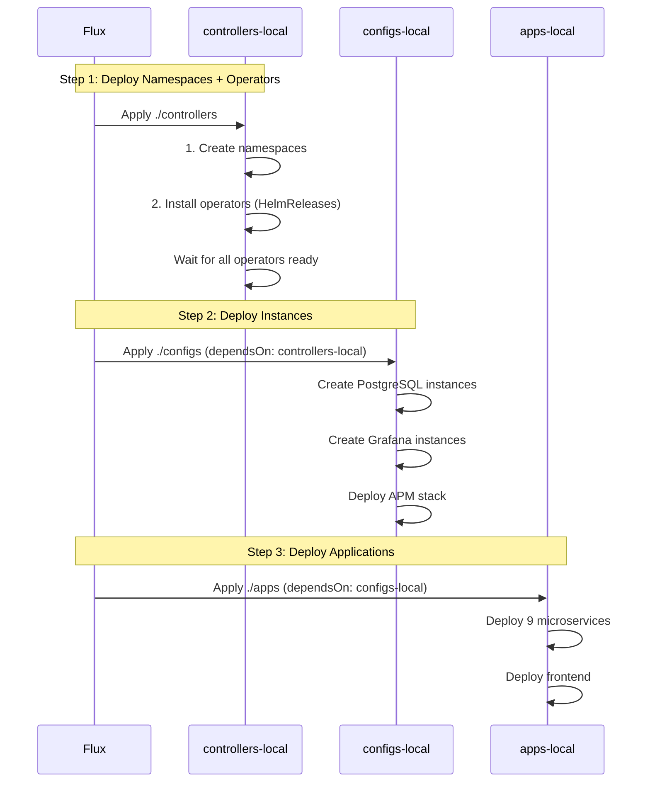
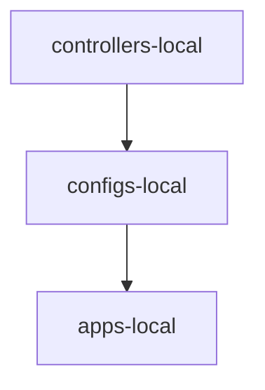

# Kubernetes Manifests - Component-Based Structure

**Last Updated:** 2026-01-22 (Flattened controllers observability + moved SLO into metrics)

## Structure Overview

```
kubernetes/
├── infra/              # Infrastructure manifests (controllers/configs pattern)
│   ├── namespaces.yaml           # Namespaces (applied first)
│   ├── kustomization.yaml        # Root kustomization
│   ├── controllers/              # Operators + CRDs (Phase 1)
│   │   ├── metrics/              # Prometheus Operator, Grafana Operator, metrics-server, Sloth operator
│   │   ├── logging/              # Loki, Vector, VictoriaLogs
│   │   ├── tracing/              # Tempo, Jaeger, OTel Collector
│   │   ├── profiling/            # Pyroscope
│   │   ├── databases/            # Zalando + CloudNativePG operators
│   └── configs/                  # Instances + configs (Phase 2)
│       ├── monitoring/           # Grafana CR + Datasources, ServiceMonitors, PodMonitors
│       ├── databases/            # DB clusters (cluster-centric: instance + secrets + poolers + monitoring per cluster)
│       │   └── clusters/         # Per-cluster folders: auth-db, review-db, supporting-db, product-db, transaction-db
│       └── slo/                  # PrometheusServiceLevel CRs
│
├── apps/               # Application manifests (HelmRelease with inline config)
│   ├── auth.yaml
│   ├── user.yaml
│   ├── product.yaml
│   ├── cart.yaml
│   ├── order.yaml
│   ├── review.yaml
│   ├── notification.yaml
│   ├── shipping.yaml
│   ├── shipping-v2.yaml
│   ├── k6.yaml
│   └── frontend.yaml         # ResourceSet (learning example)
│
├── clusters/           # Flux cluster configuration
│   ├── local/          # ✅ ACTIVE (Kind cluster)
│   │   ├── flux-system/      # FluxInstance CRD
│   │   ├── sources/          # OCIRepository + HelmRepository
│   │   │   ├── helm/         # 10 HelmRepositories (incl. vector, pgcat)
│   │   │   ├── infrastructure-oci.yaml
│   │   │   ├── apps-oci.yaml
│   │   │   └── mop-chart-oci.yaml
│   │   ├── controllers.yaml     # Kustomization CRD (namespaces + operators)
│   │   ├── configs.yaml         # Kustomization CRD (instances/configs)
│   │   └── apps.yaml            # Kustomization CRD (apps/)
│   └── production/     # 📋 PLACEHOLDER
│
└── backup/             # Old base/overlay structure (moved 2026-01-12)
    ├── base/           # Old base manifests
    └── overlays/       # Old overlay patches
```

## Why Component-Based Structure?

**Previous structure** had monolithic YAML files (1586+ lines) mixing all resources:
- ❌ Hard to debug - Finding specific resources required searching massive files
- ❌ No separation - Monitoring, APM, databases all mixed together
- ❌ Manual Deployments - Loki, Tempo, Pyroscope, PgCat used manual K8s resources

**New structure** splits by component type:
- ✅ **Easy to debug** - Find resources by component (loki/, pyroscope/, pgcat-transaction/)
- ✅ **Logical separation** - Clear boundaries: metrics/, logging/, tracing/, profiling/, databases/, slo/
- ✅ **Correct ordering** - Operators/CRDs first (`controllers/`), then instances (`configs/`)
- ✅ **25+ separate files** - Clear component ownership


## Deployment Flow

After changes, the deployment order will be:



## Key Changes (2026-01-12 Refactor)

### 1. Component Organization

**Before:** 4 monolithic files (3500+ lines total)
- `infrastructure.yaml` (1586 lines)
- `monitoring.yaml` (352 lines)
- `apm.yaml` (937 lines)
- `databases.yaml` (926 lines)

**After:** 25 component-specific files
- Each component in own directory
- Easy to navigate and maintain

### 2. Helm Migration

**Replaced manual Deployments with Helm charts:**
- ✅ Loki → `grafana/loki` chart
- ✅ Tempo → `grafana/tempo` chart
- ✅ Pyroscope → `grafana/pyroscope` chart
- ✅ Vector → `vector-dev/vector` chart
- ✅ PgCat Transaction → `pgcat/pgcat` v0.2.5
- ✅ PgCat Product → `pgcat/pgcat` v0.2.5


### 3. Consistent Patterns

**Infrastructure components:**
- Primary: Kustomization CRD (for operators, CRDs)
- HelmReleases: All application components (Loki, Tempo, etc.)

**Application components:**
- 9 backend services: HelmRelease + inline local config
- 1 frontend service: ResourceSet (learning example)

## Workflow

```bash
# Push manifests to OCI registry
make flux-push

# Check reconciliation status
flux get kustomizations
flux get helmreleases --all-namespaces

# Manual reconciliation (if needed)
flux reconcile kustomization controllers-local --with-source
flux reconcile kustomization configs-local --with-source
flux reconcile kustomization apps-local --with-source
```

## Dependency Order

**Flux Kustomization CRDs enforce deployment order via `dependsOn`:**



1. **controllers-local** (no dependencies) - namespaces + operators/CRDs
2. **configs-local** → depends on `controllers-local` - instances/configs (monitoring, apm, databases, slo)
3. **apps-local** → depends on `configs-local` - apps (microservices, frontend, k6)

**Critical:** `apps-local` will **NOT start** until `configs-local` is ready.

## OCI Artifacts

Manifests are pushed as OCI artifacts to local registry (`localhost:5050` or `mop-registry:5000`):
- `flux-cluster-sync:local` → `clusters/local/`
- `flux-infra-sync:local` → `infra/`
- `flux-apps-sync:local` → `apps/`

## Verification

```bash
# Check all HelmReleases
flux get helmreleases --all-namespaces

# Check specific components
kubectl get helmrelease -n monitoring jaeger otel-collector || true
kubectl get helmrelease -n kube-system vector || true

# Check pods
kubectl get pods -n monitoring
kubectl get pods -n cart
kubectl get pods -n product
```

## Documentation

- **Setup Guide:** [`docs/guides/SETUP.md`](../docs/guides/SETUP.md) - Complete deployment instructions
- **Database Guide:** [`docs/guides/DATABASE.md`](../docs/guides/DATABASE.md) - Database patterns
- **Infrastructure Details:** [`infra/README.md`](infra/README.md) - Component-specific documentation
- **Cluster Configuration:** [`clusters/local/README.md`](clusters/local/README.md) - Flux setup details

## Migration Notes

- **Old structure** moved to `backup/` on 2026-01-12
- **Component split** from monolithic files to 25 separate files
- **Helm migration** completed for all components
- **No functionality changes** - Same resources, better organization

See `backup/README.md` for details about old structure.
