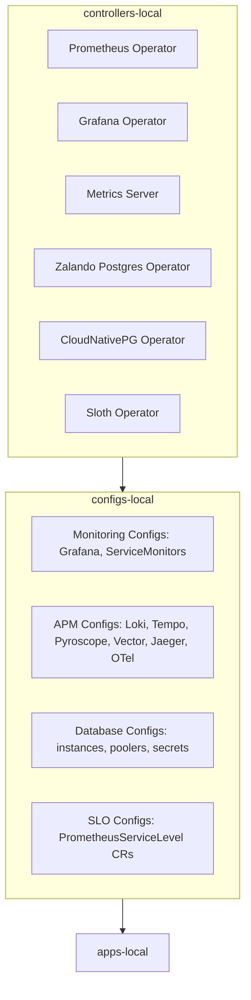

# Infrastructure Manifests - Controllers/Configs Pattern

This directory contains all infrastructure manifests organized by deployment phase: **controllers** (operators) and **configs** (instances).

## Directory Structure

```
kubernetes/infra/
├── namespaces.yaml                 # All 14 namespaces (deployed first)
├── kustomization.yaml              # Root kustomization
├── controllers/                    # Phase 1: Operators + Helm Charts
│   ├── kustomization.yaml
│   ├── monitoring/
│   │   ├── prometheus-operator.yaml    # kube-prometheus-stack Helm
│   │   ├── grafana-operator.yaml       # Grafana Operator Helm
│   │   └── metrics-server.yaml         # Metrics Server Helm
│   ├── apm/
│   │   └── kustomization.yaml          # Empty (no operators)
│   ├── databases/
│   │   ├── zalando-operator.yaml       # Zalando Postgres Operator Helm
│   │   └── cloudnativepg-operator.yaml # CloudNativePG Operator Helm
│   └── slo/
│       └── sloth-operator.yaml         # Sloth Operator Helm
└── configs/                        # Phase 2: Instances + CRs
    ├── kustomization.yaml
    ├── monitoring/
    │   ├── servicemonitors/            # ServiceMonitors
    │   ├── grafana/                    # Grafana CR + Datasources
    │   └── podmonitors/                # PodMonitors for databases
    ├── apm/
    │   ├── loki/                       # Loki (raw manifests)
    │   ├── tempo/                      # Tempo (raw manifests)
    │   ├── pyroscope/                  # Pyroscope (raw manifests)
    │   ├── vector/                     # Vector (HelmRelease)
    │   ├── jaeger/                     # Jaeger (HelmRelease)
    │   └── otel-collector/             # OTel Collector (HelmRelease)
    ├── databases/
    │   ├── secrets/                    # Database secrets
    │   ├── configmaps/                 # Vector configs, monitoring queries
    │   ├── poolers/                    # PgCat HelmReleases
    │   └── instances/                  # PostgreSQL CRs (5 databases)
    └── slo/
        └── crds/                       # PrometheusServiceLevel CRs (9 services)
```

## Architecture Pattern

### Controllers vs Configs Separation

**Controllers** (Infrastructure Layer):
- Helm charts for operators (Prometheus, Grafana, Postgres, Sloth)
- Provide CRDs and manage lifecycle
- Deployed FIRST to ensure CRDs are available

**Configs** (Application Layer):
- Custom Resources (Grafana, PostgreSQL, PrometheusServiceLevel)
- HelmReleases for APM components (Loki, Tempo, Pyroscope, Vector, Jaeger, OTel)
- Deployed AFTER controllers are ready

This separation ensures:
1. **Correct deployment order** - Operators install CRDs before instances are created
2. **Clear boundaries** - Infrastructure vs application concerns
3. **Easier debugging** - Controllers and configs can be reconciled independently
4. **Matches manual scripts** - Follows `scripts/backup/` deployment pattern

## Deployment Order



**Flux Kustomizations:**
1. `controllers-local` - Deploys namespaces + operators (CRDs)
2. `configs-local` - Deploys all configs (depends on controllers-local)
3. `apps-local` - Deploys microservices (depends on configs-local)

## Key Components

### Monitoring Controllers
- **kube-prometheus-stack** - Prometheus Operator + Prometheus + Alertmanager
- **grafana-operator** - Grafana Operator for managing Grafana instances
- **metrics-server** - Kubernetes metrics API for HPA and kubectl top

### Database Controllers
- **postgres-operator** - Zalando Postgres Operator (manages 3 clusters: auth, review, supporting)
- **cloudnative-pg** - CloudNativePG Operator (manages 2 clusters: product, transaction)

### SLO Controllers
- **sloth** - Sloth Operator for SLO/SLI management

### APM Configs (No Operators)
APM components are deployed under `kubernetes/infra/configs/apm/`:
- **Loki** - raw manifests (Deployment/ConfigMap/Service)
- **Tempo** - raw manifests (Deployment/ConfigMap/Service)
- **Pyroscope** - raw manifests (Deployment/ConfigMap/Service)
- **Vector** - HelmRelease (DaemonSet)
- **Jaeger** - HelmRelease
- **OTel Collector** - HelmRelease

## How to Deploy

```bash
# 1. Create Kind cluster + OCI registry
./scripts/kind-up.sh

# 2. Bootstrap Flux Operator
./scripts/flux-up.sh

# 3. Push all manifests to OCI
make flux-push

# 4. Verify reconciliation
flux get kustomizations
```

**Deployment sequence:**
1. Namespaces created
2. Controllers reconcile (operators install CRDs)
3. Configs reconcile (instances created using CRDs)
4. Apps reconcile (microservices start)

## Verification

```bash
# Check controllers
flux get kustomization controllers-local
kubectl get helmreleases --all-namespaces | grep operator

# Check configs
flux get kustomization configs-local
kubectl get postgresql -A
kubectl get cluster -A
kubectl get grafana -A
kubectl get prometheusservicelevel -A

# Check apps
flux get kustomization apps-local
kubectl get pods --all-namespaces
```

## Troubleshooting

### Controllers not ready
```bash
# Check operator logs
kubectl logs -n monitoring -l app.kubernetes.io/name=prometheus-operator
kubectl logs -n postgres-operator -l app.kubernetes.io/name=postgres-operator
kubectl logs -n cloudnative-pg -l app.kubernetes.io/name=cloudnative-pg

# Check operator status
flux get helmreleases --all-namespaces
```

### Configs failing
```bash
# Ensure controllers are ready first
kubectl wait --for=condition=ready pod -l app.kubernetes.io/name=prometheus-operator -n monitoring --timeout=300s

# Check CRDs are installed
kubectl get crd | grep postgresql
kubectl get crd | grep grafana
kubectl get crd | grep sloth

# Check config status
kubectl describe postgresql auth-db -n auth
kubectl describe grafana grafana -n monitoring
```

## References

- [Flux GitOps Structure](https://fluxcd.io/flux/guides/repository-structure/)
- [Kustomize Documentation](https://kustomize.io/)
- [GitOps Best Practices](https://cloud.google.com/kubernetes-engine/config-sync/docs/concepts/gitops-best-practices)
