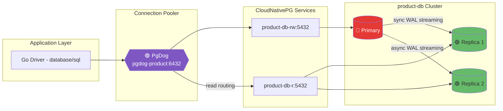

# PostgreSQL Clusters

## Cluster Summary

| Cluster | Operator | Namespace | Instances | Replication | Pooler | Pooler Endpoint | Direct Endpoint |
|---------|----------|-----------|-----------|-------------|--------|-----------------|-----------------|
| **product-db** | CloudNativePG | product | 3 (1 Primary + 1 Sync + 1 Async Replica) | Sync (ANY 1) | PgDog (`pgdog-product`) | `pgdog-product.product.svc:6432` | `product-db-rw.product.svc:5432` |
| **product-db-replica** | CloudNativePG | product | 1 (Designated Primary) | WAL recovery from object store | — | — | `product-db-replica-rw.product.svc:5432` |
| **auth-db** | CloudNativePG | auth | 3 (1 Primary + 1 Sync + 1 Async Replica) | Sync (ANY 1) | PgDog (`pgdog-auth`) | `pgdog-auth.auth.svc:6432` | `auth-db-rw.auth.svc:5432` |
| **shared-db** | CloudNativePG | user | 1 | N/A | PgDog (`pgdog-shared`) | `pgdog-shared.user.svc:6432` | `shared-db-rw.user.svc:5432` |
| **temporal-db** | CloudNativePG | temporal | 1 | N/A | — | — | `temporal-db-rw.temporal.svc:5432` |

---

## Detailed Cluster Documentation

For detailed architecture, configuration, and components of each cluster, please refer to their respective directories:

- **[product-db](product-db/)**: Consolidated CNPG cluster hosting Product, Cart, Order, and Payment databases (merged from former product-db + transaction-shared-db; payment app connects direct-TLS). Includes PgDog pooler, backup, and monitoring.
- **[product-db-replica](product-db-replica/)**: DR replica cluster; continuously recovers from product-db WAL archive. Promotable to standalone primary. Deployed via Flux **`configs/databases-cnpg-dr`** (`databases-cnpg-dr-local` depends on `databases-local`).
- **[auth-db](auth-db/)**: CNPG cluster for the Auth service (migrated from Zalando). 3-instance HA with PgDog pooler, backup, and monitoring.
- **[shared-db](shared-db/)**: CNPG cluster (migrated from the former Zalando `supporting-shared-db`) for User, Notification, Shipping, and Review services. Single instance with PgDog pooler, backup, and monitoring.
- **[temporal-db](temporal-db/)**: CNPG cluster backing Temporal (`temporal` + `temporal_visibility`). Single instance; no pooler and no backup.

### DR replica troubleshooting

See **[PostgreSQL DRP](../../../../../docs/databases/010-drp.md)** for the
recovery decision flow and DR promotion controls, and
**[HA and DR Architecture Deep-Dive](../../../../../docs/databases/005-ha-dr-deep-dive.md)**
for CNPG recovery internals.

---

## Connection Pooler Comparison

**PgDog** is the only pooler deployed on the platform (`pgdog-product`,
`pgdog-auth`, `pgdog-shared`). PgBouncer and PgCat are listed for comparison
only.

| Feature | PgBouncer | PgDog | PgCat |
|---------|---------------------|-------|-------|
| **Architecture** | Single-threaded (C) | Multi-threaded (Rust) | Multi-threaded (Rust) |
| **Deployment** | Operator-managed | Helm chart | Kubernetes manifests |
| **Read/Write Splitting** | No | Yes (configurable) | Yes (enabled) |
| **Load Balancing** | No | Yes | Yes |
| **Multi-Database** | Limited | Yes | Yes |
| **Sharding** | No | Production-grade | Experimental |
| **Monitoring** | Basic | OpenMetrics + Admin DB | Prometheus + Admin DB |
| **SSL Requirement** | Required | Optional | Optional |

---

## Explore Internal Cluster PostgreSQL

This section uses **product-db** as a learning vehicle to understand PostgreSQL internals. The same concepts apply whether PostgreSQL runs on Kubernetes (CloudNativePG) or VMs (EC2).

### product-db Topology (Current Configuration)

| Component | Endpoint | Port | Role |
|-----------|----------|------|------|
| **PgDog Pooler** | `pgdog-product.product.svc.cluster.local` | 6432 | Connection pooling, R/W splitting (product, cart, order, payment) |
| **CNPG RW Service** | `product-db-rw.product.svc.cluster.local` | 5432 | Write queries (auto-routes to primary) |
| **CNPG R Service** | `product-db-r.product.svc.cluster.local` | 5432 | Read queries (load-balanced replicas) |
| **CNPG RO Service** | `product-db-ro.product.svc.cluster.local` | 5432 | Read-only (any instance) |
| **Cluster** | 3 instances | - | 1 Primary + 1 Sync Replica + 1 Async Replica |

### INSERT/UPDATE in 10 Steps (Preview)

When a Product Service calls `INSERT INTO products (name, price) VALUES ('Widget', 99.99)`:

| Step | Component | What Happens |
|------|-----------|--------------|
| 1 | **Go Driver** | Sends SQL over TCP to PgDog |
| 2 | **PgDog** | Picks a pooled connection, forwards to `product-db-rw` |
| 3 | **Backend Process** | PostgreSQL spawns/reuses a backend process for this connection |
| 4 | **Parser** | Validates SQL syntax, builds parse tree |
| 5 | **Planner** | Creates execution plan (trivial for INSERT) |
| 6 | **Executor** | Begins transaction, acquires locks |
| 7 | **MVCC** | Assigns `xmin` (transaction ID), creates new tuple version |
| 8 | **Buffer Manager** | Loads target heap page into **Shared Buffers**, marks dirty |
| 9 | **WAL Writer** | Writes change to **WAL Buffers**, then to WAL segment on disk |
| 10 | **Commit** | `fsync` WAL to disk, return success to client |

**After commit (async):**
- **Background Writer**: Gradually flushes dirty pages from Shared Buffers to data files
- **Checkpointer**: Periodically forces all dirty pages to disk (recovery point)
- **WAL Sender**: Ships WAL to replicas for replay

### Deep Dive Documentation

For full explanations with detailed diagrams, tables, and EC2/VM mapping, see:

**[PostgreSQL Internals Deep Dive (product-db)](../../../../../docs/databases/001-postgresql-internals.md)**

Topics covered:
- INSERT/UPDATE workflow with sequence diagrams
- Shared Buffers and Buffer Manager
- WAL (Write-Ahead Log) and crash recovery
- MVCC, tuple versioning, and visibility
- Streaming Replication internals
- Storage: files, pages, and on-disk layout
- Autovacuum and bloat control
- CNPG vs EC2/VM operational differences
- Backup/restore, scaling, and sharding concepts

---

## Related Documentation

- **Database Architecture Overview**: [`docs/databases/002-database-integration.md`](../../../../../docs/databases/002-database-integration.md)
- **PgCat Troubleshooting (legacy)**: [`docs/runbooks/troubleshooting/pgcat_prepared_statement_error.md`](../../../../../docs/runbooks/troubleshooting/pgcat_prepared_statement_error.md)
- **Monitoring Setup**: [`docs/observability/metrics/README.md`](../../../../../docs/observability/metrics/README.md)
- **Replication Deep Dive**: [`docs/databases/004-replication-strategy.md`](../../../../../docs/databases/004-replication-strategy.md)
