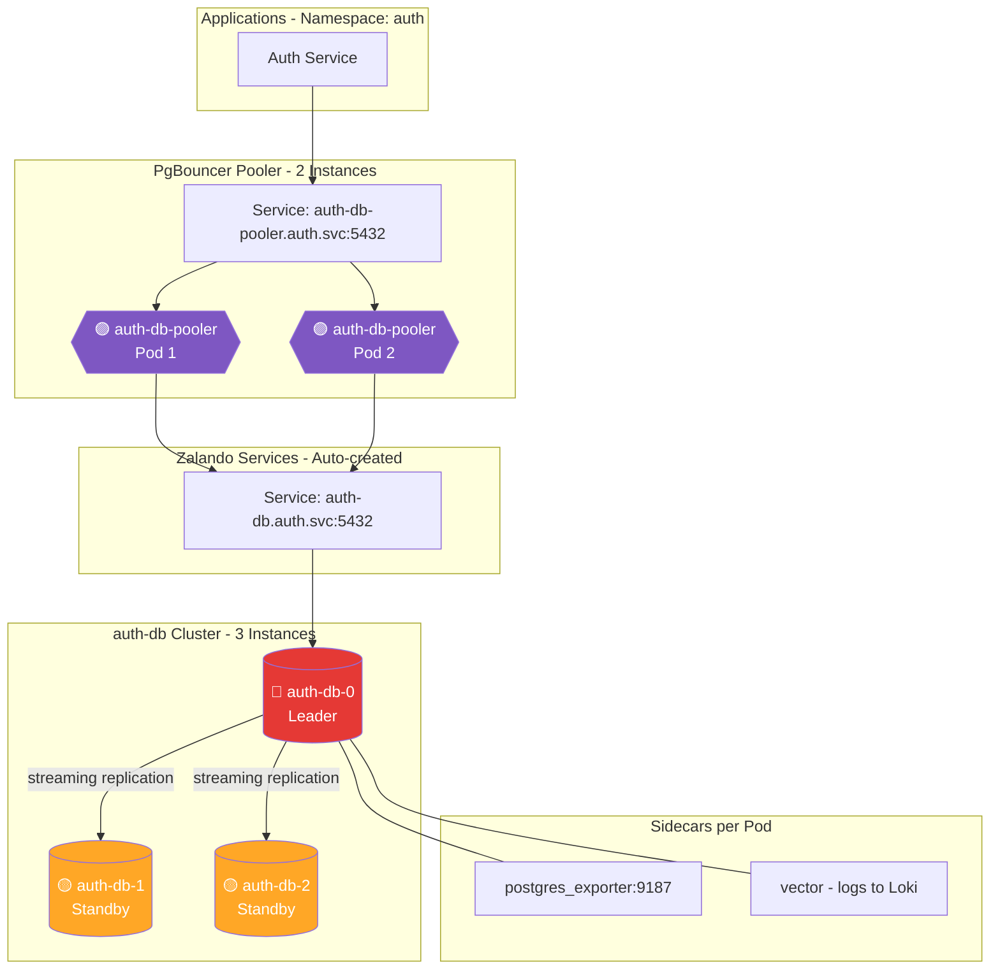
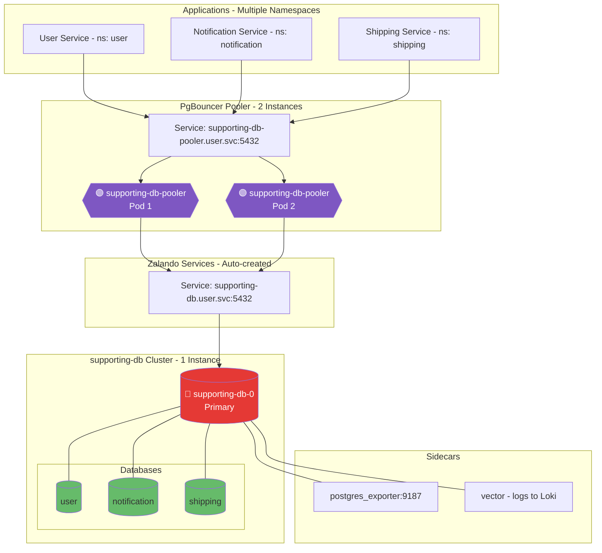
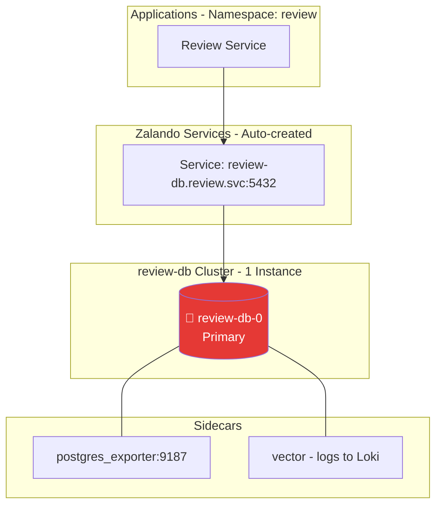
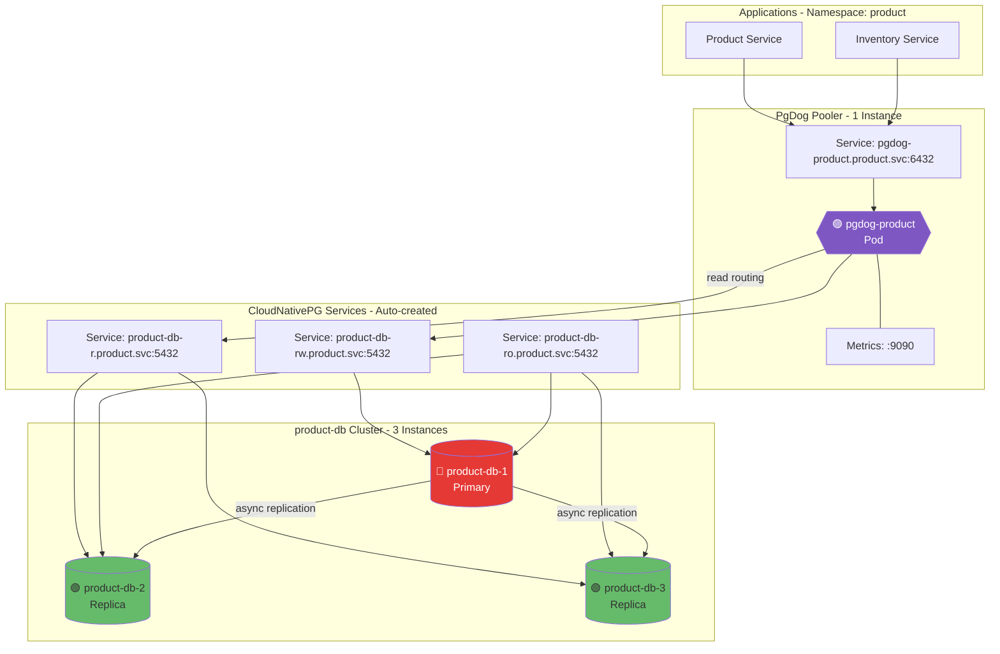
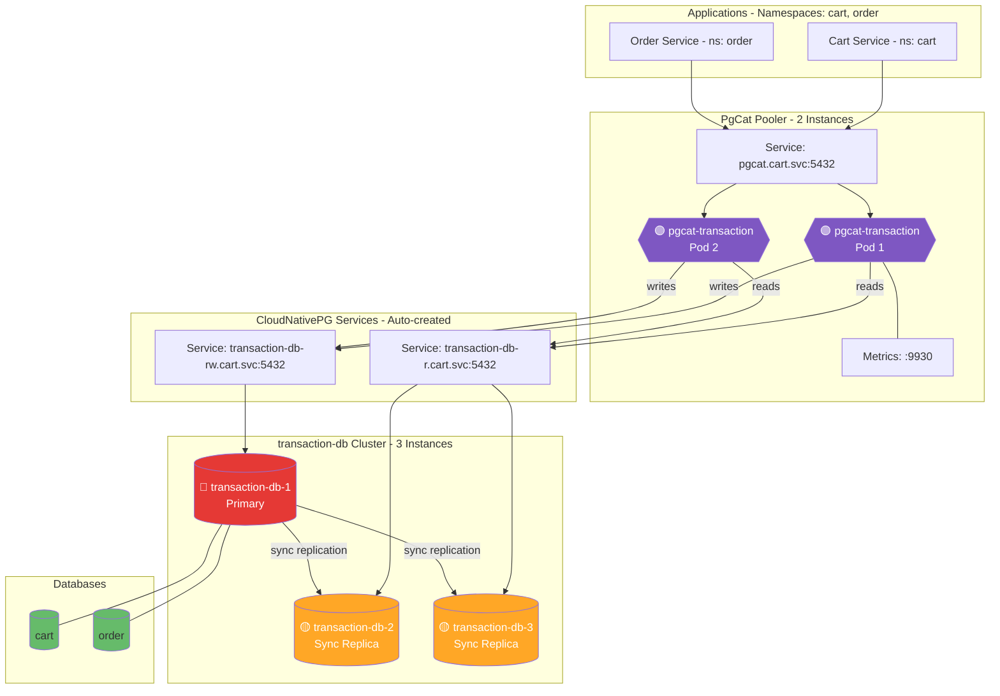
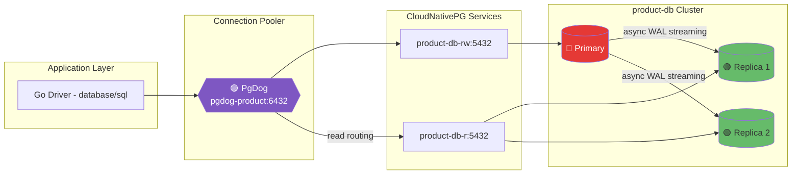

# PostgreSQL Clusters Deep Dive

This document provides a comprehensive reference for all PostgreSQL database clusters in the monitoring project. Each cluster diagram shows the exact topology as currently configured in the manifests.

## Cluster Summary
### How to Read the Diagrams
- **Color coding**:
  - 🔴 **Red** = Primary/Leader instance (accepts writes)
  - 🟡 **Yellow** = Standby/Sync Replica (synchronous replication)
  - 🟢 **Green** = Read Replica (async) or database schema
  - 🟣 **Purple** = Connection Pooler (PgBouncer, PgDog, PgCat)

---

## Cluster Index

| Cluster | Operator | Namespace | Instances | Replication | Pooler | Pooler Endpoint | Direct Endpoint |
|---------|----------|-----------|-----------|-------------|--------|-----------------|-----------------|
| **auth-db** | Zalando | auth | 3 (1 Leader + 2 Standbys) | Streaming (async) | PgBouncer (2 pods) | `auth-db-pooler.auth.svc:5432` | `auth-db.auth.svc:5432` |
| **supporting-db** | Zalando | user | 1 | N/A | PgBouncer (2 pods) | `supporting-db-pooler.user.svc:5432` | `supporting-db.user.svc:5432` |
| **review-db** | Zalando | review | 1 | N/A | None | N/A | `review-db.review.svc:5432` |
| **product-db** | CloudNativePG | product | 3 (1 Primary + 2 Replicas) | Async | PgDog (1 pod) | `pgdog-product.product.svc:6432` | `product-db-rw.product.svc:5432` |
| **transaction-db** | CloudNativePG | cart | 3 (1 Primary + 2 Replicas) | Synchronous | PgCat (2 pods) | `pgcat.cart.svc:5432` | `transaction-db-rw.cart.svc:5432` |

---

## 1. auth-db (Zalando Operator)

### Overview

| Property | Value |
|----------|-------|
| **Operator** | Zalando Postgres Operator |
| **Namespace** | `auth` |
| **PostgreSQL Version** | 17 |
| **Instances** | 3 (1 Leader + 2 Standbys) |
| **Replication** | Streaming replication (async, `synchronous_commit: local`) |
| **Pooler** | PgBouncer: 2 instances, `transaction` mode |
| **Sidecars** | postgres_exporter (v0.18.1), Vector (v0.52.0) |

### Endpoints

| Type | Endpoint | Port | Purpose |
|------|----------|------|---------|
| Direct (Leader) | `auth-db.auth.svc.cluster.local` | 5432 | Direct connection to current leader |
| Pooler | `auth-db-pooler.auth.svc.cluster.local` | 5432 | Connection pooling (recommended) |
| Metrics | Pod IP | 9187 | postgres_exporter metrics |

### Topology Diagram

### Notes

**Current Configuration:**
- HA enabled with 3 instances for automatic failover via Patroni
- PgBouncer in transaction mode with `maxDBConnections: 240` per pooler (480 total)
- Tuned PostgreSQL parameters: `max_connections: 500`, `shared_buffers: 128MB`, `work_mem: 256MB`
- Extensions: `pg_stat_statements`, `pg_cron`, `pg_trgm`, `pgcrypto`, `pg_stat_kcache`
- Logging: DDL statements, slow queries >100ms, lock waits

**Considering:**
- Enable synchronous replication for zero data loss (currently `synchronous_commit: local`)
- Add PodDisruptionBudget for controlled maintenance
- Configure node anti-affinity for production zone distribution

---

## 2. supporting-db (Zalando Operator)

### Overview

| Property | Value |
|----------|-------|
| **Operator** | Zalando Postgres Operator |
| **Namespace** | `user` |
| **PostgreSQL Version** | 16 |
| **Instances** | 1 (Single instance) |
| **Replication** | N/A (single instance) |
| **Pooler** | PgBouncer (2 instances, transaction mode) |
| **Sidecars** | postgres_exporter (v0.18.1), Vector (v0.52.0) |
| **Databases** | `user`, `notification`, `shipping` (multi-tenant) |

### Endpoints

| Type | Endpoint | Port | Purpose |
|------|----------|------|---------|
| Direct | `supporting-db.user.svc.cluster.local` | 5432 | Direct connection |
| Pooler | `supporting-db-pooler.user.svc.cluster.local` | 5432 | Connection pooling (recommended, requires `sslmode=require`) |
| Metrics | Pod IP | 9187 | postgres_exporter metrics |

### Topology Diagram

### Notes

**Current Configuration:**
- Multi-database cluster serving 3 services across different namespaces
- Cross-namespace user naming: `notification.notification`, `shipping.shipping` for automatic secret distribution
- PgBouncer requires `sslmode=require` for connections
- Conservative memory tuning: `shared_buffers: 64MB`, `work_mem: 4MB` (256MB container limit)
- Extensions: `pg_stat_statements`, `pg_cron`, `pg_trgm`, `pgcrypto`, `pg_stat_kcache`

**Considering:**
- Scale to 2+ instances for HA (currently single instance for cost optimization)
- Separate databases into dedicated clusters if traffic increases significantly
- Enable synchronous replication when HA is added

---

## 3. review-db (Zalando Operator)

### Overview

| Property | Value |
|----------|-------|
| **Operator** | Zalando Postgres Operator |
| **Namespace** | `review` |
| **PostgreSQL Version** | 16 |
| **Instances** | 1 (Single instance) |
| **Replication** | N/A (single instance) |
| **Pooler** | None (direct connection) |
| **Sidecars** | postgres_exporter (v0.18.1), Vector (v0.52.0) |

### Endpoints

| Type | Endpoint | Port | Purpose |
|------|----------|------|---------|
| Direct | `review-db.review.svc.cluster.local` | 5432 | Direct connection (only option) |
| Metrics | Pod IP | 9187 | postgres_exporter metrics |

### Topology Diagram

### Notes

**Current Configuration:**
- Intentionally no connection pooler (low traffic, simple workload)
- Single instance for cost optimization in development/learning environment
- Direct connections from Review service only
- Conservative memory tuning: `shared_buffers: 64MB`, `work_mem: 4MB`

**Considering:**
- Add PgBouncer pooler if connection count grows
- Scale to 2+ instances for HA in production
- Consider merging with supporting-db if usage remains low

---

## 4. product-db (CloudNativePG Operator)

### Overview

| Property | Value |
|----------|-------|
| **Operator** | CloudNativePG |
| **Namespace** | `product` |
| **PostgreSQL Version** | Default (latest) |
| **Instances** | 3 (1 Primary + 2 Replicas) |
| **Replication** | Asynchronous (`syncReplicaElectionConstraint.enabled: false`) |
| **Pooler** | PgDog (1 replica, Helm chart v0.32) |
| **Sidecars** | None (CloudNativePG handles metrics natively) |

### Endpoints

| Type | Endpoint | Port | Purpose |
|------|----------|------|---------|
| RW (Primary) | `product-db-rw.product.svc.cluster.local` | 5432 | Write queries (auto-routes to primary) |
| R (Replicas) | `product-db-r.product.svc.cluster.local` | 5432 | Read queries (load-balanced replicas) |
| RO (Any) | `product-db-ro.product.svc.cluster.local` | 5432 | Read-only (any instance) |
| Pooler | `pgdog-product.product.svc.cluster.local` | 6432 | Connection pooling |
| Metrics | `pgdog-product.product.svc.cluster.local` | 9090 | PgDog OpenMetrics |

### Topology Diagram

### Notes

**Current Configuration:**
- 3 instances with asynchronous replication for read scaling
- PgDog routes writes to `product-db-rw` and reads to `product-db-r`
- ServiceMonitor enabled for Prometheus scraping
- Pool mode: `transaction`, pool size: 30 connections
- Memory tuning: `shared_buffers: 64MB`, `effective_cache_size: 512MB`

**Considering:**
- Scale PgDog to 2 replicas for HA
- Enable `syncReplicaElectionConstraint` for stronger consistency if needed
- Add `podAntiAffinity` for production zone distribution

---

## 5. transaction-db (CloudNativePG Operator)

### Overview

| Property | Value |
|----------|-------|
| **Operator** | CloudNativePG |
| **Namespace** | `cart` |
| **PostgreSQL Version** | 18 |
| **Instances** | 3 (1 Primary + 2 Replicas) |
| **Replication** | Synchronous (quorum: any 1, dataDurability: required) |
| **Pooler** | PgCat (2 replicas, Kubernetes manifests) |
| **Databases** | `cart`, `order` |
| **Features** | Logical replication slot sync, read/write splitting |

### Endpoints

| Type | Endpoint | Port | Purpose |
|------|----------|------|---------|
| RW (Primary) | `transaction-db-rw.cart.svc.cluster.local` | 5432 | Write queries |
| R (Replicas) | `transaction-db-r.cart.svc.cluster.local` | 5432 | Read queries |
| Pooler | `pgcat.cart.svc.cluster.local` | 5432 | Connection pooling with R/W splitting |
| Metrics | `pgcat.cart.svc.cluster.local` | 9930 | PgCat Prometheus metrics |

### Topology Diagram

### Notes

**Current Configuration:**
- Synchronous replication with quorum-based commit (any 1 replica required)
- Zero data loss guarantee (`dataDurability: required`)
- Read/write splitting enabled in PgCat:
  - `query_parser_read_write_splitting = true`
  - Writes → `transaction-db-rw`, Reads → `transaction-db-r`
- Logical replication slot synchronization for CDC support (Debezium, Kafka Connect)
- PostgreSQL 18 features: native `sync_replication_slots` parameter
- Production-tuned: `shared_buffers: 256MB`, `work_mem: 32MB`, `wal_level: logical`
- Aggressive autovacuum for high-write workloads

**Considering:**
- Enable `syncReplicaElectionConstraint` with node anti-affinity for production
- Add PodDisruptionBudget for PgCat deployment
- Configure backup with Barman/pgBackRest for disaster recovery
- Enable connection throttling in PgCat during peak loads

---

## Connection Pooler Comparison

| Feature | PgBouncer (Zalando) | PgDog | PgCat |
|---------|---------------------|-------|-------|
| **Architecture** | Single-threaded (C) | Multi-threaded (Rust) | Multi-threaded (Rust) |
| **Deployment** | Operator-managed | Helm chart | Kubernetes manifests |
| **Read/Write Splitting** | No | Yes (configurable) | Yes (enabled) |
| **Load Balancing** | No | Yes | Yes |
| **Multi-Database** | Limited | Yes | Yes |
| **Sharding** | No | Production-grade | Experimental |
| **Monitoring** | Basic | OpenMetrics + Admin DB | Prometheus + Admin DB |
| **SSL Requirement** | Required | Optional | Optional |

---

## Explore Internal Cluster PostgreSQL

This section uses **product-db** as a learning vehicle to understand PostgreSQL internals. The same concepts apply whether PostgreSQL runs on Kubernetes (CloudNativePG) or VMs (EC2).

### Product-db Topology (Current Configuration)

| Component | Endpoint | Port | Role |
|-----------|----------|------|------|
| **PgDog Pooler** | `pgdog-product.product.svc.cluster.local` | 6432 | Connection pooling, routes to RW |
| **CNPG RW Service** | `product-db-rw.product.svc.cluster.local` | 5432 | Write queries (auto-routes to primary) |
| **CNPG R Service** | `product-db-r.product.svc.cluster.local` | 5432 | Read queries (load-balanced replicas) |
| **CNPG RO Service** | `product-db-ro.product.svc.cluster.local` | 5432 | Read-only (any instance) |
| **Cluster** | 3 instances | - | 1 Primary + 2 Replicas (async replication) |

### INSERT/UPDATE in 10 Steps (Preview)

When a Product Service calls `INSERT INTO products (name, price) VALUES ('Widget', 99.99)`:

| Step | Component | What Happens |
|------|-----------|--------------|
| 1 | **Go Driver** | Sends SQL over TCP to PgDog |
| 2 | **PgDog** | Picks a pooled connection, forwards to `product-db-rw` |
| 3 | **Backend Process** | PostgreSQL spawns/reuses a backend process for this connection |
| 4 | **Parser** | Validates SQL syntax, builds parse tree |
| 5 | **Planner** | Creates execution plan (trivial for INSERT) |
| 6 | **Executor** | Begins transaction, acquires locks |
| 7 | **MVCC** | Assigns `xmin` (transaction ID), creates new tuple version |
| 8 | **Buffer Manager** | Loads target heap page into **Shared Buffers**, marks dirty |
| 9 | **WAL Writer** | Writes change to **WAL Buffers**, then to WAL segment on disk |
| 10 | **Commit** | `fsync` WAL to disk, return success to client |

**After commit (async):**
- **Background Writer**: Gradually flushes dirty pages from Shared Buffers to data files
- **Checkpointer**: Periodically forces all dirty pages to disk (recovery point)
- **WAL Sender**: Ships WAL to replicas for replay

### Deep Dive Documentation

For full explanations with detailed diagrams, tables, and EC2/VM mapping, see:

**[PostgreSQL Internals Deep Dive (product-db)](../../../../docs/databases/POSTGRESQL_INTERNALS_PRODUCT_DB.md)**

Topics covered:
- INSERT/UPDATE workflow with sequence diagrams
- Shared Buffers and Buffer Manager
- WAL (Write-Ahead Log) and crash recovery
- MVCC, tuple versioning, and visibility
- Streaming Replication internals
- Storage: files, pages, and on-disk layout
- Autovacuum and bloat control
- CNPG vs EC2/VM operational differences
- Backup/restore, scaling, and sharding concepts

---

## Related Documentation

- **Database Architecture Overview**: [`docs/databases/DATABASE.md`](../../../../docs/databases/DATABASE.md)
- **PgCat Troubleshooting**: [`docs/runbooks/troubleshooting/PGCAT_PREPARED_STATEMENT_ERROR.md`](../../../../docs/runbooks/troubleshooting/PGCAT_PREPARED_STATEMENT_ERROR.md)
- **Monitoring Setup**: [`docs/monitoring/METRICS.md`](../../../../docs/monitoring/METRICS.md)
- **Replication Deep Dive**: [`docs/databases/REPLICATION_STRATEGY.md`](../../../../docs/databases/REPLICATION_STRATEGY.md)
