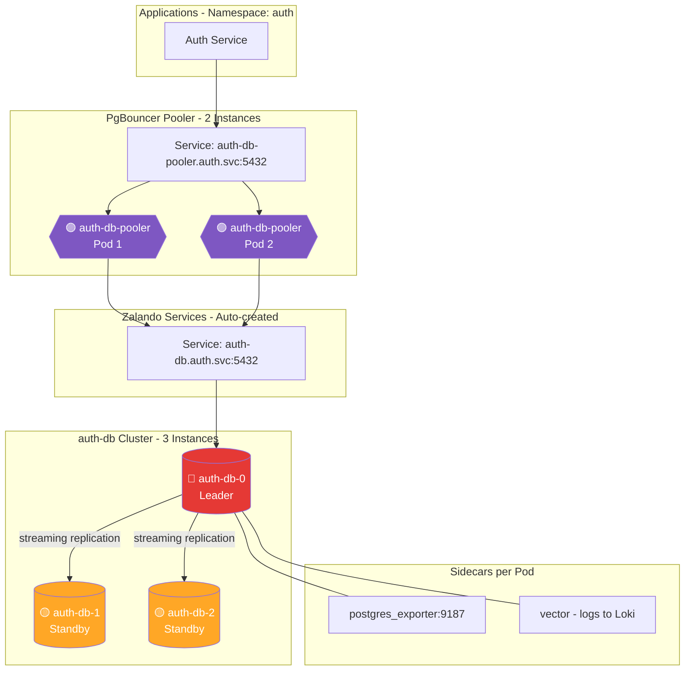

# Cluster Auth DB (Zalando Operator)

## Overview

| Property | Value |
|----------|-------|
| **Operator** | Zalando Postgres Operator |
| **Namespace** | `auth` |
| **PostgreSQL Version** | 17 |
| **Instances** | 3 (1 Leader + 2 Standbys) |
| **Replication** | Streaming replication (async, `synchronous_commit: local`) |
| **Pooler** | PgBouncer: 2 instances, `transaction` mode |
| **Sidecars** | postgres_exporter (v0.18.1), Vector (v0.52.0) |

## Endpoints

| Type | Endpoint | Port | Purpose |
|------|----------|------|---------|
| Direct (Leader) | `auth-db.auth.svc.cluster.local` | 5432 | Direct connection to current leader |
| Pooler | `auth-db-pooler.auth.svc.cluster.local` | 5432 | Connection pooling (recommended) |
| Metrics | Pod IP | 9187 | postgres_exporter metrics |

### How to Read the Diagrams
- **Color coding**:
  - 🔴 **Red** = Primary/Leader instance (accepts writes)
  - 🟡 **Yellow** = Standby/Sync Replica (synchronous replication)
  - 🟢 **Green** = Read Replica (async) or database schema
  - 🟣 **Purple** = Connection Pooler (PgBouncer, PgDog, PgCat)

## Topology Diagram

## Notes

**Current Configuration:**
- HA enabled with 3 instances for automatic failover via Patroni
- PgBouncer in transaction mode with `maxDBConnections: 240` per pooler (480 total)
- Tuned PostgreSQL parameters: `max_connections: 500`, `shared_buffers: 128MB`, `work_mem: 256MB`
- Extensions: `pg_stat_statements`, `pg_cron`, `pg_trgm`, `pgcrypto`, `pg_stat_kcache`
- Logging: DDL statements, slow queries >100ms, lock waits

**Considering:**
- Enable synchronous replication for zero data loss (currently `synchronous_commit: local`)
- Add PodDisruptionBudget for controlled maintenance
- Configure node anti-affinity for production zone distribution

---

## Deployed Components

The following components are active in `kustomization.yaml`:

### 1. Database Cluster
- **File**: [`instance.yaml`](instance.yaml)
- **Description**: The main PostgreSQL 17 cluster configuration.
- **Spec**: 3 instances (Leader + Standbys).
- **Pooler**: PgBouncer (managed via `instance.yaml` sidecar injection or operator feature).

### 2. Monitoring
- **Queries**: [`configmaps/monitoring-queries.yaml`](configmaps/monitoring-queries.yaml)
- **Exporter**: [`monitoring/pgbouncer-exporter.yaml`](monitoring/pgbouncer-exporter.yaml)

### 3. Logging
- **Config**: [`configmaps/vector-sidecar.yaml`](configmaps/vector-sidecar.yaml) (Vector sidecar for logs).

### 4. Secrets
- **Backup Credentials**: `secrets/pg-backup-rustfs-credentials.yaml`
