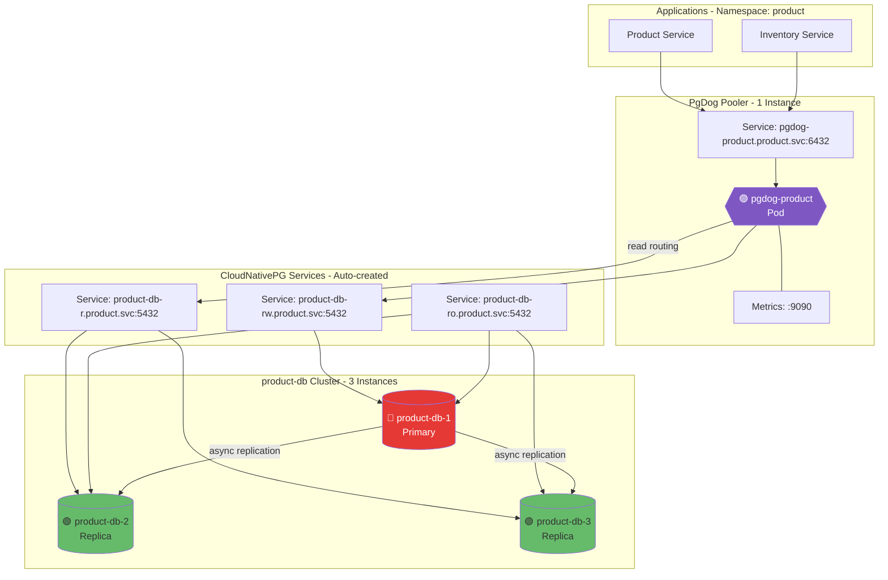
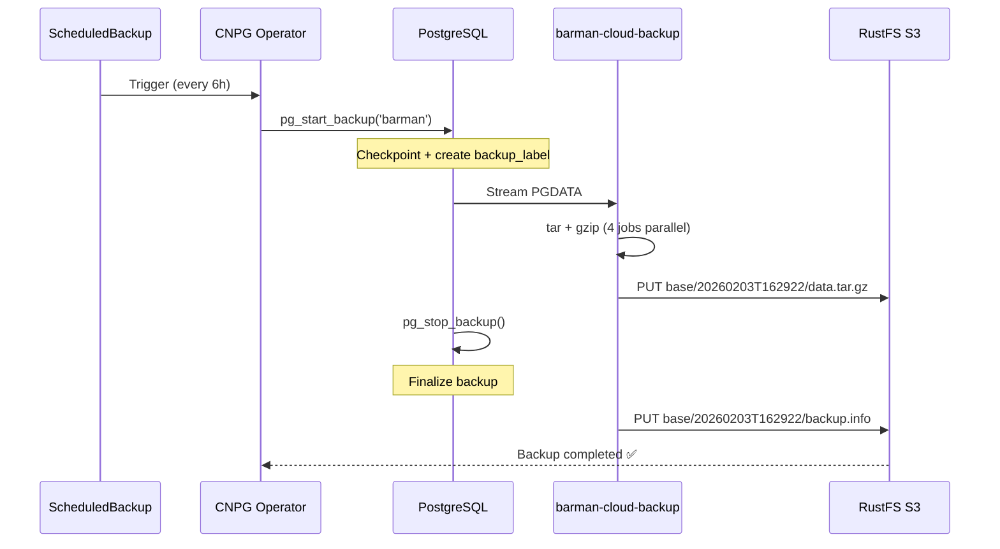
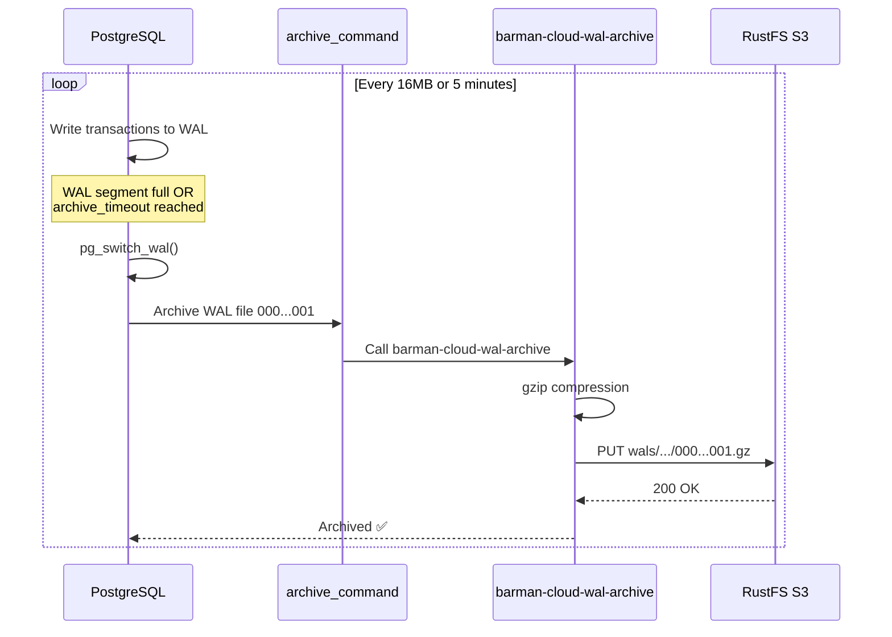

# Cluster Product DB (CloudNativePG Operator)

## Overview

| Property | Value |
|----------|-------|
| **Operator** | CloudNativePG |
| **Namespace** | `product` |
| **PostgreSQL Version** | Default (latest) |
| **Instances** | 3 (1 Primary + 2 Replicas) |
| **Replication** | Asynchronous (`syncReplicaElectionConstraint.enabled: false`) |
| **Pooler** | PgDog (1 replica, Helm chart v0.39) |
| **Sidecars** | None (CloudNativePG handles metrics natively) |

## Endpoints

| Type | Endpoint | Port | Purpose |
|------|----------|------|---------|
| RW (Primary) | `product-db-rw.product.svc.cluster.local` | 5432 | Write queries (auto-routes to primary) |
| R (Replicas) | `product-db-r.product.svc.cluster.local` | 5432 | Read queries (load-balanced replicas) |
| RO (Any) | `product-db-ro.product.svc.cluster.local` | 5432 | Read-only (any instance) |
| Pooler | `pgdog-product.product.svc.cluster.local` | 6432 | Connection pooling |
| Metrics | `pgdog-product.product.svc.cluster.local` | 9090 | PgDog OpenMetrics |

### How to Read the Diagrams
- **Color coding**:
  - 🔴 **Red** = Primary/Leader instance (accepts writes)
  - 🟡 **Yellow** = Standby/Sync Replica (synchronous replication)
  - 🟢 **Green** = Read Replica (async) or database schema
  - 🟣 **Purple** = Connection Pooler (PgBouncer, PgDog, PgCat)

## Topology Diagram



## Notes

**Current Configuration:**
- 3 instances with asynchronous replication for read scaling
- PgDog routes writes to `product-db-rw` and reads to `product-db-r`
- ServiceMonitor enabled for Prometheus scraping
- Pool mode: `transaction`, pool size: 30 connections
- Memory tuning: `shared_buffers: 64MB`, `effective_cache_size: 512MB`

**Considering:**
- Scale PgDog to 2 replicas for HA
- Enable `syncReplicaElectionConstraint` for stronger consistency if needed
- Add `podAntiAffinity` for production zone distribution

---

## Deployed Components

The following components are active in `kustomization.yaml`:

### 1. Database Cluster
- **File**: [`instance.yaml`](instance.yaml)
- **Description**: The main PostgreSQL 18 cluster configuration.
- **Spec**: 3 instances (1 primary + 2 replicas), writes to `s3://pg-backups/product-db/`.

### 2. Connection Pooler
- **Directory**: [`poolers/`](poolers/)
- **Component**: PgDog (v0.39) deployed via HelmRelease.
- **Service**: Exposes port `6432`.
- **Config**: Auto-routes read/write traffic.

### 3. Monitoring
- **File**: [`monitoring/podmonitor.yaml`](monitoring/podmonitor.yaml)
- **Description**: Prometheus PodMonitor for scraping metrics.

### 4. Secrets
- **Database Credentials**: `secrets/product-db-secret.yaml`
- **Backup Credentials**: `secrets/pg-backup-rustfs-credentials.yaml` (for S3/RustFS access)

### 5. Extensions
- **File**: [`extensions.yaml`](extensions.yaml)
- **Status**: **Disabled** (commented out in `kustomization.yaml`).
- **Description**: Custom PostgreSQL extensions configuration.

### 6. Backup Schedules
- **Daily**: [`backup/backup-daily.yaml`](backup/backup-daily.yaml)
- **Every 6 Hours**: [`backup/backup-every-6h.yaml`](backup/backup-every-6h.yaml)

---

## Backup Architecture

This section details the Point-in-Time Recovery (PITR) strategy implemented for `product-db`.

### 1. Overview: PITR Strategy

We use a combination of **Base Backups** (snapshots) and **WAL Archiving** (continuous logs) to achieve PITR.

```
┌─────────────────────────────────────────────────────────┐
│  COMPLETE BACKUP SOLUTION                               │
├─────────────────────────────────────────────────────────┤
│                                                         │
│  BASE/                    WAL/                          │
│  ├─ Snapshot #1           ├─ Transaction Log 1          │
│  ├─ Snapshot #2           ├─ Transaction Log 2          │
│  ├─ Snapshot #3           ├─ Transaction Log 3          │
│  └─ Snapshot #4           └─ Transaction Log ...N       │
│     (every 6h)                (continuous)              │
│                                                         │
│  [Full DB at point]   +   [All changes since]           │
│                                                         │
└─────────────────────────────────────────────────────────┘
```

### 2. BASE Backup ("Snapshot")

A complete copy of the database files.

*   **Tool**: `barman-cloud-backup`
*   **Trigger**: `ScheduledBackup` resource (every 6 hours) or Manual.
*   **PostgreSQL Function**: `pg_basebackup` mechanism.

#### Content Structure
```
base/20260203T162922/
├── backup.info          # Metadata (1.40 KB)
└── data.tar.gz          # FULL PGDATA (Compressed)
    ├── base/            # Database files
    ├── global/          # System catalogs
    ├── pg_xact/         # Transaction status
    ├── postgresql.conf
    └── pg_hba.conf
```

#### Purpose
*   Restore the **entire database** to a specific check-point.
*   Serves as the **starting point** for PITR replay.

### 3. WAL (Write-Ahead Log) ("Continuous Journal")

A stream of all changes (transactions) occurring in the database.

*   **Tool**: `barman-cloud-wal-archive`
*   **Trigger**: PostgreSQL `archive_command` (automatic & continuous).
*   **PostgreSQL Function**: `pg_switch_wal()` + `archive_command`.

#### Content Structure
```
wals/0000000100000000/
├── 000000010000000000000001.gz      # WAL segment 1
├── 000000010000000000000002.gz      # WAL segment 2
└── ...                              # Continuous stream
```
*Contains: INSERTs, UPDATEs, DELETEs, DDLs, Commits/Rollbacks.*

#### When are they created?
1.  **Segment Full**: Default every 16MB.
2.  **Timeout**: `archive_timeout = '5min'` (forces a switch if no activity).
3.  **Manual**: `SELECT pg_switch_wal();`.

#### Purpose
*   Record **EVERY change** between base backups.
*   Enable restoring to **ANY second** in time.

### 4. Workflow Diagrams

#### Base Backup Process


#### WAL Archiving Process


### 5. PostgreSQL & Tooling Configuration

#### Commands Used
*   **Base Backup**:
    ```bash
    barman-cloud-backup --gzip --jobs 4 --endpoint-url ... s3://pg-backups/product-db/ product-db-cluster
    ```
*   **WAL Archive**:
    ```bash
    barman-cloud-wal-archive --gzip --endpoint-url ... s3://pg-backups/product-db/ product-db-cluster %p
    ```

#### PostgreSQL Settings (managed by CNPG)
```ini
archive_mode = on
archive_timeout = 5min
wal_level = logical
archive_command = 'barman-cloud-wal-archive ... %p'
```

### 6. How Recovery (PITR) Works

**Scenario**: Restore to **16:25:30**.

1.  **Find Base Backup**: System locates the closest backup *before* the target time (e.g., `16:00:00`).
2.  **Restore Base**: Restores the full snapshot from `16:00:00`.
3.  **Replay WALs**: System downloads and replays all WAL segments from `16:00:00` onwards.
4.  **Stop Point**: The replay stops exactly at `16:25:30`.

**Result**: Database state is identical to that exact moment.

### 7. Monitoring Commands

```bash
# List base backups in S3 (RustFS storage)
kubectl exec -it -n rustfs deploy/rustfs -- ls -F /data/pg-backups/product-db/product-db-cluster/base/

# Check latest CNPG backup object
kubectl get backup -n product --sort-by=.metadata.creationTimestamp

# Check archiving status in Postgres
kubectl exec -it -n product product-db-1 -c postgres -- psql -U postgres -c "SELECT * FROM pg_stat_archiver;"
```
