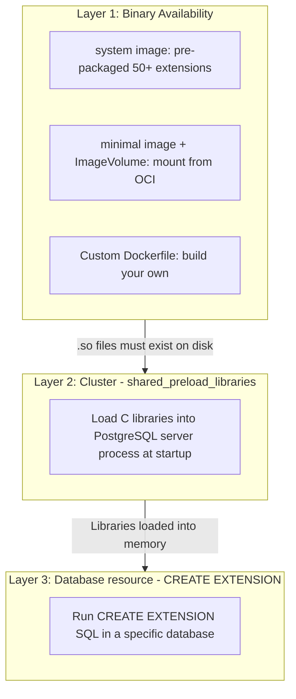

# CloudNativePG Extensions Guide

## 3-Layer Model

Managing extensions in CloudNativePG involves 3 separate layers that work together:



| Layer | Resource | What it does | When to change |
|-------|----------|-------------|----------------|
| 1 | Image choice (`imageName` or `postgresql.extensions`) | Makes `.so` and `.control` files available on disk | When adding a completely new extension |
| 2 | `Cluster` `shared_preload_libraries` | Loads C libraries into PostgreSQL process at startup | Only for extensions that hook into internals (requires restart) |
| 3 | `Database` resource `extensions` | Runs `CREATE EXTENSION` SQL inside a database | For every extension you want to use in a database |

---

## Which Extensions Need Preload?

### Type 1: Only CREATE EXTENSION needed (no preload)

These extensions only provide SQL functions/types. They do NOT hook into PostgreSQL internals.

```yaml
# Database resource only -- no shared_preload_libraries needed
extensions:
  - name: pgcrypto        # Cryptographic functions
  - name: uuid-ossp       # UUID generation
  - name: hstore          # Key-value store
  - name: citext           # Case-insensitive text
  - name: unaccent         # Text search without accents
  - name: tablefunc        # Crosstab functions
  - name: earthdistance    # Distance calculations
  - name: fuzzystrmatch    # Fuzzy string matching
  - name: btree_gin        # GIN index for btree types
  - name: btree_gist       # GiST index for btree types
```

### Type 2: Requires PRELOAD + CREATE EXTENSION

These extensions hook into PostgreSQL internals (executor hooks, planner hooks, WAL hooks). They MUST be loaded at server startup.

```yaml
# Cluster resource: shared_preload_libraries (Layer 2)
shared_preload_libraries:
  - pgaudit              # Hooks into executor for audit logging
  - pg_stat_statements   # Hooks into executor to track queries
  - auto_explain         # Hooks into executor to auto-explain slow queries
  - timescaledb          # Replaces storage engine
  - pglogical            # Hooks into WAL for logical replication
  - pg_cron              # Background worker for scheduled jobs
  - pg_stat_kcache       # Hooks into executor for OS-level stats

# Database resource: CREATE EXTENSION (Layer 3)
extensions:
  - name: pgaudit
  - name: pg_stat_statements
  - name: auto_explain
```

### Rule of Thumb

| Category | Needs preload? | Examples |
|----------|---------------|----------|
| Monitoring/Logging | Yes | pgaudit, pg_stat_statements, auto_explain, pg_stat_kcache |
| Storage engines | Yes | timescaledb, citus |
| Replication | Yes | pglogical, wal2json |
| Background workers | Yes | pg_cron |
| Utility functions | No | pgcrypto, uuid-ossp, hstore, citext |
| Data types | No | PostGIS (basic), pgvector (basic) |
| Index types | No | btree_gin, btree_gist |

---

## CNPG Image Flavors

CloudNativePG provides two image flavors:

### `system` -- Full image with 50+ extensions

```
ghcr.io/cloudnative-pg/postgresql:18.1-system-trixie
```

- Includes PostgreSQL core + all `contrib` modules + common PGDG extensions
- Size: ~500MB+
- Pre-packaged: pgaudit, pg_stat_statements, auto_explain, pgcrypto, uuid-ossp, hstore, citext, pglogical, pg_cron, PostGIS, and many more
- **Use when:** You need common extensions and don't want to manage ImageVolumes
- **This is what product-db and transaction-shared-db currently use**

### `minimal` -- Bare PostgreSQL only

```
ghcr.io/cloudnative-pg/postgresql:18-minimal-trixie
```

- Only PostgreSQL core binaries (~260MB)
- Zero extensions included
- Smaller attack surface, fewer CVEs
- **Use when:** You want minimal images + ImageVolume for extensions (CNPG 1.27+)

---

## 3 Real-World Scenarios

### Scenario A: `system` image (current product-db setup)

All needed extensions are already in the `system-trixie` image. Just configure which to load and create.

**Cluster resource (instance.yaml) -- Layer 2:**

```yaml
apiVersion: postgresql.cnpg.io/v1
kind: Cluster
metadata:
  name: product-db
  namespace: product
spec:
  instances: 3
  imageName: ghcr.io/cloudnative-pg/postgresql:18.1-system-trixie

  postgresql:
    # Layer 2: Load into memory at startup
    shared_preload_libraries:
      - pgaudit
      - pg_stat_statements
      - auto_explain

    parameters:
      pgaudit.log: "ddl, write"
      pg_stat_statements.track: "all"
      auto_explain.log_min_duration: "1s"
```

**Database resource (extensions.yaml) -- Layer 3:**

```yaml
apiVersion: postgresql.cnpg.io/v1
kind: Database
metadata:
  name: product-database
  namespace: product
spec:
  name: product
  owner: product
  cluster:
    name: product-db
  extensions:
    # Extensions that were preloaded (need both preload + create)
    - name: pgaudit
    - name: pg_stat_statements
    - name: auto_explain
    # Extensions that only need CREATE EXTENSION
    - name: pgcrypto
    - name: uuid-ossp
```

**Why this works:** The `system` image already has all `.so` files. `shared_preload_libraries` loads them into memory. The `Database` resource runs `CREATE EXTENSION` SQL.

---

### Scenario B: `minimal` image + ImageVolume (CNPG 1.27+)

Mount extensions from separate OCI images. Each extension is a tiny, immutable, read-only volume.

**Requirements:**
- CloudNativePG >= 1.27
- PostgreSQL >= 18 (`extension_control_path` feature)
- Kubernetes >= 1.33 (`ImageVolume` feature gate enabled)

**Cluster resource -- Layer 1 (mount) + Layer 2 (preload):**

```yaml
apiVersion: postgresql.cnpg.io/v1
kind: Cluster
metadata:
  name: product-db
  namespace: product
spec:
  instances: 3
  imageName: ghcr.io/cloudnative-pg/postgresql:18-minimal-trixie  # Minimal!

  postgresql:
    # Layer 1: Mount extension binaries from OCI images
    extensions:
      - name: pgaudit
        image:
          reference: ghcr.io/cloudnative-pg/pgaudit:1.7.0-18-trixie
      - name: pgvector
        image:
          reference: ghcr.io/cloudnative-pg/pgvector:0.8.1-18-trixie

    # Layer 2: Load into memory (pg_stat_statements is contrib, included in minimal)
    shared_preload_libraries:
      - pgaudit
      - pg_stat_statements
```

**Database resource -- Layer 3:**

```yaml
apiVersion: postgresql.cnpg.io/v1
kind: Database
metadata:
  name: product-database
  namespace: product
spec:
  name: product
  owner: product
  cluster:
    name: product-db
  extensions:
    - name: pgaudit
    - name: pg_stat_statements
    - name: vector          # Note: extension name is "vector", not "pgvector"
      version: '0.8.1'
    - name: pgcrypto
    - name: uuid-ossp
```

**How it works under the hood:**
1. CNPG mounts each extension image as read-only volume at `/extensions/<name>/`
2. CNPG auto-configures `extension_control_path` to include `/extensions/<name>/share`
3. CNPG auto-configures `dynamic_library_path` to include `/extensions/<name>/lib`
4. PostgreSQL discovers `.control` and `.so` files at those paths

**Currently supported extension images** (by CloudNativePG community):

| Extension | Image | Size |
|-----------|-------|------|
| pgAudit | `ghcr.io/cloudnative-pg/pgaudit:<ver>-<pg>-<distro>` | ~50KB |
| pgvector | `ghcr.io/cloudnative-pg/pgvector:<ver>-<pg>-<distro>` | ~613KB |
| PostGIS | `ghcr.io/cloudnative-pg/postgis-extension:<ver>-<pg>-<distro>` | Larger (has C deps) |

Source: [postgres-extensions-containers](https://github.com/cloudnative-pg/postgres-extensions-containers)

---

### Scenario C: Custom Dockerfile (legacy, still valid)

Build a custom image with additional extensions not available as ImageVolume images.

```dockerfile
FROM ghcr.io/cloudnative-pg/postgresql:18.1-system-trixie

USER 0
RUN apt-get update && \
    apt-get install -y --no-install-recommends \
    postgresql-18-pg-qualstats \
    postgresql-18-pg-stat-kcache \
    postgresql-18-hypopg \
    && rm -rf /var/lib/apt/lists/*
USER 26
```

```yaml
apiVersion: postgresql.cnpg.io/v1
kind: Cluster
metadata:
  name: custom-db
spec:
  instances: 3
  imageName: your-registry/custom-postgres:18.1-extended  # Your custom image

  postgresql:
    shared_preload_libraries:
      - pgaudit            # From base system image
      - pg_stat_statements # From base system image
      - pg_stat_kcache     # From custom apt install
      - pg_qualstats       # From custom apt install
```

**When to use:** Extension is not available as an ImageVolume image AND you can't wait for the community to build one. Being replaced by ImageVolume approach.

---

## Verification Commands

```bash
# 1. Check which libraries are LOADED (shared_preload_libraries)
kubectl exec -it product-db-1 -n product -- \
  psql -U postgres -c "SHOW shared_preload_libraries;"
# Expected: pgaudit,pg_stat_statements,auto_explain

# 2. Check which extensions are CREATED in the database
kubectl exec -it product-db-1 -n product -- \
  psql -U postgres -d product -c "\dx"
# Expected: pgaudit, pg_stat_statements, pgcrypto, uuid-ossp, ...

# 3. Check available extensions (installed but not yet created)
kubectl exec -it product-db-1 -n product -- \
  psql -U postgres -d product -c "SELECT name, default_version, installed_version FROM pg_available_extensions WHERE name IN ('pgaudit', 'pg_stat_statements', 'pgcrypto', 'uuid-ossp') ORDER BY name;"

# 4. Check extension binary files on disk
kubectl exec -it product-db-1 -n product -- \
  ls -la /usr/lib/postgresql/18/lib/ | grep -E "pgaudit|pg_stat"

# 5. Check ImageVolume mounts (only if using Scenario B)
kubectl exec -it product-db-1 -n product -- \
  ls /extensions/
# Expected: pgaudit/ pgvector/ (one dir per mounted extension)
```

---

## Migration Path: system -> minimal + ImageVolume

When your Kubernetes cluster supports ImageVolume (K8s 1.33+) and you upgrade to CNPG 1.27+:

1. **Keep `system` image** -- No rush to migrate. Everything works.
2. **Test `minimal` + ImageVolume** in a staging cluster first.
3. **Migrate incrementally** -- Switch `imageName` to `minimal`, add `postgresql.extensions` for each needed extension.
4. **Benefit:** Smaller images, independent extension lifecycle, no custom Dockerfiles.

> **Important:** Do NOT change `imageName` and add `postgresql.extensions` in the same apply. First add extensions (rolling update), then switch image. See [CNPG docs](https://cloudnative-pg.io/docs/1.28/imagevolume_extensions/).
