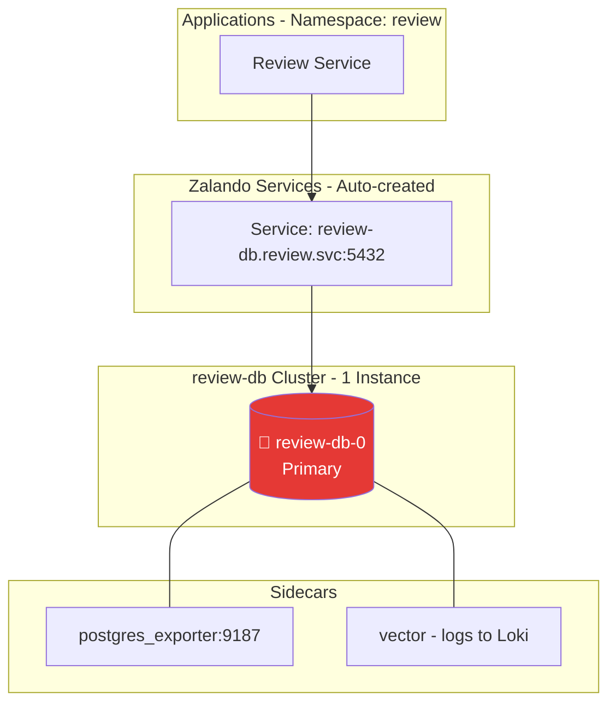

# Cluster Review DB (Zalando Operator)

## Overview

| Property | Value |
|----------|-------|
| **Operator** | Zalando Postgres Operator |
| **Namespace** | `review` |
| **PostgreSQL Version** | 16 |
| **Instances** | 1 (Single instance) |
| **Replication** | N/A (single instance) |
| **Pooler** | None (direct connection) |
| **Sidecars** | postgres_exporter (v0.18.1), Vector (v0.52.0) |

## Endpoints

| Type | Endpoint | Port | Purpose |
|------|----------|------|---------|
| Direct | `review-db.review.svc.cluster.local` | 5432 | Direct connection (only option) |
| Metrics | Pod IP | 9187 | postgres_exporter metrics |

### How to Read the Diagrams
- **Color coding**:
  - 🔴 **Red** = Primary/Leader instance (accepts writes)
  - 🟡 **Yellow** = Standby/Sync Replica (synchronous replication)
  - 🟢 **Green** = Read Replica (async) or database schema
  - 🟣 **Purple** = Connection Pooler (PgBouncer, PgDog, PgCat)

## Topology Diagram

## Notes

**Current Configuration:**
- Intentionally no connection pooler (low traffic, simple workload)
- Single instance for cost optimization in development/learning environment
- Direct connections from Review service only
- Conservative memory tuning: `shared_buffers: 64MB`, `work_mem: 4MB`

**Considering:**
- Add PgBouncer pooler if connection count grows
- Scale to 2+ instances for HA in production
- Consider merging with supporting-db if usage remains low

---

## Deployed Components

The following components are active in `kustomization.yaml`:

### 1. Database Cluster
- **File**: [`instance.yaml`](instance.yaml)
- **Description**: The main PostgreSQL 16 cluster configuration.
- **Spec**: 1 Instance (Single for cost optimization).
- **Pooler**: None (Direct connection only).

### 2. Monitoring
- **Queries**: [`configmaps/monitoring-queries.yaml`](configmaps/monitoring-queries.yaml)
- **Exporter**: Sidecar injected via `instance.yaml` (shares configuration with other clusters).

### 3. Logging
- **Config**: [`configmaps/vector-sidecar.yaml`](configmaps/vector-sidecar.yaml) (Vector sidecar for logs).

### 4. Secrets
- **Backup Credentials**: `secrets/pg-backup-rustfs-credentials.yaml`
