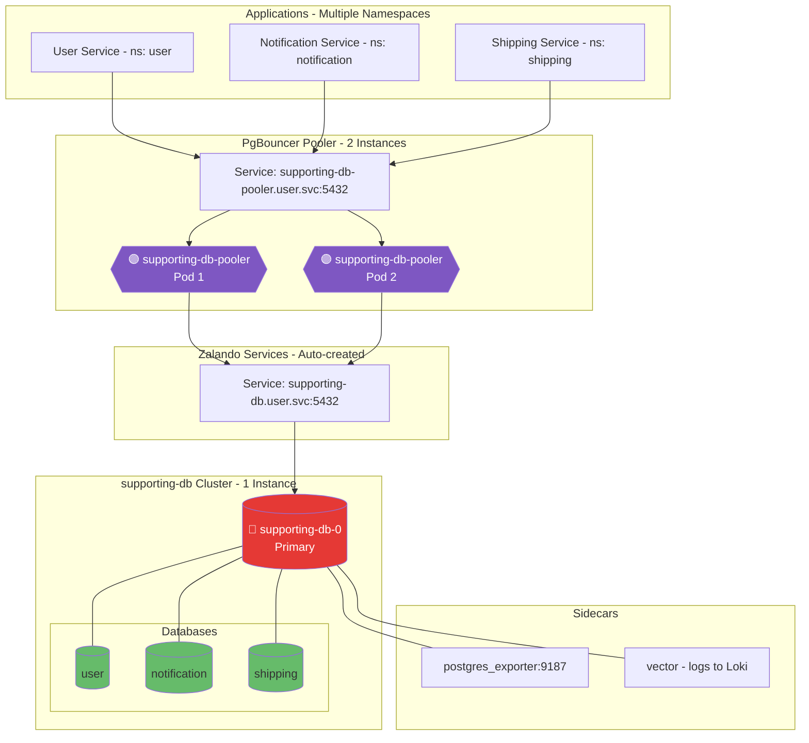

# Cluster Supporting DB (Zalando Operator)

## Overview

| Property | Value |
|----------|-------|
| **Operator** | Zalando Postgres Operator |
| **Namespace** | `user` |
| **PostgreSQL Version** | 16 |
| **Instances** | 1 (Single instance) |
| **Replication** | N/A (single instance) |
| **Pooler** | PgBouncer (2 instances, transaction mode) |
| **Sidecars** | postgres_exporter (v0.18.1), Vector (v0.52.0) |
| **Databases** | `user`, `notification`, `shipping` (multi-tenant) |

## Endpoints

| Type | Endpoint | Port | Purpose |
|------|----------|------|---------|
| Direct | `supporting-db.user.svc.cluster.local` | 5432 | Direct connection |
| Pooler | `supporting-db-pooler.user.svc.cluster.local` | 5432 | Connection pooling (recommended, requires `sslmode=require`) |
| Metrics | Pod IP | 9187 | postgres_exporter metrics |

### How to Read the Diagrams
- **Color coding**:
  - 🔴 **Red** = Primary/Leader instance (accepts writes)
  - 🟡 **Yellow** = Standby/Sync Replica (synchronous replication)
  - 🟢 **Green** = Read Replica (async) or database schema
  - 🟣 **Purple** = Connection Pooler (PgBouncer, PgDog, PgCat)

## Topology Diagram

## Notes

**Current Configuration:**
- Multi-database cluster serving 3 services across different namespaces
- Cross-namespace user naming: `notification.notification`, `shipping.shipping` for automatic secret distribution
- PgBouncer requires `sslmode=require` for connections
- Conservative memory tuning: `shared_buffers: 64MB`, `work_mem: 4MB` (256MB container limit)
- Extensions: `pg_stat_statements`, `pg_cron`, `pg_trgm`, `pgcrypto`, `pg_stat_kcache`

**Considering:**
- Scale to 2+ instances for HA (currently single instance for cost optimization)
- Separate databases into dedicated clusters if traffic increases significantly
- Enable synchronous replication when HA is added

---

## Deployed Components

The following components are active in `kustomization.yaml`:

### 1. Database Cluster
- **File**: [`instance.yaml`](instance.yaml)
- **Description**: The main PostgreSQL 16 cluster configuration.
- **Spec**: 1 Instance (Single for cost optimization, with `numberOfInstances: 1`).
- **Databases**: Hosted `user`, `notification`, and `shipping` databases.
- **Pooler**: PgBouncer (2 instances, managed via `instance.yaml`).

### 2. Monitoring
- **Queries**: [`configmaps/monitoring-queries.yaml`](configmaps/monitoring-queries.yaml)
- **Exporter**: [`monitoring/pgbouncer-exporter.yaml`](monitoring/pgbouncer-exporter.yaml)

### 3. Logging
- **Config**: [`configmaps/vector-sidecar.yaml`](configmaps/vector-sidecar.yaml) (Vector sidecar for logs).

### 4. Secrets
- **Backup Credentials**: `secrets/pg-backup-rustfs-credentials.yaml`
