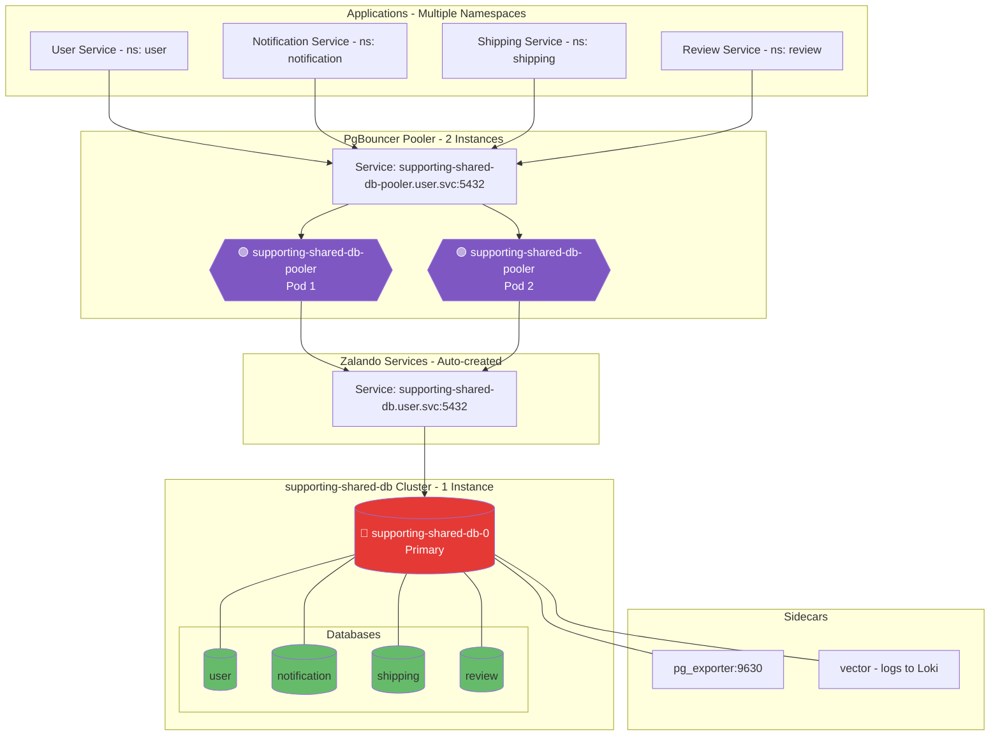

# Cluster Supporting DB (Zalando Operator)

## Overview


| Property               | Value                                             |
| ---------------------- | ------------------------------------------------- |
| **Operator**           | Zalando Postgres Operator                         |
| **Namespace**          | `user`                                            |
| **PostgreSQL Version** | 16                                                |
| **Instances**          | 1 (Single instance)                               |
| **Replication**        | N/A (single instance)                             |
| **Pooler**             | PgBouncer (2 instances, transaction mode)         |
| **Sidecars**           | pg_exporter (v1.2.0), Vector (v0.52.0)            |
| **Databases**          | `user`, `notification`, `shipping`, `review`      |


## Endpoints


| Type    | Endpoint                                             | Port | Purpose                                                      |
| ------- | ---------------------------------------------------- | ---- | ------------------------------------------------------------ |
| Direct  | `supporting-shared-db.user.svc.cluster.local`        | 5432 | Direct connection                                            |
| Pooler  | `supporting-shared-db-pooler.user.svc.cluster.local` | 5432 | Connection pooling (recommended, requires `sslmode=require`) |
| Metrics | Pod IP                                               | 9630 | pg_exporter metrics                                          |


### How to Read the Diagrams

- **Color coding**:
  - 🔴 **Red** = Primary/Leader instance (accepts writes)
  - 🟡 **Yellow** = Standby/Sync Replica (synchronous replication)
  - 🟢 **Green** = Read Replica (async) or database schema
  - 🟣 **Purple** = Connection Pooler (PgBouncer, PgDog, PgCat)

## Topology Diagram




## Notes

**Current Configuration:**

- Multi-database cluster serving 4 services across different namespaces
- Cross-namespace user naming: `notification.notification`, `shipping.shipping`, `review.review` for automatic secret distribution
- PgBouncer requires `sslmode=require` for connections
- Conservative memory tuning: `shared_buffers: 64MB`, `work_mem: 4MB` (256MB container limit)
- Backup target: `s3://pg-backups-zalando/user-db/` (WAL-G via RustFS)
- Shared preload libraries: `pg_stat_statements`, `pg_cron`, `pgcrypto`, `pg_stat_kcache`, `pgaudit`

**Considering:**

- Scale to 2+ instances for HA (currently single instance for cost optimization)
- Separate databases into dedicated clusters if traffic increases significantly
- Enable synchronous replication when HA is added

---

## Deployed Components

The following components are active in `kustomization.yaml`:

### 1. Database Cluster

- **File**: [instance.yaml](instance.yaml)
- **Description**: The main PostgreSQL 16 cluster configuration.
- **Spec**: 1 Instance (Single for cost optimization, with `numberOfInstances: 1`).
- **Databases**: Hosted `user`, `notification`, `shipping`, and `review` databases.
- **Pooler**: PgBouncer (2 instances, managed via `instance.yaml`).

### 2. Monitoring

- **Queries**: [configmaps/monitoring-queries.yaml](configmaps/monitoring-queries.yaml)
- **Exporter**: `pg_exporter:1.2.0` sidecar exposed on port `9630` (configured in `instance.yaml`)

### 3. Logging

- **Config**: [configmaps/vector-sidecar.yaml](configmaps/vector-sidecar.yaml) (Vector sidecar for logs).

### 4. Secrets

- **Backup Credentials**: `pg-backup-rustfs-credentials` (synced by ExternalSecret/ClusterExternalSecret)

### 5. Extensions

**PostgreSQL Extensions**: `preparedDatabases.extensions` vs `shared_preload_libraries`

PostgreSQL has two extension-enablement mechanisms, and they operate at completely different layers.

#### 1. `preparedDatabases.extensions` — Database Level

```yaml
preparedDatabases:
  user:
    extensions:
      pg_trgm: public
      uuid-ossp: public
      hstore: public
  notification:
    extensions:
      pg_trgm: public
      uuid-ossp: public
```

#### How it works

The Zalando operator automatically runs SQL statements in **each specified database**:

```sql
CREATE EXTENSION IF NOT EXISTS pg_trgm SCHEMA public;
CREATE EXTENSION IF NOT EXISTS "uuid-ossp" SCHEMA public;
```

#### Characteristics


| Attribute             | Value                                       |
| --------------------- | ------------------------------------------- |
| **Scope**             | Per-database (only for specified databases) |
| **Mechanism**         | `CREATE EXTENSION` SQL statement            |
| **Managed by**        | Zalando Operator                            |
| **Restart required?** | ❌ No                                        |
| **When applied?**     | During operator reconcile/bootstrap         |


#### Real examples from this config

```
user DB       -> pg_trgm, citext, uuid-ossp, pg_partman, hstore, unaccent
notification  -> pg_trgm, citext, uuid-ossp
shipping      -> pg_trgm, uuid-ossp
review        -> pg_trgm, uuid-ossp, hstore
```

> `hstore` is enabled only in `user` and `review`, so `notification` and `shipping` cannot use it even though they share the same cluster.

---

#### 2. `shared_preload_libraries` — Instance Level

```yaml
postgresql:
  parameters:
    shared_preload_libraries: "pg_stat_statements,pg_cron,pgcrypto,pg_stat_kcache,pgaudit"
```

#### How it works

PostgreSQL loads **shared libraries (.so files)** into memory **when the process starts**, before accepting any connections.

```
PostgreSQL start -> load pg_stat_statements.so -> load pgaudit.so -> ... -> accept connections
```

#### Characteristics


| Attribute             | Value                                            |
| --------------------- | ------------------------------------------------ |
| **Scope**             | Whole cluster / instance                         |
| **Mechanism**         | `dlopen()` loads `.so` files into process memory |
| **Managed by**        | PostgreSQL config (`postgresql.conf`)            |
| **Restart required?** | ✅ Yes                                            |
| **When applied?**     | At PostgreSQL process startup                    |


#### Why some extensions MUST be preloaded

These extensions need to **hook into PostgreSQL internals** (executor, planner, WAL) from startup:


| Extension            | Why preload is required                   |
| -------------------- | ----------------------------------------- |
| `pg_stat_statements` | Hooks query executor to track all queries |
| `pgaudit`            | Hooks logging system for auditing         |
| `pg_cron`            | Requires a background worker process      |
| `pg_stat_kcache`     | Hooks kernel interfaces for I/O stats     |


> If not preloaded and you only run `CREATE EXTENSION`, PostgreSQL raises:
>
> ```
> ERROR: pg_stat_statements must be loaded via shared_preload_libraries
> ```

---

#### Summary comparison


|                       | `preparedDatabases.extensions`        | `shared_preload_libraries`             |
| --------------------- | ------------------------------------- | -------------------------------------- |
| **Scope**             | Per-database                          | Whole cluster                          |
| **Mechanism**         | `CREATE EXTENSION` SQL                | Load `.so` into process memory         |
| **Restart required?** | ❌ No                                  | ✅ Yes                                  |
| **Managed by**        | Zalando Operator                      | PostgreSQL config                      |
| **Purpose**           | Enable features in specific databases | Load C hooks into PostgreSQL internals |
| **Change impact**     | Only selected databases               | Entire instance                        |


---

#### Special case: `pg_trgm` is extension-only in this cluster

```yaml
# shared_preload_libraries
shared_preload_libraries: "pg_stat_statements,pg_cron,pgcrypto,pg_stat_kcache,pgaudit"

# preparedDatabases
preparedDatabases:
  user:
    extensions:
      pg_trgm: public
```

`pg_trgm` does **not require** `shared_preload_libraries` because it does not hook deeply into internals. In this cluster, it is enabled only via `preparedDatabases.extensions`, which is the correct and sufficient setup.

In practice, `CREATE EXTENSION pg_trgm` in each target database is enough.

---

#### Full flow for enabling an extension

```
1. Add to shared_preload_libraries (if the extension needs hooks)
        ↓
2. Restart PostgreSQL pod
        ↓
3. Add to preparedDatabases.extensions for each target database
        ↓
4. Operator runs CREATE EXTENSION in those databases
        ↓
5. Extension is ready for use in the selected databases
```

---

*Note: Zalando Postgres Operator — `supporting-shared-db` cluster*