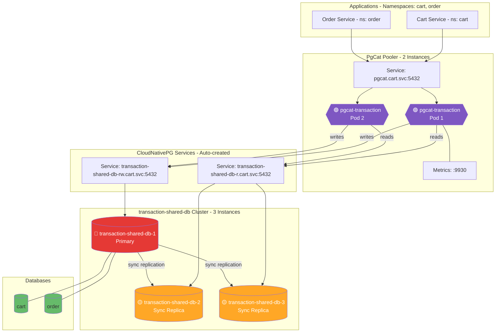

# Cluster Transaction DB (CloudNativePG Operator)

## Overview

| Property | Value |
|----------|-------|
| **Operator** | CloudNativePG |
| **Namespace** | `cart` |
| **PostgreSQL Version** | 18 |
| **Instances** | 3 (1 Primary + 2 Replicas) |
| **Replication** | Synchronous (quorum: any 1, dataDurability: required) |
| **Pooler** | PgCat (2 replicas, Kubernetes manifests) |
| **Databases** | `cart`, `order` |
| **Features** | Logical replication slot sync, read/write splitting |

## Endpoints

| Type | Endpoint | Port | Purpose |
|------|----------|------|---------|
| RW (Primary) | `transaction-shared-db-rw.cart.svc.cluster.local` | 5432 | Write queries |
| R (Replicas) | `transaction-shared-db-r.cart.svc.cluster.local` | 5432 | Read queries |
| Pooler | `pgcat.cart.svc.cluster.local` | 5432 | Connection pooling with R/W splitting |
| Metrics | `pgcat.cart.svc.cluster.local` | 9930 | PgCat Prometheus metrics |

### How to Read the Diagrams
- **Color coding**:
  - 🔴 **Red** = Primary/Leader instance (accepts writes)
  - 🟡 **Yellow** = Standby/Sync Replica (synchronous replication)
  - 🟢 **Green** = Read Replica (async) or database schema
  - 🟣 **Purple** = Connection Pooler (PgBouncer, PgDog, PgCat)

## Topology Diagram

## Notes

**Current Configuration:**
- Synchronous replication with quorum-based commit (any 1 replica required)
- Zero data loss guarantee (`dataDurability: required`)
- Read/write splitting enabled in PgCat:
  - `query_parser_read_write_splitting = true`
  - Writes → `transaction-shared-db-rw`, Reads → `transaction-shared-db-r`
- Logical replication slot synchronization for CDC support (Debezium, Kafka Connect)
- PostgreSQL 18 features: native `sync_replication_slots` parameter
- Production-tuned: `shared_buffers: 256MB`, `work_mem: 32MB`, `wal_level: logical`
- Aggressive autovacuum for high-write workloads

**Considering:**
- Enable `syncReplicaElectionConstraint` with node anti-affinity for production
- Add PodDisruptionBudget for PgCat deployment
- Configure backup with Barman/pgBackRest for disaster recovery
- Enable connection throttling in PgCat during peak loads

---

## Deployed Components

The following components are active in `kustomization.yaml`:

### 1. Database Cluster
- **File**: [`instance.yaml`](instance.yaml)
- **Description**: The main PostgreSQL 18 cluster configuration.
- **Spec**: 3 instances (1 primary + 2 replicas), writes to `s3://pg-backups/transaction-shared-db/`.

### 2. Connection Pooler
- **Directory**: [`poolers/`](poolers/)
- **Component**: PgCat (deployed via Kubernetes manifests).
- **Service**: Exposes port `5432`.
- **Config**: Auto-routes read/write traffic.

### 3. Monitoring
- **Files**:
  - [`monitoring/podmonitor-cloudnativepg-transaction-shared-db.yaml`](monitoring/podmonitor-cloudnativepg-transaction-shared-db.yaml): For CNPG metrics.
  - [`monitoring/servicemonitor-pgcat-transaction.yaml`](monitoring/servicemonitor-pgcat-transaction.yaml): For PgCat metrics.

### 4. Secrets
- **Cart Database Credentials**: `secrets/transaction-shared-db-secret-cart.yaml`
- **Order Database Credentials**: `secrets/transaction-shared-db-secret-order.yaml`
- **Backup Credentials**: `secrets/pg-backup-rustfs-credentials.yaml`

### 5. Extensions
- **Files**:
  - `extensions-cart.yaml`
  - `extensions-order.yaml`
- **Status**: **Disabled** (commented out in `kustomization.yaml`).

### 6. Backup Schedules
- **Daily**: [`backup/scheduledbackup.yaml`](backup/scheduledbackup.yaml)
