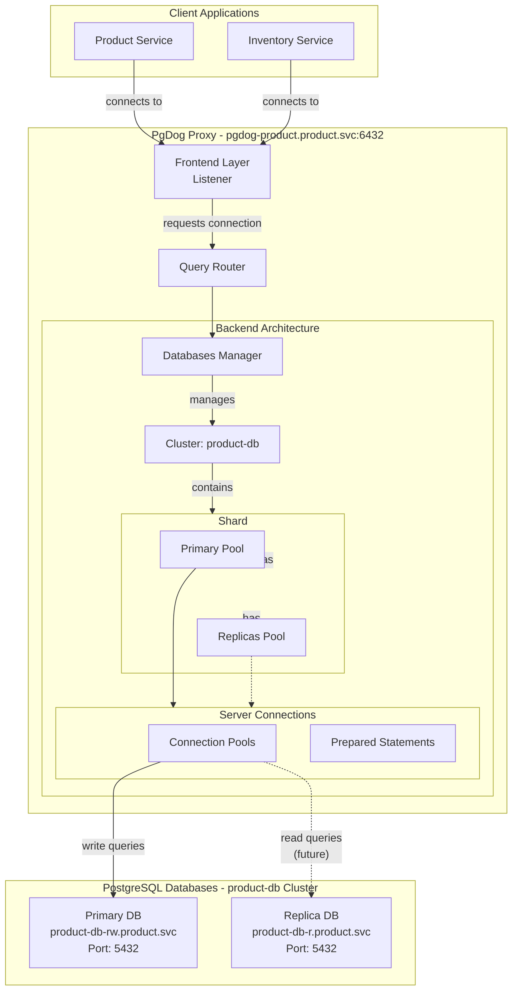
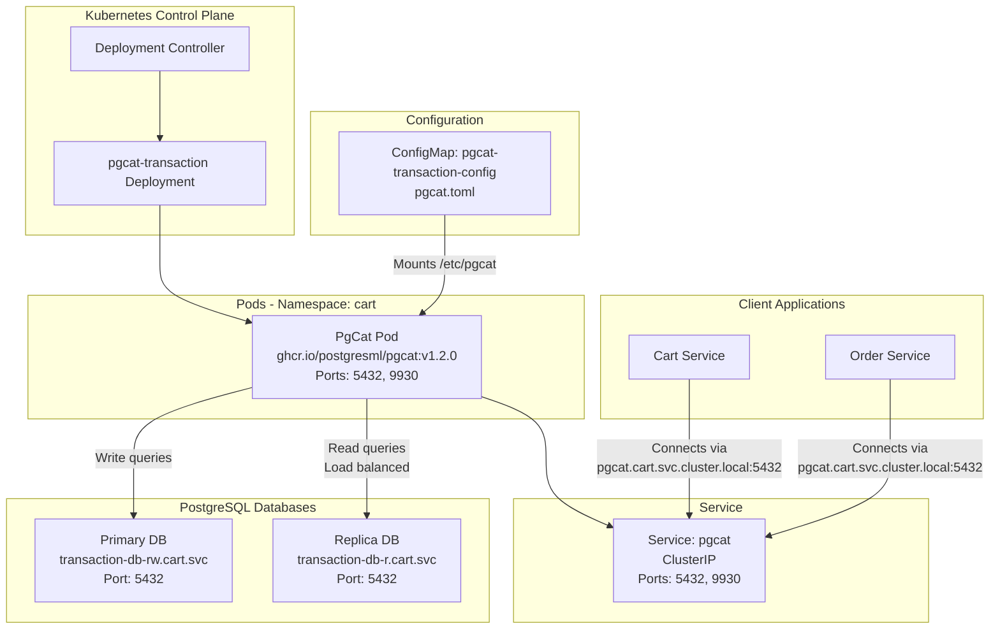

# Connection Poolers

This directory contains Kubernetes manifests for PostgreSQL connection poolers used by the microservices.

## Overview

Connection poolers solve the "too many connections" problem by reusing PostgreSQL connections, allowing applications to handle 1000+ client connections with only 25-50 database connections.

## Quick Reference

| Pooler    | Database       | Namespace | Service Endpoint                               | Deployment Method    | Features                                                                |
| --------- | -------------- | --------- | ---------------------------------------------- | -------------------- | ----------------------------------------------------------------------- |
| **PgDog** | product-db     | product   | `pgdog-product.product.svc.cluster.local:6432` | Helm chart (v0.32)   | Multi-database routing, ServiceMonitor, PodDisruptionBudget             |
| **PgCat** | transaction-db | cart      | `pgcat.cart.svc.cluster.local:5432`            | Kubernetes manifests | Multi-database routing, Read replica load balancing, Automatic failover |

## PgDog (Product Database)

**Location:** [`pgdog-product/`](pgdog-product/)

**Purpose:** Connection pooling for product-db (CloudNativePG cluster)

### Kubernetes Deployment Architecture



> [!NOTE]
> Đường nét đứt (-.->`) chỉ replica routing là **planned feature** chưa được configure trong helmrelease hiện tại.

**Deployment:**
- Managed via Flux HelmRelease
- Helm chart: `helm.pgdog.dev/pgdog` (version v0.32)
- Single replica (HA capable)

**Password Configuration:**
The PgDog Helm chart supports two methods for password management:
**Option 1: Inline Password(current)**

```yaml
users:
  - name: product
    database: product
    password: postgres
```

**Option 2: ExternalSecrets (apply later)**

The chart supports ExternalSecrets Operator for secure password injection:

```yaml
externalSecrets:
  enabled: true
  secretStoreRef:
    name: vault-backend
    kind: ClusterSecretStore
  data:
    - secretKey: password
      remoteRef:
        key: path/to/secret
        property: password
```

**Configuration:**
- Pool mode: `transaction`
- Pool size: 30 connections
- Port: 6432
- Metrics: Port 9090 (OpenMetrics)

**Files:**
- [`pgdog-product/helmrelease.yaml`](pgdog-product/helmrelease.yaml) - Flux HelmRelease definition

## PgCat (Transaction Database)

**Location:** [`pgcat-transaction/`](pgcat-transaction/)

### Kubernetes Deployment Architecture



**Purpose:** Connection pooling and read replica routing for transaction-db (CloudNativePG cluster)

**Deployment:**
- Standalone Kubernetes Deployment (1 replica, HA capable)
- Managed via Kustomize

**Configuration:**
- Pool mode: `transaction`
- Pool size: 30 connections per database
- Port: 5432 (PostgreSQL protocol)
- Metrics: Port 9930 (Prometheus exporter)

**Files:**
- [`pgcat-transaction/configmap.yaml`](pgcat-transaction/configmap.yaml) - PgCat TOML configuration
- [`pgcat-transaction/deployment.yaml`](pgcat-transaction/deployment.yaml) - Kubernetes Deployment
- [`pgcat-transaction/service.yaml`](pgcat-transaction/service.yaml) - Kubernetes Service

## Comparison

| Feature                | PgDog                     | PgCat                 |
| ---------------------- | ------------------------- | --------------------- |
| **Architecture**       | Multi-threaded (Rust)     | Multi-threaded (Rust) |
| **Deployment**         | Helm chart                | Kubernetes manifests  |
| **Load Balancing**     | Yes (multiple strategies) | Yes (read replicas)   |
| **Automatic Failover** | Yes                       | Yes                   |
| **Sharding**           | Production-grade          | Experimental          |
| **Monitoring**         | OpenMetrics + Admin DB    | Prometheus + Admin DB |
| **Multi-Database**     | Yes                       | Yes                   |

## Usage

### Application Connection

Both poolers are transparent to applications. Use the service endpoint in your database connection string:

**Product Service:**
```go
DB_HOST=pgdog-product.product.svc.cluster.local
DB_PORT=6432
```

**Cart/Order Services:**
```go
DB_HOST=pgcat.cart.svc.cluster.local
DB_PORT=5432
```

### Monitoring

**PgDog Metrics:**
- ServiceMonitor auto-created by Helm chart
- Endpoint: `http://pgdog-product.product.svc.cluster.local:9090/metrics`
- Namespace: `pgdog_`

**PgCat Metrics:**
- ServiceMonitor: `kubernetes/infra/configs/monitoring/servicemonitors/`
- Endpoint: `http://pgcat.cart.svc.cluster.local:9930/metrics`

## Related Documentation

- **Database Guide:** [`docs/guides/DATABASE.md`](../../../../docs/guides/DATABASE.md#connection-poolers)
- **PgCat Troubleshooting:** [`docs/troubleshooting/PGCAT_PREPARED_STATEMENT_ERROR.md`](../../../../docs/troubleshooting/PGCAT_PREPARED_STATEMENT_ERROR.md)
