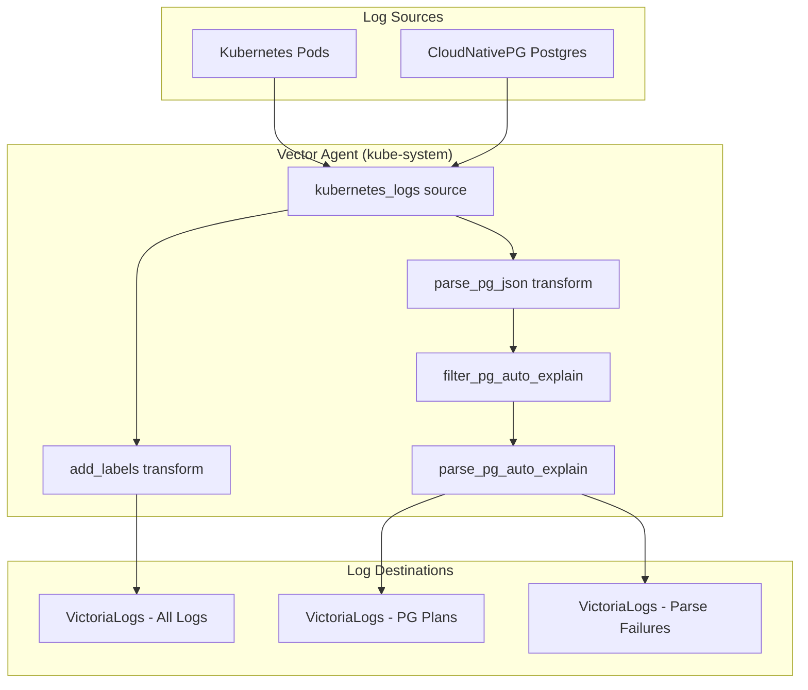
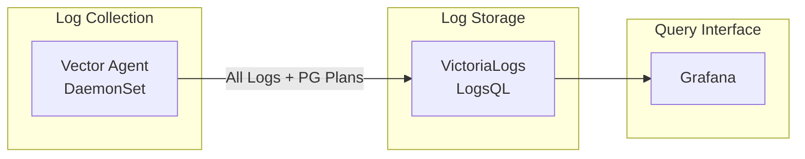

# VictoriaLogs

VictoriaLogs Single Node deployment for log storage and querying.

## Architecture



## Data Flow



## Key Design Decisions

1. **Single Vector Agent**: One cluster-wide Vector DaemonSet ships to VictoriaLogs (the sole log backend; Loki was removed in v0.94.0)
2. **Collector Disabled**: VictoriaLogs embedded Vector/collector is disabled (`vector.enabled: false`)
3. **Single Backend**: VictoriaLogs is the only log sink — no second backend to operate

## Endpoints

| Endpoint | Port | Purpose |
|----------|------|---------|
| `/insert/jsonline` | 9428 | JSON Lines log ingestion |
| `/insert/elasticsearch` | 9428 | Elasticsearch-compatible bulk API |
| `/select/logsql/query` | 9428 | LogsQL query endpoint |
| `/health` | 9428 | Health check |

## Configuration

Key HelmRelease values:

```yaml
server:
  retentionPeriod: 7d
  persistentVolume:
    enabled: true
    size: 20Gi

# CRITICAL: Embedded collector disabled
vector:
  enabled: false
```

## Related Files

| File | Purpose |
|------|---------|
| `helmrelease.yaml` | VictoriaLogs HelmRelease |
| `../vector/vector.yaml` | Vector Agent with VictoriaLogs sinks |
| `docs/victorialogs/README.md` | Full documentation |

## References

- [VictoriaLogs Docs](https://docs.victoriametrics.com/victorialogs/)
- [VictoriaLogs Vector Setup](https://docs.victoriametrics.com/victorialogs/data-ingestion/vector)
- [VictoriaLogs Helm Chart](https://docs.victoriametrics.com/helm/victorialogs-single/)
