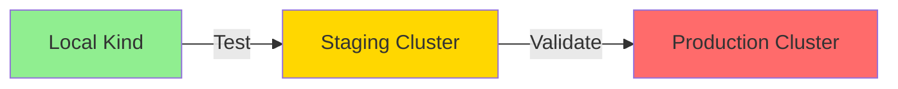

# Multi-Environment Structure

This directory contains Kustomize overlays for multiple deployment environments.

## Directory Structure

```
kubernetes/
├── base/                          # Base manifests (environment-agnostic)
│   ├── apps/                      # Application HelmReleases
│   └── infrastructure/            # Infrastructure components
│
├── overlays/                      # Environment-specific overlays
│   ├── local/                     # Local Kind cluster (ACTIVE)
│   │   ├── apps/
│   │   │   └── patches/           # Local app patches (reduced resources)
│   │   └── infrastructure/
│   ├── staging/                   # Staging environment (TODO)
│   │   ├── apps/
│   │   │   └── patches/           # Staging app patches
│   │   └── infrastructure/
│   └── production/                # Production environment (TODO)
│       ├── apps/
│       │   └── patches/           # Production app patches (HA, scaling)
│       └── infrastructure/
│
└── clusters/                      # Flux cluster configurations
    ├── local/                     # Local Kind cluster (ACTIVE)
    │   ├── flux-system/           # FluxInstance CRD
    │   ├── sources/               # OCI & Helm repositories
    │   ├── infrastructure.yaml    # Infrastructure Kustomization
    │   ├── monitoring.yaml        # Monitoring Kustomization
    │   ├── apm.yaml               # APM Kustomizationx
    │   ├── databases.yaml         # Database Kustomization
    │   ├── slo.yaml               # SLO Kustomization
    │   └── apps.yaml              # Apps Kustomization
    ├── staging/                   # Staging cluster config (TODO)
    │   ├── flux-system/
    │   └── sources/
    └── production/                # Production cluster config (TODO)
        ├── flux-system/
        └── sources/
```

## Environments

### Local (Active)
- **Purpose:** Local development with Kind cluster
- **Features:**
  - Reduced resources (1 replica, minimal CPU/memory)
  - Debug logging (LOG_LEVEL=debug)
  - 100% tracing (OTEL_SAMPLE_RATE=1.0)
  - Reduced K6 load (10/30/50 RPS)
  - SSL disabled for databases (DB_SSLMODE=require)
- **Cluster:** `mop` Kind cluster
- **OCI Registry:** `localhost:5050`

### Staging (Placeholder)
- **Purpose:** Pre-production testing environment
- **TODO:**
  - Configure staging Kubernetes cluster
  - Set up staging OCI registry
  - Define staging-specific patches:
    - Moderate resources (2-3 replicas)
    - Info logging (LOG_LEVEL=info)
    - 10% tracing (OTEL_SAMPLE_RATE=0.1)
    - SSL enabled for databases
    - Staging secrets and DNS
  - Create FluxInstance for staging

### Production (Placeholder)
- **Purpose:** Production deployment
- **TODO:**
  - Configure production Kubernetes cluster (AWS EKS / GKE)
  - Set up production OCI registry (ghcr.io / ECR / GCR)
  - Define production-specific patches:
    - High availability (3+ replicas)
    - Production logging (LOG_LEVEL=warn)
    - 1% tracing (OTEL_SAMPLE_RATE=0.01)
    - SSL required for databases
    - Production secrets management (Sealed Secrets / External Secrets)
    - Auto-scaling (HPA)
    - Network policies
  - Create FluxInstance for production

## Promotion Path



**Workflow:**
1. **Develop** in `local` overlay
2. **Promote** to `staging` overlay (update image tags, test integration)
3. **Deploy** to `production` overlay (final validation, gradual rollout)

## Kustomize Pattern

### Base + Overlay Pattern
- **Base:** Shared manifests (HelmReleases, CRDs)
- **Overlay:** Environment-specific patches (resources, replicas, env vars)

### Patch Strategy
- **Local:** Strategic merge with FULL env arrays
- **Staging/Production:** Same pattern, different values

### Example: Auth Service
```yaml
# Base (base/apps/auth/helmrelease.yaml)
values:
  replicaCount: 2  # Default
  env:
    - name: LOG_LEVEL
      value: "info"  # Default

# Local Overlay (overlays/local/apps/patches/helmreleases.yaml)
values:
  replicaCount: 1  # Override
  env:
    - name: LOG_LEVEL
      value: "debug"  # Override

# Production Overlay (overlays/production/apps/patches/helmreleases.yaml)
values:
  replicaCount: 5  # Override
  env:
    - name: LOG_LEVEL
      value: "warn"  # Override
```

## Usage

### Local (Current)
```bash
# Build local manifests
kubectl kustomize kubernetes/overlays/local/apps

# Push to local OCI registry
make flux-push

# Apply via Flux
flux reconcile kustomization apps-local
```

### Staging (Future)
```bash
# Build staging manifests
kubectl kustomize kubernetes/overlays/staging/apps

# Push to staging OCI registry
make flux-push-staging

# Apply via Flux
flux reconcile kustomization apps-staging --context staging-cluster
```

### Production (Future)
```bash
# Build production manifests
kubectl kustomize kubernetes/overlays/production/apps

# Push to production OCI registry
make flux-push-production

# Apply via Flux (with approval)
flux reconcile kustomization apps-production --context production-cluster
```

## Next Steps

1. **Set up staging cluster** (AWS EKS / GKE / self-hosted)
2. **Configure staging OCI registry** (ghcr.io / ECR / GCR / Harbor)
3. **Create staging patches** (moderate resources, info logging)
4. **Test promotion workflow** (local → staging)
5. **Repeat for production** with stricter validation

## References

- Kustomize Base/Overlay: https://kubectl.docs.kubernetes.io/references/kustomize/glossary/#overlay
- Flux Multi-Tenancy: https://fluxcd.io/flux/use-cases/multi-tenancy/
- Research: `specs/active/flux-gitops-migration/research.md`
