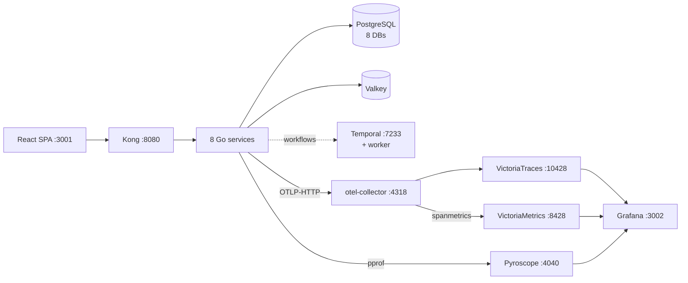

# local-stack

A one-command **Docker Compose** end-to-end stack for the duynhlab platform —
the full request path plus a tracing + span-metrics observability stack, without
a Kubernetes cluster.

It runs: PostgreSQL (8 databases) · Valkey · per-service golang-migrate jobs · the
**8 Go services** · a Temporal dev server + the order-fulfillment worker · a
**Kong DB-less gateway** (mirrors the in-cluster Kong) · the **React SPA** ·
an **OTel Collector → VictoriaTraces + VictoriaMetrics → Grafana** pipeline, and
**Pyroscope** continuous profiling.

## Prerequisites

- Docker + Docker Compose v2.
- **All service repos checked out next to `homelab/`** — build contexts point at
  siblings (`../../auth-service`, `../../frontend`, …). Missing a repo fails the build.

## Quick start

```bash
cd local-stack
docker compose up -d --build
```

First run builds every service image, so it takes a few minutes. Then:

| Component | URL | Notes |
|-----------|-----|-------|
| SPA (frontend) | http://localhost:3001 | demo login `alice` / `password123` (by **username**) |
| API gateway (Kong) | http://localhost:8080 | pass-through to all 8 services |
| Temporal Web UI | http://localhost:8233 | watch the saga |
| **Grafana** | **http://localhost:3002** | Explore (traces) + RED dashboard; anonymous admin |
| VictoriaTraces | http://localhost:10428 | trace ingest + Jaeger query API + vmui |
| VictoriaMetrics | http://localhost:8428 | remote-write + PromQL + vmui |
| Pyroscope | http://localhost:4040 | continuous profiling (flame graphs) |

Postgres and Valkey are internal-only (reach the services through Kong, not directly).

## Architecture



## Try the order-fulfillment saga

Log in at http://localhost:3001 (`alice` / `password123`) and run a checkout. It
drives the `OrderFulfillmentWorkflow` across auth → user → product → cart → order
→ shipping → notification — watch each activity in the **Temporal UI** (:8233).

## Tracing & RED metrics

Tracing is **on** in this stack. The OTel Collector both stores traces
(VictoriaTraces) and derives RED metrics from spans (VictoriaMetrics) — mirroring
the cluster, with the spanmetrics connector standing in for Tempo's
metrics-generator locally.


The **OTel Collector is required**: the services' standard OTLP-HTTP SDK posts to
`…/v1/traces`, which can't be retargeted at VictoriaTraces' non-standard
`/insert/opentelemetry/v1/traces` ingest path directly. The collector receives
standard OTLP and re-exports to VT.

- Tracing is wired for all 8 services via the shared `x-svc-env` anchor
  (`TRACING_ENABLED=true`, `OTEL_COLLECTOR_ENDPOINT=otel-collector:4318`,
  `OTEL_SAMPLE_RATE=1.0`), with a per-service `OTEL_SERVICE_NAME` so trace/metric
  service names are real (`auth`, `product`, …), not the container hostname.
- The collector uses the **contrib** image (the `spanmetrics` connector lives
  there). Config:
  [`observability/otel-collector-config.yaml`](observability/otel-collector-config.yaml).
- Grafana datasources (auto-provisioned): **VictoriaTraces** (Jaeger-type →
  `/select/jaeger`) and **VictoriaMetrics** (Prometheus-type) under
  [`observability/grafana/provisioning/datasources/`](observability/grafana/provisioning/datasources/).

### Audit traces

1. Generate spans — log in and run a checkout (exercises the full service chain).
2. **Grafana** → **Explore** → **VictoriaTraces** → pick a service → open a trace
   to inspect the span waterfall.
3. CLI checks:
   ```bash
   docker logs otel-collector                               # debug exporter shows span counts
   curl 'http://localhost:10428/select/jaeger/api/services' # services with traces
   curl -XPOST 'http://localhost:10428/select/logsql/query' \
     --data-urlencode 'query=* | count()'                   # total spans ingested
   ```

### RED dashboard (span metrics)

The collector's **spanmetrics connector** derives request rate / error rate /
latency from spans and remote-writes them to VictoriaMetrics as
`spanmetrics_calls_total` + `spanmetrics_duration_milliseconds_*` (labels
`service_name`, `span_kind`, `status_code`, `http_route`). Open **Grafana →
Dashboards → "RED — span metrics (local-stack)"** (auto-provisioned;
[`red-spanmetrics.json`](observability/grafana/dashboards/red-spanmetrics.json)).
Panels populate while traffic flows (the `rate()` windows read empty when idle):

```promql
histogram_quantile(0.95, sum by (le, service_name) (rate(spanmetrics_duration_milliseconds_bucket[5m])))
```

### Continuous profiling (Pyroscope)

Profiling is **on** locally: the 8 services push pprof data to the `pyroscope`
container (`PROFILING_ENABLED=true` + `PYROSCOPE_ENDPOINT=http://pyroscope:4040`
in `x-svc-env`). View flame graphs in **Grafana → Explore → Pyroscope** (pick a
service + profile type: CPU, alloc, inuse, goroutines, mutex/block), or the
Pyroscope UI at http://localhost:4040.

> Traces→profiles correlation is a Tempo-datasource feature; the local
> VictoriaTraces datasource is Jaeger-type, so that span-link isn't wired locally
> (it works in-cluster). View flame graphs directly in Explore.

## Stop / reset

```bash
docker compose down        # stop containers, keep volumes (Postgres data, traces)
docker compose down -v     # also drop volumes for a clean slate
```

## Notes

- **Profiling is enabled locally** via the `pyroscope` container (see above). Set
  `PROFILING_ENABLED=false` in `x-svc-env` to turn it off.
- VictoriaTraces is **v0.6.0 (0.x, pre-GA)** — the same pin as the cluster pilot.
  See [`docs/observability/tracing/victoriatraces.md`](../docs/observability/tracing/victoriatraces.md).
