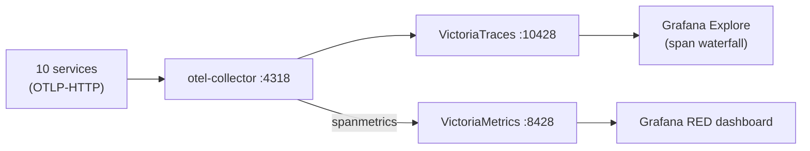

# local-stack

A one-command **Docker Compose** end-to-end stack for the duynhlab platform —
the full request path plus a tracing + span-metrics observability stack, without
a Kubernetes cluster.

It runs: PostgreSQL (10 databases) · Valkey · per-service golang-migrate jobs · the
**10 Go services** (+ the `mockpay` provider) · a Temporal dev server + the order-fulfillment worker · a
**Kong DB-less gateway** (mirrors the in-cluster Kong) · the **React SPA** ·
an **OTel Collector → VictoriaTraces + VictoriaMetrics → Grafana** pipeline, and
**Pyroscope** continuous profiling.

## Prerequisites

- Docker + Docker Compose v2.
- **All service repos checked out next to `homelab/`** — build contexts point at
  siblings (`../../auth-service`, `../../frontend`, …). Missing a repo fails the build.

## Quick start

```bash
cd local-stack
docker compose up -d --build
```

First run builds every service image, so it takes a few minutes. Then:

| Component | URL | Notes |
|-----------|-----|-------|
| SPA (frontend) | http://localhost:3001 | demo login `alice` / `password123` (by **username**) |
| API gateway (Kong) | http://localhost:8080 | pass-through to all 10 services (checkout included — no host port, Kong only) |
| Temporal Web UI | http://localhost:8233 | watch the saga |
| **Grafana** | **http://localhost:3002** | Explore (traces) + RED dashboard; anonymous admin |
| VictoriaTraces | http://localhost:10428 | trace ingest + Jaeger query API + vmui |
| VictoriaMetrics | http://localhost:8428 | remote-write + PromQL + vmui |
| Pyroscope | http://localhost:4040 | continuous profiling (flame graphs) |

Postgres and Valkey are internal-only (reach the services through Kong, not directly).

## Architecture


## Try the order-fulfillment saga

Log in at http://localhost:3001 (`alice` / `password123`) and run a checkout. It
drives the `OrderFulfillmentWorkflow` across auth → user → product → cart → order
→ shipping → notification — watch each activity in the **Temporal UI** (:8233).

## E2E audit before pushing (backend + real browser)

Run this audit on the full stack **before pushing any change that touches auth,
the gateway, or the SPA**. It has two phases: API-contract checks with `curl`,
then a real-browser pass driven by the `agent-browser` CLI (available locally as
a Claude skill at `~/.claude/skills/agent-browser`; the examples below are plain
shell and work without the skill too).

> The stack builds services from the **sibling repos' current checkouts** — make
> sure every repo is on the branch you intend to test, then
> `docker compose up -d --build`.

### Phase A — API contract (curl, ~1 min)

```bash
BASE=http://localhost:8080

# A1. Login returns the JWT pair — and NO opaque `token` field
R=$(curl -s -X POST $BASE/auth/v1/public/auth/login -H 'Content-Type: application/json' \
  -d '{"username":"alice","password":"password123"}')
echo "$R" | python3 -c "import json,sys; d=json.load(sys.stdin); \
  assert 'token' not in d, 'opaque token leaked'; \
  assert d['access_token'].count('.')==2 and d['refresh_token'] and d['expires_in']; \
  print('A1 OK', sorted(d.keys()))"
AT=$(echo "$R" | python3 -c "import json,sys;print(json.load(sys.stdin)['access_token'])")
RT=$(echo "$R" | python3 -c "import json,sys;print(json.load(sys.stdin)['refresh_token'])")

# A2. Private routes 200 through Kong edge-jwt with a valid JWT
for p in user/v1/private/users/profile cart/v1/private/cart order/v1/private/orders \
         notification/v1/private/notifications; do
  [ "$(curl -s -o /dev/null -w '%{http_code}' $BASE/$p -H "Authorization: Bearer $AT")" = 200 ] \
    && echo "A2 OK /$p" || echo "A2 FAIL /$p"
done

# A3. Bad / missing token → 401 at the Kong edge (WWW-Authenticate header)
curl -s -o /dev/null -w "A3 bad-token: %{http_code} (want 401)\n" \
  $BASE/cart/v1/private/cart -H "Authorization: Bearer x.y.z"
curl -s -o /dev/null -w "A3 no-token:  %{http_code} (want 401)\n" $BASE/cart/v1/private/cart

# A4. Refresh rotates; replaying the OLD token → 401 AND revokes the family
R2=$(curl -s -X POST $BASE/auth/v1/public/auth/refresh -H 'Content-Type: application/json' \
  -d "{\"refresh_token\":\"$RT\"}")
RT2=$(echo "$R2" | python3 -c "import json,sys;print(json.load(sys.stdin)['refresh_token'])")
curl -s -o /dev/null -w "A4 replay-old:      %{http_code} (want 401)\n" \
  -X POST $BASE/auth/v1/public/auth/refresh -H 'Content-Type: application/json' -d "{\"refresh_token\":\"$RT\"}"
curl -s -o /dev/null -w "A4 family-revoked:  %{http_code} (want 401)\n" \
  -X POST $BASE/auth/v1/public/auth/refresh -H 'Content-Type: application/json' -d "{\"refresh_token\":\"$RT2\"}"

# A5. Logout revokes; idempotent; subsequent refresh dies
R3=$(curl -s -X POST $BASE/auth/v1/public/auth/login -H 'Content-Type: application/json' \
  -d '{"username":"alice","password":"password123"}')
RT3=$(echo "$R3" | python3 -c "import json,sys;print(json.load(sys.stdin)['refresh_token'])")
curl -s -o /dev/null -w "A5 logout:          %{http_code} (want 200)\n" \
  -X POST $BASE/auth/v1/public/auth/logout -H 'Content-Type: application/json' -d "{\"refresh_token\":\"$RT3\"}"
curl -s -o /dev/null -w "A5 refresh-after:   %{http_code} (want 401)\n" \
  -X POST $BASE/auth/v1/public/auth/refresh -H 'Content-Type: application/json' -d "{\"refresh_token\":\"$RT3\"}"

# A6. Removed surfaces stay removed
curl -s -o /dev/null -w "A6 /private/me:     %{http_code} (want 404 — route gone at Kong)\n" \
  $BASE/auth/v1/private/me -H "Authorization: Bearer $AT"
docker compose exec -T postgres psql -U postgres -d auth -c '\dt' | grep -q sessions \
  && echo "A6 FAIL: sessions table exists" || echo "A6 OK: no sessions table"

# A7. v3 collection-noun paths (ADR-017): new canonical 200 + deprecated
#     aliases still answering during the expand phase (removed at contract)
curl -s -o /dev/null -w "A7 shipments/track:     %{http_code} (want 200)\n" \
  "$BASE/shipping/v1/public/shipments/track?tracking_number=1Z999AA10123456784"
curl -s -o /dev/null -w "A7 shipments/estimate:  %{http_code} (want 200)\n" \
  "$BASE/shipping/v1/public/shipments/estimate?origin=HN&destination=SG&weight=1"
curl -s -o /dev/null -w "A7 alias track:         %{http_code} (want 200 — deprecated)\n" \
  "$BASE/shipping/v1/public/track?tracking_number=1Z999AA10123456784"
curl -s -o /dev/null -w "A7 alias login:         %{http_code} (want 200 — deprecated)\n" \
  -X POST $BASE/auth/v1/public/login -H 'Content-Type: application/json' \
  -d '{"username":"alice","password":"password123"}'

# A8. Renamed zero-caller internal paths are gone (no aliases kept):
#     these are cluster-internal, so probe the service containers directly.
docker compose exec -T notification wget -q -O /dev/null -S \
  --post-data '{}' --header 'Content-Type: application/json' \
  http://localhost:8080/notification/v1/internal/notify/email 2>&1 | head -1
# want: HTTP/1.1 404 (the /notifications/{email,sms} paths replaced notify/*)
docker compose exec -T shipping wget -q -O /dev/null -S \
  http://localhost:8080/shipping/v1/internal/orders/1 2>&1 | head -1
# want: HTTP/1.1 404 (now /shipping/v1/internal/shipments/orders/:orderId)

# A9. Checkout sessions (RFC-0015 P1) — lifecycle through Kong edge-JWT.
#     Cart must have at least one item (add via the SPA or cart API first).
AT9=$(curl -s -X POST $BASE/auth/v1/public/auth/login -H 'Content-Type: application/json' \
  -d '{"username":"alice","password":"password123"}' | python3 -c "import json,sys;print(json.load(sys.stdin)['access_token'])")
curl -s -X POST $BASE/cart/v1/private/cart -H "Authorization: Bearer $AT9" \
  -H 'Content-Type: application/json' \
  -d '{"product_id":"1","product_name":"Wireless Mouse","product_price":29.99,"quantity":1}' -o /dev/null
S9=$(curl -s -X POST $BASE/checkout/v1/private/sessions -H "Authorization: Bearer $AT9")
SID=$(echo "$S9" | python3 -c "import json,sys;print(json.load(sys.stdin)['session']['id'])")
echo "A9 create:   session $SID ($(echo "$S9" | python3 -c "import json,sys;print(json.load(sys.stdin)['session']['status'])"))"
curl -s -o /dev/null -w "A9 re-create: %{http_code} (want 200 — idempotent, same session)\n" \
  -X POST $BASE/checkout/v1/private/sessions -H "Authorization: Bearer $AT9"
curl -s -o /dev/null -w "A9 get:       %{http_code} (want 200)\n" \
  $BASE/checkout/v1/private/sessions/$SID -H "Authorization: Bearer $AT9"
curl -s -o /dev/null -w "A9 address:   %{http_code} (want 200 → address_set)\n" \
  -X PUT $BASE/checkout/v1/private/sessions/$SID/address -H "Authorization: Bearer $AT9" \
  -H 'Content-Type: application/json' \
  -d '{"full_name":"Alice","line1":"1 Main St","city":"HN","country":"VN"}'
curl -s -o /dev/null -w "A9 cancel:    %{http_code} (want 200)\n" \
  -X DELETE $BASE/checkout/v1/private/sessions/$SID -H "Authorization: Bearer $AT9"
curl -s -o /dev/null -w "A9 no-token:  %{http_code} (want 401 at the edge)\n" \
  -X POST $BASE/checkout/v1/private/sessions
curl -s -o /dev/null -w "A9 old path:  %{http_code} (want 404 — /api/v1/checkout removed)\n" \
  -X POST $BASE/api/v1/checkout
# Price-change detection (the RFC-0015 P1 exit criterion): bump a catalog
# price, create a fresh session, expect the line flagged.
docker compose exec -T postgres psql -U postgres -d product -c \
  "UPDATE products SET price = price + 1 WHERE id = 1" >/dev/null
curl -s -X POST $BASE/checkout/v1/private/sessions -H "Authorization: Bearer $AT9" | \
  python3 -c "import json,sys; s=json.load(sys.stdin)['session']; \
  print('A9 price-change:', 'OK' if any(i['price_changed'] for i in s['items']) else 'FAIL', \
  [ (i['product_id'], i['price_changed']) for i in s['items'] ])"
docker compose exec -T postgres psql -U postgres -d product -c \
  "UPDATE products SET price = price - 1 WHERE id = 1" >/dev/null
```

> Rapid-fire auth calls can trip Kong's rate limit (429). That is the gateway
> working, not a bug — wait a few seconds and retry the step.

### Phase B — real browser (agent-browser, ~2 min)

`--args "--no-sandbox"` is required on Linux hosts with user-namespace
restrictions (only needed on the first command of a session).

```bash
S="--session audit"

# B1. Login through the UI, then verify what landed in localStorage
agent-browser $S --args "--no-sandbox" batch "open http://localhost:3001/login" "wait 1500" "snapshot -i"
# read the refs from the snapshot (username @eX, password @eY, Login button @eZ), then:
agent-browser $S batch "fill @e8 alice" "fill @e9 password123" "click @e10" "wait 2000"
agent-browser $S eval --stdin <<'EVALEOF'
JSON.stringify({
  access_is_jwt: (localStorage.getItem('authToken')||'').split('.').length === 3,
  refresh_present: !!localStorage.getItem('authRefreshToken'),
  user: JSON.parse(localStorage.getItem('authUser')||'null')?.username
})
EVALEOF
# want: {"access_is_jwt":true,"refresh_present":true,"user":"alice"}

# B2. SILENT REFRESH under fault injection — corrupt the JWT signature, then
#     load a private page. The interceptor must refresh + retry, not bounce to /login.
agent-browser $S eval --stdin <<'EVALEOF'
(() => { const p = localStorage.getItem('authToken').split('.');
  p[2] = p[2].slice(0,-5) + 'AAAAA'; localStorage.setItem('authToken', p.join('.'));
  return 'token corrupted'; })()
EVALEOF
agent-browser $S batch "open http://localhost:3001/orders" "wait 3000"
agent-browser $S eval --stdin <<'EVALEOF'
JSON.stringify({
  token_recovered: !(localStorage.getItem('authToken')||'').endsWith('AAAAA'),
  bounced_to_login: window.location.pathname.includes('login')
})
EVALEOF
# want: {"token_recovered":true,"bounced_to_login":false}
agent-browser $S network requests --type xhr,fetch | grep -E "refresh|401|200" | tail -8
# want this exact shape (single-flight: N concurrent 401s -> ONE refresh -> retries 200):
#   GET  .../private/...              401
#   GET  .../private/...              401
#   POST /auth/v1/public/auth/refresh      200      <-- exactly one
#   GET  .../private/...              200
#   GET  .../private/...              200

# B3. Logout via the UI revokes server-side and clears the client
agent-browser $S snapshot -i          # find the Logout button ref
agent-browser $S batch "click @e13" "wait 2000"
agent-browser $S eval 'JSON.stringify({cleared: !localStorage.getItem("authToken") && !localStorage.getItem("authRefreshToken"), path: location.pathname})'
agent-browser $S network requests --method POST | grep logout   # want: .../public/auth/logout ... 200

# B4. Cleanup
agent-browser $S close
```

### Pass criteria

| # | Check | Expectation |
|---|-------|-------------|
| A1 | Login payload | `access_token` (JWT) + `refresh_token` + `expires_in`; **no `token`** |
| A2 | Private routes w/ JWT | 200 through Kong edge-jwt |
| A3 | Bad/missing token | 401 **at the edge** (`WWW-Authenticate` from Kong) |
| A4 | Refresh reuse | old token 401 **and** whole family revoked |
| A5 | Logout | 200, idempotent; refresh afterwards 401 |
| A6 | Removed surfaces | `/auth/v1/private/*` 404; no `sessions` table |
| A7 | v3 paths (ADR-017) | new `shipments/*` + `auth/*` paths 200; deprecated aliases still 200 (expand phase) |
| A8 | Renamed internal paths | old `notify/*` + `internal/orders/*` 404 in-container (no aliases) |
| A9 | Checkout sessions (RFC-0015) | lifecycle 201→200→200→200 through edge-JWT; no-token 401; `/api/v1/checkout` 404; price bump flags `price_changed` |
| B1 | UI login | JWT + refresh in localStorage |
| B2 | Silent refresh | exactly **one** `POST /refresh` for concurrent 401s; retried 200s; no login bounce |
| B3 | UI logout | `POST /public/auth/logout` 200; storage cleared; redirect to `/login` |

Any failed row blocks the push. When a change touches the order-fulfillment
path, additionally run the saga (checkout in the SPA) and watch it complete in
the Temporal UI.

## Tracing & RED metrics

Tracing is **on** in this stack. The OTel Collector both stores traces
(VictoriaTraces) and derives RED metrics from spans (VictoriaMetrics) — mirroring
the cluster, with the spanmetrics connector standing in for Tempo's
metrics-generator locally.



The **OTel Collector is required**: the services' standard OTLP-HTTP SDK posts to
`…/v1/traces`, which can't be retargeted at VictoriaTraces' non-standard
`/insert/opentelemetry/v1/traces` ingest path directly. The collector receives
standard OTLP and re-exports to VT.

- Tracing is wired for all 9 services via the shared `x-svc-env` anchor
  (`TRACING_ENABLED=true`, `OTEL_COLLECTOR_ENDPOINT=otel-collector:4318`,
  `OTEL_SAMPLE_RATE=1.0`), with a per-service `OTEL_SERVICE_NAME` so trace/metric
  service names are real (`auth`, `product`, …), not the container hostname.
- The collector uses the **contrib** image (the `spanmetrics` connector lives
  there). Config:
  [`observability/otel-collector-config.yaml`](observability/otel-collector-config.yaml).
- Grafana datasources (auto-provisioned): **VictoriaTraces** (Jaeger-type →
  `/select/jaeger`) and **VictoriaMetrics** (Prometheus-type) under
  [`observability/grafana/provisioning/datasources/`](observability/grafana/provisioning/datasources/).

### Audit traces

1. Generate spans — log in and run a checkout (exercises the full service chain).
2. **Grafana** → **Explore** → **VictoriaTraces** → pick a service → open a trace
   to inspect the span waterfall.
3. CLI checks:
   ```bash
   docker logs otel-collector                               # debug exporter shows span counts
   curl 'http://localhost:10428/select/jaeger/api/services' # services with traces
   curl -XPOST 'http://localhost:10428/select/logsql/query' \
     --data-urlencode 'query=* | count()'                   # total spans ingested
   ```

### RED dashboard (span metrics)

The collector's **spanmetrics connector** derives request rate / error rate /
latency from spans and remote-writes them to VictoriaMetrics as
`spanmetrics_calls_total` + `spanmetrics_duration_milliseconds_*` (labels
`service_name`, `span_kind`, `status_code`, `http_route`). Open **Grafana →
Dashboards → "RED — span metrics (local-stack)"** (auto-provisioned;
[`red-spanmetrics.json`](observability/grafana/dashboards/red-spanmetrics.json)).
Panels populate while traffic flows (the `rate()` windows read empty when idle):

```promql
histogram_quantile(0.95, sum by (le, service_name) (rate(spanmetrics_duration_milliseconds_bucket[5m])))
```

### Continuous profiling (Pyroscope)

Profiling is **on** locally: the 9 services push pprof data to the `pyroscope`
container (`PROFILING_ENABLED=true` + `PYROSCOPE_ENDPOINT=http://pyroscope:4040`
in `x-svc-env`). View flame graphs in **Grafana → Explore → Pyroscope** (pick a
service + profile type: CPU, alloc, inuse, goroutines, mutex/block), or the
Pyroscope UI at http://localhost:4040.

> Traces→profiles correlation is a Tempo-datasource feature; the local
> VictoriaTraces datasource is Jaeger-type, so that span-link isn't wired locally
> (it works in-cluster). View flame graphs directly in Explore.

## Stop / reset

```bash
docker compose down        # stop containers, keep volumes (Postgres data, traces)
docker compose down -v     # also drop volumes for a clean slate
```

## Notes

- **Profiling is enabled locally** via the `pyroscope` container (see above). Set
  `PROFILING_ENABLED=false` in `x-svc-env` to turn it off.
- VictoriaTraces is **v0.6.0 (0.x, pre-GA)** — the same pin as the cluster pilot.
  See [`docs/observability/tracing/victoriatraces.md`](../docs/observability/tracing/victoriatraces.md).
