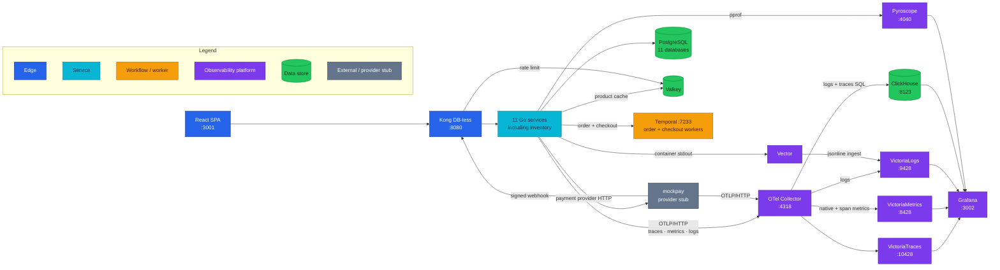

# Local end-to-end verification

`local-stack` is the pre-release verification environment for the duynhlab
application platform: validate the exact source candidate here before creating
an immutable release tag and promoting its image to Kind.

| Attribute | Value |
|-----------|-------|
| **Runtime** | Docker Compose; no Kubernetes cluster required |
| **Purpose** | Full application-path, browser, and telemetry verification before a service or frontend tag |
| **Source under test** | Current checkouts of the sibling service, `pkg`, and frontend repositories |
| **Required gate** | Every Phase A, B, and C row in the [E2E audit](docs/e2e-audit.md) passes |
| **Successful outcome** | Evidence recorded and the tested commit set is eligible for tagging |
| **Next environment** | Local Kind, reconciled by Flux after the released image is pinned in homelab |

`local-stack` proves application integration. Kind remains a separate deployment
gate for Kubernetes admission, NetworkPolicy, TLS, CNPG, secrets, ResourceSet,
and Flux behavior.

## Delivery position


```mermaid
flowchart LR
    Worktree["Candidate source<br/>exact commit set"] --> Compose["Docker Compose<br/>build and readiness"]
    Compose --> Audit["Full E2E audit<br/>Phases A + B + C"]
    Audit --> Decision{"Every row passes?"}
    Decision -->|"FAIL: fix and rebuild"| Worktree
    Decision -->|"PASS"| Tag["Signed vX.Y.Z tag"]
    Tag --> CI["CI test, scan, build,<br/>sign versioned image"]
    CI --> Pin["Pin image in<br/>homelab manifests"]
    Pin --> Validate["make validate"]
    Validate --> Kind["make up / make sync<br/>Flux → Kind"]
    Kind --> Verify["Verify reconciliation,<br/>rollout, and image"]

    subgraph Legend["Legend"]
        LSource["Source / decision"]
        LLocal["Local verification"]
        LRelease["Immutable release"]
        LPlatform["GitOps / Kind"]
    end

    classDef external fill:#64748b,color:#fff,stroke:#334155;
    classDef service fill:#06b6d4,color:#082f49,stroke:#0e7490;
    classDef worker fill:#f59e0b,color:#451a03,stroke:#b45309;
    classDef platform fill:#7c3aed,color:#fff,stroke:#5b21b6;
    class Worktree,Decision,LSource external;
    class Compose,Audit,LLocal service;
    class Tag,CI,LRelease worker;
    class Pin,Validate,Kind,Verify,LPlatform platform;
```

The release tag does **not** deploy to Kind by itself. Current application
delivery uses explicit semver pins; image automation is planned, not active.

## Prerequisites

- Docker with Docker Compose v2.
- All application repositories checked out beside `homelab/`, including the 11
  service repositories, `frontend`, and shared `pkg` repository.
- Enough CPU, memory, and disk to build the full fleet and run its observability
  stack.
- `agent-browser` for the mandatory real-browser phase.

Build contexts resolve sibling repositories such as `../../auth-service` and
`../../frontend`. A missing checkout fails before the application gate starts.

Before a release audit, record the exact candidate commits. If a squash or merge
changes a commit, rerun the audit against the commit that will be tagged.

```bash
for repo in ../../*-service ../../frontend ../../pkg; do
  git -C "$repo" status --short --branch
  git -C "$repo" rev-parse HEAD
done
```

## Quick start

Run from `homelab/local-stack`:

```bash
docker compose up -d --build
docker compose ps
```

The first build compiles the complete application fleet and can take several
minutes. Do not start the audit until required services report `running` or
`healthy` and every migration/seed job has exited successfully.

| Component | URL | Notes |
|-----------|-----|-------|
| Frontend SPA | http://localhost:3001 | Demo login `alice` / `password123`, by username |
| Kong API gateway | http://localhost:8080 | Pass-through edge for the application services |
| Temporal Web UI | http://localhost:8233 | Order and checkout workflows |
| Grafana | http://localhost:3002 | RED, business, Temporal, ClickHouse, and Explore views |
| VictoriaTraces | http://localhost:10428 | Trace storage, Jaeger query API, and vmui |
| VictoriaMetrics | http://localhost:8428 | OTLP/remote-write metrics and PromQL |
| VictoriaLogs | http://localhost:9428 | OTLP and container logs with LogsQL |
| ClickHouse | http://localhost:8123 | SQL over `otel.otel_logs` and `otel.otel_traces` |
| Pyroscope | http://localhost:4040 | Continuous profiling |

PostgreSQL, Valkey, services, workers, and mockpay are internal-only. Reach the
application through Kong unless an audit step explicitly probes a container.

## Architecture

The stack mirrors the application, workflow, edge, and telemetry paths needed
for release verification. It intentionally does not reproduce Kubernetes-only
controls.


```mermaid
flowchart LR
    SPA["React SPA<br/>:3001"] --> KONG["Kong DB-less<br/>:8080"]
    KONG --> SVC["11 Go services<br/>including inventory"]
    SVC -->|"payment provider HTTP"| MP["mockpay<br/>provider stub"]
    MP -->|"signed webhook"| KONG
    SVC --> PG[("PostgreSQL<br/>11 databases")]
    SVC -->|"product cache"| VALKEY[("Valkey")]
    KONG -->|"rate limit"| VALKEY
    SVC -->|"order + checkout"| TMP["Temporal :7233<br/>order + checkout workers"]
    SVC -->|"OTLP/HTTP<br/>traces · metrics · logs"| COL["OTel Collector<br/>:4318"]
    MP -->|"OTLP/HTTP"| COL
    SVC -->|"container stdout"| VEC["Vector"]
    COL --> VT["VictoriaTraces<br/>:10428"]
    COL -->|"native + span metrics"| VM["VictoriaMetrics<br/>:8428"]
    COL -->|"logs"| VL["VictoriaLogs<br/>:9428"]
    COL -->|"logs + traces SQL"| CH[("ClickHouse<br/>:8123")]
    VEC -->|"jsonline ingest"| VL
    VT --> GRAF["Grafana<br/>:3002"]
    VM --> GRAF
    VL --> GRAF
    CH --> GRAF
    SVC -->|"pprof"| PYRO["Pyroscope<br/>:4040"]
    PYRO --> GRAF

    subgraph Legend["Legend"]
        LEdge["Edge"]
        LService["Service"]
        LWorker["Workflow / worker"]
        LPlatform["Observability platform"]
        LData[("Data store")]
        LExternal["External / provider stub"]
    end

    classDef edge fill:#2563eb,color:#fff,stroke:#1e3a8a;
    classDef service fill:#06b6d4,color:#082f49,stroke:#0e7490;
    classDef worker fill:#f59e0b,color:#451a03,stroke:#b45309;
    classDef platform fill:#7c3aed,color:#fff,stroke:#5b21b6;
    classDef data fill:#22c55e,color:#052e16,stroke:#15803d;
    classDef external fill:#64748b,color:#fff,stroke:#334155;
    class SPA,KONG,LEdge edge;
    class SVC,LService service;
    class TMP,LWorker worker;
    class COL,VEC,VT,VM,VL,GRAF,PYRO,LPlatform platform;
    class PG,VALKEY,CH,LData data;
    class MP,LExternal external;
```

For canonical routes, payloads, and service ownership, use
[`docs/api/`](../docs/api/README.md). `local-stack` documentation owns only the
local execution and verification procedure.

## Release gate

Run the [full E2E audit](docs/e2e-audit.md) after the stack is ready. The gate is
mandatory for any change touching a service repository, `pkg`, the frontend,
Kong/gateway configuration, or `compose.yaml`.

The audit always includes:

1. **Phase A — API contract:** authentication, edge enforcement, public/private
   routes, the 11-service path, checkout, saga, idempotency, and abandonment.
2. **Phase B — real browser:** UI login, single-flight silent refresh, and
   server-side logout.
3. **Phase C — telemetry:** collector health, business counters, DB metrics,
   dashboards, traces, and ClickHouse ingestion.

Every row must pass. Record the evidence table and tested commit SHAs before
declaring the candidate eligible for a tag. There are no partial-pass releases.

## Promote a passing candidate to Kind

1. Confirm the commit to tag is exactly the commit recorded in the audit
   evidence. If it differs, rebuild and rerun the full audit.
2. Create and push the signed service or frontend release tag:

   ```bash
   git switch main
   git pull --ff-only origin main
   git tag -s vX.Y.Z -m "Release vX.Y.Z"
   git push origin vX.Y.Z
   ```

3. Wait for release CI to test, scan, build, and sign the immutable `X.Y.Z`
   image. Never pin `latest` or the floating `X.Y` alias.
4. Update the explicit pin in homelab. Service API pins live in
   `kubernetes/apps/services/<service>.yaml`. Keep `checkout-worker` aligned
   with checkout and `mockpay` aligned with payment; frontend has its own pin.
   An order release is different: create a new versioned order-worker manifest,
   deploy it side by side, and activate it through the ADR-030 procedure—never
   retag an existing versioned worker.
5. Validate and reconcile the local Kind environment:

   ```bash
   make validate
   make up       # create/bootstrap Kind when it is not running
   # or: make sync  # publish and reconcile manifests on an existing cluster
   make flux-status
   ```

6. Verify the affected HelmRelease, pod rollout, and exact running image. A Kind
   failure blocks the homelab PR even though the source candidate passed
   `local-stack`.

See [Application Delivery — Promote a validated release to local
Kind](../docs/platform/application-delivery.md#promote-a-validated-release-to-local-kind)
for the authoritative manifest and Flux procedure. The organization-wide
branching target remains documented separately in
[Git Branching & Release](../docs/platform/gitflow.md).

## Operations

### Inspect and rebuild

```bash
docker compose ps
docker compose logs --since 10m <service>
docker compose up -d --build <service>
docker compose up -d --build gateway frontend
```

Rebuilding one service is useful while fixing a failure, but the final release
decision always comes from a fresh full-stack audit.

### Stop or reset

```bash
docker compose down       # stop containers and keep named volumes
docker compose down -v    # delete local data for a clean audit baseline
```

Named volumes contain only local test data and telemetry. Reset before the
release audit when earlier exploratory traffic would make counters or state
ambiguous.

## Environment differences

| Concern | local-stack | Local Kind |
|---------|-------------|------------|
| Runtime | Docker Compose | Kubernetes + Flux Operator |
| Application image | Built from sibling source checkout | Released semver image pinned in manifests |
| Database | One PostgreSQL container, 11 databases | CloudNativePG clusters and poolers |
| Secrets | Inline development values | OpenBAO + External Secrets Operator |
| Network controls | Single Compose network | NetworkPolicy + Kong ingress boundaries |
| Admission | None | Kyverno and PSS policies |
| TLS | Plain HTTP on localhost | Kong TLS using the local `homelab-ca` issuer |
| Telemetry | Local single-node backends | Cluster observability controllers and CRs |

Passing one environment never implies that the other environment passes.

## References

- [E2E release audit](docs/e2e-audit.md)
- [Application delivery](../docs/platform/application-delivery.md)
- [Platform setup](../docs/platform/setup.md)
- [Canonical API contracts](../docs/api/README.md)
- [Observability](../docs/observability/README.md)
- [agent-browser CLI](https://github.com/vercel-labs/agent-browser)

_Last updated: 2026-08-07 — pre-release full A/B/C gate, 11-service inventory,
and explicit semver-to-Kind handoff._
