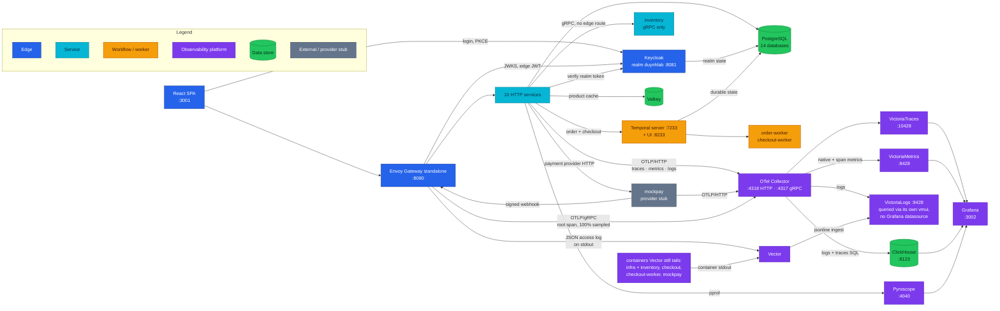

# Local end-to-end verification

`local-stack` is the pre-release verification environment for the duynhlab
application platform: validate the exact source candidate here before creating
an immutable release tag and promoting its image to Kind.

| Attribute | Value |
|-----------|-------|
| **Runtime** | Docker Compose; no Kubernetes cluster required |
| **Purpose** | Full application-path, browser, and telemetry verification before a service or frontend tag |
| **Source under test** | Current checkouts of the sibling service, `pkg`, and frontend repositories |
| **Required gate** | Every required Phase A, B, and C row in the [E2E audit](docs/e2e-audit.md) passes; a row marked conditional there is `N/A` when its trigger is absent |
| **Successful outcome** | Evidence recorded and the tested commit set is eligible for tagging |
| **Next environment** | Local Kind, reconciled by Flux after the released image is pinned in homelab |

`local-stack` proves application integration. Kind remains a separate deployment
gate for Kubernetes admission, NetworkPolicy, TLS, CNPG, secrets, ResourceSet,
and Flux behavior.

## Delivery position


```mermaid
flowchart LR
    Worktree["Candidate source<br/>exact commit set"] --> Compose["Docker Compose<br/>build and readiness"]
    Compose --> Audit["Full E2E audit<br/>Phases A + B + C"]
    Audit --> Decision{"Every row passes?"}
    Decision -->|"FAIL: fix and rebuild"| Worktree
    Decision -->|"PASS"| Tag["Signed vX.Y.Z tag"]
    Tag --> CI["CI test, scan, build,<br/>sign versioned image"]
    CI --> Pin["Pin image in<br/>homelab manifests"]
    Pin --> Validate["make validate"]
    Validate --> Kind["make up / make sync<br/>Flux → Kind"]
    Kind --> Verify["Verify reconciliation,<br/>rollout, and image"]

    subgraph Legend["Legend"]
        LSource["Source / decision"]
        LLocal["Local verification"]
        LRelease["Immutable release"]
        LPlatform["GitOps / Kind"]
    end

    classDef external fill:#64748b,color:#fff,stroke:#334155;
    classDef service fill:#06b6d4,color:#082f49,stroke:#0e7490;
    classDef worker fill:#f59e0b,color:#451a03,stroke:#b45309;
    classDef platform fill:#7c3aed,color:#fff,stroke:#5b21b6;
    class Worktree,Decision,LSource external;
    class Compose,Audit,LLocal service;
    class Tag,CI,LRelease worker;
    class Pin,Validate,Kind,Verify,LPlatform platform;
```

The release tag does **not** deploy to Kind by itself. Current application
delivery uses explicit semver pins; image automation is planned, not active.

## Prerequisites

- Docker with Docker Compose v2. Podman with its compose provider is a supported
  substitute — every command in this document and in the audit is written as
  `docker compose` and works unchanged when podman's socket is exported as
  `DOCKER_HOST`.
- All application repositories checked out beside `homelab/`, including the 11
  service repositories, `frontend`, and shared `pkg` repository.
- Enough CPU, memory, and disk to build the full fleet and run its observability
  stack.
- Outbound internet on the first gateway start: Envoy Gateway standalone fetches
  the Envoy binary at runtime and caches it in a named volume.
- `agent-browser` for the mandatory real-browser phase.

Build contexts resolve sibling repositories such as `../../auth-service` and
`../../frontend`. A missing checkout fails before the application gate starts.

Before a release audit, record the exact candidate commits. If a squash or merge
changes a commit, rerun the audit against the commit that will be tagged.

```bash
for repo in ../../*-service ../../frontend ../../pkg; do
  git -C "$repo" status --short --branch
  git -C "$repo" rev-parse HEAD
done
```

## Quick start

Run from `homelab/local-stack`:

```bash
docker compose up -d --build
docker compose ps
```

The first build compiles the complete application fleet and can take several
minutes. Do not start the audit until every container that declares a healthcheck
reports `healthy`, and every run-once container has exited `0`. The run-once set
is wider than the migrate and seed jobs: `temporal-schema` and
`temporal-bootstrap` also exit `0` and gate the services behind them. Most
observability containers declare no healthcheck at all and only ever show `Up`,
so `running` alone is not evidence of readiness for those — and the `gateway`
container is now one of them (see [Gateway](#gateway)), so probe the edge with
`curl` before starting the audit.

| Component | URL | Notes |
|-----------|-----|-------|
| Frontend SPA | http://localhost:3001 | Demo login `alice` / `password123`, by username, against the realm |
| API gateway (Envoy) | http://localhost:8080 | Pass-through edge for the application services |
| Keycloak | http://localhost:8081 | Realm `duynhlab`; the origin the SPA logs in against and the `iss` in every token |
| Temporal Web UI | http://localhost:8233 | Order and checkout workflows |
| Grafana | http://localhost:3002 | RED, business, Temporal, and ClickHouse dashboards; Explore over VictoriaMetrics, VictoriaTraces, ClickHouse, and Pyroscope |
| VictoriaTraces | http://localhost:10428 | Trace storage, Jaeger query API, and vmui |
| VictoriaMetrics | http://localhost:8428 | OTLP/remote-write metrics and PromQL |
| VictoriaLogs | http://localhost:9428 | OTLP and container logs with LogsQL, through its own vmui — there is no Grafana datasource for it |
| ClickHouse | http://localhost:8123 | SQL over `otel.otel_logs` and `otel.otel_traces`; credentials `default` / `otel` |
| Pyroscope | http://localhost:4040 | Continuous profiling |

PostgreSQL, Valkey, services, workers, and mockpay are internal-only. Reach the
application through the gateway unless an audit step explicitly probes a
container.

Four more ports are published but are not part of the audit surface: Temporal's
frontend gRPC on `7233`, the collector's OTLP-HTTP receiver on `4318` (handy for
a host-side `telemetrygen` smoke test), ClickHouse's native protocol on `9000`,
and the gateway control plane's `/readyz` on `8099`.

## Gateway

The edge is **Envoy Gateway in standalone mode** — one container that runs both
the `envoy-gateway` control plane and, as its child process, the Envoy data
plane. It reads the same Gateway API dialect as the cluster edge from
`gateway/eg/`: `GatewayClass`, `Gateway`, `HTTPRoute`, `SecurityPolicy` (edge JWT
+ CORS), `BackendTrafficPolicy` (local rate limit + 10Mi request buffer). Kong and
its bespoke `kong.yml` are gone; there is no second config dialect to keep in
sync any more.

| Aspect | local-stack | Local Kind |
|--------|-------------|------------|
| Control plane | `envoy-gateway server --config-path` reading files | Envoy Gateway controller watching the Kubernetes API |
| Data plane | one Envoy child process in the same container | `EnvoyProxy`-shaped Deployment, 2 replicas |
| Route backends | `Backend` resources with `fqdn` endpoints (Compose DNS) | Kubernetes `Service` references |
| Listener | one plain-HTTP listener on 8000, published as 8080 | HTTPS on 443 with a wildcard certificate, plus a 301 redirect listener |
| Edge JWT | `remoteJWKS` against `http://keycloak:8080/...`, issuer `http://localhost:8081/realms/duynhlab` | `remoteJWKS` against the in-cluster Service, issuer `https://id.duynh.me/realms/duynhlab` |
| Rate limit | 50/s, one window, one in-process bucket | 2/s + 50/min + 1250/h per replica |

The **one honest divergence** is the backend reference: Compose has no
Kubernetes Services, so HTTPRoutes point at `Backend` resources naming the
compose service (`hostname: cart`, `port: 8080`). Everything else — the route
paths, the JWT provider shape, the policy kinds — is the same YAML the cluster
reconciles.

Two consequences worth knowing before an audit:

- **The gateway container declares no healthcheck.** The upstream image is
  distroless, with no shell and no `wget`/`curl`, so a Compose healthcheck is
  impossible; `frontend` waits on `service_started` and the container only ever
  reports `Up`. Verify the edge yourself with
  `curl -sf http://localhost:8080/product/v1/public/products` before Phase A.
- **A cold start needs outbound internet.** Standalone mode obtains the Envoy
  binary at runtime and caches it in the `envoy-gateway-data` volume, so
  `docker compose down -v` makes the next boot download it again.

Identity is unchanged by the edge swap: the SPA logs in against Keycloak
(`http://localhost:8081`, realm `duynhlab`, keycloak-js PKCE) with the same demo
credentials `alice` / `password123` by username, and both the edge and the
services verify the realm's tokens. For a token in a shell — the audit's Phase A
path — use `scripts/keycloak-token.sh`; the realm's clients have Direct Access
Grants disabled, exactly as in the cluster, so there is no password-grant
shortcut.

## Architecture

The stack mirrors the application, workflow, edge, and telemetry paths needed
for release verification. It intentionally does not reproduce Kubernetes-only
controls.


```mermaid
flowchart LR
    SPA["React SPA<br/>:3001"] --> EDGE["Envoy Gateway standalone<br/>:8080"]
    SPA -->|"login, PKCE"| KC["Keycloak<br/>realm duynhlab :8081"]
    EDGE -->|"JWKS, edge JWT"| KC
    EDGE --> SVC["10 HTTP services"]
    SVC -->|"verify realm token"| KC
    SVC -->|"gRPC, no edge route"| INV["inventory<br/>gRPC only"]
    SVC -->|"payment provider HTTP"| MP["mockpay<br/>provider stub"]
    MP -->|"signed webhook"| EDGE
    SVC --> PG[("PostgreSQL<br/>14 databases")]
    KC -->|"realm state"| PG
    SVC -->|"product cache"| VALKEY[("Valkey")]
    SVC -->|"order + checkout"| TMP["Temporal server :7233<br/>+ UI :8233"]
    TMP -->|"durable state"| PG
    TMP --> OW["order-worker<br/>checkout-worker"]
    SVC -->|"OTLP/HTTP<br/>traces · metrics · logs"| COL["OTel Collector<br/>:4318 HTTP · :4317 gRPC"]
    MP -->|"OTLP/HTTP"| COL
    EDGE -->|"OTLP/gRPC<br/>root span, 100% sampled"| COL
    EDGE -->|"JSON access log<br/>on stdout"| VEC
    TAILED["containers Vector still tails:<br/>infra + inventory, checkout,<br/>checkout-worker, mockpay"] -->|"container stdout"| VEC["Vector"]
    COL --> VT["VictoriaTraces<br/>:10428"]
    COL -->|"native + span metrics"| VM["VictoriaMetrics<br/>:8428"]
    COL -->|"logs"| VL["VictoriaLogs :9428<br/>queried via its own vmui,<br/>no Grafana datasource"]
    COL -->|"logs + traces SQL"| CH[("ClickHouse<br/>:8123")]
    VEC -->|"jsonline ingest"| VL
    VT --> GRAF["Grafana<br/>:3002"]
    VM --> GRAF
    CH --> GRAF
    SVC -->|"pprof"| PYRO["Pyroscope<br/>:4040"]
    PYRO --> GRAF

    subgraph Legend["Legend"]
        LEdge["Edge"]
        LService["Service"]
        LWorker["Workflow / worker"]
        LPlatform["Observability platform"]
        LData[("Data store")]
        LExternal["External / provider stub"]
    end

    classDef edge fill:#2563eb,color:#fff,stroke:#1e3a8a;
    classDef service fill:#06b6d4,color:#082f49,stroke:#0e7490;
    classDef worker fill:#f59e0b,color:#451a03,stroke:#b45309;
    classDef platform fill:#7c3aed,color:#fff,stroke:#5b21b6;
    classDef data fill:#22c55e,color:#052e16,stroke:#15803d;
    classDef external fill:#64748b,color:#fff,stroke:#334155;
    class SPA,EDGE,KC,LEdge edge;
    class SVC,INV,LService service;
    class TMP,OW,LWorker worker;
    class COL,VEC,TAILED,VT,VM,VL,GRAF,PYRO,LPlatform platform;
    class PG,VALKEY,CH,LData data;
    class MP,LExternal external;
```

For canonical routes, payloads, and service ownership, use
[`docs/api/`](../docs/api/README.md). `local-stack` documentation owns only the
local execution and verification procedure.

## Release gate

Run the [full E2E audit](docs/e2e-audit.md) after the stack is ready. The gate is
mandatory for any change touching a service repository, `pkg`, the frontend,
gateway/edge configuration (`gateway/eg/` here or
`kubernetes/infra/configs/envoy-gateway/` in the cluster), the realm
(`keycloak/duynhlab-realm.json`), or `compose.yaml`.

The audit always includes:

1. **Phase A — API contract:** authentication, edge enforcement, public/private
   routes, the 11-service path, checkout, saga, idempotency, abandonment,
   cancellation unwind, and Temporal durability across a server restart. Every
   `temporal ...` command in the audit runs inside `temporal-admintools`, because
   the `temporalio/server` image ships no client binary.
2. **Phase B — real browser:** UI login, single-flight silent refresh, and
   server-side logout.
3. **Phase C — telemetry:** collector health, business counters, DB metrics,
   dashboards, traces, and ClickHouse ingestion.

Every required row must pass. One row is conditional — the Worker Deployment
Versioning drill, which applies when a change touches versioning, the saga's
activity set, or the rollout runbook — and is recorded `N/A` when its trigger is
absent. Record the evidence table and tested commit SHAs before declaring the
candidate eligible for a tag. A failed row is never a partial pass.

## Promote a passing candidate to Kind

1. Confirm the commit to tag is exactly the commit recorded in the audit
   evidence. If it differs, rebuild and rerun the full audit.
2. Create and push the signed service or frontend release tag:

   ```bash
   git switch main
   git pull --ff-only origin main
   git tag -s vX.Y.Z -m "Release vX.Y.Z"
   git push origin vX.Y.Z
   ```

3. Wait for release CI to test, scan, build, and sign the immutable `X.Y.Z`
   image. Never pin `latest` or the floating `X.Y` alias.
4. Update the explicit pin in homelab. Service API pins live in
   `kubernetes/apps/services/<service>.yaml`. Keep `checkout-worker` aligned
   with checkout and `mockpay` aligned with payment; frontend has its own pin.
   An order release is different: create a new versioned order-worker manifest,
   deploy it side by side, and activate it through the ADR-030 procedure—never
   retag an existing versioned worker.
5. Validate and reconcile the local Kind environment:

   ```bash
   make validate
   make up       # create/bootstrap Kind when it is not running
   # or: make sync  # publish and reconcile manifests on an existing cluster
   make flux-status
   ```

6. Verify the affected HelmRelease, pod rollout, and exact running image. A Kind
   failure blocks the homelab PR even though the source candidate passed
   `local-stack`.

See [Application Delivery — Promote a validated release to local
Kind](../docs/platform/application-delivery.md#promote-a-validated-release-to-local-kind)
for the authoritative manifest and Flux procedure. The organization-wide
branching target remains documented separately in
[Git Branching & Release](../docs/platform/gitflow.md).

## Operations

### Inspect and rebuild

```bash
docker compose ps
docker compose logs --since 10m <service>
docker compose up -d --build <service>
docker compose up -d --build gateway frontend
```

Rebuilding one service is useful while fixing a failure, but the final release
decision always comes from a fresh full-stack audit.

### Stop or reset

```bash
docker compose down       # stop containers and keep named volumes
docker compose down -v    # delete local data for a clean audit baseline
```

Named volumes contain only local test data and telemetry. Reset before the
release audit when earlier exploratory traffic would make counters or state
ambiguous.

## Environment differences

| Concern | local-stack | Local Kind |
|---------|-------------|------------|
| Runtime | Docker Compose | Kubernetes + Flux Operator |
| Application image | Built from sibling source checkout | Released semver image pinned in manifests |
| Database | One PostgreSQL container, 14 databases (including Keycloak's) | CloudNativePG clusters and poolers |
| Temporal | `temporalio/server` on that PostgreSQL, all roles in one container, `numHistoryShards: 4` | Official Helm chart, four role Deployments, `numHistoryShards: 512` |
| Secrets | Inline development values | OpenBAO + External Secrets Operator |
| Network controls | Single Compose network | NetworkPolicy + Gateway route boundaries |
| Admission | None | Kyverno and PSS policies |
| TLS | Plain HTTP on localhost | Gateway TLS termination using the local `homelab-ca` issuer |
| Edge | Envoy Gateway standalone, one container, file-driven | Envoy Gateway controller + `EnvoyProxy` Deployment reconciled by Flux |
| Telemetry | Local single-node backends; the edge samples every request (100%) and its access log is unfiltered, so a failed audit row is diagnosable | Cluster observability controllers and CRs; the edge samples 10% and a CEL filter drops successful probe access logs at source |

Passing one environment never implies that the other environment passes.

## References

- [E2E release audit](docs/e2e-audit.md)
- [Application delivery](../docs/platform/application-delivery.md)
- [Platform setup](../docs/platform/setup.md)
- [Canonical API contracts](../docs/api/README.md)
- [Observability](../docs/observability/README.md)
- [agent-browser CLI](https://github.com/vercel-labs/agent-browser)

_Last updated: 2026-08-12 — the edge is Envoy Gateway in standalone mode reading
the cluster's Gateway API dialect from `gateway/eg/` (Kong and `kong.yml` are
deleted): adds the Gateway section with the cluster comparison, the `Backend`-vs-
`Service` divergence, the missing healthcheck and the cold-start download, the
Keycloak row and `scripts/keycloak-token.sh`, and the fourth non-audit port._
