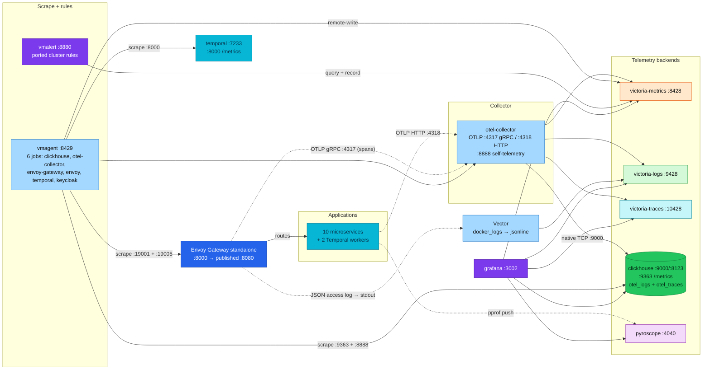

# Local-stack observability — engine health & the alert loop

> The local telemetry plane, what it answers, and how the engine-health slice
> (scrape → rules → dashboard) mirrors the cluster so an alert expression is
> exercised here before it matters there.

| Item | Value |
|---|---|
| **Scope** | `local-stack/` (Docker Compose) — telemetry plane only |
| **Reference stack** | `kubernetes/` (source of truth for signal shape) |
| **Design records** | [RFC-0014](../../docs/proposals/rfc/RFC-0014/), [RFC-0019](../../docs/proposals/rfc/RFC-0019/), [ADR-023](../../docs/proposals/adr/ADR-023-clickhouse-observability-olap/) |
| **In-repo docs** | [`docs/observability/README.md`](../../docs/observability/README.md), [`docs/observability/clickhouse/README.md`](../../docs/observability/clickhouse/README.md), [`local-stack/README.md`](../README.md), [`e2e-audit.md`](e2e-audit.md) |
| **Status** | Data-plane telemetry ✅ · Engine scrape + alert loop ✅ · Alert routing ❌ (deliberate — see Non-goals) |
| **Owner** | Platform |

## 1. Why this doc exists

The local stack was shaped as an **API/data-plane** e2e environment first; the
**operability** half arrived later and drifts differently. Three loops used to
be open, and each one bit silently:

- A dashboard added in the cluster tree never got a local counterpart, so
  Grafana parity rotted one board at a time.
- An alert expression shipped with a metric name that no scrape had ever
  produced — nothing local could disprove it before the cluster.
- No series said "the backend itself is down": the backends only *received*
  telemetry, nobody *observed* them.

The ClickHouse slice closes all three: the server's own Prometheus endpoint is
scraped, the cluster's alert catalog is ported (same alert names, local series),
and one dual-target dashboard serves both stacks. The same shape generalises to
any future backend.

## 2. Current architecture



Every signal has a home, and the collector fan-out matches the cluster
(`victorialogs`, `victoriatraces`, `victoriametrics`, `clickhouse`, `debug`).
The edge is a first-class span producer (its `ingress` span is the trace root —
audit C2/C3) and contributes its JSON access log through Vector (C13). The
scrape column is what makes `up` a real signal here: without it, a dead backend
only ever showed up as somebody else's export failures. Six static jobs cover
the engines that cannot push: ClickHouse (`:9363`), the collector's
self-telemetry (`:8888`), both halves of the edge (`:19001` control plane,
`:19005` `/stats/prometheus` data plane), the Temporal server (`:8000`,
the listener `PROMETHEUS_ENDPOINT` enables in `compose.yaml`) — which is what
lets this stack validate the cluster's three server-side Temporal alerts — and
Keycloak's management interface (`:9000`), which does the same for the
Keycloak alert set.

## 3. Cluster vs local-stack — component parity matrix

| Component / signal | Cluster | local-stack | Note |
|---|---|---|---|
| OTel Collector fan-out (M/L/T + CH) | ✅ | ✅ | identical pipelines |
| VictoriaMetrics | ✅ (operator) | ✅ (singleton) | — |
| VictoriaLogs | ✅ | ✅ | — |
| VictoriaTraces | ✅ (pilot) | ✅ | — |
| Vector | ✅ (DaemonSet, pod stdout) | ✅ (`docker_logs` source) | same sink, different tailer |
| Tempo | ✅ | ❌ | intentional; VictoriaTraces is the local surrogate |
| Pyroscope | ✅ | ✅ | — |
| Grafana | ✅ (operator) | ✅ (image) | — |
| Scrape (`vmagent`) | via VM-operator CRs | ✅ static config | `observability/vmagent/prometheus.yml` |
| Rule evaluation (`vmalert`) | ✅ (PrometheusRule) | ✅ file-mounted rules | `observability/vmalert/rules/` |
| Alert routing (`alertmanager`) | ✅ | ❌ | deliberate — see Non-goals |
| ClickHouse operator (Altinity 0.27.3) | ✅ | N/A | Compose runs the server only |
| Operator metrics (`clickhouse_operator_*`) | ✅ `:8888/metrics` | N/A | cannot exist locally |
| Metrics-exporter (`chi_clickhouse_*`) | ✅ `:8888/chi` | N/A | cannot exist locally |
| Server built-in `/metrics` (`ClickHouseMetrics_*` …) | ✅ `:9363`, PodMonitor per replica (RFC-0028) | ✅ `:9363` | local was first; the cluster followed when three replicas made per-pod series necessary — see §5 |
| Collector self-scrape (`otelcol_*`) | ✅ ServiceMonitor | ✅ vmagent job | identical series names; local board `otel-collector-health-local` |
| Edge scrape (`envoy_*` + control plane) | ✅ ServiceMonitor + PodMonitor | ✅ vmagent jobs `envoy-gateway` + `envoy` | data plane via the bootstrap-merged `:19005` listener |
| Temporal server metrics (`service_*`, `persistence_*`) | ✅ 4 chart ServiceMonitors | ✅ vmagent job `temporal` (`:8000`) | enabled by `PROMETHEUS_ENDPOINT` in compose; validates the 3 server alerts |
| Temporal SDK metrics (`temporal_*`) | ✅ OTLP push | ✅ OTLP push | same pipeline as every app metric |
| VictoriaLogs Grafana datasource | ✅ | ✅ | `victoriametrics-logs-datasource` 0.29.0 both stacks, uid `victorialogs` |
| ClickHouse alerts | ✅ `clickhouse-alerts.yaml` (12 rules) | ✅ ported subset (11 rules) | same names; two operator rules have no local counterpart |
| `clickhouse-server-engine` dashboard | ✅ | ✅ | **one dual-target JSON serves both** |
| 5 OTel data-plane CH dashboards | ✅ | ✅ | — |
| RED spanmetrics / business dashboards | ✅ | ✅ | — |
| Envoy dashboards (3 of 4) | ✅ (envoyproxy/gateway v1.9.0) | ✅ same tag, Gateway folder | `resources-monitor` is cluster-only (cAdvisor series) |
| Temporal dashboard | ✅ `temporal.json` (uid `temporal-worker`) | ✅ `temporal-local.json` (uid `temporal-worker-local`) | generated from one panel set; SDK + Server rows |
| KEDA dashboard (ADR-055) | ✅ `keda.json` (uid `keda`) | — no twin, by design | compose runs no KEDA, so a twin would be a board with no series; cluster-only is the documented exception, not parity rot |
| Inventory + Cutover Baseline boards (`inventory`, `rfc0021-baseline` — RFC-0021-era) | ✅ | ✅ local copies + vendored recording rules | `app=` → `service_name=` rewrite, see rule file headers |
| Keycloak metrics scrape (`up{job="keycloak"}`, `keycloak_user_events_total`, agroal, http SLO buckets) | ✅ ServiceMonitor (management :9000) | ✅ vmagent job `keycloak` (:9000) | same job name + labels both stacks — no rewrite |
| Keycloak alerts | ✅ PrometheusRule (5 rules) | ✅ ported subset (`keycloak.yaml`, 4 rules) | KeycloakRestartLoop is kube-state-only, cluster-only |
| Keycloak — Identity board | ✅ (`keycloak-identity.json` CR) | ✅ `keycloak-identity-local.json` | same uid `keycloak-identity`, same queries (scrape labels identical) |
| OTel Collector health board | ❌ (gap — collector alerts have no cluster board) | ✅ `otel-collector-health-local` | local-first; promote to the cluster when wanted |

## 4. Signal map — what each backend answers

| Question | Datasource | Source | Shape |
|---|---|---|---|
| Which service is slow / erroring? | VictoriaMetrics | `spanmetrics` connector | identical both stacks |
| Where did a request go? | VictoriaTraces | `otlphttp/victoriatraces` | identical |
| Full-text log search / correlation | VictoriaLogs | `otlphttp/victorialogs` + Vector | identical sink; edge contributes access logs via Vector only |
| Long-retention SQL over logs+traces | ClickHouse | `clickhouse` exporter | **schema owner differs**: local keeps `create_schema: true` (single node, no race to have); the cluster runs `create_schema: false` with a bootstrap Job owning the DDL — RFC-0028. Same tables either way |
| Continuous profiles | Pyroscope | pushed by services | identical |
| Is the collector / ClickHouse itself up? | VictoriaMetrics | **vmagent scrape** | cluster: operator CRs · local: static config |
| Are inserts / merges / disk failing? | VictoriaMetrics | ClickHouse `:9363` (both, per-pod on the cluster since RFC-0028) / metrics-exporter (cluster) | same alert names, different series — §5 |

## 5. The engine-health slice, as built

### 5A. ClickHouse's built-in Prometheus endpoint

`observability/clickhouse/metrics.xml`, mounted into `config.d/`, opens
`:9363/metrics` with four families:

| Family | Source | Examples |
|---|---|---|
| `ClickHouseMetrics_*` | `system.metrics` (gauges) | `_Query`, `_PartsActive`, `_MemoryTracking`, `_TCPConnection` |
| `ClickHouseProfileEvents_*` | `system.events` (counters) | `_InsertedRows`, `_FailedInsertQuery`, `_RejectedInserts`, `_DelayedInserts`, `_FailedMerges` |
| `ClickHouseAsyncMetrics_*` | `system.asynchronous_metrics` | `_Uptime`, `_DiskAvailable_default`, `_DiskTotal_default` |
| `ClickHouseErrorMetric_*` | `system.errors` (per error name) | `_UNKNOWN_TABLE`, … |

The key set (`metrics` / `events` / `asynchronous_metrics` / `errors`) matches
the current server's supported options — `status_info` no longer exists and
must not be re-added. `errors` is load-bearing: it is what lets the cluster's
`ClickHouseServerErrorsElevated` rule map locally.

The cluster did not enable this endpoint while it ran one shard × one replica —
the Altinity exporter's `/chi` carried the engine signals and a second scrape
would only have duplicated them. RFC-0028 changed that: with three replicas the
per-pod series are what say *which* replica is sick, and
`ClickHouseMetrics_ReadonlyReplica` has no equivalent in the exporter's view at
all, so the cluster now scrapes the same endpoint through
`podmonitors/clickhouse-server.yaml`
([clickhouse hub § Metrics & alerting](../../docs/observability/clickhouse/README.md#metrics--alerting)).
Locally there is still no operator, so this endpoint **is** the engine view —
and local-stack stays single-node with no keeper, a deliberate divergence.

### 5B. vmagent + vmalert

Two Compose services on the local VM pin (`v1.150.0` — ahead of the cluster's
operator default `v1.148.0`; see the skew note in
[`docs/observability/README.md`](../../docs/observability/README.md)):

- **vmagent** (`:8429`) scrapes six jobs — `clickhouse:9363`,
  `otel-collector:8888`, the edge's two halves (`gateway:19001`,
  `gateway:19005/stats/prometheus`), `temporal:8000`, and `keycloak:9000`
  (management interface: keycloak_user_events_total, agroal_*,
  http_server_requests_seconds_*) — and remote-writes
  into VictoriaMetrics. It does **not** scrape the application services —
  their metrics arrive over OTLP (RFC-0014 P3), and scraping them too would
  double-ingest.
- **vmalert** (`:8880`) evaluates the rule files under
  `observability/vmalert/rules/` against VictoriaMetrics. No notifier: the
  UI/API is the validation surface.

### 5C. Alert rules — cluster ↔ local mapping

Same alert **names** as the merged cluster catalog
(`kubernetes/infra/configs/observability/metrics/prometheusrules/observability/clickhouse-alerts.yaml`,
[alert-catalog § 8b](../../docs/observability/alerting/alert-catalog.md#8b-clickhouse-otel-olap-engine)),
so a runbook practised locally transfers. Different series by design:

| Alert (cluster name) | Cluster expr (chi_*) | Local expr |
|---|---|---|
| ClickHouseServerUnreachable | exporter `fetch_errors > 0` | `up{job="clickhouse"} == 0` — locally `up` is a genuine server scrape |
| ClickHouseDiskAlmostFull / Critical | `chi_clickhouse_metric_DiskFreeBytes / (DiskDataBytes + DiskFreeBytes)` | `ClickHouseAsyncMetrics_DiskAvailable_default / DiskTotal_default` |
| ClickHouseTooManyParts | `chi_clickhouse_metric_PartsActive > 300` | `ClickHouseMetrics_PartsActive > 300` |
| ClickHouseInsertsRejected | `chi_clickhouse_event_RejectedInserts` | `ClickHouseProfileEvents_RejectedInserts` |
| ClickHouseInsertsFailing | `chi_clickhouse_event_FailedInsertQuery` | `ClickHouseProfileEvents_FailedInsertQuery` |
| ClickHouseMergesFailing | `chi_clickhouse_event_FailedMerges` | `ClickHouseProfileEvents_FailedMerges` |
| ClickHouseInsertsDelayed | `chi_clickhouse_event_DelayedInserts` | `ClickHouseProfileEvents_DelayedInserts` |
| ClickHouseServerErrorsElevated | `chi_clickhouse_system_errors_value` | `{__name__=~"ClickHouseErrorMetric_.+"}` |
| ClickHouseExporterUnhealthy | `otelcol_exporter_send_failed_*{exporter="clickhouse"}` | **identical** |
| OtelCollectorDown | `up{job=~".*otel-collector.*"}` | `up{job="otel-collector"}` |
| ClickHouseOperatorDown / ReconcileErrors | operator series | **absent** — no operator in Compose |

Beyond the ClickHouse slice, `rules/` also carries the vendored RFC-0021
recording rules (`rfc0021-baseline.yaml`, `inventory.yaml` — 15 recording +
3 inventory alerting rules) so the Inventory and Cutover Baseline dashboards render locally,
and the keycloak rules (`keycloak.yaml` — 4 alerting: KeycloakDown + the three
identity KPI alerts; no label rewrite needed, the `keycloak` scrape job is
identical on both stacks);
they materialize because vmalert runs with `-remoteWrite.url`. One mechanical
rewrite applies: cluster series carry an `app` label, the local OTLP path
promotes `service_name` — every `app=` matcher became `service_name=` (see
the rule file headers).

### 5D. Dashboard — one JSON, both stacks

`clickhouse-server-engine.json` is **dual-target**: every engine panel carries
the cluster query (`chi_*`) and the local query (`ClickHouseMetrics_*` family)
side by side; exactly one resolves per stack, so the same file is committed at
both paths:

```
kubernetes/infra/configs/observability/grafana/dashboards/clickhouse-server-engine.json
local-stack/observability/grafana/dashboards/clickhouse/clickhouse-server-engine.json
```

The generator lives at the platform side; regenerate and copy rather than
editing either JSON by hand. The operator-reconciles panel is cluster-only by
design and says so in its title. (A single-target copy was considered and
rejected: all 24 of the original panel series were exporter-shaped, so a plain
copy rendered a fully empty board locally.)

#### Gateway-folder boards — local divergences

The three `Gateway/` boards are the upstream `envoyproxy/gateway` v1.9.0
dashboards (same tag the cluster vendors). Three local-only edits, re-applied
on every re-vendor because JSON carries no comments:

- datasource variable `current` pinned to the local `victoriametrics` uid
  (upstream ships an authoring-instance uid that resolves nowhere here);
- `envoy-gateway-global.json`'s `Namespace` variable opened up
  (`includeAll` + `allValue: .*`) — upstream pins `envoy-gateway-system`,
  a label that does not exist on Compose series;
- `envoy-clusters.json`'s two `kube_pod_container_resource_limits` secondary
  targets stripped (no kube-state-metrics in Compose).

### 5E. Provisioning

None needed — `provisioning/dashboards/dashboards.yaml` already loads every
JSON under `dashboards/`, and the datasource uid `victoriametrics` is the same
in both stacks.

## 6. Operations

| Task | Command |
|---|---|
| Confirm all six scrape targets are up | `curl -s http://localhost:8429/api/v1/targets \| jq '[.data.activeTargets[] \| {job:.labels.job,health}]'` |
| List loaded/firing alerts | `curl -s http://localhost:8880/api/v1/alerts \| jq '.data.alerts[] \| {name:.labels.alertname,state}'` |
| Rehearse `ClickHouseServerUnreachable` | `docker compose stop clickhouse` → firing within ~5m → `docker compose start clickhouse` |
| Rehearse `ClickHouseExporterUnhealthy` | `docker compose pause clickhouse` → collector `send_failed_*` climbs → `unpause` |
| Explore engine metrics | Grafana → Explore → VictoriaMetrics → `ClickHouseMetrics_Query`, `ClickHouseProfileEvents_InsertedRows`, `ClickHouseAsyncMetrics_Uptime` |
| Engine dashboard | Grafana → ClickHouse folder → **ClickHouse Server / Engine** (local series carry the `(local)` legend suffix) |

The release audit asserts this slice: **C20** (vmagent: both targets `up`) and
**C21** (vmalert: rules loaded, none firing) in [e2e-audit.md](e2e-audit.md).
Any change to this slice touches `compose.yaml`, which per AGENTS.md means the
full audit runs before the change merges.

## 7. Non-goals

- **No Altinity operator locally** — the point of Compose is server-only; the
  operator's control plane is exercised on Kind.
- **No alertmanager yet** — vmalert's UI/API is enough to validate expressions.
  Add routing the day a Slack/webhook rehearsal is worth its weight locally.
- **No scraping of application services** — their metrics arrive over OTLP;
  a scrape would double-ingest (RFC-0014 P3).
- **No second dashboard fork** — the dual-target JSON is the parity mechanism;
  do not hand-edit one copy.

## 8. Cluster ↔ local-stack parity — quick lookup

| Layer | Cluster path | local-stack path |
|---|---|---|
| Grafana dashboards | `kubernetes/infra/configs/observability/grafana/dashboards/*.json` | `local-stack/observability/grafana/dashboards/{ClickHouse,Gateway,Observability}/*.json` |
| Datasources | `kubernetes/infra/configs/observability/grafana/datasource-*.yaml` | `local-stack/observability/grafana/provisioning/datasources/*.yaml` |
| Alert rules | `…/metrics/prometheusrules/**/*.yaml` (PrometheusRule CRs) | `local-stack/observability/vmalert/rules/*.yaml` |
| Scrape config | `…/metrics/{servicemonitors,podmonitors}/*.yaml` | `local-stack/observability/vmagent/prometheus.yml` |
| Collector config | `kubernetes/infra/controllers/tracing/otel-collector/otel-collector.yaml` | `local-stack/observability/otel-collector-config.yaml` |
| Engine metrics source | Altinity exporter `/chi` (operator chart) | `observability/clickhouse/metrics.xml` (`:9363`) |

## 9. References

- [`docs/observability/README.md`](../../docs/observability/README.md) ·
  [`docs/observability/clickhouse/README.md`](../../docs/observability/clickhouse/README.md) ·
  [`docs/observability/alerting/alert-catalog.md`](../../docs/observability/alerting/alert-catalog.md) ·
  [`docs/observability/opentelemetry/collector.md`](../../docs/observability/opentelemetry/collector.md)
- [`RFC-0019`](../../docs/proposals/rfc/RFC-0019/) ·
  [`ADR-023`](../../docs/proposals/adr/ADR-023-clickhouse-observability-olap/)
- [`local-stack/README.md`](../README.md) · [`e2e-audit.md`](e2e-audit.md)

_Last updated: 2026-08-18 — temporal server scrape, VictoriaLogs datasource,
collector-health + RFC-0021 boards, Gateway-board divergences recorded;
previously 2026-08-13 — engine-health slice shipped (metrics.xml, vmagent,
vmalert, ported rules, dual-target dashboard, audit rows C20/C21)._
