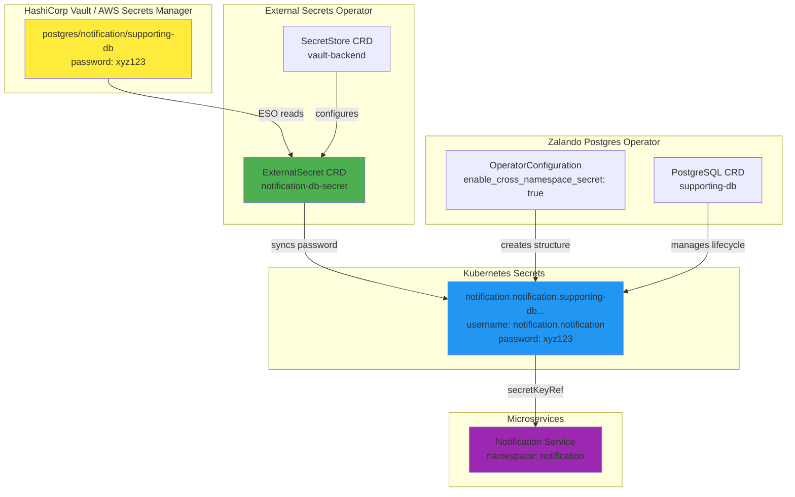

# Feature: External Secrets Operator Integration with Zalando Postgres Operator

**Task ID:** Zalando-operator  
**Feature Type:** Future Enhancement  
**Status:** Planned  
**Priority:** Low  
**Date Created:** 2025-12-26  
**Version:** 1.0

---

## Overview

This document describes the planned integration of External Secrets Operator (ESO) with Zalando Postgres Operator for centralized secret management. This feature will enable password rotation from HashiCorp Vault or AWS Secrets Manager while maintaining compatibility with Zalando's native secret creation.

**Current State:**
- Zalando operator creates Kubernetes secrets automatically
- Secrets follow standard naming: `{namespace}.{username}.{cluster}.credentials.postgresql.acid.zalan.do`
- No external secret management integration

**Target State:**
- External Secrets Operator syncs passwords from Vault/AWS Secrets Manager
- Zalando operator continues managing secret structure and lifecycle
- Automatic password rotation from external secret stores
- Zero-downtime password updates

---

## Motivation

### Business Drivers

1. **Compliance Requirements**: Centralized secret management for audit trails
2. **Password Rotation**: Automated password rotation from Vault/AWS Secrets Manager
3. **Multi-Environment**: Consistent secret management across dev/staging/prod
4. **Security**: Reduce secret sprawl, centralized access control

### Technical Drivers

1. **Integration**: Leverage existing Vault infrastructure
2. **Automation**: Reduce manual password rotation overhead
3. **Observability**: Centralized secret access logging
4. **Scalability**: Support for hundreds of database clusters

---

## Architecture

### Pattern: Hybrid Approach (Recommended)

**Architecture Flow:**

```
Vault/AWS Secrets Manager
    ↓
External Secrets Operator (ESO)
    ↓ (syncs password)
Kubernetes Secret (Zalando format)
    ↓ (created by Zalando operator)
Service Pods (via secretKeyRef)
```

**Key Components:**

1. **Zalando Postgres Operator**: Creates secret structure, manages lifecycle
2. **External Secrets Operator**: Syncs passwords from Vault, updates K8s secrets
3. **HashiCorp Vault / AWS Secrets Manager**: Source of truth for passwords
4. **Kubernetes Secrets**: Standard K8s secrets consumed by services

### Architecture Diagram



---

## Integration Patterns

### Pattern 1: ESO Sync Zalando Secrets (Recommended)

**How it works:**
1. Zalando operator creates secret structure in target namespace
2. External Secrets Operator syncs password from Vault to existing secret
3. Services consume updated secret (no changes needed)

**Configuration:**

```yaml
# ExternalSecret CRD - Syncs password from Vault
apiVersion: external-secrets.io/v1beta1
kind: ExternalSecret
metadata:
  name: notification-db-secret
  namespace: notification
spec:
  secretStoreRef:
    name: vault-backend
    kind: SecretStore
  target:
    name: notification.notification.supporting-db.credentials.postgresql.acid.zalan.do
    creationPolicy: Merge  # Merge with Zalando-generated secret
    template:
      type: Opaque
      data:
        username: "{{ .username }}"  # Keep Zalando-generated username
  data:
  - secretKey: password
    remoteRef:
      key: postgres/notification/supporting-db
      property: password
```

**Pros:**
- ✅ Zalando operator manages secret structure and lifecycle
- ✅ ESO handles Vault sync and rotation
- ✅ No changes to Zalando operator configuration
- ✅ Services continue using standard `secretKeyRef`
- ✅ Gradual migration path (can enable per-cluster)

**Cons:**
- ⚠️ Requires External Secrets Operator installation
- ⚠️ Need to configure Vault backend and secret paths
- ⚠️ Two operators managing same secrets (coordination needed)

**Best for:** Password rotation from Vault, centralized secret management

---

### Pattern 2: ESO Create Secrets → Zalando References

**How it works:**
1. External Secrets Operator creates secrets from Vault
2. Zalando operator references pre-existing secrets (infrastructure roles)
3. Zalando operator uses Vault-managed passwords

**Configuration:**

```yaml
# ExternalSecret creates secret from Vault
apiVersion: external-secrets.io/v1beta1
kind: ExternalSecret
metadata:
  name: notification-db-secret
  namespace: notification
spec:
  secretStoreRef:
    name: vault-backend
  target:
    name: notification.notification.supporting-db.credentials.postgresql.acid.zalan.do
  data:
  - secretKey: username
    remoteRef:
      key: postgres/notification/supporting-db
      property: username
  - secretKey: password
    remoteRef:
      key: postgres/notification/supporting-db
      property: password

# Zalando operator references pre-existing secret
apiVersion: "acid.zalan.do/v1"
kind: OperatorConfiguration
metadata:
  name: postgresql-operator-configuration
configuration:
  kubernetes:
    enable_cross_namespace_secret: true
    infrastructure_roles_secrets:
    - secretname: "notification.notification.supporting-db.credentials.postgresql.acid.zalan.do"
      userkey: "username"
      passwordkey: "password"
```

**Pros:**
- ✅ Full control over secret source (Vault)
- ✅ Zalando operator uses Vault-managed passwords
- ✅ No password generation by Zalando operator

**Cons:**
- ❌ More complex setup
- ❌ Requires infrastructure roles configuration
- ❌ Not suitable for manifest roles (Zalando generates passwords)
- ❌ Limited to infrastructure roles only

**Best for:** Infrastructure roles, monitoring users, centralized password management

---

### Pattern 3: Custom Secret Name Template (Advanced)

**How it works:**
1. Customize Zalando `secret_name_template` to match ESO naming conventions
2. ESO creates secrets with custom names
3. Zalando operator references ESO-created secrets

**Configuration:**

```yaml
# Custom secret name template in Zalando operator
apiVersion: "acid.zalan.do/v1"
kind: OperatorConfiguration
metadata:
  name: postgresql-operator-configuration
configuration:
  kubernetes:
    enable_cross_namespace_secret: true
    secret_name_template: "{namespace}/{username}-{cluster}-db-credentials"

# ExternalSecret creates secret with matching name
apiVersion: external-secrets.io/v1beta1
kind: ExternalSecret
metadata:
  name: notification-db-secret
  namespace: notification
spec:
  secretStoreRef:
    name: vault-backend
  target:
    name: notification/notification-supporting-db-db-credentials
  data:
  - secretKey: username
    remoteRef:
      key: postgres/notification/supporting-db
      property: username
  - secretKey: password
    remoteRef:
      key: postgres/notification/supporting-db
      property: password
```

**Pros:**
- ✅ Full control over secret naming
- ✅ Matches ESO naming conventions
- ✅ Flexible integration patterns

**Cons:**
- ❌ Requires custom template configuration
- ❌ Global setting (affects all clusters)
- ❌ More complex migration path
- ❌ Breaks standard Zalando naming convention

**Best for:** Organizations with strict naming conventions, complex multi-tenant setups

---

## Comparison Matrix

| Criteria | Pattern 1: ESO Sync Zalando | Pattern 2: ESO Create for Zalando | Pattern 3: Custom Template |
|----------|----------------------------|-----------------------------------|---------------------------|
| **Secret Creation** | Zalando operator | External Secrets Operator | External Secrets Operator |
| **Secret Sync** | External Secrets Operator | N/A (ESO creates) | N/A (ESO creates) |
| **Password Source** | Vault (via ESO sync) | Vault (via ESO) | Vault (via ESO) |
| **Zalando Role Types** | All (manifest + infrastructure) | Infrastructure only | All (with custom template) |
| **Setup Complexity** | Medium | High | High |
| **Password Rotation** | ✅ Automatic from Vault | ✅ Automatic from Vault | ✅ Automatic from Vault |
| **Secret Lifecycle** | Zalando manages structure | ESO manages everything | ESO manages everything |
| **Migration Path** | ✅ Easy (add ESO later) | ❌ Complex (change Zalando config) | ❌ Complex (change template) |
| **Naming Convention** | Standard Zalando format | Standard Zalando format | Custom format |
| **Best For** | **Password rotation, compliance** | Infrastructure roles | Custom naming requirements |

**Recommendation:** **Pattern 1 (ESO Sync Zalando)** - Easiest migration path, maintains Zalando operator benefits, supports all role types.

---

## Implementation Plan

### Phase 1: Prerequisites (1-2 days)

**Tasks:**
1. Install External Secrets Operator via Helm
2. Configure SecretStore for Vault backend
3. Test ESO connectivity to Vault
4. Document Vault secret paths and structure

**Deliverables:**
- ESO installed and running
- SecretStore CRD configured
- Vault connectivity verified

---

### Phase 2: Pilot Integration (2-3 days)

**Tasks:**
1. Create ExternalSecret CRD for one service (e.g., `notification`)
2. Configure `creationPolicy: Merge` to work with Zalando secrets
3. Test password sync from Vault
4. Verify service can connect with Vault-managed password
5. Test password rotation in Vault

**Deliverables:**
- One service using Vault-managed passwords
- Password rotation tested and verified
- Documentation for pilot pattern

---

### Phase 3: Full Rollout (3-5 days)

**Tasks:**
1. Create ExternalSecret CRDs for all services using `supporting-db`
2. Configure Vault secret paths for each service
3. Migrate passwords to Vault (if not already there)
4. Enable password rotation schedules in Vault
5. Monitor ESO sync status and errors

**Deliverables:**
- All services using Vault-managed passwords
- Password rotation enabled
- Monitoring and alerting configured

---

### Phase 4: Optimization (2-3 days)

**Tasks:**
1. Configure ESO refresh intervals
2. Set up monitoring for secret sync failures
3. Document troubleshooting procedures
4. Create runbooks for password rotation

**Deliverables:**
- Optimized sync intervals
- Monitoring dashboards
- Runbooks and troubleshooting guides

---

## Configuration Examples

### SecretStore Configuration (Vault)

```yaml
apiVersion: external-secrets.io/v1beta1
kind: SecretStore
metadata:
  name: vault-backend
  namespace: database
spec:
  provider:
    vault:
      server: "https://vault.example.com:8200"
      path: "secret"
      version: "v2"
      auth:
        kubernetes:
          mountPath: "kubernetes"
          role: "postgres-operator"
          serviceAccountRef:
            name: external-secrets-operator
```

### ExternalSecret for Notification Service

```yaml
apiVersion: external-secrets.io/v1beta1
kind: ExternalSecret
metadata:
  name: notification-db-secret
  namespace: notification
spec:
  refreshInterval: 1h  # Sync every hour
  secretStoreRef:
    name: vault-backend
    kind: SecretStore
  target:
    name: notification.notification.supporting-db.credentials.postgresql.acid.zalan.do
    creationPolicy: Merge
    template:
      type: Opaque
      data:
        username: "{{ .username }}"  # Preserve Zalando-generated username
  data:
  - secretKey: password
    remoteRef:
      key: postgres/notification/supporting-db
      property: password
```

### ExternalSecret for Shipping Service

```yaml
apiVersion: external-secrets.io/v1beta1
kind: ExternalSecret
metadata:
  name: shipping-db-secret
  namespace: shipping
spec:
  refreshInterval: 1h
  secretStoreRef:
    name: vault-backend
    kind: SecretStore
  target:
    name: shipping.shipping.supporting-db.credentials.postgresql.acid.zalan.do
    creationPolicy: Merge
    template:
      type: Opaque
      data:
        username: "{{ .username }}"
  data:
  - secretKey: password
    remoteRef:
      key: postgres/shipping/supporting-db
      property: password
```

---

## Vault Secret Structure

**Recommended Vault Path Structure:**

```
secret/
  postgres/
    notification/
      supporting-db/
        password: <base64-encoded-password>
    shipping/
      supporting-db/
        password: <base64-encoded-password>
    user/
      supporting-db/
        password: <base64-encoded-password>
```

**Alternative Structure (by cluster):**

```
secret/
  postgres/
    supporting-db/
      notification/
        password: <base64-encoded-password>
      shipping/
        password: <base64-encoded-password>
      user/
        password: <base64-encoded-password>
```

---

## Monitoring and Observability

### Key Metrics

1. **ESO Sync Status**: `externalsecrets_status_condition` metric
2. **Secret Sync Errors**: `externalsecrets_sync_errors_total`
3. **Password Rotation Events**: Vault audit logs
4. **Service Connection Failures**: Application metrics

### Alerts

1. **Secret Sync Failure**: ESO unable to sync from Vault
2. **Password Rotation Failure**: Vault rotation job failed
3. **Service Connection Failure**: Service unable to connect after password change

### Dashboards

1. **ESO Sync Status**: Per-secret sync status and last sync time
2. **Password Rotation History**: Timeline of password rotations
3. **Secret Access Patterns**: Which services access which secrets

---

## Security Considerations

### Access Control

1. **Vault Policies**: Restrict ESO access to only required secret paths
2. **Kubernetes RBAC**: Limit ESO service account permissions
3. **Network Policies**: Restrict ESO pod network access to Vault only

### Secret Rotation

1. **Rotation Schedule**: Configure automatic rotation in Vault (e.g., every 90 days)
2. **Zero-Downtime**: ESO syncs new passwords before old ones expire
3. **Rollback Plan**: Keep old passwords in Vault for quick rollback

### Audit Trail

1. **Vault Audit Logs**: Track all secret access and rotation events
2. **Kubernetes Events**: Monitor ESO sync events
3. **Application Logs**: Track password-related connection errors

---

## Migration Strategy

### Step 1: Install ESO (No Impact)

- Install External Secrets Operator
- Configure SecretStore
- No changes to existing secrets

### Step 2: Create ExternalSecrets (No Impact)

- Create ExternalSecret CRDs with `creationPolicy: Merge`
- ESO syncs passwords but Zalando secrets remain unchanged
- Services continue working normally

### Step 3: Migrate Passwords to Vault

- Export current passwords from Kubernetes secrets
- Import passwords to Vault
- Verify ESO syncs correctly

### Step 4: Enable Password Rotation

- Configure rotation schedule in Vault
- Monitor ESO sync status
- Verify services handle password changes gracefully

### Step 5: Remove Manual Password Management

- Document Vault as source of truth
- Remove manual password update procedures
- Update runbooks

---

## Rollback Plan

### If ESO Fails

1. **Immediate**: Disable ExternalSecret CRDs (ESO stops syncing)
2. **Short-term**: Zalando secrets remain unchanged, services continue working
3. **Long-term**: Manually update passwords in Kubernetes secrets if needed

### If Vault Becomes Unavailable

1. **Immediate**: ESO will retry sync automatically
2. **Short-term**: Services use cached passwords from Kubernetes secrets
3. **Long-term**: Restore Vault or migrate back to Zalando-generated passwords

---

## Success Criteria

### Functional Requirements

- ✅ All services can connect to databases using Vault-managed passwords
- ✅ Password rotation in Vault automatically syncs to Kubernetes secrets
- ✅ Zero-downtime password updates
- ✅ ESO sync status monitoring and alerting

### Non-Functional Requirements

- ✅ Password rotation completes within 5 minutes
- ✅ ESO sync latency < 30 seconds
- ✅ No service downtime during password rotation
- ✅ Audit trail for all password changes

---

## Future Enhancements

### Phase 2 Features

1. **Multi-Backend Support**: Support AWS Secrets Manager in addition to Vault
2. **Automatic Rotation**: Trigger rotation based on secret age
3. **Secret Versioning**: Track password history in Vault
4. **Cross-Cluster Sync**: Sync passwords across multiple Kubernetes clusters

### Phase 3 Features

1. **Secret Encryption**: Encrypt secrets at rest in Kubernetes
2. **Secret Expiration**: Automatic secret expiration and renewal
3. **Secret Sharing**: Share secrets across namespaces securely
4. **Secret Validation**: Validate password strength before rotation

---

## Developer Access: Teams API and PostgresTeam CRD

**Feature Type:** Future Enhancement  
**Status:** Research Complete, Ready for Implementation  
**Priority:** Medium  
**Date Added:** 2025-12-26

### Overview

This section documents the research and implementation approach for enabling developer access to PostgreSQL databases using Zalando Postgres Operator's Teams API and PostgresTeam CRD features. This enables human users (developers, DBAs) to access databases for debugging, troubleshooting, and data analysis.

**Current State:**
- ❌ No developer access configured
- ❌ Developers cannot directly access databases
- ❌ No Teams API or PostgresTeam CRD configured

**Target State:**
- ✅ Developers can access databases using OAuth2 tokens (Teams API) or direct access (PostgresTeam CRD)
- ✅ Team members automatically get access based on team membership
- ✅ Fine-grained access control via PostgresTeam CRD
- ✅ Production-ready developer access patterns

### Motivation

**Business Drivers:**
1. **Developer Productivity**: Enable developers to debug production issues directly
2. **Data Analysis**: Allow DBAs and analysts to run ad-hoc queries
3. **Troubleshooting**: Quick access to databases for incident response
4. **Team Collaboration**: Shared access for team members

**Technical Drivers:**
1. **OAuth2 Integration**: Leverage existing OAuth2 infrastructure
2. **Automated Role Creation**: Operator creates roles automatically from team membership
3. **Fine-Grained Control**: PostgresTeam CRD allows flexible access patterns
4. **Production-Ready**: Standard patterns for enterprise environments

### Architecture

#### Teams API Approach (Basic)

**Flow:**
```
Teams API (Fake or Real)
    ↓ (queries team members)
Zalando Operator
    ↓ (creates roles)
PostgreSQL (database roles)
    ↓ (OAuth2 authentication)
Developers (connect with tokens)
```

**Key Components:**
1. **Teams API**: HTTP service returning team members as JSON array
2. **Zalando Operator**: Queries Teams API, creates database roles
3. **PostgreSQL**: Stores roles, authenticates via OAuth2/PAM
4. **OAuth2 Provider**: Validates tokens for authentication

#### PostgresTeam CRD Approach (Advanced)

**Flow:**
```
PostgresTeam CRD
    ↓ (defines team mappings)
Zalando Operator
    ↓ (creates roles)
PostgreSQL (database roles)
    ↓ (direct access or OAuth2)
Developers (connect)
```

**Key Components:**
1. **PostgresTeam CRD**: Kubernetes CRD defining team access mappings
2. **Zalando Operator**: Processes CRD, creates roles
3. **PostgreSQL**: Stores roles, authenticates users
4. **Teams API** (optional): Can work alongside PostgresTeam CRD

### Implementation Approaches

#### Approach 1: Fake Teams API (Learning/POC)

**What is Fake Teams API?**

Fake Teams API is a simple HTTP server that mocks the Teams API endpoint. It returns JSON arrays of team members when queried by team name.

**Endpoint Format:**
```
GET /api/{teamname}
Response: ["username1", "username2", "username3"]
```

**Example:**
```
GET /api/platform
Response: ["alice", "bob", "charlie"]
```

**Implementation Options:**

1. **Python HTTP Server** (Recommended for POC):
   - Simple Python script using `http.server`
   - Returns JSON from in-memory dictionary or environment variable
   - Easy to deploy and configure
   - See `research.md` for complete example

2. **Zalando's Official Image** (if available):
   - `quay.io/zalando/postgres-operator/fake-teams-api:latest`
   - Pre-built image from Zalando
   - May require specific configuration

3. **Mock Service** (json-server, httpbin):
   - Use existing mock service tools
   - Requires additional configuration

**Configuration:**

```yaml
# Deploy Fake Teams API
apiVersion: apps/v1
kind: Deployment
metadata:
  name: fake-teams-api
  namespace: monitoring
spec:
  replicas: 1
  template:
    spec:
      containers:
      - name: fake-teams-api
        image: python:3.11-alpine
        command: ["python", "-c", "<python-server-code>"]
        ports:
        - containerPort: 8080
        env:
        - name: TEAMS_API_DATA
          value: '{"platform": ["alice", "bob", "charlie"]}'
---
apiVersion: v1
kind: Service
metadata:
  name: fake-teams-api
  namespace: monitoring
spec:
  selector:
    app: fake-teams-api
  ports:
  - port: 8080
    targetPort: 8080
```

**Enable Teams API in Operator:**

```yaml
apiVersion: "acid.zalan.do/v1"
kind: OperatorConfiguration
metadata:
  name: postgresql-operator-configuration
  namespace: database
configuration:
  teams_api:
    enable_teams_api: true
    teams_api_url: "http://fake-teams-api.monitoring.svc.cluster.local/api/"
    enable_team_superuser: false
    team_admin_role: "admin"
    oauth_token_secret_name: "postgresql-operator-oauth"  # Optional for POC
```

**Pros:**
- ✅ Simple to deploy and test
- ✅ No external dependencies
- ✅ Good for learning and POC
- ✅ Can test operator integration

**Cons:**
- ⚠️ Not production-ready (no OAuth2)
- ⚠️ Static team membership
- ⚠️ No integration with real identity provider

**Best For:** Learning, POC, development environments

#### Approach 2: PostgresTeam CRD (Advanced)

**What is PostgresTeam CRD?**

PostgresTeam CRD is a Kubernetes Custom Resource Definition that provides advanced, flexible team management beyond the basic Teams API approach. It allows:
- Assigning additional teams to clusters
- Assigning individual members (contractors, consultants)
- Creating virtual teams
- Handling team name changes
- Deprecating removed members

**Key Features:**

| Feature | Teams API (Basic) | PostgresTeam CRD (Advanced) |
|---------|------------------|----------------------------|
| **Scope** | Only owning team | Any team, any individual user |
| **Configuration** | Global (all clusters) | Per-team mapping (flexible) |
| **Additional Teams** | ❌ No | ✅ Yes |
| **Individual Members** | ❌ No | ✅ Yes |
| **Virtual Teams** | ❌ No | ✅ Yes |
| **Complexity** | Low | Medium |
| **Best For** | Simple setups | **Production environments** |

**Configuration:**

```yaml
# Enable PostgresTeam CRD support
apiVersion: "acid.zalan.do/v1"
kind: OperatorConfiguration
metadata:
  name: postgresql-operator-configuration
  namespace: database
configuration:
  teams_api:
    enable_postgres_team_crd: true
    enable_postgres_team_crd_superusers: true
    enable_team_member_deprecation: true
    role_deletion_suffix: "_deleted"

---
# Create PostgresTeam CRD
apiVersion: "acid.zalan.do/v1"
kind: PostgresTeam
metadata:
  name: platform-team-access
  namespace: database
spec:
  # Additional teams: backend-team members can access platform-team databases
  additionalTeams:
    platform:
    - "backend"
    - "frontend"
  
  # Individual members: contractors, consultants
  additionalMembers:
    platform:
    - "contractor-alice"
    - "consultant-bob"
  
  # Superuser teams: DBA team gets superuser access
  additionalSuperuserTeams:
    platform:
    - "dba-team"
```

**Pros:**
- ✅ Flexible team management
- ✅ Supports multiple teams and individual members
- ✅ Production-ready
- ✅ Fine-grained access control
- ✅ Works with or without Teams API

**Cons:**
- ⚠️ More complex configuration
- ⚠️ Requires CRD enablement
- ⚠️ Need to understand team mappings

**Best For:** Production environments, multi-team setups, complex access requirements

### Decision Matrix

**Choose Teams API (Basic) if:**
- ✅ Single team owns all databases
- ✅ Simple setup, no cross-team access
- ✅ Quick POC or development environment
- ✅ Team membership managed by external Teams API

**Choose PostgresTeam CRD (Advanced) if:**
- ✅ Multiple teams need database access
- ✅ Individual users (contractors, consultants) need access
- ✅ Complex team structures (virtual teams, cross-team collaboration)
- ✅ Production environment with strict access control
- ✅ Fine-grained control over access permissions

**Hybrid Approach (Recommended for Production):**
- Use **Teams API** for owning team members (automatic)
- Use **PostgresTeam CRD** for additional teams and individual members (flexible)
- Best of both worlds: automatic + flexible

### Implementation Plan

#### Phase 1: Fake Teams API (POC) - 1-2 days

**Tasks:**
1. Deploy Fake Teams API (Python HTTP server)
2. Configure Teams API in OperatorConfiguration
3. Verify operator queries Teams API
4. Test role creation on one cluster
5. Document deployment and configuration

**Deliverables:**
- Fake Teams API deployed and running
- Teams API configured in operator
- Roles created for team members
- Documentation for POC setup

#### Phase 2: PostgresTeam CRD (Advanced) - 2-3 days

**Tasks:**
1. Enable PostgresTeam CRD support in operator
2. Create PostgresTeam CRD with team mappings
3. Test additional teams access
4. Test individual members access
5. Test superuser teams
6. Document configuration patterns

**Deliverables:**
- PostgresTeam CRD enabled
- Team mappings configured
- Access verified for all patterns
- Documentation for production setup

#### Phase 3: OAuth2 Integration (Production) - 3-5 days

**Tasks:**
1. Configure OAuth2 provider
2. Set up PAM module for PostgreSQL
3. Test OAuth2 token authentication
4. Configure token validation
5. Document OAuth2 setup

**Deliverables:**
- OAuth2 authentication working
- Developers can connect with tokens
- Production-ready authentication
- OAuth2 setup documentation

### Security Considerations

**Access Control:**
- ✅ Principle of least privilege: Grant minimum required permissions
- ✅ Read-only for most developers: Monitoring users should not have write access
- ✅ Separate roles per purpose: Developer ≠ Monitoring ≠ Backup
- ✅ Audit access: Log all database access

**OAuth2 Authentication:**
- ✅ Use HTTPS: Teams API should use TLS
- ✅ Validate tokens: Verify OAuth2 tokens before granting access
- ✅ Token expiration: Set appropriate token expiration times
- ✅ Revoke access: Immediately revoke tokens for removed team members

**Member Deprecation:**
- ✅ Enable deprecation: `enable_team_member_deprecation: true`
- ✅ Rename roles: Append `_deleted` suffix
- ✅ Revoke LOGIN: Prevent new connections
- ✅ Cleanup script: Periodically remove deprecated roles

### Monitoring and Observability

**Track Role Creation:**
```bash
# Check roles created by operator
kubectl exec -n user supporting-db-0 -- psql -U postgres -c "\du"

# Check Teams API roles
kubectl exec -n user supporting-db-0 -- psql -U postgres -c "\du alice"
```

**Monitor Operator Logs:**
```bash
# Check Teams API queries
kubectl logs -n database -l app.kubernetes.io/name=postgres-operator | grep -i "teams_api"

# Check PostgresTeam CRD processing
kubectl logs -n database -l app.kubernetes.io/name=postgres-operator | grep -i "postgresteam"
```

### Troubleshooting

**Issue: Teams API roles not created**

```bash
# Check Teams API is enabled
kubectl get operatorconfiguration postgresql-operator-configuration -n database -o jsonpath='{.configuration.teams_api.enable_teams_api}'

# Check Teams API is accessible
kubectl exec -n database deployment/postgres-operator -- curl http://fake-teams-api.monitoring.svc.cluster.local/api/platform

# Check operator logs
kubectl logs -n database -l app.kubernetes.io/name=postgres-operator | grep -i "teams_api"
```

**Issue: PostgresTeam CRD not working**

```bash
# Check CRD is enabled
kubectl get operatorconfiguration postgresql-operator-configuration -n database -o jsonpath='{.configuration.teams_api.enable_postgres_team_crd}'

# Check PostgresTeam CRD exists
kubectl get postgresteam -A

# Check operator RBAC
kubectl get clusterrole postgres-operator -o yaml | grep -i postgresteam
```

### Success Criteria

**Functional Requirements:**
- ✅ Developers can access databases using OAuth2 tokens (Teams API) or direct access (PostgresTeam CRD)
- ✅ Team members automatically get access based on team membership
- ✅ Additional teams can access databases via PostgresTeam CRD
- ✅ Individual members can access databases via PostgresTeam CRD

**Non-Functional Requirements:**
- ✅ Role creation completes within 30 seconds
- ✅ OAuth2 authentication latency < 1 second
- ✅ No service downtime during role creation
- ✅ Audit trail for all access

### References

- **Research Document:** `specs/active/Zalando-operator/research.md`
- **Zalando Postgres Operator Docs:** [Teams API Roles](https://opensource.zalando.com/postgres-operator/docs/user/#teams-api-roles)
- **Zalando Postgres Operator Docs:** [PostgresTeam CRD](https://opensource.zalando.com/postgres-operator/docs/user/#postgres-teams)

---

## References

- [External Secrets Operator Documentation](https://external-secrets.io/)
- [HashiCorp Vault Documentation](https://www.vaultproject.io/docs)
- [Zalando Postgres Operator User Guide](https://opensource.zalando.com/postgres-operator/docs/user.html)
- [Kubernetes Secrets Best Practices](https://kubernetes.io/docs/concepts/configuration/secret/)

---

## Changelog

| Version | Date | Changes | Author |
|---------|------|---------|--------|
| 1.1 | 2025-12-26 | Added Developer Access section (Teams API and PostgresTeam CRD) | System |
| 1.0 | 2025-12-26 | Initial feature document (External Secrets Operator integration) | System |
