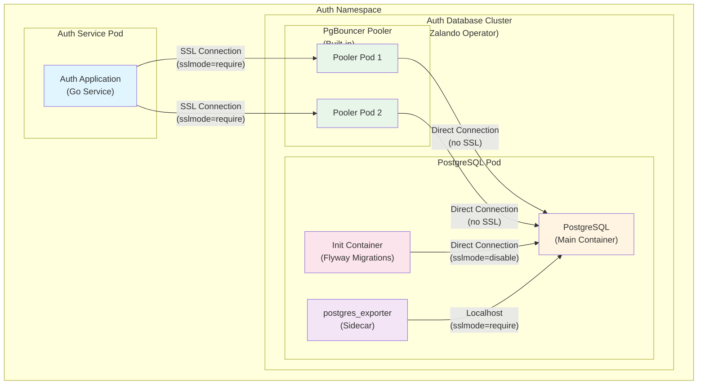
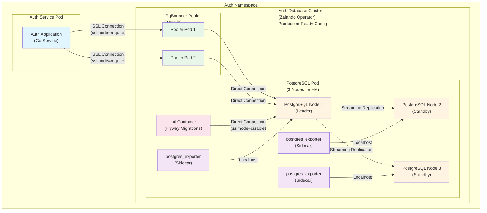
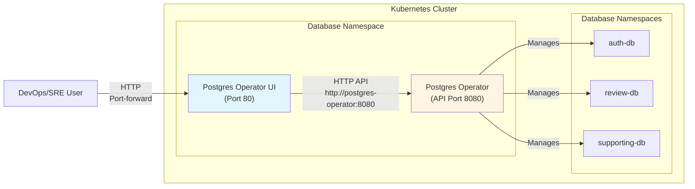
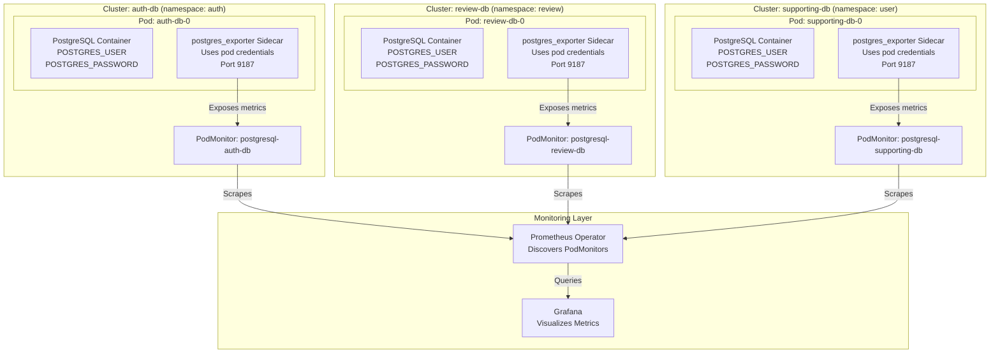

# Technical Plan: Zalando Postgres Operator Production-Ready Configuration

**Task ID:** Zalando-operator
**Created:** 2025-12-29
**Status:** Ready for Implementation
**Based on:** spec.md v2.3

**Priority Focus:** 
1. **CRITICAL (Immediate)**: Fix cross-namespace secret configuration issue (Section 12) - Root cause: Helm values structure prevents operator from reading `enable_cross_namespace_secret` setting
2. **High Priority**: Apply production-ready PostgreSQL tuning to **auth-db cluster** (critical service)

---

## 1. System Architecture

### Overview

This plan addresses **two critical areas** for Zalando Postgres Operator-managed PostgreSQL clusters:

1. **CRITICAL (Immediate)**: Fix cross-namespace secret configuration issue preventing 3 services from starting
   - Root cause: Helm values structure prevents operator from reading `enable_cross_namespace_secret` setting
   - Impact: `notification`, `shipping`, `shipping-v2` services failing with "secret not found" errors
   - Solution: Fix Helm values structure, verify operator configuration, create fallback secret YAML files if needed

2. **High Priority**: Apply production-ready PostgreSQL configuration to the **auth-db** cluster
   - The auth-db cluster is critical for authentication services and requires optimized performance, security, and observability

**Current Architecture:**



**Target Architecture (After Production-Ready Config):**



**Key Changes:**
- ✅ Optimized PostgreSQL parameters (memory, WAL, query planner, parallelism, autovacuum, logging)
- ✅ Enhanced logging and monitoring
- ✅ Production-ready resource limits (small, not large)
- ✅ High Availability (3 nodes for HA)
- ✅ Documented password rotation procedures
- ✅ Documented backup strategy (implementation later)

### Architecture Decisions

| Decision | Choice | Rationale |
|----------|--------|-----------|
| **Target Cluster** | auth-db only | Auth service is critical, high-priority for production tuning |
| **PgBouncer Configuration** | Keep existing (built-in pooler) | Already configured correctly, no changes needed |
| **PostgreSQL Version** | Keep PostgreSQL 15 | Current version is stable, no upgrade needed |
| **Performance Tuning** | Apply comprehensive tuning | Optimize memory, WAL, query planner, parallelism, autovacuum, logging |
| **Resource Limits** | Small, not large | Conservative resource allocation for auth-db workload |
| **High Availability** | 3 nodes | Production-ready HA setup with leader and 2 standbys |
| **Password Rotation** | Document procedures | Native Zalando approach documented, ESO integration later |
| **Backup Strategy** | Document configuration | WAL-E/WAL-G config documented, implementation when credentials available |

---

## 2. Technology Stack

| Layer | Technology | Version | Rationale |
|-------|------------|---------|-----------|
| **PostgreSQL Operator** | Zalando Postgres Operator | v1.15.0 | Already deployed, supports all required features |
| **PostgreSQL** | PostgreSQL | 15 | Current version, stable and production-ready |
| **Connection Pooler** | PgBouncer | Built-in | Zalando operator built-in pooler, already configured |
| **Monitoring** | postgres_exporter | v0.18.1 | Already deployed as sidecar |
| **Migrations** | Flyway | 11.8.2 | Already configured in init containers |
| **Storage** | Kubernetes PVC | 5Gi | Current volume size, may need adjustment for production |

### Dependencies

**Existing (No Changes):**
- Zalando Postgres Operator v1.15.0
- PostgreSQL 15 (Spilo image)
- PgBouncer (built-in pooler)
- postgres_exporter v0.18.1 (sidecar)
- Flyway 11.8.2 (init container)

**New (Documentation Only):**
- Password rotation procedures (native Zalando)
- Backup strategy documentation (WAL-E/WAL-G)

---

## 3. Component Design

### Component 1: Auth Database CRD (`auth-db.yaml`)

**Purpose:** Define production-ready PostgreSQL cluster configuration with optimized parameters.

**Current State:**
- Basic PostgreSQL parameters (`max_connections: 100`, `shared_buffers: 128MB`)
- PgBouncer pooler configured (2 instances, transaction mode)
- Single instance (no HA) - **Target: 3 nodes for HA**
- Basic resource limits - **Target: Small, conservative limits**

**Target State:**
- Comprehensive PostgreSQL tuning parameters
- Optimized memory, WAL, query planner, parallelism, autovacuum, logging settings
- Production-ready resource limits
- Enhanced security settings (pg_hba.conf)

**Key Changes:**
```yaml
postgresql:
  version: "15"
  parameters:
    # Current (minimal)
    max_connections: "100"
    shared_buffers: "128MB"
    
    # Target (production-ready)
    max_connections: "200"
    password_encryption: scram-sha-256
    
    # Memory settings
    shared_buffers: "512MB"  # 25% of 2GB (small, conservative limit)
    work_mem: "8MB"  # Conservative for small workload
    maintenance_work_mem: "128MB"
    effective_cache_size: "1536MB"  # 75% of 2GB (small limit)
    
    # WAL settings
    wal_buffers: "16MB"
    wal_level: "replica"  # For HA (logical if needed for replication)
    checkpoint_timeout: "15min"
    checkpoint_completion_target: "0.9"
    max_wal_size: "2GB"  # Adjusted for single instance
    min_wal_size: "512MB"
    
    # Query planner (SSD assumed)
    random_page_cost: "1.1"
    effective_io_concurrency: "200"
    default_statistics_target: "100"
    
    # Parallelism (conservative for single instance)
    max_worker_processes: "4"
    max_parallel_workers_per_gather: "2"
    max_parallel_workers: "4"
    
    # Autovacuum
    autovacuum: "on"
    autovacuum_max_workers: "2"
    autovacuum_vacuum_scale_factor: "0.1"
    
    # Logging
    log_statement: "mod"
    log_min_duration_statement: "5000"
    log_checkpoints: "on"
    log_lock_waits: "on"
    log_temp_files: "0"
    log_autovacuum_min_duration: "1000"
    log_connections: "on"
    log_disconnections: "on"
    logging_collector: "on"
    log_filename: 'postgresql-%Y-%m-%d_%H%M%S.log'
    log_rotation_age: "1d"
    log_rotation_size: "128MB"
```

**Resource Limits (Small, Conservative):**
```yaml
resources:
  requests:
    cpu: 100m  # Minimum CPU
    memory: 512Mi  # Small memory request (conservative)
  limits:
    cpu: "1"  # Small CPU limit (not large)
    memory: 2Gi  # Small memory limit (conservative)
```

**PgBouncer Configuration (Keep Existing):**
```yaml
connectionPooler:
  numberOfInstances: 2  # Keep as is
  schema: pooler  # Keep as is
  user: pooler  # Keep as is
  mode: transaction  # Keep as is (good for short-lived connections)
  # No maxDBConnections specified - use default
  resources:
    requests:
      cpu: 100m  # Keep as is
      memory: 128Mi  # Keep as is
```

**Dependencies:**
- Zalando Postgres Operator must be running
- `auth` namespace must exist
- Storage class must be available

### Component 2: Password Rotation Documentation

**Purpose:** Document secure password rotation procedures for auth-db credentials.

**Deliverables:**
1. **Native Zalando Rotation Procedure**
   - Step-by-step guide for manual password rotation
   - Zero-downtime rotation strategy
   - Verification steps

2. **External Secrets Operator Integration (Future)**
   - Architecture for ESO integration
   - Configuration examples
   - Automatic rotation setup

**Documentation Location:**
- `docs/guides/DATABASE.md` - Add password rotation section
- Reference to `specs/active/Zalando-operator/research.md` for detailed procedures

**Key Procedures:**
```bash
# Step 1: Generate new password
NEW_PASSWORD=$(openssl rand -base64 32)
NEW_PASSWORD_B64=$(echo -n "$NEW_PASSWORD" | base64)

# Step 2: Update secret
kubectl patch secret auth.auth-db.credentials.postgresql.acid.zalan.do \
  -n auth \
  --type='json' \
  -p="[{\"op\": \"replace\", \"path\": \"/data/password\", \"value\": \"$NEW_PASSWORD_B64\"}]"

# Step 3: Verify operator updated database
kubectl logs -n database -l app.kubernetes.io/name=postgres-operator | grep -i "password\|auth-db"

# Step 4: Restart services (if needed)
kubectl rollout restart deployment/auth -n auth
```

**Dependencies:**
- Zalando operator watching secrets
- Service pods using `secretKeyRef`

### Component 3: Backup Strategy Documentation

**Purpose:** Document backup configuration and disaster recovery procedures.

**Deliverables:**
1. **WAL-E/WAL-G Configuration Guide**
   - S3/GCS/Azure setup instructions
   - Spilo environment variables
   - Backup retention policies

2. **Point-in-Time Recovery (PITR) Procedures**
   - Recovery steps
   - RTO/RPO targets (4 hours / 15 minutes)

3. **Disaster Recovery Plan**
   - Recovery scenarios
   - Testing procedures

**Documentation Location:**
- `docs/guides/DATABASE.md` - Add backup strategy section
- Reference to `specs/active/Zalando-operator/research.md` for detailed procedures

**Configuration Example (Future Implementation):**
```yaml
# In auth-db.yaml (when credentials available)
env:
  - name: WAL_S3_BUCKET
    value: "postgres-backups-prod"
  - name: USE_WALG_BACKUP
    value: "true"
  - name: WALG_S3_PREFIX
    value: "s3://postgres-backups-prod/auth-db/"
  - name: AWS_ACCESS_KEY_ID
    valueFrom:
      secretKeyRef:
        name: wal-e-s3-credentials
        key: AWS_ACCESS_KEY_ID
  - name: AWS_SECRET_ACCESS_KEY
    valueFrom:
      secretKeyRef:
        name: wal-e-s3-credentials
        key: AWS_SECRET_ACCESS_KEY
```

**Dependencies:**
- Cloud credentials (S3/GCS/Azure)
- S3 bucket with lifecycle policies
- Spilo image with WAL-G support

---

## 4. Data Model

### PostgreSQL Configuration Parameters

**Memory Parameters:**
- `shared_buffers`: 512MB (25% of 2GB pod memory - small, conservative)
- `work_mem`: 8MB (conservative for small workload)
- `maintenance_work_mem`: 128MB
- `effective_cache_size`: 1536MB (75% of 2GB - small limit)

**WAL Parameters:**
- `wal_level`: replica (for HA, logical if replication needed)
- `checkpoint_timeout`: 15min
- `max_wal_size`: 2GB
- `min_wal_size`: 512MB

**Query Planner Parameters:**
- `random_page_cost`: 1.1 (SSD)
- `effective_io_concurrency`: 200 (SSD)

**Parallelism Parameters:**
- `max_worker_processes`: 4
- `max_parallel_workers`: 4
- `max_parallel_workers_per_gather`: 2

**Autovacuum Parameters:**
- `autovacuum_max_workers`: 2
- `autovacuum_vacuum_scale_factor`: 0.1

**Logging Parameters:**
- `log_statement`: mod
- `log_min_duration_statement`: 5000ms
- `log_lock_waits`: on
- `log_connections`: on
- `log_disconnections`: on

### Secret Structure

**Current Secret:**
```yaml
apiVersion: v1
kind: Secret
metadata:
  name: auth.auth-db.credentials.postgresql.acid.zalan.do
  namespace: auth
type: Opaque
data:
  username: YXV0aA==  # base64("auth")
  password: <base64-encoded-password>  # Auto-generated by operator
```

**No Changes:** Secret structure remains the same, only password rotation procedures documented.

---

## 5. API Contracts

**Not Applicable** - This plan focuses on infrastructure configuration, not API changes.

**However, monitoring endpoints remain:**
- `postgres_exporter` sidecar: `:9187/metrics` (Prometheus metrics)
- PostgreSQL: `:5432` (database connections)

---

## 6. Security Considerations

### Authentication & Authorization

**Current:**
- Database users managed by Zalando operator
- Passwords stored in Kubernetes secrets
- PgBouncer requires SSL (`sslmode=require`)

**Enhancements:**
- **Password Encryption**: Upgrade to `scram-sha-256` (more secure than MD5)
- **Password Rotation**: Documented procedures for regular rotation
- **pg_hba.conf**: Enhanced security settings (if needed)

**Security Settings:**
```yaml
patroni:
  pg_hba:
    # Keep existing entries for Patroni and pod network
    - "local all all peer"  # Patroni Unix socket
    - "host all all 127.0.0.1/32 md5"  # Localhost
    - "host all all 10.244.0.0/16 md5"  # Pod network
    - "host all all 172.19.0.0/16 md5"  # Kind bridge
    
    # Optional: Add SSL requirement for external connections
    # (if needed for production)
    # - "hostnossl all all all reject"  # Reject non-SSL
    # - "hostssl all all all md5"  # Require SSL
```

### Data Protection

**Secrets Management:**
- Passwords stored in Kubernetes secrets (encrypted at rest by K8s)
- Zalando operator manages secret lifecycle
- Password rotation procedures documented

**Backup Security:**
- S3 backups encrypted at rest (S3 SSE)
- Access control via IAM roles (when implemented)
- Backup access logging enabled

### Security Checklist

- [x] Passwords stored in Kubernetes secrets (encrypted at rest)
- [x] PgBouncer requires SSL connections
- [ ] Password encryption upgraded to `scram-sha-256` (in plan)
- [ ] Password rotation procedures documented
- [ ] Backup encryption configured (when implemented)
- [ ] Access logging enabled for backups (when implemented)

---

## 7. Performance Strategy

### Optimization Targets

**Current Performance:**
- Basic PostgreSQL defaults
- Minimal tuning
- Unknown cache hit ratio

**Target Performance:**
- Cache hit ratio >95% (monitor `pg_stat_database`)
- Query response time <100ms (p95)
- Connection pool utilization <80%
- WAL checkpoint frequency: every 15 minutes

### Tuning Approach

**Phase 1: Memory Optimization**
- Increase `shared_buffers` to 25% of RAM (512MB for 2GB pod - small, conservative)
- Set `effective_cache_size` to 75% of RAM (1536MB for 2GB pod)
- Configure `work_mem` based on query patterns (start conservative: 8MB)

**Phase 2: WAL Optimization**
- Increase `max_wal_size` to reduce checkpoint frequency
- Set `checkpoint_completion_target` to 0.9 for smoother I/O
- Configure `wal_level` based on replication needs

**Phase 3: Query Planner Optimization**
- Set `random_page_cost` to 1.1 for SSD storage
- Increase `effective_io_concurrency` to 200 for SSD
- Monitor query plans with `EXPLAIN ANALYZE`

**Phase 4: Autovacuum Optimization**
- Reduce `autovacuum_vacuum_scale_factor` to 0.1 for faster cleanup
- Monitor `pg_stat_user_tables` for dead tuples

**Phase 5: Logging Optimization**
- Enable slow query logging (`log_min_duration_statement: 5000`)
- Enable lock wait logging (`log_lock_waits: on`)
- Configure log rotation to prevent disk space issues

### Monitoring & Validation

**Key Metrics:**
- `pg_stat_database.blks_hit / (blks_hit + blks_read)` - Cache hit ratio (target: >95%)
- `pg_stat_bgwriter.checkpoints_timed` - Checkpoint frequency
- `pg_stat_activity.wait_event_type = 'Lock'` - Lock waits
- `pg_stat_user_tables.n_dead_tup` - Dead tuples (autovacuum effectiveness)

**Grafana Dashboards:**
- PostgreSQL Performance Overview
- Query Performance (p50, p95, p99)
- Connection Pool Metrics (PgBouncer)
- WAL and Checkpoint Metrics

---

## 8. Implementation Phases

### Phase 1: PostgreSQL Performance Tuning (Week 1)

**Goal:** Apply production-ready PostgreSQL parameters to auth-db cluster.

**Tasks:**
1. Update `k8s/postgres-operator/zalando/crds/auth-db.yaml` with tuning parameters
2. Adjust resource limits based on new `shared_buffers` setting
3. Apply CRD changes and verify cluster restarts successfully
4. Monitor performance metrics (cache hit ratio, query times)
5. Validate no service disruption

**Deliverables:**
- Updated `auth-db.yaml` with production-ready parameters
- Performance metrics baseline established
- Verification that auth service continues working

**Rollback Plan:**
- Revert `auth-db.yaml` to previous version
- Operator will apply old configuration
- Cluster will restart with previous settings

### Phase 2: Password Rotation Documentation (Week 1)

**Goal:** Document secure password rotation procedures.

**Tasks:**
1. Create password rotation section in `docs/guides/DATABASE.md`
2. Document native Zalando rotation procedure
3. Document zero-downtime rotation strategy
4. Add External Secrets Operator integration guide (future)
5. Test rotation procedure in staging (if available)

**Deliverables:**
- Password rotation documentation in `docs/guides/DATABASE.md`
- Reference to detailed procedures in `research.md`
- Rotation schedule defined (90 days for infrastructure, 180 days for app users)

**No Rollback Needed:** Documentation only, no code changes.

### Phase 3: Backup Strategy Documentation (Week 1)

**Goal:** Document backup configuration and disaster recovery procedures.

**Tasks:**
1. Create backup strategy section in `docs/guides/DATABASE.md`
2. Document WAL-E/WAL-G configuration
3. Document Point-in-Time Recovery (PITR) procedures
4. Create disaster recovery plan (RTO: 4 hours, RPO: 15 minutes)
5. Document backup monitoring and alerting

**Deliverables:**
- Backup strategy documentation in `docs/guides/DATABASE.md`
- Reference to detailed procedures in `research.md`
- Configuration examples for future implementation

**No Rollback Needed:** Documentation only, no code changes.

### Phase 4: Monitoring & Validation (Week 2)

**Goal:** Validate performance improvements and monitor production metrics.

**Tasks:**
1. Monitor cache hit ratio (target: >95%)
2. Monitor query performance (p50, p95, p99)
3. Monitor connection pool utilization
4. Monitor WAL checkpoint frequency
5. Monitor autovacuum activity
6. Create Grafana dashboard for production metrics (if needed)

**Deliverables:**
- Performance metrics report
- Validation that targets are met
- Grafana dashboard (if needed)

**Rollback Plan:**
- If performance degrades, revert to Phase 1 rollback plan
- Investigate root cause before re-applying tuning

---

## 9. Risk Assessment

| Risk | Impact | Likelihood | Mitigation |
|------|--------|------------|------------|
| **Performance tuning causes instability** | High | Low | Start with conservative values, monitor closely, have rollback plan ready |
| **Resource limits too low** | Medium | Medium | Monitor resource usage, adjust limits based on actual usage |
| **Password rotation causes downtime** | High | Low | Use zero-downtime rotation strategy, test in staging first |
| **Backup configuration incorrect** | High | Low | Document thoroughly, test restore procedures before production |
| **Service disruption during CRD update** | Medium | Low | Apply changes during maintenance window, verify operator handles updates gracefully |
| **Cache hit ratio doesn't improve** | Low | Medium | Investigate query patterns, adjust `shared_buffers` if needed |
| **Logging overhead too high** | Low | Low | Monitor log volume, adjust `log_statement` if needed (use `mod` instead of `all`) |

---

## 10. Open Questions

- [x] **Resource Limits**: ✅ **RESOLVED** - Small, conservative limits (not large). CPU: 1 core, Memory: 2Gi
- [ ] **Storage Type**: Not needed for initial implementation. Default SSD tuning values will be used (`random_page_cost: 1.1`, `effective_io_concurrency: 200`)
- [ ] **Workload Pattern**: Not needed for initial implementation. Marked as future feature for advanced tuning.
- [ ] **Backup Credentials**: Future implementation. Documentation prepared, will implement when S3/GCS credentials available.
- [x] **HA Requirements**: ✅ **RESOLVED** - 3 nodes for HA (1 leader + 2 standbys). Updated `numberOfInstances: 3`

**Resolved Decisions:**
- ✅ Resource limits: Small, conservative (CPU: 1 core, Memory: 2Gi)
- ✅ HA setup: 3 nodes (production-ready)
- ✅ Storage type: Use default SSD tuning (can be adjusted later if needed)
- ✅ Workload pattern: Basic tuning applied, advanced tuning as future feature
- ✅ Backup: Documentation ready, implementation when credentials available

---

## 11. Configuration Examples

### Complete auth-db.yaml (Production-Ready)

```yaml
# Auth Database Cluster (Zalando Operator) - Production-Ready Configuration
apiVersion: acid.zalan.do/v1
kind: postgresql
metadata:
  name: auth-db
  namespace: auth
spec:
  teamId: "platform"
  
  # Volume configuration
  volume:
    size: 5Gi
  
  # High Availability: 3 nodes (1 leader + 2 standbys)
  numberOfInstances: 3
  
  # Database and user configuration
  databases:
    auth: auth
  
  users:
    auth:  # Database owner
      - createdb
  
  # Connection pooler (PgBouncer) - Keep existing configuration
  connectionPooler:
    numberOfInstances: 2
    schema: pooler
    user: pooler
    mode: transaction  # Transaction pooling for short-lived connections
    resources:
      requests:
        cpu: 100m
        memory: 128Mi
  
  # PostgreSQL version and production-ready parameters
  postgresql:
    version: "15"
    parameters:
      # Connection settings
      port: "5432"
      max_connections: "200"
      password_encryption: scram-sha-256  # More secure than MD5
      
      # Memory settings for performance (small, conservative)
      shared_buffers: "512MB"  # 25% of 2GB pod memory (small limit)
      work_mem: "8MB"  # Conservative for small workload
      maintenance_work_mem: "128MB"
      effective_cache_size: "1536MB"  # 75% of 2GB pod memory
      
      # Write-Ahead Log (WAL) settings
      wal_buffers: "16MB"
      wal_level: "replica"  # For HA (use "logical" if replication needed)
      checkpoint_timeout: "15min"
      checkpoint_completion_target: "0.9"
      max_wal_size: "2GB"  # Adjusted for small workload
      min_wal_size: "512MB"
      
      # Query planner settings (SSD assumed - default tuning)
      random_page_cost: "1.1"  # Lower for SSD
      effective_io_concurrency: "200"  # Higher for SSD
      default_statistics_target: "100"
      
      # Parallelism settings (conservative for small workload)
      max_worker_processes: "4"
      max_parallel_workers_per_gather: "2"
      max_parallel_workers: "4"
      
      # Autovacuum settings
      autovacuum: "on"
      autovacuum_max_workers: "2"
      autovacuum_vacuum_scale_factor: "0.1"  # Trigger vacuum more frequently
      
      # Logging settings
      log_statement: "mod"  # Log DDL + DML
      log_min_duration_statement: "5000"  # Log slow queries (>5s)
      log_checkpoints: "on"
      log_lock_waits: "on"
      log_temp_files: "0"  # Log all temp file usage
      log_autovacuum_min_duration: "1000"  # Log autovacuum >1s
      log_connections: "on"
      log_disconnections: "on"
      logging_collector: "on"
      log_filename: 'postgresql-%Y-%m-%d_%H%M%S.log'
      log_rotation_age: "1d"
      log_rotation_size: "128MB"
  
  # Production-ready resource limits (small, conservative)
  resources:
    requests:
      cpu: 100m  # Minimum CPU
      memory: 512Mi  # Small memory request (conservative)
    limits:
      cpu: "1"  # Small CPU limit (not large)
      memory: 2Gi  # Small memory limit (conservative)
  
  # Patroni configuration for pg_hba.conf
  patroni:
    pg_hba:
      - "local all all peer"  # Local Unix socket (required for Patroni)
      - "host all all 127.0.0.1/32 md5"  # Localhost TCP
      - "host all all 10.244.0.0/16 md5"  # Pod network (Kind default CIDR)
      - "host all all 172.19.0.0/16 md5"  # Kind bridge network
  
  # Sidecar: postgres_exporter for Prometheus metrics collection
  sidecars:
    - name: exporter
      image: quay.io/prometheuscommunity/postgres-exporter:v0.18.1
      ports:
        - name: exporter
          containerPort: 9187
          protocol: TCP
      resources:
        limits:
          cpu: 500m
          memory: 256M
        requests:
          cpu: 100m
          memory: 256M
      env:
        - name: "DATA_SOURCE_URI"
          value: "localhost/postgres?sslmode=require"
        - name: "DATA_SOURCE_USER"
          value: "$(POSTGRES_USER)"
        - name: "DATA_SOURCE_PASS"
          value: "$(POSTGRES_PASSWORD)"
        - name: "PG_EXPORTER_AUTO_DISCOVER_DATABASES"
          value: "true"
```

---

## 12. Cross-Namespace Secret Configuration Fix

### Problem Analysis

**Current State:**
- Secrets are created in `user` namespace instead of target namespaces
- 3 services failing with "secret not found" errors:
  1. `notification`: Needs `notification.notification.supporting-db.credentials.postgresql.acid.zalan.do` in `notification` namespace
  2. `shipping`: Needs `shipping.shipping.supporting-db.credentials.postgresql.acid.zalan.do` in `shipping` namespace
  3. `shipping-v2`: Needs `shipping.supporting-db.credentials.postgresql.acid.zalan.do` in `shipping` namespace (but this secret doesn't exist!)

**Root Causes:**
1. **CRITICAL: Incorrect Helm Values Structure**: The `k8s/postgres-operator/zalando/values.yaml` file uses incorrect field names and nested structure that don't match official Helm chart:
   - `cluster_name` → should be `cluster_domain` (field name correction)
   - `configConnectionPooler.default_parameters` → should be direct fields (structure correction)
   - `configPostgresql.parameters` → should be removed (parameters set in CRDs, not operator config)
   - `configBackup` → should be `configAwsOrGcp` (section name correction)
   - Nested `config:` structure → should be flat `configKubernetes:`, `configGeneral:`, etc.
   This prevents the operator from reading the `enable_cross_namespace_secret: true` setting and causes Helm warnings.
2. **Operator Configuration Issue**: Zalando operator v1.15.1 DOES support cross-namespace secrets (confirmed via [official documentation](https://postgres-operator.readthedocs.io/en/latest/user/) and [v1.15.0 release notes](https://github.com/zalando/postgres-operator/releases/tag/v1.15.0)). The feature requires:
   - `enable_cross_namespace_secret: true` (configured but in wrong location due to structure issue)
   - Users defined in `namespace.username` format (already done in CRD)
   - Database section matching the format (already done in CRD)
   - Operator may need restart after config change
   - Bugfix #2912 in v1.15.0 fixes secret creation in other namespaces when using preparedDatabases and OwnerReference
3. `shipping-v2` service references user `shipping` but CRD only has `shipping.shipping` user
4. No YAML files exist to manually create/copy secrets to target namespaces (fallback solution)

### Solution Approach

**Strategy:** 
1. **Primary Approach**: Fix Helm values structure and verify operator configuration to enable automatic cross-namespace secret creation (as per [official documentation](https://postgres-operator.readthedocs.io/en/latest/user/))
2. **Fallback Approach**: If operator still doesn't create secrets in target namespaces after fixing config, create declarative YAML files to copy secrets from `user` namespace to target namespaces
3. **Shipping-v2 Fix**: Update CRD to add missing `shipping` user for shipping-v2 service

### Implementation Phases

#### Phase 0: Fix Configuration Structure and Verify Operator

**Task 0.0: Fix Helm Values Structure (CRITICAL - DO FIRST)**
- **Issue**: Current `k8s/postgres-operator/zalando/values.yaml` uses incorrect field names and structure
- **Current (WRONG)**:
  ```yaml
  config:
    kubernetes:
      cluster_name: "kind-cluster"  # ❌ WRONG: Should be cluster_domain
      enable_cross_namespace_secret: true
    connection_pooler:
      default_parameters:  # ❌ WRONG: Nested structure doesn't exist
        pool_mode: "transaction"
    postgresql:
      parameters:  # ❌ WRONG: configPostgresql.parameters doesn't exist
        max_connections: "100"
    backup:  # ❌ WRONG: Should be configAwsOrGcp
      wal_s3_bucket: ""
  ```
- **Correct (per Helm chart defaults)**:
  ```yaml
  configKubernetes:
    cluster_domain: cluster.local  # ✅ Correct field name
    enable_cross_namespace_secret: true
  
  configConnectionPooler:
    connection_pooler_schema: "pooler"  # ✅ Direct fields, not nested
    connection_pooler_user: "pooler"
    connection_pooler_mode: "transaction"
    connection_pooler_number_of_instances: 2
    connection_pooler_max_db_connections: 60
    connection_pooler_default_cpu_request: 500m
    connection_pooler_default_memory_request: 100Mi
  
  configAwsOrGcp:  # ✅ Correct section name
    aws_region: eu-central-1
    wal_s3_bucket: ""
  
  configGeneral:
    enable_pgversion_env_var: true
  
  # Note: configPostgresql.parameters does NOT exist
  # PostgreSQL parameters are set per-cluster in CRDs
  ```
- **Root Cause**: Helm chart expects flat structure with specific field names matching official chart defaults
- **Impact**: Helm deployment shows warnings and operator may not read configuration correctly
- **Specific Field Corrections**:
  - `cluster_name` → `cluster_domain` (field name correction)
  - `configConnectionPooler.default_parameters` → direct fields (structure correction)
  - `configPostgresql.parameters` → remove (parameters set in CRDs, not operator config)
  - `configBackup` → `configAwsOrGcp` (section name correction)
- **Fix**: Restructure `values.yaml` to match Helm chart default structure with correct field names
- **File**: `k8s/postgres-operator/zalando/values.yaml`
- **Action**: Replace nested `config:` structure with flat `configKubernetes:`, `configGeneral:`, `configUsers:`, etc., and fix all field names

**Task 0.1: Update Image Configuration**
- Update image section to match Helm chart defaults:
  ```yaml
  image:
    registry: ghcr.io
    repository: zalando/postgres-operator
    tag: v1.15.1
    pullPolicy: "IfNotPresent"
  ```
- **File**: `k8s/postgres-operator/zalando/values.yaml`
- **Reason**: Use official multi-arch image from GitHub Container Registry, latest stable version

**Task 0.2: Apply Fixed Configuration**
- Update Helm release with corrected values.yaml
- Command: `helm upgrade postgres-operator postgres-operator/postgres-operator -n database -f k8s/postgres-operator/zalando/values.yaml`
- Verify no Helm warnings about unknown fields
- Wait for operator pod to restart and be ready
- Verify: `kubectl wait --for=condition=ready pod -l app.kubernetes.io/name=postgres-operator -n database --timeout=5m`

**Task 0.3: Verify Operator Configuration**
- Check if `enable_cross_namespace_secret: true` is set in OperatorConfiguration CRD
- Command: `kubectl get operatorconfiguration postgres-operator -n database -o yaml | grep -A 5 enable_cross_namespace_secret`
- Verify Helm values file has correct setting: `k8s/postgres-operator/zalando/values.yaml`
- Verify no Helm warnings about unknown fields (`cluster_name`, `default_parameters`, etc.)

**Task 0.4: Verify CRD Format**
- Check `supporting-db.yaml` uses `namespace.username` format for users
- Verify database section matches user format
- Commands:
  ```bash
  kubectl get postgresql supporting-db -n user -o yaml | grep -A 10 "users:"
  kubectl get postgresql supporting-db -n user -o yaml | grep -A 5 "databases:"
  ```

**Task 0.5: Trigger Secret Recreation**
- Delete existing secrets in `user` namespace to force operator recreation
- Commands:
  ```bash
  kubectl delete secret notification.notification.supporting-db.credentials.postgresql.acid.zalan.do -n user
  kubectl delete secret shipping.shipping.supporting-db.credentials.postgresql.acid.zalan.do -n user
  ```
- Wait for operator to recreate secrets (check operator logs)
- Verify if secrets are created in target namespaces

**Task 0.6: Check Operator Logs**
- Check operator logs for cross-namespace secret creation
- Command: `kubectl logs -n database -l app.kubernetes.io/name=postgres-operator --tail=100 | grep -i "cross\|namespace\|secret"`

**Task 0.7: Verify RBAC Permissions**
- Verify operator has permissions to create secrets in target namespaces
- Check ClusterRole/Role: `kubectl get clusterrole postgres-operator -o yaml | grep -A 10 secrets`
- If using RoleBinding (not ClusterRoleBinding), verify it exists in target namespaces

#### Phase 1: Create Secret YAML Files (Fallback Solution)

**Note:** Only proceed to this phase if Phase 0 (Configuration Fix and Verification) fails to create secrets in target namespaces.

**Task 1.1: Create Secret YAML for Notification Namespace**
- File: `k8s/secrets/notification-supporting-db-secret.yaml`
- Copy secret from `user` namespace to `notification` namespace
- Secret name: `notification.notification.supporting-db.credentials.postgresql.acid.zalan.do`
- Extract secret data from `user` namespace and create new YAML

**Task 1.2: Create Secret YAML for Shipping Namespace (shipping service)**
- File: `k8s/secrets/shipping-supporting-db-secret.yaml`
- Copy secret from `user` namespace to `shipping` namespace
- Secret name: `shipping.shipping.supporting-db.credentials.postgresql.acid.zalan.do`
- Extract secret data from `user` namespace and create new YAML

**Task 1.3: Update Supporting-DB CRD for Shipping-v2**
- File: `k8s/postgres-operator/zalando/crds/supporting-db.yaml`
- Add user `shipping` (without namespace prefix) for shipping-v2 service
- Add database entry if needed (but database `shipping` already exists, owned by `shipping.shipping`)
- This will create secret `shipping.supporting-db.credentials.postgresql.acid.zalan.do` in `user` namespace

**Task 1.4: Create Secret YAML for Shipping Namespace (shipping-v2 service)**
- File: `k8s/secrets/shipping-v2-supporting-db-secret.yaml`
- Copy secret from `user` namespace to `shipping` namespace
- Secret name: `shipping.supporting-db.credentials.postgresql.acid.zalan.do`
- Note: This secret will be created after CRD update and operator reconciliation

#### Phase 2: Update Deployment Script

**Task 2.1: Update Database Deployment Script**
- File: `scripts/04-deploy-databases.sh`
- Add section to apply secret YAML files after database clusters are ready
- Apply secrets in order: notification, shipping, shipping-v2 (after CRD update)

### Files to Create/Modify

**New Files:**
1. `k8s/secrets/notification-supporting-db-secret.yaml` - Secret for notification namespace
2. `k8s/secrets/shipping-supporting-db-secret.yaml` - Secret for shipping namespace (shipping service)
3. `k8s/secrets/shipping-v2-supporting-db-secret.yaml` - Secret for shipping namespace (shipping-v2 service)

**Modified Files:**
1. `k8s/postgres-operator/zalando/values.yaml` - **CRITICAL**: 
   - Fix structure to use flat `configKubernetes:`, `configGeneral:`, etc. instead of nested `config:` structure
   - Fix field names: `cluster_domain` (not `cluster_name`), `configAwsOrGcp` (not `configBackup`)
   - Fix `configConnectionPooler` to use direct fields (not nested `default_parameters`)
   - Remove `configPostgresql.parameters` (parameters set in CRDs, not operator config)
   - Update image to use `ghcr.io/zalando/postgres-operator:v1.15.1`
2. `k8s/postgres-operator/zalando/crds/supporting-db.yaml` - Add `shipping` user
3. `scripts/04-deploy-databases.sh` - Add secret application section (if fallback needed)

### Deployment Order

1. **Fix Helm values structure** (Phase 0.0) - Restructure values.yaml to use flat config structure
2. **Update image configuration** (Phase 0.1) - Use official ghcr.io image v1.15.1
3. **Apply fixed configuration** (Phase 0.2) - Helm upgrade operator with corrected values
4. **Verify operator configuration** (Phase 0.3-0.7) - Check CRD format, trigger secret recreation, verify logs
5. **Check if secrets created in target namespaces** - If yes, proceed to shipping-v2 fix
6. **Update CRD to add `shipping` user** (if not exists) - For shipping-v2 service
7. **Wait for operator to create `shipping.supporting-db.credentials.postgresql.acid.zalan.do`** in `user` namespace
8. **If operator didn't create secrets in target namespaces**: Apply secret YAML files (Phase 1 - Fallback)
9. **Verify secrets exist in target namespaces**
10. **Services should start successfully**

### Verification Steps

After implementation, user should run:

```bash
# 1. Check secrets in target namespaces
kubectl get secret notification.notification.supporting-db.credentials.postgresql.acid.zalan.do -n notification
kubectl get secret shipping.shipping.supporting-db.credentials.postgresql.acid.zalan.do -n shipping
kubectl get secret shipping.supporting-db.credentials.postgresql.acid.zalan.do -n shipping

# 2. Verify secret data (username should match)
kubectl get secret notification.notification.supporting-db.credentials.postgresql.acid.zalan.do -n notification -o jsonpath='{.data.username}' | base64 -d && echo ""
kubectl get secret shipping.shipping.supporting-db.credentials.postgresql.acid.zalan.do -n shipping -o jsonpath='{.data.username}' | base64 -d && echo ""
kubectl get secret shipping.supporting-db.credentials.postgresql.acid.zalan.do -n shipping -o jsonpath='{.data.username}' | base64 -d && echo ""

# 3. Check services can start
kubectl get pods -n notification -l app=notification
kubectl get pods -n shipping -l app=shipping
kubectl get pods -n shipping -l app=shipping-v2
```

### Notes

**Operator Support:**
- Zalando Postgres Operator v1.15.1 DOES support cross-namespace secrets ([official docs](https://postgres-operator.readthedocs.io/en/latest/user/))
- Feature requires: `enable_cross_namespace_secret: true` (in correct location: `configKubernetes.enable_cross_namespace_secret`), `namespace.username` user format, matching database format
- Bugfix #2912 in v1.15.0 fixes secret creation in other namespaces when using preparedDatabases and OwnerReference
- Known issue: If `enable_owner_references: true` is set, cross-namespace secrets may fail (K8s doesn't allow cross-namespace ownerReferences)

**Configuration Structure:**
- Helm chart uses flat structure: `configKubernetes:`, `configGeneral:`, `configUsers:`, etc. as top-level keys
- Specific field names must match official chart: `cluster_domain` (not `cluster_name`), `configAwsOrGcp` (not `configBackup`), direct fields in `configConnectionPooler` (not nested `default_parameters`)
- `configPostgresql.parameters` does NOT exist - PostgreSQL parameters are set per-cluster in CRDs
- Current values.yaml has incorrect structure and field names that prevent operator from reading settings and cause Helm warnings

**Fallback Solution:**
- If operator still doesn't create secrets in target namespaces after fixing config, use manual YAML files
- YAML files copy secrets from `user` namespace to target namespaces declaratively
- No manual `kubectl` commands needed (all via YAML files)
- Deployment script handles secret application automatically

**Future:**
- Consider External Secrets Operator for production
- Monitor operator logs for cross-namespace secret creation issues

---

## Next Steps

1. ✅ Review technical plan (this document)
2. **CRITICAL (DO FIRST)**: Fix Helm values structure and cross-namespace secret configuration (Section 12)
   - Fix Helm values structure (Phase 0.0)
   - Verify operator configuration (Phase 0.1-0.7)
   - Create fallback secret YAML files if needed (Phase 1)
   - Update deployment script (Phase 2)
3. Run `/tasks Zalando-operator` to generate implementation tasks
4. Implement Phase 1: PostgreSQL Performance Tuning (after critical fix)
5. Document Phase 2 & 3: Password Rotation and Backup Strategy
6. Monitor and validate Phase 4: Performance improvements

---

## Implementation Priority

**Phase 0 (CRITICAL - Immediate):** Cross-Namespace Secret Configuration Fix
- **Why Critical**: 3 services (`notification`, `shipping`, `shipping-v2`) are currently failing with "secret not found" errors
- **Root Cause**: Helm values structure prevents operator from reading configuration
- **Impact**: Services cannot start, blocking deployment
- **Estimated Time**: 1-2 hours (configuration fix + verification)

**Phase 1 (High Priority - After Critical Fix):** PostgreSQL Performance Tuning
- **Why High Priority**: Production-ready configuration for critical auth-db cluster
- **Impact**: Improved performance, reliability, and observability
- **Estimated Time**: 2-4 hours (configuration + validation)

**Phase 2-3 (Medium Priority - Future):** Password Rotation & Backup Strategy
- **Why Medium Priority**: Documentation and procedures, not blocking
- **Impact**: Security and disaster recovery readiness
- **Estimated Time**: 4-8 hours (documentation + testing)

**Phase 4 (Nice to Have - Optional Enhancement):** Postgres Operator UI Component
- **Why Nice to Have**: Optional graphical interface for cluster management
- **Impact**: Improved developer experience, reduced kubectl dependency
- **Estimated Time**: 1-2 hours (deployment + configuration)

---

## 13. Postgres Operator UI Component Deployment

### Overview

Deploy the optional Postgres Operator UI component to provide a graphical web interface for managing PostgreSQL clusters. This enables DevOps/SRE teams and developers to view, create, and manage database clusters through a convenient web interface.

### Architecture



### Implementation Steps

#### Step 1: Create Helm Values File

**File**: `k8s/postgres-operator/zalando/ui-values.yaml`

```yaml
# Postgres Operator UI Helm Values
# Chart: postgres-operator-ui-charts/postgres-operator-ui
# Version: 1.15.1

replicaCount: 1

image:
  registry: ghcr.io
  repository: zalando/postgres-operator-ui
  tag: v1.15.1
  pullPolicy: IfNotPresent

rbac:
  create: true

serviceAccount:
  create: true
  name:

resources:
  limits:
    cpu: 200m
    memory: 200Mi
  requests:
    cpu: 100m
    memory: 100Mi

envs:
  appUrl: "http://localhost:8081"
  operatorApiUrl: "http://postgres-operator.database.svc.cluster.local:8080"
  operatorClusterNameLabel: "cluster-name"
  resourcesVisible: "False"
  targetNamespace: "*"  # View all namespaces
  teams: []  # Empty if not using Teams API

service:
  type: ClusterIP
  port: 80

ingress:
  enabled: false  # Enable if external access needed
  # annotations: {}
  # ingressClassName: ""
  # hosts:
  #   - host: postgres-ui.example.org
  #     paths: ["/"]
  # tls: []
```

#### Step 2: Add Helm Repository

```bash
helm repo add postgres-operator-ui-charts https://opensource.zalando.com/postgres-operator/charts/postgres-operator-ui
helm repo update postgres-operator-ui-charts
```

#### Step 3: Deploy UI Component

**Option A: Deploy in `database` namespace (Recommended)**

```bash
helm upgrade --install postgres-operator-ui postgres-operator-ui-charts/postgres-operator-ui \
  -f k8s/postgres-operator/zalando/ui-values.yaml \
  -n database \
  --version 1.15.1 \
  --wait \
  --timeout 5m
```

**Option B: Deploy in `monitoring` namespace (Alternative)**

```bash
helm upgrade --install postgres-operator-ui postgres-operator-ui-charts/postgres-operator-ui \
  -f k8s/postgres-operator/zalando/ui-values.yaml \
  -n monitoring \
  --version 1.15.1 \
  --wait \
  --timeout 5m
```

**Note**: If deploying in `monitoring` namespace, ensure `operatorApiUrl` uses full FQDN:
```yaml
operatorApiUrl: "http://postgres-operator.database.svc.cluster.local:8080"
```

#### Step 4: Verify Deployment

```bash
# Check UI pod status
kubectl get pods -n database -l app.kubernetes.io/name=postgres-operator-ui

# Check UI service
kubectl get svc -n database postgres-operator-ui

# Check UI logs
kubectl logs -n database -l app.kubernetes.io/name=postgres-operator-ui
```

#### Step 5: Access UI

**Port-Forward Access (Recommended for Development):**

```bash
kubectl port-forward -n database svc/postgres-operator-ui 8081:80
```

Access UI at: `http://localhost:8081`

**Ingress Access (Optional for Production):**

1. Enable ingress in `ui-values.yaml`:
```yaml
ingress:
  enabled: true
  ingressClassName: "nginx"  # or your ingress class
  hosts:
    - host: postgres-ui.example.org
      paths: ["/"]
  tls:
    - secretName: postgres-ui-tls
      hosts:
        - postgres-ui.example.org
```

2. Apply updated values:
```bash
helm upgrade postgres-operator-ui postgres-operator-ui-charts/postgres-operator-ui \
  -f k8s/postgres-operator/zalando/ui-values.yaml \
  -n database
```

#### Step 6: Update Deployment Script (Optional)

Add UI deployment to `scripts/04-deploy-databases.sh`:

```bash
# Deploy Postgres Operator UI (optional)
echo "Deploying Postgres Operator UI..."
if ! helm repo list | grep -q "postgres-operator-ui-charts"; then
    helm repo add postgres-operator-ui-charts https://opensource.zalando.com/postgres-operator/charts/postgres-operator-ui
    helm repo update postgres-operator-ui-charts
fi

helm upgrade --install postgres-operator-ui postgres-operator-ui-charts/postgres-operator-ui \
    -f "$PROJECT_ROOT/k8s/postgres-operator/zalando/ui-values.yaml" \
    -n database \
    --version 1.15.1 \
    --wait \
    --timeout 5m || echo "Warning: UI deployment failed (optional component)"
```

### Configuration Details

**Operator API URL:**
- **Format**: `http://{service-name}.{namespace}.svc.cluster.local:{port}`
- **In `database` namespace**: `http://postgres-operator:8080` (short name works)
- **In other namespace**: `http://postgres-operator.database.svc.cluster.local:8080` (full FQDN required)

**Target Namespace:**
- `"*"` - View/manage clusters in ALL namespaces (recommended for multi-namespace setup)
- `"default"` - Only view/manage clusters in default namespace
- `"namespace-name"` - Only view/manage clusters in specific namespace

**RBAC Requirements:**
- UI pod needs ServiceAccount with permissions to:
  - List/get Postgresql CRDs in target namespaces
  - Create/update Postgresql CRDs (if cluster creation enabled)
  - View secrets (for connection info)

### Verification Checklist

- [ ] UI pod is running and ready
- [ ] UI service is accessible
- [ ] UI can connect to operator API (check logs)
- [ ] UI displays all PostgreSQL clusters (`auth-db`, `review-db`, `supporting-db`)
- [ ] UI shows cluster status correctly
- [ ] Port-forward access works: `http://localhost:8081`
- [ ] Optional: Ingress configured and accessible (if enabled)

### Troubleshooting

**UI cannot connect to operator:**
- Check `operatorApiUrl` is correct (use full FQDN if UI in different namespace)
- Verify operator service exists: `kubectl get svc -n database postgres-operator`
- Check operator API is accessible: `kubectl port-forward -n database svc/postgres-operator 8080:8080` then `curl http://localhost:8080/clusters`

**UI shows no clusters:**
- Verify `targetNamespace: "*"` is set
- Check RBAC permissions for UI ServiceAccount
- Verify clusters exist: `kubectl get postgresql --all-namespaces`

**UI pod fails to start:**
- Check pod logs: `kubectl logs -n database -l app.kubernetes.io/name=postgres-operator-ui`
- Verify image pull: `kubectl describe pod -n database -l app.kubernetes.io/name=postgres-operator-ui`
- Check resource limits are sufficient

### Benefits

**For DevOps/SRE Teams:**
- ✅ Visual cluster management interface
- ✅ Quick status checks without kubectl commands
- ✅ Multi-namespace cluster visibility
- ✅ Reduced operational overhead

**For Developers:**
- ✅ Self-service cluster creation (if enabled)
- ✅ Status visibility without kubectl access
- ✅ User-friendly web interface

### Future Enhancements

- **Ingress Configuration**: Enable external access via Ingress with TLS
- **Teams API Integration**: Configure Teams API for advanced team management
- **Monitoring Integration**: Add UI metrics to Prometheus/Grafana
- **Access Control**: Implement RBAC-based access control for UI

---

## 14. PostgreSQL Monitoring with Sidecar Exporter

**Status:** Ready for Implementation  
**Based on:** `specs/active/Zalando-operator/spec.md` (FR-13, FR-14, FR-15)  
**Approach:** **Sidecar Approach (Production-Ready)** - `postgres_exporter` runs as sidecar in PostgreSQL pods

### Overview

Deploy `postgres_exporter` as a **sidecar container** in each PostgreSQL pod managed by Zalando Postgres Operator. The sidecar uses PostgreSQL pod's own credentials automatically, eliminating the need for infrastructure roles or separate monitoring secrets.

**Architecture Flow:**



### Implementation Phases

#### Phase 1: Add Sidecar to PostgreSQL CRDs (30 minutes)

**Objective:** Add sidecar configuration to all 3 PostgreSQL CRDs.

**Tasks:**
1. **Update auth-db CRD**
   - Read `k8s/postgres-operator/zalando/crds/auth-db.yaml`
   - Add `sidecars` section under `spec`
   - Configure sidecar with exporter image, ports, resources, env vars
   - Apply: `kubectl apply -f k8s/postgres-operator/zalando/crds/auth-db.yaml`

2. **Update review-db CRD**
   - Same steps as auth-db
   - Apply: `kubectl apply -f k8s/postgres-operator/zalando/crds/review-db.yaml`

3. **Update supporting-db CRD**
   - Same steps as auth-db
   - Apply: `kubectl apply -f k8s/postgres-operator/zalando/crds/supporting-db.yaml`

4. **Wait for Pods to Restart**
   - Pods will restart with sidecar container
   - Wait for pods to be ready: `kubectl wait --for=condition=ready pod -l cluster-name=<name> -n <namespace> --timeout=5m`

**Sidecar Configuration:**
```yaml
sidecars:
  - name: exporter
    image: quay.io/prometheuscommunity/postgres-exporter:v0.18.1
    ports:
      - name: exporter
        containerPort: 9187
        protocol: TCP
    resources:
      limits:
        cpu: 500m
        memory: 256M
      requests:
        cpu: 100m
        memory: 256M
    env:
      - name: "DATA_SOURCE_URI"
        value: "localhost/postgres?sslmode=require"
      - name: "DATA_SOURCE_USER"
        value: "$(POSTGRES_USER)"
      - name: "DATA_SOURCE_PASS"
        value: "$(POSTGRES_PASSWORD)"
      - name: "PG_EXPORTER_AUTO_DISCOVER_DATABASES"
        value: "true"
```

#### Phase 2: Create PodMonitors (15 minutes)

**Objective:** Create PodMonitor CRD for each cluster.

**Tasks:**
1. **Create PodMonitor for auth-db**
   - Create `k8s/prometheus/podmonitor-auth-db.yaml`
   - Configure selector with `application: spilo`, `cluster-name: auth-db`
   - Configure scrape endpoint with port `exporter`
   - Apply: `kubectl apply -f k8s/prometheus/podmonitor-auth-db.yaml`

2. **Create PodMonitor for review-db**
   - Create `k8s/prometheus/podmonitor-review-db.yaml`
   - Same configuration, update cluster-name
   - Apply: `kubectl apply -f k8s/prometheus/podmonitor-review-db.yaml`

3. **Create PodMonitor for supporting-db**
   - Create `k8s/prometheus/podmonitor-supporting-db.yaml`
   - Same configuration, update cluster-name
   - Apply: `kubectl apply -f k8s/prometheus/podmonitor-supporting-db.yaml`

**PodMonitor Configuration:**
```yaml
apiVersion: monitoring.coreos.com/v1
kind: PodMonitor
metadata:
  name: postgresql-auth-db
  namespace: auth
spec:
  selector:
    matchLabels:
      application: spilo
      cluster-name: auth-db
  podTargetLabels:
    - spilo-role
    - cluster-name
    - team
  podMetricsEndpoints:
    - port: exporter
      interval: 15s
      scrapeTimeout: 10s
```

#### Phase 3: Verify Monitoring (15 minutes)

**Objective:** Verify sidecar exporters are running and metrics are being scraped.

**Tasks:**
1. **Verify Sidecar Containers**
   - Check all pods have sidecar: `kubectl get pod -n <namespace> <pod-name> -o jsonpath='{.spec.containers[*].name}'`
   - Check sidecar logs: `kubectl logs -n <namespace> <pod-name> -c exporter`

2. **Test Metrics Endpoint**
   - Port-forward to sidecar: `kubectl port-forward -n <namespace> <pod-name> 9187:9187`
   - Test metrics: `curl http://localhost:9187/metrics | grep pg_up`
   - Should return `pg_up 1`

3. **Verify Prometheus Scraping**
   - Check Prometheus targets (if accessible)
   - Verify metrics appear in Prometheus/Grafana
   - Query `pg_up` metric: `pg_up{cluster_name="auth-db"}`

### Benefits

**For DevOps/SRE Teams:**
- ✅ **Production-Ready Isolation**: Per-cluster monitoring (failure in one doesn't affect others)
- ✅ **Simpler Setup**: No infrastructure roles or separate secrets needed
- ✅ **Automatic Credentials**: Uses PostgreSQL pod credentials automatically
- ✅ **Better Reliability**: Isolated monitoring per cluster

**For Developers:**
- ✅ **No Manual Configuration**: Sidecar configured in CRD
- ✅ **Standard Metrics**: All standard PostgreSQL metrics available
- ✅ **Easy Troubleshooting**: Metrics accessible via Prometheus/Grafana

### Related Documents

- **Specification:** `specs/active/Zalando-operator/spec.md` (FR-13, FR-14, FR-15)
- **Research:** `specs/active/Zalando-operator/research.md` (Section 15: PostgreSQL Monitoring)
- **Tasks:** `specs/active/Zalando-operator/tasks.md` (Monitoring tasks)

---

---

## 15. postgres_exporter Custom Queries Configuration

**Status:** Ready for Implementation  
**Based on:** `specs/active/Zalando-operator/research.md` (Section 15.1)  
**Approach:** Configure postgres_exporter with custom queries.yaml via ConfigMap to expose pg_stat_statements, pg_replication, and pg_postmaster metrics

### Overview

When PostgreSQL clusters have `pg_stat_statements` extension enabled (via `shared_preload_libraries`), we can configure postgres_exporter to expose additional custom metrics by providing a `queries.yaml` file via ConfigMap.

**Key Metrics:**
- **pg_stat_statements**: Query performance metrics (execution time, calls, cache hits, I/O statistics)
- **pg_replication**: Replication lag monitoring (critical for HA clusters)
- **pg_postmaster**: PostgreSQL server start time

**Configuration Approach:**
1. Create ConfigMap with `queries.yaml` for each cluster
2. Mount ConfigMap as volume in postgres_exporter sidecar
3. Configure `PG_EXPORTER_EXTENDED_QUERY_PATH` environment variable
4. Verify custom metrics are exposed and scraped by Prometheus

**Implementation Phases:**

#### Phase 1: Create ConfigMaps (30 minutes)
- Create ConfigMap for auth-db cluster
- Create ConfigMap for review-db cluster
- Create ConfigMap for supporting-db cluster

#### Phase 2: Update CRDs (30 minutes)
- Update auth-db CRD: Add volume mount and environment variable
- Update review-db CRD: Add volume mount and environment variable
- Update supporting-db CRD: Add volume mount and environment variable

#### Phase 3: Verify Metrics (15 minutes)
- Verify custom metrics are exposed by postgres_exporter
- Verify Prometheus is scraping custom metrics
- Query metrics in Prometheus/Grafana

**Benefits:**
- ✅ **Query Performance Analysis** - Track slow queries, execution counts, cache hit ratios
- ✅ **Replication Monitoring** - Monitor replication lag for HA clusters
- ✅ **Server Uptime Tracking** - Track PostgreSQL server start time
- ✅ **Production-Ready** - Essential metrics for production PostgreSQL monitoring

**Prerequisites:**
- PostgreSQL has `pg_stat_statements` extension enabled (already configured in CRDs)
- postgres_exporter sidecar already deployed (Phase 5)

### Related Documents

- **Research:** `specs/active/Zalando-operator/research.md` (Section 15.1: Custom Queries Configuration)
- **Tasks:** `specs/active/Zalando-operator/tasks.md` (Phase 7: Custom Queries Configuration)

---

*Plan created with SDD 2.0*
*Updated: 2026-01-05 - Added postgres_exporter Custom Queries Configuration (Section 15)*