# Research: Zalando Postgres Operator Cross-Namespace Secret Management

**Task ID:** Zalando-operator
**Date:** 2025-12-26
**Status:** Complete
**Version:** 1.17 (Refined)

## Changelog

| Version | Date | Changes | Author |
|---------|------|---------|--------|
| 1.17 | 2026-01-05 | [REFINED] Added comprehensive "Custom Queries Configuration for postgres_exporter" section documenting how to configure postgres_exporter with custom queries.yaml via ConfigMap for pg_stat_statements, pg_replication, and pg_postmaster metrics. Includes complete ConfigMap example, CRD updates for volume mounting, environment variable configuration, and troubleshooting guide. | System |
| 1.16 | 2026-01-05 | [REFINED] Added comprehensive "PostgreSQL Log Collection with Vector Sidecar" section documenting default log location (`/home/postgres/pgdata/pgroot/pg_log/*.log`), Vector sidecar configuration, ConfigMap setup, multiline log parsing, label injection, and Loki sink configuration with correct endpoint (`http://loki.monitoring.svc.cluster.local:3100`). Includes production-ready examples, Loki setup details, and troubleshooting guide. | System |
| 1.15 | 2026-01-02 | [REFINED] Added critical information about Kubernetes Endpoints API deprecation (Kubernetes 1.35+). Documented distinction between service discovery Endpoints (replaced by EndpointSlices) vs leader election Endpoints (used by Patroni). Added migration paths (Lease API, ConfigMap, EndpointSlices), current status of Patroni/Zalando, future compatibility considerations, and best practices. Included references and action items for monitoring Patroni/Zalando for official migration guidance. | System |
| 1.14 | 2026-01-02 | [REFINED] Enhanced Smart Rolling Upgrade section with detailed multi-phase process (Start, Step 1, Switchover, Finish) based on Zalando production talk. Added comprehensive "Common Production Issues on Kubernetes" section covering AWS infrastructure problems (API rate limits, EC2 failures), disk space issues (logs, WAL, PGDATA), ORM causing WAL-E failures, and Out-of-Memory Killer issues. Included mitigation strategies, best practices, and production recommendations. | System |
| 1.13 | 2026-01-02 | [REFINED] Added comprehensive Zalando Operator core concepts deep-dive: Spilo Docker image architecture, Patroni leader election and HA, Kubernetes rolling upgrade process, PostgreSQL cluster lifecycle, operator architecture (CRD-driven resource creation), and pod internals (Spilo, Patroni, PostgreSQL, sidecars). Included Mermaid diagrams for visual understanding. Based on official Postgres Operator User documentation and "PostgreSQL on K8S at Zalando: Two years in production" talk. | System |
| 1.12 | 2026-01-02 | [CONSOLIDATED] Merged monitoring permissions research (research-monitoring-permissions.md) into main research document. Added comprehensive section on PostgreSQL monitoring with sidecar exporter approach, including findings on sidecar containers, preparedDatabases, infrastructure role permissions, and postgres_exporter requirements. Documented production-ready sidecar approach with PodMonitor per cluster. | System |
| 1.11 | 2026-01-02 | [REFINED] Corrected Helm values structure research: fixed field names (`cluster_domain` not `cluster_name`), corrected `configConnectionPooler` structure (direct fields not `default_parameters`), clarified `configPostgresql.parameters` doesn't exist (parameters set in CRDs), corrected backup section (`configAwsOrGcp` not `configBackup`). Updated examples to match official Helm chart structure. | System |
| 1.10 | 2026-01-01 | [REFINED] Added Postgres Operator UI component research: documented UI component availability, Helm chart configuration, operator API integration, namespace visibility settings, and deployment approach. UI provides graphical interface for database-as-a-service management. | System |
| 1.9 | 2025-12-30 | [REFINED] Added critical Helm values structure issue discovery - root cause of cross-namespace secret problem. Documented that Helm chart requires flat structure (`configKubernetes:`, `configGeneral:`, etc.) as top-level keys, NOT nested under `config:`. Added image update recommendation to v1.15.1. Updated version compatibility confirmation. | System |
| 1.8 | 2025-12-29 | [REFINED] Added comprehensive production-ready sections: PostgreSQL Performance Tuning (memory, WAL, query planner, parallelism, autovacuum, logging, pooler tuning), Password Rotation in Kubernetes Secrets (native and ESO approaches), and Backup Strategy (WAL-E, PITR, disaster recovery). Focused on DevOps/SRE production deployment requirements. | System |
| 1.7 | 2025-12-26 | [REFINED] Added detailed Fake Teams API implementation guide: explained what Fake Teams API is (simple HTTP server mocking Teams API), provided Python HTTP server implementation example with Service, documented endpoint format and deployment options. Updated "Recommended Next Steps" with concrete implementation details for both monitoring user and developer access. | System |
| 1.6 | 2025-12-26 | [REFINED] Clarified Teams API (basic) vs PostgresTeam CRD (advanced) with comparison table. Added production-ready examples: infrastructure role for monitoring user with complete configuration, developer access via Teams API and PostgresTeam CRD, security best practices, monitoring/observability, troubleshooting guide. Documented decision matrix for choosing between approaches. | System |
| 1.5 | 2025-12-26 | [REFINED] Added comprehensive "Zalando Operator Role Types" section explaining three role types (Manifest, Infrastructure, Teams API), PostgresTeam CRD for advanced team management, authentication flows, use cases, and configuration examples. Documented when to use Teams API roles vs manifest roles. | System |
| 1.4 | 2025-12-26 | [REFINED] Added detailed `secret_name_template` documentation explaining advanced customization options, template placeholders, and relationship with `enable_cross_namespace_secret`. Created `Feature.md` for External Secrets Operator integration planning. Updated Future Extensibility section to reference Feature.md | System |
| 1.3 | 2025-12-26 | [REFINED] Added future extensibility analysis for External Secrets Operator/Vault integration, documented 3 integration patterns with comparison table and Mermaid diagrams, updated Option 4 assessment. [RENAME] Task renamed from cross-namespace-secrets to Zalando-operator | System |
| 1.2 | 2025-12-26 | [REFINED] Resolved open questions with documentation references, added configuration examples, corrected namespace format from @ to . (namespace.username), updated implementation steps | System |
| 1.1 | 2025-12-26 | [REFINED] Clarified enable_cross_namespace_secret and secret_name_template relationship, updated recommendation to proceed with enabling feature and removing sync script | System |
| 1.0 | 2025-12-26 | Initial research document | System |

---

## Executive Summary

The current implementation uses a manual secret sync script (`04b-sync-supporting-db-secrets.sh`) to copy Zalando-generated secrets from the `user` namespace to `notification` and `shipping` namespaces. However, Zalando Postgres Operator v1.15.0 supports a built-in feature `enable_cross_namespace_secret` that allows secrets to be created directly in target namespaces using a `secret_name_template` with `{namespace}` placeholder.

**Key Finding**: The operator has native support for cross-namespace secrets, but it requires operator-level configuration (ConfigMap or OperatorConfiguration CRD) and careful secret name template design. The current manual sync approach is simpler but less elegant.

**Recommendation**: **PROCEED** with enabling `enable_cross_namespace_secret` in the operator configuration. This will eliminate the need for manual secret syncing script (`04b-sync-supporting-db-secrets.sh`).

**Decision Made:** Enable the feature and remove the manual sync script after verification.

**Implementation Requirements:**
1. Update operator configuration (ConfigMap or OperatorConfiguration CRD) with `enable_cross_namespace_secret: true` and `secret_name_template` with `{namespace}` placeholder
2. Update database CRD to use namespace notation for users (`notification@notification`, `shipping@shipping`)
3. Update Helm values to reference new secret names (with namespace prefix)
4. Test secret creation and service access
5. Remove sync script (`scripts/04b-sync-supporting-db-secrets.sh`) after successful verification

---

## Decision

**Status:** ✅ APPROVED - Proceeding with enabling Zalando native cross-namespace secret feature

**Decision Made:** 2025-12-26

**Approach:** Enable `enable_cross_namespace_secret` in Zalando Postgres Operator configuration and remove manual sync script.

**Rationale:**
- Native operator support is cleaner and more maintainable
- Eliminates need for custom sync script
- Declarative configuration aligns with Kubernetes best practices
- Automatic secret management reduces operational overhead

**Outcome:**
- Remove `scripts/04b-sync-supporting-db-secrets.sh`
- Remove sync script call from `scripts/04-deploy-databases.sh`
- Update operator configuration to enable cross-namespace secrets
- Update Helm values to reference new secret names

---

## Zalando Postgres Operator: Core Concepts Deep-Dive

This section provides foundational understanding of Zalando Postgres Operator architecture, based on official documentation and production experience from Zalando.

### Operator Overview

The Postgres Operator manages PostgreSQL clusters on Kubernetes:

- **Watches** additions, updates, and deletions of PostgreSQL cluster manifests (CRDs)
- **Changes** running clusters accordingly (StatefulSets, Services, Secrets, etc.)
- **Synchronizes** actual state with desired state defined in manifests
- **Hands-free** configuration via manifests (no direct K8s access needed)

**Scope:**
- ✅ Provisioning, modifying configuration, and cleaning up Patroni-based PostgreSQL clusters
- ✅ K8s resource management (StatefulSets, Services, Secrets, etc.)
- ✅ Database and role provisioning once cluster is running
- ✅ Rolling updates orchestration
- ❌ Monitoring or tuning PostgreSQL (out of scope - use sidecars/tools)

### Operator Architecture: What Gets Created from a CRD

When a new PostgreSQL cluster CRD is submitted, the operator creates the following Kubernetes resources:

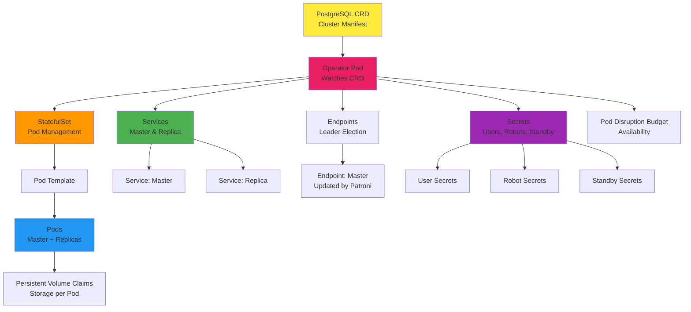

**Key Resources Created:**

1. **StatefulSet** - Manages PostgreSQL pods (master + replicas)
2. **Services** - Network abstraction:
   - Master service (points to current leader)
   - Replica service (points to all replicas)
3. **Endpoints** - Used by Patroni for leader election (Kubernetes-native DCS)
4. **Secrets** - Database credentials:
   - User secrets (application users)
   - Robot secrets (automated processes)
   - Standby secrets (replication users)
5. **Pod Disruption Budget** - Ensures availability during voluntary disruptions
6. **Persistent Volume Claims** - Storage for each pod

### Spilo Docker Image

**What is Spilo?**

Spilo is Zalando's production-ready PostgreSQL Docker image that combines:
- PostgreSQL (all supported versions in single image)
- Patroni (high availability management)
- Additional tools and extensions

**Spilo Components:**

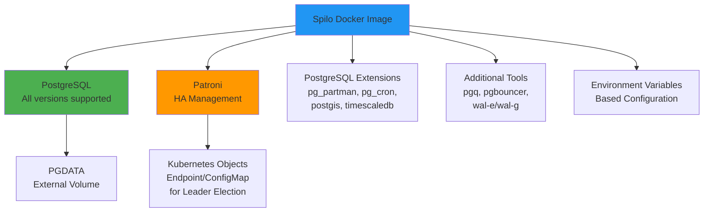

**Key Features:**
- **All PostgreSQL versions** in single image (version selection via environment variable)
- **Plenty of extensions** pre-installed (pg_partman, pg_cron, postgis, timescaledb, etc.)
- **Additional tools** (pgq, pgbouncer, wal-e/wal-g)
- **PGDATA on external volume** (persistent storage)
- **Patroni for HA** (automatic failover)
- **Environment-variables based configuration** (no config files needed)

### Patroni: High Availability for PostgreSQL

**What is Patroni?**

Patroni is an automatic failover solution for PostgreSQL:
- Python daemon that manages one PostgreSQL instance
- Uses Kubernetes objects (Endpoint or ConfigMap) for leader elections
- Makes PostgreSQL a **first-class citizen on Kubernetes**

**What Patroni Automates:**

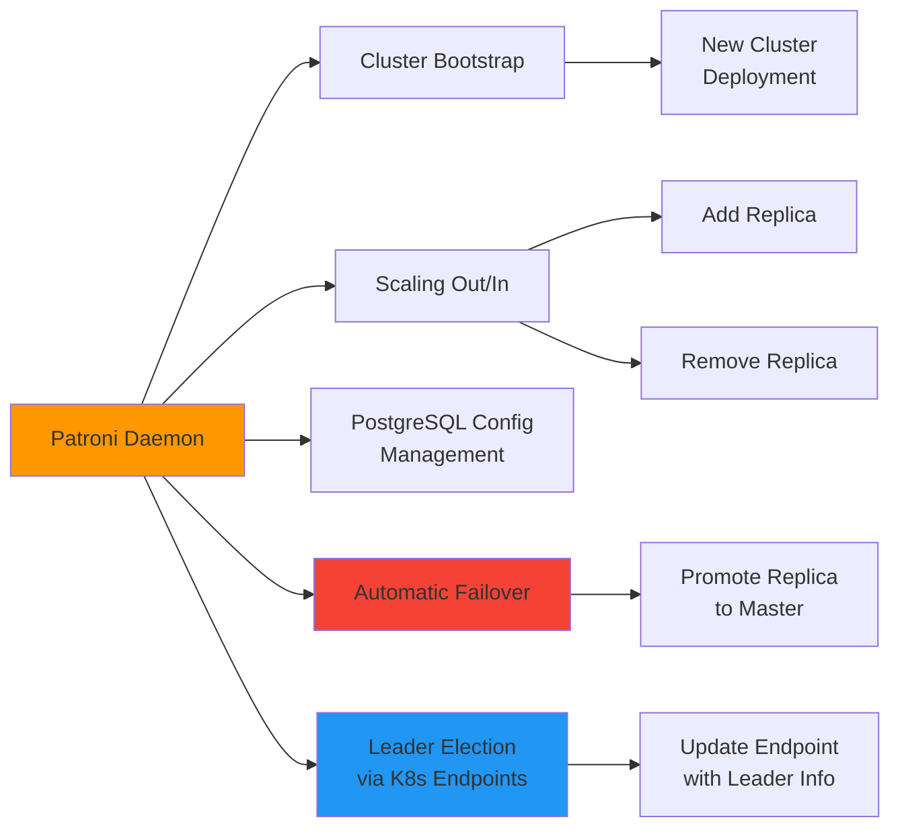

**Key Capabilities:**
- ✅ **Automatic failover** - Promotes replica to master if master fails
- ✅ **Cluster bootstrap** - Automates new cluster deployment
- ✅ **Scaling** - Adds/removes replicas automatically
- ✅ **Configuration management** - Manages PostgreSQL settings
- ✅ **Leader election** - Uses Kubernetes Endpoints/ConfigMap (no external etcd needed)

**How Patroni Works with Kubernetes:**

1. **Leader Election**: Patroni uses Kubernetes Endpoints as Distributed Configuration Store (DCS)
   - Master pod **UPDATE()**s the Endpoint with leader information
   - Replica pods **WATCH()** the Endpoint for leader changes
2. **No External etcd**: Kubernetes-native approach (uses K8s API)
3. **Automatic Failover**: If master pod fails, Patroni on replicas detects and promotes one to master

**Why Kubernetes Endpoints for Leader Election?**

Zalando chose Kubernetes Endpoints (or ConfigMap) as the Distributed Configuration Store (DCS) instead of external etcd for several key reasons:

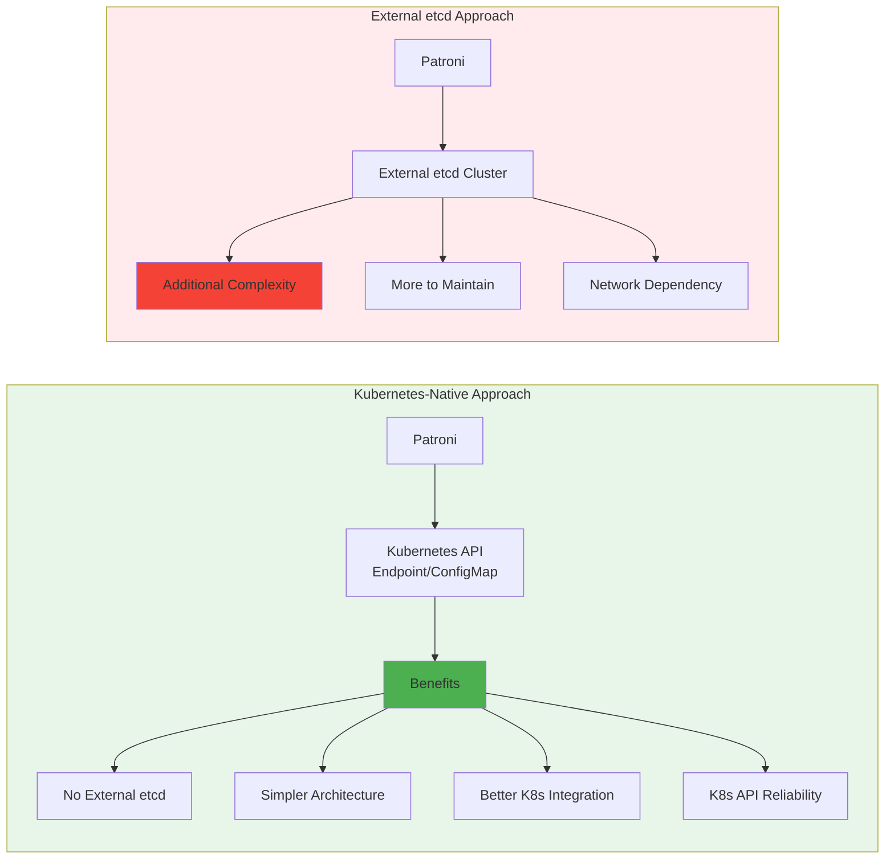

**Key Benefits:**

1. **No External Dependencies**
   - ✅ No need to deploy and maintain separate etcd cluster
   - ✅ Reduces infrastructure complexity
   - ✅ Fewer moving parts = fewer failure points
   - ✅ Lower operational overhead

2. **Kubernetes-Native Integration**
   - ✅ Uses existing Kubernetes API (already available)
   - ✅ Leverages Kubernetes' built-in reliability and HA
   - ✅ Automatic integration with Kubernetes networking
   - ✅ Works seamlessly with Kubernetes Service discovery

3. **Simpler Architecture**
   - ✅ One less component to manage
   - ✅ No network configuration for etcd
   - ✅ No etcd cluster sizing/planning needed
   - ✅ Easier to understand and troubleshoot

4. **Built-in Reliability**
   - ✅ Kubernetes API is highly available (control plane HA)
   - ✅ Automatic failover if API server fails
   - ✅ Consistent with Kubernetes patterns
   - ✅ No additional monitoring needed for etcd

5. **Resource Efficiency**
   - ✅ No additional etcd pods consuming resources
   - ✅ No etcd storage requirements
   - ✅ Lower overall resource footprint

**How Endpoints Work for Leader Election:**

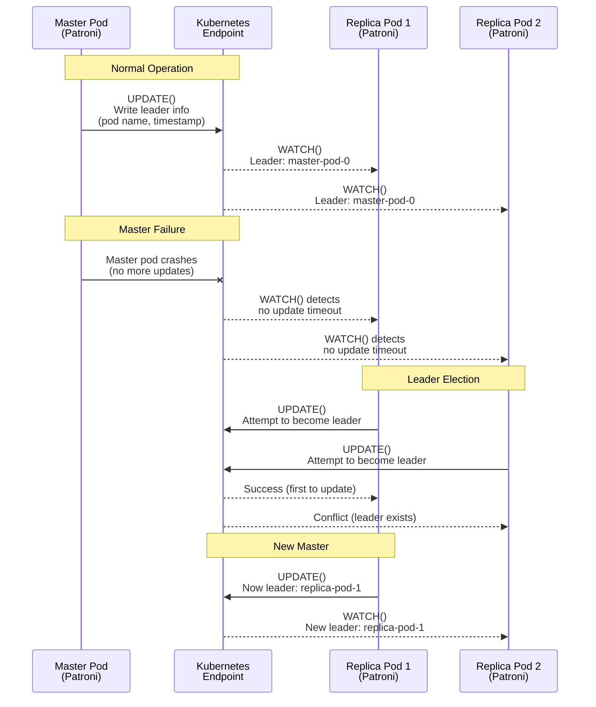

**Technical Details:**

1. **Endpoint Structure**: The Endpoint object contains:
   - Leader pod name/IP
   - Timestamp of last update
   - Cluster state information
   - Member list

2. **Atomic Operations**: Kubernetes API provides:
   - **Atomic updates** - Only one pod can update at a time
   - **Optimistic concurrency** - Uses resourceVersion for conflict detection
   - **Watch mechanism** - Real-time notifications of changes

3. **Failover Detection**:
   - Master pod updates Endpoint every few seconds (heartbeat)
   - If updates stop (pod crashed), replicas detect timeout
   - Replicas compete to update Endpoint (first wins = new leader)
   - Kubernetes API ensures only one succeeds (atomic operation)

**Comparison: Endpoints vs External etcd**

| Aspect | Kubernetes Endpoints | External etcd |
|--------|---------------------|----------------|
| **Deployment** | ✅ Already available (K8s API) | ❌ Need to deploy separately |
| **Complexity** | ✅ Simple (use existing API) | ❌ More complex (separate cluster) |
| **Maintenance** | ✅ No additional maintenance | ❌ Need to maintain etcd cluster |
| **Network** | ✅ Uses K8s networking | ❌ Need network access to etcd |
| **Reliability** | ✅ K8s API HA (control plane) | ⚠️ Depends on etcd cluster HA |
| **Resource Usage** | ✅ No additional resources | ❌ etcd pods consume resources |
| **Integration** | ✅ Native K8s integration | ⚠️ External dependency |
| **Learning Curve** | ✅ K8s developers familiar | ❌ Need etcd knowledge |

**Why Not ConfigMap?**

Patroni can also use ConfigMap instead of Endpoints:
- **Endpoints** (preferred): Designed for service discovery, better semantics
- **ConfigMap** (alternative): Works but less semantically correct

Both work, but Endpoints are more appropriate for leader election semantics.

**⚠️ Important: Kubernetes Endpoints API Deprecation (Kubernetes 1.35+)**

**Deprecation Timeline:**
- **Kubernetes 1.33**: Endpoints API deprecated
- **Kubernetes 1.35**: Endpoints API removed (replaced by EndpointSlices)

**🔑 Key Distinction: Có 2 Loại Endpoint Hoàn Toàn Khác Nhau!**

Có **2 loại Endpoint khác nhau** trong Kubernetes, và chúng phục vụ mục đích hoàn toàn khác nhau:

```mermaid
flowchart TD
    subgraph ServiceDiscovery["1. Service Discovery Endpoints<br/>(Bị Deprecated → EndpointSlices)"]
        Service[Kubernetes Service] --> AutoManaged[Control Plane<br/>Tự Động Quản Lý]
        AutoManaged --> TrackPods[Track Pod IPs<br/>cho Service]
        TrackPods --> LoadBalance[Load Balancing<br/>kube-proxy dùng]
        TrackPods --> Deprecated[⚠️ Deprecated K8s 1.33<br/>Removed K8s 1.35]
        Deprecated --> EndpointSlices[✅ Thay thế bởi<br/>EndpointSlices]
    end
    
    subgraph LeaderElection["2. Leader Election Endpoints<br/>(Patroni Dùng - KHÔNG Bị Deprecated)"]
        PatroniApp[Patroni Application] --> ManualManaged[Application<br/>Quản Lý Thủ Công]
        ManualManaged --> DCS[Distributed Config Store<br/>DCS]
        DCS --> StoreLeader[Lưu Leader Info<br/>Cluster State, Member List]
        DCS --> LeaderElection[Leader Election<br/>UPDATE/WATCH operations]
        LeaderElection --> NotDeprecated[✅ KHÔNG bị deprecated<br/>vì là application-level use]
    end
    
    style ServiceDiscovery fill:#ffebee
    style LeaderElection fill:#e8f5e9
    style Deprecated fill:#f44336
    style NotDeprecated fill:#4caf50
```

**1. Service Discovery Endpoints** (Bị Deprecated → EndpointSlices):
- **Mục đích**: Track Pod IPs cho Kubernetes Services
- **Ai quản lý**: Kubernetes control plane **tự động** quản lý
- **Cách hoạt động**: 
  - Khi Pod được tạo/xóa, control plane tự động update Endpoint
  - kube-proxy đọc Endpoint để route traffic
- **Ví dụ**: Service `postgres-master` → Endpoint chứa IP của master pod
- **Status**: ⚠️ **Deprecated K8s 1.33, Removed K8s 1.35** → Thay bằng EndpointSlices

**2. Leader Election Endpoints** (Patroni Dùng - KHÔNG Bị Deprecated):
- **Mục đích**: Dùng như Distributed Configuration Store (DCS) cho leader election
- **Ai quản lý**: **Patroni application quản lý thủ công** (không phải control plane)
- **Cách hoạt động**:
  - Patroni **UPDATE()** Endpoint với leader info (pod name, timestamp, cluster state)
  - Các replica pods **WATCH()** Endpoint để detect leader changes
  - Patroni tự quản lý lifecycle của Endpoint này
- **Ví dụ**: Endpoint `postgres-cluster-leader` chứa thông tin leader pod, cluster state
- **Status**: ✅ **KHÔNG bị deprecated** vì đây là application-level use, không phải service discovery

**Tại Sao Khác Nhau?**

| Aspect | Service Discovery Endpoints | Leader Election Endpoints |
|--------|----------------------------|---------------------------|
| **Mục đích** | Service routing (load balancing) | Leader election (coordination) |
| **Quản lý bởi** | Kubernetes control plane (tự động) | Application (Patroni - thủ công) |
| **Nội dung** | Pod IPs, ports | Leader info, cluster state, timestamps |
| **Cách sử dụng** | Read-only (kube-proxy đọc) | Read-write (Patroni UPDATE/WATCH) |
| **Lifecycle** | Tự động theo Pod lifecycle | Application quản lý |
| **Deprecated?** | ⚠️ Yes (K8s 1.35) | ✅ No (application-level use) |
| **Thay thế** | EndpointSlices | ConfigMap hoặc Lease API (tương lai) |

**Ví Dụ Cụ Thể:**

```yaml
# 1. Service Discovery Endpoint (Tự động, bị deprecated)
# Kubernetes tự động tạo khi có Service
apiVersion: v1
kind: Endpoints
metadata:
  name: postgres-master  # Tên giống Service
  namespace: database
subsets:
- addresses:
  - ip: 10.244.1.5  # Pod IP (tự động update)
  ports:
  - port: 5432
---
# 2. Leader Election Endpoint (Patroni quản lý, KHÔNG bị deprecated)
# Patroni tự tạo và quản lý
apiVersion: v1
kind: Endpoints
metadata:
  name: postgres-cluster-leader  # Tên do Patroni định nghĩa
  namespace: database
  annotations:
    # Patroni lưu leader info ở đây
    leader: "postgres-cluster-0"
    ttl: "30"
    # Cluster state, member list, etc.
```

**Kết Luận:**

- **Service Discovery Endpoints**: Bị deprecated vì control plane tự động quản lý, thay bằng EndpointSlices
- **Leader Election Endpoints**: **KHÔNG bị deprecated** vì Patroni quản lý thủ công (application-level)
- **Tuy nhiên**: Nếu Kubernetes 1.35+ **xóa hoàn toàn** Endpoints API, thì Patroni sẽ không thể dùng được nữa
- **Giải pháp**: Patroni có thể migrate sang ConfigMap (đã support) hoặc Lease API (tương lai)

**Current Status (as of 2025):**

**Patroni's Use of Endpoints:**
- Patroni currently uses Endpoints API for leader election (DCS)
- This is a **manual, application-level** use of Endpoints
- **Not the same** as service discovery Endpoints (which are auto-managed)

**Migration Paths:**

1. **Lease API** (Kubernetes 1.35+):
   - Kubernetes introduced **Coordinated Leader Election** (beta in 1.35)
   - Uses **Lease API** for leader election
   - Designed specifically for control plane components
   - **Potential future migration path** for Patroni

2. **EndpointSlices**:
   - EndpointSlices are designed for **service discovery**, not leader election
   - May not be suitable for Patroni's DCS use case
   - EndpointSlices are auto-managed by control plane (not application-managed)

3. **ConfigMap** (fallback):
   - Patroni already supports ConfigMap as DCS
   - ConfigMap API is **not deprecated**
   - Can serve as migration path if Endpoints API is removed

**Zalando/Patroni Response:**

**As of 2025:**
- **No official migration** to EndpointSlices or Lease API announced yet
- Patroni continues to use Endpoints API for leader election
- ConfigMap remains available as alternative DCS

**Future Considerations:**

1. **Kubernetes 1.35+ Compatibility:**
   - Patroni may need to migrate to Lease API or ConfigMap
   - Endpoints API removal may break Patroni's leader election
   - **Action Required**: Monitor Patroni/Zalando for migration plans

2. **Recommended Migration Path:**
   - **Short-term**: Use ConfigMap as DCS (already supported)
   - **Long-term**: Migrate to Lease API (if Patroni adds support)
   - **Monitor**: Zalando/Patroni GitHub for updates

3. **Configuration Option:**
   ```yaml
   # Patroni DCS configuration
   kubernetes:
     dcs: "kubernetes"
     kubernetes:
       # Current: Uses Endpoints API
       # Future: May support Lease API or ConfigMap
       namespace: "default"
   ```

**Best Practices:**

1. **Current Deployments (Kubernetes < 1.35):**
   - Continue using Endpoints API (works as expected)
   - Monitor Patroni/Zalando for migration announcements

2. **Future Deployments (Kubernetes 1.35+):**
   - **Option 1**: Use ConfigMap as DCS (if Endpoints removed)
   - **Option 2**: Wait for Patroni Lease API support
   - **Option 3**: Use external etcd (not recommended, loses K8s-native benefits)

3. **Monitoring:**
   - Track Patroni GitHub issues/PRs for EndpointSlices/Lease API support
   - Monitor Zalando Postgres Operator releases for updates
   - Check Kubernetes deprecation timeline

**References:**
- [Kubernetes Endpoints Deprecation Blog](https://kubernetes.io/blog/2025/04/24/endpoints-deprecation/)
- [Kubernetes Coordinated Leader Election](https://kubernetes.io/docs/concepts/cluster-administration/coordinated-leader-election/)
- [Patroni Kubernetes DCS Documentation](https://patroni.readthedocs.io/en/latest/kubernetes.html)

**Conclusion:**

Using Kubernetes Endpoints for leader election is a **Kubernetes-native design choice** that:
- Eliminates external dependencies
- Simplifies architecture
- Leverages existing Kubernetes infrastructure
- Reduces operational complexity
- Makes PostgreSQL a true "first-class citizen" on Kubernetes

**⚠️ Future Compatibility Note:**
- Endpoints API deprecation in Kubernetes 1.35 may require migration
- ConfigMap provides a fallback path (already supported by Patroni)
- Lease API may be the future standard for leader election
- **Action**: Monitor Patroni/Zalando for official migration guidance

This is why Zalando's approach is considered **production-ready** and **Kubernetes-native** - it fully embraces Kubernetes patterns rather than requiring external coordination systems. However, **future Kubernetes versions may require adaptation** to new APIs.

### Pod Architecture: What's Inside a Cluster Pod

Each PostgreSQL cluster pod contains Spilo, which includes Patroni and PostgreSQL:

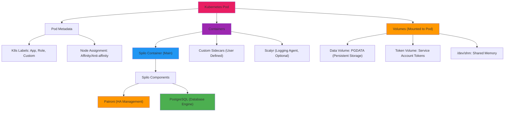

**Pod Components:**

1. **Spilo Container** (main):
   - **Patroni** - High availability daemon
   - **PostgreSQL** - Database engine
2. **Volumes**:
   - **Data** - PGDATA (persistent storage)
   - **Tokens** - Service account tokens
   - **/dev/shm** - Shared memory
3. **K8s Labels**:
   - **App** - Application identifier
   - **Role** - Master/replica role
   - **Custom** - User-defined labels
4. **Node Assignment**:
   - **Affinity** - Prefer certain nodes
   - **Anti-affinity** - Avoid certain nodes (spread across zones)
5. **Sidecars** (optional):
   - **Custom sidecars** - User-defined containers (e.g., postgres_exporter, backup tools)
   - **Scalyr** - Logging agent (optional)

### PostgreSQL Cluster Lifecycle

The operator manages the complete lifecycle of PostgreSQL clusters:

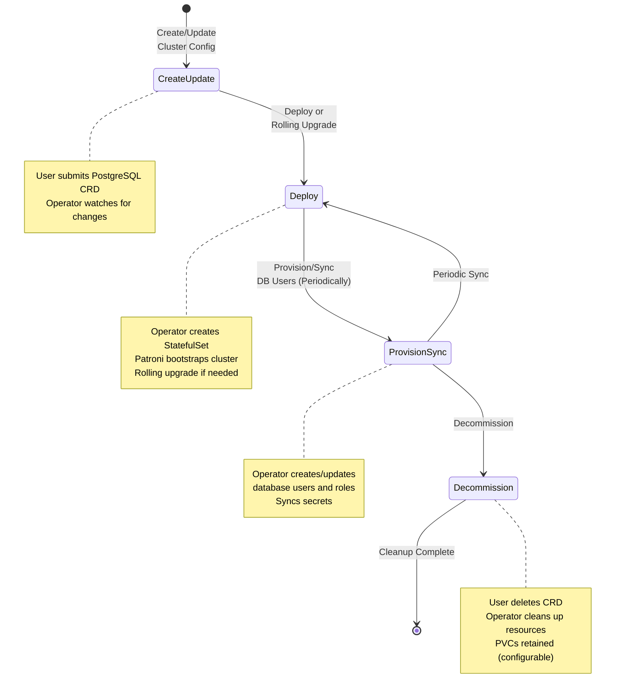

**Lifecycle Phases:**

1. **Create/Update Cluster Config**
   - User submits PostgreSQL CRD manifest
   - Operator watches for changes
   - Desired state defined in manifest

2. **Deploy or Rolling Upgrade**
   - Operator creates/updates StatefulSet
   - Patroni bootstraps new cluster OR performs rolling upgrade
   - Pods created one-by-one (StatefulSet ordered creation)

3. **Provision/Sync DB Users (Periodically)**
   - Operator periodically synchronizes actual state with desired state
   - Creates/updates database users and roles
   - Syncs Kubernetes Secrets with database passwords
   - Ensures users match manifest definition

4. **Decommission**
   - User deletes PostgreSQL CRD
   - Operator cleans up all managed resources
   - PVCs retained by default (configurable)

### Smart Rolling Upgrade Process

The Zalando Postgres Operator implements a **Smart Rolling Upgrade** strategy that intelligently handles node decommissioning and cluster migration across availability zones. This process ensures zero-downtime upgrades while maintaining high availability.

**When Rolling Upgrades Occur:**
- Docker image changes in operator configuration
- PostgreSQL version changes
- Configuration parameters change
- Node decommissioning (infrastructure updates)

**Smart Rolling Upgrade Strategy:**

The operator performs rolling upgrades in a multi-phase process:

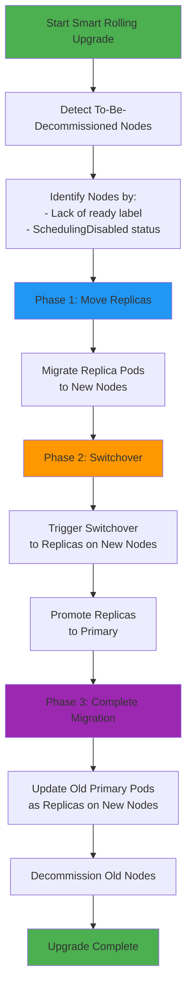

**Smart Rolling Upgrade Phases:**

**Phase 1: Start - Detect and Prepare**
- Operator detects nodes marked for decommissioning:
  - **Lack of `ready` label** - Node not ready for scheduling
  - **`SchedulingDisabled` status** - Node cordoned/drained
- New nodes are provisioned in each availability zone
- Initial state: Primaries and replicas on old nodes

**Phase 2: Step 1 - Move Replicas**
- Operator moves **replica pods** from old nodes to new nodes
- Replicas are migrated first (safer, no primary role change)
- Primaries remain on old nodes during this phase
- Replication continues from primaries to new replica locations

**Phase 3: Switchover - Promote Replicas**
- Operator triggers **switchover** to replicas on new nodes
- Patroni promotes selected replicas to primary role
- Old primaries become replicas
- Zero-downtime failover (Patroni handles transition)

**Phase 4: Finish - Complete Migration**
- All pods now running on new nodes
- Old nodes can be safely decommissioned
- All primaries distributed across new nodes in different AZs
- Cluster fully operational on new infrastructure

**Smart Rolling Upgrade Across 3 Availability Zones:**

```mermaid
flowchart TD
    subgraph StartPhase["Phase: Start"]
        subgraph AZ1Start[Availability Zone 1]
            Old1Start[Node: Old<br/>A primary<br/>B primary<br/>C replica]
            New1Start[Node: New<br/>Empty]
        end
        subgraph AZ2Start[Availability Zone 2]
            Old2Start[Node: Old<br/>A replica<br/>B replica<br/>C primary]
            New2Start[Node: New<br/>Empty]
        end
        subgraph AZ3Start[Availability Zone 3]
            Old3Start[Node: Old<br/>A replica<br/>B replica<br/>C replica]
            New3Start[Node: New<br/>Empty]
        end
    end
    
    subgraph Step1Phase["Phase: Step 1 - Move Replicas"]
        subgraph AZ1Step1[Availability Zone 1]
            Old1Step1[Node: Old<br/>A primary<br/>B primary]
            New1Step1[Node: New<br/>C replica]
        end
        subgraph AZ2Step1[Availability Zone 2]
            Old2Step1[Node: Old<br/>C primary]
            New2Step1[Node: New<br/>A replica<br/>B replica]
        end
        subgraph AZ3Step1[Availability Zone 3]
            New3Step1[Node: New<br/>A replica<br/>B replica<br/>C replica]
        end
    end
    
    subgraph SwitchoverPhase["Phase: Switchover"]
        subgraph AZ1Switch[Availability Zone 1]
            Old1Switch[Node: Old<br/>A replica<br/>B replica]
            New1Switch[Node: New<br/>C primary]
        end
        subgraph AZ2Switch[Availability Zone 2]
            Old2Switch[Node: Old<br/>C replica]
            New2Switch[Node: New<br/>A primary<br/>B replica]
        end
        subgraph AZ3Switch[Availability Zone 3]
            New3Switch[Node: New<br/>A replica<br/>B primary<br/>C replica]
        end
    end
    
    subgraph FinishPhase["Phase: Finish"]
        subgraph AZ1Finish[Availability Zone 1]
            New1Finish[Node: New<br/>A replica<br/>B replica<br/>C primary]
        end
        subgraph AZ2Finish[Availability Zone 2]
            New2Finish[Node: New<br/>A primary<br/>B replica<br/>C replica]
        end
        subgraph AZ3Finish[Availability Zone 3]
            New3Finish[Node: New<br/>A replica<br/>B primary<br/>C replica]
        end
    end
    
    StartPhase -->|Move Replicas| Step1Phase
    Step1Phase -->|Switchover| SwitchoverPhase
    SwitchoverPhase -->|Complete| FinishPhase
    
    style Old1Start fill:#ffebee
    style Old2Start fill:#ffebee
    style Old3Start fill:#ffebee
    style New1Start fill:#e8f5e9
    style New2Start fill:#e8f5e9
    style New3Start fill:#e8f5e9
```

**Key Benefits of Smart Rolling Upgrade:**

1. **Zero Downtime**: Primaries are switched over, not terminated
2. **Availability Zone Awareness**: Maintains distribution across AZs
3. **Intelligent Ordering**: Replicas moved first, then switchover, then cleanup
4. **Automatic Detection**: Uses Kubernetes node labels and status
5. **Patroni Integration**: Leverages Patroni's failover capabilities
6. **Safe Decommissioning**: Old nodes only removed after all pods migrated

**Rolling Upgrade Process Details:**

1. **Node Detection**: Operator identifies nodes to decommission by:
   - Missing `ready` label on node
   - Node status: `SchedulingDisabled` (cordoned/drained)

2. **Replica Migration**: 
   - Replica pods moved to new nodes first (lower risk)
   - Replication continues from primaries
   - No primary role changes in this phase

3. **Switchover Trigger**:
   - Operator triggers Patroni switchover
   - Replicas on new nodes promoted to primary
   - Old primaries become replicas
   - Patroni handles the transition automatically

4. **Complete Migration**:
   - All pods now on new nodes
   - Old nodes can be safely decommissioned
   - Cluster fully operational on new infrastructure

### Common Production Issues on Kubernetes

Based on Zalando's production experience running PostgreSQL on Kubernetes, here are the most common issues encountered and their solutions:

#### 1. AWS Infrastructure Problems

**AWS API Rate Limit Exceeded**

**Problem:**
- AWS API rate limits prevent or delay attaching/detaching persistent volumes (EBS) to/from Pods
- This delays recovery of failed Pods
- May delay deployment of new clusters

**Impact:**
- Pods cannot be rescheduled quickly
- Cluster recovery time increases
- New cluster deployments may fail or timeout

**Mitigation:**
- Monitor AWS API rate limit metrics
- Implement exponential backoff for EBS operations
- Consider using EBS CSI driver with proper rate limiting
- Use multiple availability zones to distribute load

**EC2 Instance Failures**

**Problem:**
- Sometimes EC2 instances fail and are shutdown by AWS
- Shutdown process can take a very long time
- All EBS volumes remain attached until instance is fully shut down
- Pods cannot be rescheduled until volumes are detached

**Impact:**
- Pods stuck on failed nodes cannot be rescheduled
- Cluster availability reduced
- Manual intervention may be required

**Mitigation:**
- Implement node health monitoring
- Use Pod Disruption Budgets (PDB) to maintain availability
- Configure automatic node replacement
- Monitor EBS volume attachment status

#### 2. Lack of Disk Space

**Problem:**
- Single volume used for PGDATA, pg_wal, and logs
- Error: `FATAL,53100,could not write to file "pg_wal/xlogtemp.22993": No space left on device`
- Usually ends with PostgreSQL self-shutdown
- Patroni tries to recover the primary which isn't running
- Results in "start→promote→No space left→shutdown" loop

**Root Causes:**

1. **Excessive Logging**
   - Slow queries logged
   - Human access logged
   - Application errors logged
   - Connections/disconnections logged

2. **pg_wal Growth**
   - `archive_command` is slow or failing
   - Unconsumed changes on replication slot
     - Replica not streaming? Replica slow?
     - Logical replication slot not consumed?
   - Checkpoints taking too long due to throttled IOPS

3. **PGDATA Growth**
   - Table and index bloat
     - Useless updates of unchanged data?
     - Autovacuum tuning? Consider Zheap?
   - Natural growth of data
     - Lack of retention policies?
     - Broken cleanup jobs?

**Why Not Auto-Extend Volumes?**

Auto-extending volumes doesn't solve the root cause:
- Logs will continue to grow
- pg_wal will continue to grow if archive/replication issues persist
- PGDATA bloat will continue
- Eventually hits volume size limits anyway

**Mitigation Strategies:**

1. **Separate Volumes**
   - Use separate volumes for PGDATA, pg_wal, and logs
   - Monitor each volume independently
   - Set appropriate size limits per volume type

2. **Log Management**
   - Configure log rotation
   - Set appropriate `log_min_duration_statement`
   - Disable unnecessary logging
   - Use log aggregation (e.g., Loki, ELK)

3. **WAL Management**
   - Monitor `archive_command` performance
   - Monitor replication lag
   - Monitor replication slot consumption
   - Set `max_wal_size` appropriately
   - Monitor checkpoint performance

4. **PGDATA Management**
   - Regular autovacuum tuning
   - Monitor table/index bloat
   - Implement data retention policies
   - Fix broken cleanup jobs
   - Consider partitioning for large tables

5. **Monitoring**
   - Disk space alerts (before 80% full)
   - WAL size monitoring
   - Replication slot monitoring
   - Log volume monitoring

#### 3. ORM Causing WAL-E Failures

**Problem:**
- `wal_e.main ERROR MSG: Attempted to archive a file that is too large`
- Error: `HINT: There is a file in the postgres database directory that is larger than 1610612736 bytes`
- File: `pg_stat/pg_stat_statements.stat.tmp` appears to be 2010822591 bytes

**Root Cause:**
- ORM (Object-Relational Mapping) generates inefficient queries
- Example problematic queries:
  ```sql
  UPDATE foo SET bar = $1 WHERE id IN ($2, $3, $4, …, $10500);
  UPDATE foo SET bar = $1 WHERE id IN ($2, $3, $4, …, $100500);
  ```
- These queries generate massive WAL entries
- `pg_stat_statements` statistics file grows very large
- WAL-E cannot archive files larger than 1.5GB

**Impact:**
- WAL archiving fails
- Backup chain broken
- Point-in-time recovery (PITR) may not work
- Disk space issues (WAL not archived)

**Mitigation:**

1. **Fix ORM Queries**
   - Batch updates properly
   - Use `UPDATE ... FROM` instead of `IN` clauses
   - Limit batch sizes
   - Use prepared statements efficiently

2. **pg_stat_statements Management**
   - Configure `pg_stat_statements.max` appropriately
   - Regularly reset statistics: `SELECT pg_stat_statements_reset()`
   - Monitor statistics file size

3. **WAL-E Configuration**
   - Increase WAL-E file size limits (if possible)
   - Monitor WAL-E archive failures
   - Implement alerts for archive failures

4. **Application-Level Fixes**
   - Review ORM query generation
   - Use database-level batch operations
   - Implement query optimization

#### 4. Out-of-Memory (OOM) Killer

**Problem:**
- PostgreSQL process killed by OOM killer
- Log shows: `server process (PID 10810) was terminated by signal 9: Killed`
- `dmesg` shows: `Memory cgroup out of memory: Kill process 14208 (postgres)`
- Memory accounting in containers is complex

**Challenges:**

1. **PID Mismatch**
   - PIDs in container (10810) and on host (14208) are different
   - Makes investigation difficult
   - Need to correlate container PID with host PID

2. **oom_score_adj Doesn't Help**
   - `oom_score_adj` trick doesn't really make sense in containers
   - Only Patroni + PostgreSQL running in container
   - No other processes to prioritize

3. **Unclear Memory Accounting**
   - Memory accounting in containers is complex:
     ```
     memory: usage 8388392kB, limit 8388608kB, failcnt 1
     cache:2173896KB rss:6019692KB rss_huge:0KB shmem:2173428KB 
     mapped_file:2173512KB dirty:132KB writeback:0KB swap:0KB 
     inactive_anon:15732KB active_anon:8177696KB inactive_file:320KB 
     active_file:184KB unevictable:0KB
     ```
   - Shared memory (`shmem`) counts toward limit
   - Cache vs RSS vs shared memory accounting unclear

**Mitigation Strategies:**

1. **Reduce shared_buffers**
   - Reduce from 25% to 20% of available memory
   - Leaves more headroom for other memory usage
   - Monitor actual memory usage after change

2. **Configure VM Dirty Limits**
   - Set `vm.dirty_background_bytes = 67108864` (64MB)
   - Set `vm.dirty_bytes = 134217728` (128MB)
   - **Note:** Can only be set per Node (not per Pod)
   - Requires node-level configuration or DaemonSet

3. **Memory Limits**
   - Set appropriate memory limits on Pods
   - Account for shared memory in limits
   - Leave headroom (don't set limit = exact usage)

4. **Monitoring**
   - Monitor container memory usage
   - Monitor OOM kill events
   - Alert on high memory usage (>80% of limit)
   - Monitor shared memory usage

5. **PostgreSQL Configuration**
   - Tune `shared_buffers` appropriately
   - Tune `work_mem` (per-query memory)
   - Tune `maintenance_work_mem`
   - Monitor `max_connections` (each connection uses memory)

**Production Recommendations:**

```yaml
# Example PostgreSQL memory configuration
postgresql:
  parameters:
    shared_buffers: "20% of available memory"  # Reduced from 25%
    work_mem: "4MB"  # Per-query memory
    maintenance_work_mem: "256MB"  # For VACUUM, CREATE INDEX
    max_connections: 100  # Limit connections
```

```yaml
# Node-level VM configuration (via DaemonSet or node configuration)
# vm.dirty_background_bytes = 67108864
# vm.dirty_bytes = 134217728
```

**Summary of Common Issues:**

| Issue | Impact | Mitigation Priority |
|-------|--------|---------------------|
| AWS API Rate Limits | High - Delays recovery | Monitor, backoff, multiple AZs |
| EC2 Instance Failures | High - Pods stuck | Node health monitoring, PDB |
| Disk Space (Logs) | Medium - PostgreSQL shutdown | Log rotation, separate volumes |
| Disk Space (WAL) | High - Backup chain broken | Monitor archive, replication slots |
| Disk Space (PGDATA) | Medium - Growth issues | Autovacuum, retention policies |
| ORM WAL-E Failures | High - Backup failures | Fix ORM queries, monitor stats |
| OOM Killer | High - Process killed | Reduce shared_buffers, VM tuning |

**Best Practices for Production:**

1. **Monitoring**
   - Disk space (all volumes)
   - Memory usage (container and host)
   - AWS API rate limits
   - WAL archiving status
   - Replication slot consumption

2. **Configuration**
   - Separate volumes for PGDATA, pg_wal, logs
   - Appropriate memory limits with headroom
   - Node-level VM tuning (dirty limits)
   - Log rotation and retention

3. **Application**
   - Optimize ORM queries
   - Batch operations properly
   - Monitor query performance

4. **Infrastructure**
   - Multiple availability zones
   - Pod Disruption Budgets
   - Node health monitoring
   - Automatic node replacement

### Operator Configuration Watching

The operator watches its own configuration and alters running clusters if necessary:

**Configuration Sources:**
1. **OperatorConfiguration CRD** (preferred) - Declarative operator config
2. **ConfigMap** (legacy) - Operator configuration in ConfigMap
3. **Helm Values** - When deployed via Helm chart

**What Triggers Changes:**
- Docker image changes → Rolling update
- Connection pooler settings → Update pooler pods
- PostgreSQL parameters → Update cluster configs
- Resource limits → Update pod specs

**Configuration Priority:**
1. OperatorConfiguration CRD (highest)
2. ConfigMap (if CRD not used)
3. Helm values (applied during deployment)

---

## Codebase Analysis

### Current Implementation

**Location:** `scripts/04b-sync-supporting-db-secrets.sh`

**How it works:**
- Waits for Zalando operator to create secrets in `user` namespace
- Copies secrets to `notification` and `shipping` namespaces using `kubectl get secret ... -o yaml | sed ... | kubectl apply`
- Removes metadata fields (`resourceVersion`, `uid`, `creationTimestamp`) to allow cross-namespace creation

**Current Secret Names:**
- `notification.supporting-db.credentials.postgresql.acid.zalan.do` (in `user` namespace, synced to `notification`)
- `shipping.supporting-db.credentials.postgresql.acid.zalan.do` (in `user` namespace, synced to `shipping`)

**Current Operator Configuration:**

**File:** `k8s/postgres-operator/zalando/values.yaml`

**Note:** The following shows the OLD incorrect structure (for reference). See "CRITICAL: Helm Values Structure Issue" section below for correct structure.

```yaml
# OLD (INCORRECT) - DO NOT USE
config:
  kubernetes:
    cluster_name: "kind-cluster"  # ❌ WRONG: Should be cluster_domain
  postgresql:
    parameters:  # ❌ WRONG: configPostgresql.parameters doesn't exist in operator config
      # ... PostgreSQL parameters (these are set in CRDs, not operator config)
  connection_pooler:
    default_parameters:  # ❌ WRONG: configConnectionPooler.default_parameters doesn't exist
      # ... PgBouncer settings
  backup:  # ❌ WRONG: Should be configAwsOrGcp
    wal_s3_bucket: ""
  enable_pgversion_env_var: true
```

**Correct Structure (per official Helm chart):**
```yaml
# CORRECT - Use this structure
configKubernetes:
  cluster_domain: cluster.local  # ✅ Correct field name
  enable_cross_namespace_secret: true

configConnectionPooler:
  connection_pooler_schema: "pooler"  # ✅ Direct fields, not nested
  connection_pooler_user: "pooler"
  connection_pooler_mode: "transaction"
  connection_pooler_number_of_instances: 2
  # ... other direct fields

configAwsOrGcp:  # ✅ Correct section name
  aws_region: eu-central-1
  wal_s3_bucket: ""

configGeneral:
  enable_pgversion_env_var: true

# Note: configPostgresql.parameters does NOT exist
# PostgreSQL parameters are set per-cluster in CRDs (postgresql resources)
```

**Missing Configuration:**
- No `enable_cross_namespace_secret` setting
- No `secret_name_template` customization
- No operator-level secret management configuration

**Database CRD:**

**File:** `k8s/postgres-operator-zalando/crds/supporting-db.yaml`

```yaml
apiVersion: acid.zalan.do/v1
kind: postgresql
metadata:
  name: supporting-db
  namespace: user  # Cluster in user namespace
spec:
  databases:
    user: user
    notification: notification
    shipping: shipping
  users:
    user: - createdb
    notification: - createdb
    shipping: - createdb
```

**No per-user secret namespace configuration** - all secrets created in cluster namespace (`user`)

### Reusable Patterns

**Pattern: Manual Secret Sync**
- Current approach: Script-based sync after operator creates secrets
- Pros: Simple, explicit, works with any operator version
- Cons: Requires manual script, potential timing issues, not declarative

**Pattern: Operator Configuration**
- Potential approach: Configure operator to create secrets in target namespaces
- Pros: Declarative, automatic, no sync script needed
- Cons: Requires operator configuration changes, may need migration

---

## External Solutions

### Option 1: Enable Zalando Operator Cross-Namespace Secret Feature

**What it is:** Built-in Zalando Postgres Operator feature that allows secrets to be created in different namespaces using `enable_cross_namespace_secret` and `secret_name_template`.

**How it works:**
1. Enable `enable_cross_namespace_secret: true` in operator ConfigMap or OperatorConfiguration CRD
2. Configure `secret_name_template` with `{namespace}` placeholder: `{namespace}.{username}.{cluster}.credentials.{tprkind}.{tprgroup}`
3. Operator creates secrets directly in target namespaces based on user name pattern

**Documentation References:**
- User-provided info: `secret_name_template` supports `{namespace}` placeholder when `enable_cross_namespace_secret` is enabled
- Default template: `{namespace}.{username}.{cluster}.credentials.{tprkind}.{tprgroup}`
- Without cross-namespace: `{username}.{cluster}.credentials.{tprkind}.{tprgroup}`

**Pros:**
- ✅ Native operator support - no custom scripts needed
- ✅ Declarative configuration
- ✅ Automatic secret creation in correct namespaces
- ✅ No timing issues (operator handles it)
- ✅ Secrets stay in sync automatically (operator manages them)

**Cons:**
- ⚠️ Requires operator configuration changes (ConfigMap or OperatorConfiguration CRD)
- ⚠️ May need to migrate existing secrets
- ⚠️ Secret name format changes (includes namespace prefix)
- ⚠️ Need to update Helm values to reference new secret names
- ⚠️ Requires understanding of secret name template format
- ⚠️ All secrets created by operator will use cross-namespace pattern (global setting)

**Implementation Complexity:** Medium
- Need to update operator ConfigMap/CRD
- Update Helm values for secret references
- Test secret creation and access
- Potentially migrate existing secrets

**Team familiarity:** Low (new feature, needs research)

**Fit for our use case:** High - This is exactly what we need, but requires configuration changes

### Option 2: Keep Manual Secret Sync (Current Approach)

**What it is:** Script-based approach that copies secrets after operator creates them.

**Pros:**
- ✅ Already implemented and working
- ✅ No operator configuration changes needed
- ✅ Works with any operator version
- ✅ Explicit control over which secrets are synced
- ✅ Can customize sync logic per secret

**Cons:**
- ❌ Requires manual script execution
- ❌ Potential timing issues (secrets may not exist when script runs)
- ❌ Not declarative (imperative sync)
- ❌ Secrets can get out of sync if operator updates them
- ❌ Additional maintenance burden

**Implementation Complexity:** Low (already done)

**Team familiarity:** High (we built it)

**Fit for our use case:** Medium - Works but not elegant

### Option 3: Kubernetes Replicator Operator

**What it is:** Third-party operator that automatically replicates secrets/configmaps across namespaces using annotations.

**How it works:**
1. Install Kubernetes Replicator operator
2. Annotate source secret: `replicator.v1.mittwald.de/replicate-to: notification,shipping`
3. Operator automatically syncs secrets to target namespaces

**Pros:**
- ✅ Declarative (annotation-based)
- ✅ Automatic sync
- ✅ Works for any secret, not just Zalando-generated
- ✅ Handles updates automatically

**Cons:**
- ❌ Additional operator to install and maintain
- ❌ External dependency
- ❌ May conflict with Zalando operator's secret management
- ❌ Overkill for this specific use case

**Implementation Complexity:** Medium
- Install replicator operator
- Annotate secrets
- Test sync behavior

**Team familiarity:** Low (new tool)

**Fit for our use case:** Low - Adds complexity for a problem Zalando operator can solve natively

### Option 4: External Secrets Operator

**What it is:** Operator for managing secrets from external secret management systems (Vault, AWS Secrets Manager, etc.)

**Pros:**
- ✅ Centralized secret management
- ✅ Integration with external secret stores
- ✅ Cross-namespace secret access

**Cons:**
- ❌ Overkill for this use case
- ❌ Requires external secret store setup
- ❌ Additional operator to maintain
- ❌ Doesn't solve Zalando operator secret location issue

**Implementation Complexity:** High

**Team familiarity:** Low

**Fit for our use case:** Low - Too complex for this specific problem

---

## Comparison Matrix

| Criteria | Option 1: Zalando Native | Option 2: Manual Sync | Option 3: Replicator | Option 4: External Secrets |
|----------|-------------------------|----------------------|---------------------|---------------------------|
| **Native Support** | ⭐⭐⭐⭐⭐ | ⭐⭐ | ⭐⭐⭐ | ⭐⭐ |
| **Complexity** | ⭐⭐⭐ | ⭐⭐⭐⭐⭐ | ⭐⭐⭐ | ⭐ |
| **Maintenance** | ⭐⭐⭐⭐⭐ | ⭐⭐ | ⭐⭐⭐ | ⭐⭐ |
| **Declarative** | ⭐⭐⭐⭐⭐ | ⭐ | ⭐⭐⭐⭐ | ⭐⭐⭐⭐ |
| **Automatic Sync** | ⭐⭐⭐⭐⭐ | ⭐⭐ | ⭐⭐⭐⭐⭐ | ⭐⭐⭐⭐ |
| **Team Familiarity** | ⭐⭐ | ⭐⭐⭐⭐⭐ | ⭐ | ⭐ |
| **Dependencies** | ⭐⭐⭐⭐⭐ | ⭐⭐⭐⭐⭐ | ⭐⭐⭐ | ⭐⭐ |
| **Fit for Use Case** | ⭐⭐⭐⭐⭐ | ⭐⭐⭐ | ⭐⭐ | ⭐ |

---

## Detailed Analysis: Zalando Cross-Namespace Secret Feature

### How It Works

Based on user research and Zalando operator documentation:

1. **Operator Configuration:**
   ```yaml
   # In operator ConfigMap or OperatorConfiguration CRD
   enable_cross_namespace_secret: true  # Feature flag: enables cross-namespace secret creation
   ```
   
   **Note:** `secret_name_template` is NOT required. The operator uses the default template automatically: `{namespace}.{username}.{clustername}.credentials.postgresql.acid.zalan.do`

2. **User Configuration Format:**
   - Users must be defined with namespace notation: `namespace.username` (dot notation, not `@`)
   - Anything **before the first dot** is the namespace
   - Text **after the first dot** is the username
   - Example: `notification.notification` → namespace: `notification`, username: `notification`
   - Example: `appspace.db_user` → namespace: `appspace`, username: `db_user`

3. **Database Configuration:**
   - Database section must also use the same format: `app_db: appspace.db_user`
   - The database owner must match the user format exactly

4. **Secret Name Format:**
   - Format: `{namespace}.{username}.{clustername}.credentials.postgresql.acid.zalan.do`
   - Example: `notification.notification.supporting-db.credentials.postgresql.acid.zalan.do`
   - Secret is created in the namespace specified in the user name (before the first dot)
   - Postgres role name will be: `namespace.username` (e.g., `notification.notification`)

### Configuration Examples

**Example 1: ConfigMap Configuration (Legacy)**

```yaml
# k8s/postgres-operator-zalando/configmap.yaml
apiVersion: v1
kind: ConfigMap
metadata:
  name: postgres-operator
  namespace: database
data:
  enable_cross_namespace_secret: "true"
```

**Example 2: OperatorConfiguration CRD (Recommended)**

```yaml
# k8s/postgres-operator-zalando/operator-configuration.yaml
apiVersion: "acid.zalan.do/v1"
kind: OperatorConfiguration
metadata:
  name: postgresql-operator-configuration
  namespace: database
configuration:
  kubernetes:
    enable_cross_namespace_secret: true
```

**Note:** The `secret_name_template` is NOT required in the configuration. The operator uses the default template: `{namespace}.{username}.{clustername}.credentials.postgresql.acid.zalan.do` when `enable_cross_namespace_secret` is enabled.

### Advanced: Custom Secret Name Template

**What is `secret_name_template`?**

`secret_name_template` is an **advanced configuration option** that allows customization of the secret naming pattern generated by the Zalando operator. It's a higher-level feature than `enable_cross_namespace_secret` - you can customize the entire secret name structure.

**When to use:**
- Custom secret naming conventions required by your organization
- Integration with external secret management systems that expect specific naming patterns
- Multi-tenant environments with complex namespace structures
- Compliance requirements for secret naming

**Template Placeholders:**

| Placeholder | Description | Example Value |
|-------------|-------------|---------------|
| `{namespace}` | Namespace name (only used when `enable_cross_namespace_secret: true`) | `notification` |
| `{username}` | Database username (extracted from `namespace.username` format) | `notification` (from `notification.notification`) |
| `{cluster}` | PostgreSQL cluster name | `supporting-db` |
| `{tprkind}` | CRD kind (formerly TPR - Third Party Resource) | `postgresql` |
| `{tprgroup}` | CRD API group | `acid.zalan.do` |

**Default Template:**
```
{namespace}.{username}.{cluster}.credentials.{tprkind}.{tprgroup}
```

**Example with default template:**
- User: `notification.notification`
- Cluster: `supporting-db`
- Result: `notification.notification.supporting-db.credentials.postgresql.acid.zalan.do`

**Custom Template Example:**

If you need a different naming pattern (e.g., for External Secrets Operator integration):

```yaml
# OperatorConfiguration CRD
apiVersion: "acid.zalan.do/v1"
kind: OperatorConfiguration
metadata:
  name: postgresql-operator-configuration
  namespace: database
configuration:
  kubernetes:
    enable_cross_namespace_secret: true
    secret_name_template: "{namespace}/{username}-{cluster}-db-credentials"
```

**Result with custom template:**
- User: `notification.notification`
- Cluster: `supporting-db`
- Result: `notification/notification-supporting-db-db-credentials`

**Important Notes:**
- ⚠️ **Only these 5 placeholders are allowed**: `{namespace}`, `{username}`, `{cluster}`, `{tprkind}`, `{tprgroup}`
- ⚠️ **No other placeholders** can be used in the template
- ⚠️ **Global setting**: Applies to ALL clusters managed by the operator
- ⚠️ **Namespace placeholder behavior**: `{namespace}` is only replaced when `enable_cross_namespace_secret: true`. Otherwise, secrets are created in the cluster's namespace and `{namespace}` is ignored or replaced with cluster namespace.

**Relationship with `enable_cross_namespace_secret`:**

- **Without `enable_cross_namespace_secret`**: `{namespace}` placeholder is ignored or uses cluster namespace
- **With `enable_cross_namespace_secret`**: `{namespace}` placeholder is replaced with the namespace from `namespace.username` format
- **Custom template**: Can be used with or without `enable_cross_namespace_secret`, but `{namespace}` only works when cross-namespace is enabled

**For our use case:**

We **do NOT need** to customize `secret_name_template` because:
- ✅ Default template works perfectly: `{namespace}.{username}.{cluster}.credentials.{tprkind}.{tprgroup}`
- ✅ Standard format is compatible with all Kubernetes tools
- ✅ No external secret management system requirements yet
- ✅ Simpler configuration (fewer moving parts)

**Future consideration:**

If we integrate with External Secrets Operator or Vault in the future, we might customize the template to match their expected naming patterns. See `Feature.md` for External Secrets Operator integration planning.

**Database CRD Example:**

```yaml
# k8s/postgres-operator-zalando/crds/supporting-db.yaml
apiVersion: acid.zalan.do/v1
kind: postgresql
metadata:
  name: supporting-db
  namespace: user
spec:
  teamId: "platform"
  databases:
    user: user
    notification: notification.notification  # namespace.username format
    shipping: shipping.shipping              # namespace.username format
  users:
    user:
    - createdb
    notification.notification:  # namespace.username format - secret created in notification namespace
    - createdb
    shipping.shipping:            # namespace.username format - secret created in shipping namespace
    - createdb
```

**Secret Names Generated:**
- `notification.notification.supporting-db.credentials.postgresql.acid.zalan.do` (in `notification` namespace)
- `shipping.shipping.supporting-db.credentials.postgresql.acid.zalan.do` (in `shipping` namespace)

### Implementation Requirements

**Step 1: Update Operator Configuration**

Choose one of the configuration methods above (ConfigMap or OperatorConfiguration CRD).

**Step 2: Update Database CRD**

Update `supporting-db.yaml` with namespace notation format (`namespace.username`):
```yaml
users:
  notification.notification:  # Format: namespace.username (anything before first dot = namespace)
    - createdb
  shipping.shipping:            # Format: namespace.username
    - createdb
databases:
  notification: notification.notification  # Must match user format
  shipping: shipping.shipping            # Must match user format
```

**Step 3: Update Helm Values**

Update secret references to match new format:
```yaml
# charts/values/notification.yaml
env:
  - name: DB_PASSWORD
    valueFrom:
      secretKeyRef:
        name: notification.notification.supporting-db.credentials.postgresql.acid.zalan.do
        key: password
```

**Step 4: Migration**

- Delete old secrets in `user` namespace (if needed)
- Let operator recreate secrets in correct namespaces
- Update all Helm values files

### Potential Issues

1. **CRITICAL: Helm Values Structure Issue** (Discovered 2025-12-30, Refined 2026-01-02)
   - **Problem**: Current `k8s/postgres-operator/zalando/values.yaml` uses incorrect field names and structure that don't match official Helm chart
   - **Root Cause**: Helm chart expects flat structure with specific field names matching official chart defaults
   - **Impact**: Helm deployment shows warnings and operator may not read configuration correctly
   
   **Specific Issues Found:**
   
   a) **configKubernetes.cluster_name** - Invalid field name
   - **WRONG**: `cluster_name: "kind-cluster"`
   - **CORRECT**: `cluster_domain: cluster.local`
   - **Reason**: Official Helm chart uses `cluster_domain` (DNS domain), not `cluster_name`
   
   b) **configConnectionPooler.default_parameters** - Invalid nested structure
   - **WRONG**:
     ```yaml
     configConnectionPooler:
       default_parameters:
         pool_mode: "transaction"
         max_client_conn: "100"
     ```
   - **CORRECT**: Direct fields (no nested structure)
     ```yaml
     configConnectionPooler:
       connection_pooler_schema: "pooler"
       connection_pooler_user: "pooler"
       connection_pooler_mode: "transaction"
       connection_pooler_number_of_instances: 2
       connection_pooler_max_db_connections: 60
       connection_pooler_default_cpu_request: 500m
       connection_pooler_default_memory_request: 100Mi
       # ... other direct fields
     ```
   - **Reason**: Official Helm chart uses direct fields, not nested `default_parameters` structure
   
   c) **configPostgresql.parameters** - Does not exist in operator config
   - **WRONG**: 
     ```yaml
     configPostgresql:
       parameters:
         max_connections: "100"
         shared_buffers: "128MB"
     ```
   - **CORRECT**: Remove this section entirely
   - **Reason**: PostgreSQL parameters are set **per-cluster in CRDs** (postgresql resources), NOT in operator config
   - **Where to set**: In CRD files like `k8s/postgres-operator/zalando/crds/auth-db.yaml`:
     ```yaml
     spec:
       postgresql:
         parameters:
           max_connections: "200"
           shared_buffers: "512MB"
     ```
   
   d) **configBackup** - Invalid section name
   - **WRONG**: `configBackup:`
   - **CORRECT**: `configAwsOrGcp:`
   - **Reason**: Official Helm chart uses `configAwsOrGcp` for backup configuration (supports AWS, GCP, Azure)
   
   **Correct Structure (per official Helm chart):**
   ```yaml
   configKubernetes:
     cluster_domain: cluster.local  # ✅ Correct field name
     enable_cross_namespace_secret: true
   
   configConnectionPooler:
     connection_pooler_schema: "pooler"  # ✅ Direct fields
     connection_pooler_user: "pooler"
     connection_pooler_mode: "transaction"
     connection_pooler_number_of_instances: 2
     connection_pooler_max_db_connections: 60
     connection_pooler_default_cpu_request: 500m
     connection_pooler_default_memory_request: 100Mi
     connection_pooler_default_cpu_limit: "1"
     connection_pooler_default_memory_limit: 100Mi
   
   configAwsOrGcp:  # ✅ Correct section name
     aws_region: eu-central-1
     wal_s3_bucket: ""  # Leave empty for no backup
   
   configGeneral:
     enable_pgversion_env_var: true
   
   # Note: configPostgresql.parameters does NOT exist
   # PostgreSQL parameters are set per-cluster in CRDs
   ```
   
   - **Fix**: Restructure `values.yaml` to match official Helm chart structure with correct field names
   - **Reference**: Official Helm chart values.yaml (confirmed via `helm show values postgres-operator/postgres-operator`)
   - **Image Update**: Use `ghcr.io/zalando/postgres-operator:v1.15.1` (official multi-arch image)
   - **Warnings Fixed**: After fix, Helm deployment shows no warnings:
     - ✅ `Warning: unknown field "configuration.connection_pooler.default_parameters"` → Fixed
     - ✅ `Warning: unknown field "configuration.kubernetes.cluster_name"` → Fixed

2. **Secret Name Changes**: All secret names will change format
   - Old: `notification.supporting-db.credentials.postgresql.acid.zalan.do`
   - New: `notification.notification.supporting-db.credentials.postgresql.acid.zalan.do`
   - Impact: Need to update all Helm values

3. **Global Setting**: `enable_cross_namespace_secret` affects ALL clusters managed by operator
   - May impact `auth-db` and `review-db` clusters
   - Need to verify if they still work correctly

4. **Namespace Inference**: Need to understand how operator determines target namespace
   - From user name pattern?
   - From explicit `user@namespace` notation?
   - From secret name template?

5. **Version Compatibility**: ✅ CONFIRMED - v1.15.0/v1.15.1 supports this feature
   - Feature is available in v1.15.0 (confirmed via [official documentation](https://postgres-operator.readthedocs.io/en/latest/user/))
   - Bugfix #2912 in v1.15.0 fixes secret creation in other namespaces when using preparedDatabases and OwnerReference
   - Recommended: Use v1.15.1 (latest stable, includes bugfixes)

---

## Zalando Operator Role Types: Complete Overview

The Zalando Postgres Operator supports **three distinct types of database roles**, each serving different purposes:

### Role Type Comparison

| Role Type | Purpose | Authentication | K8s Secrets | Use Case |
|-----------|---------|---------------|-------------|----------|
| **Manifest Roles** | Application users | Password (from K8s secret) | ✅ Yes | Microservices connecting to databases |
| **Infrastructure Roles** | System users | Password (from K8s secret) | ✅ Yes | Monitoring, backups, admin tools |
| **Teams API Roles** | Human users (developers) | OAuth2 token | ❌ No | Developers accessing databases for debugging |

### 1. Manifest Roles (Application Users)

**What they are:** Database users defined directly in the PostgreSQL cluster manifest (`spec.users` section).

**Current implementation:** We use manifest roles for all microservices:
- `user`, `notification.notification`, `shipping.shipping` in `supporting-db`
- `auth` in `auth-db`
- `review` in `review-db`

**Characteristics:**
- ✅ Defined in cluster CRD manifest
- ✅ Operator generates random passwords
- ✅ Passwords stored in Kubernetes secrets
- ✅ Secrets follow naming: `{namespace}.{username}.{cluster}.credentials.postgresql.acid.zalan.do`
- ✅ Services use `secretKeyRef` to access passwords

**Example:**
```yaml
spec:
  users:
    notification.notification:  # Manifest role
      - createdb
```

### 2. Infrastructure Roles (System Users)

**What they are:** Database users that should exist on **every** PostgreSQL cluster managed by the operator (e.g., monitoring users, backup users).

**Characteristics:**
- ✅ Defined globally in operator configuration (not per-cluster)
- ✅ Created automatically on all clusters
- ✅ Passwords stored in Kubernetes secrets (referenced from operator config)
- ✅ Used for system-level operations (monitoring, backups)

**Configuration:**
```yaml
# OperatorConfiguration CRD
apiVersion: "acid.zalan.do/v1"
kind: OperatorConfiguration
metadata:
  name: postgresql-operator-configuration
configuration:
  kubernetes:
    infrastructure_roles_secrets:
    - secretname: "postgresql-monitoring-user"
      userkey: "username"
      passwordkey: "password"
```

**Use case:** Monitoring tools (postgres_exporter) that need access to all databases.

**Production-Ready Example: Monitoring User**

**Step 1: Create Monitoring User Secret**

```yaml
# k8s/secrets/postgresql-monitoring-user.yaml (create manually, gitignored)
apiVersion: v1
kind: Secret
metadata:
  name: postgresql-monitoring-user
  namespace: database  # Same namespace as operator
type: Opaque
data:
  username: cG9zdGdyZXNfbW9uaXRvcmluZw==  # base64: postgres_monitoring
  password: <base64-encoded-password>      # Generate strong password
```

**Step 2: Configure Infrastructure Role in OperatorConfiguration**

```yaml
# k8s/postgres-operator-zalando/operator-configuration.yaml
apiVersion: "acid.zalan.do/v1"
kind: OperatorConfiguration
metadata:
  name: postgresql-operator-configuration
  namespace: database
configuration:
  kubernetes:
    enable_cross_namespace_secret: true
    infrastructure_roles_secrets:
    - secretname: "postgresql-monitoring-user"
      userkey: "username"
      passwordkey: "password"
```

**Step 3: Configure postgres_exporter to Use Monitoring User**

```yaml
# k8s/postgres-exporter/values.yaml (update existing)
config:
  datasource:
    host: ${DB_HOST}  # Will be set per cluster
    port: "5432"
    database: postgres
    user: postgres_monitoring  # Infrastructure role username
    password: ${DB_PASSWORD}  # From secret
```

**Step 4: Create Secret for postgres_exporter**

```yaml
# k8s/secrets/postgres-exporter-auth-db-secret.yaml
apiVersion: v1
kind: Secret
metadata:
  name: postgres-exporter-auth-db-secret
  namespace: monitoring
type: Opaque
data:
  password: <same-password-as-infrastructure-secret>  # Same password
```

**Result:**
- ✅ Monitoring user `postgres_monitoring` created on **all 5 clusters** automatically
- ✅ Same password across all clusters (from infrastructure secret)
- ✅ postgres_exporter can connect to any cluster using same credentials
- ✅ No need to configure per-cluster monitoring users

**Benefits:**
- ✅ **Consistent credentials** - Same user/password for all clusters
- ✅ **Automatic creation** - Operator creates role on every cluster
- ✅ **Centralized management** - Update password in one place
- ✅ **Production-ready** - Standard pattern for monitoring tools

### 3. Teams API Roles (Human Users / Developers) - Basic Approach

**What they are:** Database login roles for **human users** (developers, DBAs) who need to access databases for debugging, troubleshooting, or data analysis.

**Key difference:** These roles use **OAuth2 token authentication** instead of passwords stored in Kubernetes secrets.

**Characteristics:**
- ✅ Created automatically from Teams API (not defined in manifests)
- ✅ No Kubernetes secrets created (OAuth2 token-based auth)
- ✅ Operator queries Teams API to get team members
- ✅ Roles created for all members of the **owning team** (from `teamId` in cluster manifest)
- ✅ **Global setting** - applies to all clusters owned by the team
- ✅ Can grant superuser privileges to team members
- ✅ Supports PAM (Pluggable Authentication Modules) for OAuth2

**Limitations (Basic Approach):**
- ⚠️ **Only creates roles for owning team** - Cannot grant access to other teams' databases
- ⚠️ **Global configuration** - Same settings apply to all clusters
- ⚠️ **Requires Teams API** - Need to deploy and maintain Teams API service
- ⚠️ **OAuth2 setup** - Requires OAuth2 provider configuration

**Configuration:**

**Step 1: Enable Teams API in Operator Configuration**

```yaml
# OperatorConfiguration CRD
apiVersion: "acid.zalan.do/v1"
kind: OperatorConfiguration
metadata:
  name: postgresql-operator-configuration
configuration:
  teams_api:
    enable_teams_api: true
    teams_api_url: "https://teams-api.example.com/api/"
    enable_team_superuser: false  # Grant superuser to team members
    team_admin_role: "admin"      # Grant admin role to team members
    oauth_token_secret_name: "postgresql-operator"  # Secret with OAuth2 token
```

**Step 2: Teams API Endpoint**

The Teams API should return team members in this format:
```
GET /api/platform
Response: ["alice", "bob", "charlie"]
```

**Step 3: Database Cluster Manifest**

```yaml
apiVersion: acid.zalan.do/v1
kind: postgresql
metadata:
  name: supporting-db
spec:
  teamId: "platform"  # Team ID - operator queries Teams API for members
  # ... rest of config
```

**Result:**
- Operator queries Teams API: `GET /api/platform`
- Gets team members: `["alice", "bob", "charlie"]`
- Creates database roles: `alice`, `bob`, `charlie`
- These users can connect using OAuth2 tokens (no K8s secrets)

**Authentication Flow:**

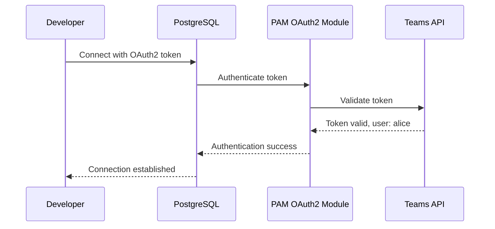

**Use Cases:**
- ✅ Developers need to debug production issues
- ✅ DBAs need to run ad-hoc queries
- ✅ Data analysts need read-only access
- ✅ Team members need access to databases owned by their team

**For our learning project:**
- ⚠️ **Not currently needed** - We don't have developers accessing databases directly
- ⚠️ **Requires Teams API** - Need to deploy and configure Teams API service
- ⚠️ **OAuth2 setup** - Requires OAuth2 provider configuration
- ✅ **Good to know** - Useful for production environments with multiple developers

---

## PostgresTeam CRD: Advanced Team Management (Recommended for Production)

**What it is:** A Kubernetes CRD that provides **advanced, flexible team management** beyond the basic Teams API approach.

**Key Difference from Teams API:**

| Feature | Teams API (Basic) | PostgresTeam CRD (Advanced) |
|---------|------------------|----------------------------|
| **Scope** | Only owning team members | Any team, any individual user |
| **Configuration** | Global (all clusters) | Per-team mapping (flexible) |
| **Additional Teams** | ❌ No | ✅ Yes (via `additionalTeams`) |
| **Individual Members** | ❌ No | ✅ Yes (via `additionalMembers`) |
| **Virtual Teams** | ❌ No | ✅ Yes (cross-team mapping) |
| **Team Renames** | ❌ No | ✅ Yes (mapping support) |
| **Member Deprecation** | ⚠️ Basic | ✅ Advanced (rename + revoke LOGIN) |
| **Superuser Teams** | ⚠️ Global only | ✅ Per-team configuration |
| **Complexity** | Low | Medium |
| **Best For** | Simple single-team setups | **Multi-team, production environments** |

**When to Use:**

- ✅ **Use Teams API (Basic)** if:
  - Single team owns all databases
  - Simple setup, no cross-team access needed
  - Quick POC or development environment

- ✅ **Use PostgresTeam CRD (Advanced)** if:
  - **Multiple teams** need access to databases
  - **Individual contractors/consultants** need access
  - **Complex team structures** (virtual teams, cross-team collaboration)
  - **Production environment** with strict access control
  - **Team renames** need to be handled gracefully
  - **Fine-grained control** over who can access which databases

**Recommendation:** For production-ready deployments, **PostgresTeam CRD is recommended** due to its flexibility and advanced features.

**Key Features:**
- Assign additional teams to clusters (beyond the owning team)
- Assign individual members (contractors, external users)
- Create virtual teams (groups of teams)
- Handle team name changes
- Deprecate removed members (rename roles, revoke LOGIN)

### Use Cases

**1. Additional Teams Access**

Allow members of `backend-team` to access databases owned by `platform-team`:

```yaml
apiVersion: "acid.zalan.do/v1"
kind: PostgresTeam
metadata:
  name: cross-team-access
spec:
  additionalTeams:
    platform-team:
    - "backend-team"  # backend-team members can access platform-team databases
```

**2. Individual Members**

Add specific users who aren't in any team:

```yaml
apiVersion: "acid.zalan.do/v1"
kind: PostgresTeam
metadata:
  name: contractor-access
spec:
  additionalMembers:
    platform-team:
    - "contractor-alice"  # Individual user access
    - "consultant-bob"
```

**3. Virtual Teams**

Create a virtual team that maps to multiple real teams:

```yaml
apiVersion: "acid.zalan.do/v1"
kind: PostgresTeam
metadata:
  name: virtual-dba-team
spec:
  additionalTeams:
    platform-team:
    - "virtual-dba"      # Virtual team
    backend-team:
    - "virtual-dba"      # Same virtual team
    virtual-dba:
    - "dba-team"         # Virtual team maps to real DBA team
    - "ops-team"         # And ops team
```

**Result:** Members of `dba-team` and `ops-team` can access databases owned by `platform-team` and `backend-team`.

**4. Team Name Changes**

Handle team renames without recreating clusters:

```yaml
apiVersion: "acid.zalan.do/v1"
kind: PostgresTeam
metadata:
  name: team-rename-mapping
spec:
  additionalTeams:
    old-team-name:
    - "new-team-name"  # Map old name to new name
```

### Configuration

**Step 1: Enable PostgresTeam CRD Support**

```yaml
# OperatorConfiguration CRD
apiVersion: "acid.zalan.do/v1"
kind: OperatorConfiguration
metadata:
  name: postgresql-operator-configuration
configuration:
  teams_api:
    enable_postgres_team_crd: true  # Enable PostgresTeam CRD support
    enable_postgres_team_crd_superusers: false  # Enable superuser teams (optional)
    enable_team_member_deprecation: true  # Rename removed members (optional)
    role_deletion_suffix: "_deleted"  # Suffix for deprecated roles (optional)
```

**Step 2: Create PostgresTeam CRD**

```yaml
apiVersion: "acid.zalan.do/v1"
kind: PostgresTeam
metadata:
  name: platform-team-access
spec:
  additionalTeams:
    platform:  # Team owning the database cluster
    - "backend"      # Additional team with access
    - "frontend"     # Another additional team
  additionalMembers:
    platform:
    - "dba-alice"    # Individual DBA access
    - "ops-bob"      # Individual ops access
  additionalSuperuserTeams:  # Requires enable_postgres_team_crd_superusers: true
    platform:
    - "dba-team"     # DBA team gets superuser access
```

### Member Deprecation

When a team member is removed from Teams API or PostgresTeam CRD:

**With `enable_team_member_deprecation: true`:**
- Role renamed: `alice` → `alice_deleted`
- `LOGIN` privilege revoked
- Role can be restored if member is re-added

**Without deprecation:**
- Role remains unchanged
- Manual cleanup required

### Relationship with Teams API

**Teams API (Global):**
- Creates roles for members of the **owning team** (from `teamId` in cluster manifest)
- Global setting applies to all clusters

**PostgresTeam CRD (Per-Cluster):**
- Creates roles for **additional teams** and **individual members**
- More flexible than Teams API (can specify per team)
- Works alongside Teams API (both can be used together)

### Production-Ready Examples

#### Example 1: Infrastructure Role for Monitoring (Production Pattern)

**Use Case:** postgres_exporter needs read-only access to all databases for monitoring.

**Configuration:**

```yaml
# 1. Create monitoring user secret (one-time setup)
# k8s/secrets/postgresql-monitoring-user.yaml
apiVersion: v1
kind: Secret
metadata:
  name: postgresql-monitoring-user
  namespace: database
type: Opaque
stringData:
  username: postgres_monitoring
  password: <strong-random-password>  # Generate: openssl rand -base64 32

---
# 2. Configure infrastructure role in OperatorConfiguration
# k8s/postgres-operator-zalando/operator-configuration.yaml
apiVersion: "acid.zalan.do/v1"
kind: OperatorConfiguration
metadata:
  name: postgresql-operator-configuration
  namespace: database
configuration:
  kubernetes:
    enable_cross_namespace_secret: true
    infrastructure_roles_secrets:
    - secretname: "postgresql-monitoring-user"
      userkey: "username"
      passwordkey: "password"
```

**Result:**
- ✅ `postgres_monitoring` user created on **all 5 clusters** automatically
- ✅ Same credentials work for all clusters
- ✅ postgres_exporter can connect to any cluster
- ✅ Password rotation: Update secret → operator updates all clusters

**PostgreSQL Permissions:**

The infrastructure role will be created with these default permissions:
- ✅ `LOGIN` privilege (can connect)
- ⚠️ No database-specific privileges (need to grant manually or via preparedDatabases)

**Grant Read-Only Access (Optional):**

If you need read-only access for monitoring, grant permissions after role creation:

```sql
-- Run on each cluster (or automate via init script)
GRANT CONNECT ON DATABASE auth TO postgres_monitoring;
GRANT USAGE ON SCHEMA public TO postgres_monitoring;
GRANT SELECT ON ALL TABLES IN SCHEMA public TO postgres_monitoring;
ALTER DEFAULT PRIVILEGES IN SCHEMA public GRANT SELECT ON TABLES TO postgres_monitoring;
```

---

#### Example 2: Developer Access via Teams API (Basic Approach)

**Use Case:** All members of `platform` team need access to `supporting-db` for debugging.

**Configuration:**

```yaml
# 1. Enable Teams API in OperatorConfiguration
# k8s/postgres-operator-zalando/operator-configuration.yaml
apiVersion: "acid.zalan.do/v1"
kind: OperatorConfiguration
metadata:
  name: postgresql-operator-configuration
  namespace: database
configuration:
  teams_api:
    enable_teams_api: true
    teams_api_url: "http://fake-teams-api.monitoring.svc.cluster.local/api/"
    enable_team_superuser: false  # Don't grant superuser
    team_admin_role: "admin"      # Grant admin role (read/write)
    oauth_token_secret_name: "postgresql-operator-oauth"  # OAuth2 token secret

---
# 2. Deploy Fake Teams API (for learning/POC)
#
# WHAT IS FAKE TEAMS API?
# Fake Teams API is a simple HTTP server that mocks the Teams API endpoint.
# It returns JSON arrays of team members when queried by team name.
# 
# IMPLEMENTATION OPTIONS:
# Option A: Use Zalando's official fake-teams-api image (if available)
# Option B: Create simple HTTP server (Python/Node.js/Go) that returns JSON
# Option C: Use mock service like json-server or httpbin
#
# ENDPOINT FORMAT:
# GET /api/{teamname}
# Response: ["username1", "username2", "username3"]
#
# Example: GET /api/platform
# Response: ["alice", "bob", "charlie"]
#
# DEPLOYMENT OPTION 1: Simple Python HTTP Server (Recommended for POC)
# k8s/postgres-operator-zalando/fake-teams-api.yaml
apiVersion: apps/v1
kind: Deployment
metadata:
  name: fake-teams-api
  namespace: monitoring
spec:
  replicas: 1
  selector:
    matchLabels:
      app: fake-teams-api
  template:
    metadata:
      labels:
        app: fake-teams-api
    spec:
      containers:
      - name: fake-teams-api
        image: python:3.11-alpine
        command:
        - python
        - -c
        - |
          import http.server
          import json
          import os
          from urllib.parse import urlparse, parse_qs
          
          # Team members data (can be overridden via env var)
          TEAMS_DATA = {
              "platform": ["alice", "bob", "charlie"],
              "backend": ["dave", "eve"],
              "frontend": ["frank", "grace"]
          }
          
          # Load from env if provided
          if os.getenv("TEAMS_API_DATA"):
              import json as json_module
              TEAMS_DATA = json_module.loads(os.getenv("TEAMS_API_DATA"))
          
          class TeamsAPIHandler(http.server.BaseHTTPRequestHandler):
              def do_GET(self):
                  # Parse URL: /api/{teamname}
                  path = self.path
                  if path.startswith("/api/"):
                      teamname = path[5:]  # Remove "/api/"
                      if teamname in TEAMS_DATA:
                          members = TEAMS_DATA[teamname]
                          self.send_response(200)
                          self.send_header("Content-Type", "application/json")
                          self.end_headers()
                          self.wfile.write(json.dumps(members).encode())
                      else:
                          self.send_response(404)
                          self.end_headers()
                          self.wfile.write(b'[]')
                  else:
                      self.send_response(404)
                      self.end_headers()
              
              def log_message(self, format, *args):
                  # Suppress default logging
                  pass
          
          server = http.server.HTTPServer(("", 8080), TeamsAPIHandler)
          print("Fake Teams API listening on port 8080")
          server.serve_forever()
        ports:
        - containerPort: 8080
        env:
        - name: TEAMS_API_DATA
          value: '{"platform": ["alice", "bob", "charlie"], "backend": ["dave", "eve"]}'
        resources:
          requests:
            memory: "64Mi"
            cpu: "50m"
          limits:
            memory: "128Mi"
            cpu: "100m"
---
apiVersion: v1
kind: Service
metadata:
  name: fake-teams-api
  namespace: monitoring
spec:
  selector:
    app: fake-teams-api
  ports:
  - port: 8080
    targetPort: 8080
  type: ClusterIP

---
# 3. Database cluster already has teamId: "platform"
# k8s/postgres-operator-zalando/crds/supporting-db.yaml
apiVersion: acid.zalan.do/v1
kind: postgresql
metadata:
  name: supporting-db
spec:
  teamId: "platform"  # Operator queries Teams API for members
  # ... rest of config
```

**Result:**
- ✅ Roles created: `alice`, `bob`, `charlie` on `supporting-db`
- ✅ Users connect with OAuth2 tokens (no K8s secrets)
- ✅ All members of `platform` team get access automatically
- ✅ New team members automatically get access (operator syncs periodically)

**Limitations:**
- ⚠️ Only works for **owning team** (`platform` team)
- ⚠️ Cannot grant access to other teams' databases
- ⚠️ Requires Teams API deployment

---

#### Example 3: Developer Access via PostgresTeam CRD (Advanced Approach)

**Use Case:** 
- `backend-team` developers need access to `supporting-db` (owned by `platform` team)
- Individual contractor `contractor-alice` needs temporary access
- `dba-team` needs superuser access for maintenance

**Configuration:**

```yaml
# 1. Enable PostgresTeam CRD support
# k8s/postgres-operator-zalando/operator-configuration.yaml
apiVersion: "acid.zalan.do/v1"
kind: OperatorConfiguration
metadata:
  name: postgresql-operator-configuration
  namespace: database
configuration:
  teams_api:
    enable_postgres_team_crd: true  # Enable PostgresTeam CRD
    enable_postgres_team_crd_superusers: true  # Enable superuser teams
    enable_team_member_deprecation: true  # Rename removed members
    role_deletion_suffix: "_deleted"  # Suffix for deprecated roles

---
# 2. Create PostgresTeam CRD for cross-team access
# k8s/postgres-operator-zalando/postgres-team-platform-access.yaml
apiVersion: "acid.zalan.do/v1"
kind: PostgresTeam
metadata:
  name: platform-team-access
  namespace: database
spec:
  # Additional teams: backend-team members can access platform-team databases
  additionalTeams:
    platform:  # Database owning team
    - "backend"      # Additional team with access
    - "frontend"     # Another team with access
  
  # Individual members: contractors, consultants
  additionalMembers:
    platform:
    - "contractor-alice"  # Individual contractor access
    - "consultant-bob"    # Individual consultant access
  
  # Superuser teams: DBA team gets superuser on platform databases
  additionalSuperuserTeams:
    platform:
    - "dba-team"  # DBA team gets superuser access
```

**Result:**
- ✅ `backend-team` members get access to `supporting-db`
- ✅ `frontend-team` members get access to `supporting-db`
- ✅ `contractor-alice` and `consultant-bob` get individual access
- ✅ `dba-team` members get **superuser** access (can administer databases)
- ✅ All roles created automatically by operator

**Team Membership Resolution:**

The operator resolves team membership **transitively**:

```yaml
# Example: Complex team mapping
spec:
  additionalTeams:
    platform:
    - "backend"      # backend-team → platform databases
    - "frontend"     # frontend-team → platform databases
    backend:
    - "platform"     # platform-team → backend databases (bidirectional)
    - "shared-infra" # shared-infra → backend databases
    shared-infra:
    - "ops-team"     # ops-team → shared-infra databases
```

**Result:** `ops-team` members get access to:
- ✅ `shared-infra` team databases (direct)
- ✅ `backend` team databases (via shared-infra → backend)
- ✅ `platform` team databases (via backend → platform)

**Virtual Teams Example:**

```yaml
# Create virtual team for cross-cutting concerns
spec:
  additionalTeams:
    platform:
    - "virtual-dba"      # Virtual team
    backend:
    - "virtual-dba"      # Same virtual team
    virtual-dba:
    - "dba-team"         # Virtual team maps to real DBA team
    - "ops-team"         # And ops team
```

**Result:** Members of `dba-team` and `ops-team` can access databases owned by `platform` and `backend` teams.

---

### Production-Ready Best Practices

#### 1. Infrastructure Roles (Monitoring, Backups)

**✅ DO:**
- Use infrastructure roles for **system users** (monitoring, backups)
- Store passwords in **dedicated secrets** (not in cluster manifests)
- Use **strong passwords** (32+ characters, random)
- **Rotate passwords regularly** (every 90 days)
- Grant **minimum required privileges** (read-only for monitoring)

**❌ DON'T:**
- Don't use infrastructure roles for application users
- Don't hardcode passwords in manifests
- Don't grant superuser to infrastructure roles
- Don't share infrastructure role passwords with developers

**Example:**
```yaml
# ✅ Good: Dedicated monitoring user with read-only access
infrastructure_roles_secrets:
- secretname: "postgresql-monitoring-user"
  userkey: "username"
  passwordkey: "password"
# Grant: CONNECT, USAGE, SELECT (read-only)

# ❌ Bad: Using postgres superuser for monitoring
# Don't use postgres user for monitoring - security risk
```

---

#### 2. Teams API vs PostgresTeam CRD Decision Matrix

**Choose Teams API (Basic) if:**
- ✅ Single team owns all databases
- ✅ Simple setup, no cross-team access
- ✅ Quick POC or development environment
- ✅ Team membership managed by external Teams API
- ✅ OAuth2 authentication already configured

**Choose PostgresTeam CRD (Advanced) if:**
- ✅ **Multiple teams** need database access
- ✅ **Individual users** (contractors, consultants) need access
- ✅ **Complex team structures** (virtual teams, cross-team collaboration)
- ✅ **Fine-grained control** over access permissions
- ✅ **Team renames** need graceful handling
- ✅ **Production environment** with strict access control

**Hybrid Approach (Recommended for Production):**
- Use **Teams API** for owning team members (automatic)
- Use **PostgresTeam CRD** for additional teams and individual members (flexible)
- Best of both worlds: automatic + flexible

---

#### 3. Security Best Practices

**Password Management:**
- ✅ **Generate strong passwords**: `openssl rand -base64 32`
- ✅ **Store in Kubernetes Secrets**: Never hardcode
- ✅ **Rotate regularly**: Every 90 days for infrastructure roles
- ✅ **Use External Secrets Operator**: For Vault/AWS Secrets Manager integration (see `Feature.md`)

**Access Control:**
- ✅ **Principle of least privilege**: Grant minimum required permissions
- ✅ **Read-only for monitoring**: Monitoring users should not have write access
- ✅ **Separate roles per purpose**: Monitoring ≠ Backup ≠ Developer
- ✅ **Audit access**: Log all database access (via PostgreSQL logging)

**OAuth2 Authentication (Teams API):**
- ✅ **Use HTTPS**: Teams API should use TLS
- ✅ **Validate tokens**: Verify OAuth2 tokens before granting access
- ✅ **Token expiration**: Set appropriate token expiration times
- ✅ **Revoke access**: Immediately revoke tokens for removed team members

**Member Deprecation:**
- ✅ **Enable deprecation**: `enable_team_member_deprecation: true`
- ✅ **Rename roles**: Append `_deleted` suffix
- ✅ **Revoke LOGIN**: Prevent new connections
- ✅ **Cleanup script**: Periodically remove deprecated roles

---

#### 4. Monitoring and Observability

**Track Role Creation:**
```bash
# Check roles created by operator
kubectl exec -n user supporting-db-0 -- psql -U postgres -c "\du"

# Check infrastructure roles
kubectl exec -n auth auth-db-0 -- psql -U postgres -c "\du postgres_monitoring"

# Check Teams API roles
kubectl exec -n user supporting-db-0 -- psql -U postgres -c "\du alice"
```

**Monitor Operator Logs:**
```bash
# Check operator sync status
kubectl logs -n database -l app.kubernetes.io/name=postgres-operator | grep -i "team\|role"

# Check Teams API queries
kubectl logs -n database -l app.kubernetes.io/name=postgres-operator | grep -i "teams_api"

# Check PostgresTeam CRD processing
kubectl logs -n database -l app.kubernetes.io/name=postgres-operator | grep -i "postgresteam"
```

**Database Access Logging:**
```yaml
# Enable connection logging in PostgreSQL
postgresql:
  parameters:
    log_connections: "on"      # Log all connections
    log_disconnections: "on"   # Log all disconnections
    log_line_prefix: "%t [%p]: [%l-1] user=%u,db=%d,app=%a,client=%h "  # Detailed logging
```

---

#### 5. Troubleshooting

**Issue: Infrastructure role not created**

```bash
# Check operator configuration
kubectl get operatorconfiguration postgresql-operator-configuration -n database -o yaml

# Check secret exists
kubectl get secret postgresql-monitoring-user -n database

# Check operator logs
kubectl logs -n database -l app.kubernetes.io/name=postgres-operator | grep -i "infrastructure"
```

**Issue: Teams API roles not created**

```bash
# Check Teams API is enabled
kubectl get operatorconfiguration postgresql-operator-configuration -n database -o jsonpath='{.configuration.teams_api.enable_teams_api}'

# Check Teams API is accessible
kubectl exec -n database deployment/postgres-operator -- curl http://fake-teams-api.monitoring.svc.cluster.local/api/platform

# Check OAuth token secret
kubectl get secret postgresql-operator-oauth -n database

# Check operator logs
kubectl logs -n database -l app.kubernetes.io/name=postgres-operator | grep -i "teams_api"
```

**Issue: PostgresTeam CRD not working**

```bash
# Check CRD is enabled
kubectl get operatorconfiguration postgresql-operator-configuration -n database -o jsonpath='{.configuration.teams_api.enable_postgres_team_crd}'

# Check PostgresTeam CRD exists
kubectl get postgresteam -A

# Check operator RBAC (needs PostgresTeam permissions)
kubectl get clusterrole postgres-operator -o yaml | grep -i postgresteam

# Check operator logs
kubectl logs -n database -l app.kubernetes.io/name=postgres-operator | grep -i "postgresteam"
```

---

### For Our Learning Project

**Current Status:**
- ✅ **Infrastructure Role**: Ready to configure for monitoring user
- ❌ **Teams API**: Not configured (requires Teams API deployment)
- ❌ **PostgresTeam CRD**: Not configured (requires CRD enablement)

**Recommended Next Steps:**

1. **Immediate (Production-Ready):**
   - ✅ Configure infrastructure role for monitoring user
   - ✅ Update postgres_exporter to use monitoring user
   - ✅ Test monitoring user access to all clusters

2. **Future (If Developer Access Needed):**
   - Deploy Fake Teams API (for learning/POC)
   - Configure Teams API in operator (basic approach)
   - OR configure PostgresTeam CRD (advanced approach)
   - Test developer access with OAuth2 tokens

3. **Production (Full Setup):**
   - Deploy real Teams API (integrated with company directory)
   - Configure OAuth2 provider
   - Enable PostgresTeam CRD for fine-grained control
   - Set up monitoring and alerting for role creation
   - Document access procedures for developers

---

## Future Extensibility: Integration with External Secret Management

**Note:** Detailed External Secrets Operator integration planning is documented in [`Feature.md`](./Feature.md). This section provides a high-level overview.

### Compatibility Analysis

**Current Approach (`enable_cross_namespace_secret`):**
- Zalando operator creates **standard Kubernetes secrets**
- Secrets follow predictable naming: `{namespace}.{username}.{clustername}.credentials.postgresql.acid.zalan.do`
- Secrets contain standard keys: `username`, `password`
- Secrets are created in target namespaces automatically

**Key Insight:** Zalando operator creates standard K8s secrets, which are compatible with all Kubernetes-native secret management tools.

### Integration Patterns

#### Pattern 1: External Secrets Operator → Sync Zalando Secrets from Vault

**How it works:**
1. Zalando operator creates secrets in target namespaces (via `enable_cross_namespace_secret`)
2. External Secrets Operator syncs these secrets from Vault/AWS Secrets Manager
3. External Secrets Operator updates Kubernetes secrets when Vault secrets change
4. Services consume Kubernetes secrets (no changes needed)

**Configuration Example:**
```yaml
# ExternalSecret CRD to sync Zalando-generated secret from Vault
apiVersion: external-secrets.io/v1beta1
kind: ExternalSecret
metadata:
  name: notification-db-secret
  namespace: notification
spec:
  secretStoreRef:
    name: vault-backend
    kind: SecretStore
  target:
    name: notification.notification.supporting-db.credentials.postgresql.acid.zalan.do
    creationPolicy: Merge  # Merge with Zalando-generated secret
  data:
  - secretKey: password
    remoteRef:
      key: postgres/notification/supporting-db
      property: password
```

**Pros:**
- ✅ Zalando operator still manages secret creation and lifecycle
- ✅ External Secrets Operator handles Vault sync
- ✅ Password rotation in Vault automatically syncs to K8s secrets
- ✅ No changes to Zalando operator configuration needed
- ✅ Services continue using standard `secretKeyRef`

**Cons:**
- ⚠️ Requires External Secrets Operator installation
- ⚠️ Need to configure Vault backend and secret paths
- ⚠️ Two operators managing same secrets (potential conflicts)

**Best for:** Password rotation from Vault, centralized secret management

#### Pattern 2: External Secrets Operator → Create Secrets → Zalando References

**How it works:**
1. External Secrets Operator creates secrets from Vault in target namespaces
2. Zalando operator references these pre-existing secrets (for infrastructure roles)
3. Zalando operator uses these secrets instead of generating passwords

**Configuration Example:**
```yaml
# ExternalSecret creates secret from Vault
apiVersion: external-secrets.io/v1beta1
kind: ExternalSecret
metadata:
  name: notification-db-secret
  namespace: notification
spec:
  secretStoreRef:
    name: vault-backend
  target:
    name: notification.notification.supporting-db.credentials.postgresql.acid.zalan.do
  data:
  - secretKey: username
    remoteRef:
      key: postgres/notification/supporting-db
      property: username
  - secretKey: password
    remoteRef:
      key: postgres/notification/supporting-db
      property: password

# Zalando operator references pre-existing secret (infrastructure roles)
apiVersion: "acid.zalan.do/v1"
kind: OperatorConfiguration
metadata:
  name: postgresql-operator-configuration
configuration:
  kubernetes:
    enable_cross_namespace_secret: true
    infrastructure_roles_secrets:
    - secretname: "notification.notification.supporting-db.credentials.postgresql.acid.zalan.do"
      userkey: "username"
      passwordkey: "password"
```

**Pros:**
- ✅ Full control over secret source (Vault)
- ✅ Zalando operator uses Vault-managed passwords
- ✅ No password generation by Zalando operator

**Cons:**
- ❌ More complex setup
- ❌ Requires infrastructure roles configuration
- ❌ Not suitable for manifest roles (Zalando generates passwords)

**Best for:** Infrastructure roles, monitoring users, centralized password management

#### Pattern 3: Hybrid Approach (Recommended for Future)

**How it works:**
1. Zalando operator creates secrets with `enable_cross_namespace_secret` (current approach)
2. External Secrets Operator watches Zalando-generated secrets
3. External Secrets Operator syncs password changes from Vault when needed
4. Zalando operator continues managing secret lifecycle

**Architecture:**
```
Vault → External Secrets Operator → Kubernetes Secret (Zalando format) → Service Pods
                ↑
                └── Zalando Operator creates secret structure
```

**Benefits:**
- ✅ Zalando operator handles secret creation and namespace placement
- ✅ External Secrets Operator handles Vault sync and rotation
- ✅ Standard Kubernetes secrets (compatible with all tools)
- ✅ No changes to service configurations
- ✅ Gradual migration path (can enable Vault sync later)

### Integration Patterns Comparison

| Criteria | Pattern 1: ESO Sync Zalando Secrets | Pattern 2: ESO Create for Zalando | Pattern 3: Hybrid (Recommended) |
|----------|-------------------------------------|-----------------------------------|--------------------------------|
| **Secret Creation** | Zalando operator | External Secrets Operator | Zalando operator |
| **Secret Sync** | External Secrets Operator | N/A (ESO creates) | External Secrets Operator |
| **Password Source** | Vault (via ESO sync) | Vault (via ESO) | Vault (via ESO sync) |
| **Zalando Role Types** | All (manifest + infrastructure) | Infrastructure only | All (manifest + infrastructure) |
| **Setup Complexity** | Medium | High | Medium |
| **Password Rotation** | ✅ Automatic from Vault | ✅ Automatic from Vault | ✅ Automatic from Vault |
| **Secret Lifecycle** | Zalando manages structure | ESO manages everything | Zalando manages structure, ESO manages values |
| **Migration Path** | ✅ Easy (add ESO later) | ❌ Complex (change Zalando config) | ✅ Easy (add ESO later) |
| **Best For** | Password rotation, compliance | Full Vault control | **Future-proof, gradual migration** |

### Architecture Diagrams

#### Current Architecture (Zalando Native Only)

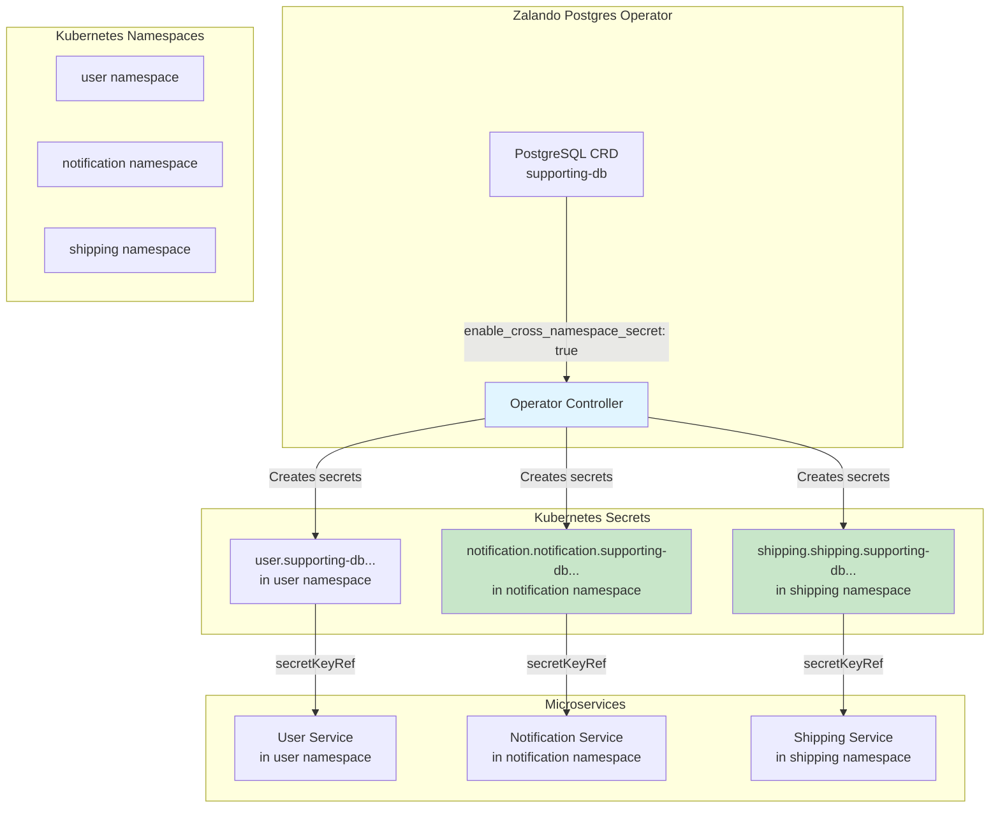

#### Future Architecture: Pattern 1 (ESO Sync Zalando Secrets)

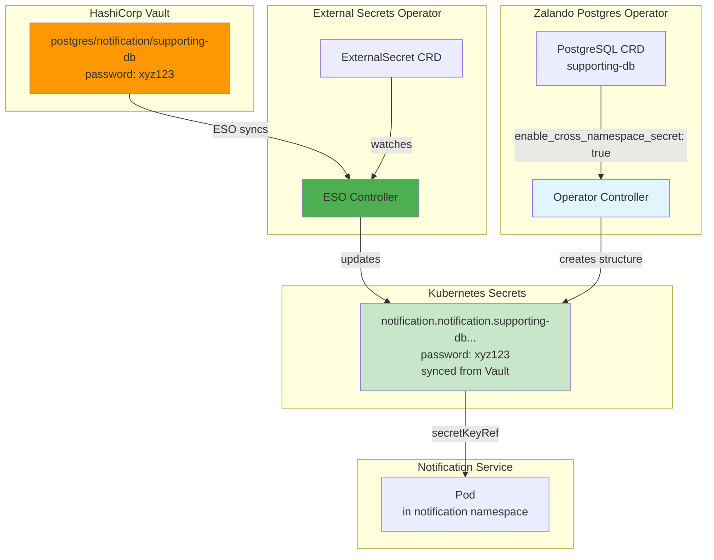

#### Future Architecture: Pattern 3 (Hybrid - Recommended)

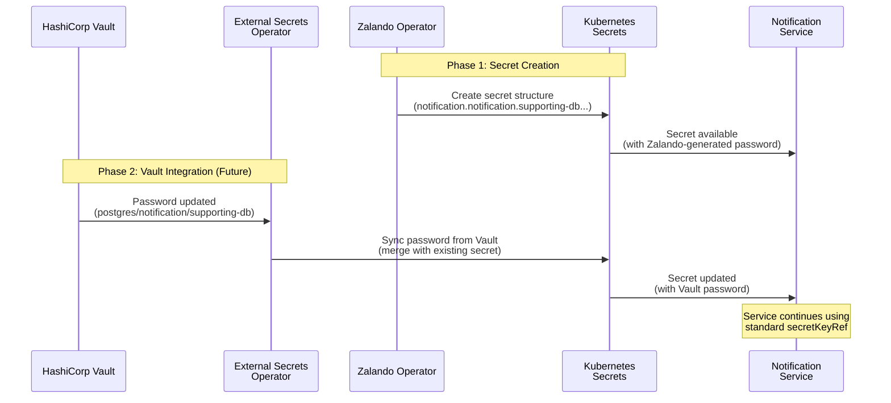

#### Integration Pattern Decision Flow

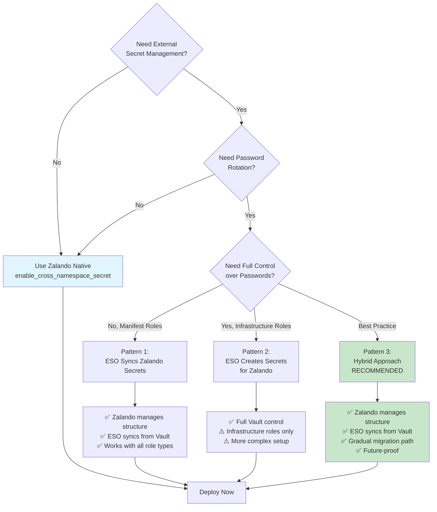

### Recommendation for Future Integration

**Current Phase (Now):**
- ✅ Enable `enable_cross_namespace_secret` in Zalando operator
- ✅ Let Zalando operator create secrets in correct namespaces
- ✅ Use standard Kubernetes secrets

**Future Phase (When Vault/External Secrets needed):**
- Add External Secrets Operator
- Configure ExternalSecret CRDs to sync Zalando-generated secrets from Vault
- Use `creationPolicy: Merge` to combine Zalando structure with Vault values
- Enable automatic password rotation from Vault

**Why This Approach is Best:**
1. **Standard Kubernetes Secrets**: Zalando creates standard K8s secrets, compatible with all tools
2. **Predictable Naming**: Secret names follow consistent pattern, easy to reference
3. **Namespace Placement**: Secrets already in correct namespaces (no sync needed)
4. **Gradual Migration**: Can add Vault integration later without changing Zalando config
5. **No Conflicts**: Zalando manages structure, External Secrets manages values

### Compatibility Matrix

| Integration Type | Compatible? | Notes |
|-----------------|-------------|-------|
| External Secrets Operator (sync Zalando secrets) | ✅ YES | Standard K8s secrets, can sync from Vault |
| External Secrets Operator (create secrets for Zalando) | ⚠️ PARTIAL | Only for infrastructure roles, not manifest roles |
| Vault Agent Injector | ✅ YES | Works with any K8s secret |
| Sealed Secrets | ✅ YES | Can encrypt Zalando-generated secrets |
| AWS Secrets Manager | ✅ YES | Via External Secrets Operator |
| HashiCorp Vault | ✅ YES | Via External Secrets Operator |

**Conclusion:** The `enable_cross_namespace_secret` approach is **fully compatible** with future External Secrets Operator/Vault integration. Zalando creates standard Kubernetes secrets that can be managed by any Kubernetes-native secret management tool.

---

## Recommendations

### Primary Recommendation: Enable Zalando Native Feature (Option 1) ✅ DECISION MADE

**Status:** APPROVED - Proceeding with implementation

**Rationale:**
- Native operator support eliminates need for sync script
- Declarative configuration aligns with Kubernetes best practices
- Automatic secret management reduces maintenance burden
- Long-term solution that scales better

**Implementation Steps:**
1. ✅ Research exact configuration format for v1.15.0 (COMPLETE - see configuration examples)
2. Update operator configuration (ConfigMap or OperatorConfiguration CRD) with:
   - `enable_cross_namespace_secret: true`
   - Note: `secret_name_template` NOT needed - operator uses default template
3. Update database CRD (`supporting-db.yaml`) with namespace notation:
   - Users: `notification.notification` instead of `notification` (format: `namespace.username`)
   - Users: `shipping.shipping` instead of `shipping` (format: `namespace.username`)
   - Databases: `notification: notification.notification` (must match user format)
   - Databases: `shipping: shipping.shipping` (must match user format)
   - Note: Anything before first dot = namespace, after first dot = username
4. Update Helm values (`charts/values/notification.yaml`, `charts/values/shipping.yaml`) to reference new secret names:
   - Old: `notification.supporting-db.credentials.postgresql.acid.zalan.do`
   - New: `notification.notification.supporting-db.credentials.postgresql.acid.zalan.do`
   - Old: `shipping.supporting-db.credentials.postgresql.acid.zalan.do`
   - New: `shipping.shipping.supporting-db.credentials.postgresql.acid.zalan.do`
5. Delete old secrets in `user` namespace (if they exist)
6. Test secret creation and service deployment
7. ✅ Remove sync script (`scripts/04b-sync-supporting-db-secrets.sh`) after successful verification
8. Update `scripts/04-deploy-databases.sh` to remove sync script call

**Risks:**
- Secret name format changes require updates to Helm values for `notification` and `shipping` services
- Need to update database CRD with correct `namespace.username` format

**Mitigation:**
- ✅ Feature confirmed supported in v1.15.0
- ✅ No impact on other clusters (`auth-db`, `review-db`) - they don't use namespace notation
- ✅ No migration needed - can delete old secrets and redeploy
- Test thoroughly in dev environment
- Update Helm values and database CRD in one commit
- Document secret name format clearly

### Alternative Recommendation: Keep Manual Sync (Option 2)

**When to use:**
- If Zalando native feature is not available in v1.15.0
- If configuration is too complex or risky
- If we need fine-grained control over secret syncing
- If migration effort is too high

**Improvements to current approach:**
- Add retry logic (already done)
- Add monitoring/alerting for sync failures
- Consider using Kubernetes Job/CronJob for periodic sync
- Document sync process clearly

---

## Open Questions - RESOLVED

1. **✅ Does Zalando Postgres Operator v1.15.0 support `enable_cross_namespace_secret`?**
   - **ANSWER:** YES - Feature is supported in v1.15.0
   - Reference: [Zalando Postgres Operator User Guide](https://opensource.zalando.com/postgres-operator/docs/user.html)

2. **✅ What is the exact configuration format?**
   - **ANSWER:** See configuration examples below (ConfigMap and OperatorConfiguration CRD)
   - Both formats are supported
   - Field name: `enable_cross_namespace_secret` (boolean or string "true"/"false")

3. **✅ How does namespace determination work?**
   - **ANSWER:** Namespace is determined from user name format: `namespace.username`
   - Anything **before the first dot** is considered the namespace
   - Text **after the first dot** is the username
   - Example: `notification.notification` → namespace: `notification`, username: `notification`
   - Example: `appspace.db_user` → namespace: `appspace`, username: `db_user`
   - The database section must also use the same format: `app_db: appspace.db_user`
   - Postgres role name will be: `namespace.username` (e.g., `notification.notification`)

4. **✅ Will this affect other clusters (`auth-db`, `review-db`)?**
   - **ANSWER:** No impact - Only affects clusters that use `namespace.username` format in users section
   - Clusters without namespace notation continue to work normally
   - No changes needed for `auth-db` and `review-db`

5. **✅ What happens to existing secrets?**
   - **ANSWER:** No migration needed - Can delete and recreate
   - Old secrets can be deleted manually
   - Operator will recreate secrets in correct namespaces when cluster is redeployed
   - No service downtime if done during maintenance window

6. **✅ Secret name template format:**
   - **ANSWER:** Format is: `{namespace}.{username}.{clustername}.credentials.postgresql.acid.zalan.do`
   - Example: `notification.notification.supporting-db.credentials.postgresql.acid.zalan.do`
   - Namespace value comes from user name format (`namespace.username`)
   - Template is configured at operator level (global setting)

---

## Next Steps

1. **Verify Feature Availability:** ✅ IN PROGRESS
   - Check Zalando Postgres Operator v1.15.0 documentation
   - Review operator source code for `enable_cross_namespace_secret`
   - Check GitHub issues/PRs related to this feature
   - Verify exact configuration format and field names

2. **Create Implementation Plan:**
   - Run `/specify Zalando-operator` to define detailed requirements
   - Run `/plan Zalando-operator` to create technical implementation plan
   - Define migration steps and rollback plan

3. **Implementation:**
   - Update operator configuration (ConfigMap or OperatorConfiguration CRD)
   - Update database CRD with namespace notation
   - Update Helm values for secret references
   - Test in development environment

4. **Verification:**
   - Verify secrets are created in correct namespaces
   - Test service access to secrets
   - Verify all services deploy successfully

5. **Cleanup:**
   - Remove `scripts/04b-sync-supporting-db-secrets.sh`
   - Remove sync script call from `scripts/04-deploy-databases.sh`
   - Update `docs/guides/DATABASE.md` with new approach
   - Update `CHANGELOG.md` with changes

6. **Documentation:**
   - Document secret name format clearly
   - Update troubleshooting guide
   - Add migration notes if needed

---

## PostgreSQL Performance Tuning for Production-Ready Deployment

**Purpose:** Comprehensive PostgreSQL parameter tuning for production workloads, focusing on DevOps/SRE requirements for optimal performance, reliability, and observability.

### Overview

PostgreSQL performance tuning involves optimizing memory usage, WAL (Write-Ahead Log) settings, query planner behavior, parallelism, autovacuum, and logging. Proper tuning is critical for production deployments to ensure:
- **Optimal query performance** - Fast response times for application queries
- **Efficient resource utilization** - Proper memory and CPU allocation
- **Reliable WAL management** - Balanced checkpoint frequency and WAL size
- **Effective autovacuum** - Timely cleanup of dead tuples and statistics updates
- **Comprehensive logging** - Visibility into slow queries, connections, and operations

### Memory Settings

**Key Parameters:**

| Parameter | Purpose | Production Recommendation | Notes |
|-----------|---------|-------------------------|-------|
| `shared_buffers` | Memory for shared cache | 25% of total RAM (max 8GB) | Too high reduces OS cache |
| `work_mem` | Memory for sort/hash operations | 128MB - 256MB | Per-operation, can multiply |
| `maintenance_work_mem` | Memory for VACUUM, CREATE INDEX | 512MB - 1GB | Larger for big tables |
| `effective_cache_size` | Estimate of OS cache size | 50-75% of total RAM | Helps query planner |

**Example Configuration:**
```yaml
postgresql:
  parameters:
    # Memory settings for performance
    shared_buffers: "4096MB"  # 25% of 16GB RAM
    work_mem: "128MB"  # Memory used for sort operations and hash tables
    maintenance_work_mem: "512MB"  # Memory used for maintenance operations like VACUUM
    effective_cache_size: "12GB"  # Estimate of how much memory is available for disk caching
```

**Tuning Guidelines:**
- **shared_buffers**: Start with 25% of RAM, increase if cache hit ratio < 95%
- **work_mem**: Monitor `work_mem` usage in `EXPLAIN ANALYZE`, increase if disk sorts occur
- **effective_cache_size**: Set to 50-75% of total RAM (includes PostgreSQL + OS cache)

### Write-Ahead Log (WAL) Settings

**Key Parameters:**

| Parameter | Purpose | Production Recommendation | Notes |
|-----------|---------|-------------------------|-------|
| `wal_buffers` | Memory for WAL data | 16MB - 32MB | Usually auto-tuned |
| `wal_level` | WAL logging level | `logical` for replication | `replica` for HA only |
| `checkpoint_timeout` | Max time between checkpoints | 15min | Balance between recovery time and I/O |
| `checkpoint_completion_target` | Checkpoint completion target | 0.9 | Spread checkpoint I/O |
| `max_wal_size` | Max WAL size before checkpoint | 8GB - 16GB | Larger = fewer checkpoints |
| `min_wal_size` | Min WAL size to recycle | 2GB | Reduces WAL file creation |

**Example Configuration:**
```yaml
postgresql:
  parameters:
    # Write-Ahead Log (WAL) settings
    wal_buffers: "16MB"  # Amount of memory used in shared memory for WAL data
    wal_level: "logical"  # Enables logical decoding for replication
    checkpoint_timeout: "15min"  # Maximum time between automatic WAL checkpoints
    checkpoint_completion_target: "0.9"  # Target of checkpoint completion, as a fraction of total time
    max_wal_size: "8GB"  # Maximum size of WAL before checkpoint is forced
    min_wal_size: "2GB"  # Minimum size of WAL to recycle WAL segment files
```

**Tuning Guidelines:**
- **wal_level**: Use `logical` for logical replication, `replica` for streaming replication only
- **checkpoint_timeout**: Balance between recovery time (shorter = faster recovery) and I/O load (longer = less I/O)
- **max_wal_size**: Larger values reduce checkpoint frequency but increase recovery time
- **Monitor**: Check `pg_stat_bgwriter` for checkpoint frequency and I/O load

### Query Planner Settings

**Key Parameters:**

| Parameter | Purpose | Production Recommendation | Notes |
|-----------|---------|-------------------------|-------|
| `random_page_cost` | Cost estimate for random disk I/O | 1.1 (SSD), 4.0 (HDD) | Lower for SSD/NVMe |
| `effective_io_concurrency` | Concurrent disk I/O operations | 200 (SSD), 2 (HDD) | Higher for SSD |
| `default_statistics_target` | Statistics target for columns | 100 (default) | Increase for complex queries |

**Example Configuration:**
```yaml
postgresql:
  parameters:
    # Query planner settings
    random_page_cost: "1.1"  # Cost estimate for a non-sequentially-fetched disk page (lower for SSD)
    effective_io_concurrency: "200"  # Number of concurrent disk I/O operations
    default_statistics_target: "100"  # Default statistics target for table columns
```

**Tuning Guidelines:**
- **random_page_cost**: Critical for SSD/NVMe - default 4.0 is too high, use 1.1-1.5
- **effective_io_concurrency**: Set based on storage type (SSD: 200+, HDD: 2-4)
- **Monitor**: Use `EXPLAIN ANALYZE` to verify planner chooses optimal plans

### Parallelism Settings

**Key Parameters:**

| Parameter | Purpose | Production Recommendation | Notes |
|-----------|---------|-------------------------|-------|
| `max_worker_processes` | Max background worker processes | 8-16 (based on CPU cores) | Must be ≥ max_parallel_workers |
| `max_parallel_workers_per_gather` | Max workers per parallel query | 4-8 | Per-query limit |
| `max_parallel_workers` | Max workers for parallel operations | 8-16 | Total parallel workers |

**Example Configuration:**
```yaml
postgresql:
  parameters:
    # Parallelism settings
    max_worker_processes: "8"  # Maximum number of background worker processes
    max_parallel_workers_per_gather: "4"  # Maximum workers for parallel queries
    max_parallel_workers: "8"  # Maximum workers for parallel operations
```

**Tuning Guidelines:**
- **max_worker_processes**: Set to number of CPU cores (or slightly less)
- **max_parallel_workers**: Should be ≤ max_worker_processes
- **max_parallel_workers_per_gather**: Limit per-query parallelism to avoid resource exhaustion
- **Monitor**: Check `pg_stat_progress_*` views for parallel query execution

### Autovacuum Settings

**Key Parameters:**

| Parameter | Purpose | Production Recommendation | Notes |
|-----------|---------|-------------------------|-------|
| `autovacuum` | Enable autovacuum | `on` (default) | Critical for production |
| `autovacuum_max_workers` | Max autovacuum workers | 3-6 | Balance with other workers |
| `autovacuum_vacuum_scale_factor` | Fraction before vacuum | 0.1 (10%) | Lower for high-update tables |

**Example Configuration:**
```yaml
postgresql:
  parameters:
    # Autovacuum settings
    autovacuum: "on"  # Enable autovacuum subprocess
    autovacuum_max_workers: "3"  # Maximum number of autovacuum worker processes
    autovacuum_vacuum_scale_factor: "0.1"  # Fraction of table size before vacuum
```

**Tuning Guidelines:**
- **autovacuum**: Always enable in production - critical for preventing bloat
- **autovacuum_max_workers**: Balance with `max_worker_processes` (leave room for other workers)
- **autovacuum_vacuum_scale_factor**: Lower values trigger vacuum more frequently (good for high-update tables)
- **Monitor**: Check `pg_stat_user_tables` for `n_dead_tup` and `last_vacuum`/`last_autovacuum`

### Logging Settings

**Key Parameters:**

| Parameter | Purpose | Production Recommendation | Notes |
|-----------|---------|-------------------------|-------|
| `log_statement` | What to log | `mod` (DDL + DML) | `all` for debugging |
| `log_min_duration_statement` | Log slow queries | 5000ms (5s) | Adjust based on SLA |
| `log_checkpoints` | Log checkpoints | `on` | Useful for tuning |
| `log_lock_waits` | Log lock waits | `on` | Detect blocking queries |
| `log_connections` | Log connections | `on` | Security audit |
| `log_disconnections` | Log disconnections | `on` | Connection tracking |

**Example Configuration:**
```yaml
postgresql:
  parameters:
    # Logging settings
    log_statement: "mod"  # Log all modification statements
    log_min_duration_statement: "5000"  # Record slow log for queries greater than 5s
    log_checkpoints: "on"  # Log each checkpoint
    log_lock_waits: "on"  # Log long lock waits
    log_temp_files: "0"  # Log all temp file usage
    log_autovacuum_min_duration: "1000"  # Log autovacuum operations running longer than 1s
    log_connections: "on"  # Log each client connection
    log_disconnections: "on"  # Log end of session including duration
    logging_collector: "on"  # Enable capturing log files as files
    log_filename: 'postgresql-%Y-%m-%d_%H%M%S.log'  # Log filename format
    log_rotation_age: "1d"  # Rotate logs after 1 day
    log_rotation_size: "128MB"  # Rotate logs after 128MB
```

**Tuning Guidelines:**
- **log_statement**: Use `mod` for production (DDL + DML), `all` only for debugging (high overhead)
- **log_min_duration_statement**: Set based on SLA (e.g., 5s for 99th percentile target)
- **log_lock_waits**: Critical for detecting blocking queries and deadlocks
- **log_connections/disconnections**: Enable for security audit and connection tracking
- **Log rotation**: Configure to prevent disk space issues

### PostgreSQL Log Collection with Vector Sidecar

**Overview:**
PostgreSQL logs in Zalando Spilo are written to `/home/postgres/pgdata/pgroot/pg_log/*.log` by default. To collect these logs and send them to Loki for centralized logging, we can deploy Vector as a sidecar container in the PostgreSQL pod.

**Default Log Location:**
- **Path**: `/home/postgres/pgdata/pgroot/pg_log/*.log`
- **Format**: PostgreSQL log files with rotation (based on `log_filename`, `log_rotation_age`, `log_rotation_size` parameters)
- **Note**: This is the default location in Zalando Spilo Docker image. Vector will read from this exact path, no changes needed.

**Loki Setup:**
- **Namespace**: `monitoring`
- **Service**: `loki`
- **Port**: `3100`
- **Endpoint**: `http://loki.monitoring.svc.cluster.local:3100`
- **Note**: Loki is deployed via `scripts/03c-deploy-loki.sh` in the `monitoring` namespace

**Vector Sidecar Configuration:**

**1. Create ConfigMap for Vector:**

```yaml
apiVersion: v1
kind: ConfigMap
metadata:
  name: pg-zalando-vector-config
  namespace: <namespace>  # e.g., auth, review, user
data:
  vector.yaml: |
    sources:
      postgres_logs:
        type: file
        include:
          - /home/postgres/pgdata/pgroot/pg_log/*.log
        read_from: beginning
        multiline:
          start_pattern: '^\d{4}-\d{2}-\d{2} \d{2}:\d{2}:\d{2} UTC'
          mode: continue_through
          timeout_ms: 3000

    transforms:
      add_labels:
        type: remap
        inputs: ["postgres_logs"]
        source: |
          .job = "postgres"
          .namespace = "<namespace>"  # e.g., "auth", "review", "user"
          .container = "postgres"
          .cluster = "<cluster-name>"  # e.g., "auth-db", "review-db", "supporting-db"
          .pod = get_env_var!("POD_NAME")

    sinks:
      loki:
        type: loki
        inputs: ["add_labels"]
        endpoint: http://loki.monitoring.svc.cluster.local:3100
        encoding:
          codec: json
        labels:
          job: "{{ job }}"
          namespace: "{{ namespace }}"
          pod: "{{ pod }}"
          container: "{{ container }}"
          cluster: "{{ cluster }}"
```

**2. Add Vector Sidecar to PostgreSQL CRD:**

```yaml
apiVersion: "acid.zalan.do/v1"
kind: postgresql
metadata:
  name: <cluster-name>
  namespace: <namespace>
spec:
  # ... existing configuration ...
  
  # Vector sidecar for log collection
  sidecars:
    - name: vector
      image: timberio/vector:0.52.0-alpine
      args:
        - "--config"
        - "/etc/vector/vector.yaml"
      env:
        - name: POD_NAME
          valueFrom:
            fieldRef:
              fieldPath: metadata.name
      volumeMounts:
        - name: pg-zalando-vector-config
          mountPath: /etc/vector/vector.yaml
          subPath: vector.yaml
      resources:
        requests:
          cpu: 50m
          memory: 64Mi
        limits:
          cpu: 200m
          memory: 128Mi
```

**3. Mount ConfigMap Volume:**

```yaml
apiVersion: "acid.zalan.do/v1"
kind: postgresql
metadata:
  name: <cluster-name>
  namespace: <namespace>
spec:
  # ... existing configuration ...
  
  # Additional volumes for sidecars
  additionalVolumes:
    - name: pg-zalando-vector-config
      targetContainers:
        - vector
      mountPath: /etc/vector/vector.yaml
      subPath: vector.yaml
      volumeSource:
        configMap:
          name: pg-zalando-vector-config
          items:
            - key: vector.yaml
              path: vector.yaml
```

**Configuration Details:**

**Multiline Log Parsing:**
- **start_pattern**: `'^\d{4}-\d{2}-\d{2} \d{2}:\d{2}:\d{2} UTC'` - Matches PostgreSQL log timestamp format
- **mode**: `continue_through` - Continues reading until next timestamp
- **timeout_ms**: `3000` - Maximum time to wait for continuation

**Label Injection:**
- **job**: `"postgres"` - Identifies log source
- **namespace**: Kubernetes namespace (e.g., `auth`, `review`, `user`)
- **container**: `"postgres"` - Container name
- **cluster**: PostgreSQL cluster name (e.g., `auth-db`, `review-db`)
- **pod**: Auto-injected from `POD_NAME` environment variable

**Loki Sink:**
- **endpoint**: `http://loki.monitoring.svc.cluster.local:3100` - Loki service endpoint (matches actual deployment)
- **encoding**: `json` - JSON encoding for structured logs
- **labels**: Used for log filtering and querying in Grafana

**Best Practices:**
- **Resource Limits**: Set appropriate CPU/memory limits for Vector sidecar (50m CPU, 64Mi memory minimum)
- **Log Rotation**: Ensure PostgreSQL log rotation is configured to prevent disk space issues
- **Namespace-specific ConfigMaps**: Create separate ConfigMap per namespace/cluster for isolation
- **Loki Endpoint**: Verify Loki service endpoint matches your deployment (`http://loki.monitoring.svc.cluster.local:3100`)
- **Monitoring**: Monitor Vector sidecar health and log collection rate

**Troubleshooting:**
- **Logs not appearing in Loki**: Check Vector sidecar logs, verify Loki endpoint is reachable from pod network
- **Multiline parsing issues**: Verify `start_pattern` matches your PostgreSQL log format
- **High resource usage**: Adjust Vector resource limits or reduce log verbosity
- **Missing labels**: Verify `POD_NAME` environment variable is set correctly
- **Connection errors**: Ensure Loki is deployed and running in `monitoring` namespace

### Connection Pooler Tuning (PgBouncer)

**Key Parameters:**

| Parameter | Purpose | Production Recommendation | Notes |
|-----------|---------|-------------------------|-------|
| `maxDBConnections` | Max DB connections per pooler | 180 (leaving 20 for direct) | Based on `max_connections` |
| `numberOfInstances` | Pooler instances | 3+ for HA | Load balancing |
| `mode` | Pooling mode | `session` or `transaction` | `transaction` for short-lived |
| `resources` | CPU/memory limits | Based on load | Monitor pooler metrics |

**Example Configuration:**
```yaml
connectionPooler:
  numberOfInstances: 3  # Number of pooler instances to deploy
  mode: "session"  # Pooling mode: session, transaction, or statement
  schema: "pooler"  # Schema name for the pooler
  user: "pooler"  # User name for the pooler
  maxDBConnections: 180  # Maximum database connections (leaving 20 for direct connections)
  resources:
    requests:
      cpu: 100m  # Minimum CPU request for pooler
      memory: 512Mi  # Minimum memory request for pooler
    limits:
      cpu: "4"  # Maximum CPU limit for pooler
      memory: "8Gi"  # Maximum memory limit for pooler
```

**Tuning Guidelines:**
- **maxDBConnections**: Set to `max_connections - buffer` (leave 10-20 for direct/admin connections)
- **numberOfInstances**: Use 3+ for HA and load distribution
- **mode**: Use `transaction` for short-lived connections (most apps), `session` for long-lived
- **Monitor**: Track pooler connection counts and wait times

### Resource Limits

**Key Settings:**

| Resource | Purpose | Production Recommendation | Notes |
|----------|---------|-------------------------|-------|
| `requests.cpu` | Minimum CPU guarantee | 10m (baseline) | Based on workload |
| `requests.memory` | Minimum memory guarantee | 200Mi (baseline) | Based on shared_buffers |
| `limits.cpu` | Maximum CPU limit | 4-8 cores | Based on workload |
| `limits.memory` | Maximum memory limit | 8-16GB | Based on RAM and shared_buffers |

**Example Configuration:**
```yaml
resources:
  requests:
    cpu: 10m  # Minimum CPU request
    memory: 200Mi  # Minimum memory request
  limits:
    cpu: "4"  # Maximum CPU limit
    memory: 8Gi  # Maximum memory limit
```

**Tuning Guidelines:**
- **CPU requests**: Start low, increase based on actual usage
- **Memory requests**: Should cover `shared_buffers` + `work_mem` * expected concurrent operations
- **CPU limits**: Set based on workload (OLTP: 2-4 cores, OLAP: 4-8+ cores)
- **Memory limits**: Set to total RAM available, ensure `shared_buffers` fits within limit

### Security Settings (pg_hba.conf)

**Example Configuration:**
```yaml
patroni:
  pg_hba:
    # Host-based authentication configuration
    # 10.0.0.0/8 means can scrape postgres metrics without ssl in private network, it can be more strict
    - local     all          all                        trust  # Local socket connections trusted
    - host      all          all       10.0.0.0/8       trust  # Internal network connections trusted
    - hostssl   all          +zalandos 127.0.0.1/32     pam    # SSL connections from zalandos users on localhost use PAM
    - host      all          all       127.0.0.1/32     md5    # Local connections require md5 password
    - hostssl   all          +zalandos ::1/128          pam    # SSL connections from zalandos users on IPv6 localhost use PAM
    - host      all          all       ::1/128          md5    # IPv6 local connections require md5 password
    - local     replication  standby                    trust  # Local replication connections trusted
    - hostssl   replication  standby   all              md5    # SSL replication connections require md5 password
    - hostnossl all          all       all              reject # Reject non-SSL connections
    - hostssl   all          +zalandos all              pam    # All other SSL connections from zalandos use PAM
    - hostssl   all          all       all               md5    # All other SSL connections require md5 password
```

**Security Best Practices:**
- **Use SSL**: Require SSL for all external connections (`hostssl` with `reject` for `hostnossl`)
- **Internal networks**: Can use `trust` or `md5` for internal pod networks (10.0.0.0/8)
- **Replication**: Use `md5` or `scram-sha-256` for replication connections
- **PAM authentication**: Use for Zalando operator users (`+zalandos`)

### Production-Ready Example Configuration

**Complete Example:**
```yaml
apiVersion: "acid.zalan.do/v1"
kind: postgresql
metadata:
  name: production-db
  namespace: production
spec:
  teamId: "platform"
  numberOfInstances: 3  # HA setup
  
  # PostgreSQL version and parameters
  postgresql:
    version: "17"
    parameters:
      port: "5432"
      max_connections: "200"
      password_encryption: scram-sha-256  # More secure than MD5
      
      # Memory settings for performance
      shared_buffers: "4096MB"
      work_mem: "128MB"
      maintenance_work_mem: "512MB"
      effective_cache_size: "12GB"
      
      # Write-Ahead Log (WAL) settings
      wal_buffers: "16MB"
      wal_level: "logical"
      checkpoint_timeout: "15min"
      checkpoint_completion_target: "0.9"
      max_wal_size: "8GB"
      min_wal_size: "2GB"
      
      # Query planner settings
      random_page_cost: "1.1"  # SSD
      effective_io_concurrency: "200"  # SSD
      default_statistics_target: "100"
      
      # Parallelism settings
      max_worker_processes: "8"
      max_parallel_workers_per_gather: "4"
      max_parallel_workers: "8"
      
      # Autovacuum settings
      autovacuum: "on"
      autovacuum_max_workers: "3"
      autovacuum_vacuum_scale_factor: "0.1"
      
      # Logging settings
      log_statement: "mod"
      log_min_duration_statement: "5000"
      log_checkpoints: "on"
      log_lock_waits: "on"
      log_temp_files: "0"
      log_autovacuum_min_duration: "1000"
      log_connections: "on"
      log_disconnections: "on"
      logging_collector: "on"
      log_filename: 'postgresql-%Y-%m-%d_%H%M%S.log'
      log_rotation_age: "1d"
      log_rotation_size: "128MB"
  
  # Connection pooler
  enableConnectionPooler: true
  connectionPooler:
    numberOfInstances: 3
    mode: "session"
    maxDBConnections: 180
    resources:
      requests:
        cpu: 100m
        memory: 512Mi
      limits:
        cpu: "4"
        memory: "8Gi"
  
  # Resource limits
  resources:
    requests:
      cpu: 10m
      memory: 200Mi
    limits:
      cpu: "4"
      memory: "8Gi"
  
  # Volume configuration
  volume:
    size: 50Gi
    storageClass: ebs
  enableShmVolume: true  # Enable shared memory volume for better performance
  
  # Pod annotations
  podAnnotations:
    cluster-autoscaler.kubernetes.io/safe-to-evict: "true"
```

### Tuning Workflow

1. **Baseline Measurement:**
   - Collect current performance metrics
   - Identify bottlenecks (CPU, memory, I/O, locks)
   - Document current parameter values

2. **Incremental Tuning:**
   - Start with memory settings (shared_buffers, work_mem)
   - Adjust WAL settings based on checkpoint frequency
   - Tune query planner for storage type (SSD vs HDD)
   - Configure parallelism based on CPU cores
   - Optimize autovacuum for workload patterns

3. **Validation:**
   - Test changes in staging environment
   - Monitor performance metrics (query time, throughput, resource usage)
   - Verify no regressions

4. **Production Deployment:**
   - Apply changes during maintenance window
   - Monitor closely for 24-48 hours
   - Rollback if issues detected

### Monitoring and Metrics

**Key Metrics to Monitor:**
- **Cache hit ratio**: `pg_stat_database.blks_hit / (blks_hit + blks_read)` - Target: >95%
- **Checkpoint frequency**: `pg_stat_bgwriter.checkpoints_timed` - Should be regular
- **Slow queries**: Queries exceeding `log_min_duration_statement`
- **Lock waits**: `pg_stat_activity.wait_event_type = 'Lock'`
- **Autovacuum activity**: `pg_stat_progress_vacuum` and `pg_stat_user_tables.n_dead_tup`
- **Connection pool usage**: PgBouncer pool statistics

**Grafana Dashboards:**
- PostgreSQL Performance Overview
- Query Performance (p50, p95, p99)
- Resource Utilization (CPU, memory, I/O)
- Connection Pool Metrics
- WAL and Checkpoint Metrics

---

## Password Rotation in Kubernetes Secrets

**Purpose:** Secure password rotation strategies for Zalando Postgres Operator-managed database credentials, ensuring zero-downtime updates and compliance with security policies.

### Overview

Password rotation is a critical security practice for production databases. Zalando Postgres Operator manages passwords via Kubernetes Secrets, and rotation can be performed through:
1. **Native Zalando Approach** - Manual rotation via secret updates
2. **External Secrets Operator** - Automatic rotation from Vault/AWS Secrets Manager

### Native Zalando Password Rotation

**How It Works:**
- Zalando operator generates passwords automatically when creating users
- Passwords are stored in Kubernetes Secrets
- Operator watches secrets and updates database passwords when secrets change
- Services using `secretKeyRef` automatically get updated passwords

**Rotation Procedure:**

**Step 1: Generate New Password**
```bash
# Generate strong password
NEW_PASSWORD=$(openssl rand -base64 32)

# Base64 encode (Kubernetes secrets are base64 encoded)
NEW_PASSWORD_B64=$(echo -n "$NEW_PASSWORD" | base64)
```

**Step 2: Update Kubernetes Secret**
```bash
# Update secret (example: auth-db)
kubectl patch secret auth.auth-db.credentials.postgresql.acid.zalan.do \
  -n auth \
  --type='json' \
  -p="[{\"op\": \"replace\", \"path\": \"/data/password\", \"value\": \"$NEW_PASSWORD_B64\"}]"
```

**Step 3: Verify Operator Updates Database**
```bash
# Check operator logs
kubectl logs -n database -l app.kubernetes.io/name=postgres-operator | grep -i "password\|auth-db"

# Verify password changed in database
kubectl exec -n auth auth-db-0 -- psql -U postgres -c "SELECT rolname FROM pg_roles WHERE rolname = 'auth';"
```

**Step 4: Restart Services (if needed)**
```bash
# Services using secretKeyRef should pick up new password automatically
# But may need pod restart if connection pooling caches credentials
kubectl rollout restart deployment/auth -n auth
```

### Zero-Downtime Rotation Strategy

**Dual Password Approach:**

1. **Add new password to secret** (keep old password temporarily)
2. **Operator updates database** with new password
3. **Restart services** to pick up new password
4. **Verify all services connected** with new password
5. **Remove old password** from secret

**Implementation:**
```bash
# Step 1: Add new password as separate key
kubectl patch secret auth.auth-db.credentials.postgresql.acid.zalan.do \
  -n auth \
  --type='json' \
  -p="[{\"op\": \"add\", \"path\": \"/data/password_new\", \"value\": \"$NEW_PASSWORD_B64\"}]"

# Step 2: Update Helm values to use password_new temporarily
# (Update charts/values/auth.yaml to reference password_new)

# Step 3: Deploy services with new password
helm upgrade --install auth charts/ -f charts/values/auth.yaml -n auth

# Step 4: Verify services connected successfully

# Step 5: Replace old password with new
kubectl patch secret auth.auth-db.credentials.postgresql.acid.zalan.do \
  -n auth \
  --type='json' \
  -p="[{\"op\": \"replace\", \"path\": \"/data/password\", \"value\": \"$NEW_PASSWORD_B64\"}, {\"op\": \"remove\", \"path\": \"/data/password_new\"}]"

# Step 6: Update Helm values back to password
helm upgrade --install auth charts/ -f charts/values/auth.yaml -n auth
```

### External Secrets Operator Approach (Automatic Rotation)

**Architecture:**
```
Vault/AWS Secrets Manager
    ↓ (password rotation)
External Secrets Operator
    ↓ (syncs new password)
Kubernetes Secret (Zalando format)
    ↓ (operator watches)
Zalando Postgres Operator
    ↓ (updates database)
PostgreSQL Database
```

**Configuration:**

**Step 1: Install External Secrets Operator**
```bash
helm repo add external-secrets https://charts.external-secrets.io
helm install external-secrets external-secrets/external-secrets -n external-secrets-system --create-namespace
```

**Step 2: Configure SecretStore (Vault)**
```yaml
apiVersion: external-secrets.io/v1beta1
kind: SecretStore
metadata:
  name: vault-backend
  namespace: auth
spec:
  provider:
    vault:
      server: "https://vault.example.com"
      path: "secret"
      version: "v2"
      auth:
        kubernetes:
          mountPath: "kubernetes"
          role: "external-secrets"
```

**Step 3: Create ExternalSecret**
```yaml
apiVersion: external-secrets.io/v1beta1
kind: ExternalSecret
metadata:
  name: auth-db-password
  namespace: auth
spec:
  refreshInterval: 1h  # Check for updates every hour
  secretStoreRef:
    name: vault-backend
    kind: SecretStore
  target:
    name: auth.auth-db.credentials.postgresql.acid.zalan.do
    creationPolicy: Merge  # Merge with Zalando-created secret
  data:
    - secretKey: password
      remoteRef:
        key: postgres/auth-db/auth
        property: password
```

**Step 4: Configure Vault Password Rotation**
```bash
# Vault policy for password rotation
vault policy write postgres-rotation - <<EOF
path "secret/data/postgres/*" {
  capabilities = ["read", "update"]
}
EOF

# Schedule rotation (via cron job or Vault plugin)
# Rotate password every 90 days
```

**Benefits:**
- ✅ **Automatic rotation** - No manual intervention needed
- ✅ **Centralized management** - All passwords in Vault
- ✅ **Audit trail** - Vault audit logs track all rotations
- ✅ **Zero-downtime** - ESO syncs before expiration
- ✅ **Compliance** - Meets security policy requirements

### Rotation Best Practices

**Frequency:**
- **Infrastructure roles** (monitoring, backup): Every 90 days
- **Application users**: Every 180 days (or per compliance policy)
- **Emergency rotation**: Immediately upon security incident

**Procedures:**
1. **Document rotation schedule** - Maintain rotation calendar
2. **Test in staging first** - Verify rotation procedure works
3. **Notify stakeholders** - Alert team before rotation
4. **Monitor closely** - Watch for connection failures
5. **Keep old passwords** - Retain for 7 days for rollback
6. **Update documentation** - Document new passwords (if manual)

**Monitoring:**
- **Secret sync status**: `kubectl get externalsecret -A`
- **Password age**: Track last rotation date
- **Connection failures**: Monitor service logs after rotation
- **Operator logs**: Check Zalando operator for password update events

**Alerts:**
- Secret sync failure (ESO approach)
- Password rotation overdue (>90 days)
- Service connection failures after rotation
- Operator password update errors

### Troubleshooting

**Issue: Services can't connect after rotation**

**Diagnosis:**
```bash
# Check secret was updated
kubectl get secret auth.auth-db.credentials.postgresql.acid.zalan.do -n auth -o jsonpath='{.data.password}' | base64 -d

# Check operator updated database
kubectl logs -n database -l app.kubernetes.io/name=postgres-operator | grep -i "password\|auth"

# Check service pods restarted
kubectl get pods -n auth -l app=auth
```

**Solutions:**
1. Restart services: `kubectl rollout restart deployment/auth -n auth`
2. Verify secret format: Ensure password is base64 encoded correctly
3. Check operator logs: Verify operator processed secret update
4. Rollback: Restore old password if needed

**Issue: ESO not syncing password**

**Diagnosis:**
```bash
# Check ExternalSecret status
kubectl describe externalsecret auth-db-password -n auth

# Check SecretStore connectivity
kubectl logs -n external-secrets-system -l app.kubernetes.io/name=external-secrets-operator
```

**Solutions:**
1. Verify Vault connectivity: Test SecretStore connection
2. Check Vault permissions: Ensure ESO has read access
3. Verify secret path: Confirm path exists in Vault
4. Check sync interval: Reduce `refreshInterval` for faster sync

---

## Backup Strategy for Production Deployment

**Purpose:** Comprehensive backup and disaster recovery strategy for Zalando Postgres Operator-managed clusters, ensuring data protection and business continuity.

### Overview

Production databases require robust backup strategies including:
- **Continuous WAL archiving** - Point-in-time recovery (PITR) capability
- **Base backups** - Full database snapshots
- **Backup retention** - Multiple retention policies (daily, weekly, monthly)
- **Disaster recovery** - Recovery procedures and RTO/RPO targets
- **Backup monitoring** - Health checks and alerting

### Zalando Operator Backup Support

**Built-in Backup Options:**

1. **WAL-E / WAL-G** - Continuous WAL archiving to S3/GCS/Azure
2. **Logical backups** - pg_dump via Kubernetes Jobs
3. **Physical backups** - pg_basebackup via sidecar containers

**Current Configuration:**
```yaml
# k8s/postgres-operator-zalando/values.yaml
config:
  backup:
    wal_s3_bucket: ""  # Leave empty for no backup (learning project)
```

### WAL-E Backup Configuration (Recommended for Production)

**Architecture:**
```
PostgreSQL Cluster
    ↓ (WAL files)
WAL-E Sidecar Container
    ↓ (uploads to S3)
AWS S3 / GCS / Azure Blob Storage
    ↓ (retention policies)
Long-term Storage
```

**Configuration:**

**Step 1: Configure S3 Bucket**
```bash
# Create S3 bucket for backups
aws s3 mb s3://postgres-backups-prod --region us-east-1

# Configure lifecycle policies
aws s3api put-bucket-lifecycle-configuration \
  --bucket postgres-backups-prod \
  --lifecycle-configuration file://lifecycle.json
```

**Step 2: Create S3 Credentials Secret**
```yaml
apiVersion: v1
kind: Secret
metadata:
  name: wal-e-s3-credentials
  namespace: database
type: Opaque
stringData:
  AWS_ACCESS_KEY_ID: "your-access-key"
  AWS_SECRET_ACCESS_KEY: "your-secret-key"
  WALE_S3_PREFIX: "s3://postgres-backups-prod/auth-db/"
```

**Step 3: Configure Database CRD**
```yaml
apiVersion: "acid.zalan.do/v1"
kind: postgresql
metadata:
  name: auth-db
  namespace: auth
spec:
  # ... existing config ...
  
  # Backup configuration
  enableLogicalBackup: true
  logicalBackupSchedule: "30 00 * * *"  # Daily at 00:30 UTC
  
  # WAL-E configuration (via environment variables in Spilo)
  env:
    - name: WAL_S3_BUCKET
      value: "postgres-backups-prod"
    - name: USE_WALG_BACKUP
      value: "true"  # Use WAL-G instead of WAL-E (newer, faster)
    - name: WALG_S3_PREFIX
      value: "s3://postgres-backups-prod/auth-db/"
    - name: AWS_ACCESS_KEY_ID
      valueFrom:
        secretKeyRef:
          name: wal-e-s3-credentials
          key: AWS_ACCESS_KEY_ID
    - name: AWS_SECRET_ACCESS_KEY
      valueFrom:
        secretKeyRef:
          name: wal-e-s3-credentials
          key: AWS_SECRET_ACCESS_KEY
```

**Step 4: Configure Operator-Level Backup Settings**
```yaml
# k8s/postgres-operator-zalando/values.yaml
config:
  backup:
    # WAL-E backup settings
    wal_s3_bucket: "postgres-backups-prod"
    # Logical backup settings
    logical_backup_schedule: "30 00 * * *"  # Daily at 00:30 UTC
    logical_backup_docker_image: "ghcr.io/zalando/spilo-15:3.0-p1"  # Spilo image with backup tools
```

### Backup Retention Policies

**Recommended Retention:**

| Backup Type | Retention | Purpose |
|-------------|-----------|---------|
| **WAL Archives** | 7 days | Point-in-time recovery window |
| **Daily Backups** | 30 days | Recent recovery needs |
| **Weekly Backups** | 12 weeks (3 months) | Medium-term recovery |
| **Monthly Backups** | 12 months (1 year) | Long-term compliance |

**S3 Lifecycle Configuration:**
```json
{
  "Rules": [
    {
      "Id": "WAL-Archives-7Days",
      "Status": "Enabled",
      "Prefix": "wal/",
      "Expiration": {
        "Days": 7
      }
    },
    {
      "Id": "Daily-Backups-30Days",
      "Status": "Enabled",
      "Prefix": "base/daily/",
      "Expiration": {
        "Days": 30
      }
    },
    {
      "Id": "Weekly-Backups-12Weeks",
      "Status": "Enabled",
      "Prefix": "base/weekly/",
      "Expiration": {
        "Days": 84
      }
    },
    {
      "Id": "Monthly-Backups-12Months",
      "Status": "Enabled",
      "Prefix": "base/monthly/",
      "Expiration": {
        "Days": 365
      },
      "Transitions": [
        {
          "Days": 90,
          "StorageClass": "GLACIER"
        }
      ]
    }
  ]
}
```

### Point-in-Time Recovery (PITR)

**How It Works:**
- WAL files are continuously archived to S3
- Base backups are taken periodically (daily/weekly)
- Recovery restores base backup + replays WAL files to target time

**Recovery Procedure:**

**Step 1: Identify Recovery Point**
```bash
# List available backups
wal-g backup-list --config /etc/wal-g/config.json

# Output:
# name                          last_modified        wal_segment_backup_start
# base_000000010000000000000001 2025-12-29T10:00:00Z 000000010000000000000001
# base_000000010000000000000002 2025-12-29T11:00:00Z 000000010000000000000002
```

**Step 2: Restore Base Backup**
```bash
# Restore to specific time
wal-g backup-fetch base_000000010000000000000001 --config /etc/wal-g/config.json

# Or restore to latest
wal-g backup-fetch LATEST --config /etc/wal-g/config.json
```

**Step 3: Configure Recovery Target**
```bash
# Edit recovery.conf (or postgresql.conf in PG 12+)
recovery_target_time = '2025-12-29 14:30:00 UTC'
recovery_target_action = 'promote'
```

**Step 4: Replay WAL Files**
```bash
# WAL-G automatically replays WAL files up to recovery target
# Monitor recovery progress
tail -f /var/log/postgresql/recovery.log
```

### Logical Backups (pg_dump)

**Use Cases:**
- **Schema-only backups** - For migration and schema versioning
- **Selective table backups** - Backup specific tables
- **Cross-version compatibility** - Restore to different PostgreSQL versions
- **Human-readable format** - SQL dumps for inspection

**Configuration:**

**Kubernetes CronJob for Logical Backups:**
```yaml
apiVersion: batch/v1
kind: CronJob
metadata:
  name: postgres-logical-backup
  namespace: auth
spec:
  schedule: "30 00 * * *"  # Daily at 00:30 UTC
  jobTemplate:
    spec:
      template:
        spec:
          containers:
            - name: pg-dump
              image: postgres:15-alpine
              command:
                - /bin/sh
                - -c
                - |
                  PGPASSWORD=$(cat /etc/postgresql/password) pg_dump \
                    -h auth-db.auth.svc.cluster.local \
                    -U auth \
                    -d auth \
                    -F c \
                    -f /backup/auth-$(date +%Y%m%d-%H%M%S).dump
              env:
                - name: PGPASSWORD
                  valueFrom:
                    secretKeyRef:
                      name: auth.auth-db.credentials.postgresql.acid.zalan.do
                      key: password
              volumeMounts:
                - name: backup-storage
                  mountPath: /backup
          volumes:
            - name: backup-storage
              persistentVolumeClaim:
                claimName: backup-pvc
          restartPolicy: OnFailure
```

### Backup Monitoring and Health Checks

**Key Metrics:**

1. **Backup Success Rate** - Percentage of successful backups
2. **Backup Age** - Time since last successful backup
3. **Backup Size** - Monitor for anomalies (sudden size changes)
4. **WAL Archive Lag** - Delay in WAL archiving
5. **Restore Test Success** - Periodic restore validation

**Monitoring Queries:**
```sql
-- Check last backup time (if using pg_stat_backup)
SELECT * FROM pg_stat_backup;

-- Check WAL archive status
SELECT * FROM pg_stat_archiver;

-- Check replication lag (for HA setups)
SELECT * FROM pg_stat_replication;
```

**Grafana Dashboard Panels:**
- Last backup timestamp
- Backup size trend
- WAL archive lag
- Backup success/failure rate
- Storage usage (S3 bucket size)

**Alerts:**
- **Backup failed** - Last backup > 24 hours ago
- **WAL archive lag** - Archive lag > 1 hour
- **Backup size anomaly** - Backup size changed > 50%
- **Storage full** - S3 bucket > 90% capacity

### Disaster Recovery Procedures

**RTO (Recovery Time Objective):** 4 hours
**RPO (Recovery Point Objective):** 15 minutes (WAL archive frequency)

**Recovery Scenarios:**

**Scenario 1: Single Cluster Failure**
1. Identify failed cluster
2. Restore from latest backup to new cluster
3. Update service endpoints
4. Verify data integrity

**Scenario 2: Complete Region Failure**
1. Restore from S3 backups in secondary region
2. Provision new Kubernetes cluster
3. Restore all database clusters
4. Update DNS/service endpoints
5. Verify application connectivity

**Scenario 3: Data Corruption**
1. Identify corruption point (via logs/metrics)
2. Restore to point before corruption
3. Replay WAL up to corruption point (exclude corrupted transactions)
4. Verify data integrity

**Recovery Testing:**
- **Monthly**: Test restore from latest backup
- **Quarterly**: Full disaster recovery drill
- **Document**: Update recovery procedures based on test results

### Backup Best Practices

**Configuration:**
- ✅ **Enable WAL archiving** - Required for PITR
- ✅ **Multiple backup types** - WAL-E + logical backups
- ✅ **Off-site storage** - S3 in different region
- ✅ **Encryption** - Encrypt backups at rest (S3 SSE)
- ✅ **Access control** - Limit backup access (IAM policies)

**Operations:**
- ✅ **Automated backups** - No manual intervention
- ✅ **Regular testing** - Monthly restore tests
- ✅ **Monitoring** - Alert on backup failures
- ✅ **Documentation** - Document recovery procedures
- ✅ **Retention policies** - Balance storage cost vs recovery needs

**Security:**
- ✅ **Encrypted backups** - Use S3 server-side encryption
- ✅ **Access logging** - Enable S3 access logging
- ✅ **IAM roles** - Use IAM roles instead of access keys
- ✅ **Backup verification** - Verify backup integrity

---

## Postgres Operator UI Component

### Overview

Zalando Postgres Operator includes an **optional UI component** (`postgres-operator-ui`) that provides a graphical web interface for managing PostgreSQL clusters. The UI allows DevOps/SRE teams to view, create, and manage database clusters through a convenient web interface instead of using kubectl commands.

**Key Features:**
- Web-based cluster management interface
- View all PostgreSQL clusters across namespaces
- Create new clusters via UI
- Monitor cluster status and health
- Database-as-a-Service (DBaaS) user experience

### Helm Chart Information

**Chart Repository:**
```bash
helm repo add postgres-operator-ui-charts https://opensource.zalando.com/postgres-operator/charts/postgres-operator-ui
```

**Chart Details:**
- **Chart Name**: `postgres-operator-ui`
- **Chart Version**: `1.15.1` (matches operator version)
- **App Version**: `1.15.1`
- **Image**: `ghcr.io/zalando/postgres-operator-ui:v1.15.1`
- **Repository**: https://github.com/zalando/postgres-operator/tree/master/charts/postgres-operator-ui

### Architecture

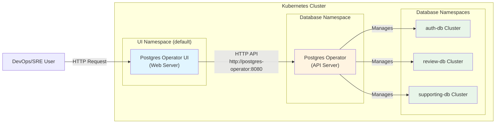

### Configuration

**Key Configuration Parameters:**

1. **Operator API URL** (`operatorApiUrl`):
   - **Purpose**: UI connects to operator's REST API to manage clusters
   - **Format**: `http://{service-name}:{port}`
   - **Default**: `http://postgres-operator:8080`
   - **In Project**: Should be `http://postgres-operator.database.svc.cluster.local:8080` (full FQDN) or `http://postgres-operator:8080` if UI is in same namespace

2. **Target Namespace** (`targetNamespace`):
   - **Purpose**: Controls which namespaces UI can view/manage clusters
   - **Options**:
     - `"*"` - View/manage clusters in ALL namespaces (recommended for multi-namespace setup)
     - `"default"` - Only view/manage clusters in default namespace
     - `"namespace-name"` - Only view/manage clusters in specific namespace
   - **In Project**: Should be `"*"` to see clusters in `auth`, `user`, `review` namespaces

3. **Teams** (`teams`):
   - **Purpose**: Filter clusters by team (if using Teams API)
   - **Format**: Array of team names, e.g., `["acid", "platform"]`
   - **In Project**: Can be empty `[]` if not using Teams API

4. **Resources Visible** (`resourcesVisible`):
   - **Purpose**: Control visibility of cluster resources in UI
   - **Options**: `"True"` or `"False"`
   - **Default**: `"False"`

### Deployment Configuration

**Recommended Values for Project:**

```yaml
# k8s/postgres-operator/zalando/ui-values.yaml
replicaCount: 1

image:
  registry: ghcr.io
  repository: zalando/postgres-operator-ui
  tag: v1.15.1
  pullPolicy: IfNotPresent

envs:
  appUrl: "http://localhost:8081"
  operatorApiUrl: "http://postgres-operator.database.svc.cluster.local:8080"
  operatorClusterNameLabel: "cluster-name"
  resourcesVisible: "False"
  targetNamespace: "*"  # View all namespaces
  teams: []  # Empty if not using Teams API

service:
  type: ClusterIP
  port: 80

ingress:
  enabled: false  # Enable if external access needed
  # annotations: {}
  # hosts:
  #   - host: postgres-ui.example.org
  #     paths: ["/"]
```

### Integration with Operator

**How UI Connects to Operator:**

1. **Operator API Endpoint**: Operator exposes REST API on port `8080`
2. **Service Discovery**: UI uses Kubernetes service DNS to find operator:
   - Service name: `postgres-operator`
   - Namespace: `database` (in this project)
   - Full FQDN: `postgres-operator.database.svc.cluster.local:8080`
3. **API Communication**: UI makes HTTP requests to operator API to:
   - List clusters: `GET /clusters`
   - Get cluster details: `GET /clusters/{namespace}/{name}`
   - Create cluster: `POST /clusters`
   - Update cluster: `PATCH /clusters/{namespace}/{name}`

### Namespace Visibility

**Multi-Namespace Setup:**

When `targetNamespace: "*"` is set:
- UI can view clusters in ALL namespaces (`auth`, `user`, `review`, etc.)
- UI can create clusters in any namespace
- Useful for centralized database management

**Single Namespace Setup:**

When `targetNamespace: "default"` or specific namespace:
- UI only sees clusters in that namespace
- More restrictive, suitable for namespace isolation

### Deployment Considerations

**Namespace Options:**

1. **Deploy in `database` namespace** (same as operator):
   - **Pros**: Same namespace as operator, simpler service discovery
   - **Cons**: Mixes operator and UI components
   - **Service URL**: `http://postgres-operator:8080` (short name works)

2. **Deploy in `monitoring` namespace** (with Grafana/Prometheus):
   - **Pros**: Groups all observability/admin tools together
   - **Cons**: Requires full FQDN for operator service
   - **Service URL**: `http://postgres-operator.database.svc.cluster.local:8080`

3. **Deploy in `default` namespace** (as per official example):
   - **Pros**: Simple, matches official documentation
   - **Cons**: Not aligned with project namespace structure
   - **Service URL**: `http://postgres-operator.database.svc.cluster.local:8080`

**Recommendation**: Deploy in `database` namespace for simplicity, or `monitoring` namespace to group with other admin tools.

### Access Methods

**ClusterIP (Default):**
- Access via port-forward: `kubectl port-forward -n database svc/postgres-operator-ui 8081:80`
- URL: `http://localhost:8081`

**Ingress (Optional):**
- Enable ingress in values.yaml
- Configure hostname and TLS
- Access via external URL: `https://postgres-ui.example.org`

### Benefits

**For DevOps/SRE Teams:**
- ✅ **Visual Cluster Management**: View all clusters in one interface
- ✅ **Quick Status Checks**: See cluster health without kubectl commands
- ✅ **Cluster Creation**: Create new clusters via UI (useful for developers)
- ✅ **Multi-Namespace View**: See clusters across all namespaces with `targetNamespace: "*"`
- ✅ **Reduced kubectl Dependency**: Less need for command-line access

**For Developers:**
- ✅ **Self-Service**: Create database clusters without DevOps intervention
- ✅ **Status Visibility**: Check cluster status without kubectl access
- ✅ **User-Friendly**: Web interface is more accessible than kubectl

### Limitations

- ⚠️ **Read-Only Operations**: Some operations may require kubectl (advanced configurations)
- ⚠️ **Teams API Dependency**: Full functionality requires Teams API (optional)
- ⚠️ **Namespace Permissions**: UI needs RBAC permissions to view/manage clusters
- ⚠️ **Operator API Dependency**: UI requires operator API to be accessible

### Security Considerations

**RBAC Requirements:**
- UI pod needs ServiceAccount with permissions to:
  - List/get Postgresql CRDs in target namespaces
  - Create/update Postgresql CRDs (if cluster creation enabled)
  - View secrets (for connection info)

**Network Security:**
- UI communicates with operator via Kubernetes internal network
- No external network access required
- Can be exposed via Ingress with TLS for external access

### Recommended Next Steps

1. **Create Helm Values File**: `k8s/postgres-operator/zalando/ui-values.yaml`
2. **Add Deployment Step**: Update `scripts/04-deploy-databases.sh` to deploy UI
3. **Configure Access**: Set up port-forward or Ingress for UI access
4. **Document Access**: Add UI access instructions to `docs/guides/DATABASE.md`

---

## References

- User-provided research: Zalando operator secret customization
- Zalando Postgres Operator GitHub: https://github.com/zalando/postgres-operator
- Current implementation: `scripts/04b-sync-supporting-db-secrets.sh`
- Operator configuration: `k8s/postgres-operator/zalando/values.yaml`
- Database CRD: `k8s/postgres-operator-zalando/crds/supporting-db.yaml`

---

## 15. PostgreSQL Monitoring with Sidecar Exporter

**Topic:** Monitoring User Permissions and Sidecar Approach for PostgreSQL Clusters  
**Status:** ✅ Research Complete (preparedDatabases clarified, sidecar approach documented)  
**Version:** 1.4 (Clarified production-ready approach)

### Research Question

**User's Concern:**
> "ủa khoan bro. bro nói là zalando built-in monitoring mà sao lại tạo mấy này theo manual vậy nhỉ? bạn có research kĩ chưa."

**Core Question:**
- Zalando Postgres Operator có tự động grant permissions cho infrastructure roles không?
- Có cách nào cấu hình permissions tự động thay vì manual GRANT statements không?
- postgres_exporter cần permissions gì để hoạt động?
- Có best practices nào về permissions cho monitoring users không?
- Có cách nào deploy postgres_exporter mà không cần infrastructure roles không? (Sidecar approach)

### Key Findings

#### Finding 1: Zalando Operator Supports Sidecar Containers for postgres_exporter

**Status:** ✅ **NEW FINDING**  
**Date:** 2025-12-26

Zalando Postgres Operator supports **sidecar containers** in PostgreSQL CRD, allowing postgres_exporter to run as a sidecar in the same pod as PostgreSQL. This is an alternative to standalone postgres_exporter deployment.

**Configuration Example:**
```yaml
apiVersion: "acid.zalan.do/v1"
kind: postgresql
metadata:
  name: my-cluster
spec:
  sidecars:
    - name: exporter
      image: quay.io/prometheuscommunity/postgres-exporter:v0.18.1
      args:
      - --collector.stat_statements
      ports:
      - name: exporter
        containerPort: 9187
        protocol: TCP
      resources:
        limits:
          cpu: 500m
          memory: 256M
        requests:
          cpu: 100m
          memory: 256M
      env:
      - name: "DATA_SOURCE_URI"
        value: "localhost/postgres?sslmode=require"
      - name: "DATA_SOURCE_USER"
        value: "$(POSTGRES_USER)"  # Uses PostgreSQL pod's user
      - name: "DATA_SOURCE_PASS"
        value: "$(POSTGRES_PASSWORD)"  # Uses PostgreSQL pod's password
```

**Key Benefits:**
- ✅ **No infrastructure roles needed** - Uses PostgreSQL pod's own credentials
- ✅ **No permission grants needed** - Uses database owner credentials (has full access)
- ✅ **Simpler configuration** - No separate secrets or monitoring users
- ✅ **Automatic credential management** - Credentials come from PostgreSQL pod environment
- ✅ **Co-located** - Exporter runs in same pod, better network locality
- ✅ **Per-cluster isolation** - Production-ready approach with PodMonitor per cluster

**Prometheus Operator Integration:**
Each cluster should have its own PodMonitor (production-ready approach):

```yaml
apiVersion: monitoring.coreos.com/v1
kind: PodMonitor
metadata:
  name: postgresql-auth-db
  namespace: auth
spec:
  selector:
    matchLabels:
      application: spilo  # Zalando operator default label
      cluster-name: auth-db  # Specific cluster
  podTargetLabels:
  - spilo-role
  - cluster-name
  - team
  podMetricsEndpoints:
  - port: exporter
    interval: 15s
    scrapeTimeout: 10s
```

**Comparison: Sidecar vs Standalone:**

| Aspect | Sidecar Approach | Standalone Approach |
|--------|------------------|---------------------|
| **Infrastructure Roles** | ❌ Not needed | ✅ Required |
| **Permission Grants** | ❌ Not needed | ⚠️ Optional (may work with LOGIN only) |
| **Credential Management** | ✅ Automatic (pod env vars) | ⚠️ Manual (separate secrets) |
| **Configuration** | ✅ Per-cluster (CRD) - Production-ready | ✅ Centralized (Helm values) |
| **Resource Usage** | ⚠️ Per-pod overhead | ✅ Shared exporter (single instance) |
| **Network Locality** | ✅ Same pod (localhost) | ⚠️ Network hop (service DNS) |
| **Monitoring Isolation** | ✅ Per-cluster (production-ready) | ⚠️ Shared (single point of failure) |
| **Setup Complexity** | ✅ Simple (add to CRD) | ⚠️ Moderate (roles + secrets) |
| **Use Case** | ✅ **Production-ready per-cluster monitoring** | ✅ Centralized monitoring (dev/test) |

#### Finding 2: preparedDatabases Exists But Doesn't Solve Infrastructure Role Permissions

**Status:** ✅ Resolved  
**Date:** 2025-12-26

`preparedDatabases` is a **modern, recommended feature** (NOT legacy) in Zalando Postgres Operator that allows configuring:
- **Role setup** with `<dbname>_owner` naming convention
- **Schemas** (creates `data` schema by default if none specified)
- **Extensions** (e.g., `pg_repack`)

**Important Clarification:**
- ✅ `preparedDatabases` is **NOT legacy** - it's a **recommended, modern approach**
- ✅ Migration path exists: `databases/users` → `preparedDatabases` (newer approach)
- ❌ `preparedDatabases` does **NOT** automatically grant permissions to infrastructure roles
- ❌ `preparedDatabases` is for **manifest roles** (database owners), not infrastructure roles

#### Finding 3: Infrastructure Roles Only Get LOGIN Privilege

**Status:** ✅ Confirmed  
**Date:** 2025-12-26

Infrastructure roles created by Zalando operator get:
- ✅ `LOGIN` privilege (can connect to database)
- ❌ No database-specific privileges
- ❌ No schema-specific privileges
- ❌ No table-level privileges

**Exact SQL Statement (Inferred):**
```sql
CREATE ROLE postgres_monitoring WITH LOGIN PASSWORD '<password-from-secret>';
```

**Impact:**
- Infrastructure roles can connect but cannot query tables or schemas
- Manual grants required for database/schema/table access
- OR: May not be needed if postgres_exporter only queries system catalogs

#### Finding 4: postgres_exporter Permission Requirements

**Status:** ✅ **RESOLVED** - `LOGIN` privilege sufficient for system catalogs

postgres_exporter primarily queries PostgreSQL system catalogs (`pg_stat_*`, `pg_database`, etc.), which are accessible to all users with `LOGIN` privilege. Manual grants (Phase 4) are optional and only needed if monitoring application tables.

### Recommendations

#### Recommendation 1: Consider Sidecar Approach for Simplicity (Production-Ready)

**Priority:** High

**Description:**
Consider using Zalando operator's sidecar container support for postgres_exporter instead of standalone deployment with infrastructure roles. This approach eliminates the need for infrastructure roles and permission grants entirely.

**When to Use Sidecar (Recommended for Production):**
- ✅ **Production-ready monitoring** - Per-cluster isolation
- ✅ Simpler setup - No infrastructure roles needed
- ✅ Using Prometheus Operator (for PodMonitor support)
- ✅ Want isolated monitoring per cluster (best practice)
- ✅ Better reliability - Failure in one cluster doesn't affect others

**When to Use Standalone:**
- ✅ Development/testing environments (simpler centralized config)
- ✅ Need more flexible credential management
- ✅ Already have infrastructure roles for other purposes (backups, etc.)
- ✅ Want to minimize resource usage (single exporter instance)

#### Recommendation 2: Test postgres_exporter with Minimal Permissions First (Standalone Approach)

**Priority:** High

**Description:**
Before implementing manual permission grants, test if postgres_exporter works with just `LOGIN` privilege. postgres_exporter primarily queries PostgreSQL system catalogs, which are typically accessible to all users.

**Rationale:**
- System catalogs are usually readable by all PostgreSQL users
- postgres_exporter may not need SELECT on application tables
- Manual grants may be unnecessary if system catalog access is sufficient

#### Recommendation 3: Do NOT Use preparedDatabases for Infrastructure Roles

**Priority:** High

**Description:**
`preparedDatabases` is **NOT** the solution for infrastructure role permissions. It's designed for manifest roles (database owners), not infrastructure roles.

**Important Note:**
- `preparedDatabases` is **NOT legacy** - it's a modern, recommended feature
- However, it's for **manifest roles** (database owners), not infrastructure roles
- Infrastructure roles use a different mechanism (`infrastructure_roles_secrets`)

### Next Steps

1. ✅ **Completed:** Review Zalando operator documentation for `preparedDatabases`
2. ✅ **Completed:** Research postgres_exporter permission requirements (system catalogs sufficient)
3. ✅ **Completed:** Found sidecar approach (alternative to standalone)
4. **Next:** Update plan and tasks to include sidecar option
5. **Then:** Decide on approach (sidecar vs standalone) based on requirements
6. **Finally:** Implement chosen approach (sidecar simpler, standalone more flexible)

### Related Documents

- **Specification:** `specs/active/Zalando-operator/spec.md` (includes monitoring requirements)
- **Technical Plan:** `specs/active/Zalando-operator/plan.md` (includes monitoring implementation)
- **Tasks:** `specs/active/Zalando-operator/tasks.md` (includes monitoring tasks)

---

*Research completed with SDD 2.0*

