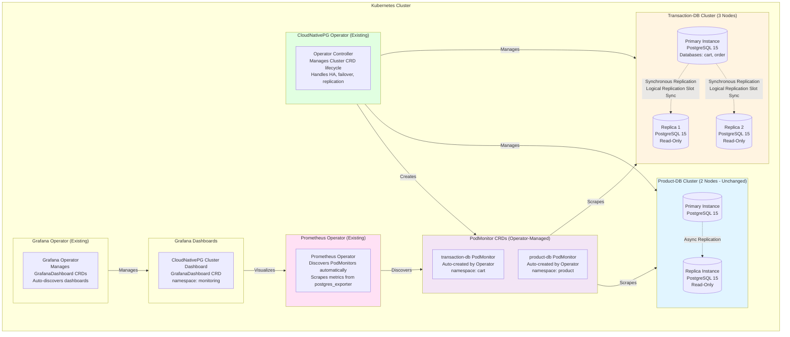

# Technical Plan: CloudNativePG Production-Ready Configuration

**Task ID:** cloudnativepg-operator
**Created:** 2025-12-29
**Last Updated:** 2026-01-02
**Status:** Ready for Implementation
**Based on:** spec.md v1.2

---

## 1. System Architecture

### Overview

This implementation involves declarative configuration updates to existing CloudNativePG PostgreSQL clusters. The architecture leverages Kubernetes operators (CloudNativePG and Prometheus) to manage cluster lifecycle and monitoring automatically.



### Architecture Decisions

| Decision | Choice | Rationale |
|----------|--------|-----------|
| **Configuration Approach** | Declarative YAML (GitOps) | All changes in Git, version-controlled, rollback-friendly |
| **HA Strategy** | 3 instances with synchronous replication | Zero data loss, automatic failover, read scaling |
| **Logical Replication** | Slot synchronization enabled | Required for CDC clients (Debezium, Kafka Connect) |
| **Resource Limits** | Reduced (1Gi/2Gi memory, 500m/1000m CPU) | Cost optimization, sufficient for current workloads |
| **Storage Class** | `standard` (fallback) | Works with Kind cluster, comment out `fast-ssd` requirement |
| **Monitoring** | Manual PodMonitor (CRDs) | Official recommended approach, full control, no deprecation concerns |
| **Grafana Dashboard** | Grafana Operator (GrafanaDashboard CRD) | Matches existing Grafana setup, no Helm dependencies |
| **Anti-Affinity** | Commented out | Not needed for current setup, can enable later with node labels |

---

## 2. Technology Stack

| Layer | Technology | Version | Rationale |
|-------|------------|---------|-----------|
| **Kubernetes Operator** | CloudNativePG | 1.28.1+ | Existing operator, supports logical replication slot sync |
| **PostgreSQL** | PostgreSQL | 15+ | Managed by CloudNativePG, supports logical replication |
| **Monitoring** | Prometheus Operator | Latest | Existing operator, auto-discovers operator-created PodMonitors |
| **Metrics Exporter** | postgres_exporter | Built-in | CloudNativePG includes postgres_exporter sidecar |
| **Visualization** | Grafana Operator | v5.20.0 | Existing operator, manages GrafanaDashboard CRDs |
| **Configuration** | Kubernetes CRDs | v1 | Cluster CRD, PodMonitor CRD (manual), GrafanaDashboard CRD |
| **Storage** | Kubernetes PVC | v1 | Persistent volumes for PostgreSQL data |

### Dependencies

**Existing Infrastructure:**
- ✅ CloudNativePG Operator installed (v1.28.1)
- ✅ Prometheus Operator installed
- ✅ Kubernetes cluster (Kind or production)
- ✅ Transaction-DB cluster (2 instances, operational)
- ✅ Product-DB cluster (2 instances, operational)

**No New Dependencies Required** - All components already exist.

---

## 3. Component Design

### Component 1: Transaction-DB Cluster CRD

**Purpose:** Upgrade transaction-db cluster to production-ready configuration with HA, logical replication slot sync, and performance tuning.

**Responsibilities:**
- Manage 3-node HA cluster (1 primary + 2 replicas)
- Configure synchronous replication for zero data loss
- Enable logical replication slot synchronization
- Apply production-optimized PostgreSQL parameters
- Manage resource limits and storage configuration

**File:** `k8s/postgres-operator-cloudnativepg/crds/transaction-db.yaml`

**Key Changes:**
```yaml
spec:
  instances: 3  # Upgrade from 2
  
  replicationSlots:
    highAvailability:
      synchronizeLogicalDecoding: true  # NEW
  
  postgresql:
    synchronous:  # NEW
      method: any
      number: 1
      dataDurability: required
    
    parameters:
      # Production tuning parameters (comprehensive update)
      wal_level: "logical"  # NEW (required for logical replication)
      shared_buffers: "512MB"  # Updated from 256MB
      effective_cache_size: "1.5GB"  # Updated from 512MB
      # ... (see full configuration in Implementation Phases)
  
  resources:  # Updated
    requests:
      memory: "1Gi"  # Updated from 256Mi
      cpu: "500m"  # Updated from 200m
    limits:
      memory: "2Gi"  # Updated from 512Mi
      cpu: "1000m"  # Updated from 500m
  
  storage:  # Updated
    size: 100Gi  # Updated from 10Gi
    storageClass: standard  # Use standard (not fast-ssd)
```

**Dependencies:**
- CloudNativePG Operator (must be running)
- Secret `transaction-db-secret` in `cart` namespace (already exists)

**Rollback Strategy:**
- Git revert to previous version
- Operator will automatically reconcile cluster back to 2 instances
- No data loss (downgrade is safe)

---

### Component 2: Manual PodMonitor Configuration

**Purpose:** Create manual PodMonitor resources for both CloudNativePG clusters. The `enablePodMonitor: true` feature is deprecated and will be removed in future CloudNativePG versions. Manual PodMonitor creation is the recommended approach per official CloudNativePG documentation.

**Responsibilities:**
- Create PodMonitor CRDs for transaction-db and product-db clusters
- Ensure correct selector labels (`cnpg.io/cluster`)
- Configure scrape endpoints with proper port and labels
- Remove deprecated `enablePodMonitor: true` from Cluster CRDs (if present)

**Files to Create:**
- `k8s/prometheus/podmonitors/podmonitor-transaction-db.yaml` (NEW)
- `k8s/prometheus/podmonitors/podmonitor-product-db.yaml` (NEW)

**Files to Update:**
- `k8s/postgres-operator/cloudnativepg/crds/transaction-db.yaml` - Remove `monitoring.enablePodMonitor` section (if exists)
- `k8s/postgres-operator/cloudnativepg/crds/product-db.yaml` - Remove `monitoring.enablePodMonitor` section (if exists)

**Configuration:**
```yaml
# PodMonitor for transaction-db
apiVersion: monitoring.coreos.com/v1
kind: PodMonitor
metadata:
  name: transaction-db
  namespace: cart
  labels:
    app: transaction-db
    operator: cloudnativepg
spec:
  selector:
    matchLabels:
      cnpg.io/cluster: transaction-db  # Required: Must match cluster name
  podMetricsEndpoints:
  - port: metrics  # Port name (9187)
    interval: 15s
    scrapeTimeout: 10s
    path: /metrics
  podTargetLabels:
    - cnpg.io/cluster
    - cnpg.io/instanceRole
    - cnpg.io/instanceName
```

**Dependencies:**
- Prometheus Operator (must be running for auto-discovery)
- CloudNativePG clusters must be running (for label discovery)

**Benefits:**
- ✅ Full control over monitoring configuration
- ✅ No deprecation concerns (official recommended approach)
- ✅ Customizable scrape intervals, timeouts, relabeling
- ✅ Version-controlled independently
- ✅ Production-ready approach per CloudNativePG documentation

**Important Notes:**
- ⚠️ **`enablePodMonitor: true` is DEPRECATED** - Do not use
- ✅ **Manual PodMonitor is RECOMMENDED** - Official CloudNativePG guidance
- ✅ Selector must use `cnpg.io/cluster: <cluster-name>` label (required)
- ✅ Port name: `metrics` (maps to port 9187)
- ✅ Prometheus Operator auto-discovers PodMonitors by namespace

**Reference:** [CloudNativePG Monitoring Documentation](https://cloudnative-pg.io/docs/1.28/monitoring)

---

### Component 3: Grafana Dashboard (Grafana Operator)

**Purpose:** Install official CloudNativePG Grafana dashboard using Grafana Operator approach.

**Responsibilities:**
- Download CloudNativePG dashboard JSON
- Create GrafanaDashboard CRD
- Configure Prometheus data source mapping
- Enable automatic dashboard discovery

**File:** `k8s/grafana-operator/dashboards/cnpg-cluster-dashboard.yaml` (NEW)

**Configuration:**
```yaml
apiVersion: grafana.integreatly.org/v1beta1
kind: GrafanaDashboard
metadata:
  name: cnpg-cluster-dashboard
  namespace: monitoring
  labels:
    app: grafana
spec:
  instanceSelector:
    matchLabels:
      dashboards: grafana
  folder: "Databases"
  json: |
    {
      "dashboard": {
        // CloudNativePG dashboard JSON content
        // Downloaded from: https://raw.githubusercontent.com/cloudnative-pg/grafana-dashboards/main/charts/cluster/grafana-dashboard.json
      }
    }
  datasources:
    - inputName: DS_PROMETHEUS
      datasourceName: Prometheus
```

**Alternative: ConfigMap Approach (if JSON too large):**
```yaml
# If JSON is too large, use ConfigMap reference (like existing dashboards)
apiVersion: grafana.integreatly.org/v1beta1
kind: GrafanaDashboard
metadata:
  name: cnpg-cluster-dashboard
  namespace: monitoring
spec:
  instanceSelector:
    matchLabels:
      dashboards: grafana
  folder: "Databases"
  configMapRef:
    name: grafana-dashboard-cnpg
    key: cnpg-cluster-dashboard.json
  datasources:
    - inputName: DS_PROMETHEUS
      datasourceName: Prometheus
```

**Dependencies:**
- Grafana Operator (must be running)
- Prometheus data source configured in Grafana
- CloudNativePG dashboard JSON downloaded

**Deployment:**
- Apply via `kubectl apply -k k8s/grafana-operator/dashboards/` (kustomization)
- Or apply directly: `kubectl apply -f k8s/grafana-operator/dashboards/cnpg-cluster-dashboard.yaml`

---

## 4. Configuration Changes

### 4.1 Transaction-DB Cluster CRD Updates

**File:** `k8s/postgres-operator-cloudnativepg/crds/transaction-db.yaml`

**Section 1: Instance Count**
```yaml
# BEFORE
instances: 2  # 1 primary + 1 replica for HA

# AFTER
instances: 3  # 1 primary + 2 replicas for HA
```

**Section 2: Logical Replication Slot Synchronization (NEW)**
```yaml
# ADD NEW SECTION
replicationSlots:
  highAvailability:
    synchronizeLogicalDecoding: true
```

**Section 3: Synchronous Replication (NEW)**
```yaml
# ADD TO postgresql section
postgresql:
  synchronous:
    method: any  # Quorum-based
    number: 1  # At least 1 synchronous replica
    dataDurability: required  # Zero data loss
```

**Section 4: PostgreSQL Parameters (COMPREHENSIVE UPDATE)**
```yaml
postgresql:
  parameters:
    # Memory settings (adjusted for 2Gi pod memory)
    shared_buffers: "512MB"  # 25% of 2GB (was: 256MB)
    effective_cache_size: "1.5GB"  # 75% of 2GB (was: 512MB)
    maintenance_work_mem: "512MB"  # (was: 128MB)
    work_mem: "32MB"  # (was: 8MB)
    
    # WAL settings (for high-write workloads + logical replication)
    wal_buffers: "16MB"  # (unchanged)
    wal_level: "logical"  # NEW (required for logical replication)
    min_wal_size: "2GB"  # (was: 1GB)
    max_wal_size: "8GB"  # (was: 4GB)
    checkpoint_completion_target: "0.9"  # (unchanged)
    checkpoint_timeout: "15min"  # NEW
    
    # Query planner (SSD optimization)
    random_page_cost: "1.1"  # (was: 4.0)
    effective_io_concurrency: "200"  # (was: 2)
    default_statistics_target: "100"  # (unchanged)
    
    # Parallelism settings
    max_worker_processes: "8"  # NEW
    max_parallel_workers_per_gather: "4"  # NEW
    max_parallel_workers: "8"  # NEW
    max_parallel_maintenance_workers: "4"  # NEW
    
    # Connection settings
    max_connections: "200"  # (unchanged)
    
    # Autovacuum tuning
    autovacuum: "on"  # NEW
    autovacuum_max_workers: "3"  # NEW
    autovacuum_vacuum_scale_factor: "0.1"  # NEW
    autovacuum_analyze_scale_factor: "0.05"  # NEW
    autovacuum_vacuum_cost_delay: "10ms"  # NEW
    autovacuum_vacuum_cost_limit: "200"  # NEW
    
    # Logging (comprehensive)
    log_statement: "mod"  # NEW
    log_min_duration_statement: "1000"  # NEW
    log_checkpoints: "on"  # NEW
    log_lock_waits: "on"  # NEW
    log_temp_files: "0"  # NEW
    log_autovacuum_min_duration: "1000"  # NEW
    log_connections: "on"  # NEW
    log_disconnections: "on"  # NEW
    logging_collector: "on"  # NEW
    log_filename: 'postgresql-%Y-%m-%d_%H%M%S.log'  # NEW
    log_rotation_age: "1d"  # NEW
    log_rotation_size: "128MB"  # NEW
    
    # Security
    password_encryption: "scram-sha-256"  # NEW
    
    # Replication (for logical replication slot sync)
    hot_standby_feedback: "on"  # NEW
```

**Section 5: Sync Replica Election Constraint (COMMENT OUT)**
```yaml
# BEFORE
syncReplicaElectionConstraint:
  enabled: false

# AFTER (comment out, not needed)
# syncReplicaElectionConstraint:
#   enabled: false
#   # Not needed for current setup
#   # Can enable later with node labels:
#   # enabled: true
#   # nodeLabelsAntiAffinity:
#   #   - key: topology.kubernetes.io/zone
#   #     values: ["zone-a", "zone-b", "zone-c"]
```

**Section 6: Resource Limits (UPDATE)**
```yaml
# BEFORE
resources:
  requests:
    memory: "256Mi"
    cpu: "200m"
  limits:
    memory: "512Mi"
    cpu: "500m"

# AFTER
resources:
  requests:
    memory: "1Gi"  # Increased from 256Mi
    cpu: "500m"  # Increased from 200m
  limits:
    memory: "2Gi"  # Increased from 512Mi
    cpu: "1000m"  # Increased from 500m
```

**Section 7: Storage (UPDATE)**
```yaml
# BEFORE
storage:
  size: 10Gi
  storageClass: standard

# AFTER
storage:
  size: 100Gi  # Increased from 10Gi
  storageClass: standard  # Keep standard (not fast-ssd)
  # Note: fast-ssd not available, using standard storage class
```

---

### 4.2 Monitoring Configuration (Manual PodMonitor Creation)

**⚠️ IMPORTANT**: `spec.monitoring.enablePodMonitor: true` is **DEPRECATED** and will be removed in future CloudNativePG versions. Manual PodMonitor creation is the recommended approach.

**Files to Create:**
- `k8s/prometheus/podmonitors/podmonitor-transaction-db.yaml` (NEW)
- `k8s/prometheus/podmonitors/podmonitor-product-db.yaml` (NEW)

**Files to Update (if `enablePodMonitor: true` exists):**
- `k8s/postgres-operator/cloudnativepg/crds/transaction-db.yaml` - Remove `monitoring.enablePodMonitor` section
- `k8s/postgres-operator/cloudnativepg/crds/product-db.yaml` - Remove `monitoring.enablePodMonitor` section

**PodMonitor Configuration Pattern:**
```yaml
apiVersion: monitoring.coreos.com/v1
kind: PodMonitor
metadata:
  name: <cluster-name>
  namespace: <cluster-namespace>
  labels:
    app: <cluster-name>
    operator: cloudnativepg
spec:
  selector:
    matchLabels:
      cnpg.io/cluster: <cluster-name>  # Required: Must match cluster name
  podMetricsEndpoints:
  - port: metrics  # Port name (9187)
    interval: 15s
    scrapeTimeout: 10s
    path: /metrics
  podTargetLabels:
    - cnpg.io/cluster
    - cnpg.io/instanceRole
    - cnpg.io/instanceName
```

**Reference:** [CloudNativePG Monitoring Documentation](https://cloudnative-pg.io/docs/1.28/monitoring)

### 4.3 Grafana Dashboard (NEW FILE)

**File:** `k8s/grafana-operator/dashboards/cnpg-cluster-dashboard.yaml`
- GrafanaDashboard CRD with CloudNativePG dashboard JSON
- Download JSON from: `https://raw.githubusercontent.com/cloudnative-pg/grafana-dashboards/main/charts/cluster/grafana-dashboard.json`
- Use ConfigMap approach if JSON too large (add to kustomization.yaml)

**Optional: Update kustomization.yaml**
- Add ConfigMap generator entry for cnpg dashboard JSON (if using ConfigMap approach)

---

## 5. Security Considerations

### Authentication & Authorization
- **Password Encryption**: `scram-sha-256` (more secure than MD5)
- **Secret Management**: Secrets stored in YAML files (acceptable for personal projects)
- **Namespace Isolation**: Each cluster in its own namespace (cart, product)

### Data Protection
- **Connection Logging**: All connections and disconnections logged for audit
- **Statement Logging**: DDL and DML statements logged (`log_statement: "mod"`)
- **Slow Query Logging**: Queries >1 second logged for performance monitoring

### Security Checklist
- [x] Password encryption configured (`scram-sha-256`)
- [x] Connection logging enabled
- [x] Statement logging enabled (DDL + DML)
- [x] Secrets stored in Git (acceptable for personal projects)
- [x] Namespace isolation maintained
- [ ] TLS/SSL encryption (deferred to future work)
- [ ] Network policies (deferred to future work)

---

## 6. Performance Strategy

### Optimization Targets

| Metric | Current | Target | Strategy |
|--------|---------|--------|----------|
| **Query Performance** | Baseline | Improved | Production tuning parameters |
| **Memory Utilization** | 256MB shared_buffers | 512MB shared_buffers | Better cache hit ratio |
| **WAL Management** | 4GB max_wal_size | 8GB max_wal_size | Reduced checkpoint frequency |
| **Parallel Queries** | Disabled | Enabled | Multi-core performance |
| **Autovacuum** | Default | Aggressive | Faster cleanup for high-write workloads |

### Caching Strategy
- **Shared Buffers**: 512MB (25% of 2GB memory) - PostgreSQL shared cache
- **Effective Cache Size**: 1.5GB (75% of 2GB) - Helps query planner
- **OS Cache**: Remaining memory available for OS-level caching

### Scaling Approach
- **Read Scaling**: 2 replicas available for read operations (PgCat can route reads)
- **Write Scaling**: Single primary handles all writes (synchronous replication ensures consistency)
- **Connection Scaling**: Max 200 connections (connection pooler recommended)

### Resource Optimization
- **Reduced Limits**: 1Gi/2Gi memory, 500m/1000m CPU (cost optimization)
- **Storage**: 100Gi PVC (sufficient for production workloads)
- **SSD Optimization**: `random_page_cost: 1.1`, `effective_io_concurrency: 200`

---

## 7. Implementation Phases

### Phase 1: Preparation & Backup (Day 1 - 30 minutes)

**Objectives:**
- Verify prerequisites
- Backup current configuration
- Prepare rollback plan

**Tasks:**
- [ ] Verify CloudNativePG Operator is running: `kubectl get pods -n database`
- [ ] Verify Prometheus Operator is running: `kubectl get pods -n monitoring`
- [ ] Verify transaction-db cluster is operational: `kubectl get cluster transaction-db -n cart`
- [x] Backup current transaction-db.yaml: `cp k8s/postgres-operator-cloudnativepg/crds/transaction-db.yaml k8s/postgres-operator-cloudnativepg/crds/transaction-db.yaml.backup` (backup later removed)
- [ ] Verify secrets exist: `kubectl get secret transaction-db-secret -n cart`
- [ ] Check cluster status: `kubectl get pods -n cart -l cnpg.io/cluster=transaction-db`

**Verification:**
```bash
# Check operator
kubectl get pods -n database -l app.kubernetes.io/name=cloudnative-pg

# Check cluster
kubectl get cluster transaction-db -n cart

# Check pods
kubectl get pods -n cart -l cnpg.io/cluster=transaction-db
```

---

### Phase 2: Update Transaction-DB Cluster CRD (Day 1 - 1 hour)

**Objectives:**
- Update cluster configuration with HA, logical replication slot sync, and production tuning
- Apply changes incrementally

**Tasks:**
- [ ] Update `instances: 3` in transaction-db.yaml
- [ ] Add `replicationSlots.highAvailability.synchronizeLogicalDecoding: true`
- [ ] Add `postgresql.synchronous` configuration
- [ ] Update PostgreSQL parameters (memory, WAL, parallelism, autovacuum, logging)
- [ ] Update resource limits (1Gi/2Gi memory, 500m/1000m CPU)
- [ ] Update storage (100Gi, standard storage class)
- [ ] Comment out `syncReplicaElectionConstraint` section
- [ ] Apply configuration: `kubectl apply -f k8s/postgres-operator-cloudnativepg/crds/transaction-db.yaml`
- [ ] Monitor cluster upgrade: `kubectl get cluster transaction-db -n cart -w`

**Verification:**
```bash
# Watch cluster status
kubectl get cluster transaction-db -n cart -w

# Check pods (should show 3 instances)
kubectl get pods -n cart -l cnpg.io/cluster=transaction-db

# Check cluster events
kubectl describe cluster transaction-db -n cart
```

**Expected Behavior:**
- Operator detects configuration change
- New replica pod starts (transaction-db-2)
- Cluster enters "Cluster in healthy state" after ~5-10 minutes
- All 3 pods show "Ready" status

---

### Phase 3: Create Manual PodMonitor Resources (Day 1 - 20 minutes)

**Objectives:**
- Create manual PodMonitor CRDs for both CloudNativePG clusters
- Remove deprecated `enablePodMonitor: true` from Cluster CRDs (if present)
- Verify Prometheus Operator discovers PodMonitors

**⚠️ IMPORTANT**: `spec.monitoring.enablePodMonitor: true` is **DEPRECATED**. Manual PodMonitor creation is the recommended approach per official CloudNativePG documentation.

**Tasks:**
- [ ] Remove `enablePodMonitor: true` from transaction-db.yaml (if exists):
  - Remove `spec.monitoring.enablePodMonitor: true` section
  - Or ensure no `monitoring` section exists if not needed
- [ ] Remove `enablePodMonitor: true` from product-db.yaml (if exists):
  - Remove `spec.monitoring.enablePodMonitor: true` section
  - Or ensure no `monitoring` section exists if not needed
- [ ] Create PodMonitor for transaction-db:
  - File: `k8s/prometheus/podmonitors/podmonitor-transaction-db.yaml`
  - Namespace: `cart`
  - Selector: `cnpg.io/cluster: transaction-db`
  - Port: `metrics` (9187)
- [ ] Create PodMonitor for product-db:
  - File: `k8s/prometheus/podmonitors/podmonitor-product-db.yaml`
  - Namespace: `product`
  - Selector: `cnpg.io/cluster: product-db`
  - Port: `metrics` (9187)
- [ ] Apply PodMonitors: `kubectl apply -f k8s/prometheus/podmonitors/podmonitor-{transaction,product}-db.yaml`
- [ ] Verify PodMonitors created: `kubectl get podmonitor -n cart` and `kubectl get podmonitor -n product`
- [ ] Verify PodMonitor selectors: `kubectl get podmonitor transaction-db -n cart -o yaml | grep -A 5 selector`
- [ ] Verify Prometheus Operator discovers PodMonitors (check Prometheus targets if accessible)

**Verification:**
```bash
# Check manual PodMonitors
kubectl get podmonitor -n cart
kubectl get podmonitor -n product

# Verify PodMonitor selector matches cluster
kubectl get podmonitor transaction-db -n cart -o yaml | grep -A 5 selector

# Check Prometheus targets (if Prometheus UI accessible)
# Should see transaction-db and product-db in targets list
```

**Expected Behavior:**
- Manual PodMonitors created with correct selectors (`cnpg.io/cluster`)
- Prometheus Operator discovers PodMonitors automatically
- Metrics appear in Prometheus within 1-2 minutes
- No operator-managed PodMonitors (we have full control)

---

### Phase 4: Install Grafana Dashboard (Day 1 - 30 minutes)

**Objectives:**
- Download CloudNativePG dashboard JSON
- Create GrafanaDashboard CRD
- Verify dashboard appears in Grafana

**Tasks:**
- [ ] Download CloudNativePG dashboard JSON:
  ```bash
  curl -o k8s/grafana-operator/dashboards/cnpg-cluster-dashboard.json \
    https://raw.githubusercontent.com/cloudnative-pg/grafana-dashboards/main/charts/cluster/grafana-dashboard.json
  ```
- [ ] Create GrafanaDashboard CRD:
  - File: `k8s/grafana-operator/dashboards/cnpg-cluster-dashboard.yaml`
  - Use Grafana Operator format (see Component 3)
  - Set namespace: `monitoring`
  - Set labels: `app: grafana`
  - Configure Prometheus data source mapping
- [ ] If JSON is large, use ConfigMap approach:
  - Add ConfigMap generator to `k8s/grafana-operator/dashboards/kustomization.yaml`
  - Update GrafanaDashboard CRD to use `configMapRef`
- [ ] Apply dashboard: `kubectl apply -k k8s/grafana-operator/dashboards/` or direct apply
- [ ] Verify dashboard created: `kubectl get grafanadashboard -n monitoring`
- [ ] Check Grafana UI: Dashboard should appear in "Databases" folder

**Verification:**
```bash
# Check GrafanaDashboard CRD
kubectl get grafanadashboard cnpg-cluster-dashboard -n monitoring

# Check dashboard status
kubectl describe grafanadashboard cnpg-cluster-dashboard -n monitoring

# Verify Grafana Operator discovered dashboard
kubectl logs -n monitoring -l app.kubernetes.io/name=grafana-operator | grep cnpg
```

**Expected Behavior:**
- GrafanaDashboard CRD created successfully
- Grafana Operator discovers dashboard automatically
- Dashboard appears in Grafana UI under "Databases" folder
- Dashboard panels show CloudNativePG cluster metrics
- Prometheus data source correctly configured

---

### Phase 5: Verification & Testing (Day 1 - 1 hour)

**Objectives:**
- Verify all changes are working correctly
- Test failover scenario (optional)
- Verify metrics collection

**Tasks:**
- [ ] Verify cluster has 3 instances: `kubectl get pods -n cart -l cnpg.io/cluster=transaction-db`
- [ ] Verify synchronous replication: Check cluster status shows synchronous replicas
- [ ] Verify logical replication slot sync: Check cluster logs for slot synchronization
- [ ] Verify metrics in Prometheus: Query `cnpg_collector_up{cluster="transaction-db"}`
- [ ] Verify metrics in Prometheus: Query `cnpg_collector_up{cluster="product-db"}`
- [ ] Test failover (optional): Delete primary pod and verify failover < 30 seconds
- [ ] Verify zero data loss: Check committed transactions after failover
- [ ] Check performance: Run sample queries and compare with baseline

**Verification Commands:**
```bash
# Cluster status
kubectl get cluster transaction-db -n cart -o yaml | grep -A 10 status

# Pod status
kubectl get pods -n cart -l cnpg.io/cluster=transaction-db -o wide

# Metrics (if Prometheus accessible)
curl http://localhost:9090/api/v1/query?query=cnpg_collector_up

# Failover test (optional)
kubectl delete pod transaction-db-1 -n cart
# Watch for new primary election
kubectl get pods -n cart -l cnpg.io/cluster=transaction-db -w
```

**Success Criteria:**
- ✅ 3 instances running (1 primary + 2 replicas)
- ✅ Synchronous replication active
- ✅ Logical replication slots synchronized
- ✅ Manual PodMonitor created and functional
- ✅ Metrics visible in Prometheus
- ✅ Grafana dashboard installed and functional
- ✅ Failover completes < 30 seconds (if tested)
- ✅ Zero data loss verified (if tested)

---

### Phase 6: Documentation & Cleanup (Day 1 - 30 minutes)

**Objectives:**
- Document changes
- Update research document
- Clean up backup files (optional)

**Tasks:**
- [ ] Update research document with implementation notes
- [ ] Document any issues encountered
- [ ] Update CHANGELOG.md (if applicable)
- [x] Remove backup file: `k8s/postgres-operator-cloudnativepg/crds/transaction-db.yaml.backup` (deleted)
- [ ] Commit all changes to Git

**Documentation Updates:**
- Update `specs/active/cloudnativepg-operator/research.md` with implementation status
- Note any deviations from plan
- Document operational procedures

---

## 8. Risk Assessment

| Risk | Impact | Likelihood | Mitigation |
|------|--------|------------|------------|
| **HA Upgrade Fails** | High | Low | Rollback to previous configuration, operator handles gracefully |
| **Synchronous Replica Not Available** | High | Medium | Primary blocks writes until replica ready, monitor cluster status |
| **Logical Replication Slot Sync Fails** | Medium | Low | Operator logs error, slots may not sync, CDC clients may lose data during failover |
| **Performance Tuning Causes Issues** | Medium | Low | Rollback PostgreSQL parameters, test in staging first |
| **Resource Limits Too Low** | Medium | Medium | Monitor resource usage, adjust limits if needed |
| **Storage Class Not Available** | Low | Low | Use default `standard` storage class, already configured |
| **PodMonitor Not Discovered** | Low | Low | Check Prometheus Operator logs, verify PodMonitor labels |
| **Metrics Not Scraped** | Low | Low | Check Prometheus targets, verify port name and selector |
| **Failover Takes > 30 seconds** | Medium | Low | Monitor failover time, check operator logs, verify Patroni configuration |
| **Data Loss During Failover** | High | Very Low | Synchronous replication ensures zero data loss |

### Mitigation Strategies

**For HA Upgrade:**
- Start with backup of current configuration
- Monitor cluster status during upgrade
- Have rollback plan ready (Git revert)
- Test in non-production environment first (if available)

**For Performance Tuning:**
- Apply tuning incrementally (memory first, then WAL, then parallelism)
- Monitor query performance after each change
- Have rollback plan for PostgreSQL parameters

**For Monitoring:**
- Verify PodMonitors before applying
- Check Prometheus Operator is running
- Test metrics collection in staging first

---

## 9. Open Questions

- [ ] **Testing Strategy**: Should we perform failover testing in production-like environment before deploying?
  - **Status**: Pending decision
  - **Recommendation**: Test failover in staging/development environment first

---

## 10. Success Criteria

### Technical Success
- [ ] Transaction-DB cluster running with 3 instances
- [ ] Synchronous replication configured and active
- [ ] Logical replication slot synchronization enabled
- [ ] Production tuning parameters applied
- [ ] Manual PodMonitor created for both clusters (production-ready approach)
- [ ] Metrics visible in Prometheus
- [ ] Grafana dashboard installed and functional

### Operational Success
- [ ] Failover time < 30 seconds (if tested)
- [ ] Zero data loss during failover (if tested)
- [ ] Metrics collection working (100% of clusters)
- [ ] No critical errors in operator logs
- [ ] Cluster availability maintained during upgrade

### Documentation Success
- [ ] All changes committed to Git
- [ ] Research document updated
- [ ] Configuration documented
- [ ] Operational procedures documented

---

## Next Steps

1. ✅ Review technical plan
2. Run `/tasks cloudnativepg-operator` to generate implementation tasks
3. Begin Phase 1: Preparation & Backup
4. Execute phases sequentially
5. Verify success criteria after each phase

---

## Changelog

| Version | Date | Changes | Author |
|---------|------|---------|--------|
| 1.1 | 2026-01-02 | [REFINED] Updated Component 2: Changed from built-in PodMonitor to manual PodMonitor approach. `enablePodMonitor: true` is deprecated per official CloudNativePG documentation | System |
| 1.0 | 2026-01-02 | Initial technical plan based on spec.md v1.1 | System |

---

*Plan created with SDD 2.0*
