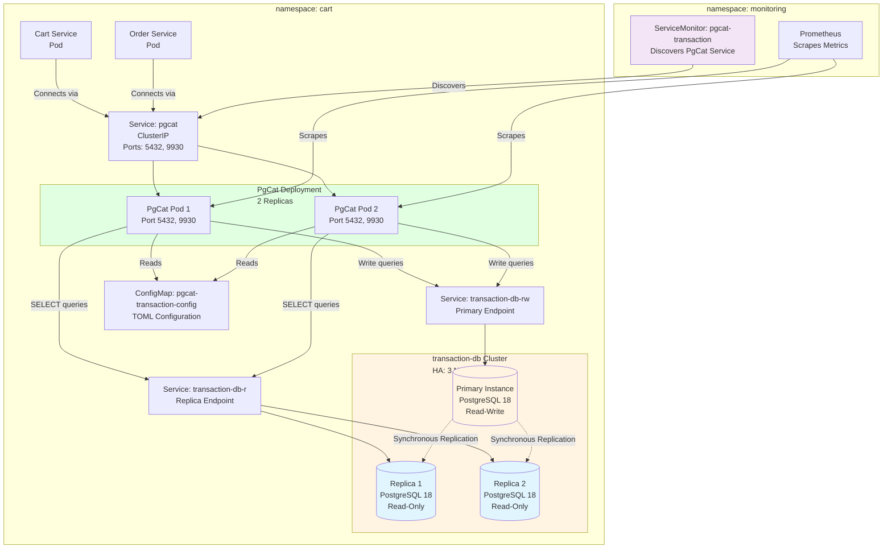
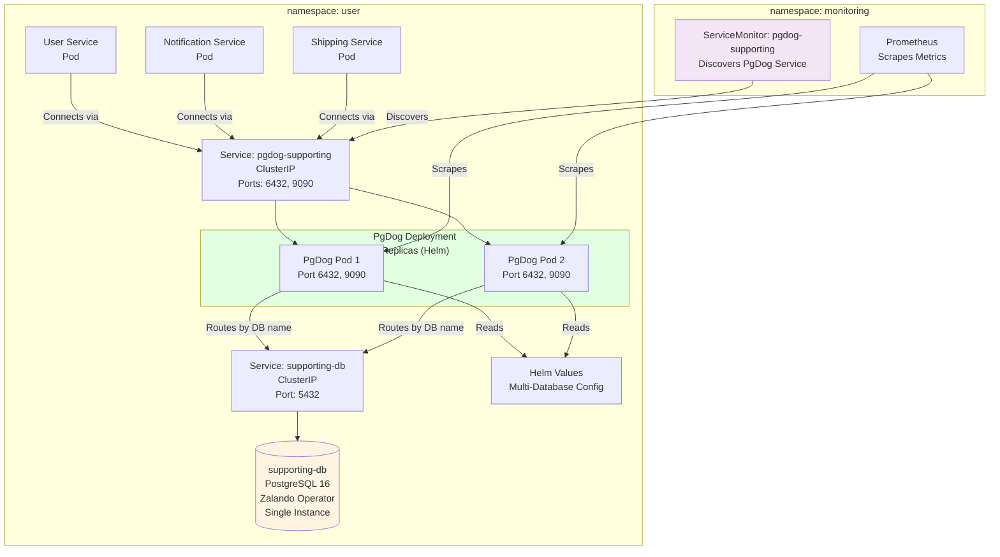

# Technical Plan: Connection Poolers Deep Dive - PgCat HA & PgDog for supporting-db

**Task ID:** connection-poolers-deepdive
**Created:** 2025-12-30
**Status:** Ready for Implementation
**Based on:** spec.md (v2.0)
**Version:** 2.0

---

## 1. System Architecture

### Overview

This plan covers two connection pooler implementations:

**Part A: PgCat HA Integration** - Enhances the existing transaction-db cluster configuration to support automatic read replica routing, load balancing, and failover. The architecture leverages CloudNativePG's service endpoints and PgCat's built-in query parser and health checking capabilities.

**Part B: PgDog Pooler for supporting-db** - Deploys PgDog via Helm chart to provide connection pooling for the supporting-db cluster (Zalando operator) with multi-database routing for user, notification, and shipping databases.



### Part B: PgDog Architecture for supporting-db



### Architecture Decisions

| Decision | Choice | Rationale |
|----------|--------|-----------|
| **Replica Service Endpoint** | Use `transaction-db-r` (read-only service) | CloudNativePG automatically creates this service that load balances across all replicas. Single endpoint simplifies configuration. |
| **Load Balancing Algorithm** | Default "random" | PgCat default is sufficient for 2 replicas. Random distribution is simple and effective. Can be changed to "least connections" if needed. |
| **Health Check Method** | PgCat built-in (`;` query) | Fast, low overhead. Runs before each query. No additional configuration needed. |
| **Failover Strategy** | Automatic with ban_time (60s) | PgCat built-in failover. Unhealthy replicas banned for 60s, then automatically rejoin. Primary never banned (safety). |
| **Monitoring Approach** | ServiceMonitor (not PodMonitor) | PgCat runs as Deployment with Service. ServiceMonitor is appropriate for service-level metrics aggregation. |
| **Configuration Management** | ConfigMap with live reload | TOML config in ConfigMap. Changes can be reloaded via SIGHUP without pod restart (except host/port changes). |
| **Multi-Database Support** | Separate pool configuration | Each database (cart, order) has its own pool with primary + replica servers. PgCat handles routing per pool. |

**Part B: PgDog for supporting-db**

| Decision | Choice | Rationale |
|----------|--------|-----------|
| **Deployment Method** | Helm chart (`helm.pgdog.dev/pgdog`) | Production-ready Helm chart with HA, monitoring, security features. Simplifies deployment and management. |
| **Replicas** | 2 replicas | HA deployment, independent of PostgreSQL lifecycle. Pod anti-affinity spreads across nodes. |
| **Port Configuration** | 6432 (PostgreSQL), 9090 (OpenMetrics) | Standard PgDog ports. 6432 for application connections, 9090 for Prometheus scraping. |
| **Multi-Database Routing** | Database name in connection string | PgDog routes by database name. Services connect with `pgdog-supporting:6432/database_name`. |
| **Pool Sizes** | 30 (user), 20 (notification), 20 (shipping) | Based on expected connection counts per service. User service may have higher load. |
| **Monitoring Approach** | ServiceMonitor (via Helm or manual) | Helm chart can auto-create ServiceMonitor, or create manually for GitOps consistency. |
| **Configuration Management** | Helm values (GitOps) | Store Helm values in GitOps repository. Flux reconciles HelmRelease. |
| **Service Updates** | Update Helm values for each service | Change `DB_HOST` and `DB_PORT` in service Helm values. No application code changes. |

---

## 2. Technology Stack

| Layer | Technology | Version | Rationale |
|-------|------------|---------|-----------|
| **Connection Pooler** | PgCat | v1.2.0 | Already deployed. Modern Rust-based pooler with HA features. |
| **Database Operator** | CloudNativePG | v1.28.1 | Manages transaction-db cluster. Provides service endpoints. |
| **PostgreSQL** | PostgreSQL | 18 | CloudNativePG default. 3-node HA with synchronous replication. |
| **Monitoring** | Prometheus Operator | v80.0.0 | Already deployed. ServiceMonitor CRD for metrics discovery. |
| **Configuration** | Kubernetes ConfigMap | - | TOML format. Live reload support. |
| **Service Discovery** | Kubernetes Service | - | ClusterIP service for PgCat. Load balances across 2 PgCat pods. |

### Dependencies

**Existing (No Changes):**
- PgCat Deployment: `k8s/pgcat/transaction/deployment.yaml` (2 replicas)
- PgCat Service: `k8s/pgcat/transaction/service.yaml` (ports 5432, 9930)
- Transaction DB Cluster: `k8s/postgres-operator-cloudnativepg/crds/transaction-db.yaml` (3 instances)
- CloudNativePG Services: Auto-created (`transaction-db-rw`, `transaction-db-r`)
- Prometheus Operator: Deployed via `kube-prometheus-stack` Helm chart

**New (To Create):**
- Updated ConfigMap: `k8s/pgcat/transaction/configmap.yaml` (add replica servers)
- ServiceMonitor: `k8s/prometheus/servicemonitors/servicemonitor-pgcat-transaction.yaml`

**Part B: PgDog for supporting-db**

**Existing (No Changes):**
- supporting-db Cluster: `kubernetes/infra/configs/databases/instances/supporting-db.yaml` (Zalando operator)
- User/Notification/Shipping Services: Helm values files (to be updated)

**New (To Create):**
- HelmRelease: `kubernetes/infra/configs/databases/poolers/supporting/helmrelease.yaml`
- Helm Values: `kubernetes/infra/configs/databases/poolers/supporting/values.yaml`
- ServiceMonitor: `kubernetes/infra/configs/monitoring/servicemonitors/pgdog-supporting.yaml` (if not auto-created by Helm)
- Updated Service Helm Values: `charts/values/user.yaml`, `charts/values/notification.yaml`, `charts/values/shipping.yaml`

**No Dependencies:**
- Application code changes (user/notification/shipping services) - transparent to applications
- Database schema changes - no changes needed
- supporting-db cluster changes - no changes needed

---

## 3. Component Design

### Component 1: PgCat ConfigMap Update

**Purpose:** Add replica server configuration to PgCat TOML for both cart and order database pools.

**Responsibilities:**
- Define primary server (`transaction-db-rw`) for writes
- Define replica server (`transaction-db-r`) for reads
- Configure load balancing (default: random)
- Configure health checks (default: before each query)
- Configure failover (default: ban_time 60s)

**Configuration Structure:**
```toml
# Cart database pool with HA
[pools.cart.shards.0]
database = "cart"

[[pools.cart.shards.0.servers]]
host = "transaction-db-rw.cart.svc.cluster.local"
port = 5432
user = "cart"
password = "postgres"
role = "primary"  # Handles all writes

[[pools.cart.shards.0.servers]]
host = "transaction-db-r.cart.svc.cluster.local"
port = 5432
user = "cart"
password = "postgres"
role = "replica"  # Handles read queries (SELECT)

# Order database pool with HA (same structure)
[pools.order.shards.0]
database = "order"

[[pools.order.shards.0.servers]]
host = "transaction-db-rw.cart.svc.cluster.local"
port = 5432
user = "cart"
password = "postgres"
role = "primary"

[[pools.order.shards.0.servers]]
host = "transaction-db-r.cart.svc.cluster.local"
port = 5432
user = "cart"
password = "postgres"
role = "replica"
```

**Dependencies:**
- CloudNativePG services must exist (`transaction-db-rw`, `transaction-db-r`)
- Transaction DB cluster must be running (3 instances)

**Configuration Parameters:**
- `role = "primary"` - Server handles writes (INSERT, UPDATE, DELETE, DDL)
- `role = "replica"` - Server handles reads (SELECT queries)
- Load balancing: Default "random" algorithm (no config needed)
- Health checks: Default (before each query, no config needed)
- Ban time: Default 60s (can be configured via `ban_time` in `[general]` section if needed)

**Live Reload:**
- ConfigMap changes can be reloaded via `kubectl exec -n cart deployment/pgcat-transaction -- kill -s SIGHUP 1`
- Or restart pods: `kubectl rollout restart deployment/pgcat-transaction -n cart`
- Host/port changes require pod restart (cannot be reloaded)

### Component 2: ServiceMonitor for PgCat

**Purpose:** Enable Prometheus to scrape PgCat metrics from HTTP endpoint.

**Responsibilities:**
- Discover PgCat service via label selector
- Scrape HTTP metrics endpoint (`/metrics` on port 9930)
- Add appropriate labels for metric identification
- Configure scrape interval and timeout

**ServiceMonitor Structure:**
```yaml
apiVersion: monitoring.coreos.com/v1
kind: ServiceMonitor
metadata:
  name: pgcat-transaction
  namespace: monitoring
  labels:
    release: kube-prometheus-stack
spec:
  namespaceSelector:
    matchNames:
      - cart  # PgCat service is in cart namespace
  selector:
    matchLabels:
      app: pgcat-transaction  # Matches PgCat service labels
  endpoints:
  - port: metrics  # Port 9930 (admin port) serves both admin interface and Prometheus metrics endpoint
    path: /metrics
    interval: 15s
    scrapeTimeout: 10s
    relabelings:
      - targetLabel: job
        replacement: pgcat-transaction
      - sourceLabels: [__meta_kubernetes_service_name]
        targetLabel: service
      - sourceLabels: [__meta_kubernetes_namespace]
        targetLabel: namespace
```

**Dependencies:**
- PgCat Service must exist with label `app: pgcat-transaction`
- Service must have port named `metrics` (9930) - admin port serves both admin interface and metrics endpoint
- Prometheus Operator must be running in `monitoring` namespace

**Key Metrics Exposed:**
- `pgcat_pools_active_connections{pool="cart"}` - Active connections per pool
- `pgcat_pools_waiting_clients{pool="cart"}` - Clients waiting for connections
- `pgcat_servers_health{server_host="transaction-db-rw...", role="primary"}` - Server health status
- `pgcat_queries_total{pool="cart", server_role="replica"}` - Query count by pool and role
- `pgcat_errors_total{pool="cart"}` - Error count per pool

**Deployment:**
- File location: `k8s/prometheus/servicemonitors/servicemonitor-pgcat-transaction.yaml`
- Applied by: `scripts/02-deploy-monitoring.sh` (already applies all ServiceMonitors from directory)

### Component 3: PgDog HelmRelease and Values

**Purpose:** Deploy PgDog via Helm chart with multi-database configuration for supporting-db.

**Responsibilities:**
- Create HelmRelease CRD for Flux GitOps
- Configure Helm values with 3 databases (user, notification, shipping)
- Configure user authentication from Kubernetes secrets
- Set pool sizes per database
- Enable ServiceMonitor for monitoring
- Configure OpenMetrics port

**HelmRelease Structure:**
```yaml
# kubernetes/infra/configs/databases/poolers/supporting/helmrelease.yaml
apiVersion: helm.toolkit.fluxcd.io/v2beta1
kind: HelmRelease
metadata:
  name: pgdog-supporting
  namespace: user
spec:
  interval: 10m
  chart:
    spec:
      chart: pgdog
      sourceRef:
        kind: HelmRepository
        name: pgdogdev
        namespace: flux-system
      version: "0.31"
  values:
    # Values from values.yaml
```

**Helm Values Structure:**
```yaml
# kubernetes/infra/configs/databases/poolers/supporting/values.yaml
replicas: 2
port: 6432
openMetricsPort: 9090

databases:
  - name: user
    host: supporting-db.user.svc.cluster.local
    port: 5432
    database: user
    poolSize: 30
    poolMode: transaction
  - name: notification
    host: supporting-db.user.svc.cluster.local
    port: 5432
    database: notification
    poolSize: 20
    poolMode: transaction
  - name: shipping
    host: supporting-db.user.svc.cluster.local
    port: 5432
    database: shipping
    poolSize: 20
    poolMode: transaction

users:
  - name: user
    passwordFromSecret:
      name: user.supporting-db.credentials.postgresql.acid.zalan.do
      key: password
  - name: notification.notification
    passwordFromSecret:
      name: notification.notification.supporting-db.credentials.postgresql.acid.zalan.do
      key: password
  - name: shipping.shipping
    passwordFromSecret:
      name: shipping.shipping.supporting-db.credentials.postgresql.acid.zalan.do
      key: password

serviceMonitor:
  enabled: true

resources:
  requests:
    cpu: 500m
    memory: 512Mi
  limits:
    cpu: 1000m
    memory: 1Gi
```

**Dependencies:**
- Helm repository must be added: `helm repo add pgdogdev https://helm.pgdog.dev`
- supporting-db cluster must be running
- Kubernetes secrets must exist (created by Zalando operator)

### Component 4: Service Configuration Updates

**Purpose:** Update user, notification, and shipping services to connect via PgDog.

**Responsibilities:**
- Update `DB_HOST` in service Helm values
- Update `DB_PORT` in service Helm values
- Keep database names and credentials unchanged
- Verify services can connect after update

**Files to Update:**
- `charts/values/user.yaml`: `DB_HOST=pgdog-supporting.user.svc.cluster.local`, `DB_PORT=6432`
- `charts/values/notification.yaml`: `DB_HOST=pgdog-supporting.user.svc.cluster.local`, `DB_PORT=6432`
- `charts/values/shipping.yaml`: `DB_HOST=pgdog-supporting.user.svc.cluster.local`, `DB_PORT=6432`

**Dependencies:**
- PgDog must be deployed and running
- PgDog service must be accessible

### Component 5: Documentation Update

**Purpose:** Document HA integration configuration and PgDog deployment in DATABASE.md.

**Responsibilities:**
- Add HA integration section to PgCat Standalone section
- Add PgDog deployment section for supporting-db
- Document replica server configuration
- Document monitoring setup (ServiceMonitor)
- Add troubleshooting guide for HA scenarios
- Update comparison table if needed

**Dependencies:**
- Implementation must be complete
- Verification must be done

---

## 4. Configuration Model

### TOML Configuration Structure

**File:** `k8s/pgcat/transaction/configmap.yaml`

**Complete Configuration:**
```toml
[general]
host = "0.0.0.0"
port = 5432
pool_mode = "transaction"
log_level = "info"
admin_username = "admin"
admin_password = "admin"
# ban_time = 60  # Optional: Configure ban time (default: 60s)
# default_role = "auto"  # Optional: Query routing mode (default: auto - query parser decides)

[admin]
host = "0.0.0.0"
port = 9930

# Cart database pool with HA
[pools.cart]
pool_size = 30

[pools.cart.users]
cart = { username = "cart", password = "postgres", pool_size = 30 }

[pools.cart.shards.0]
database = "cart"

# Primary server (handles writes)
[[pools.cart.shards.0.servers]]
host = "transaction-db-rw.cart.svc.cluster.local"
port = 5432
user = "cart"
password = "postgres"
role = "primary"

# Replica server (handles reads)
[[pools.cart.shards.0.servers]]
host = "transaction-db-r.cart.svc.cluster.local"
port = 5432
user = "cart"
password = "postgres"
role = "replica"

# Order database pool with HA
[pools.order]
pool_size = 30

[pools.order.users]
cart = { username = "cart", password = "postgres", pool_size = 30 }

[pools.order.shards.0]
database = "order"

# Primary server (handles writes)
[[pools.order.shards.0.servers]]
host = "transaction-db-rw.cart.svc.cluster.local"
port = 5432
user = "cart"
password = "postgres"
role = "primary"

# Replica server (handles reads)
[[pools.order.shards.0.servers]]
host = "transaction-db-r.cart.svc.cluster.local"
port = 5432
user = "cart"
password = "postgres"
role = "replica"
```

**Key Configuration Parameters:**

| Parameter | Value | Purpose | Configurable |
|-----------|-------|---------|--------------|
| `role = "primary"` | `transaction-db-rw` | Handles all writes | No (must be primary) |
| `role = "replica"` | `transaction-db-r` | Handles SELECT queries | No (must be replica) |
| `pool_mode` | `"transaction"` | Transaction pooling | Yes (but keep as-is) |
| `pool_size` | `30` | Connections per database | Yes (but keep as-is) |
| `ban_time` | `60` (default) | Failover ban duration | Yes (optional) |
| `default_role` | `"auto"` (default) | Query routing mode | Yes (optional, default is best) |

**Load Balancing Configuration:**
- **Default**: Random algorithm (no config needed)
- **Alternative**: Least open connections (not configured, use default)
- **How it works**: PgCat automatically distributes SELECT queries across healthy replicas

**Health Check Configuration:**
- **Default**: Health check before each query (no config needed)
- **Method**: Fast query (`;`) - minimal overhead
- **Ban time**: 60 seconds (default, can be configured via `ban_time`)

---

## 5. Security Considerations

### Authentication

**Current State:**
- PgCat admin: `admin` / `admin` (basic auth for metrics endpoint)
- Database connections: `cart` user / `postgres` password
- No SSL/TLS (Kind cluster, development environment)

**Security Posture:**
- ✅ **Admin credentials**: Basic auth protects metrics endpoint (sufficient for internal cluster)
- ✅ **Database credentials**: Stored in ConfigMap (Kubernetes secret management can be added later)
- ⚠️ **No SSL/TLS**: Acceptable for Kind cluster, but should be enabled for production
- ✅ **Network isolation**: Services only accessible within cluster (ClusterIP)

### Authorization

**PgCat Access:**
- Services connect via ClusterIP service (internal only)
- No external access (no LoadBalancer or NodePort)
- Admin endpoint (9930) only accessible within cluster

**Database Access:**
- PgCat connects to PostgreSQL using `cart` user credentials
- User has appropriate permissions (database owner)
- No superuser access required

### Data Protection

**Configuration Secrets:**
- Database passwords in ConfigMap (plaintext)
- **Future enhancement**: Use Kubernetes Secrets + init container to inject passwords
- **Current**: Acceptable for development, but should use Secrets for production

**Connection Security:**
- No SSL/TLS between PgCat and PostgreSQL (Kind cluster)
- **Future enhancement**: Enable SSL/TLS for production deployments

### Security Checklist

- [x] Admin endpoint protected with basic auth
- [x] Services use ClusterIP (internal only)
- [x] Database credentials have appropriate permissions
- [ ] **Future**: Move passwords to Kubernetes Secrets
- [ ] **Future**: Enable SSL/TLS for production
- [x] No external exposure (no LoadBalancer/NodePort)

---

## 6. Performance Strategy

### Optimization Targets

**Query Routing Overhead:**
- Target: <1ms latency added per query
- Method: PgCat's built-in SQL parser (Rust-based, highly optimized)
- Verification: Monitor `pgcat_queries_total` and compare with application response times

**Health Check Overhead:**
- Target: <10ms per health check
- Method: Fast query (`;`) - minimal database overhead
- Verification: Monitor PgCat logs for health check timing

**Read Throughput Scaling:**
- Target: 2x throughput with 2 replicas (linear scaling)
- Method: Load balancing SELECT queries across replicas
- Verification: Compare `pgcat_queries_total{server_role="replica"}` vs `{server_role="primary"}`

**Connection Pool Efficiency:**
- Target: Maintain 30 connections per database (current setting)
- Method: Transaction pooling reuses connections efficiently
- Verification: Monitor `pgcat_pools_active_connections` / `pgcat_pools_max_connections`

### Caching Strategy

**Not Applicable:**
- PgCat is a connection pooler, not a query cache
- Query results are not cached
- Connection pooling is the optimization (reuse connections, not cache results)

### Scaling Approach

**Horizontal Scaling:**
- **PgCat pods**: Already 2 replicas (can scale to 3+ if needed)
- **PostgreSQL replicas**: Already 2 replicas (can add more if needed)
- **Read scaling**: Automatic via load balancing across replicas

**Vertical Scaling:**
- **PgCat resources**: Current limits (CPU: 500m, Memory: 512Mi) are sufficient
- **PostgreSQL resources**: Already optimized for production (see transaction-db CRD)

**Load Distribution:**
- **Read queries**: Distributed across 2 replicas (50/50 split expected)
- **Write queries**: All go to primary (no distribution)
- **Connection pooling**: 30 connections per database, shared across PgCat pods

---

## 7. Implementation Phases

### Phase 1: PgCat HA Configuration Update (Foundation)

**Goal:** Add replica server configuration to PgCat ConfigMap.

**Tasks:**
1. Update `k8s/pgcat/transaction/configmap.yaml`
   - Add replica server entry for `cart` database pool
   - Add replica server entry for `order` database pool
   - Keep existing primary server entries
   - Maintain all existing configuration (pool sizes, users, etc.)

2. Apply ConfigMap update
   - `kubectl apply -f k8s/pgcat/transaction/configmap.yaml`
   - Verify ConfigMap updated: `kubectl get configmap pgcat-transaction-config -n cart -o yaml`

3. Reload PgCat configuration (zero downtime)
   - Option 1: Live reload: `kubectl exec -n cart deployment/pgcat-transaction -- kill -s SIGHUP 1`
   - Option 2: Restart pods: `kubectl rollout restart deployment/pgcat-transaction -n cart`
   - Verify pods restarted: `kubectl get pods -n cart -l app=pgcat-transaction`

4. Verify configuration loaded
   - Check PgCat logs: `kubectl logs -n cart -l app=pgcat-transaction --tail=50`
   - Verify no errors about replica servers
   - Verify both primary and replica servers are recognized

**Success Criteria:**
- [ ] ConfigMap updated with replica servers for both databases
- [ ] PgCat pods reloaded configuration successfully
- [ ] No errors in PgCat logs
- [ ] Both primary and replica servers visible in PgCat admin database

**Estimated Time:** 15 minutes

---

### Phase 2: PgCat Monitoring Integration

**Goal:** Enable Prometheus scraping of PgCat metrics.

**Tasks:**
1. Create ServiceMonitor CRD
   - File: `k8s/prometheus/servicemonitors/servicemonitor-pgcat-transaction.yaml`
   - Configure namespace selector: `cart`
   - Configure service selector: `app: pgcat-transaction`
   - Configure endpoint: port `metrics` (9930), path `/metrics`
   - Add appropriate labels and relabelings

2. Apply ServiceMonitor
   - `kubectl apply -f k8s/prometheus/servicemonitors/servicemonitor-pgcat-transaction.yaml`
   - Verify created: `kubectl get servicemonitor -n monitoring pgcat-transaction`

3. Verify Prometheus discovery
   - Check Prometheus targets: `kubectl port-forward -n monitoring svc/prometheus-kube-prometheus-prometheus 9090:9090`
   - Navigate to: `http://localhost:9090/targets`
   - Verify `pgcat-transaction` target is discovered and UP

4. Verify metrics available
   - Query Prometheus: `pgcat_pools_active_connections`
   - Query Prometheus: `pgcat_servers_health`
   - Verify metrics have correct labels (pool, server_role, etc.)

**Success Criteria:**
- [ ] ServiceMonitor created and applied
- [ ] Prometheus discovers PgCat service
- [ ] Metrics endpoint returns data (200 OK)
- [ ] Key metrics available in Prometheus (`pgcat_pools_active_connections`, `pgcat_servers_health`, etc.)
- [ ] Metrics have correct labels (pool, server_role, server_host)

**Estimated Time:** 20 minutes

---

### Phase 3: PgCat Verification & Testing

**Goal:** Verify HA integration works correctly (read routing, failover, load balancing).

---

### Phase 4: PgDog Deployment

**Goal:** Deploy PgDog via Helm chart for supporting-db with multi-database support.

**Tasks:**
1. Add Helm repository
   - `helm repo add pgdogdev https://helm.pgdog.dev`
   - `helm repo update`
   - Verify repository accessible

2. Create HelmRelease and Values
   - Create `kubernetes/infra/configs/databases/poolers/supporting/helmrelease.yaml`
   - Create `kubernetes/infra/configs/databases/poolers/supporting/values.yaml`
   - Configure 3 databases (user, notification, shipping)
   - Configure user authentication from secrets
   - Set pool sizes and resources

3. Apply HelmRelease via Flux
   - Commit files to GitOps repository
   - Flux reconciles HelmRelease
   - Verify PgDog pods running: `kubectl get pods -n user -l app=pgdog-supporting`

4. Verify PgDog deployment
   - Check PgDog logs: `kubectl logs -n user -l app=pgdog-supporting --tail=50`
   - Verify service created: `kubectl get svc -n user pgdog-supporting`
   - Test admin database: `psql -h pgdog-supporting.user.svc.cluster.local -p 6432 -U admin -d pgbouncer`

**Success Criteria:**
- [ ] HelmRelease created and applied
- [ ] PgDog pods running (2 replicas)
- [ ] PgDog service accessible
- [ ] All 3 databases configured and accessible
- [ ] No errors in PgDog logs

**Estimated Time:** 20 minutes

---

### Phase 5: PgDog Monitoring Integration

**Goal:** Enable Prometheus scraping of PgDog metrics.

**Tasks:**
1. Create ServiceMonitor (if not auto-created by Helm)
   - File: `kubernetes/infra/configs/monitoring/servicemonitors/pgdog-supporting.yaml`
   - Configure namespace selector: `user`
   - Configure service selector: `app: pgdog-supporting`
   - Configure endpoint: port `metrics` (9090), path `/metrics`

2. Apply ServiceMonitor
   - `kubectl apply -f kubernetes/infra/configs/monitoring/servicemonitors/pgdog-supporting.yaml`
   - Verify created: `kubectl get servicemonitor -n monitoring pgdog-supporting`

3. Verify Prometheus discovery
   - Check Prometheus targets: Port-forward to Prometheus UI
   - Verify `pgdog-supporting` target is discovered and UP

4. Verify metrics available
   - Query Prometheus: `pgdog_pools_active_connections`
   - Query Prometheus: `pgdog_servers_health`
   - Verify metrics have correct labels (database name)

**Success Criteria:**
- [ ] ServiceMonitor created and applied
- [ ] Prometheus discovers PgDog service
- [ ] Metrics endpoint returns data (200 OK)
- [ ] Key metrics available in Prometheus with correct labels

**Estimated Time:** 15 minutes

---

### Phase 6: Service Configuration Updates

**Goal:** Update user, notification, and shipping services to connect via PgDog.

**Tasks:**
1. Update User service Helm values
   - File: `charts/values/user.yaml`
   - Change `DB_HOST`: `pgdog-supporting.user.svc.cluster.local`
   - Change `DB_PORT`: `6432`
   - Keep `DB_NAME`: `user` (unchanged)

2. Update Notification service Helm values
   - File: `charts/values/notification.yaml`
   - Change `DB_HOST`: `pgdog-supporting.user.svc.cluster.local`
   - Change `DB_PORT`: `6432`
   - Keep `DB_NAME`: `notification` (unchanged)

3. Update Shipping service Helm values
   - File: `charts/values/shipping.yaml`
   - Change `DB_HOST`: `pgdog-supporting.user.svc.cluster.local`
   - Change `DB_PORT`: `6432`
   - Keep `DB_NAME`: `shipping` (unchanged)

4. Apply updates via Flux
   - Commit changes to GitOps repository
   - Flux reconciles HelmReleases
   - Verify services restart and connect

5. Verify service connectivity
   - Check service logs: `kubectl logs -n user -l app=user --tail=50`
   - Check service logs: `kubectl logs -n notification -l app=notification --tail=50`
   - Check service logs: `kubectl logs -n shipping -l app=shipping --tail=50`
   - Verify no connection errors

**Success Criteria:**
- [ ] All 3 service Helm values updated
- [ ] Services restart successfully
- [ ] Services can connect to PgDog
- [ ] No connection errors in service logs
- [ ] Services can execute queries successfully

**Estimated Time:** 15 minutes

---

### Phase 7: PgDog Verification & Testing

**Goal:** Verify PgDog deployment works correctly (multi-database routing, monitoring, service connectivity).

**Tasks:**
1. Verify read query routing
   - Connect to PgCat: `psql -h pgcat.cart.svc.cluster.local -U cart -d cart`
   - Execute SELECT queries: `SELECT COUNT(*) FROM <table>;`
   - Check PgCat logs: Verify queries routed to replica servers
   - Check metrics: `pgcat_queries_total{server_role="replica"}` should increase

2. Verify write query routing
   - Execute INSERT/UPDATE queries: `INSERT INTO <table> VALUES (...);`
   - Check PgCat logs: Verify queries routed to primary server
   - Check metrics: `pgcat_queries_total{server_role="primary"}` should increase

3. Verify load balancing
   - Execute 100 SELECT queries (via script or application)
   - Check metrics: Compare `pgcat_queries_total` per replica server
   - Expected: Approximately 50/50 distribution (40-60% acceptable)

4. Test failover (optional, can be manual)
   - Simulate replica failure: `kubectl delete pod transaction-db-1 -n cart` (if safe)
   - Verify: PgCat detects failure and routes to remaining replica + primary
   - Verify: Metrics show `pgcat_servers_health{status="unhealthy"}` for failed replica
   - Wait for recovery: Replica pod restarts, PgCat automatically includes it back

5. Verify backward compatibility
   - Test cart service: `kubectl get pods -n cart -l app=cart`
   - Test order service: `kubectl get pods -n order -l app=order`
   - Verify: Both services can connect and execute queries
   - Verify: No application errors or connection failures

6. Verify monitoring
   - Check Prometheus: All PgCat metrics available
   - Check Grafana (optional): Metrics visible in dashboards
   - Verify: Metrics show read/write distribution correctly

**Success Criteria:**
- [ ] SELECT queries route to replicas (verified via logs/metrics)
- [ ] Write queries route to primary (verified via logs/metrics)
- [ ] Load balancing distributes reads across replicas (40-60% split)
- [ ] Failover works when replica fails (automatic routing adjustment)
- [ ] Cart/order services work without errors (backward compatibility)
- [ ] All metrics available in Prometheus with correct labels

**Estimated Time:** 30 minutes

---

## 8. Risk Assessment

| Risk | Impact | Likelihood | Mitigation |
|------|--------|------------|------------|
| **ConfigMap update causes connection errors** | High | Low | Use live reload (SIGHUP) instead of pod restart. Test in staging first. Keep backup of original config. |
| **Replica routing breaks existing queries** | High | Low | PgCat query parser is mature. Test with sample queries before full deployment. Monitor application logs. |
| **ServiceMonitor not discovered by Prometheus** | Medium | Low | Verify ServiceMonitor labels match Prometheus Operator selector. Check Prometheus Operator logs. |
| **Load balancing uneven (not 50/50)** | Low | Medium | Acceptable - 40-60% distribution is fine. Monitor over time. Can adjust algorithm if needed. |
| **Failover takes longer than 60s** | Medium | Low | 60s ban_time is default. Monitor failover events. Can reduce ban_time if needed (not recommended). |
| **Primary server overloaded if all replicas fail** | High | Low | CloudNativePG HA ensures primary is available. Monitor primary load. Replicas should recover quickly. |
| **Backward compatibility broken** | High | Very Low | No application code changes. PgCat is transparent to applications. Test cart/order services after update. |
| **Metrics not labeled correctly** | Low | Low | Verify ServiceMonitor relabelings. Check Prometheus target labels. Adjust relabelings if needed. |

### Risk Mitigation Strategies

**Before Deployment:**
1. **Backup current ConfigMap**: `kubectl get configmap pgcat-transaction-config -n cart -o yaml > backup.yaml`
2. **Test in isolated environment**: If possible, test with test database first
3. **Monitor application logs**: Watch cart/order service logs during update

**During Deployment:**
1. **Use live reload**: Prefer SIGHUP over pod restart to minimize downtime
2. **Gradual rollout**: Update ConfigMap, verify, then reload (not all at once)
3. **Monitor metrics**: Watch Prometheus metrics during update

**After Deployment:**
1. **Verify read routing**: Check metrics show queries going to replicas
2. **Verify write routing**: Check metrics show writes going to primary
3. **Test failover**: Manually test replica failure scenario (if safe)
4. **Monitor for 24 hours**: Watch for any anomalies or errors

---

## 9. Open Questions

- [x] **Load Balancing Algorithm**: Use default "random" - configuration shown in TOML for reference
- [x] **Ban Time**: Use default 60 seconds - sufficient for failover, can be configured if needed
- [x] **Health Check Interval**: Use PgCat default (before each query) - no additional config needed
- [x] **Grafana Dashboard**: Out of scope - focus on Prometheus metrics first, dashboard can be added later

---

## 10. Files to Modify/Create

### Files to Modify

1. **`k8s/pgcat/transaction/configmap.yaml`**
   - **Change**: Add replica server entries for both `cart` and `order` database pools
   - **Lines**: Add after existing primary server entries (after line 38 and line 55)
   - **Impact**: PgCat will route SELECT queries to replicas

### Files to Create

2. **`k8s/prometheus/servicemonitors/servicemonitor-pgcat-transaction.yaml`**
   - **New file**: ServiceMonitor CRD for PgCat metrics
   - **Location**: `k8s/prometheus/servicemonitors/` (already deployed by `scripts/02-deploy-monitoring.sh`)
   - **Impact**: Prometheus will scrape PgCat metrics

### Files to Update (Documentation)

3. **`docs/guides/DATABASE.md`**
   - **Change**: Add HA integration section to PgCat Standalone section
   - **Location**: After "PgCat Standalone" section (around line 453)
   - **Impact**: Documentation reflects HA configuration

---

## 11. Deployment Order

1. **Backup current ConfigMap** (safety)
   ```bash
   kubectl get configmap pgcat-transaction-config -n cart -o yaml > pgcat-config-backup.yaml
   ```

2. **Update ConfigMap** (Phase 1)
   ```bash
   kubectl apply -f k8s/pgcat/transaction/configmap.yaml
   ```

3. **Reload PgCat configuration** (zero downtime)
   ```bash
   # Option 1: Live reload (preferred)
   kubectl exec -n cart deployment/pgcat-transaction -- kill -s SIGHUP 1
   
   # Option 2: Restart pods (if live reload doesn't work)
   kubectl rollout restart deployment/pgcat-transaction -n cart
   ```

4. **Verify configuration loaded**
   ```bash
   kubectl logs -n cart -l app=pgcat-transaction --tail=50 | grep -i "replica\|primary\|server"
   ```

5. **Create ServiceMonitor** (Phase 2)
   ```bash
   kubectl apply -f k8s/prometheus/servicemonitors/servicemonitor-pgcat-transaction.yaml
   ```

6. **Verify Prometheus discovery** (Phase 2)
   ```bash
   kubectl get servicemonitor -n monitoring pgcat-transaction
   # Check Prometheus targets (port-forward to Prometheus UI)
   ```

7. **Run verification tests** (Phase 3)
   - Test read routing
   - Test write routing
   - Test load balancing
   - Test backward compatibility

---

## 12. Verification Commands

### Configuration Verification

```bash
# Verify ConfigMap updated
kubectl get configmap pgcat-transaction-config -n cart -o yaml | grep -A 5 "role ="

# Verify PgCat pods running
kubectl get pods -n cart -l app=pgcat-transaction

# Check PgCat logs for configuration
kubectl logs -n cart -l app=pgcat-transaction --tail=50 | grep -i "server\|replica\|primary"

# Test PgCat admin database
psql -h pgcat.cart.svc.cluster.local -p 9930 -U admin -d pgbouncer -c "SHOW POOLS;"
```

### Monitoring Verification

```bash
# Verify ServiceMonitor created
kubectl get servicemonitor -n monitoring pgcat-transaction

# Check Prometheus targets (port-forward first)
kubectl port-forward -n monitoring svc/prometheus-kube-prometheus-prometheus 9090:9090
# Then visit: http://localhost:9090/targets

# Query Prometheus metrics
curl http://localhost:9090/api/v1/query?query=pgcat_pools_active_connections

# Test metrics endpoint directly
kubectl port-forward -n cart svc/pgcat 9930:9930
curl http://localhost:9930/metrics | grep pgcat
```

### Routing Verification

```bash
# Connect to PgCat and test routing
psql -h pgcat.cart.svc.cluster.local -U cart -d cart

# Execute SELECT (should route to replica)
SELECT COUNT(*) FROM <table>;

# Execute INSERT (should route to primary)
INSERT INTO <table> VALUES (...);

# Check PgCat logs to verify routing
kubectl logs -n cart -l app=pgcat-transaction --tail=100 | grep -i "routing\|replica\|primary"
```

### Load Balancing Verification

```bash
# Query Prometheus for query distribution
# Compare queries per replica server
curl http://localhost:9090/api/v1/query?query=pgcat_queries_total{server_role="replica"}

# Should show approximately equal distribution across 2 replicas
```

---

## Next Steps

1. ✅ Review technical plan
2. Run `/tasks connection-poolers-deepdive` to generate implementation tasks
3. Or run `/implement connection-poolers-deepdive` if ready to start implementation
4. Update documentation after implementation

---

## Related Documentation

- **Specification**: [`specs/active/connection-poolers-deepdive/spec.md`](./spec.md)
- **Research**: [`specs/active/connection-poolers-deepdive/research.md`](./research.md)
- **Current PgCat Config**: `k8s/pgcat/transaction/configmap.yaml`
- **Transaction DB CRD**: `k8s/postgres-operator-cloudnativepg/crds/transaction-db.yaml`
- **Database Guide**: `docs/guides/DATABASE.md`

---

---

## 13. Revision History

| Version | Date | Changes | Author |
|---------|------|---------|--------|
| 2.0 | 2026-01-13 | [REFINED] Added PgDog deployment architecture, Helm chart configuration, service updates, and monitoring integration | System |
| 1.0 | 2025-12-30 | Initial plan: PgCat HA integration only | AI Agent |

---

*Plan created with SDD 2.0, refined 2026-01-13*
