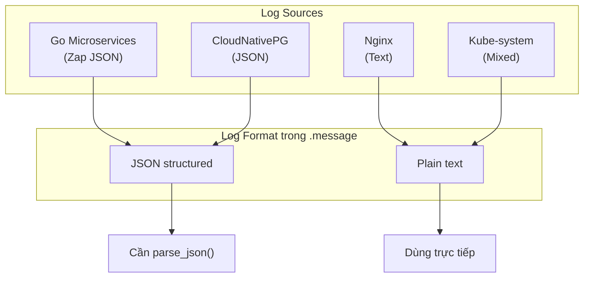
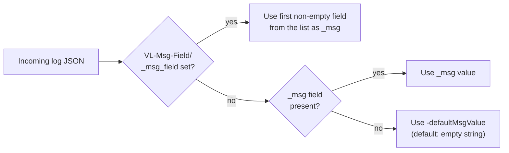
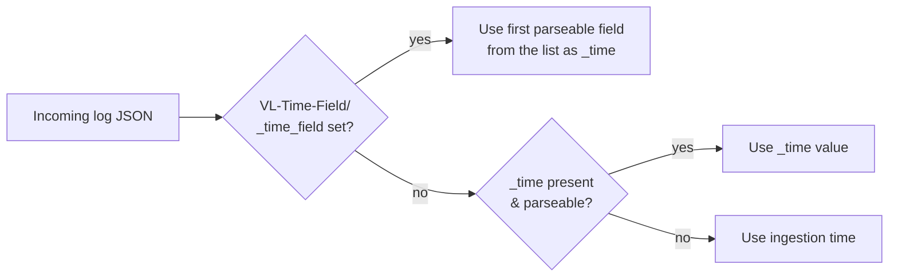
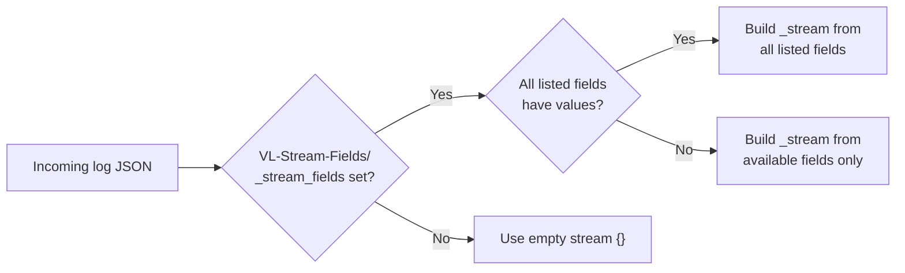
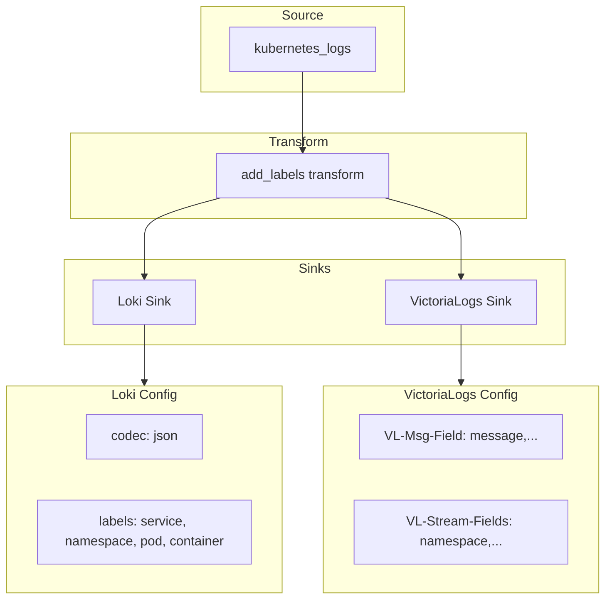

# VictoriaLogs Data Model & Vector Integration Research

> **Status**: 🔬 Research  
> **Created**: 2026-01-28  
> **Focus**: Giải quyết vấn đề `_msg` field và tối ưu Vector config cho dual-ship (VictoriaLogs + Loki)

---

## 1. Vấn đề gặp phải

### 1.1 Mô tả vấn đề

Khi test VictoriaLogs, bạn gặp issue với `_msg` field:
- VictoriaLogs yêu cầu mỗi log entry phải có `_msg` field
- Log từ Kubernetes/Vector không có sẵn field này
- Cần mapping đúng từ source field sang `_msg`

### 1.2 Hiện trạng cấu hình Vector

File: [vector.yaml](file:///home/duydo/Working/duy/Github/monitoring/kubernetes/infra/controllers/logging/vector/vector.yaml)

```yaml
# Sink: VictoriaLogs - All Logs
victorialogs_all:
  type: http
  uri: http://victorialogs.../insert/jsonline
  request:
    headers:
      VL-Time-Field: timestamp      # ✅ OK
      VL-Msg-Field: message         # ⚠️ Issue here
      VL-Stream-Fields: namespace,service,pod_name,container_name
```

**Vấn đề**: Field `message` được chỉ định trong `VL-Msg-Field`, nhưng:
1. Kubernetes logs có thể có field name khác (`msg`, `log`, `line`)
2. Nested JSON logs cần được parse trước (e.g., `log.message`)
3. Một số logs có thể không có field message

---

## 2. Vector kubernetes_logs Output Structure

### 2.1 Raw Output từ kubernetes_logs Source

Khi Vector collect logs từ Kubernetes, output có cấu trúc như sau:

```json
{
  "file": "/var/log/pods/namespace_pod-name_uid/container/0.log",
  "kubernetes": {
    "container_id": "containerd://abc123...",
    "container_image": "image:tag",
    "container_name": "my-container",
    "namespace_labels": {...},
    "node_labels": {...},
    "pod_annotations": {...},
    "pod_ip": "10.0.0.1",
    "pod_ips": ["10.0.0.1"],
    "pod_labels": {
      "app": "my-app",
      "version": "v1"
    },
    "pod_name": "my-app-abc123",
    "pod_namespace": "default",
    "pod_node_name": "node-1",
    "pod_owner": "ReplicaSet/my-app-abc123",
    "pod_uid": "uid-123"
  },
  "message": "...",  ← LOG CONTENT HERE
  "source_type": "kubernetes_logs",
  "stream": "stdout",
  "timestamp": "2026-01-28T15:30:00.123456789Z"
}
```

> [!IMPORTANT]
> **Key insight**: Log content luôn nằm trong field `.message`, nhưng nội dung có thể là:
> - **Plain text**: `"Starting server on port 8080"`
> - **JSON string**: `"{\"level\":\"info\",\"msg\":\"Starting server\"}"`

### 2.2 Log Format Comparison: Text vs JSON

#### Bảng so sánh chi tiết

| Aspect | Plain Text Logs | JSON Structured Logs |
|--------|-----------------|---------------------|
| **Format** | Human readable string | JSON object as string |
| **Example** | `"2026-01-28 INFO Starting server"` | `"{\"level\":\"info\",\"msg\":\"Starting\"}"` |
| **Field `.message`** | Là nội dung log thực sự | Là JSON string cần parse |
| **VL-Msg-Field: message** | ✅ Hoạt động đúng | ❌ Lấy raw JSON string |
| **Cần xử lý** | Không | Parse JSON trước |
| **Parsing overhead** | Thấp | Cao hơn (cần parse_json) |
| **Structured fields** | ❌ Không có | ✅ level, trace_id, etc. |
| **Query flexibility** | Full-text search only | Field-based + full-text |

#### Industry Standards cho Log Formats

| Standard | Format | Message Field | Timestamp Field | Level Field |
|----------|--------|---------------|-----------------|-------------|
| **Zap (Go)** | JSON | `msg` | `ts` (Unix) | `level` |
| **Logrus (Go)** | JSON | `msg` hoặc `message` | `time` | `level` |
| **slog (Go 1.21+)** | JSON | `msg` | `time` (RFC3339) | `level` |
| **Winston (Node.js)** | JSON | `message` | `timestamp` | `level` |
| **Log4j2 (Java)** | JSON | `message` | `timestamp` | `level` |
| **Python logging** | JSON | `message` | `timestamp` | `levelname` |
| **Nginx** | Text | Toàn bộ line | Trong format | N/A |
| **PostgreSQL** | JSON | `record.message` | `timestamp` | `record.error_severity` |

> [!NOTE]
> **Key observation**: Hầu hết frameworks dùng `msg` hoặc `message`, nhưng **không thống nhất**!

#### Flowchart: Cách VictoriaLogs nhận logs

```mermaid
flowchart TD
    subgraph Input["Log Input Types"]
        Text["Plain Text\n'Starting server on :8080'"]
        JSON["JSON Structured\n'{\"level\":\"info\",\"msg\":\"Starting\"}'"]
    end
    
    subgraph Vector["Vector Processing"]
        Wrap["Wrap in .message field"]
    end
    
    subgraph Output["To VictoriaLogs"]
        Out1["{message: 'Starting server on :8080'}"]
        Out2["{message: '{\"level\":\"info\",\"msg\":\"Starting\"}'}"]
    end
    
    subgraph VLogs["VictoriaLogs VL-Msg-Field: message"]
        Parse1["_msg = 'Starting server on :8080'\n✅ Correct!"]
        Parse2["_msg = '{\"level\":\"info\",...}'\n❌ Raw JSON string!"]
    end
    
    Text --> Wrap
    JSON --> Wrap
    Wrap --> Out1
    Wrap --> Out2
    Out1 --> Parse1
    Out2 --> Parse2
```

### 2.3 Các loại logs trong dự án



### 2.4 Ví dụ thực tế từ dự án

#### Go Microservices (Zap Logger) - JSON format
```json
// .message field contains:
"{\"level\":\"info\",\"ts\":1706472600.123,\"caller\":\"main.go:42\",\"msg\":\"Starting product service\",\"port\":\"8080\",\"trace_id\":\"abc123\"}"
```

#### CloudNativePG PostgreSQL - JSON format
```json
// .message field contains:
"{\"timestamp\":\"2026-01-28 15:30:00.123 UTC\",\"record\":{\"message\":\"connection received\",\"user_name\":\"app\",\"database_name\":\"product\"}}"
```

#### Nginx - Plain text format
```json
// .message field contains:
"192.168.1.1 - - [28/Jan/2026:15:30:00 +0000] \"GET /api/products HTTP/1.1\" 200 1234"
```

### 2.5 Vấn đề với cấu hình hiện tại

**Config hiện tại:**
```yaml
VL-Msg-Field: message
```

**Kết quả:**

| Log Type | .message value | VL-Msg-Field: message | Kết quả |
|----------|----------------|----------------------|---------|
| Nginx (text) | `"GET /api..."` | ✅ Lấy được plain text | OK |
| Zap (JSON) | `"{\\"level\\":...}"` | ❌ Lấy raw JSON string | **Sai!** |
| CNPG (JSON) | `"{\\"timestamp\\":...}"` | ❌ Lấy raw JSON string | **Sai!** |

**Vấn đề**: VictoriaLogs nhận JSON string thay vì message thực sự:
- Mong đợi: `"Starting product service"`
- Thực tế: `"{\\"level\\":\\"info\\",\\"msg\\":\\"Starting product service\\"}"`

---

## 3. Root Cause Analysis

### 3.1 Tại sao lỗi "missing _msg field"?

```mermaid
flowchart LR
    A["Vector sends:\n{message: '{\"level\":\"info\"...}'}"] --> B["VictoriaLogs\nreceives"]
    B --> C{"Check VL-Msg-Field:\nmessage"}
    C --> D["Found: message field\nValue: JSON string"]
    D --> E{"Is value meaningful\nlog message?"}
    E -- "No (empty/null)" --> F["Error: missing _msg"]
    E -- "Yes" --> G["Store as _msg"]
```

### 3.2 Hypothesis

1. **JSON string được stringify 2 lần**:
   - Zap outputs: `{"level":"info","msg":"hello"}`
   - Vector wraps in `.message`: `message = "{\"level\":\"info\",...}"`
   - Vector JSON encodes to VictoriaLogs: `{"message":"{\\\"level\\\":\\\"info\\\",...}"}`
   - Double-escaped JSON không được parse đúng

2. **VL-Msg-Field không hỗ trợ nested field**:
   - Muốn: `VL-Msg-Field: parsed.msg` hoặc `message.msg`
   - Thực tế: Chỉ hỗ trợ top-level fields

3. **Field name mismatch**:
   - Zap dùng `msg` 
   - Logrus dùng `message`
   - VictoriaLogs expect `message` trong VL-Msg-Field

### 3.3 Kết luận Root Cause

> [!CAUTION]
> **Root Cause xác định**: Vector gửi `.message` chứa **raw JSON string**, không phải message content!
> 
> VictoriaLogs cần field chứa **actual log text**, không phải JSON-encoded string.

**Giải pháp cần thiết:**
1. Parse JSON trong `.message` trước khi gửi
2. Extract `msg` hoặc `message` từ parsed JSON
3. Gán vào `.message` field (hoặc tạo field mới)

---

## 4. VictoriaLogs Data Model

### 2.1 Special Fields

VictoriaLogs hỗ trợ các special fields sau:

| Field | Mô tả | Bắt buộc? |
|-------|-------|-----------|
| `_msg` | Log message content | ✅ Yes (nhưng có fallback) |
| `_time` | Timestamp | No (dùng ingestion time nếu thiếu) |
| `_stream` | Stream identifier | Auto-generated |
| `_stream_id` | Unique stream ID | Auto-generated |

### 2.2 `_msg` Field Resolution Flow



**Key insight**: `VL-Msg-Field` có thể chứa **comma-separated list**!
- VictoriaLogs sẽ dùng **first non-empty field** từ list
- Ví dụ: `VL-Msg-Field: message,msg,log,_msg`

### 2.3 `_time` Field Resolution



**Supported formats**:
- ISO8601/RFC3339: `2023-06-20T15:32:10Z`
- Unix timestamp: seconds, ms, μs, ns

### 2.4 Stream Fields



> [!WARNING]
> **Avoid high-cardinality fields in streams!**
> - ❌ Never use: `trace_id`, `request_id`, `user_id`, `ip`
> - ✅ Good: `namespace`, `service`, `pod_name`, `container_name`

---

## 3. HTTP Parameters Reference

### 3.1 Query String Parameters

| Parameter | Mô tả | Ví dụ |
|-----------|-------|-------|
| `_msg_field` | Field chứa log message | `_msg_field=message,msg,log` |
| `_time_field` | Field chứa timestamp | `_time_field=timestamp,@timestamp` |
| `_stream_fields` | Fields định danh stream | `_stream_fields=namespace,service` |
| `ignore_fields` | Fields cần ignore | `ignore_fields=kubernetes.*,file.*` |
| `extra_fields` | Thêm fields vào mọi log | `extra_fields=env=prod` |
| `debug` | Debug mode (không store) | `debug=1` |

### 3.2 HTTP Headers

| Header | Query Arg tương ứng |
|--------|---------------------|
| `VL-Msg-Field` | `_msg_field` |
| `VL-Time-Field` | `_time_field` |
| `VL-Stream-Fields` | `_stream_fields` |
| `VL-Ignore-Fields` | `ignore_fields` |
| `VL-Extra-Fields` | `extra_fields` |
| `VL-Debug` | `debug` |
| `AccountID` | Multi-tenancy |
| `ProjectID` | Multi-tenancy |

> [!NOTE]
> Query string params có **priority cao hơn** HTTP headers.

---

## 4. Phân tích cấu hình hiện tại

### 4.1 Vector Transform: `add_labels`

```yaml
add_labels:
  type: remap
  inputs:
    - kubernetes_logs
  source: |
    # Extract service, namespace, pod_name, container_name
    # ...
    
    # Parse JSON message and extract level field
    if exists(.message) {
      parsed, err = parse_json(.message)
      if err == null && exists(parsed.level) {
        .level = to_string!(parsed.level)
      }
    }
```

**Vấn đề**: 
- ❌ Không extract `.message` từ nested JSON
- ❌ Không handle các field name khác (`msg`, `log`, `line`)

### 4.2 Vector Sink: `victorialogs_all`

```yaml
victorialogs_all:
  type: http
  uri: .../insert/jsonline
  request:
    headers:
      VL-Time-Field: timestamp
      VL-Msg-Field: message            # ⚠️ Chỉ check 1 field
      VL-Stream-Fields: namespace,service,pod_name,container_name
```

**Vấn đề**:
- ❌ Chỉ map `message` field, không fallback

---

## 5. Giải pháp đề xuất

### 5.1 Option A: Multiple `VL-Msg-Field` Values (Recommended)

Sử dụng comma-separated list trong header:

```yaml
request:
  headers:
    VL-Time-Field: timestamp,@timestamp,time,ts
    VL-Msg-Field: message,msg,log,_msg,line,body
    VL-Stream-Fields: namespace,service,pod_name,container_name
```

**Ưu điểm**:
- ✅ Không cần thay đổi transform
- ✅ VictoriaLogs tự động chọn first non-empty field
- ✅ Tương thích với nhiều log formats

### 5.2 Option B: Normalize trong Vector Transform

Thêm logic normalize `_msg` trong `add_labels` transform:

```yaml
add_labels:
  type: remap
  inputs:
    - kubernetes_logs
  source: |
    # ... existing code ...
    
    # Normalize message field for VictoriaLogs
    # Try multiple source fields, use first non-empty
    if exists(.message) && .message != "" {
      ._msg = .message
    } else if exists(.msg) && .msg != "" {
      ._msg = .msg
    } else if exists(.log) && .log != "" {
      ._msg = .log
    } else if exists(.line) && .line != "" {
      ._msg = .line
    } else {
      ._msg = to_string(.) ?? "no message"
    }
    
    # Parse JSON message if present
    if is_string(._msg) {
      parsed, err = parse_json(._msg)
      if err == null {
        if exists(parsed.message) {
          ._msg = to_string!(parsed.message)
        } else if exists(parsed.msg) {
          ._msg = to_string!(parsed.msg)
        }
        # Extract level if available
        if exists(parsed.level) {
          .level = to_string!(parsed.level)
        }
      }
    }
```

**Ưu điểm**:
- ✅ Full control over message extraction
- ✅ Có thể handle nested JSON
- ✅ Giữ original fields cho querying

### 5.3 Option C: Hybrid Approach (Best)

Kết hợp cả 2:

1. **Transform**: Normalize common cases + parse nested JSON
2. **Header**: Fallback list cho edge cases

```yaml
# Transform
add_labels:
  source: |
    # Normalize message - prefer parsed JSON message
    if is_string(.message) {
      parsed, err = parse_json(.message)
      if err == null && is_object(parsed) {
        # Extract from JSON-structured logs
        .parsed_msg = parsed.message ?? parsed.msg ?? parsed.log ?? null
        .level = parsed.level ?? parsed.severity ?? null
        
        if .parsed_msg != null {
          .message = to_string!(.parsed_msg)
        }
      }
    }

# Sink header - fallback chain
request:
  headers:
    VL-Msg-Field: message,msg,log,_msg,line
```

---

## 6. Tương thích với Loki

### 6.1 So sánh Data Model

| Aspect | VictoriaLogs | Loki |
|--------|--------------|------|
| Message field | `_msg` (special) | Part of log line |
| Timestamp | `_time` (special) | `timestamp` |
| Labels/Streams | `_stream_fields` | `labels` |
| Indexing | Full-text all fields | Only labels indexed |
| Query language | LogsQL | LogQL |

### 6.2 Vector Dual-Ship Architecture



### 6.3 Unified Transform cho cả 2

```yaml
add_labels:
  type: remap
  inputs:
    - kubernetes_logs
  source: |
    # Extract Kubernetes metadata
    .service = .kubernetes.pod_labels."app" ?? .kubernetes.pod_name ?? "system"
    .namespace = .kubernetes.pod_namespace ?? "kube-system"
    .pod_name = .kubernetes.pod_name ?? "unknown-pod"
    .container_name = .kubernetes.container_name ?? "unknown-container"
    
    # Normalize timestamp
    if !exists(.timestamp) {
      .timestamp = now()
    }
    
    # Parse JSON logs and extract message
    if is_string(.message) {
      parsed, err = parse_json(.message)
      if err == null && is_object(parsed) {
        # Keep original for full-text search
        .raw_message = .message
        
        # Extract structured fields
        .level = to_string(parsed.level ?? parsed.severity ?? parsed.lvl) ?? null
        .trace_id = parsed.trace_id ?? parsed.traceId ?? parsed.traceID ?? null
        
        # Normalize message for both backends
        .message = to_string(parsed.message ?? parsed.msg ?? parsed.log ?? .message) ?? ""
      }
    }
    
    # Ensure message is never empty for VictoriaLogs
    if !exists(.message) || .message == "" {
      if exists(.log) && .log != "" {
        .message = .log
      } else {
        .message = "empty log entry"
      }
    }
```

---

## 7. Debugging & Troubleshooting

### 7.1 Enable Debug Mode

Tạm thời enable debug để xem logs được parse như thế nào:

```yaml
# Option 1: Query string
uri: http://victorialogs:9428/insert/jsonline?debug=1

# Option 2: HTTP header
request:
  headers:
    VL-Debug: "1"
```

> [!CAUTION]
> Debug mode = logs **không được lưu**, chỉ được log ra VictoriaLogs stdout!

### 7.2 Check VictoriaLogs Logs

```bash
# Get VictoriaLogs pod logs
kubectl logs -n monitoring -l app.kubernetes.io/name=victoria-logs-single --tail=100

# Check for ingestion errors
kubectl logs -n monitoring -l app.kubernetes.io/name=victoria-logs-single | grep -i error
```

### 7.3 Verify Field Mapping

```bash
# Query raw logs
curl -G 'http://localhost:9428/select/logsql/query' \
  --data-urlencode 'query=*' \
  --data-urlencode 'limit=5'

# Check _msg field specifically
curl -G 'http://localhost:9428/select/logsql/query' \
  --data-urlencode 'query=_msg:*' \
  --data-urlencode 'limit=5'
```

### 7.4 VictoriaLogs Metrics

```bash
# Check ingestion metrics
curl http://localhost:9428/metrics | grep -E "vl_rows|vl_streams"

# Key metrics:
# - vl_rows_ingested_total: Total ingested logs
# - vl_streams_created_total: Number of streams (watch for high cardinality!)
```

---

## 8. Recommended Configuration Changes

### 8.1 Updated Vector Config

```yaml
# kubernetes/infra/controllers/logging/vector/vector.yaml

transforms:
  add_labels:
    type: remap
    inputs:
      - kubernetes_logs
    source: |
      # [1] Extract Kubernetes metadata
      .service = to_string(.kubernetes.pod_labels."app") ?? 
                 to_string(.kubernetes.pod_name) ?? "system"
      .namespace = to_string(.kubernetes.pod_namespace) ?? "kube-system"
      .pod_name = to_string(.kubernetes.pod_name) ?? "unknown-pod"
      .container_name = to_string(.kubernetes.container_name) ?? "unknown-container"
      
      # [2] Normalize timestamp
      if !exists(.timestamp) {
        .timestamp = now()
      }
      
      # [3] Parse JSON logs if present
      if is_string(.message) {
        parsed, err = parse_json(.message)
        if err == null && is_object(parsed) {
          # Extract level
          .level = to_string(parsed.level ?? parsed.severity) ?? null
          
          # Extract trace_id for observability correlation
          .trace_id = parsed.trace_id ?? parsed.traceId ?? null
          
          # Normalize message - prefer parsed.message
          if exists(parsed.message) && parsed.message != "" {
            .message = to_string!(parsed.message)
          } else if exists(parsed.msg) && parsed.msg != "" {
            .message = to_string!(parsed.msg)
          }
        }
      }
      
      # [4] Fallback: ensure message is never empty
      if !exists(.message) || .message == "" || .message == null {
        if exists(.log) && .log != "" {
          .message = to_string!(.log)
        } else {
          .message = "no message content"
        }
      }

sinks:
  victorialogs_all:
    type: http
    inputs:
      - add_labels
    uri: http://victorialogs-victoria-logs-single-server.monitoring.svc.cluster.local:9428/insert/jsonline
    encoding:
      codec: json
    framing:
      method: newline_delimited
    batch:
      max_events: 1000
      timeout_secs: 5
    buffer:
      type: memory
      max_events: 10000
      when_full: drop_newest
    request:
      headers:
        # Multiple fallback fields for message
        VL-Msg-Field: message,msg,log,_msg,line,body
        # Multiple fallback fields for timestamp
        VL-Time-Field: timestamp,@timestamp,time,ts
        # Stream fields for efficient indexing
        VL-Stream-Fields: namespace,service,pod_name,container_name
        # Optional: ignore noisy fields
        VL-Ignore-Fields: kubernetes.pod_ips,file.offset
        AccountID: "0"
        ProjectID: "0"
    healthcheck:
      enabled: false
```

---

## 9. Testing Plan

### 9.1 Pre-deployment Testing

```bash
# 1. Deploy with debug mode
# Add VL-Debug: "1" to headers temporarily

# 2. Generate test logs
kubectl run test-logger --image=busybox --rm -it -- \
  sh -c 'echo "{\"message\":\"test log\",\"level\":\"info\"}"'

# 3. Check VictoriaLogs logs for parsed output
kubectl logs -n monitoring -l app.kubernetes.io/name=victoria-logs-single | tail -20
```

### 9.2 Verify Dual-Ship

```bash
# Query Loki
curl -G 'http://loki:3100/loki/api/v1/query_range' \
  --data-urlencode 'query={namespace="default"}' \
  --data-urlencode 'limit=5'

# Query VictoriaLogs
curl -G 'http://victorialogs:9428/select/logsql/query' \
  --data-urlencode 'query={namespace="default"}' \
  --data-urlencode 'limit=5'
```

### 9.3 Compare Results

| Check | Loki | VictoriaLogs |
|-------|------|--------------|
| Log count matches | ☐ | ☐ |
| Timestamps correct | ☐ | ☐ |
| Message extracted | ☐ | ☐ |
| Labels/Streams correct | ☐ | ☐ |
| Level field present | ☐ | ☐ |

---

## 10. Executive Summary (TL;DR)

### 10.1 Vấn đề

| Symptom | Cause | Impact |
|---------|-------|--------|
| `missing _msg field` error | Vector gửi raw JSON string trong `.message` | Logs không được index đúng |
| VictoriaLogs không nhận logs | `VL-Msg-Field: message` chỉ lấy JSON string | Query không trả về kết quả |

### 10.2 Root Cause

```
Go App → Zap JSON → Vector → VictoriaLogs
         ↓              ↓
    {"msg":"hello"} → .message = '{"msg":"hello"}' → _msg = '{"msg":"hello"}'
                                                            ↑
                                                        Sai! Cần _msg = "hello"
```

### 10.3 Decision Matrix: Chọn giải pháp nào?

| Option | Approach | Effort | Risk | Recommend? |
|--------|----------|--------|------|------------|
| **A** | Thêm fallback trong `VL-Msg-Field` header | 🟢 Low (1 line) | 🟢 Low | ⚠️ Không đủ |
| **B** | Parse JSON trong Vector transform | 🟡 Medium | 🟡 Medium | ⚠️ Tốt |
| **C** | Hybrid: Transform + Fallback header | 🟡 Medium | 🟢 Low | ✅ **Best** |

### 10.4 Recommended Action

> [!IMPORTANT]
> **Áp dụng Option C - Hybrid Approach**
> 
> 1. **Vector Transform**: Parse JSON và extract actual message
> 2. **VL-Msg-Field Header**: Fallback list cho edge cases
> 3. **Test**: Enable debug mode để verify

### 10.5 Quick Fix (Option A - Nếu cần test nhanh)

Chỉ thêm vào `vector.yaml`:

```yaml
request:
  headers:
    VL-Msg-Field: message,msg,log,_msg,line,body,text
```

> [!WARNING]
> Option A chỉ fix một phần vấn đề - JSON structured logs vẫn sẽ có `_msg` chứa raw JSON!

### 10.6 Proper Fix (Option C - Production ready)

1. **Update Vector transform** để parse JSON:
   ```yaml
   # Parse và extract message từ JSON
   if is_string(.message) {
     parsed, err = parse_json(.message)
     if err == null && is_object(parsed) {
       .message = to_string(parsed.msg ?? parsed.message ?? .message)
     }
   }
   ```

2. **Update VL-Msg-Field header** với fallback:
   ```yaml
   VL-Msg-Field: message,msg,log,_msg,line
   ```

---

## 11. Next Steps

- [ ] **Phase 1**: Apply quick fix (Option A) để unblock testing
- [ ] **Phase 2**: Implement proper fix (Option C) 
- [ ] **Phase 3**: Test with debug mode enabled
- [ ] **Phase 4**: Verify logs appear correctly in VictoriaLogs
- [ ] **Phase 5**: Compare with Loki to ensure parity
- [ ] **Phase 6**: Remove debug mode after verification
- [ ] **Phase 7**: Monitor `vl_streams_created_total` for cardinality issues

---

## References

- [VictoriaLogs Key Concepts](https://docs.victoriametrics.com/victorialogs/keyconcepts/)
- [VictoriaLogs Data Ingestion](https://docs.victoriametrics.com/victorialogs/data-ingestion/)
- [VictoriaLogs Vector Setup](https://docs.victoriametrics.com/victorialogs/data-ingestion/vector/)
- [VictoriaLogs HTTP Parameters](https://docs.victoriametrics.com/victorialogs/data-ingestion/#http-parameters)
- [LogsQL Query Language](https://docs.victoriametrics.com/victorialogs/logsql/)
- [Vector Remap Language](https://vector.dev/docs/reference/vrl/)

