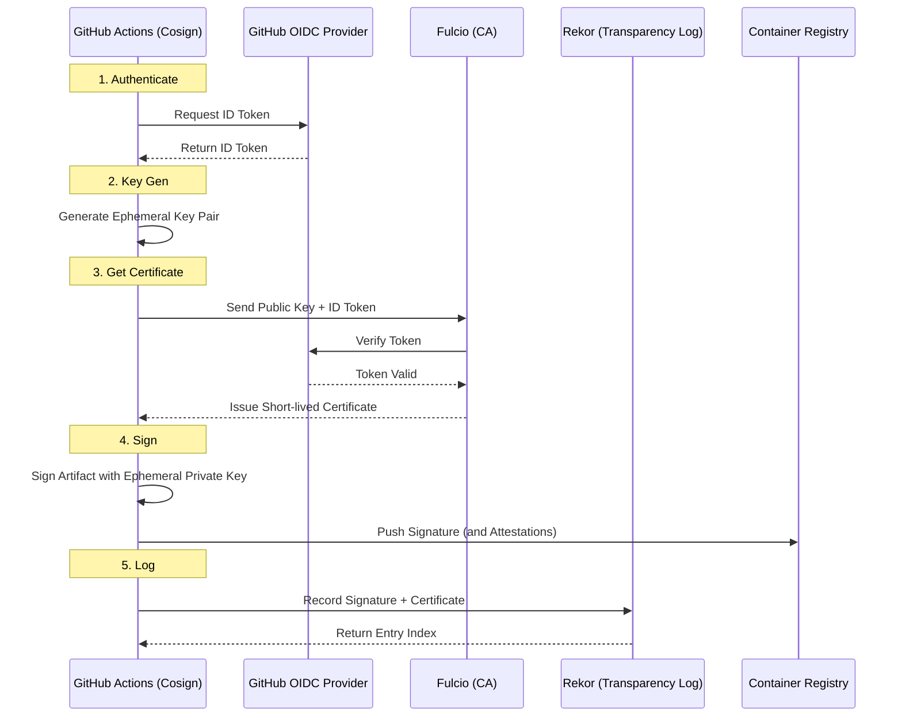
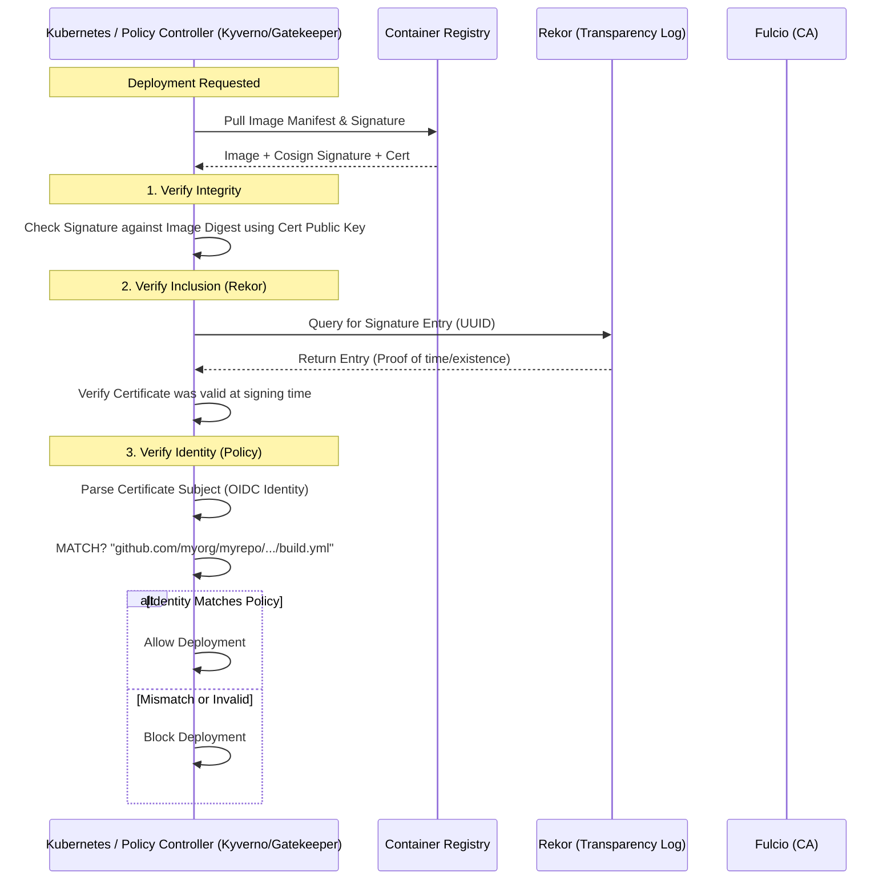

# Research: Cosign Keyless Signing & GitOps Integration

**Task ID:** cosign-keyless-integration
**Date:** 2026-01-24
**Status:** Complete

---

## Executive Summary
This research investigates the integration of **Cosign Keyless Signing** into a GitOps-based Kubernetes workflow (specifically using FluxCD). The goal is to secure the software supply chain by ensuring only artifacts signed by trusted CI pipelines are deployed to production.

**Key Findings:**
1.  **Keyless Signing** eliminates the need for long-lived private keys by using **ephemeral keys** bound to **OIDC identities** (specifically GitHub Actions).
2.  **GitHub Actions Integration** is seamless, requiring only the installation of Cosign and the `id-token: write` permission.
3.  **FluxCD Integration** is supported natively via the **Image Reflector Controller** and `ImagePolicy` resources, which can enforce signatures before automated deployment.
4.  **Verification** ties the artifact to the specific workflow file (`.github/workflows/build.yml`) that created it, providing strong provenance.

---

## 1. Cosign Keyless Signing: How It Works

Cosign keyless signing allows you to sign container images and artifacts without managing long-lived private keys. Instead, it uses **ephemeral keys** and **OIDC (OpenID Connect) identity** to bind a signature to a specific identity (e.g., a GitHub Actions workflow).

### The Flow
1.  **Authentication**: You authenticate using an OIDC provider (like GitHub Actions).
2.  **Certificate Issuance**: Sigstore's CA (Fulcio) issues a short-lived x.509 certificate bound to your OIDC identity.
3.  **Signing**: An ephemeral key pair is generated to sign the artifact.
4.  **Transparency Log**: The signature and certificate are stored in Sigstore's transparency log (Rekor).

### Keyless Signing Flow Diagram



---

## 2. CI/CD Integration (GitHub Actions)

Yes, you can easily integrate Cosign into CI/CD, specifically GitHub Actions. GitHub Actions supports OIDC, making it a perfect fit for keyless signing.

### Prerequisites
-   A container registry that supports OCI artifacts (e.g., GHCR, Docker Hub, AWS ECR).
-   A GitHub repository with Actions enabled.

### Example Workflow
Here is a sample GitHub Actions workflow that builds, pushes, and signs a Docker image using Cosign keyless signing.

```yaml
name: Build and Sign Image

on:
  push:
    branches: [ "main" ]

env:
  REGISTRY: ghcr.io
  IMAGE_NAME: ${{ github.repository }}

jobs:
  build:
    runs-on: ubuntu-latest
    permissions:
      contents: read
      packages: write
      # This is crucial for OIDC authentication
      id-token: write

    steps:
      - name: Checkout repository
        uses: actions/checkout@v4

      - name: Install Cosign
        uses: sigstore/cosign-installer@v3.5.0

      - name: Setup Docker Buildx
        uses: docker/setup-buildx-action@v3

      - name: Log into registry ${{ env.REGISTRY }}
        uses: docker/login-action@v3
        with:
          registry: ${{ env.REGISTRY }}
          username: ${{ github.actor }}
          password: ${{ secrets.GITHUB_TOKEN }}

      - name: Build and push Docker image
        id: build-and-push
        uses: docker/build-push-action@v5
        with:
          context: .
          push: true
          tags: ${{ env.REGISTRY }}/${{ env.IMAGE_NAME }}:latest
          # It's good practice to sign by digest
          outputs: type=image,name=${{ env.REGISTRY }}/${{ env.IMAGE_NAME }},push-by-digest=true,name-canonical=true,push=true

      - name: Sign the images with Cosign
        run: |
          cosign sign --yes \
            ${{ env.REGISTRY }}/${{ env.IMAGE_NAME }}@${{ steps.build-and-push.outputs.digest }}
```

### Key Components

1.  **`permissions: id-token: write`**: This permission is **mandatory**. It allows the GitHub Action to request an OIDC token from GitHub's OIDC provider.
2.  **`sigstore/cosign-installer`**: Installs the Cosign CLI tool.
3.  **`cosign sign --yes`**: Signs the image. The `--yes` flag skips the confirmation prompt for uploading to the Rekor transparency log.
    *   *Note*: When running in GitHub Actions with OIDC, Cosign automatically detects the environment and uses the OIDC token for authentication.

---

## 3. Post-Signing: Verification Workflow

Signing is only half the battle. The real value comes from **enforcing** these signatures before artifacts are used (e.g., deployed to Kubernetes).

### How Verification Works
When a system (like a developer's machine or a Kubernetes cluster) wants to verify an image:
1.  **Fetch Signature**: It retrieves the signature and the certificate from the image registry.
2.  **Verify Certificate**: It checks that the certificate was issued by Fulcio and is valid (or was valid at the time of signing via Rekor).
3.  **Verify Identity**: It checks if the identity in the certificate (e.g., `.../workflows/build.yml`) matches the **expected policy**.
4.  **Verify Integrity**: It uses the public key in the certificate to verify the artifact's digital signature.

### Verification Flow Diagram



### Purpose & Benefits
1.  **Protection Against Tampering**: If an attacker compromises your registry and swaps an image, signatures won't match.
2.  **Provenance & Identity (Non-Repudiation)**: You know exactly which workflow built the image.
3.  **No Key Management Costs**: No private keys to lose or rotate.
4.  **Compliance**: Meets SLSA and other supply chain security standards.

---

## 4. FluxCD Integration (GitOps)

Based on the analysis of `specs/active/flux-gitops-migration/research.md`, the project is moving towards **OCI-based GitOps** with **Flux Operator**. This aligns perfectly with Cosign.

Flux provides native support for verifying Cosign signatures through its **Image Reflector Controller**. You can enforce that only signed images are deployed.

### Configuration Strategy (`ImagePolicy`)
To enable this, you use Flux's `ImagePolicy` resource.

```yaml
apiVersion: image.toolkit.fluxcd.io/v1beta1
kind: ImagePolicy
metadata:
  name: podinfo-policy
  namespace: flux-system
spec:
  imageRepositoryRef:
    name: podinfo
  policy:
    # Enable Cosign verification
    cosign:
      keyless:
        identities:
          - issuer: "https://token.actions.githubusercontent.com"
            subject: "https://github.com/duynhne/monitoring/.github/workflows/build-backend.yml@refs/heads/main"
```

### Why this is powerful:
1.  **Automated Gating**: Flux will **refuse** to automatically update your workloads to a new image tag if that image isn't signed by your trusted GitHub Action workflow.
2.  **GitOps & Security**: Your `ImagePolicy` becomes code. You verify not just that an image exists, but that it was built by *authorized infrastructure*.
3.  **Seamless OCI Integration**: Hooks directly into the `OCIRepository` and image automation flows.
