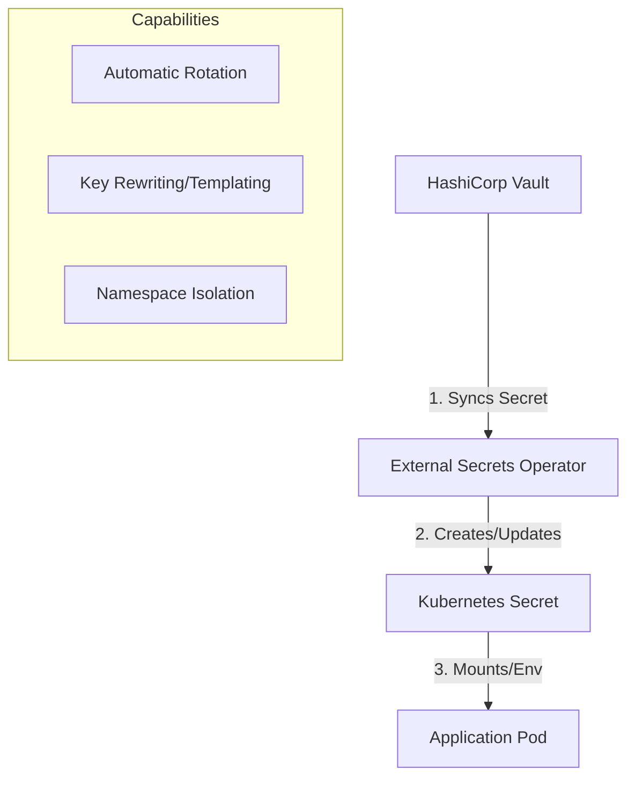

# Research: External Secrets Operator Integration with Vault

**Task ID:** external-secrets-integration
**Date:** 2026-01-24
**Status:** In Progress
**Related Specs:** `specs/active/Zalando-operator/research.md`

---

## Executive Summary
This research focuses on integrating **External Secrets Operator (ESO)** with **HashiCorp Vault** to manage database and application secrets in Kubernetes. It expands on the initial findings in the Zalando Operator research effectively moving from "planned" to "architected".

**Key Goals:**
1.  Centralize secret management in Vault.
2.  Automate secret injection into Kubernetes (ExternalSecrets).
3.  Implement safe Secret Rotation practices.
4.  Enable multi-tenancy support for different microservices.

---

## 1. Architecture Overview

The External Secrets Operator (ESO) acts as a bridge between an external secret management system (Vault) and Kubernetes Secrets.



---

## 2. Core Resources

Understanding the core CRDs is essential for designing a scalable solution.

### 2.1 SecretStore
-   **Scope**: Namespaced.
-   **Purpose**: Defines *how* to authenticate and access the external provider (Vault) *within a specific namespace*.
-   **Use Case**: Multi-tenancy where each team/namespace has its own Vault role or path.

```yaml
apiVersion: external-secrets.io/v1beta1
kind: SecretStore
metadata:
  name: team-a-vault
  namespace: team-a
spec:
  provider:
    vault:
      server: "https://vault.example.com"
      path: "secret"
      auth:
        kubernetes:
          mountPath: "kubernetes"
          role: "team-a-role" # Vault role restricted to team-a
```

### 2.2 ClusterSecretStore
-   **Scope**: Cluster-wide.
-   **Purpose**: Global configuration accessible by all namespaces.
-   **Use Case**: Shared infrastructure secrets or a single "platform" Vault role used by the entire cluster (less secure for strict multi-tenancy).

### 2.3 ExternalSecret
-   **Scope**: Namespaced.
-   **Purpose**: The actual request to fetch a secret. It references a `SecretStore` and defines which data to fetch and how to format the target Kubernetes Secret.

```yaml
apiVersion: external-secrets.io/v1beta1
kind: ExternalSecret
metadata:
  name: db-creds
spec:
  secretStoreRef:
    name: team-a-vault
    kind: SecretStore
  target:
    name: db-credentials-k8s # Name of the K8s Secret to create
  data:
    - secretKey: username
      remoteRef:
        key: database/team-a
        property: username
```

### 2.4 ClusterExternalSecret
-   **Scope**: Cluster-wide.
-   **Purpose**: Automatically creates `ExternalSecret` resources in specific namespaces based on a label selector. Useful for distinct secrets that need to exist in every namespace (e.g., registry credentials).

### 2.5 PushSecret
-   **Purpose**: The reverse of ExternalSecret. Takes a Kubernetes Secret and *pushes* it to the external provider (Vault).
-   **Use Case**: If an operator generates a secret inside K8s (like Zalando Operator generating passwords) and you want to back it up to Vault.

---

## 3. Integration Guide

### 3.1 Installation
Using the official Helm chart is the recommended approach.

```bash
helm repo add external-secrets https://charts.external-secrets.io

helm install external-secrets \
   external-secrets/external-secrets \
    -n external-secrets \
    --create-namespace \
    --set installCRDs=true
```

### 3.2 Authentication (Vault + Kubernetes Auth)
This is the most secure method. It involves:
1.  **Vault Side**: Enable Kubernetes auth method, configure it with the K8s API JWT issuer.
2.  **K8s Side**: ESO uses its ServiceAccount token to authenticate with Vault.

### 3.3 Advanced Templating
ESO allows transforming data before creating the Kubernetes Secret. This is critical for applications that expect a specific format (e.g., connection strings).

```yaml
spec:
  target:
    template:
      engineVersion: v2
      data:
        # Create a connection string from individual fields
        config.yaml: |
          database:
            url: "postgres://{{ .username }}:{{ .password }}@db-host:5432/dbname"
  data:
    - secretKey: username
      remoteRef: { key: db/creds, property: username }
    - secretKey: password
      remoteRef: { key: db/creds, property: password }
```

### 3.4 Multi-Tenancy Design
**Pattern**: Namespaced `SecretStore` per Team.
1.  Create a Vault Role for each team (e.g., `team-a`, `team-b`) bound to the team's K8s ServiceAccount/Namespace.
2.  Deploy a `SecretStore` in `namespace: team-a` referencing `role: team-a`.
3.  Team A developers create `ExternalSecret` resources referencing their local `SecretStore`.
4.  **Result**: Team A cannot access Team B's secrets, as their `SecretStore` (and underlying Vault role) denies it.

---

## 4. Password Generators & Rotation
ESO can generate passwords using the `Password` generator, avoiding the need for Vault to generate them initially or allowing ESO to handle rotation logic.

```yaml
apiVersion: generators.external-secrets.io/v1alpha1
kind: Password
metadata:
  name: db-password-generator
spec:
  length: 24
  digits: 5
  symbols: 2
  symbolCharacters: "-_!@#"
  noUpper: false
  allowRepeat: true
```

### Rotation Best Practices

Rotation is complex because it involves three components: the **Secret Provider** (Vault/Generator), the **Database** (PostgreSQL), and the **Application** (Consumer).

#### Strategy 1: Dual-User Rotation (Zero Downtime)
1.  **Active**: `user_api_blue`
2.  **Rotation Event**:
    - Generates new credentials for `user_api_green`.
    - Updates Application to use `user_api_green`.
    - Once App is stable, revokes `user_api_blue`.
*Requires application support for dynamic config reloading or restarts.*

#### Strategy 2: Update-in-Place with Restart
1.  **Vault**: Updates the password.
2.  **ESO**: Detects change (polling/refresh interval) and updates Kubernetes Secret.
3.  **App**:
    - If using **Reloader** (stakater/Reloader): Detects Secret change and restarts Pods.
    - If App supports file watching: Hot-reloads new password.
    - **Risk**: Brief connection failure if DB is updated before App, or vice-versa.

#### Recommended Policy
1.  **Schedule**: non-production monthly, production quarterly (90 days).
2.  **Automation**: Use `refreshInterval` in ESO to enforce periodic sync.
3.  **Visualization**: Monitor Prometheus metrics exposed by ESO (`external_secret_sync_status`) to ensure rotations are successful.
4.  **Emergency**: Have a manual "Rotation Trigger" process (e.g., manually patching the ExternalSecret or Vault path) for compromised credentials.

---

## 5. Next Steps
1.  **Proof of Concept**: Deploy Vault (dev mode) + ESO in the local Kind cluster.
2.  **Test Pattern**: Create a `SecretStore` and `ExternalSecret` for one microservice (`auth`).
3.  **Verify Rotation**: Change value in Vault -> Verify K8s Secret updates -> Verify App reloads (or restarts via Reloader).
