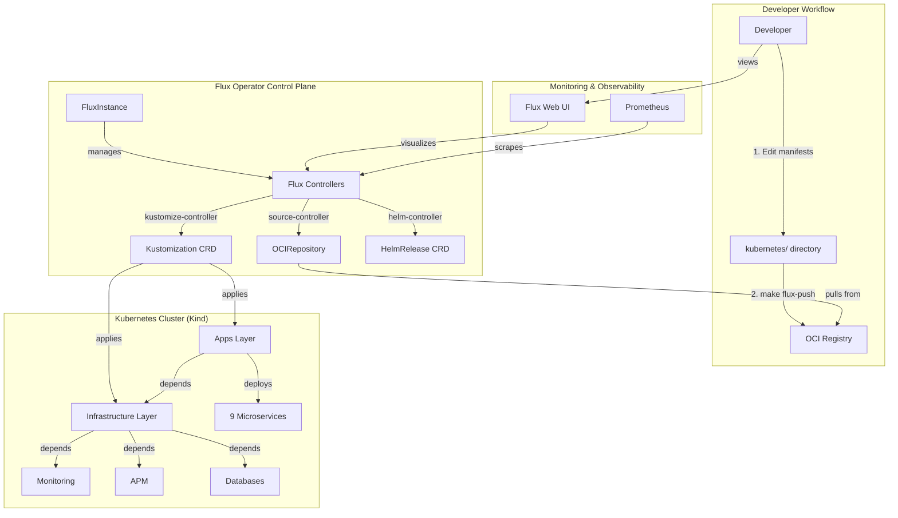

# Technical Plan: Production-Ready GitOps with Flux Operator + Kustomize

**Task ID:** flux-gitops-migration
**Created:** 2026-01-10
**Last Updated:** 2026-01-10 (Hybrid Pattern)
**Status:** Updated with hybrid approach (HelmRelease + ResourceSet)
**Based on:** spec.md (613 lines) + research.md (2,921 lines)

---

## ⚠️ Important Updates (2026-01-10)

**Architecture Decision: Hybrid Pattern**

After user request, implementing **hybrid approach** to learn both patterns:

**Pattern Split:**
1. **9 Backend Services:** HelmRelease + Kustomize patches (production-ready, standard)
2. **1 Frontend Service:** ResourceSet + ResourceSetInputProvider (learning Flux Operator)

**Why Hybrid?**
- ✅ Learn both patterns side-by-side (HelmRelease vs ResourceSet)
- ✅ Frontend is simple (no database, minimal env vars) - ideal for ResourceSet experiment
- ✅ Backend uses production-proven pattern (HelmRelease + Kustomize)
- ✅ Can compare patterns and decide on future adoption
- ✅ Low risk (frontend has minimal dependencies)

**Configuration Lines:**
- **Backend (9 services):** Base HelmRelease (20 lines) + Local patch (80 lines) = 100 lines/service
- **Frontend (1 service):** ResourceSet (60 lines) + ResourceSetInputProvider (15 lines) = 75 lines
- **Total:** 975 lines (vs 900 lines current single-env)

---

## Previous Updates

**Environment-Specific Configuration Pattern Finalized:**

After researching Kustomize array patching limitations (see `research.md` "Environment-Specific Configuration Patterns" section), the architecture has been updated:

**✅ Final Decision: HelmRelease Patches with FULL env list**

**Key Changes:**
1. **Base manifests:** Use HelmRelease CRDs (not raw Deployments) referencing `charts/mop`
2. **Chart defaults:** Production values in `charts/mop/values/*.yaml`
3. **Overlays:** Kustomize patches with FULL env list (~80 lines per service)
4. **Why FULL list:** Kustomize strategic merge REPLACES entire env arrays (cannot merge elements)

**Trade-off Accepted:**
- ⚠️ Must repeat all 20+ env vars in each environment patch
- ✅ But: Explicit configuration, simple patching, works with Kustomize

**Configuration lines:**
- Base HelmRelease: 20 lines (references chart)
- Local patch: 80 lines (FULL env list)
- Staging patch: 80 lines
- Production patch: 80 lines
- **Total per service: 260 lines** (base + 3 overlays)
- **Total for 10 services: 2,600 lines** (vs 900 lines current single-env)

**Benefits:**
- ✅ Multi-environment support (local/staging/production)
- ✅ Clear environment separation
- ✅ Reuses existing Helm chart
- ✅ Simple Kustomize strategic merge (no JSON patches)

**Rejected alternatives:**
- ❌ valuesFrom ConfigMap (more files, same verbosity)
- ❌ JSON patches (fragile, not maintainable)
- ❌ Partial env patches (Kustomize replaces entire array)

**See:** `research.md` lines 1976-2245 for detailed analysis

---

## 1. System Architecture

### Overview

**Architecture Pattern:** Incremental GitOps Migration with 3-Layer Structure



**3-Layer Architecture:**

```
Layer 1: Cluster Configuration (kubernetes/clusters/local/)
├── FluxInstance (flux-system/instance.yaml)
├── ResourceSetInputProvider (registry config)
├── Flux Kustomization CRDs (infrastructure.yaml, apps.yaml)
└── ConfigMaps (cluster-config.yaml)

Layer 2: Infrastructure (kubernetes/base/infrastructure/)
├── Namespaces
├── Monitoring (Prometheus, Grafana, Metrics Server)
├── APM (Tempo, Pyroscope, Loki, Vector, Jaeger)
└── Databases (Operators: Zalando, CloudNativePG)

Layer 3: Applications (kubernetes/base/apps/)
├── Auth Service
├── User Service
├── Product Service
├── Cart Service
├── Order Service
├── Review Service
├── Notification Service
├── Shipping Service
├── Shipping-v2 Service
└── Frontend
```

### Architecture Decisions

| Decision | Choice | Rationale |
|----------|--------|-----------|
| **GitOps Tool** | Flux Operator (not ArgoCD) | Better OCI support, ResourceSet dependency management, operator-friendly, matches current stack (operator-heavy) |
| **Configuration Management** | Kustomize base/overlay (not Helm values) | Eliminates 67% duplication (900→300 lines), declarative patches, no templating complexity, built into kubectl |
| **Artifact Storage** | OCI Registry (not Git) | Faster sync, unified image+manifest storage, immutable SHA256 digests, matches current ghcr.io usage |
| **Migration Strategy** | Incremental (not big bang) | Lower risk, learning-focused, parallel operation with existing scripts, rollback-friendly |
| **Local Development** | Kind + localhost:5050 registry | Matches existing setup, no external dependencies, fast iteration, production-parity |
| **Web UI** | Flux Web UI (built-in) | NEW feature (Dec 2025), no external tools needed, real-time monitoring, mobile-optimized |
| **Secret Management** | Kubernetes Secrets (Phase 1-5) | Simple for initial migration, SOPS/Sealed Secrets deferred to Phase 6 (not blocking) |
| **Image Automation** | Manual (Phase 1-5) | Focus on GitOps foundation first, note for production-ready future enhancement |

---

## 2. Technology Stack

| Layer | Technology | Version | Rationale |
|-------|------------|---------|-----------|
| **GitOps Engine** | Flux Operator | Latest (with Web UI) | Declarative Flux deployment via CRDs, built-in ResourceSet management |
| **Configuration Tool** | Kustomize | Built into kubectl 1.14+ | Native Kubernetes tool, no external dependencies, DRY principle |
| **OCI Registry (Local)** | Docker Registry | registry:3 | Lightweight, localhost:5050 for local dev, matches flux-operator-local-dev pattern |
| **OCI Registry (Prod)** | GitHub Container Registry | ghcr.io | Already in use for images, free for public repos, OCI artifact support |
| **Kubernetes** | Kind | v1.33.7 | Already deployed, local development, fast cluster creation |
| **Flux CLI** | flux | Latest v2.x | Required for `flux push artifact`, `flux diff`, `flux get` commands |
| **Existing Stack** | Helm (mop chart) | v0.4.2 | Keep for reference, migrate values to Kustomize manifests |
| **Existing Services** | 9 microservices + frontend | Go 1.25, React+Vite | No changes to application code, only deployment manifests |
| **Existing Infrastructure** | Operators, Databases, APM | Current versions | Migrate deployment mechanism, not the infrastructure itself |

### Critical Dependencies

**Flux Operator:**
```yaml
# Installed via flux-operator CLI or Helm
# CRDs: FluxInstance, ResourceSet, ResourceSetInputProvider
Version: Latest from github.com/controlplaneio-fluxcd/flux-operator
```

**Flux CLI:**
```bash
# Install via Homebrew (macOS)
brew install fluxcd/tap/flux

# Or via bash script
curl -s https://fluxcd.io/install.sh | sudo bash
```

**Kustomize:**
```bash
# Built into kubectl 1.14+
kubectl version --client
# Or standalone via Homebrew
brew install kustomize
```

---

## 3. Component Design

### Component 1: FluxInstance (Flux Operator Bootstrap)

**Purpose:** Declares Flux CD distribution and components to install on Kind cluster.

**Responsibilities:**
- Install Flux controllers (source, kustomize, helm, notification)
- Configure resource sizing (small/medium/large)
- Enable network policies for security
- Define cluster-level sync source (OCIRepository)

**CRD Definition:**
```yaml
apiVersion: fluxcd.controlplane.io/v1
kind: FluxInstance
metadata:
  name: flux
  namespace: flux-system
spec:
  distribution:
    version: "2.x"                              # Latest Flux CD
    registry: "ghcr.io/fluxcd"
    artifact: "oci://ghcr.io/controlplaneio-fluxcd/flux-operator-manifests:latest"
  components:
    - source-controller                          # OCI/Git source management
    - kustomize-controller                       # Kustomize reconciliation
    - helm-controller                            # Helm chart management
    - notification-controller                    # Alerts/webhooks
    - source-watcher                             # Filesystem watcher
  cluster:
    type: kubernetes
    size: medium                                 # Resource sizing for Kind
    multitenant: false                           # Single-user local dev
    networkPolicy: true                          # Security enabled
    domain: "cluster.local"
  sync:                                          # Cluster-level sync
    kind: OCIRepository
    url: "oci://localhost:5050/flux-cluster-sync"
    ref: "local"
    path: "./"
  kustomize:
    patches:
      - patch: |
          - op: add
            path: /spec/insecure
            value: true                          # localhost:5050 no TLS
        target:
          kind: OCIRepository
```

**Dependencies:** Flux Operator CRDs installed, `flux-system` namespace created

**Files:**
- `kubernetes/clusters/local/flux-system/instance.yaml`

---

### Component 2: Kustomize Base (Shared Manifests)

**Purpose:** Single source of truth for all Kubernetes resources, shared across environments.

**Responsibilities:**
- Define minimal HelmRelease CRDs referencing existing Helm chart (`charts/mop`)
- Provide base configuration (references chart defaults)
- Include infrastructure manifests (operators, monitoring, APM)
- Enable multi-environment deployment via Kustomize overlays

**Architecture Decision (from research.md):**
- ✅ **Use HelmRelease CRDs** (not raw Deployments) to leverage existing `charts/mop`
- ✅ **Chart provides defaults** (`charts/mop/values/*.yaml`)
- ✅ **Overlays provide env-specific patches** (with FULL env list per environment)
- ✅ **Minimal duplication** (base HelmRelease ~20 lines)

**Structure:**
```
kubernetes/base/
├── infrastructure/
│   ├── kustomization.yaml                      # References all infra components
│   ├── namespaces.yaml                         # 11 namespaces
│   ├── monitoring/
│   │   ├── kustomization.yaml
│   │   ├── prometheus-operator.yaml
│   │   ├── grafana-operator.yaml
│   │   └── metrics-server.yaml
│   ├── apm/
│   │   ├── kustomization.yaml
│   │   ├── tempo.yaml
│   │   ├── pyroscope.yaml
│   │   ├── loki.yaml
│   │   ├── vector.yaml
│   │   └── jaeger.yaml
│   └── databases/
│       ├── kustomization.yaml
│       ├── zalando-operator.yaml               # Helm-based installation
│       ├── cloudnativepg-operator.yaml         # Helm-based installation
│       └── README.md                           # Database CRDs in k8s/postgres-operator/
└── apps/
    ├── kustomization.yaml                      # References all 9 services
    ├── auth/
    │   ├── kustomization.yaml
    │   └── helmrelease.yaml                    # 20 lines - references chart
    ├── user/
    │   ├── kustomization.yaml
    │   └── helmrelease.yaml
    ├── product/
    ├── cart/
    ├── order/
    ├── review/
    ├── notification/
    ├── shipping/
    ├── shipping-v2/
    └── frontend/
```

**Example: Base HelmRelease (auth service)**
```yaml
# kubernetes/base/apps/auth/helmrelease.yaml
apiVersion: helm.toolkit.fluxcd.io/v2
kind: HelmRelease
metadata:
  name: auth
  namespace: auth
spec:
  interval: 12h
  install:
    remediation:
      retries: 3
  upgrade:
    remediation:
      retries: 3
  chartRef:
    kind: OCIRepository
    name: mop-chart
    namespace: flux-system
  # NO values section - use chart defaults from charts/mop/values/auth.yaml
  # Environment-specific values provided via Kustomize patches
```

**Why HelmRelease (not raw Deployments)?**
1. ✅ **Reuse existing Helm chart** (`charts/mop`) - avoid duplication
2. ✅ **Chart already has all config** (20+ env vars, probes, migrations)
3. ✅ **Simpler base** (20 lines vs 100+ lines for Deployment)
4. ✅ **Helm best practices** (templates, helpers, conventions)
5. ✅ **Chart versioning** (OCI artifact `ghcr.io/duynhne/charts/mop`)

**Dependencies:** 
- OCI Registry for Helm chart (`charts/mop`)
- Flux HelmRelease controller

**Files:** 30+ files in `kubernetes/base/` (fewer than raw manifests)

---

### Component 3: Kustomize Overlays (Environment-Specific Patches)

**Purpose:** Environment-specific customizations without duplicating base manifests.

**Responsibilities:**
- Patch replicas (local: 1, staging: 2, production: 3)
- Patch resources (local: minimal, production: full)
- Patch images (local: localhost:5050, production: ghcr.io)
- Add environment-specific features (production: HPA, PDB, anti-affinity)

**Structure:**
```
kubernetes/overlays/
├── local/                                      # Kind cluster
│   ├── infrastructure/
│   │   ├── kustomization.yaml                  # bases: ../../base/infrastructure
│   │   └── patches/
│   │       ├── monitoring-resources.yaml       # Smaller CPU/memory
│   │       └── database-replicas.yaml          # 1 replica for operators
│   └── apps/
│       ├── kustomization.yaml                  # bases: ../../base/apps
│       └── patches/
│           ├── replicas.yaml                   # 1 replica for all services
│           ├── resources.yaml                  # 32Mi memory, 25m CPU
│           ├── images.yaml                     # localhost:5050/auth:local
│           └── env-local.yaml                  # Local DB hosts, no TLS
├── staging/                                    # Phase 5 (future)
│   └── ...
└── production/                                 # Phase 5 (future)
    └── ...
```

**Example: Local Overlay Patch (replicas)**
```yaml
# kubernetes/overlays/local/apps/patches/replicas.yaml
apiVersion: apps/v1
kind: Deployment
metadata:
  name: auth
spec:
  replicas: 1                                   # Local: 1 replica only
---
apiVersion: apps/v1
kind: Deployment
metadata:
  name: user
spec:
  replicas: 1
# ... (repeat for all 9 services)
```

**Example: Local Overlay Kustomization**
```yaml
# kubernetes/overlays/local/apps/kustomization.yaml
apiVersion: kustomize.config.k8s.io/v1beta1
kind: Kustomization

namespace: default                              # Local uses default namespace

bases:
  - ../../base/apps/auth
  - ../../base/apps/user
  - ../../base/apps/product
  - ../../base/apps/cart
  - ../../base/apps/order
  - ../../base/apps/review
  - ../../base/apps/notification
  - ../../base/apps/shipping
  - ../../base/apps/shipping-v2
  - ../../base/apps/frontend

patchesStrategicMerge:
  - patches/replicas.yaml
  - patches/resources.yaml
  - patches/images.yaml
  - patches/env-local.yaml

commonLabels:
  environment: local
  cluster: mop-local
```

**Dependencies:** Kustomize base manifests

**Files:** ~20 files in `kubernetes/overlays/local/`

---

### Component 4: OCIRepository (Artifact Sources)

**Purpose:** Configure Flux to pull Kubernetes manifests from OCI registry instead of Git.

**Responsibilities:**
- Watch OCI registry for new artifacts (interval: 1m)
- Pull manifests on digest change
- Support insecure registries (localhost:5050)
- Provide source for Flux Kustomization CRDs

**CRD Definition:**
```yaml
# Created by Flux Kustomization, not manually
apiVersion: source.toolkit.fluxcd.io/v1
kind: OCIRepository
metadata:
  name: flux-infra-sync
  namespace: flux-system
spec:
  interval: 1m                                  # Check every 1 minute
  insecure: true                                # localhost:5050 no TLS
  url: "oci://localhost:5050/flux-infra-sync"
  ref:
    tag: "local"                                # Or digest for immutability
```

**Artifact Push (Developer Workflow):**
```bash
# Push manifests to local registry
flux push artifact oci://localhost:5050/flux-infra-sync:local \
  --path=kubernetes/base/infrastructure \
  --source="$(git config --get remote.origin.url)" \
  --revision="$(git rev-parse HEAD)"

flux push artifact oci://localhost:5050/flux-apps-sync:local \
  --path=kubernetes/base/apps \
  --source="$(git config --get remote.origin.url)" \
  --revision="$(git rev-parse HEAD)"
```

**Dependencies:** Flux source-controller, local OCI registry running

**Files:** Flux-managed, not in Git

---

### Component 5: Flux Kustomization CRD (Reconciliation Controller)

**Purpose:** Continuously reconcile cluster state from OCI artifacts using Kustomize overlays.

**Responsibilities:**
- Build Kustomize overlay (base + patches)
- Apply to cluster every 10 minutes (interval)
- Detect drift and auto-heal
- Support dependencies (apps wait for infra)
- Prune deleted resources
- Health checks (wait for readiness)

**CRD Definition (Infrastructure):**
```yaml
# kubernetes/clusters/local/infrastructure.yaml
apiVersion: kustomize.toolkit.fluxcd.io/v1
kind: Kustomization
metadata:
  name: infrastructure-local
  namespace: flux-system
spec:
  interval: 10m                                 # Reconcile every 10 minutes
  retryInterval: 2m                             # Retry on failure
  timeout: 5m                                   # Timeout for apply
  path: ./kubernetes/overlays/local/infrastructure
  prune: true                                   # Delete removed resources
  wait: true                                    # Wait for health checks
  sourceRef:
    kind: OCIRepository
    name: flux-infra-sync
    namespace: flux-system
  healthAssessment:
    interval: 30s
    timeout: 5m
  postBuild:
    substitute:                                 # Static substitutions
      cluster_name: "mop-local"
      registry_url: "localhost:5050"
    substituteFrom:                             # Dynamic from ConfigMap
      - kind: ConfigMap
        name: cluster-config
```

**CRD Definition (Applications):**
```yaml
# kubernetes/clusters/local/apps.yaml
apiVersion: kustomize.toolkit.fluxcd.io/v1
kind: Kustomization
metadata:
  name: apps-local
  namespace: flux-system
spec:
  interval: 10m
  retryInterval: 2m
  timeout: 5m
  path: ./kubernetes/overlays/local/apps
  prune: true
  wait: true
  sourceRef:
    kind: OCIRepository
    name: flux-apps-sync
    namespace: flux-system
  dependsOn:
    - name: infrastructure-local               # Wait for infra first
  healthAssessment:
    interval: 30s
    timeout: 5m
  postBuild:
    substitute:
      cluster_name: "mop-local"
      registry_url: "localhost:5050"
      image_tag: "local"
    substituteFrom:
      - kind: ConfigMap
        name: cluster-config
```

**Dependencies:** OCIRepository (source), Flux kustomize-controller

**Files:**
- `kubernetes/clusters/local/infrastructure.yaml`
- `kubernetes/clusters/local/apps.yaml`

---

### Component 6: Flux Web UI (Monitoring Dashboard)

**Purpose:** Real-time visualization of Flux deployments, ResourceSets, and reconciliation status.

**Responsibilities:**
- Display ResourceSet tree view (hierarchy)
- Show reconciliation status (Ready/Progressing/Failed)
- Provide search and filtering
- Display detailed logs for troubleshooting
- Mobile-responsive design

**Access:**
```bash
# Port-forward Flux Operator service
kubectl -n flux-system port-forward svc/flux-operator 9080:9080

# Open in browser
open http://localhost:9080
```

**Integration with scripts/08-setup-access.sh:**
```bash
# Add to existing script
echo "Setting up port-forward for Flux Operator Web UI..."
kubectl port-forward -n flux-system svc/flux-operator 9080:9080 &
echo "Flux Web UI: http://localhost:9080"
```

**Expected Features:**
- ResourceSet tree view: `flux-system` → `infrastructure` → `apps`
- Kustomization dashboard: Show last reconciliation time, status
- Search: Filter by service name (e.g., "auth")
- Logs: Click on resource to view detailed logs
- Favorites: Bookmark critical resources

**Dependencies:** Flux Operator with Web UI enabled (built-in)

**Files:** None (built into Flux Operator)

---

### Component 7: Makefile Automation (Developer Workflow)

**Purpose:** Simplify Flux operations with developer-friendly commands.

**Responsibilities:**
- Bootstrap Flux Operator (`make flux-up`)
- Push manifests to OCI registry (`make flux-push`)
- Trigger reconciliation (`make flux-sync`)
- List deployed resources (`make flux-ls`)
- Tear down Flux (`make flux-down`)

**Makefile:**
```makefile
# Makefile for Flux Operator Local Development
SHELL = /usr/bin/env bash -o pipefail
.SHELLFLAGS = -ec

CLUSTER_NAME = mop
REGISTRY_HOST = localhost:5050
REGISTRY_NAME = $(CLUSTER_NAME)-registry

.PHONY: all
all: flux-up

##@ Flux Operations

.PHONY: flux-up
flux-up: cluster-up registry-up flux-push flux-install ## Bootstrap Flux Operator

.PHONY: flux-push
flux-push: ## Push Kubernetes manifests to OCI registry
	@echo "Pushing manifests to $(REGISTRY_HOST)..."
	flux push artifact oci://$(REGISTRY_HOST)/flux-cluster-sync:local \
		--path=kubernetes/clusters/local \
		--source="$(shell git config --get remote.origin.url)" \
		--revision="$(shell git rev-parse HEAD)"
	flux push artifact oci://$(REGISTRY_HOST)/flux-infra-sync:local \
		--path=kubernetes/overlays/local/infrastructure \
		--source="$(shell git config --get remote.origin.url)" \
		--revision="$(shell git rev-parse HEAD)"
	flux push artifact oci://$(REGISTRY_HOST)/flux-apps-sync:local \
		--path=kubernetes/overlays/local/apps \
		--source="$(shell git config --get remote.origin.url)" \
		--revision="$(shell git rev-parse HEAD)"

.PHONY: flux-install
flux-install: ## Install Flux Operator and apply FluxInstance
	@echo "Installing Flux Operator..."
	kubectl apply -f https://github.com/controlplaneio-fluxcd/flux-operator/releases/latest/download/flux-operator.yaml
	kubectl wait --for=condition=available --timeout=300s deployment/flux-operator -n flux-operator-system
	kubectl apply -f kubernetes/clusters/local/flux-system/instance.yaml
	@echo "Waiting for Flux to be ready..."
	kubectl wait --for=condition=ready --timeout=300s pod -l app.kubernetes.io/name=flux -n flux-system

.PHONY: flux-sync
flux-sync: flux-push ## Push manifests and wait for reconciliation
	@echo "Triggering reconciliation..."
	flux reconcile kustomization infrastructure-local --with-source
	flux reconcile kustomization apps-local --with-source

.PHONY: flux-ls
flux-ls: ## List all deployed resources
	flux-operator -n flux-system tree ks flux-system

.PHONY: flux-down
flux-down: ## Delete Flux Operator (keeps cluster)
	kubectl delete namespace flux-system --ignore-not-found
	kubectl delete namespace flux-operator-system --ignore-not-found

##@ Cluster Operations

.PHONY: cluster-up
cluster-up: ## Create Kind cluster (if not exists)
	@./scripts/01-create-kind-cluster.sh

.PHONY: registry-up
registry-up: ## Start local OCI registry (if not exists)
	@if [ "$$(docker inspect -f '{{.State.Running}}' $(REGISTRY_NAME) 2>/dev/null)" != "true" ]; then \
		echo "Starting local OCI registry on $(REGISTRY_HOST)..."; \
		docker run -d --restart=always -p "127.0.0.1:5050:5000" \
			--name $(REGISTRY_NAME) registry:3; \
		docker network connect kind $(REGISTRY_NAME) || true; \
	fi

.PHONY: help
help: ## Display this help
	@awk 'BEGIN {FS = ":.*##"; printf "\nUsage:\n  make \033[36m<target>\033[0m\n"} /^[a-zA-Z_0-9-]+:.*?##/ { printf "  \033[36m%-15s\033[0m %s\n", $$1, $$2 } /^##@/ { printf "\n\033[1m%s\033[0m\n", substr($$0, 5) } ' $(MAKEFILE_LIST)
```

**Dependencies:** Flux CLI, kubectl, Kind, Docker

**Files:**
- `Makefile` (root directory)

---

## 4. Repository Structure

### Directory Layout

```
monitoring/                                     # Project root
├── kubernetes/                                 # NEW: Flux manifests
│   ├── base/
│   │   ├── infrastructure/
│   │   │   ├── kustomization.yaml
│   │   │   ├── namespaces.yaml
│   │   │   ├── monitoring/
│   │   │   ├── apm/
│   │   │   └── databases/
│   │   └── apps/
│   │       ├── kustomization.yaml
│   │       ├── auth/
│   │       ├── user/
│   │       ├── product/
│   │       ├── cart/
│   │       ├── order/
│   │       ├── review/
│   │       ├── notification/
│   │       ├── shipping/
│   │       ├── shipping-v2/
│   │       └── frontend/
│   ├── overlays/
│   │   ├── local/
│   │   │   ├── infrastructure/
│   │   │   │   ├── kustomization.yaml
│   │   │   │   └── patches/
│   │   │   └── apps/
│   │   │       ├── kustomization.yaml
│   │   │       └── patches/
│   │   ├── staging/                            # Phase 5 (future)
│   │   └── production/                         # Phase 5 (future)
│   ├── components/                             # Phase 5 (future)
│   │   └── high-availability/
│   │       ├── kustomization.yaml
│   │       ├── replica-3.yaml
│   │       ├── pdb.yaml
│   │       └── anti-affinity.yaml
│   └── clusters/
│       └── local/
│           ├── flux-system/
│           │   ├── instance.yaml
│           │   └── kustomization.yaml
│           ├── cluster-config.yaml
│           ├── infrastructure.yaml
│           └── apps.yaml
│
├── charts/mop/                                 # KEEP: Reference for migration
│   ├── Chart.yaml
│   ├── values.yaml
│   └── values/
│       ├── auth.yaml
│       └── ... (11 files)
│
├── services/                                   # UNCHANGED: Application code
│   ├── auth/
│   ├── user/
│   └── ... (9 services)
│
├── k8s/                                        # KEEP: Existing manifests (reference)
│   ├── namespaces.yaml
│   ├── prometheus/
│   ├── grafana-operator/
│   ├── postgres-operator/
│   └── ... (existing files)
│
├── scripts/                                    # KEEP: Fallback + utilities
│   ├── 01-create-kind-cluster.sh
│   ├── 02-deploy-monitoring.sh
│   ├── ... (keep all existing scripts)
│   └── 08-setup-access.sh                     # UPDATE: Add Flux Web UI port-forward
│
├── Makefile                                    # NEW: Flux automation
├── docs/                                       # UPDATE: Add GitOps docs
│   └── gitops/
│       ├── README.md
│       ├── FLUX_OPERATOR.md
│       └── KUSTOMIZE_PATTERNS.md
│
└── specs/active/flux-gitops-migration/
    ├── research.md
    ├── spec.md
    ├── plan.md                                 # This file
    └── tasks.md                                # Generated by /tasks
```

### File Ownership

| Directory | Owner | Purpose |
|-----------|-------|---------|
| `kubernetes/` | Flux Operator | GitOps manifests (Kustomize base/overlays) |
| `charts/mop/` | Reference | Keep for comparison, migrate to Kustomize |
| `services/` | Application Code | No changes during migration |
| `k8s/` | Existing | Keep for reference, migrate to kubernetes/ |
| `scripts/` | Fallback | Keep as safety net during migration |

---

## 5. Build & Deployment Strategy

### Local Development Workflow

**Developer Inner Loop (Daily):**
```bash
# 1. Edit manifests
vim kubernetes/base/apps/auth/deployment.yaml

# 2. Build and validate locally
kubectl kustomize kubernetes/overlays/local/apps

# 3. Push to OCI registry
make flux-push

# 4. Trigger reconciliation (or wait 10 min)
make flux-sync

# 5. Verify via Web UI
open http://localhost:9080

# 6. Check logs if needed
kubectl logs -n auth -l app=auth
```

**Developer Outer Loop (Weekly):**
```bash
# 1. Bootstrap fresh Kind cluster
make flux-up

# 2. Verify all services deployed
kubectl get pods -A

# 3. Test via port-forwarding
./scripts/08-setup-access.sh

# 4. Run smoke tests
curl http://localhost:8080/api/v1/health
```

### CI/CD Pipeline (Phase 4)

**GitHub Actions Workflow:**
```yaml
# .github/workflows/push-flux-manifests.yml
name: Push Flux Manifests to GHCR

on:
  push:
    branches: [main, v6]
    paths:
      - 'kubernetes/**'
      - '.github/workflows/push-flux-manifests.yml'

jobs:
  push-manifests:
    runs-on: ubuntu-latest
    permissions:
      contents: read
      packages: write
    
    steps:
      - name: Checkout code
        uses: actions/checkout@v6
      
      - name: Setup Flux CLI
        uses: fluxcd/flux2/action@main
      
      - name: Log in to GHCR
        uses: docker/login-action@v3
        with:
          registry: ghcr.io
          username: ${{ github.actor }}
          password: ${{ secrets.GITHUB_TOKEN }}
      
      - name: Push infrastructure manifests
        run: |
          flux push artifact oci://ghcr.io/${{ github.repository_owner }}/flux-infra-sync:${{ github.ref_name }} \
            --path=kubernetes/overlays/local/infrastructure \
            --source=${{ github.repositoryUrl }} \
            --revision=${{ github.sha }}
      
      - name: Push apps manifests
        run: |
          flux push artifact oci://ghcr.io/${{ github.repository_owner }}/flux-apps-sync:${{ github.ref_name }} \
            --path=kubernetes/overlays/local/apps \
            --source=${{ github.repositoryUrl }} \
            --revision=${{ github.sha }}
```

**Deployment Flow:**
```
Git Push → GitHub Actions → OCI Push (ghcr.io) → Flux Reconcile → Cluster Update
```

### Rollback Strategy

**Rollback via Git Revert:**
```bash
# 1. Identify problematic commit
git log --oneline kubernetes/

# 2. Revert commit
git revert <commit-sha>

# 3. Push to trigger CI/CD
git push

# 4. Flux auto-syncs within 10 minutes (or manual trigger)
flux reconcile kustomization apps-local --with-source
```

**Emergency Rollback (Scripts):**
```bash
# If Flux is broken, fallback to existing scripts
kubectl delete namespace flux-system
./scripts/05-deploy-microservices.sh
```

---

## 6. Security Considerations

### Authentication & Authorization

**Flux Service Account RBAC:**
```yaml
# Flux Operator creates service accounts with minimal permissions
# No cluster-admin by default
apiVersion: v1
kind: ServiceAccount
metadata:
  name: kustomize-controller
  namespace: flux-system
---
apiVersion: rbac.authorization.k8s.io/v1
kind: ClusterRole
metadata:
  name: flux-kustomize-controller
rules:
  - apiGroups: ["*"]
    resources: ["*"]
    verbs: ["get", "list", "watch", "create", "update", "patch", "delete"]
  # Limited to necessary resources only
```

**Recommendation:** Review and restrict RBAC permissions after Phase 2 completion.

### Secret Management

**Phase 1-5 (Current Plan):**
- Use Kubernetes Secrets (existing pattern)
- Database passwords via Zalando Operator auto-generated secrets
- No encryption at rest (Kind local cluster)

**Phase 6 (Future Enhancement):**
- **Option 1: Sealed Secrets** (easier, good for local)
  ```bash
  kubeseal --cert=pub-cert.pem \
    --secret-file=db-secret.yaml \
    --sealed-secret-file=db-sealed-secret.yaml
  ```
- **Option 2: SOPS with age** (better for production)
  ```bash
  sops --encrypt --age=<public-key> secret.yaml > secret.enc.yaml
  ```

**Recommendation:** Start with Kubernetes Secrets, add Sealed Secrets in Phase 6 if needed for production.

### Network Policies

**Flux Operator Network Policy (Enabled):**
```yaml
# Flux Operator creates network policies automatically when enabled
apiVersion: networking.k8s.io/v1
kind: NetworkPolicy
metadata:
  name: flux-controllers
  namespace: flux-system
spec:
  podSelector:
    matchLabels:
      app.kubernetes.io/part-of: flux
  policyTypes:
    - Ingress
    - Egress
  ingress:
    - from:
        - namespaceSelector:
            matchLabels:
              kubernetes.io/metadata.name: flux-system
  egress:
    - to:
        - namespaceSelector: {}           # Allow all namespaces (Flux manages all)
    - to:
        - podSelector: {}
      ports:
        - protocol: TCP
          port: 6443                      # Kubernetes API server
```

**Recommendation:** Enable `networkPolicy: true` in FluxInstance (already in plan).

### OCI Artifact Security

**Phase 1-5 (Local):**
- `insecure: true` for localhost:5050 (no TLS)
- No artifact signing (learning project)

**Phase 6 (Future Production):**
- Sign OCI artifacts with Cosign:
  ```bash
  cosign sign ghcr.io/duynhne/flux-infra-sync:v6@sha256:abc123
  ```
- Verify signatures in Flux:
  ```yaml
  spec:
    verify:
      provider: cosign
      secretRef:
        name: cosign-pub-key
  ```

**Recommendation:** Defer artifact signing to Phase 6 (not critical for local Kind cluster).

---

## 7. Performance Strategy

### Optimization Targets

| Metric | Current (Scripts) | Target (Flux) | Rationale |
|--------|-------------------|---------------|-----------|
| **Deployment Time** | 30 minutes | < 5 minutes | Automated reconciliation eliminates manual steps |
| **Reconciliation Interval** | N/A (manual) | 10 minutes | Balance between responsiveness and cluster load |
| **OCI Artifact Sync** | N/A | < 1 minute | Fast detection of new artifacts |
| **Kustomize Build Time** | N/A | < 10 seconds | Native kubectl kustomize is fast |
| **Web UI Load Time** | N/A | < 2 seconds | Lightweight UI on local Kind |

### Reconciliation Interval Tuning

**Default (Phase 1-5):**
```yaml
spec:
  interval: 10m                                 # Check every 10 minutes
  retryInterval: 2m                             # Retry on failure
  timeout: 5m                                   # Timeout for apply
```

**Production Tuning (Phase 6):**
```yaml
spec:
  interval: 5m                                  # More responsive (or 1m for critical)
  retryInterval: 1m
  timeout: 3m
```

**Manual Trigger (Bypass Interval):**
```bash
flux reconcile kustomization apps-local --with-source
```

### OCI Artifact Caching

**Flux source-controller Caching:**
- Artifacts are cached in `/tmp` by default
- SHA256 digest comparison prevents unnecessary pulls
- Only downloads if digest changes

**Recommendation:** No tuning needed for local Kind (fast localhost:5050).

### Kustomize Build Performance

**Optimization:**
- Use `patchesStrategicMerge` for simple patches (fast)
- Avoid `patchesJson6902` unless necessary (slower)
- Keep base manifests small (split into components)

**Benchmark:**
```bash
time kubectl kustomize kubernetes/overlays/local/apps
# Target: < 10 seconds for all 9 services
```

---

## 8. Implementation Phases

### Phase 1: Foundation (Week 1-2) - Infrastructure Layer

**Goal:** Establish Flux Operator and migrate infrastructure components.

**Tasks:**
1. Create `kubernetes/` directory structure
2. Create Kustomize base manifests for infrastructure
3. Create local overlay with patches
4. Create FluxInstance CRD
5. Create Makefile automation
6. Install Flux Operator
7. Push manifests to localhost:5050
8. Verify infrastructure reconciliation

**Deliverables:**
- ✅ Flux Operator running in `flux-system` namespace
- ✅ Infrastructure components (monitoring, APM, database operators) deployed via Flux
- ✅ `make flux-up`, `make flux-push`, `make flux-sync` working
- ✅ Existing scripts still work (parallel operation)

**Acceptance Criteria:**
- [ ] `kubectl apply -k kubernetes/overlays/local/infrastructure` builds successfully
- [ ] Flux auto-syncs infrastructure from OCI artifacts
- [ ] Prometheus, Grafana, Tempo, Pyroscope, Loki deployed
- [ ] Zalando and CloudNativePG operators deployed

**Timeline:** 1-2 weeks (learning-focused, no rush)

---

### Phase 2: Microservices Migration (Week 3-4) - Apps Layer

**Goal:** Migrate 9 microservices + frontend to Kustomize overlays.

**Tasks:**
1. Create Kustomize base manifests for all 9 services
2. Migrate Helm values to Kustomize ConfigMaps
3. Create local overlay patches (replicas, resources, images)
4. Create Flux Kustomization CRD for apps
5. Push manifests to localhost:5050
6. Verify apps reconciliation
7. Integrate Flux Web UI with scripts/08-setup-access.sh

**Deliverables:**
- ✅ All 9 services + frontend deployed via Kustomize overlays
- ✅ Configuration duplication reduced from 900 → 300 lines (67%)
- ✅ Flux Web UI accessible at http://localhost:9080
- ✅ Drift detection working (manual changes reverted)

**Acceptance Criteria:**
- [ ] `kubectl apply -k kubernetes/overlays/local/apps` builds successfully
- [ ] All services have 1 replica (local configuration)
- [ ] Images pulled from localhost:5050
- [ ] Flyway migrations run successfully

**Timeline:** 2 weeks

---

### Phase 3: Database CRDs Migration (Week 5-6) - Database Clusters

**Goal:** Migrate 5 PostgreSQL cluster CRDs to Flux management.

**Tasks:**
1. Create base manifests for database clusters
2. Add Flux Kustomization with `dependsOn: [database-operators]`
3. Set `prune: false` for safety (prevent accidental deletion)
4. Verify idempotent migration
5. Test database connection from microservices

**Deliverables:**
- ✅ 5 PostgreSQL clusters managed by Flux
- ✅ Idempotent migration (re-applying doesn't break DBs)
- ✅ Database secrets available before microservices start

**Acceptance Criteria:**
- [ ] Database clusters deploy via Flux
- [ ] Re-applying CRDs doesn't recreate databases
- [ ] Microservices connect successfully

**Timeline:** 2 weeks (careful testing)

---

### Phase 4: CI/CD Integration (Week 7-8) - GitHub Actions

**Goal:** Automate manifest push to ghcr.io on Git changes.

**Tasks:**
1. Create GitHub Actions workflow (`push-flux-manifests.yml`)
2. Configure GHCR authentication
3. Update FluxInstance for production registry (ghcr.io)
4. Test workflow with dummy change
5. Verify Flux syncs from ghcr.io

**Deliverables:**
- ✅ GitHub Actions workflow pushes manifests to ghcr.io
- ✅ Flux syncs from ghcr.io (production registry)
- ✅ No manual intervention required

**Acceptance Criteria:**
- [ ] Git push triggers workflow
- [ ] Manifests pushed to ghcr.io
- [ ] Flux reconciles from ghcr.io

**Timeline:** 1-2 weeks

---

### Phase 5: Multi-Environment Setup (Week 9-10) - Staging & Production

**Goal:** Support local/staging/production environments using Kustomize overlays.

**Tasks:**
1. Create staging overlay (2 replicas, medium resources)
2. Create production overlay (3 replicas, full resources, HPA, PDB)
3. Create Kustomize components for HA (high-availability)
4. Create cluster configurations for staging/production
5. Test promotion flow: local → staging → production

**Deliverables:**
- ✅ Staging and production overlays created
- ✅ Same base manifests used in all environments
- ✅ Clear promotion path: local → staging → production
- ✅ Production includes HA features (HPA, PDB, anti-affinity)

**Acceptance Criteria:**
- [ ] `kubectl apply -k overlays/staging` deploys with staging config
- [ ] `kubectl apply -k overlays/production` deploys with production config
- [ ] No code duplication (DRY principle)
- [ ] HPA scales replicas from 3 to 10

**Timeline:** 2 weeks

---

## 9. Risk Assessment

| Risk | Impact | Likelihood | Mitigation |
|------|--------|------------|------------|
| **Learning Curve (Flux Operator)** | Medium | High | Start with simple infrastructure, reference `flux-operator-local-dev` repo, keep existing scripts as fallback |
| **Kustomize Complexity** | Medium | Medium | Use simple strategic merge patches first, avoid JSON patches initially, test locally with `kubectl kustomize` |
| **OCI Registry Downtime** | High | Low | Use local registry for development, retries built into Flux, fallback to existing scripts |
| **Database Migration Failure** | High | Medium | Phase 3 is deferred until infrastructure/apps stable, `prune: false` prevents accidental deletion, test on non-critical DB first |
| **Flux Reconciliation Conflicts** | Medium | Medium | 10-minute interval reduces conflicts, manual changes are reverted (expected behavior), use Web UI to monitor status |
| **Configuration Errors** | High | Medium | Validate with `kubectl kustomize` before push, Flux dry-run mode, rollback via Git revert |
| **Existing Scripts Break** | Low | Low | Keep scripts as fallback, parallel operation during Phase 1-2, gradual deprecation only after Phase 5 |
| **Web UI Port Conflict (9080)** | Low | Medium | Check for existing port usage in `scripts/08-setup-access.sh`, use alternative port if needed |
| **Time Overrun (Learning)** | Low | High | Timeline is flexible (learning-focused), no hard deadlines, can pause/resume phases |
| **Motivation Loss** | Medium | Medium | Focus on career benefits (Senior SRE, salary increase), document learnings for portfolio, celebrate phase completions |

---

## 10. Success Criteria

### Phase 1-2 Success (Foundation + Apps)

- [ ] Flux Operator installed and running on local Kind cluster
- [ ] Infrastructure components (monitoring, APM, databases) deployed via Flux
- [ ] All 9 microservices + frontend deployed via Kustomize overlays
- [ ] Configuration duplication reduced from 900 → 300 lines (67%)
- [ ] Flux Web UI accessible at http://localhost:9080
- [ ] Drift detection working (manual changes reverted within 10 min)
- [ ] Deployment time < 5 minutes (`time make flux-sync`)
- [ ] Existing scripts still work as fallback

### Phase 3-5 Success (Databases + CI/CD + Multi-Env)

- [ ] 5 PostgreSQL cluster CRDs managed by Flux
- [ ] GitHub Actions workflow pushes manifests to ghcr.io
- [ ] Staging and production overlays created
- [ ] Clear promotion path: local → staging → production
- [ ] Production overlay includes HPA, PDB, anti-affinity

### Learning & Career Success

- [ ] Deep understanding of Flux Operator architecture
- [ ] Mastery of Kustomize base/overlay patterns
- [ ] Portfolio project documented (blog post, GitHub README)
- [ ] Demonstrated GitOps expertise to management
- [ ] Promotion to Senior SRE
- [ ] Salary increase

---

## 11. Open Questions & Decisions

### Resolved

- ✅ **Secret Management**: Use Kubernetes Secrets (Phase 1-5), SOPS/Sealed Secrets deferred to Phase 6
- ✅ **Image Automation**: Manual (Phase 1-5), note for production-ready future enhancement
- ✅ **Production Cluster**: Focus on local Kind only
- ✅ **Team Training**: Not a focus (personal learning project)
- ✅ **Commercial Support**: Not needed (learning project)

### Pending

- [ ] **Database Migration Testing**: How to test Phase 3 on non-production DB first? (Decide during Phase 2)
- [ ] **Monitoring Integration**: Should we add Flux metrics to existing Grafana dashboards? (Decide during Phase 2)
- [ ] **Documentation Strategy**: Blog post vs GitHub README vs both? (Decide during Phase 5)

---

## 12. Documentation Plan

### Docs to Create

1. **docs/gitops/README.md** - Overview of GitOps architecture
2. **docs/gitops/FLUX_OPERATOR.md** - Flux Operator concepts (FluxInstance, ResourceSet, InputProvider)
3. **docs/gitops/KUSTOMIZE_PATTERNS.md** - Kustomize base/overlay examples
4. **docs/gitops/LOCAL_DEVELOPMENT.md** - Developer workflow (make flux-push/sync)
5. **docs/gitops/TROUBLESHOOTING.md** - Common issues and solutions

### Docs to Update

1. **AGENTS.md** - Add GitOps section referencing new docs
2. **docs/guides/SETUP.md** - Add Flux Operator setup instructions
3. **CHANGELOG.md** - Document migration as major version bump (v7.0.0?)
4. **README.md** - Update deployment instructions to include Flux option

---

## Next Steps

1. **Review Technical Plan**: Review with stakeholders (if applicable)
2. **Resolve Open Questions**: Decide on pending items during implementation
3. **Generate Tasks**: Run `/tasks flux-gitops-migration` to create actionable task breakdown
4. **Start Phase 1**: Begin with Flux Operator installation and infrastructure migration
5. **Document Progress**: Update CHANGELOG.md and create blog post/portfolio entry

---

*Plan created with SDD 2.0*
