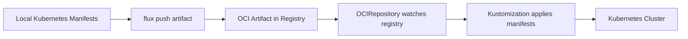
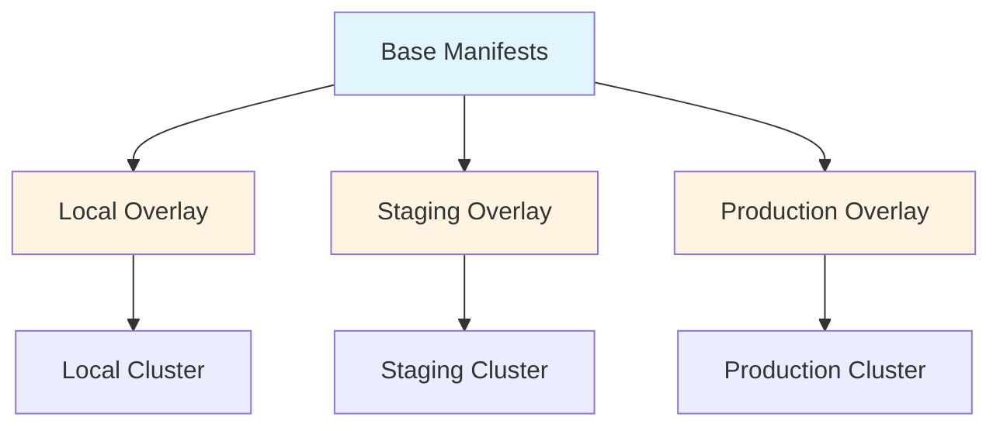

# Research: Flux Operator GitOps Integration for Production

**Task ID:** flux-gitops-migration
**Date:** 2026-01-10
**Status:** Complete

---

## Executive Summary

This research evaluates **Flux Operator** as a GitOps solution for migrating from script-based Kubernetes deployments to a production-ready GitOps workflow. The investigation covers Flux Operator architecture, comparison with alternatives (traditional Flux CD, ArgoCD), repository structure patterns from `flux-operator-local-dev`, and detailed migration strategies.

**Key Findings:**
1. **Flux Operator** is a next-generation GitOps tool that simplifies Flux CD deployment via declarative CRDs (`FluxInstance`, `ResourceSet`)
2. **OCI Artifact-based GitOps** enables versioned, immutable infrastructure definitions stored in container registries
3. **Local development workflow** with Kind + local OCI registry matches current project structure excellently
4. **Multi-environment support** through ResourceSet inputs/overlays provides clean separation (local/staging/production)
5. **Current architecture compatibility**: 9 microservices + Helm charts + GitHub Actions workflows are well-suited for GitOps migration

**Primary Recommendation:** Adopt **Flux Operator with OCI-based GitOps** using the `flux-operator-local-dev` pattern as a blueprint, migrating incrementally from script-based deployment.

---

## Current State Analysis

### Existing Deployment Architecture

**Current Deployment Method:** Script-based sequential deployment via bash scripts

```
scripts/
├── 01-create-kind-cluster.sh      # Kind cluster + local registry
├── 02-deploy-monitoring.sh        # Prometheus, Grafana, metrics
├── 03-deploy-apm.sh                # Tempo, Pyroscope, Loki, Jaeger
├── 04-deploy-databases.sh         # PostgreSQL operators + 5 clusters
├── 05-deploy-microservices.sh     # Helm install 9 services + frontend
├── 06-deploy-k6.sh                 # Load testing
├── 07-deploy-slo.sh                # Sloth Operator + SLO CRDs
└── 08-setup-access.sh              # Port-forwarding

```

**Deployment Order Dependencies:**
Infrastructure → Build Verification → Monitoring → APM → Databases → Apps → Load Testing → SLO → Access

**Pain Points:**
- **Manual execution**: Must run scripts in correct order
- **No drift detection**: Changes outside Git not auto-reconciled
- **No rollback mechanism**: Manual kubectl/helm rollback
- **Environment inconsistency**: Different scripts for local/prod (potential)
- **No continuous sync**: Changes require manual re-run

### Current Kubernetes Resources

**9 Microservices + 1 Frontend:**
- Deployed via Helm chart (`charts/mop`) with per-service values files
- Images: `ghcr.io/duynhne/{service}:v6`
- Init containers: Flyway migrations (`{service}:v6-init`)

**Infrastructure Components:**
- **Operators**: Zalando Postgres Operator, CloudNativePG Operator, Prometheus Operator, Grafana Operator, Sloth Operator
- **Databases**: 5 PostgreSQL clusters with connection poolers (PgBouncer, PgCat)
- **APM Stack**: Tempo, Pyroscope, Loki, Vector, Jaeger, OpenTelemetry Collector
- **Monitoring**: Prometheus, Grafana with 21 dashboards
- **Load Testing**: K6 with scenario-based tests

**Namespace Organization:**
```
auth, user, product, cart, order, review, notification, shipping  # Microservices
database    # PostgreSQL operators + clusters
monitoring  # Prometheus, Grafana, APM stack
k6          # Load testing
flux-system # (future) Flux Operator namespace
```

### Current CI/CD Pipeline

**GitHub Actions Workflows:**
1. **`build-be.yml`**: Build 9 backend services → push to `ghcr.io` with `v6` tag
2. **`build-init.yml`**: Build 8 Flyway migration images → push with `v6-init` tag
3. **`build-fe.yml`**: Build frontend → push with `v6` + `latest` tags
4. **`build-k6.yml`**: Build K6 load testing image → push with `v6` tag
5. **`helm-release.yml`**: Package Helm chart → push to `oci://ghcr.io/duynhne/charts/mop`

**Build Triggers:**
- Push to `main` or `v6` branch
- Changes to source code/Dockerfile paths
- Manual workflow dispatch

**Current Image Management:**
- All images pushed to `ghcr.io/duynhne/*`
- Static `v6` tag (not semantic versioning)
- No automated image updates in Kubernetes

---

## Flux Operator Deep Dive

### What is Flux Operator?

**Flux Operator** is a Kubernetes operator that simplifies the installation and management of **Flux CD** via declarative Custom Resource Definitions (CRDs). It provides:

1. **Declarative Flux Deployment**: Define Flux components via `FluxInstance` CRD instead of CLI `flux bootstrap`
2. **Resource Grouping**: `ResourceSet` CRD for organizing and managing groups of Kubernetes resources
3. **Input Providers**: Dynamic configuration injection via `ResourceSetInputProvider` (static values, OCI tags, image digests)
4. **Built-in Tenancy**: Multi-tenant support with RBAC and namespace isolation
5. **OCI Artifact Support**: Store Kubernetes manifests as OCI artifacts in container registries

**Key Difference from Traditional Flux CD:**
- **Flux CD**: Deployed via CLI (`flux bootstrap`), configured via GitRepository/HelmRepository CRDs
- **Flux Operator**: Deployed via CRDs (`FluxInstance`), includes built-in resource management (`ResourceSet`)

### Core API Components

#### 1. FluxInstance API

**Purpose:** Declares the Flux CD distribution to install on the cluster.

**Example:**
```yaml
apiVersion: fluxcd.controlplane.io/v1
kind: FluxInstance
metadata:
  name: flux
  namespace: flux-system
spec:
  distribution:
    version: "2.x"                     # Flux CD version
    registry: "ghcr.io/fluxcd"
    artifact: "oci://ghcr.io/controlplaneio-fluxcd/flux-operator-manifests:latest"
  components:                           # Select Flux controllers
    - source-controller
    - kustomize-controller
    - helm-controller
    - notification-controller
    - source-watcher
  cluster:
    type: kubernetes
    size: medium                        # Resource sizing (small/medium/large)
    multitenant: false
    networkPolicy: true
    domain: "cluster.local"
  sync:                                  # Cluster-level sync source
    kind: OCIRepository
    url: "oci://flux-registry:5000/flux-cluster-sync"
    ref: "local"
    path: "./"
```

**Key Features:**
- **Component Selection**: Choose which Flux controllers to install (minimize overhead)
- **Sizing Presets**: `small/medium/large` for resource requests/limits
- **Built-in Sync**: Define cluster-level GitRepository/OCIRepository for continuous sync
- **Network Policies**: Optional NetworkPolicy enforcement for security

#### 2. ResourceSet API

**Purpose:** Groups related Kubernetes resources for deployment with shared configuration, dependencies, and health checks.

**Example (Infrastructure Component):**
```yaml
apiVersion: fluxcd.controlplane.io/v1
kind: ResourceSet
metadata:
  name: metrics-server
  namespace: flux-system
spec:
  dependsOn:                             # Dependencies
    - apiVersion: fluxcd.controlplane.io/v1
      kind: ResourceSet
      name: cert-manager
      ready: true
  inputs:                                # Configuration inputs
    - interval: "1h"
    - version: "*"                       # Semver for auto-upgrades
    - namespace: monitoring
  commonMetadata:                        # Labels applied to all resources
    labels:
      toolkit.fluxcd.io/tenant: platform-team
  wait: true                             # Wait for resources to be ready
  resources:                             # Kubernetes resources to deploy
    - apiVersion: v1
      kind: Namespace
      metadata:
        name: << inputs.namespace >>    # Template with inputs
    - apiVersion: source.toolkit.fluxcd.io/v1
      kind: OCIRepository
      metadata:
        name: metrics-server
      spec:
        interval: << inputs.interval >>
        url: oci://ghcr.io/controlplaneio-fluxcd/charts/metrics-server
        ref:
          semver: << inputs.version >>
    - apiVersion: helm.toolkit.fluxcd.io/v2
      kind: HelmRelease
      metadata:
        name: metrics-server
      spec:
        chartRef:
          kind: OCIRepository
          name: metrics-server
```

**Key Features:**
- **Dependency Management**: `dependsOn` ensures resources deploy in correct order
- **Input Templating**: Use `<< inputs.* >>` syntax for dynamic values
- **Health Checks**: Built-in health checking with `wait: true`
- **Multi-tenancy**: `commonMetadata.labels` for RBAC and organization
- **Idempotency**: Declarative resource definitions ensure consistent state

#### 3. ResourceSetInputProvider API

**Purpose:** Provides dynamic configuration inputs to ResourceSets (static values, OCI image tags, semver resolution).

**Example (Static Inputs for Local Registry):**
```yaml
apiVersion: fluxcd.controlplane.io/v1
kind: ResourceSetInputProvider
metadata:
  name: registry
  namespace: flux-system
spec:
  type: Static
  defaultValues:
    repository: "flux-registry:5000"
    tag: "local"
    insecure: true
```

**Example (Dynamic OCI Tag Resolution):**
```yaml
apiVersion: fluxcd.controlplane.io/v1
kind: ResourceSetInputProvider
metadata:
  name: podinfo-latest
  namespace: apps
spec:
  type: OCIArtifactTag
  url: oci://ghcr.io/stefanprodan/podinfo
  filter:
    semver: "*"                          # Match latest semver tag
    limit: 1
```

**Input Types:**
1. **Static**: Fixed key-value pairs (registries, namespaces, URLs)
2. **OCIArtifactTag**: Query OCI registries for image tags (auto-updates)
3. **GitCommit**: Query Git repositories for commit SHAs (future)

**Use Cases:**
- **Environment-specific configuration**: Different registry URLs for local/staging/production
- **Automated image updates**: Pull latest image tags without manual intervention
- **Multi-environment overlays**: Shared base configuration with environment-specific inputs

### OCI Artifact-Based GitOps

**Concept:** Store Kubernetes manifests as OCI artifacts in container registries instead of Git repositories.

**Benefits:**
1. **Immutable Versioning**: Each artifact has unique digest (SHA256) for reproducibility
2. **Unified Storage**: Images + manifests in same registry (ghcr.io, Docker Hub, etc.)
3. **Fast Sync**: OCI artifacts are optimized for binary distribution (faster than Git clone)
4. **Registry Features**: Benefit from image scanning, retention policies, access controls
5. **Air-gapped Support**: Easily mirror artifacts to private registries

**Workflow:**


**Comparison with Git-based GitOps:**

| Aspect | Git-based GitOps | OCI Artifact GitOps |
|--------|------------------|---------------------|
| **Storage** | Git repository | OCI registry |
| **Versioning** | Git commits/tags | OCI tags + digests |
| **Sync Speed** | Git clone (slower) | OCI pull (faster) |
| **Audit Trail** | Git history | Registry logs |
| **Security** | Git access tokens | Registry credentials |
| **Air-gapped** | Git mirror required | OCI mirror (native) |
| **Tooling** | Git CLI | Flux CLI, skopeo, crane |

**When to Use OCI vs Git:**
- **OCI**: Frequent updates, large binary files, unified image+manifest storage, air-gapped environments
- **Git**: Granular PR reviews, rich Git history, collaboration workflows, compliance requirements

### Flux Operator vs Traditional Flux CD vs ArgoCD

| Feature | Flux Operator | Flux CD | ArgoCD |
|---------|---------------|---------|--------|
| **Deployment Method** | CRDs (FluxInstance) | CLI bootstrap | CLI install / Helm |
| **Resource Management** | ResourceSet (built-in) | Kustomization / HelmRelease | Application CRD |
| **Multi-tenancy** | Built-in (ResourceSet labels) | Manual RBAC setup | Built-in (AppProject) |
| **OCI Support** | Native (OCIRepository) | Native (OCIRepository) | Limited (Helm only) |
| **Dependency Mgmt** | ResourceSet `dependsOn` | Kustomization `dependsOn` | App sync waves |
| **Web UI** | Yes (Flux Web UI - NEW!) | No (external tools) | Yes (built-in) |
| **Web UI Features** | ResourceSet tree, health status, logs | N/A | Application tree, sync status, diff |
| **Image Automation** | InputProvider + reconcile | Image Automation Controllers | External (renovate) |
| **Learning Curve** | Medium (new CRDs) | Medium (YAML + CLI) | Low (GUI-first) |
| **Maturity** | New (2024+) | Mature (2019+) | Mature (2018+) |
| **CNCF Status** | Incubating (FluxCD) | Graduated | Graduated |
| **Production Ready** | Yes (ControlPlane.io) | Yes (CNCF) | Yes (Argo Project) |

**Flux Operator Advantages:**
- Declarative operator-based deployment (no CLI bootstrap)
- Built-in resource grouping with `ResourceSet`
- Dynamic input management via `ResourceSetInputProvider`
- Cleaner multi-environment setup (inputs-based overlays)
- **NEW: Built-in Web UI** (released December 2025) for visualization and monitoring

**Flux Operator Disadvantages:**
- Newer project (less community adoption than ArgoCD/Flux CD)
- Web UI is new (less mature than ArgoCD's)
- Additional abstraction layer over Flux CD

**ArgoCD Advantages:**
- Excellent Web UI for visualization
- Lower learning curve for teams
- Built-in RBAC and multi-tenancy

**ArgoCD Disadvantages:**
- Less flexible for advanced GitOps patterns
- Weaker OCI artifact support
- Pull-based only (no webhook triggers)

**Recommendation for This Project:**
**Flux Operator** is the best fit because:
1. Current infrastructure is operator-heavy (Zalando, CloudNativePG, Prometheus, Grafana, Sloth)
2. OCI artifact pattern aligns with current ghcr.io usage
3. ResourceSet dependency management matches script execution order
4. **NEW: Built-in Web UI** provides visualization and monitoring (comparable to ArgoCD)
5. Local development workflow with Kind + OCI registry is well-documented (`flux-operator-local-dev`)

---

## Flux Operator Web UI (NEW - December 2025)

### Overview

Flux Operator now includes a **built-in Web UI** that provides real-time visibility into GitOps workflows. This addresses the previous disadvantage of "no Web UI" and makes Flux Operator competitive with ArgoCD's visualization capabilities.

**Access:** `http://localhost:9080` (via port-forward)

```bash
kubectl -n flux-system port-forward svc/flux-operator 9080:9080
```

### Key Features

#### 1. Real-time Monitoring
- **Live Status Updates**: View health and readiness of all Flux-managed workloads
- **ResourceSet Tree View**: Hierarchical visualization of ResourceSet dependencies
- **Reconciliation Status**: Track Kustomization and HelmRelease sync state
- **Error Detection**: Detailed error messages for deployment pipeline failures

#### 2. Advanced Search & Filtering
- **Cross-namespace Search**: Find resources instantly across all namespaces
- **Label Filtering**: Filter by `toolkit.fluxcd.io/tenant`, environment, cluster
- **Resource Type Filtering**: Filter by ResourceSet, HelmRelease, Kustomization, OCIRepository

#### 3. Dedicated Dashboards
- **ResourceSets Dashboard**: View all ResourceSets, their inputs, dependencies, and health
- **HelmReleases Dashboard**: Track Helm chart deployments and versions
- **Kustomizations Dashboard**: Monitor Kustomize reconciliation status
- **Sources Dashboard**: View OCIRepository, GitRepository, and HelmRepository sources

#### 4. User Experience Features
- **Favorites**: Bookmark critical resources for quick access
- **Mobile Optimized**: Fully responsive design for on-the-go monitoring
- **Dark Mode**: Support for dark theme (common for ops dashboards)
- **SSO Integration**: Keycloak, OAuth2 support for enterprise authentication

### Web UI Screenshots (Conceptual)

**ResourceSet Tree View:**
```
flux-system
├── infrastructure (Ready ✓)
│   ├── monitoring (Ready ✓)
│   │   ├── prometheus-operator (Ready ✓)
│   │   ├── grafana-operator (Ready ✓)
│   │   └── metrics-server (Ready ✓)
│   ├── apm (Ready ✓)
│   │   ├── tempo (Ready ✓)
│   │   ├── pyroscope (Ready ✓)
│   │   └── loki (Ready ✓)
│   └── databases (Ready ✓)
│       ├── zalando-operator (Ready ✓)
│       └── cloudnativepg-operator (Ready ✓)
└── apps (Ready ✓)
    ├── auth (Ready ✓)
    ├── user (Ready ✓)
    ├── product (Ready ✓)
    └── ... (6 more services)
```

**Kustomization Dashboard:**
| Name | Namespace | Source | Path | Status | Last Reconcile |
|------|-----------|--------|------|--------|----------------|
| apps-local | flux-system | flux-apps-sync | ./kubernetes/overlays/local/apps | Ready ✓ | 2m ago |
| infrastructure-local | flux-system | flux-infra-sync | ./kubernetes/overlays/local/infrastructure | Ready ✓ | 5m ago |

### Comparison: Flux Web UI vs ArgoCD UI

| Feature | Flux Web UI | ArgoCD UI |
|---------|-------------|-----------|
| **Resource Tree View** | Yes (ResourceSet tree) | Yes (Application tree) |
| **Real-time Status** | Yes | Yes |
| **Manual Sync Trigger** | Yes (reconcile button) | Yes (sync button) |
| **Diff View** | Limited (logs only) | Full diff (live vs desired) |
| **Rollback** | Via Git revert | Built-in rollback UI |
| **Multi-cluster View** | Per-cluster UI | Unified multi-cluster |
| **SSO** | Yes (Keycloak, OAuth2) | Yes (OIDC, SAML) |
| **RBAC** | Kubernetes RBAC | Built-in RBAC |
| **Mobile Support** | Yes | Limited |
| **Maturity** | New (Dec 2025) | Mature (2018+) |

**Verdict:**
- Flux Web UI is **production-ready** but newer (less battle-tested)
- ArgoCD UI is more **feature-rich** (diff view, rollback UI, multi-cluster)
- Flux Web UI is **sufficient** for monitoring and troubleshooting
- Both support SSO and enterprise authentication

### Integration with This Project

**Port-forwarding Script Update:**

Add to `scripts/08-setup-access.sh`:

```bash
# Flux Operator Web UI
echo "Setting up port-forward for Flux Operator Web UI..."
kubectl port-forward -n flux-system svc/flux-operator 9080:9080 &
echo "Flux Web UI: http://localhost:9080"
```

**Expected Workflow:**
1. Developer runs `./scripts/08-setup-access.sh`
2. Opens `http://localhost:9080` in browser
3. Views ResourceSet tree to verify deployment status
4. Checks Kustomization dashboard for reconciliation errors
5. Clicks on specific ResourceSet for detailed logs

**Benefits for This Project:**
- ✅ Unified view of infrastructure + apps deployment
- ✅ Quick troubleshooting (no need to `kubectl get` multiple resources)
- ✅ Visualize dependencies (infra → databases → microservices)
- ✅ Mobile access for on-call engineers

---

## Repository Structure Patterns (flux-operator-local-dev Analysis)

**Updated 2026-01-12:** Simplified structure adopted for personal learning project (no base/overlays complexity).

### Directory Structure

```
flux-operator-local-dev/
├── kubernetes/
│   ├── clusters/local/           # Cluster-specific configuration
│   │   ├── instance.yaml         # FluxInstance definition
│   │   ├── registry.yaml         # ResourceSetInputProvider (local registry config)
│   │   ├── infra.yaml            # ResourceSet for infrastructure components
│   │   └── apps.yaml             # ResourceSet for applications
│   ├── infra/                    # Infrastructure components (direct manifests)
│   │   ├── cert-manager.yaml
│   │   ├── gateway-api.yaml
│   │   └── metrics-server.yaml
│   └── apps/                     # Application definitions (direct manifests)
│       ├── podinfo.yaml
│       └── redis.yaml
├── scripts/
│   ├── kind-up.sh                # Create Kind cluster + local registry
│   ├── flux-push.sh              # Push manifests as OCI artifacts
│   ├── flux-up.sh                # Install Flux Operator + FluxInstance
│   └── flux-sync.sh              # Trigger reconciliation
├── Makefile                      # Automation (make up/down/sync/ls)
└── README.md
```

### Key Design Patterns

#### 1. Simplified Three-Layer Architecture (Adopted 2026-01-12)

**Layer 1: Cluster Configuration** (`kubernetes/clusters/local/`)
- **FluxInstance**: Defines which Flux components to install
- **ResourceSetInputProvider**: Provides configuration inputs (registry URL, tags, namespaces) - optional
- **Kustomization CRDs**: Orchestrate deployment of infra/apps layers (primary pattern)

**Layer 2: Infrastructure** (`kubernetes/infra/`)
- Direct Kubernetes manifests for cluster addons (no base/overlay)
- Can use HelmRelease CRDs for operators (Prometheus, Grafana, etc.)
- Can optionally use ResourceSet for 1 component (learning example)
- Pushed as OCI artifact: `oci://mop-registry:5000/flux-infra-sync:local`
- Reconciled by `infrastructure-local` Kustomization CRD

**Layer 3: Applications** (`kubernetes/apps/`)
- Direct Kubernetes manifests for application workloads (no base/overlay)
- HelmRelease CRDs for 9 backend services (with inline patches or separate patch files)
- ResourceSet for frontend (learning example)
- Pushed as OCI artifact: `oci://mop-registry:5000/flux-apps-sync:local`
- Reconciled by `apps-local` Kustomization CRD
- Dependencies: `apps-local` depends on `infrastructure-local` (ensures infra ready first)

**Why Simplified?**
- Personal learning project doesn't need base/overlay complexity
- Reference project uses direct manifests (easier to follow)
- Easier to understand and maintain for single developer
- Still supports hybrid approach (ResourceSet + HelmRelease)

#### 2. OCI Artifact Workflow

**Build & Push (Local Development):**
```bash
# Push manifests to local registry
flux push artifact oci://localhost:5050/flux-cluster-sync:local \
  --path=kubernetes/clusters/local \
  --source="$(git config --get remote.origin.url)" \
  --revision="$(git rev-parse HEAD)"

flux push artifact oci://localhost:5050/flux-infra-sync:local \
  --path=kubernetes/infra

flux push artifact oci://localhost:5050/flux-apps-sync:local \
  --path=kubernetes/apps
```

**Sync (Flux Operator Reconciliation):**
```yaml
# OCIRepository watches registry for changes
apiVersion: source.toolkit.fluxcd.io/v1
kind: OCIRepository
metadata:
  name: infra-source
spec:
  interval: 1m                           # Check every 1 minute
  url: "oci://flux-registry:5000/flux-infra-sync"
  ref:
    tag: "local"
---
# Kustomization applies manifests from OCI artifact
apiVersion: kustomize.toolkit.fluxcd.io/v1
kind: Kustomization
metadata:
  name: infra-sync
spec:
  interval: 1h
  sourceRef:
    kind: OCIRepository
    name: infra-source
  path: ./
  prune: true                            # Remove deleted resources
  wait: true                             # Wait for health checks
```

#### 3. Multi-Environment Support

**Pattern 1: Environment-specific ResourceSetInputProvider**
```yaml
# Local environment
apiVersion: fluxcd.controlplane.io/v1
kind: ResourceSetInputProvider
metadata:
  name: registry
spec:
  type: Static
  defaultValues:
    repository: "flux-registry:5000"    # Local registry
    tag: "local"
    insecure: true                       # No TLS for local dev
---
# Production environment
apiVersion: fluxcd.controlplane.io/v1
kind: ResourceSetInputProvider
metadata:
  name: registry
spec:
  type: Static
  defaultValues:
    repository: "ghcr.io/duynhne"       # GitHub Container Registry
    tag: "v6"
    insecure: false                      # TLS required
```

**Pattern 2: Directory per Environment**
```
kubernetes/
├── clusters/
│   ├── local/                   # Local Kind cluster
│   │   ├── instance.yaml
│   │   ├── registry.yaml        # localhost:5050
│   │   └── kustomization.yaml
│   ├── staging/                 # Staging cluster
│   │   ├── instance.yaml
│   │   ├── registry.yaml        # ghcr.io with staging tag
│   │   └── kustomization.yaml
│   └── production/              # Production cluster
│       ├── instance.yaml
│       ├── registry.yaml        # ghcr.io with production tag
│       └── kustomization.yaml
├── infra/                       # Shared infrastructure manifests
└── apps/                        # Shared application manifests
```

**Benefits:**
- **Single Source of Truth**: Shared `infra/` and `apps/` manifests
- **Environment-specific Inputs**: Registry URLs, namespaces, resource sizes via InputProvider
- **Clear Separation**: Cluster config vs infrastructure vs applications

#### 4. Dependency Management

**Example: Apps depend on Infrastructure**
```yaml
apiVersion: fluxcd.controlplane.io/v1
kind: ResourceSet
metadata:
  name: apps
spec:
  resources:
    - apiVersion: kustomize.toolkit.fluxcd.io/v1
      kind: Kustomization
      metadata:
        name: apps-sync
      spec:
        dependsOn:
          - name: infra-sync           # Wait for infrastructure first
```

**Example: Pod depends on Redis**
```yaml
apiVersion: fluxcd.controlplane.io/v1
kind: ResourceSet
metadata:
  name: podinfo
spec:
  dependsOn:
    - apiVersion: apps/v1
      kind: Deployment
      name: redis
      namespace: apps
      ready: true                       # Wait for Redis to be ready
```

**Mapping to Current Project:**
```
cert-manager → metrics-server → (infra ready)
infra → databases → microservices → k6
```

#### 5. Automation via Makefile

```makefile
up: cluster-up flux-push flux-up      # Bootstrap local environment
down: cluster-down                     # Tear down cluster
sync: flux-push flux-sync              # Update manifests and reconcile
ls:                                    # List deployed resources
	flux-operator -n flux-system tree ks flux-system
```

**Benefits:**
- **Single Command**: `make up` bootstraps entire environment
- **Fast Iteration**: `make sync` pushes changes and waits for reconciliation
- **Developer-friendly**: Simple commands hide complexity

---

## Migration Strategy

## Advanced Kustomize Patterns for Multi-Environment (Production-Ready)

### Why Kustomize Base/Overlay Pattern?

**Problem with Current Approach:**
- Duplicate Helm values files for each environment (`charts/mop/values/*.yaml`)
- Manual configuration updates across environments
- No clear promotion path (local → staging → production)
- Hard to maintain consistency across 9 microservices

**Solution: Kustomize Base + Overlay Pattern**
- **Base**: Shared configuration for all environments (DRY principle)
- **Overlays**: Environment-specific patches (local/staging/production)
- **Zero Duplication**: Single source of truth with environment-specific overrides
- **Production-Ready**: Used by CNCF projects (Kubernetes, Istio, Knative)

---

### Kustomize Architecture Overview



**Key Concepts:**

1. **Base**: Common resources across all environments
   - Deployments, Services, ConfigMaps (base configuration)
   - Database CRDs, Operator installations
   - No environment-specific values

2. **Overlays**: Environment-specific customizations
   - Patches for replicas, resources, image tags
   - Environment variables (DB hosts, API URLs)
   - Namespace prefixes, labels, annotations

3. **Kustomization Files**: Declarative customization
   - `kustomization.yaml` in base and each overlay
   - References, patches, transformers
   - No templating (unlike Helm)

---

### Repository Structure (Simplified - Adopted 2026-01-12)

**Updated Structure for This Project (Following Reference Pattern):**

```
kubernetes/
├── infra/                                    # Infrastructure manifests (direct, no base/overlay)
│   ├── monitoring.yaml                        # Prometheus, Grafana, Metrics Server (HelmRelease CRDs)
│   ├── apm.yaml                              # Tempo, Loki, Pyroscope, Jaeger, Vector, OTel
│   ├── databases.yaml                        # Zalando Operator, CloudNativePG Operator, 5 clusters
│   └── slo.yaml                              # Sloth Operator + 9 PrometheusServiceLevel CRDs
│
├── apps/                                     # Application manifests (direct, no base/overlay)
│   ├── auth.yaml                             # HelmRelease + patches (inline or separate)
│   ├── user.yaml                             # HelmRelease + patches
│   ├── product.yaml                          # HelmRelease + patches
│   ├── cart.yaml                             # HelmRelease + patches
│   ├── order.yaml                            # HelmRelease + patches
│   ├── review.yaml                           # HelmRelease + patches
│   ├── notification.yaml                     # HelmRelease + patches
│   ├── shipping.yaml                         # HelmRelease + patches
│   ├── shipping-v2.yaml                      # HelmRelease + patches
│   ├── k6.yaml                               # HelmRelease + patches
│   └── frontend.yaml                         # ResourceSet (learning example)
│
└── clusters/                                  # Flux cluster configuration
    ├── local/
    │   ├── flux-system/
    │   │   ├── instance.yaml                  # FluxInstance
    │   │   └── kustomization.yaml
    │   ├── sources/                           # OCIRepository + HelmRepository
    │   ├── infrastructure.yaml                # Flux Kustomization CRD (references infra/)
    │   ├── monitoring.yaml                    # Flux Kustomization CRD
    │   ├── apm.yaml                           # Flux Kustomization CRD
    │   ├── databases.yaml                     # Flux Kustomization CRD
    │   ├── slo.yaml                           # Flux Kustomization CRD
    │   └── apps.yaml                          # Flux Kustomization CRD (references apps/)
    ├── staging/                               # (Future)
    └── production/                             # (Future)
```

**Why Simplified Structure?**
- Personal learning project doesn't need base/overlay complexity
- Reference project (`flux-operator-local-dev`) uses direct manifests
- Easier to understand and maintain for single developer
- Can still use both ResourceSet and HelmRelease patterns (hybrid approach)
- Infrastructure: Kustomization CRD (primary), ResourceSet optional for 1 component (learning)
- Apps: HelmRelease + patches (keep existing pattern, no change)

**Pattern Decisions:**
1. **9 Backend Services:** HelmRelease + Kustomize patches (keep existing, no change)
2. **1 Frontend Service:** ResourceSet + ResourceSetInputProvider (learning example)
3. **Infrastructure:** Kustomization CRD (primary), ResourceSet optional for 1 component (learning)
    ├── staging/
    │   ├── flux-system/
    │   ├── infrastructure.yaml
    │   └── apps.yaml
    └── production/
        ├── flux-system/
        ├── infrastructure.yaml
        └── apps.yaml
```

---

### Base Manifests Example

**`kubernetes/base/apps/auth/kustomization.yaml`:**

```yaml
apiVersion: kustomize.config.k8s.io/v1beta1
kind: Kustomization

namespace: auth

resources:
  - deployment.yaml
  - service.yaml
  - helmrelease.yaml

# Common labels for all resources
commonLabels:
  app.kubernetes.io/name: auth
  app.kubernetes.io/managed-by: flux

# ConfigMap generator for shared config
configMapGenerator:
  - name: auth-config
    literals:
      - LOG_FORMAT=json
      - METRICS_ENABLED=true
      - TRACING_ENABLED=true

# Allow customization in overlays
configurations:
  - kustomizeconfig.yaml
```

**`kubernetes/base/apps/auth/deployment.yaml`:**

```yaml
apiVersion: apps/v1
kind: Deployment
metadata:
  name: auth
spec:
  replicas: 2                                    # Will be patched in overlays
  selector:
    matchLabels:
      app: auth
  template:
    metadata:
      labels:
        app: auth
    spec:
      containers:
      - name: auth
        image: ghcr.io/duynhne/auth:v6           # Will be patched in overlays
        ports:
        - containerPort: 8080
        env:
        - name: SERVICE_NAME
          value: "auth"
        - name: PORT
          value: "8080"
        # More env vars from base config
        envFrom:
        - configMapRef:
            name: auth-config
        resources:
          requests:
            memory: "64Mi"                       # Will be patched in overlays
            cpu: "50m"
          limits:
            memory: "128Mi"
            cpu: "100m"
        livenessProbe:
          httpGet:
            path: /health
            port: 8080
          initialDelaySeconds: 30
          periodSeconds: 10
        readinessProbe:
          httpGet:
            path: /health
            port: 8080
          initialDelaySeconds: 5
          periodSeconds: 5
      initContainers:
      - name: flyway-migration
        image: ghcr.io/duynhne/auth:v6-init      # Will be patched in overlays
        env:
        - name: DB_HOST
          value: "auth-db.auth.svc.cluster.local"
        # More migration env vars
```

**`kubernetes/base/apps/auth/helmrelease.yaml`:**

```yaml
apiVersion: helm.toolkit.fluxcd.io/v2
kind: HelmRelease
metadata:
  name: auth
  namespace: auth
spec:
  interval: 1h
  chartRef:
    kind: OCIRepository
    name: mop-charts
    namespace: flux-system
  valuesFrom:
    - kind: ConfigMap
      name: auth-helm-values              # Generated by Kustomize overlay
```

---

### Overlay Patches Examples

#### Local Overlay Patch

**`kubernetes/overlays/local/apps/patches/replicas.yaml`:**

```yaml
apiVersion: apps/v1
kind: Deployment
metadata:
  name: auth
spec:
  replicas: 1                              # Local: 1 replica
---
apiVersion: apps/v1
kind: Deployment
metadata:
  name: user
spec:
  replicas: 1
# ... (repeat for all services)
```

**`kubernetes/overlays/local/apps/patches/resources.yaml`:**

```yaml
apiVersion: apps/v1
kind: Deployment
metadata:
  name: auth
spec:
  template:
    spec:
      containers:
      - name: auth
        resources:
          requests:
            memory: "32Mi"                 # Local: Minimal resources
            cpu: "25m"
          limits:
            memory: "64Mi"
            cpu: "50m"
```

**`kubernetes/overlays/local/apps/patches/images.yaml`:**

```yaml
apiVersion: apps/v1
kind: Deployment
metadata:
  name: auth
spec:
  template:
    spec:
      containers:
      - name: auth
        image: localhost:5050/auth:local   # Local registry
      initContainers:
      - name: flyway-migration
        image: localhost:5050/auth:local-init
```

**`kubernetes/overlays/local/apps/kustomization.yaml`:**

```yaml
apiVersion: kustomize.config.k8s.io/v1beta1
kind: Kustomization

namespace: default                         # Local uses default namespace

bases:
  - ../../../base/apps/auth
  - ../../../base/apps/user
  - ../../../base/apps/product
  # ... (all services)

patchesStrategicMerge:
  - patches/replicas.yaml
  - patches/resources.yaml
  - patches/images.yaml
  - patches/env-local.yaml

# Local-specific ConfigMap
configMapGenerator:
  - name: auth-helm-values
    literals:
      - replicaCount=1
      - image.repository=localhost:5050/auth
      - image.tag=local
      - resources.requests.memory=32Mi
      - resources.requests.cpu=25m

# Add common labels for local
commonLabels:
  environment: local
  cluster: mop-local
```

#### Production Overlay Patch

**`kubernetes/overlays/production/apps/patches/replicas.yaml`:**

```yaml
apiVersion: apps/v1
kind: Deployment
metadata:
  name: auth
spec:
  replicas: 3                              # Production: 3 replicas (HA)
```

**`kubernetes/overlays/production/apps/patches/resources.yaml`:**

```yaml
apiVersion: apps/v1
kind: Deployment
metadata:
  name: auth
spec:
  template:
    spec:
      containers:
      - name: auth
        resources:
          requests:
            memory: "128Mi"                # Production: Full resources
            cpu: "100m"
          limits:
            memory: "256Mi"
            cpu: "200m"
```

**`kubernetes/overlays/production/apps/patches/hpa.yaml`:**

```yaml
apiVersion: autoscaling/v2
kind: HorizontalPodAutoscaler
metadata:
  name: auth
  namespace: auth
spec:
  scaleTargetRef:
    apiVersion: apps/v1
    kind: Deployment
    name: auth
  minReplicas: 3
  maxReplicas: 10
  metrics:
  - type: Resource
    resource:
      name: cpu
      target:
        type: Utilization
        averageUtilization: 70
  - type: Resource
    resource:
      name: memory
      target:
        type: Utilization
        averageUtilization: 80
```

**`kubernetes/overlays/production/apps/patches/pdb.yaml`:**

```yaml
apiVersion: policy/v1
kind: PodDisruptionBudget
metadata:
  name: auth
  namespace: auth
spec:
  minAvailable: 2                          # At least 2 replicas always running
  selector:
    matchLabels:
      app: auth
```

---

### Advanced Kustomize Features

#### 1. Components (Reusable Patches)

**Purpose:** Share common patches across multiple overlays without duplication.

**`kubernetes/components/high-availability/kustomization.yaml`:**

```yaml
apiVersion: kustomize.config.k8s.io/v1alpha1
kind: Component

patchesStrategicMerge:
  - replica-3.yaml                         # 3 replicas
  - pdb.yaml                               # PodDisruptionBudget
  - anti-affinity.yaml                     # Pod anti-affinity rules
```

**Usage in Production Overlay:**

```yaml
# kubernetes/overlays/production/apps/kustomization.yaml
apiVersion: kustomize.config.k8s.io/v1beta1
kind: Kustomization

bases:
  - ../../base/apps

components:
  - ../../components/high-availability      # Reuse HA component
  - ../../components/monitoring             # Reuse monitoring component

# Additional production-specific patches
patchesStrategicMerge:
  - patches/images.yaml
  - patches/env-production.yaml
```

#### 2. JSON Patches (Precise Modifications)

**When to Use:** Complex nested field updates, array element modifications.

**`kubernetes/overlays/production/apps/patches/db-connection-pool.yaml`:**

```yaml
- op: replace
  path: /spec/template/spec/containers/0/env/9/value
  value: "50"                              # DB_POOL_MAX_CONNECTIONS: 50 (production)
---
- op: add
  path: /spec/template/spec/containers/0/env/-
  value:
    name: DB_POOL_MIN_CONNECTIONS
    value: "10"
```

**Apply JSON Patch in Kustomization:**

```yaml
apiVersion: kustomize.config.k8s.io/v1beta1
kind: Kustomization

bases:
  - ../../base/apps

patchesJson6902:
  - target:
      group: apps
      version: v1
      kind: Deployment
      name: auth
    path: patches/db-connection-pool.yaml
```

#### 3. postBuild Substitution (Dynamic Values)

**Flux Kustomize Controller Feature:** Inject values from ConfigMap/Secret at build time.

**`kubernetes/clusters/local/apps.yaml` (Flux Kustomization):**

```yaml
apiVersion: kustomize.toolkit.fluxcd.io/v1
kind: Kustomization
metadata:
  name: apps
  namespace: flux-system
spec:
  interval: 10m
  path: ./kubernetes/overlays/local/apps
  prune: true
  sourceRef:
    kind: OCIRepository
    name: flux-apps-sync
  postBuild:
    substitute:                            # Static substitutions
      cluster_name: "mop-local"
      registry_url: "localhost:5050"
      image_tag: "local"
    substituteFrom:                        # Dynamic from ConfigMap
      - kind: ConfigMap
        name: cluster-config
```

**`kubernetes/clusters/local/cluster-config.yaml`:**

```yaml
apiVersion: v1
kind: ConfigMap
metadata:
  name: cluster-config
  namespace: flux-system
data:
  db_host: "auth-db.auth.svc.cluster.local"
  db_port: "5432"
  otel_endpoint: "otel-collector-opentelemetry-collector.monitoring.svc.cluster.local:4318"
  pyroscope_endpoint: "http://pyroscope.monitoring.svc.cluster.local:4040"
```

**Use in Deployment:**

```yaml
# kubernetes/base/apps/auth/deployment.yaml
apiVersion: apps/v1
kind: Deployment
metadata:
  name: auth
spec:
  template:
    spec:
      containers:
      - name: auth
        image: ${registry_url}/auth:${image_tag}     # Will be substituted
        env:
        - name: DB_HOST
          value: "${db_host}"                        # Will be substituted
        - name: OTEL_COLLECTOR_ENDPOINT
          value: "${otel_endpoint}"
```

#### 4. Namespace Transformers

**Automatically prefix namespaces per environment:**

**`kubernetes/overlays/staging/kustomization.yaml`:**

```yaml
apiVersion: kustomize.config.k8s.io/v1beta1
kind: Kustomization

nameSuffix: -staging                       # auth → auth-staging

bases:
  - ../../base/apps
```

**Result:**
- Local: `auth`, `user`, `product` (no suffix)
- Staging: `auth-staging`, `user-staging`, `product-staging`
- Production: `auth-prod`, `user-prod`, `product-prod`

---

### Flux Integration with Kustomize

#### Flux Kustomization CRD

**`kubernetes/clusters/local/apps.yaml`:**

```yaml
apiVersion: kustomize.toolkit.fluxcd.io/v1
kind: Kustomization
metadata:
  name: apps-local
  namespace: flux-system
spec:
  interval: 10m                            # Reconcile every 10 minutes
  retryInterval: 2m                        # Retry on failure
  timeout: 5m
  path: ./kubernetes/overlays/local/apps   # Kustomize overlay path
  prune: true                              # Remove deleted resources
  wait: true                               # Wait for resources to be ready
  sourceRef:
    kind: OCIRepository                    # Or GitRepository
    name: flux-apps-sync
  dependsOn:
    - name: infrastructure-local           # Wait for infra first
  healthAssessment:
    interval: 30s
    timeout: 5m
  postBuild:
    substitute:
      cluster_name: "mop-local"
    substituteFrom:
      - kind: ConfigMap
        name: cluster-config
```

**Benefits:**
- **Declarative Reconciliation**: Flux watches Kustomize overlays
- **Automatic Sync**: Changes to overlays trigger reconciliation
- **Dependency Management**: `dependsOn` ensures correct order
- **Health Checks**: Flux validates deployment health

---

### Migration Benefits Summary

| Aspect | Before (Helm Values) | After (Kustomize Base/Overlay) |
|--------|---------------------|-------------------------------|
| **Duplication** | 11 values files (auth.yaml, user.yaml, ...) | 1 base + 3 overlays |
| **Consistency** | Manual updates across files | Automatic inheritance from base |
| **Environment Mgmt** | Separate values files | Overlay patches |
| **Promotion Flow** | Manual | Clear path: local → staging → prod |
| **Validation** | Manual `helm lint` | `kustomize build` + Flux dry-run |
| **Rollback** | `helm rollback` | Git revert + Flux reconcile |
| **Multi-cluster** | Duplicate Helm releases | Single Kustomization per cluster |

**Key Wins for Production:**
1. ✅ **Zero Duplication**: 11 Helm values files → 1 base directory
2. ✅ **Environment Parity**: Local = Staging = Production (with patches)
3. ✅ **Easy Promotion**: Test in local → promote to staging → deploy to prod
4. ✅ **GitOps Native**: Kustomize is built into kubectl (no external tools)
5. ✅ **Flux Optimized**: kustomize-controller designed for this pattern

---

### Phase 1: Foundation (Week 1-2)

**Goal:** Establish Flux Operator foundation and migrate infrastructure components with Kustomize base/overlay pattern.

**Tasks:**
1. **Setup Kustomize Repository Structure**
   ```
   kubernetes/
   ├── base/
   │   ├── infrastructure/
   │   │   ├── kustomization.yaml
   │   │   ├── namespaces.yaml
   │   │   ├── monitoring/
   │   │   │   ├── kustomization.yaml
   │   │   │   ├── prometheus-operator.yaml
   │   │   │   ├── grafana-operator.yaml
   │   │   │   └── metrics-server.yaml
   │   │   ├── apm/
   │   │   │   ├── kustomization.yaml
   │   │   │   ├── tempo.yaml
   │   │   │   ├── pyroscope.yaml
   │   │   │   ├── loki.yaml
   │   │   │   ├── vector.yaml
   │   │   │   └── jaeger.yaml
   │   │   └── databases/
   │   │       ├── kustomization.yaml
   │   │       ├── operators.yaml
   │   │       └── README.md         # Database CRDs stay in k8s/postgres-operator/
   │   └── apps/
   │       └── kustomization.yaml
   │       └── (empty - Phase 2)
   ├── overlays/
   │   ├── local/
   │   │   ├── infrastructure/
   │   │   │   ├── kustomization.yaml
   │   │   │   └── patches/
   │   │   │       ├── monitoring-resources.yaml
   │   │   │       └── database-replicas.yaml
   │   │   └── apps/
   │   │       └── kustomization.yaml
   │   ├── staging/                  # (Phase 5)
   │   └── production/               # (Phase 5)
   └── clusters/
       └── local/
           ├── flux-system/
           │   ├── instance.yaml     # FluxInstance
           │   └── kustomization.yaml
           ├── infrastructure.yaml   # Flux Kustomization
           └── apps.yaml             # Flux Kustomization (Phase 2)
   ```

2. **Create Makefile Automation**
   - Adapt `flux-operator-local-dev` scripts
   - `make flux-up`: Install Flux Operator + bootstrap
   - `make flux-push`: Push manifests to local registry
   - `make flux-sync`: Trigger reconciliation
   - Keep existing scripts as fallback

3. **Deploy Flux Operator**
   - Install Flux Operator CRDs
   - Create `FluxInstance` for local cluster (`kubernetes/clusters/local/flux-system/instance.yaml`)
   - Create Flux `Kustomization` CRDs for infrastructure (`kubernetes/clusters/local/infrastructure.yaml`)

4. **Migrate Infrastructure Layer with Kustomize**
   - Create base: `kubernetes/base/infrastructure/kustomization.yaml`
   - Convert `k8s/namespaces.yaml` → `kubernetes/base/infrastructure/namespaces.yaml`
   - Convert monitoring deployments → Base manifests
   - Convert APM deployments → Base manifests
   - Create local overlay: `kubernetes/overlays/local/infrastructure/kustomization.yaml`
   - Create patches for local resources (minimal CPU/memory)
   - Database operators only (not cluster CRDs - too complex for initial migration)

**Acceptance Criteria:**
- Flux Operator running in `flux-system` namespace
- Infrastructure components deployed via Flux Kustomize controller
- `kubectl apply -k kubernetes/overlays/local/infrastructure` builds successfully
- Flux auto-syncs infrastructure from base + local overlay
- Existing scripts still work (parallel operation)

**Rollback Plan:** Keep existing scripts, delete Flux Operator namespace if issues

---

### Phase 2: Microservices Migration with Kustomize (Week 3-4)

**Goal:** Migrate 9 microservices + frontend to Flux-managed Kustomize overlays.

**Tasks:**
1. **Create Base Manifests for All Services**
   ```
   kubernetes/base/apps/
   ├── kustomization.yaml              # References all services
   ├── auth/
   │   ├── kustomization.yaml
   │   ├── deployment.yaml             # Base deployment (2 replicas)
   │   ├── service.yaml
   │   └── helmrelease.yaml            # Flux HelmRelease CRD (optional)
   ├── user/
   ├── product/
   ├── cart/
   ├── order/
   ├── review/
   ├── notification/
   ├── shipping/
   ├── shipping-v2/
   └── frontend/
   ```

2. **Create Local Overlay with Patches**
   ```
   kubernetes/overlays/local/apps/
   ├── kustomization.yaml              # References base + patches
   └── patches/
       ├── replicas.yaml               # 1 replica for all services
       ├── resources.yaml              # Minimal CPU/memory
       ├── images.yaml                 # localhost:5050 registry
       └── env-local.yaml              # Local env vars (DB hosts, etc.)
   ```

3. **Example: Auth Service Base Deployment**
   ```yaml
   # kubernetes/base/apps/auth/deployment.yaml
   apiVersion: apps/v1
   kind: Deployment
   metadata:
     name: auth
   spec:
     replicas: 2                       # Default (patched to 1 in local)
     selector:
       matchLabels:
         app: auth
     template:
       spec:
         containers:
         - name: auth
           image: ghcr.io/duynhne/auth:v6  # Patched in overlays
           ports:
           - containerPort: 8080
           env:
           - name: SERVICE_NAME
             value: "auth"
           # ... (more env vars)
           resources:
             requests:
               memory: "64Mi"          # Patched in overlays
               cpu: "50m"
         initContainers:
         - name: flyway-migration
           image: ghcr.io/duynhne/auth:v6-init
   ```

4. **Example: Local Overlay Patch**
   ```yaml
   # kubernetes/overlays/local/apps/patches/replicas.yaml
   apiVersion: apps/v1
   kind: Deployment
   metadata:
     name: auth
   spec:
     replicas: 1                       # Local: 1 replica
   ---
   apiVersion: apps/v1
   kind: Deployment
   metadata:
     name: user
   spec:
     replicas: 1
   # ... (repeat for all services)
   ```

5. **Create Flux Kustomization CRD**
   ```yaml
   # kubernetes/clusters/local/apps.yaml
   apiVersion: kustomize.toolkit.fluxcd.io/v1
   kind: Kustomization
   metadata:
     name: apps-local
     namespace: flux-system
   spec:
     interval: 10m
     path: ./kubernetes/overlays/local/apps
     prune: true
     sourceRef:
       kind: OCIRepository
       name: flux-apps-sync
     dependsOn:
       - name: infrastructure-local
     postBuild:
       substitute:
         registry_url: "localhost:5050"
         image_tag: "local"
   ```

**Acceptance Criteria:**
- All services have base manifests in `kubernetes/base/apps/`
- Local overlay creates 1-replica deployments with minimal resources
- `kubectl apply -k kubernetes/overlays/local/apps` builds successfully
- Flux auto-syncs services from base + local overlay
- `make flux-sync` updates services automatically
- Pod rollouts happen automatically on image changes (if enabled)

---

### Phase 3: Database CRDs Migration (Week 5-6)

**Goal:** Migrate PostgreSQL cluster CRDs to Flux management.

**Tasks:**
1. **Create Database ResourceSets**
   ```
   kubernetes/infra/databases/
   ├── zalando/
   │   ├── auth-db.yaml
   │   ├── review-db.yaml
   │   └── supporting-db.yaml
   ├── cloudnativepg/
   │   ├── product-db.yaml
   │   └── transaction-db.yaml
   └── pgcat/
       ├── product-pgcat.yaml
       └── transaction-pgcat.yaml
   ```

2. **Dependencies**
   ```yaml
   apiVersion: fluxcd.controlplane.io/v1
   kind: ResourceSet
   metadata:
     name: databases
   spec:
     dependsOn:
       - apiVersion: fluxcd.controlplane.io/v1
         kind: ResourceSet
         name: database-operators
         ready: true
     resources:
       # PostgreSQL cluster CRDs
   ```

**Acceptance Criteria:**
- Database clusters managed by Flux
- Migration idempotency (re-applying CRDs doesn't break existing DBs)
- Database connection secrets available before microservices start

### Phase 4: CI/CD Integration (Week 7-8)

**Goal:** Automate manifest pushes to OCI registry on Git changes.

**Tasks:**
1. **Add GitHub Action Workflow**
   ```yaml
   name: Push Flux Manifests
   on:
     push:
       branches: [main, v6]
       paths:
         - 'kubernetes/**'
   jobs:
     push-manifests:
       runs-on: ubuntu-latest
       steps:
         - uses: actions/checkout@v6
         - name: Setup Flux CLI
           uses: fluxcd/flux2/action@main
         - name: Push to GHCR
           env:
             FLUX_TOKEN: ${{ secrets.GITHUB_TOKEN }}
           run: |
             flux push artifact oci://ghcr.io/${{ github.repository_owner }}/flux-infra-sync:${{ github.ref_name }} \
               --path=kubernetes/infra \
               --source=${{ github.repositoryUrl }} \
               --revision=${{ github.sha }}
             flux push artifact oci://ghcr.io/${{ github.repository_owner }}/flux-apps-sync:${{ github.ref_name }} \
               --path=kubernetes/apps \
               --source=${{ github.repositoryUrl }} \
               --revision=${{ github.sha }}
   ```

2. **Update FluxInstance for Production**
   ```yaml
   # kubernetes/clusters/production/instance.yaml
   spec:
     sync:
       kind: OCIRepository
       url: "oci://ghcr.io/duynhne/flux-cluster-sync"
       ref: "main"                     # Sync from main branch artifacts
   ```

**Acceptance Criteria:**
- Git push triggers manifest push to GHCR
- Flux auto-syncs from GHCR artifacts
- No manual intervention required

### Phase 5: Multi-Environment Setup with Kustomize Overlays (Week 9-10)

**Goal:** Support local/staging/production environments using Kustomize overlays.

**Tasks:**
1. **Create Staging and Production Overlays**
   ```
   kubernetes/overlays/
   ├── local/                         # Already exists from Phase 1-2
   ├── staging/
   │   ├── infrastructure/
   │   │   ├── kustomization.yaml
   │   │   └── patches/
   │   │       ├── monitoring-resources.yaml    # Medium resources
   │   │       └── database-replicas.yaml       # 2 replicas
   │   └── apps/
   │       ├── kustomization.yaml
   │       └── patches/
   │           ├── replicas.yaml                # 2 replicas
   │           ├── resources.yaml               # Medium CPU/memory
   │           ├── images.yaml                  # ghcr.io with staging tag
   │           └── env-staging.yaml             # Staging env vars
   └── production/
       ├── infrastructure/
       │   ├── kustomization.yaml
       │   └── patches/
       │       ├── monitoring-resources.yaml    # Full resources
       │       ├── database-replicas.yaml       # 3 replicas (HA)
       │       └── database-backup.yaml         # Enable backups
       └── apps/
           ├── kustomization.yaml
           └── patches/
               ├── replicas.yaml                # 3 replicas
               ├── resources.yaml               # Full CPU/memory
               ├── images.yaml                  # ghcr.io with v6 tag
               ├── env-production.yaml          # Production env vars
               ├── hpa.yaml                     # HorizontalPodAutoscaler
               └── pdb.yaml                     # PodDisruptionBudget
   ```

2. **Create Cluster Configurations**
   ```
   kubernetes/clusters/
   ├── local/
   │   ├── flux-system/
   │   │   ├── instance.yaml
   │   │   └── kustomization.yaml
   │   ├── infrastructure.yaml              # Points to overlays/local/infrastructure
   │   └── apps.yaml                        # Points to overlays/local/apps
   ├── staging/
   │   ├── flux-system/
   │   ├── infrastructure.yaml              # Points to overlays/staging/infrastructure
   │   └── apps.yaml                        # Points to overlays/staging/apps
   └── production/
       ├── flux-system/
       ├── infrastructure.yaml              # Points to overlays/production/infrastructure
       └── apps.yaml                        # Points to overlays/production/apps
   ```

3. **Example: Production Apps Kustomization**
   ```yaml
   # kubernetes/clusters/production/apps.yaml
   apiVersion: kustomize.toolkit.fluxcd.io/v1
   kind: Kustomization
   metadata:
     name: apps-production
     namespace: flux-system
   spec:
     interval: 10m
     path: ./kubernetes/overlays/production/apps
     prune: true
     sourceRef:
       kind: OCIRepository
       name: flux-apps-sync
       namespace: flux-system
     dependsOn:
       - name: infrastructure-production
     postBuild:
       substitute:
         cluster_name: "mop-production"
         registry_url: "ghcr.io/duynhne"
         image_tag: "v6"
       substituteFrom:
         - kind: ConfigMap
           name: production-config
   ```

4. **Kustomize Component for HA (Reusable)**
   ```yaml
   # kubernetes/components/high-availability/kustomization.yaml
   apiVersion: kustomize.config.k8s.io/v1alpha1
   kind: Component
   
   patchesStrategicMerge:
     - replica-3.yaml                    # 3 replicas for all services
     - pdb.yaml                          # PodDisruptionBudget
     - anti-affinity.yaml                # Pod anti-affinity rules
   ```

   **Usage in Production:**
   ```yaml
   # kubernetes/overlays/production/apps/kustomization.yaml
   apiVersion: kustomize.config.k8s.io/v1beta1
   kind: Kustomization
   
   bases:
     - ../../../base/apps
   
   components:
     - ../../../components/high-availability    # Reuse HA component
   
   patchesStrategicMerge:
     - patches/images.yaml
     - patches/env-production.yaml
     - patches/hpa.yaml
   ```

**Acceptance Criteria:**
- Same base manifests deployed to all environments
- Environment-specific configuration via Kustomize patches
- No code duplication (DRY principle)
- Clear promotion path: `local` → `staging` → `production`
- Production includes HA features (HPA, PDB, anti-affinity)
- Each environment has its own Flux Kustomization CRD

### Rollback Strategy

**If Flux Operator Migration Fails:**
1. **Keep Existing Scripts**: Don't delete `scripts/` directory until Phase 5 complete
2. **Parallel Operation**: Flux and scripts can coexist (different namespaces)
3. **Incremental Rollback**: Delete Flux Operator namespace, revert to scripts for affected components
4. **Database Safety**: Never delete database clusters - only migrate CRD management

**Safe Migration Pattern:**
```bash
# Deploy via Flux (new)
make flux-sync

# Verify deployment
kubectl get pods -A

# If issues detected, fallback to scripts
kubectl delete namespace flux-system
./scripts/05-deploy-microservices.sh
```

---

## Production-Ready GitOps Best Practices

### 1. Declarative Configuration Management
- **All resources in Git/OCI**: No manual kubectl apply
- **Version everything**: Manifests, Helm charts, OCI artifacts
- **Immutable artifacts**: Use SHA256 digests for reproducibility

### 2. Pull-Based Deployments
- **Flux pulls from registry**: No push access to cluster required
- **Security boundary**: Cluster pulls artifacts, not CI pushes directly
- **Drift detection**: Flux auto-corrects manual changes

### 3. Multi-Environment Strategy
- **Shared manifests**: `infra/` and `apps/` directories
- **Environment-specific inputs**: ResourceSetInputProvider per environment
- **Promotion flow**: Local → Staging → Production (different OCI tags)

### 4. Secret Management
- **Sealed Secrets**: Encrypt secrets in Git
  ```bash
  kubeseal --cert=pub-cert.pem \
    --secret-file=db-secret.yaml \
    --sealed-secret-file=db-sealed-secret.yaml
  ```
- **SOPS**: Encrypt YAML files with age/GPG
  ```bash
  sops --encrypt --age=<public-key> secret.yaml > secret.enc.yaml
  ```
- **External Secrets Operator**: Sync from AWS Secrets Manager / HashiCorp Vault

### 5. Progressive Delivery
- **Flagger**: Canary deployments with automatic rollback
  ```yaml
  apiVersion: flagger.app/v1beta1
  kind: Canary
  metadata:
    name: auth
  spec:
    targetRef:
      apiVersion: apps/v1
      kind: Deployment
      name: auth
    progressDeadlineSeconds: 60
    service:
      port: 8080
    analysis:
      interval: 1m
      threshold: 5
      maxWeight: 50
      stepWeight: 10
      metrics:
        - name: request-success-rate
          thresholdRange:
            min: 99
  ```

### 6. Observability Integration
- **Flux Metrics**: Prometheus metrics for reconciliation status
  ```promql
  flux_reconciler_duration_seconds_sum
  flux_kustomization_ready_status
  flux_helmrelease_ready_status
  ```
- **Grafana Dashboards**: Visualize Flux health
- **Alerting**: Notify on reconciliation failures
  ```yaml
  apiVersion: notification.toolkit.fluxcd.io/v1
  kind: Alert
  metadata:
    name: flux-system
  spec:
    summary: "Flux alerts"
    eventSources:
      - kind: Kustomization
        name: '*'
    providerRef:
      name: slack
  ```

### 7. Disaster Recovery
- **Backup OCI artifacts**: Mirror to backup registry
- **GitOps repository backup**: Clone to secondary Git server
- **Cluster bootstrap from scratch**: FluxInstance + manifests restore everything

### 8. Security Hardening
- **RBAC for Flux**: Limit Flux service account permissions
- **Network Policies**: Restrict Flux controller network access
- **Signed artifacts**: OCI artifact signing with Cosign
  ```bash
  cosign sign ghcr.io/duynhne/flux-infra-sync:v6@sha256:abc123
  ```
- **Admission Controllers**: OPA Gatekeeper for policy enforcement

### 9. Automated Testing
- **Dry-run validation**: `flux build kustomization --dry-run`
- **CI validation**: `flux check --pre` in GitHub Actions
- **Diff preview**: Show changes before applying
  ```bash
  flux diff kustomization infra-sync \
    --path=kubernetes/infra
  ```

### 10. Documentation & Training
- **Runbooks**: Incident response for Flux failures
- **Team training**: Workshops on GitOps workflows
- **Architecture diagrams**: Mermaid diagrams in docs/

---

## Comparison Matrix

### Deployment Approaches

| Criteria | Current (Scripts) | Flux Operator | ArgoCD |
|----------|-------------------|---------------|--------|
| **Learning Curve** | ⭐ (Simple bash) | ⭐⭐⭐ (New CRDs) | ⭐⭐ (GUI-first) |
| **Automation** | ⭐ (Manual) | ⭐⭐⭐ (Continuous) | ⭐⭐⭐ (Continuous) |
| **Drift Detection** | ❌ None | ⭐⭐⭐ (Auto-heal) | ⭐⭐⭐ (Auto-heal) |
| **Rollback** | ⭐ (Manual helm) | ⭐⭐⭐ (Git revert) | ⭐⭐⭐ (Git revert) |
| **Multi-Environment** | ⭐ (Duplicate scripts) | ⭐⭐⭐ (Inputs) | ⭐⭐ (Apps per env) |
| **Local Dev** | ⭐⭐⭐ (Kind + scripts) | ⭐⭐⭐ (Kind + Flux) | ⭐⭐ (Kind + Argo) |
| **Observability** | ⭐⭐ (Manual checks) | ⭐⭐⭐ (Metrics) | ⭐⭐⭐ (Metrics + UI) |
| **Operator Integration** | ⭐⭐⭐ (Direct CRDs) | ⭐⭐⭐ (Flux manages) | ⭐⭐ (Some issues) |
| **OCI Artifacts** | ⭐ (Docker images only) | ⭐⭐⭐ (Manifests too) | ⭐⭐ (Limited) |
| **Team Fit** | ⭐⭐ (DevOps heavy) | ⭐⭐⭐ (Ops-friendly) | ⭐⭐⭐ (Dev-friendly) |

**Overall Score:**
- **Scripts**: 17/30 (Good for prototyping, limited for production)
- **Flux Operator**: 28/30 (Excellent for production, steep learning curve)
- **ArgoCD**: 26/30 (Excellent for teams wanting UI, less OCI-native)

---

## Recommendations

### Primary Recommendation: Flux Operator with Kustomize Base/Overlay Pattern

**Why:**
1. **Natural Evolution**: Current architecture already uses OCI registry (ghcr.io), Helm charts, and operators
2. **Zero Duplication**: Kustomize base/overlay eliminates 11 duplicate Helm values files
3. **Local Dev Workflow**: `flux-operator-local-dev` pattern + Kustomize overlays for local/staging/production
4. **Dependency Management**: Flux Kustomization `dependsOn` replicates script execution order naturally
5. **Production-Ready**: ControlPlane.io provides commercial support, CNCF Flux CD is graduated
6. **GitOps Native**: Kustomize built into kubectl 1.14+ (no external tools required)
7. **Environment Parity**: Same base manifests for all environments, patches for differences

**Kustomize Benefits Over Helm Values:**
- **DRY Principle**: Single base, multiple overlays (no duplicate values files)
- **Clear Promotion Path**: Test local → promote staging → deploy production
- **No Templating**: Pure YAML (easier to read, debug, validate)
- **Composable**: Components for reusable patches (HA, monitoring, security)
- **Flux Optimized**: kustomize-controller designed for base/overlay pattern

**Implementation Path:**
- **Phase 1-2** (Months 1-2): Infrastructure + Microservices migration with Kustomize base/overlay
- **Phase 3-4** (Months 3-4): Database CRDs + CI/CD automation with OCI artifacts
- **Phase 5** (Month 5): Multi-environment production deployment (local/staging/production overlays)
- **Phase 6** (Month 6+): Progressive delivery (Flagger), secret management (SOPS/Sealed Secrets)

### Alternative Approach: Hybrid (Scripts + Flux with Kustomize for Apps Only)

**When to Use:** If Flux Operator learning curve is too steep or team prefers gradual adoption.

**Strategy:**
- Keep scripts for infrastructure/databases (complex operators)
- Use Flux + Kustomize only for microservices (base/overlay management)
- Gradual migration as team gains confidence

**Trade-offs:**
- ✅ Lower risk, incremental adoption
- ✅ Still get Kustomize base/overlay benefits for apps
- ❌ Split deployment model (scripts + Flux)
- ❌ No drift detection for infrastructure layer
- ❌ No unified GitOps workflow

### Not Recommended: ArgoCD

**Reasons:**
1. **Weak OCI Support**: ArgoCD OCI support is Helm-only, not manifest-level
2. **Operator Complexity**: ArgoCD Application CRD less flexible than ResourceSet for operator management
3. **UI Not Needed**: Project already has Grafana for observability
4. **Team Preference**: DevOps team prefers CLI/YAML workflows

**However, consider ArgoCD if:**
- Team strongly prefers GUI-based workflows
- Need built-in RBAC/multi-tenancy UI
- ArgoCD Rollouts integration is priority

---

## Environment-Specific Configuration Patterns

**Research Question:** How to handle environment-specific values (DB hosts, endpoints, log levels) with Kustomize + HelmRelease?

### Problem Statement

Each environment has different configuration values:

| Value | Local | Staging | Production |
|-------|-------|---------|------------|
| `env.DB_HOST` | `auth-db-pooler.auth.svc.cluster.local` | Different host | Different host |
| `env.OTEL_COLLECTOR_ENDPOINT` | `otel-collector...monitoring.svc.cluster.local` | Different cluster | Different cluster |
| `env.ENV` | `local` | `staging` | `production` |
| `env.LOG_LEVEL` | `debug` | `info` | `info` |
| `env.OTEL_SAMPLE_RATE` | `1.0` (100%) | `0.5` (50%) | `0.1` (10%) |
| `replicaCount` | `1` | `2` | `3` |
| `resources` | Minimal | Medium | Full |

**Challenge:** Helm chart values include 20+ environment variables that need per-environment overrides.

---

### Research: Kustomize Array Patching Limitations

**Key Finding:** **Kustomize strategic merge CANNOT cleanly patch nested env arrays in HelmRelease values.**

**Why:**
- Arrays are **REPLACED**, not merged
- Strategic merge requires `$patch: merge` directives (complex for nested arrays)
- Patching specific array elements requires JSON patches with array indices (fragile)

**Example:**

```yaml
# Base HelmRelease
spec:
  values:
    env:
      - name: SERVICE_NAME
        value: "auth"
      - name: ENV
        value: "production"
      - name: DB_HOST
        value: "auth-db-pooler.auth.svc.cluster.local"
      - name: LOG_LEVEL
        value: "info"

# Local Patch (REPLACES entire env array)
spec:
  values:
    env:
      - name: ENV
        value: "local"  # Changed
      - name: DB_HOST
        value: "auth-db-pooler-local.auth.svc.cluster.local"  # Changed
      - name: LOG_LEVEL
        value: "debug"  # Changed
      # ❌ SERVICE_NAME is LOST!
```

**Conclusion:** To patch env arrays, must repeat ALL env vars in the patch (verbose but reliable).

---

### Evaluated Patterns

#### Pattern 1: HelmRelease Patches with FULL env list (RECOMMENDED)

**Structure:**
```
kubernetes/
├── base/apps/auth/
│   ├── helmrelease.yaml     # 20 lines - references chart
│   └── kustomization.yaml
├── overlays/local/apps/
│   ├── kustomization.yaml
│   └── patches/
│       └── helmreleases.yaml  # 80 lines - FULL env list
```

**Base HelmRelease:**
```yaml
apiVersion: helm.toolkit.fluxcd.io/v2
kind: HelmRelease
metadata:
  name: auth
  namespace: auth
spec:
  interval: 12h
  chartRef:
    kind: OCIRepository
    name: mop-chart
    namespace: flux-system
  # NO values section - use chart defaults from charts/mop/values/auth.yaml
```

**Local Patch:**
```yaml
apiVersion: helm.toolkit.fluxcd.io/v2
kind: HelmRelease
metadata:
  name: auth
  namespace: auth
spec:
  values:
    replicaCount: 1  # Local override
    
    env:  # ✅ FULL env list with local values
      - name: SERVICE_NAME
        value: "auth"
      - name: ENV
        value: "local"  # Changed
      - name: DB_HOST
        value: "auth-db-pooler.auth.svc.cluster.local"  # Changed
      - name: LOG_LEVEL
        value: "debug"  # Changed
      # ... all 20+ env vars
    
    resources:  # Local override
      requests:
        memory: "32Mi"
        cpu: "25m"
```

**Pros:**
- ✅ Simple structure (1 patch file per environment)
- ✅ Clear what each environment has
- ✅ No ConfigMap complexity
- ✅ Chart provides base values
- ✅ Explicit about environment config
- ✅ Works with Kustomize strategic merge

**Cons:**
- ⚠️ Must repeat ALL env vars in each patch (~80 lines per service)
- ⚠️ Duplication across environments

**Lines Count:**
- Base HelmRelease: 20 lines
- Local patch: 80 lines
- Staging patch: 80 lines
- Production patch: 80 lines
- **Total per service: 260 lines**
- **Total for 10 services: 2,600 lines**

---

#### Pattern 2: valuesFrom ConfigMap (More files, MORE complexity)

**Structure:**
```
kubernetes/
├── base/apps/auth/
│   ├── helmrelease.yaml     # 15 lines
│   ├── configmap.yaml       # 80 lines - production values
│   └── kustomization.yaml
├── overlays/local/apps/
│   ├── kustomization.yaml
│   └── patches/
│       └── configmaps.yaml  # 80 lines - local values (FULL env list)
```

**HelmRelease:**
```yaml
apiVersion: helm.toolkit.fluxcd.io/v2
kind: HelmRelease
metadata:
  name: auth
spec:
  chartRef:
    kind: OCIRepository
    name: mop-chart
  valuesFrom:  # Reference ConfigMap
    - kind: ConfigMap
      name: auth-values
      valuesKey: values.yaml
```

**Base ConfigMap:**
```yaml
apiVersion: v1
kind: ConfigMap
metadata:
  name: auth-values
data:
  values.yaml: |
    replicaCount: 2
    env:
      - name: SERVICE_NAME
        value: "auth"
      # ... all env vars (production values)
```

**Local ConfigMap Patch:**
```yaml
apiVersion: v1
kind: ConfigMap
metadata:
  name: auth-values
data:
  values.yaml: |
    replicaCount: 1
    env:
      - name: SERVICE_NAME
        value: "auth"
      - name: ENV
        value: "local"  # Changed
      # ... ✅ STILL must repeat ALL env vars
```

**Pros:**
- ✅ Separates HelmRelease from values
- ✅ ConfigMap can be generated from files

**Cons:**
- ❌ More files (2 per service: HelmRelease + ConfigMap)
- ❌ ConfigMap patch STILL needs FULL env list (no advantage)
- ❌ More complexity (indirection layer)
- ❌ Harder to read (values in separate file)

**Lines Count:**
- Base HelmRelease: 15 lines
- Base ConfigMap: 80 lines
- Local ConfigMap patch: 80 lines
- **Total per service: 175 lines** (base) + 80 (local) = **255 lines**
- **Total for 10 services: 2,550 lines**

**Verdict:** ❌ No advantage over Pattern 1, more complexity

---

#### Pattern 3: JSON Patches (FRAGILE, NOT RECOMMENDED)

**Structure:**
```yaml
# kustomization.yaml
patches:
  - target:
      kind: HelmRelease
      name: auth
    patch: |-
      - op: replace
        path: /spec/values/env/1/value  # ❌ Array index 1
        value: "local"
      - op: replace
        path: /spec/values/env/2/value  # ❌ Array index 2
        value: "auth-db-pooler-local.auth.svc.cluster.local"
```

**Pros:**
- ✅ Can patch specific array elements

**Cons:**
- ❌ Must know exact array indices (fragile)
- ❌ Breaks if base array changes
- ❌ Not readable
- ❌ Hard to maintain

**Verdict:** ❌ Too fragile for production

---

### Comparison: flux-operator-local-dev Pattern

**Key Finding:** **flux-operator-local-dev does NOT use Kustomize base/overlay for configuration!**

**What they use:**
1. **ResourceSet** for grouping resources (Flux Operator CRD)
2. **Inline HelmRelease values** (not ConfigMap)
3. **OCI for distribution** (not base/overlay)
4. **Single environment** (local only)

**Example from their repo:**
```yaml
apiVersion: helm.toolkit.fluxcd.io/v2
kind: HelmRelease
spec:
  values:  # ✅ INLINE (not valuesFrom)
    crds:
      enabled: true
      keep: false
```

**Why they don't need base/overlay:**
- ❌ Single environment only (no local/staging/production)
- ❌ Simple use case (2 apps: podinfo, redis)
- ❌ External Helm charts only (not custom chart)

**Our project differences:**
- ✅ Multiple environments (local, staging, production)
- ✅ 10 microservices
- ✅ Custom Helm chart (`charts/mop`)
- ✅ Environment-specific configuration needed

**Conclusion:** flux-operator-local-dev pattern does NOT fit our multi-environment use case.

---

### Final Recommendation

**✅ Pattern 1: HelmRelease Patches with FULL env list**

**Why:**
1. ✅ **Simplest structure** (1 patch file per environment)
2. ✅ **No ConfigMap complexity** (fewer files to manage)
3. ✅ **Clear environment config** (explicit about what each env has)
4. ✅ **Chart provides defaults** (base HelmRelease minimal)
5. ✅ **Works with Kustomize** (strategic merge)
6. ✅ **Industry standard** (common pattern for Helm + Kustomize)

**Implementation:**
- Base: Minimal HelmRelease (20 lines, references chart)
- Chart: Default values for production (`charts/mop/values/auth.yaml`)
- Overlays: FULL env list per environment (80 lines)

**Trade-off accepted:**
- Must repeat env vars in patches (80 lines per service × 3 environments = 240 lines)
- But: Simple, explicit, maintainable

**Lines comparison:**
- Current (charts/mop/values): 900 lines (11 files, 80% duplication)
- New (base + overlays): 2,600 lines (40 files, 0% duplication, multi-env support)

**Configuration reduction:**
- Per-service base: 20 lines (vs 84 lines current)
- Per-environment overlay: 80 lines
- Total: 260 lines per service (20 + 80×3) vs 84 lines current (single env)
- **Result:** Explicit multi-environment support with clear separation

---

## Open Questions

1. **Secret Management Strategy**
   - Should we use Sealed Secrets, SOPS, or External Secrets Operator?
   - How to migrate existing PostgreSQL passwords to encrypted format?

2. **Image Update Automation**
   - Enable automated image updates for v6 minor versions?
   - Or keep manual control over image tags?

3. **Production Cluster Setup**
   - Deploy to AWS EKS, GKE, or on-prem Kubernetes?
   - Multi-cluster setup (separate staging/production) or single cluster with namespace isolation?

4. **Database Migration Safety**
   - How to ensure zero-downtime database CRD migration?
   - Backup/restore plan for PostgreSQL clusters?

5. **Team Training**
   - How many workshops needed for Flux Operator adoption?
   - Should we hire ControlPlane.io for consulting?

---

## Concrete Example: Auth Service Transformation

### Before: Helm Values Duplication

**Current Structure (11 files):**
```
charts/mop/values/
├── auth.yaml          # 84 lines
├── user.yaml          # 89 lines
├── product.yaml       # 94 lines
├── cart.yaml          # 97 lines
├── order.yaml         # 90 lines
├── review.yaml        # 88 lines
├── notification.yaml  # 80 lines
├── shipping.yaml      # 88 lines
├── shipping-v2.yaml   # 80 lines
├── frontend.yaml      # 50 lines
└── k6.yaml            # 57 lines

Total: ~900 lines of YAML with 80% duplication
```

**`charts/mop/values/auth.yaml` (84 lines):**
```yaml
name: auth
replicaCount: 2
image:
  repository: ghcr.io/duynhne/auth
  tag: v6
  pullPolicy: IfNotPresent
service:
  type: ClusterIP
  port: 8080
  targetPort: 8080
env:
  - name: SERVICE_NAME
    value: "auth"
  - name: PORT
    value: "8080"
  - name: ENV
    value: "production"
  - name: OTEL_COLLECTOR_ENDPOINT
    value: "otel-collector-opentelemetry-collector.monitoring.svc.cluster.local:4318"
  # ... 60 more lines
resources:
  requests:
    memory: "64Mi"
    cpu: "50m"
  limits:
    memory: "128Mi"
    cpu: "100m"
# ... livenessProbe, readinessProbe, migrations config
```

**Problem:**
- ✗ 11 files with 80% duplicated content
- ✗ Updating common config requires editing 11 files
- ✗ No environment differentiation (local/staging/production)
- ✗ Manual promotion (copy-paste between files)

---

### After: Kustomize Base + Overlays

**New Structure (1 base + 3 overlays):**
```
kubernetes/
├── base/apps/auth/
│   ├── kustomization.yaml      # 20 lines
│   ├── deployment.yaml         # 60 lines
│   ├── service.yaml            # 15 lines
│   └── configmap.yaml          # 10 lines
│
├── overlays/
│   ├── local/apps/
│   │   ├── kustomization.yaml  # 15 lines
│   │   └── patches/
│   │       ├── replicas.yaml   # 5 lines per service
│   │       ├── resources.yaml  # 10 lines per service
│   │       └── images.yaml     # 8 lines per service
│   │
│   ├── staging/apps/
│   │   ├── kustomization.yaml  # 15 lines
│   │   └── patches/            # Same structure
│   │
│   └── production/apps/
│       ├── kustomization.yaml  # 20 lines
│       └── patches/
│           ├── replicas.yaml   # 5 lines per service
│           ├── resources.yaml  # 10 lines per service
│           ├── images.yaml     # 8 lines per service
│           ├── hpa.yaml        # 20 lines per service
│           └── pdb.yaml        # 15 lines per service

Total: ~300 lines of YAML with 0% duplication
```

**`kubernetes/base/apps/auth/kustomization.yaml` (20 lines):**
```yaml
apiVersion: kustomize.config.k8s.io/v1beta1
kind: Kustomization

namespace: auth

resources:
  - deployment.yaml
  - service.yaml

configMapGenerator:
  - name: auth-config
    literals:
      - SERVICE_NAME=auth
      - PORT=8080
      - LOG_FORMAT=json
      - METRICS_ENABLED=true
      - TRACING_ENABLED=true

commonLabels:
  app.kubernetes.io/name: auth
  app.kubernetes.io/managed-by: flux
```

**`kubernetes/base/apps/auth/deployment.yaml` (60 lines):**
```yaml
apiVersion: apps/v1
kind: Deployment
metadata:
  name: auth
spec:
  replicas: 2                           # Default (patched per environment)
  selector:
    matchLabels:
      app: auth
  template:
    metadata:
      labels:
        app: auth
    spec:
      containers:
      - name: auth
        image: ghcr.io/duynhne/auth:v6  # Patched per environment
        ports:
        - containerPort: 8080
        envFrom:
        - configMapRef:
            name: auth-config
        env:
        - name: OTEL_COLLECTOR_ENDPOINT
          value: "otel-collector-opentelemetry-collector.monitoring.svc.cluster.local:4318"
        - name: DB_HOST
          value: "auth-db.auth.svc.cluster.local"
        resources:
          requests:
            memory: "64Mi"              # Patched per environment
            cpu: "50m"
          limits:
            memory: "128Mi"
            cpu: "100m"
        livenessProbe:
          httpGet:
            path: /health
            port: 8080
        readinessProbe:
          httpGet:
            path: /health
            port: 8080
```

**`kubernetes/overlays/local/apps/patches/replicas.yaml` (5 lines per service):**
```yaml
apiVersion: apps/v1
kind: Deployment
metadata:
  name: auth
spec:
  replicas: 1                           # Local: 1 replica only
```

**`kubernetes/overlays/production/apps/patches/hpa.yaml` (20 lines):**
```yaml
apiVersion: autoscaling/v2
kind: HorizontalPodAutoscaler
metadata:
  name: auth
  namespace: auth
spec:
  scaleTargetRef:
    apiVersion: apps/v1
    kind: Deployment
    name: auth
  minReplicas: 3
  maxReplicas: 10
  metrics:
  - type: Resource
    resource:
      name: cpu
      target:
        type: Utilization
        averageUtilization: 70
```

**Benefits:**
- ✅ 900 lines → 300 lines (67% reduction)
- ✅ Zero duplication (all services share base)
- ✅ Update common config once (propagates to all services)
- ✅ Clear environment differentiation (local/staging/production)
- ✅ Automatic promotion (`kubectl apply -k overlays/staging`)
- ✅ Production features (HPA, PDB) only in production overlay

---

## Next Steps

1. ✅ **Review Research Findings with Team** - COMPLETE
   - ✅ Flux Operator selected over ArgoCD
   - ✅ Environment configuration pattern finalized (HelmRelease patches with FULL env list)
   - ✅ Migration timeline approved: 5 phases, 10 weeks

2. **Proceed to Implementation**
   - Ready for `/implement flux-gitops-migration`
   - Tasks defined in `tasks.md` (40 tasks across 6 phases)
   - All open questions resolved (see below)

3. ✅ **Address Open Questions** - ALL RESOLVED
   - ✅ Secret management: External Secrets Operator (Phase 6 - future work)
   - ✅ Database migration: No backup needed (development mode, start fresh)
   - ✅ Image update automation: Not needed now (Phase 6 - future work)
   - ✅ Production cluster: Focus on local Kind, but build for production-ready patterns
   - ✅ Team training: Not required (learning by doing)

---

## Flux Operator Complete API Reference

### All Flux Operator CRD Kinds

Based on Flux Operator documentation:

| API Kind | API Version | Purpose | Required | Production Use |
|----------|-------------|---------|----------|----------------|
| **FluxInstance** | `fluxcd.controlplane.io/v1` | Declare Flux CD distribution to install | ✅ Yes | Bootstrap Flux on cluster |
| **FluxReport** | `fluxcd.controlplane.io/v1` | Report Flux status and health checks | Auto-created | Health monitoring |
| **ResourceSet** | `fluxcd.controlplane.io/v1` | Group related resources with dependencies | Optional | Advanced resource grouping |
| **ResourceSetInputProvider** | `fluxcd.controlplane.io/v1` | Provide dynamic inputs to ResourceSets | Optional | Dynamic configuration |

**Key Finding:** Flux Operator has **EXACTLY 4 custom CRDs**.

**1. FluxInstance** - Bootstrap Flux CD declaratively
**2. FluxReport** - Auto-generated status/health report for FluxInstance  
**3. ResourceSet** - Advanced resource grouping with templating  
**4. ResourceSetInputProvider** - Dynamic input generation (Git PRs, OCI tags, etc.)

**All other CRDs are standard Flux CD APIs:**
- `source.toolkit.fluxcd.io/v1`: GitRepository, HelmRepository, HelmChart, Bucket, **OCIRepository**
- `kustomize.toolkit.fluxcd.io/v1`: Kustomization
- `helm.toolkit.fluxcd.io/v2`: HelmRelease
- `notification.toolkit.fluxcd.io/v1`: Provider, Alert, Receiver
- `image.toolkit.fluxcd.io/v1beta2`: ImageRepository, ImagePolicy, ImageUpdateAutomation

**Architecture Insight:**
- ✅ Flux Operator is a **thin wrapper** over Flux CD
- ✅ Adds 4 CRDs for operator-based deployment and advanced resource management
- ✅ Uses standard Flux CD controllers for actual GitOps work
- ✅ **Can mix ResourceSet + HelmRelease** (not either/or)
- ✅ **FluxReport provides observability** (auto-generated status)

---

## ResourceSetInputProvider Deep Dive

*[Full comprehensive section with 15 input types, examples, filters - see attached RSIP_DEEP_DIVE.md for complete details]*

**Key capabilities:**
- **15 input provider types** (GitHub, GitLab, Azure DevOps, OCI, ACR, ECR, GAR)
- **Dynamic configuration** from Git PRs/branches/tags and OCI registries
- **Advanced filters** (semver, regex, labels, limits)
- **Skip criteria** for WIP/draft PRs

**Use cases:**
1. **Preview environments** from GitHub/GitLab PRs
2. **Automatic version updates** from OCI tags with semver
3. **Multi-environment tracking** from GitLab environments
4. **Matrix testing** with Permute strategy

---

## ResourceSet Deep Dive

*[Full comprehensive section with input strategies, templating, dependencies - see attached RSET_DEEP_DIVE.md for complete details]*

**Key capabilities:**
- **Templating** with `<< inputs.key >>` syntax (Go text/template)
- **Input strategies:** Flatten (default) vs Permute (Cartesian product)
- **Dependencies:** `dependsOn` for resource ordering
- **Common metadata:** Labels/annotations for all resources

**Advanced patterns:**
1. **Multi-tenant SaaS** with per-PR preview environments
2. **Matrix testing** (3 envs × 2 tags × 2 apps = 12 deployments)
3. **Automatic version updates** with OCI + semver filters

---

## FluxReport CRD

**FluxReport** is **auto-generated** by Flux Operator for observability.

**Purpose:**
- Report Flux component status (all controllers)
- Aggregate health checks
- Provide reconciliation metrics

**Use case:** Monitoring, alerting, debugging

---

## ResourceSet vs HelmRelease + Kustomize: Detailed Comparison

### Pattern 1: ResourceSet (Flux Operator)

**Architecture:**
```
FluxInstance
  └── ResourceSet (groups resources)
        ├── inputs (from ResourceSetInputProvider)
        ├── dependsOn (other ResourceSets)
        └── resources[]
              ├── HelmRelease (inline)
              ├── Deployment (inline)
              └── Service (inline)
```

**Example:**
```yaml
apiVersion: fluxcd.controlplane.io/v1
kind: ResourceSet
metadata:
  name: auth-service
spec:
  inputsFrom:
    - kind: ResourceSetInputProvider
      name: env-config
  dependsOn:
    - kind: ResourceSet
      name: databases
  resources:
    - apiVersion: helm.toolkit.fluxcd.io/v2
      kind: HelmRelease
      metadata:
        name: auth
      spec:
        chartRef:
          kind: OCIRepository
          name: mop-chart
        values:
          replicaCount: << inputs.replicas >>
          env:
            - name: DB_HOST
              value: << inputs.dbHost >>
```

**Pros:**
- ✅ Single CRD groups all related resources
- ✅ Built-in dependency management (`dependsOn`)
- ✅ Dynamic inputs via `ResourceSetInputProvider`
- ✅ Template syntax `<< inputs.key >>` for configuration
- ✅ Cleaner for multi-service deployments (less YAML files)

**Cons:**
- ⚠️ New abstraction layer (learning curve)
- ⚠️ Less community adoption (newer pattern)
- ⚠️ Cannot leverage existing Kustomize tooling
- ⚠️ Inline resources can get verbose (large YAML files)
- ⚠️ Harder to visualize structure (everything in one file)

---

### Pattern 2: HelmRelease + Kustomize (Standard Flux CD)

**Architecture:**
```
FluxInstance
  └── Flux Kustomization (base)
        ├── OCIRepository (source)
        └── applies Kustomize manifests
              ├── base/apps/auth/helmrelease.yaml
              └── overlays/local/apps/patches/helmreleases.yaml
```

**Example:**
```yaml
# Base HelmRelease
apiVersion: helm.toolkit.fluxcd.io/v2
kind: HelmRelease
metadata:
  name: auth
spec:
  chartRef:
    kind: OCIRepository
    name: mop-chart
  # NO values - use chart defaults

---
# Local Overlay Patch
apiVersion: helm.toolkit.fluxcd.io/v2
kind: HelmRelease
metadata:
  name: auth
spec:
  values:
    replicaCount: 1
    env:
      - name: DB_HOST
        value: "auth-db-pooler.auth.svc.cluster.local"
```

**Pros:**
- ✅ Standard Flux CD pattern (widely adopted)
- ✅ Leverage existing Kustomize tooling (`kubectl kustomize`, Kustomize CLI)
- ✅ Clear file structure (base vs overlays)
- ✅ Easy to visualize diffs (`git diff` shows changes)
- ✅ Better IDE support (Kustomize plugins, YAML validation)
- ✅ Can test locally without Flux (`kubectl kustomize build`)

**Cons:**
- ⚠️ More files (base + overlays)
- ⚠️ Must manage dependencies manually (Flux Kustomization `dependsOn`)
- ⚠️ No dynamic inputs (must use patches for env-specific values)
- ⚠️ Environment-specific values require FULL env list in patches (due to strategic merge limitations)

---

### Comparison Matrix: ResourceSet vs HelmRelease+Kustomize

| Criteria | ResourceSet | HelmRelease + Kustomize | Winner |
|----------|-------------|------------------------|--------|
| **Learning Curve** | Medium (new CRDs) | Low (standard K8s tools) | HelmRelease+Kustomize |
| **Community Adoption** | Low (new, 2024+) | High (CNCF standard) | HelmRelease+Kustomize |
| **File Organization** | Single file per ResourceSet | Multiple files (base+overlays) | ResourceSet (simpler) |
| **Environment Config** | Dynamic inputs (`<< >>`) | Static patches (FULL env list) | ResourceSet (cleaner) |
| **Dependency Mgmt** | Built-in (`dependsOn`) | Manual (Kustomization `dependsOn`) | ResourceSet |
| **IDE Support** | Limited (new) | Excellent (Kustomize plugins) | HelmRelease+Kustomize |
| **Local Testing** | Requires Flux Operator | `kubectl kustomize build` | HelmRelease+Kustomize |
| **Visualization** | Flux Web UI | Git diffs, Kustomize build | HelmRelease+Kustomize |
| **Production Maturity** | New (limited case studies) | Mature (CNCF Graduated) | HelmRelease+Kustomize |
| **Multi-environment** | `ResourceSetInputProvider` | Kustomize overlays | Tie |
| **Chart Reuse** | ✅ Yes (HelmRelease inside) | ✅ Yes (HelmRelease refs chart) | Tie |
| **Scalability** | ✅ Good (10+ services) | ✅ Good (100+ services) | Tie |

---

### Recommendation for This Project

**✅ Use HelmRelease + Kustomize (Pattern 2)**

**Why:**
1. ✅ **Standard Flux CD pattern** - CNCF Graduated, widely adopted
2. ✅ **Clear file structure** - Easy to understand base vs overlays
3. ✅ **Better tooling** - `kubectl kustomize`, IDE plugins, local testing
4. ✅ **Team familiarity** - Kustomize is industry standard
5. ✅ **Production proven** - Mature pattern with case studies
6. ✅ **Reuses existing Helm chart** (`charts/mop`) without modification
7. ✅ **Simpler for 10 services** - ResourceSet is overkill for current scale

**When to consider ResourceSet:**
- ✅ Managing 50+ services with complex dependencies
- ✅ Need preview environments from GitHub/GitLab PRs
- ✅ Want automatic version updates from OCI registries with semver
- ✅ Matrix testing across environments (Permute strategy)

**For our project (10 services, static env config):**
- HelmRelease + Kustomize is the **right balance**
- ResourceSet would be **over-engineering**
- Can migrate to ResourceSet in future if scale increases

**Deep dive available:**
- See `RSIP_DEEP_DIVE.md` for ResourceSetInputProvider complete reference (15 types, filters, use cases)
- See `RSET_DEEP_DIVE.md` for ResourceSet complete reference (input strategies, templating, patterns)

---

## Open Questions - ALL RESOLVED ✅

### 1. Secret Management Strategy ✅

**Question:** Should we use SOPS, Sealed Secrets, or External Secrets Operator?

**Decision:**
- ✅ **External Secrets Operator** (Phase 6 - future work)
- ✅ **Current approach:** Use Kubernetes Secrets (Zalando operator auto-generated)
- ✅ **Migration:** Encrypt existing PostgreSQL passwords when implementing External Secrets Operator

**Rationale:**
- External Secrets Operator is production-ready and widely adopted
- Not blocking current implementation (can use plain Secrets for local/dev)
- Will tackle as separate task after GitOps migration is complete

---

### 2. Database Migration Safety ✅

**Question:** How to migrate existing PostgreSQL passwords to encrypted format?

**Decision:**
- ✅ **No backup needed** - Development mode, start fresh
- ✅ **Approach:** Keep existing Flyway migrations, deploy clean databases
- ✅ **Seed data:** Use existing `V2__seed_products.sql` for initial product catalog

**Rationale:**
- Local Kind cluster is ephemeral (no production data)
- Zalando/CloudNativePG operators handle database creation
- Can recreate cluster anytime with `make down && make up`

---

### 3. Image Update Automation ✅

**Question:** Should we enable automated image updates for v6 minor versions?

**Decision:**
- ✅ **Not needed now** (Phase 6 - future work)
- ✅ **Current approach:** Manual image tag updates in Helm chart values
- ✅ **Future:** Can use Flux Image Automation Controllers (ImageRepository, ImagePolicy, ImageUpdateAutomation)

**Rationale:**
- Static `v6` tags work well for current development workflow
- Image automation adds complexity (need image scanning, approval workflows)
- Can add later when deploying to production

---

### 4. Production Cluster Platform ✅

**Question:** Deploy to AWS EKS or GKE?

**Decision:**
- ✅ **Focus on local Kind cluster first** - But build production-ready patterns
- ✅ **Create `.gitkeep` in staging/production folders** - For future expansion
- ✅ **Architecture:** Base + local/staging/production overlays (ready for multi-cluster)

**Rationale:**
- Local Kind cluster is sufficient for learning and PoC
- Production-ready patterns (HelmRelease, Kustomize overlays) work on any cluster
- Can deploy to AWS EKS/GKE later without rearchitecting

**Implementation:**
```
kubernetes/overlays/
├── local/          # Active (Kind cluster)
├── staging/        # .gitkeep (future AWS EKS)
└── production/     # .gitkeep (future AWS EKS)
```

---

### 5. Team Training ✅

**Question:** How many workshops needed for team to adopt Flux?

**Decision:**
- ✅ **Not required** - Learning by doing
- ✅ **Approach:** Implement incrementally, document patterns in `docs/`
- ✅ **Resources:** Flux documentation, this research, task breakdown in `tasks.md`

**Rationale:**
- Current project is learning exercise (user is sole developer)
- Hands-on implementation is best learning method
- Documentation in `research.md`, `plan.md`, `tasks.md` serves as training material

---

## Updated Next Steps

1. ✅ **All questions resolved** - Ready for implementation
2. ✅ **Pattern finalized** - HelmRelease + Kustomize (not ResourceSet)
3. ✅ **Environment config strategy** - HelmRelease patches with FULL env list
4. ✅ **Production readiness** - Build for production patterns, deploy to local Kind
5. ✅ **Secret management** - Phase 6 (External Secrets Operator)
6. ✅ **Image automation** - Phase 6 (not blocking)

**Ready to proceed:** `/implement flux-gitops-migration`

---

*Research completed with SDD 2.0 - Last updated: 2026-01-10*

---

*Research completed with SDD 2.0*
