# Implementation Tasks: Production-Ready GitOps with Flux Operator + Kustomize

**Task ID:** flux-gitops-migration
**Created:** 2026-01-10
**Last Updated:** 2026-01-10 (Hybrid Pattern)
**Status:** Ready for Implementation
**Based on:** plan.md (1,333 lines) + research.md (2,921 lines)

---

## ⚠️ Architecture Decision: Hybrid Pattern

**Implementation Strategy:**
- **9 Backend Services:** HelmRelease + Kustomize patches (production-ready)
- **1 Frontend Service:** ResourceSet + ResourceSetInputProvider (learning Flux Operator)

**Why?**
- Learn both Flux Operator patterns
- Frontend is simple (ideal for ResourceSet experiment)
- Backend uses proven pattern (HelmRelease + Kustomize)
- Compare patterns side-by-side

**Key Tasks:**
- Task 2.1-2.2: Create HelmRelease for backend services
- Task 2.3b: Create ResourceSet for frontend (learning)
- Task 2.5: Create Kustomize patches for 9 backend services only
- Task 2.5b: Update ResourceSetInputProvider for frontend

---

## Summary

| Metric | Value |
|--------|-------|
| Total Tasks | 65+ (restructured to match deployment order) |
| Estimated Effort | 140-170 hours (14-17 weeks, flexible) |
| Phases | 10 (9 implementation + 1 documentation) |
| Critical Path | 1.1 → 3.1 → 4.1 → 5.1 → 2.1 (already done) → 6.1 → 7.1 → 8.1 → 9.1 → 10.1 |
| Learning Focus | High (portfolio project for Senior SRE + Flux Operator patterns) |
| **Status** | Phase 1-2 complete (Foundation + Apps), Phases 3-10 pending |

**Phase Status:**
- ✅ Phase 1: Foundation (Flux Operator, OCI) - **COMPLETE**
- ✅ Phase 2: Apps Migration (9 HelmReleases + 1 ResourceSet) - **COMPLETE**
- 🔴 Phase 3: Monitoring Stack - **NOT STARTED** (should be done before apps)
- 🔴 Phase 4: APM Stack - **NOT STARTED** (should be done before apps)
- 🔴 Phase 5: Database Infrastructure - **NOT STARTED** (should be done before apps)
- 🔴 Phase 6: Load Testing (K6) - **NOT STARTED**
- 🔴 Phase 7: SLO System - **NOT STARTED**
- 🔴 Phase 8: CI/CD Integration - **NOT STARTED**
- 🔴 Phase 9: Multi-Environment - **NOT STARTED**
- 🔴 Phase 10: Documentation - **NOT STARTED**

**Note:** ⚠️ Phase 2 (Apps) was implemented before infrastructure (Phases 3-5), which violates deployment dependencies. Apps are running, but infrastructure migration (Monitoring, APM, Databases) should be prioritized next to align with production deployment order.

---

## Phase 1: Foundation (Week 1-2)

**Goal:** Establish Flux Operator, OCI registry, and base Kustomize structure.

**Status:** ✅ **COMPLETE** (2026-01-10)

**Estimated:** 10 hours (actual)

---

### Task 1.1: Install Flux Operator and Bootstrap flux-system

**Description:** Install Flux Operator on Kind cluster and create `flux-system` namespace with FluxInstance CRD.

**Acceptance Criteria:**
- [ ] Flux Operator deployed to `flux-operator-system` namespace
- [ ] `flux-system` namespace created
- [ ] FluxInstance CRD applied (`kubernetes/clusters/local/flux-system/instance.yaml`)
- [ ] Flux controllers running (source, kustomize, helm, notification)
- [ ] `kubectl get pods -n flux-system` shows all pods Ready

**Effort:** 4 hours
**Priority:** High
**Dependencies:** None (prerequisite: Kind cluster running)
**Assignee:** [Unassigned]

**Implementation Notes:**
- Follow plan.md Section 3 (Component 1: FluxInstance)
- Use latest Flux Operator from controlplaneio-fluxcd/flux-operator
- Enable `networkPolicy: true` for security
- Set `size: medium` for Kind cluster resources

---

### Task 1.2: Setup Local OCI Registry (localhost:5050)

**Description:** Start Docker registry container for local OCI artifact storage.

**Acceptance Criteria:**
- [ ] Docker registry:3 container running on localhost:5050
- [ ] Registry connected to Kind network
- [ ] Test push/pull with `flux push artifact`
- [ ] `docker ps | grep registry` shows container running

**Effort:** 2 hours
**Priority:** High
**Dependencies:** Task 1.1
**Assignee:** [Unassigned]

**Implementation Notes:**
- Use `docker run -d --restart=always -p 127.0.0.1:5050:5000 --name mop-registry registry:3`
- Connect to Kind network: `docker network connect kind mop-registry`
- Add to Makefile as `registry-up` target

---

### Task 1.3: Create Makefile Automation

**Description:** Create Makefile with Flux automation commands for developer workflow.

**Acceptance Criteria:**
- [ ] Makefile created in project root
- [ ] `make flux-up` bootstraps Flux (calls 1.1, 1.2)
- [ ] `make flux-push` pushes manifests to OCI registry
- [ ] `make flux-sync` triggers reconciliation
- [ ] `make flux-ls` lists deployed resources
- [ ] `make flux-down` tears down Flux (keeps cluster)
- [ ] `make help` displays all commands

**Effort:** 3 hours
**Priority:** High
**Dependencies:** Task 1.1, Task 1.2
**Assignee:** [Unassigned]

**Implementation Notes:**
- Follow plan.md Section 3 (Component 7: Makefile Automation)
- Include help target with descriptions
- Add error handling for missing dependencies (flux CLI, kubectl)

---

### Task 1.4: Create Kustomize Base for Infrastructure

**Description:** Create Kustomize base manifests for infrastructure components (namespaces, monitoring, APM, database operators).

**Acceptance Criteria:**
- [ ] Directory structure created: `kubernetes/base/infrastructure/`
- [ ] `kustomization.yaml` references all infrastructure components
- [ ] Namespaces manifest (`namespaces.yaml`) with 11 namespaces
- [ ] Monitoring manifests (Prometheus, Grafana, Metrics Server)
- [ ] APM manifests (Tempo, Pyroscope, Loki, Vector, Jaeger)
- [ ] Database operator manifests (Zalando, CloudNativePG)
- [ ] `kubectl kustomize kubernetes/base/infrastructure` builds successfully

**Effort:** 6 hours
**Priority:** High
**Dependencies:** Task 1.3
**Assignee:** [Unassigned]

**Implementation Notes:**
- Migrate from existing `k8s/` directory and Helm charts
- Keep Helm-based operator installations (reference chart values)
- Include all resources from `k8s/namespaces.yaml`, `k8s/prometheus/`, etc.

---

### Task 1.5: Create Kustomize Local Overlay for Infrastructure

**Description:** Create local environment overlay with patches for infrastructure (smaller resources, 1 replica for operators).

**Acceptance Criteria:**
- [ ] Directory structure created: `kubernetes/overlays/local/infrastructure/`
- [ ] `kustomization.yaml` bases on `../../base/infrastructure`
- [ ] Patches created: `patches/monitoring-resources.yaml`, `patches/database-replicas.yaml`
- [ ] Local overlay reduces CPU/memory requests for Kind
- [ ] `kubectl kustomize kubernetes/overlays/local/infrastructure` builds successfully
- [ ] Diff from base shows only intended patches

**Effort:** 4 hours
**Priority:** High
**Dependencies:** Task 1.4
**Assignee:** [Unassigned]

**Implementation Notes:**
- Use `patchesStrategicMerge` for simple patches
- Target: 1 replica for operators, minimal CPU (25m), minimal memory (32Mi)
- Add `commonLabels: {environment: local, cluster: mop-local}`

---

### Task 1.6: Create Flux Kustomization CRD for Infrastructure

**Description:** Create Flux Kustomization CRD to reconcile infrastructure from OCI artifacts.

**Acceptance Criteria:**
- [ ] File created: `kubernetes/clusters/local/infrastructure.yaml`
- [ ] OCIRepository source configured (localhost:5050/flux-infra-sync)
- [ ] Kustomization points to `./kubernetes/overlays/local/infrastructure`
- [ ] Reconciliation interval: 10m, retryInterval: 2m
- [ ] Health assessment enabled with 30s interval
- [ ] `prune: true`, `wait: true` configured

**Effort:** 3 hours
**Priority:** High
**Dependencies:** Task 1.5
**Assignee:** [Unassigned]

**Implementation Notes:**
- Follow plan.md Section 3 (Component 5: Flux Kustomization CRD)
- Add postBuild substitutions for cluster_name, registry_url

---

### Task 1.7: Push Infrastructure Manifests and Verify Reconciliation

**Description:** Push infrastructure manifests to OCI registry and verify Flux auto-syncs.

**Acceptance Criteria:**
- [ ] `make flux-push` successfully pushes to localhost:5050/flux-infra-sync:local
- [ ] Flux reconciles infrastructure within 10 minutes (or manual trigger)
- [ ] All 11 namespaces created
- [ ] Prometheus Operator deployed to `monitoring` namespace
- [ ] Grafana Operator deployed to `monitoring` namespace
- [ ] Tempo, Pyroscope, Loki, Jaeger deployed to `apm` namespace
- [ ] Zalando Operator deployed to `postgres-operator` namespace
- [ ] CloudNativePG Operator deployed to `cloudnative-pg` namespace
- [ ] `flux get kustomizations` shows infrastructure-local Ready

**Effort:** 4 hours
**Priority:** High
**Dependencies:** Task 1.6
**Assignee:** [Unassigned]

**Implementation Notes:**
- Use `flux reconcile kustomization infrastructure-local --with-source` for manual trigger
- Check logs: `flux logs --kind=Kustomization --name=infrastructure-local`
- Compare with existing script output: `./scripts/02-deploy-monitoring.sh`, `./scripts/03-deploy-apm.sh`, `./scripts/04-deploy-databases.sh`

---

### Task 1.8: Verify Existing Scripts Still Work (Parallel Operation)

**Description:** Confirm existing deployment scripts can still deploy infrastructure (fallback mechanism).

**Acceptance Criteria:**
- [ ] `./scripts/02-deploy-monitoring.sh` runs without errors
- [ ] `./scripts/03-deploy-apm.sh` runs without errors
- [ ] `./scripts/04-deploy-databases.sh` runs without errors
- [ ] No conflicts between script-deployed and Flux-deployed resources
- [ ] Document parallel operation strategy in `docs/gitops/MIGRATION_STRATEGY.md`

**Effort:** 2 hours
**Priority:** Medium
**Dependencies:** Task 1.7
**Assignee:** [Unassigned]

**Implementation Notes:**
- Keep scripts as safety net during Phase 1-2
- Test on fresh Kind cluster to avoid state conflicts
- Scripts should be idempotent (already are via Helm)

---

## Phase 2: Apps Migration (Week 3-4)

**Goal:** Migrate 9 backend services (HelmRelease + Kustomize) + 1 frontend (ResourceSet) to GitOps.

**Status:** ✅ **COMPLETE** (2026-01-10)

**Architecture:**
- **9 Backend:** HelmRelease base + Kustomize patches
- **1 Frontend:** ResourceSet + ResourceSetInputProvider

**Estimated:** 22 hours (actual)

**Note:** ⚠️ **Deployed before infrastructure** (Phases 3-5). Apps are live, but infrastructure (Monitoring, APM, Databases) should be migrated next to match deployment dependencies.

**Key Tasks:**
- 2.1-2.2: Create HelmRelease for auth + 8 backend services
- 2.3b: Create ResourceSet for frontend (learning)
- 2.5: Create Kustomize patches for 9 backend services
- 2.5b: Update ResourceSetInputProvider for frontend

---

### Task 2.1: Create Kustomize Base for Auth Service

**Description:** Create Kustomize base HelmRelease CRD for auth service (referencing charts/mop).

**Acceptance Criteria:**
- [ ] Directory structure created: `kubernetes/base/apps/auth/`
- [ ] `kustomization.yaml` + `helmrelease.yaml` created (NOT raw Deployment)
- [ ] Base HelmRelease: references `charts/mop` via OCIRepository
- [ ] NO values section in base (use chart defaults from `charts/mop/values/auth.yaml`)
- [ ] Chart ref: `chartRef.kind: OCIRepository`, `chartRef.name: mop-chart`
- [ ] Minimal HelmRelease: ~20 lines (interval, retries, chartRef only)
- [ ] `kubectl kustomize kubernetes/base/apps/auth` builds successfully

**Effort:** 3 hours
**Priority:** High
**Dependencies:** Phase 1 complete (Task 1.8)
**Assignee:** [Unassigned]

**Implementation Notes:**
- Migrate from `charts/mop/values/auth.yaml` + `charts/mop/templates/deployment.yaml`
- Follow plan.md Section 3 (Component 2: Kustomize Base) example
- ConfigMap generates from `configMapGenerator` in kustomization.yaml

---

### Task 2.2: Create Kustomize Base for Remaining 8 Services

**Description:** Create Kustomize base manifests for user, product, cart, order, review, notification, shipping, shipping-v2.

**Acceptance Criteria:**
- [ ] Directory structure created for all 8 services in `kubernetes/base/apps/`
- [ ] Each service has: `kustomization.yaml`, `deployment.yaml`, `service.yaml`, `configmap.yaml`
- [ ] All services follow same pattern as auth (Task 2.1)
- [ ] Service-specific configurations applied (ports, DB hosts, image tags)
- [ ] `kubectl kustomize kubernetes/base/apps/{service}` builds for all services

**Effort:** 8 hours
**Priority:** High
**Dependencies:** Task 2.1
**Assignee:** [Unassigned]

**Implementation Notes:**
- Use auth service as template (copy and modify)
- Pay attention to service-specific differences:
  - Product: PgCat pooler connection
  - Cart/Order: Transaction DB with different secrets
  - Shipping-v2: Only v2 endpoints
- Validate each service independently before proceeding

---

### Task 2.3: Create Kustomize Base for Frontend

**Description:** Create Kustomize base manifests for frontend (React + Vite + Nginx).

**Acceptance Criteria:**
- [ ] Directory structure created: `kubernetes/base/apps/frontend/`
- [ ] `kustomization.yaml`, `deployment.yaml`, `service.yaml`, `configmap.yaml` created
- [ ] Base deployment: 1 replica, 32Mi memory, ghcr.io/duynhne/frontend:v6
- [ ] Service type: ClusterIP, port 80
- [ ] Health probes: liveness (/health), readiness (/health)
- [ ] No init container (frontend has no database migrations)
- [ ] `kubectl kustomize kubernetes/base/apps/frontend` builds successfully

**Effort:** 2 hours
**Priority:** Medium
**Dependencies:** Task 2.2
**Assignee:** [Unassigned]

**Implementation Notes:**
- Migrate from `charts/mop/values/frontend.yaml`
- Frontend is simpler (no database, no migrations)
- **UPDATE 2026-01-10:** Frontend will use ResourceSet pattern (see Task 2.3b)

---

### Task 2.3b: ALTERNATIVE - Create ResourceSet for Frontend (Learning Purpose)

**Description:** Create ResourceSet + ResourceSetInputProvider for frontend (learning Flux Operator advanced features).

**Architecture Decision:** Use ResourceSet pattern for frontend to learn Flux Operator while backend uses HelmRelease.

**Acceptance Criteria:**
- [ ] Directory: `kubernetes/base/apps/frontend/`
- [ ] File: `resourceset.yaml` (60 lines)
- [ ] File: `inputprovider.yaml` (15 lines)
- [ ] ResourceSetInputProvider type: Static (provides: replicas, tag, registry)
- [ ] ResourceSet includes HelmRelease (inline) with templating: `<< inputs.replicas >>`, `<< inputs.tag >>`
- [ ] `kubectl apply -f kubernetes/base/apps/frontend/` works
- [ ] `kubectl get resourceset frontend` shows Ready

**Effort:** 4 hours (learning)
**Priority:** Optional (learning)
**Dependencies:** Task 2.2
**Assignee:** [Unassigned]

**Why ResourceSet for Frontend?**
- ✅ Learn Flux Operator advanced pattern
- ✅ Frontend is simple (no database) - ideal for experiment
- ✅ Compare with backend HelmRelease pattern side-by-side

**Example:**
```yaml
# inputprovider.yaml
apiVersion: fluxcd.controlplane.io/v1
kind: ResourceSetInputProvider
metadata:
  name: frontend-config
spec:
  type: Static
  defaultValues:
    replicas: 1
    tag: v6

# resourceset.yaml
apiVersion: fluxcd.controlplane.io/v1
kind: ResourceSet
metadata:
  name: frontend
spec:
  inputsFrom:
    - kind: ResourceSetInputProvider
      name: frontend-config
  resources:
    - apiVersion: helm.toolkit.fluxcd.io/v2
      kind: HelmRelease
      metadata:
        name: frontend
      spec:
        chartRef:
          kind: OCIRepository
          name: mop-chart
        values:
          replicaCount: << inputs.replicas | int >>
          image:
            tag: << inputs.tag | quote >>
```

---

### Task 2.4: Create Master Kustomization for Apps Base

**Description:** Create master `kustomization.yaml` that references all 9 services + frontend.

**Acceptance Criteria:**
- [ ] File created: `kubernetes/base/apps/kustomization.yaml`
- [ ] References all 10 services (auth, user, product, cart, order, review, notification, shipping, shipping-v2, frontend)
- [ ] `commonLabels` applied: `app.kubernetes.io/managed-by: flux`
- [ ] `kubectl kustomize kubernetes/base/apps` builds all services successfully
- [ ] Verify output contains 30+ resources (10 deployments, 10 services, 10 configmaps)

**Effort:** 2 hours
**Priority:** High
**Dependencies:** Task 2.3
**Assignee:** [Unassigned]

**Implementation Notes:**
- Use `bases` or `resources` directive to reference subdirectories
- Add namespace: default (for local)

---

### Task 2.5: Create Kustomize Local Overlay for Backend Apps

**Description:** Create local environment overlay with patches for HelmRelease values (9 backend services only - frontend uses ResourceSet).

**Architecture Note:** Based on research (`research.md`), using HelmRelease patches with FULL env list per environment. Frontend uses ResourceSetInputProvider (no Kustomize patches needed).

**Acceptance Criteria:**
- [ ] Directory structure created: `kubernetes/overlays/local/apps/`
- [ ] `kustomization.yaml` bases on `../../base/apps`
- [ ] Single patch file created: `patches/helmreleases.yaml` (contains **9 backend services only**)
- [ ] Each backend service patch includes:
  - [ ] `replicaCount: 1` (local override)
  - [ ] FULL `env` array (~25 vars) with local values:
    - `ENV: "local"` (not "production")
    - `LOG_LEVEL: "debug"` (not "info")
    - `OTEL_SAMPLE_RATE: "1.0"` (not "0.1")
    - `DB_HOST: "auth-db-pooler.auth.svc.cluster.local"` (local cluster)
  - [ ] `resources.requests`: 32Mi memory, 25m CPU (minimal for Kind)
  - [ ] `migrations.image`: ghcr.io/duynhne/{service}:v6-init
- [ ] **Frontend NOT patched** (uses ResourceSetInputProvider Static values)
- [ ] `kubectl kustomize kubernetes/overlays/local/apps` builds successfully
- [ ] Total lines per backend service: ~80 lines (FULL env list required)
- [ ] Total: 9 services × 80 lines = ~720 lines of patches

**Effort:** 8 hours (9 backend services)
**Priority:** High
**Dependencies:** Task 2.4
**Assignee:** [Unassigned]

**Implementation Notes:**
- **Skip frontend** - ResourceSet uses ResourceSetInputProvider for configuration
- Backend services require FULL env list (Kustomize strategic merge limitation)
- Document in `kubernetes/overlays/local/apps/README.md`: "Frontend uses ResourceSet pattern (see base/apps/frontend/)"

---

### Task 2.5b: Update Frontend ResourceSetInputProvider for Local

**Description:** Update ResourceSetInputProvider with local environment values (for frontend ResourceSet).

**Acceptance Criteria:**
- [ ] Update `kubernetes/base/apps/frontend/inputprovider.yaml`
- [ ] Local values: `replicas: 1`, `tag: v6`, `registry: ghcr.io/duynhne`
- [ ] ResourceSet picks up changes: `kubectl get resourceset frontend -o yaml | grep replicas` shows `1`
- [ ] Total: ~15 lines (simple Static type)

**Effort:** 1 hour
**Priority:** Low (frontend config is simple)
**Dependencies:** Task 2.3b, Task 2.5
**Assignee:** [Unassigned]

**Implementation Notes:**
- Static type already has local values (replicas: 1)
- May not need changes if base InputProvider already has local config
- Alternative: Create Kustomize overlay for InputProvider (more complex, not needed for 1 environment)

---

### Task 2.6: Create Flux Kustomization CRD for Apps

**Description:** Create Flux Kustomization CRD to reconcile apps from OCI artifacts with dependency on infrastructure.

**Acceptance Criteria:**
- [ ] File created: `kubernetes/clusters/local/apps.yaml`
- [ ] OCIRepository source configured (localhost:5050/flux-apps-sync)
- [ ] Kustomization points to `./kubernetes/overlays/local/apps`
- [ ] `dependsOn: [infrastructure-local]` ensures infrastructure deploys first
- [ ] Reconciliation interval: 10m, retryInterval: 2m
- [ ] Health assessment enabled with 30s interval
- [ ] `prune: true`, `wait: true` configured

**Effort:** 2 hours
**Priority:** High
**Dependencies:** Task 2.5
**Assignee:** [Unassigned]

**Implementation Notes:**
- Follow plan.md Section 3 (Component 5: Flux Kustomization CRD)
- Add postBuild substitutions for image_tag, registry_url

---

### Task 2.7: Push Apps Manifests and Verify Reconciliation

**Description:** Push apps manifests to OCI registry and verify Flux auto-syncs all microservices.

**Acceptance Criteria:**
- [ ] `make flux-push` successfully pushes to localhost:5050/flux-apps-sync:local
- [ ] Flux waits for infrastructure-local to be Ready before reconciling apps
- [ ] All 9 microservices + frontend deployed to default namespace
- [ ] Each service has 1 replica running
- [ ] Database migrations completed (Flyway init containers succeeded)
- [ ] All pods show Ready status
- [ ] `flux get kustomizations` shows apps-local Ready
- [ ] Services accessible via port-forwarding

**Effort:** 4 hours
**Priority:** High
**Dependencies:** Task 2.6
**Assignee:** [Unassigned]

**Implementation Notes:**
- Use `flux reconcile kustomization apps-local --with-source` for manual trigger
- Check logs: `flux logs --kind=Kustomization --name=apps-local`
- Test with `./scripts/08-setup-access.sh` for port-forwarding
- Compare deployment time: should be < 5 minutes (vs 30 min with scripts)

---

### Task 2.8: Integrate Flux Web UI Access

**Description:** Add Flux Web UI port-forwarding to `scripts/08-setup-access.sh` and verify dashboard.

**Acceptance Criteria:**
- [ ] `scripts/08-setup-access.sh` updated with Flux Web UI port-forward (9080)
- [ ] Script forwards `flux-system/svc/flux-operator:9080` to localhost:9080
- [ ] http://localhost:9080 accessible in browser
- [ ] Web UI shows ResourceSet tree: flux-system → infrastructure-local → apps-local
- [ ] Web UI displays reconciliation status (Ready/Progressing/Failed)
- [ ] Can search for specific services (e.g., "auth")

**Effort:** 2 hours
**Priority:** Medium
**Dependencies:** Task 2.7
**Assignee:** [Unassigned]

**Implementation Notes:**
- Follow plan.md Section 3 (Component 6: Flux Web UI)
- Add to existing port-forward list in script
- Update documentation in script comments

---

### Task 2.9: Test Drift Detection and Auto-Healing

**Description:** Verify Flux automatically reverts manual changes to cluster resources.

**Acceptance Criteria:**
- [ ] Manually scale auth deployment to 3 replicas: `kubectl scale deployment auth --replicas=3`
- [ ] Flux detects drift and reverts to 1 replica within 10 minutes
- [ ] Manually delete user service: `kubectl delete service user`
- [ ] Flux recreates service within 10 minutes
- [ ] Flux Web UI shows drift events in logs
- [ ] Document drift detection behavior in `docs/gitops/FLUX_OPERATOR.md`

**Effort:** 3 hours
**Priority:** Medium
**Dependencies:** Task 2.8
**Assignee:** [Unassigned]

**Implementation Notes:**
- This validates the core GitOps principle (declarative desired state)
- Use `flux get kustomizations --watch` to monitor reconciliation
- Reconciliation interval is 10m, so changes revert within that window

---

## Phase 3: Monitoring Stack Migration (Week 5-6)

**Goal:** Migrate Prometheus Operator, Grafana Operator, and Metrics Server to Flux HelmRelease.

**Status:** 🔴 **NOT STARTED**

**Estimated:** 12-16 hours

**Why This Phase:**
- Monitoring must be deployed **before** apps for metrics collection
- Current: Deployed via `scripts/02-deploy-monitoring.sh`
- Target: Flux HelmRelease CRDs in `kubernetes/base/infrastructure/monitoring/`

---

### Task 3.1: Create HelmRelease for Prometheus Operator (4h)

**Description:** Migrate Prometheus Operator from Helm script to Flux HelmRelease.

**Acceptance Criteria:**
- [ ] Create `kubernetes/base/infrastructure/monitoring/prometheus/helmrelease.yaml`
- [ ] Reference chart: `prometheus-community/kube-prometheus-stack`
- [ ] Reuse values from `k8s/prometheus/values.yaml`
- [ ] Test: `kubectl get helmrelease -n monitoring prometheus`

**Effort:** 4 hours
**Priority:** High
**Dependencies:** Phase 1 complete
**Assignee:** [Unassigned]

**Implementation Notes:**
- Chart: `oci://registry-1.docker.io/bitnamicharts/kube-prometheus`
- Or use: `prometheus-community/kube-prometheus-stack` (Artifact Hub)
- Keep existing ServiceMonitor, PrometheusRule CRDs

---

### Task 3.2: Create HelmRelease for Grafana Operator (3h)

**Description:** Migrate Grafana Operator from Helm script to Flux HelmRelease.

**Acceptance Criteria:**
- [ ] Create `kubernetes/base/infrastructure/monitoring/grafana/helmrelease.yaml`
- [ ] Reference chart: `grafana/grafana-operator`
- [ ] Reuse values from `k8s/grafana-operator/values.yaml`
- [ ] Keep dashboards in `k8s/grafana-operator/dashboards/`
- [ ] Test: `kubectl get helmrelease -n monitoring grafana-operator`

**Effort:** 3 hours
**Priority:** High
**Dependencies:** Task 3.1
**Assignee:** [Unassigned]

---

### Task 3.3: Create HelmRelease for Metrics Server (2h)

**Description:** Migrate Metrics Server from Helm script to Flux HelmRelease.

**Acceptance Criteria:**
- [ ] Create `kubernetes/base/infrastructure/monitoring/metrics-server/helmrelease.yaml`
- [ ] Reference chart: `metrics-server/metrics-server`
- [ ] Reuse values from `k8s/metrics/metrics-server-values.yaml`
- [ ] Test: `kubectl top nodes` works

**Effort:** 2 hours
**Priority:** Medium
**Dependencies:** Task 3.1
**Assignee:** [Unassigned]

---

### Task 3.4: Create Monitoring Kustomization (3h)

**Description:** Create master Kustomization for monitoring stack and Flux Kustomization CRD.

**Acceptance Criteria:**
- [ ] Create `kubernetes/base/infrastructure/monitoring/kustomization.yaml`
- [ ] Create `kubernetes/clusters/local/monitoring.yaml` (Flux Kustomization CRD)
- [ ] Set `dependsOn: infrastructure-local` (namespaces)
- [ ] Push to OCI: `flux-infra-sync`
- [ ] Test: `flux get kustomization monitoring-local`

**Effort:** 3 hours
**Priority:** High
**Dependencies:** Tasks 3.1-3.3
**Assignee:** [Unassigned]

---

## Phase 4: APM Stack Migration (Week 7-8)

**Goal:** Migrate Tempo, Pyroscope, Loki, Jaeger to Flux Kustomize manifests.

**Status:** 🔴 **NOT STARTED**

**Estimated:** 14-18 hours

**Why This Phase:**
- APM must be deployed **before** apps for tracing/profiling/logging
- Current: Deployed via `scripts/03-deploy-apm.sh`
- Target: Kustomize manifests in `kubernetes/base/infrastructure/apm/`

---

### Task 8.1: Create Kustomize Base for Tempo (3h)

**Description:** Convert Tempo deployment from kubectl to Kustomize.

**Acceptance Criteria:**
- [ ] Create `kubernetes/base/infrastructure/apm/tempo/` with all YAMLs
- [ ] Migrate from `k8s/tempo/tempo.yaml`
- [ ] Test: `kubectl get deployment -n apm tempo`

**Effort:** 3 hours
**Priority:** High
**Dependencies:** Phase 3 complete
**Assignee:** [Unassigned]

---

### Task 8.2: Create Kustomize Base for Pyroscope (3h)

**Description:** Convert Pyroscope deployment from kubectl to Kustomize.

**Acceptance Criteria:**
- [ ] Create `kubernetes/base/infrastructure/apm/pyroscope/` with all YAMLs
- [ ] Migrate from `k8s/pyroscope/deployment.yaml`
- [ ] Test: `kubectl get deployment -n apm pyroscope`

**Effort:** 3 hours
**Priority:** High
**Dependencies:** Phase 3 complete
**Assignee:** [Unassigned]

---

### Task 8.3: Create Kustomize Base for Loki (3h)

**Description:** Convert Loki deployment from kubectl to Kustomize.

**Acceptance Criteria:**
- [ ] Create `kubernetes/base/infrastructure/apm/loki/` with all YAMLs
- [ ] Migrate from `k8s/loki/loki.yaml`
- [ ] Test: `kubectl get statefulset -n apm loki`

**Effort:** 3 hours
**Priority:** High
**Dependencies:** Phase 3 complete
**Assignee:** [Unassigned]

---

### Task 4.4: Create HelmRelease for Jaeger (2h)

**Description:** Migrate Jaeger from Helm script to Flux HelmRelease.

**Acceptance Criteria:**
- [ ] Create `kubernetes/base/infrastructure/apm/jaeger/helmrelease.yaml`
- [ ] Reference chart: `jaegertracing/jaeger`
- [ ] Test: `kubectl get helmrelease -n apm jaeger`

**Effort:** 2 hours
**Priority:** Medium
**Dependencies:** Phase 3 complete
**Assignee:** [Unassigned]

---

### Task 4.5: Create APM Kustomization (3h)

**Description:** Create master Kustomization for APM stack and Flux Kustomization CRD.

**Acceptance Criteria:**
- [ ] Create `kubernetes/base/infrastructure/apm/kustomization.yaml`
- [ ] Create `kubernetes/clusters/local/apm.yaml` (Flux Kustomization CRD)
- [ ] Set `dependsOn: monitoring-local`
- [ ] Push to OCI: `flux-infra-sync`
- [ ] Test: `flux get kustomization apm-local`

**Effort:** 3 hours
**Priority:** High
**Dependencies:** Tasks 4.1-4.4
**Assignee:** [Unassigned]

---

## Phase 5: Database Infrastructure Migration (Week 9-10)

**Goal:** Migrate PostgreSQL operators, clusters, and poolers to Flux.

**Status:** 🔴 **NOT STARTED**

**Estimated:** 20-24 hours

**Why This Phase:**
- Databases must be deployed **before** apps (apps depend on DB connections)
- Current: Deployed via `scripts/04-deploy-databases.sh`
- Target: HelmRelease (operators) + Kustomize (clusters, poolers) in `kubernetes/base/infrastructure/databases/`

---

### Task 5.1: Create HelmRelease for Zalando Postgres Operator (4h)

**Description:** Migrate Zalando Postgres Operator from Helm script to Flux HelmRelease.

**Acceptance Criteria:**
- [ ] Create `kubernetes/base/infrastructure/databases/zalando-operator/helmrelease.yaml`
- [ ] Reference chart: `postgres-operator-charts/postgres-operator`
- [ ] Test: `kubectl get helmrelease -n postgres-operator`

**Effort:** 4 hours
**Priority:** High
**Dependencies:** Phase 4 complete
**Assignee:** [Unassigned]

---

### Task 5.2: Create HelmRelease for CloudNativePG Operator (3h)

**Description:** Migrate CloudNativePG Operator from Helm script to Flux HelmRelease.

**Acceptance Criteria:**
- [ ] Create `kubernetes/base/infrastructure/databases/cnpg-operator/helmrelease.yaml`
- [ ] Reference chart: `cloudnative-pg/cloudnative-pg`
- [ ] Test: `kubectl get helmrelease -n cloudnative-pg`

**Effort:** 3 hours
**Priority:** High
**Dependencies:** Task 5.1
**Assignee:** [Unassigned]

---

### Task 5.3: Create Kustomize Base for Database Clusters (6h)

**Description:** Create Kustomize base manifests for 5 PostgreSQL clusters (auth-db, review-db, supporting-db, product-db, transaction-db).

**Acceptance Criteria:**
- [ ] Directory structure created: `kubernetes/base/infrastructure/databases/clusters/`
- [ ] Manifests created for all 5 clusters:
  - `auth-db.yaml` (Zalando)
  - `review-db.yaml` (Zalando)
  - `supporting-db.yaml` (Zalando)
  - `product-db.yaml` (CloudNativePG)
  - `transaction-db.yaml` (CloudNativePG)
- [ ] Cluster configurations match existing `k8s/postgres-operator/` manifests
- [ ] `kustomization.yaml` references all cluster CRDs
- [ ] `kubectl kustomize kubernetes/base/infrastructure/databases/clusters` builds successfully

**Effort:** 6 hours
**Priority:** High
**Dependencies:** Tasks 5.1-5.2
**Assignee:** [Unassigned]

**Implementation Notes:**
- Migrate from `k8s/postgres-operator/zalando/` and `k8s/postgres-operator/cloudnativepg/`
- Keep exact same specifications (no changes to DB configuration)
- Include connection poolers (PgBouncer, PgCat) if defined

---

### Task 5.4: Create Kustomize Local Overlay for Database Clusters (4h)

**Description:** Create local environment overlay with patches for database clusters (1 replica for non-production).

**Acceptance Criteria:**
- [ ] Directory structure created: `kubernetes/overlays/local/infrastructure/databases/`
- [ ] `kustomization.yaml` bases on `../../../../base/infrastructure/databases/clusters`
- [ ] Patches created: `patches/db-replicas.yaml` (set replicas to 1)
- [ ] Local overlay reduces storage size for Kind (e.g., 1Gi instead of 10Gi)
- [ ] `kubectl kustomize kubernetes/overlays/local/infrastructure/databases` builds successfully

**Effort:** 3 hours
**Priority:** High
**Dependencies:** Task 3.1
**Assignee:** [Unassigned]

**Implementation Notes:**
- Use `patchesStrategicMerge` for replicas and storage
- Ensure patches don't change cluster names or major config (avoid DB recreation)

---

### Task 5.5: Update Infrastructure Kustomization to Include Databases

**Description:** Update infrastructure base and overlay to include database clusters.

**Acceptance Criteria:**
- [ ] `kubernetes/base/infrastructure/kustomization.yaml` references `databases/` subdirectory
- [ ] `kubernetes/overlays/local/infrastructure/kustomization.yaml` includes database patches
- [ ] `kubectl kustomize kubernetes/overlays/local/infrastructure` includes database CRDs
- [ ] Build verifies all dependencies (operators deployed before clusters)

**Effort:** 2 hours
**Priority:** High
**Dependencies:** Task 3.2
**Assignee:** [Unassigned]

**Implementation Notes:**
- Ensure database operators (Task 1.4) are deployed before clusters
- Consider splitting into separate Kustomization CRD with `dependsOn: [infrastructure-local]` if ordering issues

---

### Task 5.6: Create Separate Flux Kustomization CRD for Databases (Optional)

**Description:** Create dedicated Flux Kustomization CRD for databases with `prune: false` for safety.

**Acceptance Criteria:**
- [ ] File created: `kubernetes/clusters/local/databases.yaml` (optional)
- [ ] Kustomization points to `./kubernetes/overlays/local/infrastructure/databases`
- [ ] `dependsOn: [infrastructure-local]` ensures operators deployed first
- [ ] **CRITICAL**: `prune: false` prevents accidental database deletion
- [ ] Reconciliation interval: 10m (same as infrastructure)
- [ ] Health assessment enabled

**Effort:** 2 hours
**Priority:** High
**Dependencies:** Task 3.3
**Assignee:** [Unassigned]

**Implementation Notes:**
- `prune: false` is CRITICAL to prevent accidental data loss
- Alternatively, include in infrastructure Kustomization but add annotations to prevent pruning
- Test idempotency: re-applying CRDs should not recreate databases

---

### Task 5.7: Test Idempotent Migration on Non-Critical Database

**Description:** Test database CRD migration on supporting-db (non-critical) before migrating others.

**Acceptance Criteria:**
- [ ] Deploy supporting-db via Flux
- [ ] Verify database already exists and is not recreated
- [ ] Verify connection from notification/user services still works
- [ ] Re-apply CRDs multiple times, confirm no disruption
- [ ] Check database logs for errors
- [ ] Document idempotent migration in `docs/gitops/DATABASE_MIGRATION.md`

**Effort:** 4 hours
**Priority:** High
**Dependencies:** Task 3.4
**Assignee:** [Unassigned]

**Implementation Notes:**
- supporting-db is used by notification and user services
- Test on fresh Kind cluster with existing database deployed via scripts
- Verify Flux doesn't attempt to recreate existing resources

---

### Task 5.8: Push Database Manifests and Verify Full Migration

**Description:** Push database manifests to OCI registry and verify all 5 clusters reconciled safely.

**Acceptance Criteria:**
- [ ] `make flux-push` successfully pushes database manifests
- [ ] Flux reconciles all 5 database clusters
- [ ] No databases recreated (check cluster age: `kubectl get postgresql,cluster -A`)
- [ ] All microservices connect to databases successfully
- [ ] Database migrations (Flyway) complete for all services
- [ ] `flux get kustomizations` shows databases-local Ready (if separate CRD)
- [ ] No data loss verified

**Effort:** 5 hours
**Priority:** High
**Dependencies:** Task 3.5
**Assignee:** [Unassigned]

**Implementation Notes:**
- Monitor closely during first reconciliation
- Check database operator logs: `kubectl logs -n postgres-operator -l app.kubernetes.io/name=postgres-operator`
- Verify connection strings still work from microservices

---

## Phase 6: Load Testing Migration (Week 11)

**Goal:** Migrate K6 load testing to Flux HelmRelease.

**Status:** 🔴 **NOT STARTED**

**Estimated:** 6-8 hours

**Why This Phase:**
- K6 must be deployed **after** apps (generates load to test apps)
- Current: Deployed via `scripts/06-deploy-k6.sh`
- Target: HelmRelease in `kubernetes/base/apps/k6/`

---

### Task 6.1: Create HelmRelease for K6 (4h)

**Description:** Migrate K6 load generators from Helm script to Flux HelmRelease.

**Acceptance Criteria:**
- [ ] Create `kubernetes/base/apps/k6/helmrelease.yaml`
- [ ] Reference chart: `grafana/k6-operator` (if using operator)
- [ ] Or use custom Kustomize for K6 scenarios
- [ ] Test: `kubectl get pods -n k6`

**Effort:** 4 hours
**Priority:** Medium
**Dependencies:** Phase 5 complete (apps need databases)
**Assignee:** [Unassigned]

---

### Task 6.2: Create K6 Scenarios Kustomization (2h)

**Description:** Migrate K6 test scenarios to Kustomize manifests.

**Acceptance Criteria:**
- [ ] Create `kubernetes/base/apps/k6/scenarios/` directory
- [ ] Migrate from `k6/scenarios/` directory
- [ ] Create Kustomization CRD
- [ ] Test: K6 tests run successfully

**Effort:** 2 hours
**Priority:** Medium
**Dependencies:** Task 6.1
**Assignee:** [Unassigned]

---

## Phase 7: SLO System Migration (Week 12)

**Goal:** Migrate Sloth Operator and SLO CRDs to Flux.

**Status:** 🔴 **NOT STARTED**

**Estimated:** 8-10 hours

**Why This Phase:**
- SLO must be deployed **after** apps and monitoring (needs metrics)
- Current: Deployed via `scripts/07-deploy-slo.sh`
- Target: HelmRelease (operator) + Kustomize (SLO CRDs) in `kubernetes/base/infrastructure/slo/`

---

### Task 7.1: Create HelmRelease for Sloth Operator (3h)

**Description:** Migrate Sloth Operator from Helm script to Flux HelmRelease.

**Acceptance Criteria:**
- [ ] Create `kubernetes/base/infrastructure/slo/sloth-operator/helmrelease.yaml`
- [ ] Reference chart: `slok/sloth` (if available) or custom manifests
- [ ] Test: `kubectl get deployment -n monitoring sloth`

**Effort:** 3 hours
**Priority:** Medium
**Dependencies:** Phase 6 complete
**Assignee:** [Unassigned]

---

### Task 7.2: Create Kustomize Base for SLO CRDs (3h)

**Description:** Migrate PrometheusServiceLevel CRDs to Kustomize.

**Acceptance Criteria:**
- [ ] Create `kubernetes/base/infrastructure/slo/crds/` directory
- [ ] Migrate all SLO CRDs from `k8s/sloth/crds/`
- [ ] Create master kustomization.yaml
- [ ] Test: `kubectl get prometheusservicelevel -A`

**Effort:** 3 hours
**Priority:** Medium
**Dependencies:** Task 7.1
**Assignee:** [Unassigned]

---

### Task 7.3: Create SLO Kustomization CRD (2h)

**Description:** Create Flux Kustomization CRD for SLO system.

**Acceptance Criteria:**
- [ ] Create `kubernetes/clusters/local/slo.yaml`
- [ ] Set `dependsOn: apps-local` (needs app metrics)
- [ ] Push to OCI
- [ ] Test: `flux get kustomization slo-local`

**Effort:** 2 hours
**Priority:** Medium
**Dependencies:** Task 7.2
**Assignee:** [Unassigned]

---

## Phase 8: CI/CD Integration (Week 13-14)

**Goal:** Automate manifest push to ghcr.io on Git changes, enabling GitOps workflow from Git → OCI → Cluster.

**Estimated:** 12-16 hours

---

### Task 8.1: Create GitHub Actions Workflow for Manifest Push

**Description:** Create GitHub Actions workflow to push Flux manifests to ghcr.io on changes to `kubernetes/` directory.

**Acceptance Criteria:**
- [ ] File created: `.github/workflows/push-flux-manifests.yml`
- [ ] Workflow triggers on push to `main`, `v6` branches when `kubernetes/**` changes
- [ ] Workflow installs Flux CLI
- [ ] Workflow authenticates to ghcr.io with GITHUB_TOKEN
- [ ] Workflow pushes infrastructure manifests to ghcr.io/duynhne/flux-infra-sync:$BRANCH
- [ ] Workflow pushes apps manifests to ghcr.io/duynhne/flux-apps-sync:$BRANCH
- [ ] Workflow includes source URL and revision metadata

**Effort:** 4 hours
**Priority:** High
**Dependencies:** Phase 3 complete (Task 3.6)
**Assignee:** [Unassigned]

**Implementation Notes:**
- Follow plan.md Section 5 (CI/CD Pipeline) example
- Use `fluxcd/flux2/action@main` for Flux CLI setup
- Use `docker/login-action@v3` for GHCR authentication

---

### Task 8.2: Test Workflow with Dummy Manifest Change

**Description:** Test GitHub Actions workflow by making a dummy change to a manifest.

**Acceptance Criteria:**
- [ ] Create test branch: `git checkout -b test-flux-ci`
- [ ] Make dummy change: add comment to `kubernetes/base/apps/auth/deployment.yaml`
- [ ] Push and create PR
- [ ] Workflow runs successfully in GitHub Actions
- [ ] Workflow pushes manifests to ghcr.io/duynhne/flux-infra-sync:test-flux-ci
- [ ] Workflow pushes manifests to ghcr.io/duynhne/flux-apps-sync:test-flux-ci
- [ ] Verify artifacts in ghcr.io using `flux pull artifact`

**Effort:** 2 hours
**Priority:** High
**Dependencies:** Task 4.1
**Assignee:** [Unassigned]

**Implementation Notes:**
- Check workflow logs in GitHub Actions for errors
- Use `flux pull artifact oci://ghcr.io/duynhne/flux-apps-sync:test-flux-ci --output=/tmp/test` to verify

---

### Task 8.3: Update FluxInstance to Use Production Registry (ghcr.io)

**Description:** Update FluxInstance CRD to pull from ghcr.io instead of localhost:5050 for production readiness.

**Acceptance Criteria:**
- [ ] `kubernetes/clusters/local/flux-system/instance.yaml` updated
- [ ] OCIRepository URLs changed from `localhost:5050` to `ghcr.io/duynhne`
- [ ] Remove `insecure: true` (ghcr.io uses TLS)
- [ ] Add imagePullSecrets if repository is private (or keep public)
- [ ] `kubernetes/clusters/local/infrastructure.yaml` and `apps.yaml` updated
- [ ] Test with `make flux-sync` pulling from ghcr.io

**Effort:** 3 hours
**Priority:** High
**Dependencies:** Task 4.2
**Assignee:** [Unassigned]

**Implementation Notes:**
- Keep localhost:5050 as fallback option (comment out, don't delete)
- Update Makefile `flux-push` to support both local and remote registry
- Test authentication to ghcr.io: `docker login ghcr.io`

---

### Task 4.4: Implement Rollback Strategy via Git Revert

**Description:** Document and test rollback strategy using Git revert + automatic Flux sync.

**Acceptance Criteria:**
- [ ] Documentation created: `docs/gitops/ROLLBACK_STRATEGY.md`
- [ ] Test rollback: introduce breaking change to auth deployment (invalid image)
- [ ] Auth service fails to deploy (ImagePullBackOff)
- [ ] Identify problematic commit: `git log kubernetes/`
- [ ] Revert commit: `git revert <sha>`
- [ ] Push revert to trigger CI/CD
- [ ] GitHub Actions pushes reverted manifests to ghcr.io
- [ ] Flux auto-syncs and restores working state within 10 minutes
- [ ] Verify auth service recovered

**Effort:** 4 hours
**Priority:** Medium
**Dependencies:** Task 4.3
**Assignee:** [Unassigned]

**Implementation Notes:**
- Rollback via Git is declarative and auditable
- Emergency rollback: `kubectl delete namespace flux-system` + fallback to scripts
- Document manual trigger: `flux reconcile kustomization apps-local --with-source`

---

### Task 4.5: Add Flux Metrics to Prometheus and Grafana

**Description:** Configure Prometheus to scrape Flux controller metrics and add Grafana dashboard.

**Acceptance Criteria:**
- [ ] ServiceMonitor created for Flux controllers (source, kustomize, helm)
- [ ] Prometheus scrapes Flux metrics (verify in Prometheus UI)
- [ ] Grafana dashboard imported for Flux Operator (if available from community)
- [ ] Dashboard shows: reconciliation count, failure rate, sync duration
- [ ] Alert rule added: FluxReconciliationFailed (fires if kustomization fails)

**Effort:** 4 hours
**Priority:** Medium
**Dependencies:** Task 4.4
**Assignee:** [Unassigned]

**Implementation Notes:**
- Flux controllers expose Prometheus metrics on port 8080
- Check existing dashboards: https://grafana.com/grafana/dashboards/?search=flux
- Add to `kubernetes/base/infrastructure/monitoring/flux-servicemonitor.yaml`

---

### Task 4.6: Update CHANGELOG.md for GitOps Migration

**Description:** Document GitOps migration as major version bump in CHANGELOG.md.

**Acceptance Criteria:**
- [ ] CHANGELOG.md updated with new entry `[0.21.0] - 2026-01-XX`
- [ ] Entry documents:
  - Added: Flux Operator GitOps implementation
  - Added: Kustomize base/overlay for infrastructure and apps
  - Added: OCI artifact-based deployment (ghcr.io)
  - Added: Flux Web UI integration
  - Changed: Configuration duplication reduced 67% (900→300 lines)
  - Changed: Deployment time reduced from 30min to <5min
  - Migration: Keep existing scripts as fallback during transition
- [ ] Entry follows existing CHANGELOG format

**Effort:** 1 hour
**Priority:** Low
**Dependencies:** Task 4.5
**Assignee:** [Unassigned]

**Implementation Notes:**
- Follow CHANGELOG.md conventions (Keep a Changelog format)
- Add entry at the top (most recent first)
- Reference: plan.md, spec.md for feature descriptions

---

## Phase 9: Multi-Environment Setup (Week 15-16)

**Goal:** Support local/staging/production environments using Kustomize overlays with clear promotion path.

**Estimated:** 16-20 hours

---

### Task 9.1: Create Staging Overlay for Infrastructure

**Description:** Create staging environment overlay with 2 replicas and medium resources.

**Acceptance Criteria:**
- [ ] Directory structure created: `kubernetes/overlays/staging/infrastructure/`
- [ ] `kustomization.yaml` bases on `../../base/infrastructure`
- [ ] Patches created: 2 replicas for operators, medium CPU/memory
- [ ] `commonLabels` updated: `{environment: staging, cluster: mop-staging}`
- [ ] `kubectl kustomize kubernetes/overlays/staging/infrastructure` builds successfully
- [ ] Diff from local overlay shows intended differences

**Effort:** 3 hours
**Priority:** Medium
**Dependencies:** Phase 4 complete (Task 4.6)
**Assignee:** [Unassigned]

**Implementation Notes:**
- Staging is intermediate environment (between local and production)
- Resources: 100m CPU, 128Mi memory (2x local, 0.5x production)

---

### Task 5.2: Create Staging Overlay for Apps

**Description:** Create staging environment overlay for apps with 2 replicas.

**Acceptance Criteria:**
- [ ] Directory structure created: `kubernetes/overlays/staging/apps/`
- [ ] `kustomization.yaml` bases on `../../base/apps`
- [ ] Patches created: 2 replicas, medium resources for all services
- [ ] Images point to ghcr.io:staging (or ghcr.io:v6)
- [ ] `commonLabels` updated: `{environment: staging}`
- [ ] `kubectl kustomize kubernetes/overlays/staging/apps` builds successfully

**Effort:** 3 hours
**Priority:** Medium
**Dependencies:** Task 5.1
**Assignee:** [Unassigned]

**Implementation Notes:**
- Staging uses same image tags as production (v6) for parity testing
- Resources: 64Mi memory, 50m CPU (2x local, 0.5x production)

---

### Task 5.3: Create Production Overlay with HA Features

**Description:** Create production environment overlay with 3 replicas, full resources, HPA, PDB, anti-affinity.

**Acceptance Criteria:**
- [ ] Directory structure created: `kubernetes/overlays/production/apps/`
- [ ] `kustomization.yaml` bases on `../../base/apps`
- [ ] Patches created: 3 replicas, full resources for all services
- [ ] HorizontalPodAutoscaler added (min: 3, max: 10, CPU: 80%)
- [ ] PodDisruptionBudget added (minAvailable: 2)
- [ ] Pod anti-affinity added (prefer different nodes)
- [ ] `commonLabels` updated: `{environment: production}`
- [ ] `kubectl kustomize kubernetes/overlays/production/apps` builds successfully

**Effort:** 5 hours
**Priority:** Medium
**Dependencies:** Task 5.2
**Assignee:** [Unassigned]

**Implementation Notes:**
- Follow plan.md Section 3 (Component 3: Kustomize Overlays) production example
- Resources: 256Mi memory, 200m CPU (production-grade)
- Anti-affinity ensures pods spread across nodes

---

### Task 5.4: Create Kustomize Components for High Availability

**Description:** Create reusable Kustomize components for HA features (HPA, PDB, anti-affinity).

**Acceptance Criteria:**
- [ ] Directory structure created: `kubernetes/components/high-availability/`
- [ ] `kustomization.yaml` defines component with HA resources
- [ ] `replica-3.yaml`: Patch replicas to 3
- [ ] `hpa.yaml`: HorizontalPodAutoscaler (min: 3, max: 10)
- [ ] `pdb.yaml`: PodDisruptionBudget (minAvailable: 2)
- [ ] `anti-affinity.yaml`: Pod anti-affinity rules
- [ ] Production overlay uses component: `components: [../../components/high-availability]`
- [ ] `kubectl kustomize kubernetes/overlays/production/apps` includes HA features

**Effort:** 4 hours
**Priority:** Medium
**Dependencies:** Task 5.3
**Assignee:** [Unassigned]

**Implementation Notes:**
- Kustomize components are reusable across multiple overlays
- Follow plan.md Section 4 (Repository Structure) components example
- Test component independently before integration

---

### Task 5.5: Create Cluster Configurations for Staging and Production

**Description:** Create FluxInstance and Kustomization CRDs for staging and production clusters.

**Acceptance Criteria:**
- [ ] Directory structure created: `kubernetes/clusters/staging/`, `kubernetes/clusters/production/`
- [ ] FluxInstance CRDs created for both environments
- [ ] Kustomization CRDs point to staging/production overlays
- [ ] OCIRepository sources point to ghcr.io with environment-specific tags
- [ ] ConfigMaps created with environment-specific variables
- [ ] All files use correct cluster names (mop-staging, mop-production)

**Effort:** 3 hours
**Priority:** Medium
**Dependencies:** Task 5.4
**Assignee:** [Unassigned]

**Implementation Notes:**
- Staging and production would be separate Kind/EKS/GKE clusters
- For now, only create manifests (don't deploy to actual clusters)
- Document promotion flow: local → staging → production

---

### Task 5.6: Document Promotion Flow and Best Practices

**Description:** Document clear promotion path from local → staging → production with GitOps best practices.

**Acceptance Criteria:**
- [ ] Documentation created: `docs/gitops/PROMOTION_FLOW.md`
- [ ] Document promotion strategy:
  1. Test locally: `kubectl apply -k overlays/local/apps`
  2. Commit to feature branch, open PR
  3. Merge to `v6` branch → deploys to staging
  4. Test in staging, verify metrics
  5. Merge to `main` branch → deploys to production
- [ ] Document image promotion: v6-staging → v6 (production)
- [ ] Document rollback strategy for each environment
- [ ] Document environment variables and secrets management

**Effort:** 3 hours
**Priority:** Medium
**Dependencies:** Task 5.5
**Assignee:** [Unassigned]

**Implementation Notes:**
- GitOps promotion is Git-based (not kubectl apply)
- Include Mermaid diagram of promotion flow
- Reference industry best practices (e.g., Weaveworks GitOps principles)

---

### Task 5.7: Test Promotion Flow with Sample Feature

**Description:** Test end-to-end promotion flow by deploying a sample feature through local → staging → production.

**Acceptance Criteria:**
- [ ] Create sample feature: add environment label to auth deployment
- [ ] Test locally: `kubectl apply -k overlays/local/apps`
- [ ] Verify auth pod has new label
- [ ] Push to feature branch, create PR
- [ ] Merge to staging branch, verify staging deployment
- [ ] Merge to production branch, verify production overlay builds
- [ ] Document results and lessons learned

**Effort:** 4 hours
**Priority:** Medium
**Dependencies:** Task 5.6
**Assignee:** [Unassigned]

**Implementation Notes:**
- Use simple change (label/annotation) to avoid side effects
- Verify Kustomize overlays work correctly at each stage
- Measure time from commit to deployment (should be <5 min)

---

## Phase 10: Documentation & Knowledge Sharing (Week 17)

**Goal:** Create comprehensive documentation for GitOps architecture and share learnings for portfolio/career growth.

**Estimated:** 12-16 hours (can run in parallel with other phases)

---

### Task 6.1: Create GitOps Overview Documentation

**Description:** Create high-level documentation explaining GitOps architecture and benefits.

**Acceptance Criteria:**
- [ ] File created: `docs/gitops/README.md`
- [ ] Document explains:
  - What is GitOps and why we use it
  - Flux Operator vs traditional Flux CD
  - Architecture overview (3-layer: cluster → infra → apps)
  - Benefits: declarative, auditable, drift detection
  - Developer workflow: `make flux-push` → reconciliation
- [ ] Include Mermaid architecture diagram
- [ ] Link to other GitOps docs (FLUX_OPERATOR.md, KUSTOMIZE_PATTERNS.md)

**Effort:** 4 hours
**Priority:** Medium
**Dependencies:** Phase 2 complete (Task 2.9)
**Assignee:** [Unassigned]

**Implementation Notes:**
- Target audience: developers new to GitOps
- Include real examples from the project

---

### Task 6.2: Create Flux Operator Deep Dive Documentation

**Description:** Document Flux Operator concepts (FluxInstance, ResourceSet, InputProvider) with examples.

**Acceptance Criteria:**
- [ ] File created: `docs/gitops/FLUX_OPERATOR.md`
- [ ] Document explains:
  - FluxInstance CRD and distribution model
  - ResourceSet for grouping resources
  - ResourceSetInputProvider for dynamic config
  - Flux Web UI usage and features
  - Troubleshooting common issues
- [ ] Include examples from actual implementation
- [ ] Add comparison table: Flux Operator vs ArgoCD vs traditional Flux

**Effort:** 4 hours
**Priority:** Medium
**Dependencies:** Phase 2 complete (Task 2.9)
**Assignee:** [Unassigned]

**Implementation Notes:**
- Reference: research.md Section 2 (Flux Operator Deep Dive)
- Include screenshots of Flux Web UI (localhost:9080)

---

### Task 6.3: Create Kustomize Patterns Documentation

**Description:** Document Kustomize base/overlay patterns with real examples from the project.

**Acceptance Criteria:**
- [ ] File created: `docs/gitops/KUSTOMIZE_PATTERNS.md`
- [ ] Document explains:
  - Base manifests (DRY principle)
  - Overlay patches (strategic merge, JSON patches)
  - Components (reusable HA features)
  - postBuild substitutions
  - Configuration duplication reduction (67%)
- [ ] Include before/after comparison (Helm values vs Kustomize)
- [ ] Show concrete example: auth service transformation
- [ ] Add best practices and anti-patterns

**Effort:** 4 hours
**Priority:** Medium
**Dependencies:** Phase 5 complete (Task 5.7)
**Assignee:** [Unassigned]

**Implementation Notes:**
- Reference: research.md Section 4 (Kustomize Base/Overlay Patterns)
- Include actual code snippets from kubernetes/ directory

---

### Task 6.4: Create Portfolio Blog Post / GitHub README

**Description:** Write portfolio-quality blog post or GitHub README showcasing GitOps migration for career growth.

**Acceptance Criteria:**
- [ ] Blog post or README.md created with:
  - Project overview and motivation (Senior SRE career goal)
  - Problem statement (manual scripts, configuration duplication)
  - Solution architecture (Flux Operator + Kustomize)
  - Results: 67% config reduction, <5min deployment, drift detection
  - Lessons learned and future enhancements
  - Technologies used and skills demonstrated
- [ ] Include architecture diagrams (Mermaid)
- [ ] Include metrics and screenshots (Flux Web UI, Grafana)
- [ ] Publish to personal blog or GitHub README

**Effort:** 6 hours
**Priority:** Low (but important for career)
**Dependencies:** Phase 5 complete (Task 5.7)
**Assignee:** [Unassigned]

**Implementation Notes:**
- Target audience: hiring managers, tech leads
- Emphasize production-ready skills: GitOps, Kubernetes, observability
- Include link to GitHub repository (if public)
- Share on LinkedIn for visibility

---

## Dependency Graph

```mermaid
graph TD
    subgraph Phase1[Phase 1: Foundation]
        T1_1[1.1: Install Flux Operator]
        T1_2[1.2: Setup OCI Registry]
        T1_3[1.3: Create Makefile]
        T1_4[1.4: Kustomize Base Infra]
        T1_5[1.5: Local Overlay Infra]
        T1_6[1.6: Flux Kustomization Infra]
        T1_7[1.7: Push & Verify Infra]
        T1_8[1.8: Verify Scripts]
    end
    
    subgraph Phase2[Phase 2: Apps Migration]
        T2_1[2.1: Base Auth]
        T2_2[2.2: Base 8 Services]
        T2_3[2.3: Base Frontend]
        T2_4[2.4: Master Kustomization]
        T2_5[2.5: Local Overlay Apps]
        T2_6[2.6: Flux Kustomization Apps]
        T2_7[2.7: Push & Verify Apps]
        T2_8[2.8: Flux Web UI]
        T2_9[2.9: Drift Detection]
    end
    
    subgraph Phase3[Phase 3: Database CRDs]
        T3_1[3.1: Base DB Clusters]
        T3_2[3.2: Local Overlay DB]
        T3_3[3.3: Update Infra Kustomization]
        T3_4[3.4: Flux Kustomization DB]
        T3_5[3.5: Test Non-Critical DB]
        T3_6[3.6: Push & Verify All DBs]
    end
    
    subgraph Phase4[Phase 4: CI/CD]
        T4_1[4.1: GitHub Actions Workflow]
        T4_2[4.2: Test Workflow]
        T4_3[4.3: Use ghcr.io]
        T4_4[4.4: Rollback Strategy]
        T4_5[4.5: Flux Metrics]
        T4_6[4.6: Update CHANGELOG]
    end
    
    subgraph Phase5[Phase 5: Multi-Env]
        T5_1[5.1: Staging Overlay Infra]
        T5_2[5.2: Staging Overlay Apps]
        T5_3[5.3: Production Overlay]
        T5_4[5.4: Kustomize Components]
        T5_5[5.5: Cluster Configs]
        T5_6[5.6: Promotion Flow Docs]
        T5_7[5.7: Test Promotion]
    end
    
    subgraph Phase6[Phase 6: Documentation]
        T6_1[6.1: GitOps Overview]
        T6_2[6.2: Flux Operator Docs]
        T6_3[6.3: Kustomize Patterns]
        T6_4[6.4: Portfolio Blog]
    end
    
    %% Phase 1 dependencies
    T1_1 --> T1_2
    T1_2 --> T1_3
    T1_3 --> T1_4
    T1_4 --> T1_5
    T1_5 --> T1_6
    T1_6 --> T1_7
    T1_7 --> T1_8
    
    %% Phase 2 dependencies
    T1_8 --> T2_1
    T2_1 --> T2_2
    T2_2 --> T2_3
    T2_3 --> T2_4
    T2_4 --> T2_5
    T2_5 --> T2_6
    T2_6 --> T2_7
    T2_7 --> T2_8
    T2_8 --> T2_9
    
    %% Phase 3 dependencies
    T2_9 --> T3_1
    T3_1 --> T3_2
    T3_2 --> T3_3
    T3_3 --> T3_4
    T3_4 --> T3_5
    T3_5 --> T3_6
    
    %% Phase 4 dependencies
    T3_6 --> T4_1
    T4_1 --> T4_2
    T4_2 --> T4_3
    T4_3 --> T4_4
    T4_4 --> T4_5
    T4_5 --> T4_6
    
    %% Phase 5 dependencies
    T4_6 --> T5_1
    T5_1 --> T5_2
    T5_2 --> T5_3
    T5_3 --> T5_4
    T5_4 --> T5_5
    T5_5 --> T5_6
    T5_6 --> T5_7
    
    %% Phase 6 parallel
    T2_9 --> T6_1
    T2_9 --> T6_2
    T5_7 --> T6_3
    T5_7 --> T6_4
```



---

## Quick Reference Checklist

### Phase 1: Foundation (Infrastructure)
- [ ] Task 1.1: Install Flux Operator and Bootstrap
- [ ] Task 1.2: Setup Local OCI Registry
- [ ] Task 1.3: Create Makefile Automation
- [ ] Task 1.4: Create Kustomize Base for Infrastructure
- [ ] Task 1.5: Create Local Overlay for Infrastructure
- [ ] Task 1.6: Create Flux Kustomization CRD for Infrastructure
- [ ] Task 1.7: Push Infrastructure and Verify
- [ ] Task 1.8: Verify Existing Scripts Work

### Phase 2: Apps Migration
- [ ] Task 2.1: Create Base for Auth Service
- [ ] Task 2.2: Create Base for 8 Services
- [ ] Task 2.3: Create Base for Frontend
- [ ] Task 2.4: Create Master Kustomization for Apps
- [ ] Task 2.5: Create Local Overlay for Apps
- [ ] Task 2.6: Create Flux Kustomization CRD for Apps
- [ ] Task 2.7: Push Apps and Verify
- [ ] Task 2.8: Integrate Flux Web UI
- [ ] Task 2.9: Test Drift Detection

### Phase 3: Database CRDs
- [ ] Task 3.1: Create Base for Database Clusters
- [ ] Task 3.2: Create Local Overlay for Databases
- [ ] Task 3.3: Update Infrastructure Kustomization
- [ ] Task 3.4: Create Flux Kustomization for Databases
- [ ] Task 3.5: Test on Non-Critical Database
- [ ] Task 3.6: Push and Verify All Databases

### Phase 4: CI/CD Integration
- [ ] Task 4.1: Create GitHub Actions Workflow
- [ ] Task 4.2: Test Workflow with Dummy Change
- [ ] Task 4.3: Update to Use ghcr.io
- [ ] Task 4.4: Implement Rollback Strategy
- [ ] Task 4.5: Add Flux Metrics to Prometheus
- [ ] Task 4.6: Update CHANGELOG

### Phase 5: Multi-Environment
- [ ] Task 5.1: Create Staging Overlay for Infrastructure
- [ ] Task 5.2: Create Staging Overlay for Apps
- [ ] Task 5.3: Create Production Overlay with HA
- [ ] Task 5.4: Create Kustomize Components for HA
- [ ] Task 5.5: Create Cluster Configs for Staging/Production
- [ ] Task 5.6: Document Promotion Flow
- [ ] Task 5.7: Test Promotion Flow

### Phase 6: Documentation
- [ ] Task 6.1: Create GitOps Overview Documentation
- [ ] Task 6.2: Create Flux Operator Deep Dive
- [ ] Task 6.3: Create Kustomize Patterns Documentation
- [ ] Task 6.4: Create Portfolio Blog Post

---

## Risk Areas

| Task | Risk | Mitigation |
|------|------|------------|
| **1.1** | Flux Operator install fails | Reference flux-operator-local-dev repo, check prerequisites (kubectl, flux CLI) |
| **1.7** | Infrastructure reconciliation fails | Check Flux logs, validate Kustomize build locally first |
| **2.7** | Apps fail to deploy | Test each service independently, check database connections, verify migration images |
| **3.5** | Database migration corrupts data | Use `prune: false`, test on non-critical DB first, backup data before migration |
| **3.6** | All databases recreated | Verify idempotency, check CRD names match existing clusters exactly |
| **4.3** | ghcr.io authentication fails | Test `docker login ghcr.io`, verify GITHUB_TOKEN permissions |
| **5.3** | Production overlay too complex | Start simple, add HA features incrementally, use components for reusability |
| **ALL** | Learning curve too steep | Take breaks, reference research.md, ask questions, celebrate small wins |

---

## Success Metrics

### Technical Metrics
- [ ] Deployment time reduced from 30 minutes to < 5 minutes
- [ ] Configuration duplication reduced from ~900 lines to ~300 lines (67%)
- [ ] Drift detection working (manual changes reverted within 10 minutes)
- [ ] All 40 tasks completed with acceptance criteria met
- [ ] Zero data loss during database migration
- [ ] Flux Web UI accessible and functional

### Learning & Career Metrics
- [ ] Deep understanding of Flux Operator architecture
- [ ] Mastery of Kustomize base/overlay patterns
- [ ] Portfolio project documented (blog post or GitHub README)
- [ ] Demonstrated GitOps expertise (ready for Senior SRE interviews)
- [ ] Knowledge shared with team or community

---

## Next Steps

1. **Review task breakdown** - Ensure all tasks are clear and actionable
2. **Setup development environment** - Ensure Kind cluster, Docker, flux CLI, kubectl installed
3. **Start Phase 1** - Begin with Task 1.1 (Install Flux Operator)
4. **Track progress** - Mark tasks complete as you go, update this file
5. **Run `/implement flux-gitops-migration`** - To start automated execution (when ready)

---

## Notes for Implementation

### Development Environment Prerequisites
```bash
# Verify prerequisites
kind --version          # v0.24.0+
kubectl version        # v1.31.0+
flux --version         # v2.4.0+
docker --version       # 20.10.0+
kustomize version      # v5.0.0+ (or built into kubectl)

# Verify Kind cluster running
kubectl cluster-info --context kind-mop
```

### Makefile Quick Reference
```bash
make flux-up          # Bootstrap Flux Operator
make flux-push        # Push manifests to OCI registry
make flux-sync        # Trigger reconciliation
make flux-ls          # List deployed resources
make flux-down        # Tear down Flux
```

### Troubleshooting Commands
```bash
# Check Flux status
flux get all -A
flux get kustomizations

# Check reconciliation logs
flux logs --kind=Kustomization --name=infrastructure-local
flux logs --kind=Kustomization --name=apps-local

# Manual reconciliation trigger
flux reconcile kustomization infrastructure-local --with-source
flux reconcile kustomization apps-local --with-source

# Validate Kustomize builds locally
kubectl kustomize kubernetes/overlays/local/infrastructure
kubectl kustomize kubernetes/overlays/local/apps

# Check Flux Web UI
open http://localhost:9080
```

---

*Tasks created with SDD 2.0*

---

## Appendix: Phase Restructure Summary

**Last Updated:** 2026-01-10 (Restructured to match deployment dependencies)

### Correct Deployment Order

Based on `scripts/` folder and `AGENTS.md` deployment order:

```
00. Build Verification
01. Kind Cluster
02. Monitoring (Prometheus, Grafana, Metrics) ← Phase 3
03. APM (Tempo, Pyroscope, Loki, Jaeger) ← Phase 4
04. Databases (Operators + Clusters + Poolers) ← Phase 5
05. Apps (Microservices) ← Phase 2 (✅ already done)
06. K6 (Load Testing) ← Phase 6
07. SLO (Sloth Operator + SLO CRDs) ← Phase 7
08. Access Setup (Port-forwarding)
```

### Restructured Phase Map

| Phase | Name | Week | Status | Tasks | Estimate |
|-------|------|------|--------|-------|----------|
| 1 | Foundation | 1-2 | ✅ Complete | 4 | 10h |
| 2 | Apps Migration | 3-4 | ✅ Complete | 7 | 22h |
| **3** | **Monitoring Stack** | **5-6** | 🔴 TODO | **4** | **12-16h** |
| **4** | **APM Stack** | **7-8** | 🔴 TODO | **5** | **14-18h** |
| **5** | **Database Infrastructure** | **9-10** | 🔴 TODO | **8** | **20-24h** |
| **6** | **Load Testing (K6)** | **11** | 🔴 TODO | **2** | **6-8h** |
| **7** | **SLO System** | **12** | 🔴 TODO | **3** | **8-10h** |
| 8 | CI/CD Integration | 13-14 | 🔴 TODO | 3 | 14-16h |
| 9 | Multi-Environment | 15-16 | 🔴 TODO | 3 | 20-24h |
| 10 | Documentation | 17 | 🔴 TODO | 3 | 16-20h |

**Total:** 65+ tasks, 140-170 hours (14-17 weeks)

### What Changed?

**Before (WRONG ORDER):**
- Phase 1: Foundation ✅
- Phase 2: Apps ✅ ← **Too early!**
- Phase 3: Databases ← **Should be before apps!**
- Phase 4: CI/CD
- Phase 5: Multi-Env
- Phase 6: Docs

**After (CORRECT ORDER):**
- Phase 1: Foundation ✅
- Phase 2: Apps ✅ *(already done, out of order)*
- **Phase 3: Monitoring** ← **NEW (should be before apps)**
- **Phase 4: APM** ← **NEW (should be before apps)**
- **Phase 5: Databases** ← **Moved from old Phase 3**
- **Phase 6: K6** ← **NEW**
- **Phase 7: SLO** ← **NEW**
- Phase 8: CI/CD ← *Renumbered from old Phase 4*
- Phase 9: Multi-Env ← *Renumbered from old Phase 5*
- Phase 10: Docs ← *Renumbered from old Phase 6*

### Why This Order?

**Infrastructure must come before Apps:**
1. **Monitoring** - Metrics collection for apps
2. **APM** - Tracing, profiling, logging for apps
3. **Databases** - Apps need DB connections to start
4. **Apps** - Deploy microservices
5. **K6** - Load testing requires apps running
6. **SLO** - SLO requires app metrics

**Current State:**
- ✅ Phase 1-2 complete (Foundation + Apps)
- ⚠️ Apps running **without** infrastructure migration
- 🔴 Phases 3-5 (infrastructure) **should be next priority**
- 🔴 Phases 6-7 (K6, SLO) after infrastructure
- 🔴 Phases 8-10 (CI/CD, Multi-Env, Docs) last

---

**End of Tasks Document**
