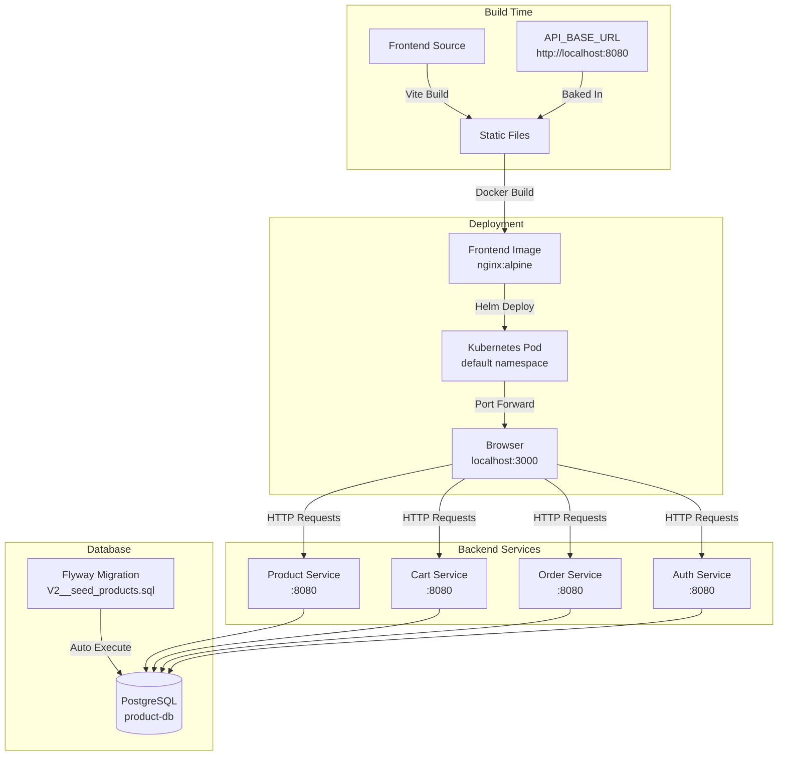
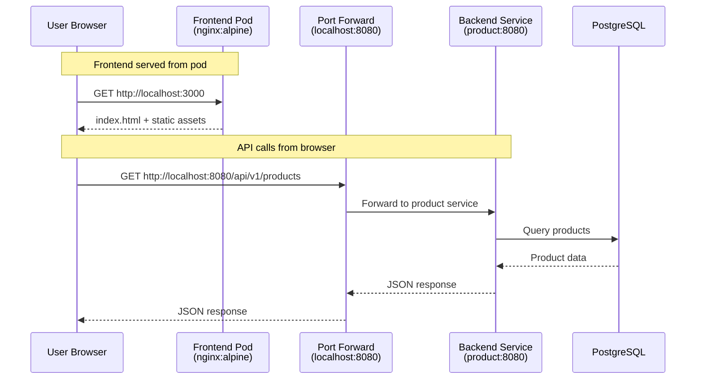
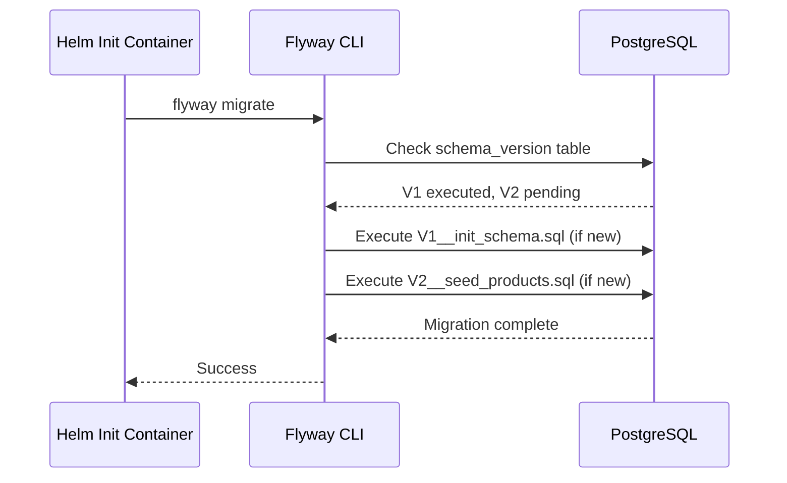

# Technical Plan: Frontend Integration Optimization & Production-Ready Deployment

**Task ID:** frontend-integration-optimization
**Created:** 2026-01-08
**Status:** Ready for Implementation
**Based on:** spec.md

---

## 1. System Architecture

### Overview

This plan optimizes the frontend for production deployment by removing mock data, enabling automatic seed data loading, optimizing CI/CD, and standardizing deployment. The frontend integrates with existing 3-layer backend microservices via HTTP APIs.



### Architecture Decisions

| Decision | Choice | Rationale |
|----------|--------|-----------|
| **API URL Configuration** | Build-time (baked into static files) | Frontend is static files, no runtime config needed. Simpler, immutable builds. |
| **Mock Data Removal** | Complete removal (no conditional logic) | Production-ready, single code path, no confusion about data sources |
| **Seed Data Execution** | Flyway migration (V2__seed_products.sql) | Automatic, idempotent, follows existing migration pattern |
| **CI/CD Optimization** | Remove redundant build job | Docker build already validates, saves 2-3 minutes per build |
| **Deployment Method** | Helm chart (same as microservices) | Consistency, maintainability, standardized operations |
| **Service Type** | ClusterIP + port-forward | Kind/local testing compatible, no LoadBalancer needed |
| **Namespace** | `default` | Simple, consistent with local testing setup |
| **Health Check** | Existing `/health` endpoint in nginx.conf | No changes needed, already configured |

### Frontend-Backend Integration Architecture

**Critical Understanding: Frontend Runs in Browser, Not in Pod**



**Key Points:**
1. **Frontend pod** serves static files via nginx (port 80)
2. **Browser** loads frontend from `localhost:3000` (port-forwarded)
3. **Browser** makes API calls to `localhost:8080` (backend port-forwarded)
4. **`localhost` in browser** = user's machine, NOT pod's localhost
5. **Port-forward** bridges browser → Kubernetes services

**Why `localhost:8080` Works:**
- Frontend code runs in **browser JavaScript** (not in pod)
- Browser's `localhost` refers to **user's machine**
- Backend services port-forwarded to `localhost:8080` on user's machine
- Frontend API calls from browser → `localhost:8080` → port-forward → backend service ✅

**For Production (Real K8s):**
- Would use service DNS: `http://product.default.svc.cluster.local:8080`
- But for Kind/local testing: `localhost:8080` is correct ✅

---

## 2. Technology Stack

| Layer | Technology | Version | Rationale |
|-------|------------|---------|-----------|
| **Frontend Framework** | React | 18.2.0 | Existing, no changes |
| **Build Tool** | Vite | 5.0.0 | Fast builds, build-time env vars |
| **HTTP Client** | Axios | 1.6.0 | Existing, JWT interceptor already configured |
| **Container Runtime** | Docker | Multi-stage | Node 24 builder → nginx:alpine production |
| **Web Server** | nginx | alpine | Lightweight, serves static files |
| **Orchestration** | Kubernetes | Kind (local) | Existing cluster |
| **Package Manager** | Helm | 3.x | Standardized deployment |
| **CI/CD** | GitHub Actions | Latest | Existing workflow, optimization needed |
| **Database Migration** | Flyway | 11.8.2 | Existing, automatic seed data execution |
| **Database** | PostgreSQL | Via operators | Existing, no changes |

### Dependencies

**Frontend (no changes):**
```json
{
  "react": "^18.2.0",
  "react-dom": "^18.2.0",
  "react-router-dom": "^6.20.0",
  "axios": "^1.6.0",
  "vite": "^5.0.0"
}
```

**Build Tools (no changes):**
- Node.js 24.x
- npm 10.x

**Deployment:**
- Docker (multi-stage build)
- Helm 3.x
- Kubernetes (Kind for local testing)

---

## 3. Component Design

### Component 1: Frontend API Configuration

**Purpose:** Remove mock data logic and enforce real API usage

**Responsibilities:**
- Remove `USE_MOCK` flag and auto-detection logic
- Make `VITE_API_BASE_URL` required (throw error if missing)
- Simplify `getApiBaseUrl()` to always return real API URL
- Remove all mock data imports and conditional logic

**Current Structure:**
```
frontend/src/api/
├── config.js          # USE_MOCK logic, getApiBaseUrl()
├── client.js          # Axios instance (no changes)
├── mockData.js        # DELETE THIS FILE
├── productApi.js      # Remove USE_MOCK conditionals
├── cartApi.js         # Remove empty mock responses
├── orderApi.js        # No changes (no mock)
└── authApi.js         # No changes (no mock)
```

**Target Structure:**
```
frontend/src/api/
├── config.js          # Simplified: only getApiBaseUrl(), no USE_MOCK
├── client.js          # No changes
├── productApi.js      # Direct API calls, no conditionals
├── cartApi.js         # Direct API calls, no conditionals
├── orderApi.js        # No changes
└── authApi.js         # No changes
```

**Interfaces:**
```typescript
// config.js (simplified)
export const getApiBaseUrl = (): string => {
  const apiBaseUrl = import.meta.env.VITE_API_BASE_URL;
  if (!apiBaseUrl) {
    throw new Error('VITE_API_BASE_URL is required for production build');
  }
  return `${apiBaseUrl.replace(/\/$/, '')}/api/v1`;
};

// productApi.js (simplified)
export async function getProducts() {
  const response = await apiClient.get('/products');
  return response.data;
}
```

**Dependencies:** 
- `client.js` (axios instance)
- Build-time env: `VITE_API_BASE_URL`

---

### Component 2: Seed Data Migration

**Purpose:** Enable automatic seed data loading via Flyway

**Responsibilities:**
- Rename seed file to match Flyway pattern
- Ensure idempotent execution
- Verify seed data loads correctly

**Current Structure:**
```
services/migrations/product/sql/
├── V1__init_schema.sql    # Schema creation (executed)
└── seed_products.sql      # Seed data (NOT executed - wrong pattern)
```

**Target Structure:**
```
services/migrations/product/sql/
├── V1__init_schema.sql    # Schema creation (executed first)
└── V2__seed_products.sql  # Seed data (executed second, automatically)
```

**Migration Execution Flow:**


**Dependencies:**
- Flyway 11.8.2 (in migration Docker image)
- PostgreSQL database (product-db)
- Helm init container configuration

---

### Component 3: GitHub Actions Workflow

**Purpose:** Optimize CI/CD pipeline by removing redundant build job

**Responsibilities:**
- Remove standalone `build` job
- Make `docker` job depend on `lint` directly
- Ensure build validation still happens (in Docker build)

**Current Workflow:**
```yaml
jobs:
  lint:     # Runs ESLint
  build:    # Runs npm run build (REDUNDANT)
  docker:   # Runs Docker build (also runs npm run build)
```

**Target Workflow:**
```yaml
jobs:
  lint:     # Runs ESLint
  docker:   # Runs Docker build (includes npm run build + validation)
```

**Dependencies:**
- GitHub Actions
- Docker buildx
- Container registry (ghcr.io)

---

### Component 4: Helm Deployment Configuration

**Purpose:** Standardize frontend deployment using Helm

**Responsibilities:**
- Create `charts/mop/values/frontend.yaml`
- Configure for static file serving (nginx)
- Set minimal resources (1 replica, low CPU/memory)
- Configure health checks using existing `/health` endpoint

**Structure:**
```yaml
# charts/mop/values/frontend.yaml
name: frontend
replicaCount: 1
image:
  repository: ghcr.io/duynhne/frontend
  tag: v6
service:
  type: ClusterIP
  port: 80
containerPort: 80
livenessProbe:
  httpGet:
    path: /health
    port: 80
readinessProbe:
  httpGet:
    path: /health
    port: 80
resources:
  requests:
    memory: "32Mi"
    cpu: "25m"
migrations:
  enabled: false
```

**Dependencies:**
- Helm chart `charts/mop` (existing)
- Kubernetes cluster
- Frontend Docker image

---

### Component 5: Documentation

**Purpose:** Document API integration and deployment procedures

**Responsibilities:**
- Add API endpoint mapping table to `frontend/README.md`
- Document localhost:8080 explanation
- Document port-forward procedure
- Update deployment instructions

**Dependencies:**
- Research document (has mapping table)
- Existing README structure

---

## 4. Data Model

### Seed Data Structure

**Entity: Product**

```sql
-- V2__seed_products.sql
INSERT INTO products (name, description, price, category_id, stock_quantity) VALUES
    ('Wireless Mouse', 'Ergonomic wireless mouse with long battery life', 29.99, 1, 50),
    ('Mechanical Keyboard', 'RGB mechanical gaming keyboard with Cherry MX switches', 79.99, 4, 30),
    ('USB-C Hub', '7-in-1 USB-C hub with HDMI, USB 3.0, and SD card readers', 39.99, 2, 25),
    ('Laptop Stand', 'Adjustable aluminum laptop stand for better ergonomics', 44.99, 3, 40),
    ('Webcam HD', '1080p HD webcam with built-in microphone', 59.99, 1, 20),
    ('Monitor 24"', '24-inch Full HD IPS monitor with ultra-thin bezels', 149.99, 1, 15),
    ('Gaming Headset', 'Surround sound gaming headset with noise cancellation', 89.99, 3, 35),
    ('External SSD 1TB', 'Portable 1TB SSD with USB 3.1 Gen 2 interface', 99.99, 2, 18)
ON CONFLICT (name) DO NOTHING;
```

**Categories Reference:**
- 1: Electronics
- 2: Computers
- 3: Accessories
- 4: Peripherals

**Expected Results:**
- `product_count`: 8
- `total_stock`: 233

### Flyway Schema Version Tracking

Flyway maintains `schema_version` table to track executed migrations:

```sql
CREATE TABLE schema_version (
    installed_rank INTEGER,
    version VARCHAR(50),
    description VARCHAR(200),
    type VARCHAR(20),
    script VARCHAR(1000),
    checksum INTEGER,
    installed_by VARCHAR(100),
    installed_on TIMESTAMP,
    execution_time INTEGER,
    success BOOLEAN
);
```

**Behavior:**
- V1 executed → recorded in `schema_version`
- V2 new → Flyway executes it → recorded in `schema_version`
- Pod restart → Flyway checks `schema_version` → V2 already executed → skips it ✅

---

## 5. API Contracts

### Existing API Endpoints (No Changes)

All 13 endpoints are already implemented and working. This plan only removes mock data and documents the integration.

**Product Service:**
- `GET /api/v1/products` - List all products
- `GET /api/v1/products/:id` - Get single product
- `GET /api/v1/products/:id/details` ⭐ - Aggregated product details

**Cart Service:**
- `GET /api/v1/cart` - Get full cart
- `GET /api/v1/cart/count` ⭐ - Get cart item count
- `POST /api/v1/cart` - Add item to cart
- `PATCH /api/v1/cart/items/:itemId` ⭐ - Update cart item
- `DELETE /api/v1/cart/items/:itemId` ⭐ - Remove cart item

**Order Service:**
- `GET /api/v1/orders` - List user orders
- `GET /api/v1/orders/:id` - Get order by ID
- `POST /api/v1/orders` - Create new order

**Auth Service:**
- `POST /api/v1/auth/login` - User login
- `POST /api/v1/auth/register` - User registration

**Legend:** ⭐ = Phase 1 aggregation endpoints

### Request/Response Examples

**GET /api/v1/products**

Request: None (query params optional: `?category=Electronics&sort=price`)

Response:
```json
[
  {
    "id": "1",
    "name": "Wireless Mouse",
    "description": "Ergonomic wireless mouse with long battery life",
    "price": 29.99,
    "category": "Electronics"
  }
]
```

**POST /api/v1/auth/login**

Request:
```json
{
  "email": "user@example.com",
  "password": "password123"
}
```

Response:
```json
{
  "token": "eyJhbGciOiJIUzI1NiIs...",
  "user": {
    "id": "user456",
    "email": "user@example.com",
    "name": "John Doe"
  }
}
```

---

## 6. Security Considerations

### Authentication
- JWT tokens stored in `localStorage` (existing pattern)
- Axios interceptor automatically adds `Authorization: Bearer ${token}` header
- 401 responses trigger automatic redirect to `/login`

### Authorization
- Backend services handle authorization (no frontend changes)
- Frontend only displays data based on API responses

### Data Protection
- **Build-time configuration**: API URL baked into static files (no runtime secrets)
- **No secrets in frontend**: All sensitive data handled by backend
- **HTTPS in production**: Frontend served over HTTPS (nginx config supports)

### Security Checklist
- [x] Input validation handled by backend (frontend only displays)
- [x] Authentication tokens managed securely (localStorage + auto-inject)
- [x] No secrets in frontend code (API URL is public endpoint)
- [x] HTTPS ready (nginx config supports SSL)
- [x] CORS handled by backend (frontend makes requests from browser)

### Build Security
- **Required API URL**: Build fails if `VITE_API_BASE_URL` not set (prevents accidental mock mode)
- **No mock data**: Removes potential confusion about data sources
- **Immutable builds**: API URL baked in, cannot be changed at runtime

---

## 7. Performance Strategy

### Optimization Targets
- **Build time**: Reduce by ≥ 2 minutes (remove redundant job)
- **Bundle size**: Remove mock data code (~few KB reduction)
- **Deployment time**: Standardized Helm deployment (consistent with other services)

### Caching Strategy
- **Docker layer caching**: GitHub Actions uses `cache-from: type=gha`
- **npm cache**: GitHub Actions caches `node_modules` between builds
- **Static file caching**: nginx serves static files with 1-year cache headers

### Scaling Approach
- **Frontend**: Single replica sufficient (static files, no computation)
- **Backend**: Existing scaling (not in scope)
- **Database**: Existing scaling (not in scope)

### Performance Metrics
- Build time: < 5 minutes (down from ~7 minutes)
- Bundle size: Slight reduction (mock data removed)
- Deployment: Consistent with microservices (< 1 minute)

---

## 8. Implementation Phases

### Phase 1: Remove Mock Data (FR-1)
**Duration:** 1-2 hours
**Dependencies:** None

**Tasks:**
- [ ] Delete `frontend/src/api/mockData.js`
- [ ] Remove `USE_MOCK` logic from `frontend/src/api/config.js`
- [ ] Remove mock imports from `frontend/src/api/productApi.js`
- [ ] Remove `USE_MOCK` conditionals from `frontend/src/api/productApi.js` (3 functions)
- [ ] Remove `USE_MOCK` conditionals from `frontend/src/api/cartApi.js` (5 functions)
- [ ] Update `getApiBaseUrl()` to throw error if `VITE_API_BASE_URL` missing
- [ ] Remove all console.log statements referencing mock mode
- [ ] Test: Build fails without `VITE_API_BASE_URL`
- [ ] Test: Build succeeds with `VITE_API_BASE_URL=http://localhost:8080`
- [ ] Test: Frontend makes real API calls (no mock path)

**Verification:**
- `grep -r "USE_MOCK\|mockData\|MOCK_" frontend/src` returns no results
- Build fails with clear error if `VITE_API_BASE_URL` not set
- Frontend calls real API endpoints

---

### Phase 2: Enable Seed Data (FR-2)
**Duration:** 30 minutes
**Dependencies:** None

**Tasks:**
- [ ] Rename `services/migrations/product/sql/seed_products.sql` → `V2__seed_products.sql`
- [ ] Verify file follows Flyway pattern: `V{version}__{description}.sql`
- [ ] Verify `ON CONFLICT DO NOTHING` is present (idempotent)
- [ ] Test: Deploy product service and verify seed data loads
- [ ] Verify: `SELECT COUNT(*) FROM products;` returns 8
- [ ] Verify: `SELECT SUM(stock_quantity) FROM products;` returns 233
- [ ] Test: Restart pod, verify seed data NOT re-run (Flyway skips)

**Verification:**
- Seed file renamed correctly
- Migration executes automatically on deployment
- Product count = 8, total stock = 233
- Pod restart does not re-run seed data

---

### Phase 3: Optimize GitHub Actions (FR-3)
**Duration:** 30 minutes
**Dependencies:** None

**Tasks:**
- [ ] Remove `build` job from `.github/workflows/build-frontend.yml`
- [ ] Update `docker` job: change `needs: build` → `needs: lint`
- [ ] Verify Docker build still validates output (`ls -la /app/dist` in Dockerfile)
- [ ] Test: Workflow runs successfully (lint → docker)
- [ ] Measure: Build time reduction (should be ≥ 2 minutes)
- [ ] Test: PR validation still works (Docker build runs, no push)

**Verification:**
- Workflow has 2 jobs: `lint` → `docker`
- Build time reduced by ≥ 2 minutes
- All functionality preserved (lint, build, Docker image)

---

### Phase 4: Create Helm Values (FR-4)
**Duration:** 1 hour
**Dependencies:** Frontend Docker image exists

**Tasks:**
- [ ] Create `charts/mop/values/frontend.yaml`
- [ ] Configure: `name: frontend`, `replicaCount: 1`
- [ ] Configure: `image.repository: ghcr.io/duynhne/frontend`, `tag: v6`
- [ ] Configure: `service.type: ClusterIP`, `port: 80`, `containerPort: 80`
- [ ] Configure: `livenessProbe` and `readinessProbe` for `/health` endpoint
- [ ] Configure: `resources` (32Mi memory, 25m CPU)
- [ ] Configure: `migrations.enabled: false`
- [ ] Test: `helm template frontend charts/mop -f charts/mop/values/frontend.yaml` renders correctly
- [ ] Test: `helm install frontend charts/mop -f charts/mop/values/frontend.yaml -n default`
- [ ] Verify: Pod starts, health checks pass
- [ ] Add port-forward to `scripts/08-setup-access.sh`: `kubectl port-forward -n default svc/frontend 3000:80`
- [ ] Test: Frontend accessible at `http://localhost:3000`

**Verification:**
- Helm values file created and follows pattern
- Frontend deploys successfully via Helm
- Port-forward works, frontend accessible
- Health checks pass

---

### Phase 5: Document API Mapping (FR-5)
**Duration:** 1-2 hours
**Dependencies:** None

**Tasks:**
- [ ] Read API mapping table from research document
- [ ] Add API endpoint mapping table to `frontend/README.md`
- [ ] Include columns: Frontend API, HTTP Method, Backend Service, Handler, Web Layer File, Logic Layer Call
- [ ] Document all 13 endpoints (Product: 3, Cart: 5, Order: 3, Auth: 2)
- [ ] Mark aggregation endpoints with ⭐ symbol
- [ ] Add request flow diagram (Frontend → Web → Logic → Core)
- [ ] Add localhost:8080 explanation section (as requested)
- [ ] Document port-forward procedure
- [ ] Update deployment instructions

**Documentation Section to Add:**

```markdown
## Frontend-Backend Integration

### API URL Configuration: localhost:8080 for Local/Kind Testing

**Important:** Frontend runs in the browser, not in the Kubernetes pod.

**How it works:**
1. **Frontend pod** serves static files via nginx (port 80)
2. **Browser** loads frontend from `localhost:3000` (port-forwarded from pod)
3. **Browser** makes API calls to `localhost:8080` (backend services port-forwarded)
4. **`localhost` in browser** = user's machine, NOT pod's localhost
5. **Port-forward** bridges browser → Kubernetes services

**Why `localhost:8080` works:**
- Frontend code runs in **browser JavaScript** (not in pod)
- Browser's `localhost` refers to **user's machine**
- Backend services port-forwarded to `localhost:8080` on user's machine
- Frontend API calls from browser → `localhost:8080` → port-forward → backend service ✅

**For Production (Real K8s):**
- Would use service DNS: `http://product.default.svc.cluster.local:8080`
- But for Kind/local testing: `localhost:8080` is correct ✅

**Setup:**
```bash
# Port-forward backend services (via scripts/08-setup-access.sh)
kubectl port-forward -n product svc/product 8080:8080

# Frontend build with localhost:8080
docker build --build-arg API_BASE_URL=http://localhost:8080 -t frontend .

# Frontend in browser calls: http://localhost:8080/api/v1/products
```

### API Endpoint Mapping

[Table with all 13 endpoints mapped to backend handlers]
```

**Verification:**
- API mapping table added to README
- All 13 endpoints documented
- localhost:8080 explanation included
- Port-forward procedure documented

---

## 9. Risk Assessment

| Risk | Impact | Likelihood | Mitigation |
|------|--------|------------|------------|
| **Build fails without API URL** | High | Low | Clear error message, Dockerfile validates early |
| **Seed data migration fails** | Medium | Low | Flyway error visible in pod logs, deployment blocked |
| **Frontend can't connect to backend** | High | Medium | Port-forward must be running, document in README |
| **GitHub Actions optimization breaks builds** | Medium | Low | Revert workflow file, Docker build still validates |
| **Helm values misconfiguration** | Medium | Low | Test with `helm template` before deployment |
| **Mock data removal breaks local dev** | Medium | Low | Document port-forward procedure, provide clear error messages |
| **Seed data conflicts with existing data** | Low | Low | `ON CONFLICT DO NOTHING` prevents duplicates |
| **Documentation becomes outdated** | Low | Medium | Documentation is reference, code is source of truth |

### Mitigation Strategies

1. **Build Validation**: Dockerfile validates `API_BASE_URL` early, fails fast
2. **Migration Safety**: Flyway tracks executed migrations, idempotent seed data
3. **Deployment Testing**: Use `helm template` to validate before deployment
4. **Clear Documentation**: Document port-forward procedure, localhost explanation
5. **Rollback Plan**: Helm rollback available, workflow file can be reverted

---

## 10. Open Questions

All open questions from specification have been resolved:
- ✅ API URL: `http://localhost:8080` for local/Kind testing
- ✅ Namespace: `default`
- ✅ Service type: `ClusterIP` + port-forward
- ✅ Health check: Existing `/health` endpoint
- ✅ Development workflow: Port-forward procedure documented
- ✅ Seed data timing: Runs once per database (Flyway tracks)

---

## 11. Success Criteria

### Definition of Done

- [ ] All 5 functional requirements implemented (FR-1 through FR-5)
- [ ] Mock data completely removed (0 references in codebase)
- [ ] Seed data automatically loads on deployment (verified)
- [ ] GitHub Actions build time reduced by ≥ 2 minutes
- [ ] Helm values file created and tested
- [ ] Frontend deployable via Helm: `helm install frontend charts/mop -f charts/mop/values/frontend.yaml -n default`
- [ ] Port-forward added to `scripts/08-setup-access.sh`
- [ ] API endpoint mapping table added to `frontend/README.md`
- [ ] localhost:8080 explanation documented in README
- [ ] All edge cases handled (error messages clear)
- [ ] Performance targets achieved (build time, deployment consistency)

### Verification Commands

```bash
# Verify mock data removed
grep -r "USE_MOCK\|mockData\|MOCK_" frontend/src
# Expected: No results

# Verify seed data loaded
kubectl exec -n product -it <product-pod> -- psql -U product -d product -c "SELECT COUNT(*) FROM products;"
# Expected: 8

# Verify Helm deployment
helm template frontend charts/mop -f charts/mop/values/frontend.yaml
# Expected: Valid Kubernetes manifests

# Verify port-forward
kubectl port-forward -n default svc/frontend 3000:80
curl http://localhost:3000/health
# Expected: "healthy"
```

---

## 12. Next Steps

1. ✅ Review technical plan
2. Run `/tasks frontend-integration-optimization` to generate detailed implementation tasks
3. Begin implementation starting with Phase 1 (mock data removal)
4. Test each phase before proceeding to next
5. Update documentation as implementation progresses

---

*Plan created with SDD 2.0*
