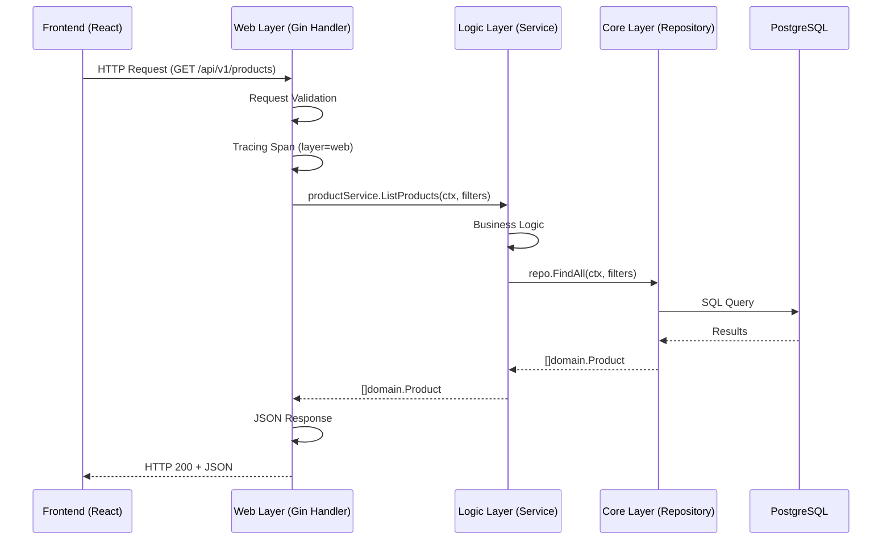

# Research: Frontend Integration Optimization & Helm Deployment

**Task ID:** frontend-integration-optimization
**Date:** 2026-01-08
**Status:** Complete (Updated with Mock Data Removal Research)

---

## Executive Summary

This research investigates the newly integrated React frontend with the 3-layer backend architecture, analyzes mock data implementation for local testing, evaluates GitHub Actions workflow optimization opportunities, and designs Helm chart deployment configuration for frontend service.

**Key Findings:**
- Frontend uses build-time API URL configuration with automatic mock mode fallback
- Mock data implementation follows exact API contract structure
- GitHub Actions workflow has redundant build steps that can be optimized
- Helm chart structure exists for microservices but needs frontend-specific values
- 13 API endpoints mapped across 4 services (Product, Cart, Order, Auth)

**Primary Recommendation:**
1. Optimize GitHub Actions by removing redundant `build` job (Docker build already runs `npm run build`)
2. Create `charts/mop/values/frontend.yaml` following existing microservice pattern
3. Create API endpoint mapping table documenting frontend → backend web layer connections
4. Frontend deployment should use 1 replica (static files, no need for scaling)

---

## Codebase Analysis

### Existing Patterns

#### 1. Frontend API Integration Pattern

**Location:** `frontend/src/api/config.js`, `frontend/src/api/client.js`

**How it works:**
- Build-time configuration via `VITE_API_BASE_URL` environment variable
- Automatic mock mode detection: `USE_MOCK = true` if no API URL provided
- Axios interceptor for JWT token injection and 401 auto-redirect
- API prefix `/api/v1` is application constant

**Code example:**
```javascript
// config.js
export const USE_MOCK = useMockFlag === 'true' || (!useMockFlag && !apiBaseUrl);
export const getApiBaseUrl = () => {
    if (USE_MOCK) {
        return 'MOCK_MODE';
    }
    return `${apiBaseUrl.replace(/\/$/, '')}${API_PREFIX}`;
};

// client.js
apiClient.interceptors.request.use((config) => {
    const token = localStorage.getItem('authToken');
    if (token) {
        config.headers.Authorization = `Bearer ${token}`;
    }
    return config;
});
```

**Reusability:** Pattern is well-established and follows Vite best practices for build-time configuration.

#### 2. Mock Data Implementation Pattern

**Location:** `frontend/src/api/mockData.js`, `frontend/src/api/*Api.js`

**How it works:**
- Mock data follows exact API contract structure from `API_REFERENCE.md`
- Each API function checks `USE_MOCK` flag before making HTTP request
- Mock responses match real API response format exactly
- Console logging indicates mock mode usage

**Code example:**
```javascript
// productApi.js
export async function getProducts() {
    if (USE_MOCK) {
        console.log('🎭 Mock mode: Returning mock products');
        return Promise.resolve(MOCK_PRODUCTS);
    }
    const response = await apiClient.get('/products');
    return response.data;
}

// mockData.js
export const MOCK_PRODUCTS = [
    {
        id: '1',
        name: 'Wireless Mouse',
        description: 'Ergonomic wireless mouse...',
        price: 29.99,
        category: 'Electronics'
    },
    // ... follows exact API contract
];
```

**Reusability:** Pattern is consistent across all API modules (productApi, cartApi, orderApi, authApi).

#### 3. Backend 3-Layer Architecture Pattern

**Location:** `services/*/internal/web/v1/handler.go`, `services/*/internal/logic/v1/`, `services/*/internal/core/`

**How it works:**
- **Web Layer** (`web/v1/`): HTTP handlers, request validation, response formatting
- **Logic Layer** (`logic/v1/`): Business logic, orchestration, service calls
- **Core Layer** (`core/`): Domain models, database repositories

**Code example:**
```go
// web/v1/handler.go
func ListProducts(c *gin.Context) {
    ctx, span := middleware.StartSpan(...)
    // Request validation
    products, err := productService.ListProducts(ctx, filters)  // Calls logic layer
    c.JSON(http.StatusOK, products)
}

// logic/v1/service.go
func (s *ProductService) ListProducts(ctx context.Context, filters domain.ProductFilters) ([]domain.Product, error) {
    // Business logic
    return s.repo.FindAll(ctx, filters)  // Calls core layer
}
```

**Reusability:** All 9 microservices follow this exact pattern. Frontend integrates at Web Layer via HTTP.

#### 4. Helm Chart Pattern for Microservices

**Location:** `charts/mop/values/*.yaml`, `charts/mop/templates/deployment.yaml`

**How it works:**
- Generic Helm chart (`charts/mop/`) for all microservices
- Service-specific values in `charts/mop/values/{service}.yaml`
- Deployment template uses `replicaCount`, `image.repository`, `env` variables
- Supports init containers for database migrations

**Code example:**
```yaml
# charts/mop/values/product.yaml
name: product
replicaCount: 2
image:
  repository: ghcr.io/duynhne/product
  tag: v6
env:
  - name: SERVICE_NAME
    value: "product"
  - name: PORT
    value: "8080"
```

**Reusability:** Frontend can use same chart structure but with different configuration (static files, nginx, no database).

### Reusable Components

1. **API Client Pattern** (`frontend/src/api/client.js`): Axios instance with interceptors - reusable for all API calls
2. **Mock Data Structure** (`frontend/src/api/mockData.js`): Follows API contract - can be extended for new endpoints
3. **Helm Chart Template** (`charts/mop/templates/`): Generic deployment template - can be used for frontend with modifications

### Conventions to Follow

1. **Build-time Configuration**: Frontend uses Vite env vars baked into build (not runtime)
2. **Mock Mode**: Auto-detection based on `VITE_API_BASE_URL` presence
3. **API Versioning**: All endpoints use `/api/v1` prefix
4. **Error Handling**: Axios interceptor handles 401 redirects automatically
5. **Helm Values**: Service-specific values in `charts/mop/values/{service}.yaml`

---

## External Solutions

### Option 1: Keep Current GitHub Actions Structure (Status Quo)

**Overview:** Current workflow has 3 jobs: `lint` → `build` → `docker`

**Pros:**
- Clear separation of concerns
- Build verification before Docker build
- Easy to debug individual steps

**Cons:**
- **Redundant**: Docker build already runs `npm run build` internally
- **Slower**: Extra job adds ~2-3 minutes
- **Duplicate dependencies**: npm install runs twice (build job + docker build)

**Implementation complexity:** Low (no changes needed)
**Team familiarity:** High (current structure)

### Option 2: Optimized GitHub Actions (Remove Redundant Build Job)

**Overview:** Combine lint + docker jobs, remove standalone build job

**Pros:**
- **Faster**: Eliminates redundant npm install and build steps
- **Simpler**: Fewer jobs to maintain
- **Docker build already validates**: Dockerfile runs `npm run build` anyway

**Cons:**
- Less granular failure reporting (can't see build errors separately from Docker)
- Slightly harder to debug (build errors appear in Docker job)

**Implementation complexity:** Low (remove build job, adjust dependencies)
**Team familiarity:** Medium (slight change from current)

### Option 3: Multi-Stage Optimization with Caching

**Overview:** Use Docker layer caching more aggressively, share npm cache between jobs

**Pros:**
- Fastest build times
- Better cache utilization

**Cons:**
- More complex workflow
- Requires careful cache key management

**Implementation complexity:** Medium
**Team familiarity:** Low (new pattern)

---

## Comparison Matrix

| Criteria | Option 1 (Status Quo) | Option 2 (Optimized) | Option 3 (Advanced Caching) |
|----------|----------------------|---------------------|----------------------------|
| Build Speed | ⭐⭐ | ⭐⭐⭐ | ⭐⭐⭐ |
| Simplicity | ⭐⭐⭐ | ⭐⭐⭐ | ⭐ |
| Debuggability | ⭐⭐⭐ | ⭐⭐ | ⭐⭐ |
| Maintenance | ⭐⭐⭐ | ⭐⭐⭐ | ⭐ |
| Team Fit | ⭐⭐⭐ | ⭐⭐⭐ | ⭐⭐ |

---

## Frontend API Endpoint Mapping

### API Endpoint → Backend Web Layer Mapping Table

| Frontend API | HTTP Method | Backend Service | Backend Handler | Web Layer File | Logic Layer Call |
|-------------|-------------|-----------------|-----------------|----------------|-------------------|
| `/api/v1/products` | GET | product | `ListProducts` | `services/product/internal/web/v1/handler.go:24` | `productService.ListProducts()` |
| `/api/v1/products/:id` | GET | product | `GetProduct` | `services/product/internal/web/v1/handler.go:54` | `productService.GetProduct()` |
| `/api/v1/products/:id/details` ⭐ | GET | product | `GetProductDetails` | `services/product/internal/web/v1/handler.go:125` | `productService.GetProduct()` + aggregation |
| `/api/v1/cart` | GET | cart | `GetCart` | `services/cart/internal/web/v1/handler.go:26` | `cartService.GetCart()` |
| `/api/v1/cart/count` ⭐ | GET | cart | `GetCartCount` | `services/cart/internal/web/v1/handler.go:98` | `cartService.GetCartCount()` |
| `/api/v1/cart` | POST | cart | `AddToCart` | `services/cart/internal/web/v1/handler.go:60` | `cartService.AddToCart()` |
| `/api/v1/cart/items/:itemId` ⭐ | PATCH | cart | `UpdateCartItem` | `services/cart/internal/web/v1/handler.go:124` | `cartService.UpdateItemQuantity()` |
| `/api/v1/cart/items/:itemId` ⭐ | DELETE | cart | `RemoveCartItem` | `services/cart/internal/web/v1/handler.go:162` | `cartService.RemoveItem()` |
| `/api/v1/orders` | GET | order | `ListOrders` | `services/order/internal/web/v1/handler.go:26` | `orderService.ListOrders()` |
| `/api/v1/orders/:id` | GET | order | `GetOrder` | `services/order/internal/web/v1/handler.go:54` | `orderService.GetOrder()` |
| `/api/v1/orders` | POST | order | `CreateOrder` | `services/order/internal/web/v1/handler.go:84` | `orderService.CreateOrder()` |
| `/api/v1/auth/login` | POST | auth | `Login` | `services/auth/internal/web/v1/handler.go:19` | `authService.Login()` |
| `/api/v1/auth/register` | POST | auth | `Register` | `services/auth/internal/web/v1/handler.go:81` | `authService.Register()` |

**Legend:**
- ⭐ = Phase 1 aggregation endpoints (optimized for frontend)
- All endpoints follow 3-layer pattern: Web → Logic → Core

### Request Flow Diagram



---

## Helm Chart Configuration for Frontend

### Frontend-Specific Requirements

**Differences from microservices:**
1. **Static files**: Serves pre-built static files (no Go binary)
2. **Nginx container**: Uses nginx:alpine (not Go service)
3. **No database**: No migrations, no DB connection
4. **Single replica**: Static files don't need scaling (1 pod sufficient)
5. **Port 80**: Nginx serves on port 80 (not 8080)
6. **Health check**: `/health` endpoint (nginx config)

### Proposed Helm Values Structure

**File:** `charts/mop/values/frontend.yaml`

```yaml
name: frontend

# Frontend uses 1 replica (static files, no need for scaling)
replicaCount: 1

image:
  repository: ghcr.io/duynhne/frontend
  tag: v6
  pullPolicy: IfNotPresent

service:
  type: ClusterIP
  port: 80
  targetPort: 80
  portName: http

containerPort: 80

# No database configuration needed
# No migrations needed

# Minimal resources (static files)
resources:
  requests:
    memory: "32Mi"
    cpu: "25m"
  limits:
    memory: "64Mi"
    cpu: "50m"

# Health check via nginx /health endpoint
livenessProbe:
  enabled: true
  httpGet:
    path: /health
    port: 80
  initialDelaySeconds: 10
  periodSeconds: 10

readinessProbe:
  enabled: true
  httpGet:
    path: /health
    port: 80
  initialDelaySeconds: 5
  periodSeconds: 5

# No environment variables needed (API URL baked into build)
env: []

# No migrations
migrations:
  enabled: false
```

**Note:** The existing `charts/mop/templates/deployment.yaml` should work with these values since it's generic. Only values file needs to be created.

---

## GitHub Actions Workflow Analysis

### Current Workflow Structure

**File:** `.github/workflows/build-frontend.yml`

**Jobs:**
1. `lint` - Runs ESLint (required, keep)
2. `build` - Runs `npm run build` (redundant - Docker does this)
3. `docker` - Builds Docker image (runs `npm run build` internally)

### Redundancy Analysis

**Problem:** The `build` job (lines 44-77) is redundant because:
1. Docker build stage already runs `npm ci` and `npm run build` (see `frontend/Dockerfile:21-28`)
2. Build verification (`ls -lah dist/`) can be done in Docker build
3. Duplicate dependency installation adds ~2-3 minutes

**Evidence:**
```dockerfile
# Dockerfile already does:
RUN npm ci --only=production=false
RUN npm run build
RUN ls -la /app/dist
```

### Optimization Recommendation

**Option 2 (Optimized)** is recommended:

**Changes:**
1. Remove `build` job entirely
2. Make `docker` job depend on `lint` instead of `build`
3. Add build verification step in `docker` job (after Docker build, verify image contains dist/)

**Benefits:**
- **Faster**: Eliminates ~2-3 minutes of redundant work
- **Simpler**: One less job to maintain
- **Same validation**: Docker build already validates build succeeds

**Risks:**
- Low: Docker build failure will still be caught
- Build errors appear in Docker job logs (slightly less granular)

---

## Mock Data Removal & Seed Data Integration

### Current State Analysis

#### Mock Data Usage

**Location:** `frontend/src/api/mockData.js`, `frontend/src/api/productApi.js`

**Current Implementation:**
- Mock data exists only for **Product API** (not Cart, Order, Auth)
- Mock data matches seed data exactly (8 products, same names/prices/descriptions)
- Mock mode auto-detected when `VITE_API_BASE_URL` is not set
- Used in 3 functions: `getProducts()`, `getProduct(id)`, `getProductDetails(id)`

**Code example:**
```javascript
// productApi.js
import { MOCK_PRODUCTS, getMockProductDetails } from './mockData';

export async function getProducts() {
    if (USE_MOCK) {
        return Promise.resolve(MOCK_PRODUCTS);
    }
    const response = await apiClient.get('/products');
    return response.data;
}
```

**Files using mock data:**
- `frontend/src/api/productApi.js` - imports `MOCK_PRODUCTS`, `getMockProductDetails`
- `frontend/src/api/config.js` - defines `USE_MOCK` flag
- `frontend/src/api/mockData.js` - contains mock data definitions

**Files NOT using mock data:**
- `frontend/src/api/cartApi.js` - has mock mode but no mockData import (returns empty cart)
- `frontend/src/api/orderApi.js` - no mock mode at all
- `frontend/src/api/authApi.js` - no mock mode at all

#### Seed Data Structure

**Location:** `services/migrations/product/sql/seed_products.sql`

**Current Implementation:**
- Seed data file exists but **NOT automatically executed** by Flyway
- Flyway only runs files matching pattern: `V*__*.sql` (e.g., `V1__init_schema.sql`)
- `seed_products.sql` does NOT match this pattern, so it's ignored
- Seed data contains 8 products matching mock data exactly

**Code example:**
```sql
-- seed_products.sql (NOT automatically run)
INSERT INTO products (name, description, price, category_id, stock_quantity) VALUES
    ('Wireless Mouse', 'Ergonomic wireless mouse with long battery life', 29.99, 1, 50),
    ('Mechanical Keyboard', 'RGB mechanical gaming keyboard with Cherry MX switches', 79.99, 4, 30),
    -- ... 6 more products
ON CONFLICT (name) DO NOTHING;
```

**Migration Execution Pattern:**
- Helm init container runs: `flyway migrate`
- Flyway scans `FLYWAY_LOCATIONS` (set to `filesystem:$FLYWAY_HOME/sql`)
- Only executes files matching `V{version}__{description}.sql` pattern
- `seed_products.sql` is NOT executed automatically

### Options for Mock Data Removal

#### Option 1: Remove Mock Data + Rename Seed File (Recommended)

**Overview:** Remove all mock data code, rename seed file to be executed by Flyway

**Implementation:**
1. Delete `frontend/src/api/mockData.js`
2. Remove `USE_MOCK` logic from `frontend/src/api/productApi.js`
3. Remove `USE_MOCK` logic from `frontend/src/api/config.js`
4. Remove `USE_MOCK` logic from `frontend/src/api/cartApi.js` (empty mock responses)
5. Rename `services/migrations/product/sql/seed_products.sql` → `services/migrations/product/sql/V2__seed_products.sql`
6. Update Dockerfile to ensure seed file is included in migration image
7. Ensure `VITE_API_BASE_URL` is always set in production builds

**Pros:**
- ✅ **Clean codebase**: No mock data code in production
- ✅ **Automatic seed data**: Flyway runs seed data on deployment
- ✅ **Production-ready**: Frontend always uses real API
- ✅ **Single source of truth**: Seed data in database, not in frontend code
- ✅ **Matches user requirement**: "Loại bỏ sạch mock data" (completely remove mock data)

**Cons:**
- ❌ **No local testing without backend**: Developers need backend running
- ❌ **Requires backend for development**: Can't test frontend in isolation

**Implementation complexity:** Low
**Team familiarity:** High (standard Flyway pattern)

#### Option 2: Keep Mock Data for Development Only

**Overview:** Keep mock data but disable in production builds

**Implementation:**
1. Keep mock data code
2. Force `VITE_USE_MOCK=false` in production Docker builds
3. Keep `USE_MOCK` auto-detection for local development
4. Rename seed file to `V2__seed_products.sql` for production

**Pros:**
- ✅ **Developer-friendly**: Can test frontend without backend
- ✅ **Production uses real API**: Mock disabled in production

**Cons:**
- ❌ **Mock code in production bundle**: Unused code increases bundle size
- ❌ **Maintenance burden**: Two sources of truth (mock data + seed data)
- ❌ **Doesn't match requirement**: User wants to "loại bỏ sạch" (completely remove)

**Implementation complexity:** Low
**Team familiarity:** High

#### Option 3: Remove Mock Data + Manual Seed Execution

**Overview:** Remove mock data, keep seed file separate, run manually

**Implementation:**
1. Remove all mock data code
2. Keep `seed_products.sql` as separate file (not versioned)
3. Run seed data manually after migrations: `psql < seed_products.sql`
4. Document manual seed execution in deployment guide

**Pros:**
- ✅ **Clean codebase**: No mock data
- ✅ **Flexible**: Can choose when to seed data

**Cons:**
- ❌ **Manual step required**: Easy to forget in deployment
- ❌ **Not production-ready**: Requires manual intervention
- ❌ **Deployment complexity**: Extra step in deployment process

**Implementation complexity:** Medium (requires deployment script changes)
**Team familiarity:** Low (new pattern)

### Seed Data Execution Analysis

#### Current Flyway Pattern

**How Flyway Works:**
1. Scans `FLYWAY_LOCATIONS` directory for SQL files
2. Executes files matching pattern: `V{version}__{description}.sql`
3. Version numbers must be sequential (V1, V2, V3...)
4. Files NOT matching pattern are ignored

**Evidence:**
```dockerfile
# services/migrations/product/Dockerfile
COPY sql/ $FLYWAY_HOME/sql/
ENV FLYWAY_LOCATIONS="filesystem:$FLYWAY_HOME/sql"
```

```yaml
# charts/mop/templates/deployment.yaml
command:
  - /bin/sh
  - -c
  - |
    flyway migrate  # Only runs V*__*.sql files
```

**Current Files:**
- ✅ `V1__init_schema.sql` - Executed by Flyway
- ❌ `seed_products.sql` - NOT executed (doesn't match pattern)

#### Solution: Rename Seed File

**Required Change:**
```bash
# Rename to match Flyway pattern
services/migrations/product/sql/seed_products.sql
  → services/migrations/product/sql/V2__seed_products.sql
```

**Result:**
- Flyway will execute: `V1__init_schema.sql` (schema)
- Then execute: `V2__seed_products.sql` (seed data)
- Automatic execution on every deployment via init container

### Comparison Matrix

| Criteria | Option 1 (Remove + Auto Seed) | Option 2 (Keep for Dev) | Option 3 (Manual Seed) |
|----------|-------------------------------|------------------------|------------------------|
| Code Cleanliness | ⭐⭐⭐ | ⭐⭐ | ⭐⭐⭐ |
| Production Ready | ⭐⭐⭐ | ⭐⭐⭐ | ⭐⭐ |
| Developer Experience | ⭐ | ⭐⭐⭐ | ⭐⭐ |
| Deployment Simplicity | ⭐⭐⭐ | ⭐⭐⭐ | ⭐ |
| Matches Requirement | ⭐⭐⭐ | ⭐ | ⭐⭐⭐ |
| Maintenance | ⭐⭐⭐ | ⭐⭐ | ⭐⭐ |

### Seed Data Verification

**Current Seed Data Content:**
- 8 products matching mock data exactly
- Categories: Electronics (1), Computers (2), Accessories (3), Peripherals (4)
- Stock quantities included (50, 30, 25, 40, 20, 15, 35, 18)
- Uses `ON CONFLICT (name) DO NOTHING` for idempotency

**Verification Query:**
```sql
-- After migration, verify seed data loaded
SELECT 
    'Initial product catalog loaded' as status,
    COUNT(*) as product_count,
    SUM(stock_quantity) as total_stock
FROM products;
```

**Expected Result:**
- `product_count`: 8
- `total_stock`: 233

## Recommendations

### Primary Recommendation

1. **Optimize GitHub Actions**: Remove redundant `build` job, make `docker` depend on `lint`
2. **Create Helm Values**: Add `charts/mop/values/frontend.yaml` with 1 replica configuration
3. **Document API Mapping**: Add endpoint mapping table to `frontend/README.md`
4. **Remove Mock Data Completely** (Option 1):
   - Delete `frontend/src/api/mockData.js`
   - Remove `USE_MOCK` logic from all API files
   - Rename `seed_products.sql` → `V2__seed_products.sql`
   - Ensure `VITE_API_BASE_URL` is always set in production builds
   - Frontend will always use real API (production-ready)

### Alternative Approach

If team prefers granular build validation:
- Keep `build` job but make it optional (only run on PRs)
- Use `docker` job for actual image building
- Trade-off: Slightly slower but more debuggable

---

## API Gateway Architecture Research: Kong vs Direct Backend Calls

### Overview

Many large companies use a pattern where:
- **Nginx** serves frontend static files (in frontend pod)
- **Kong API Gateway** routes and manages all API requests from frontend to backend services

This research explores Kong API Gateway as a potential future enhancement for the current architecture.

### Current Architecture (Direct Backend Calls)

**Pattern:**
```
Browser → Frontend Pod (nginx) → Backend Services (direct)
```

**Flow:**
1. Frontend pod serves static files via nginx
2. Browser makes API calls directly to backend services (port-forwarded or service DNS)
3. Each backend service handles its own routing, CORS, authentication

**Pros:**
- ✅ Simple architecture (fewer components)
- ✅ Direct communication (lower latency)
- ✅ No single point of failure for API routing
- ✅ Microservices remain independent
- ✅ Easy to debug (direct service-to-service calls)

**Cons:**
- ❌ CORS configuration per service (not centralized)
- ❌ No centralized rate limiting
- ❌ No unified API management
- ❌ Browser must know multiple backend endpoints
- ❌ Difficult to add cross-cutting concerns (auth, logging, metrics)

### Kong API Gateway Architecture

**Pattern:**
```
Browser → Frontend Pod (nginx) → Kong API Gateway → Backend Services
```

**Flow:**
1. Frontend pod serves static files via nginx
2. Browser makes API calls to Kong Gateway (single entry point)
3. Kong routes requests to appropriate backend services
4. Kong handles CORS, rate limiting, authentication, load balancing

**Kong Features:**
- **Service Discovery**: Automatically discovers backend services in Kubernetes
- **Load Balancing**: Built-in load balancing between service instances
- **Rate Limiting**: Per-service or per-consumer rate limiting
- **Authentication**: JWT, OAuth, API keys, etc. (via plugins)
- **CORS**: Centralized CORS configuration
- **Request/Response Transformation**: Modify requests/responses on the fly
- **Analytics & Monitoring**: Built-in metrics and logging
- **Plugin Ecosystem**: 100+ plugins for extensibility

**Kong Architecture Components:**
1. **Kong Gateway**: Core API gateway (runs in Kubernetes)
2. **Kong Database**: PostgreSQL or Cassandra (stores configuration)
3. **Kong Admin API**: REST API for managing Kong configuration
4. **Kong Manager**: Web UI for managing Kong (optional)

### Comparison Matrix

| Aspect | Current (Direct Backend) | Kong API Gateway |
|--------|------------------------|------------------|
| **API Routing** | Browser → Backend services | Browser → Kong → Backend services |
| **CORS Config** | Per service | Centralized in Kong |
| **Rate Limiting** | Not available | Built-in Kong plugin |
| **Authentication** | JWT in each service | Centralized Kong plugin |
| **Load Balancing** | Kubernetes Service | Kong load balancer |
| **Service Discovery** | Kubernetes DNS | Kong service discovery |
| **Monitoring** | Prometheus per service | Kong metrics + service metrics |
| **Request Transformation** | Not available | Kong plugins |
| **API Versioning** | Manual routing | Kong route management |
| **Complexity** | Low | Medium-High |
| **Latency** | Lower (direct) | Slightly higher (extra hop) |
| **Single Point of Failure** | No | Yes (Kong gateway) |
| **Deployment** | Simple | Requires Kong deployment |
| **Maintenance** | Low | Medium (Kong config) |

### Kong Deployment in Kubernetes

**Helm Chart:**
```bash
# Kong official Helm chart
helm repo add kong https://charts.konghq.com
helm install kong kong/kong -n kong --create-namespace
```

**Configuration:**
- **Namespace**: `kong` (dedicated namespace)
- **Service Type**: `LoadBalancer` or `Ingress` (for external access)
- **Database**: PostgreSQL (can use existing PostgreSQL clusters)
- **Resources**: 2-4 replicas for high availability

**Service Routing Example:**
```yaml
# Kong service definition
apiVersion: configuration.konghq.com/v1
kind: KongService
metadata:
  name: product-service
spec:
  host: product.product.svc.cluster.local
  port: 8080
  protocol: http

# Kong route definition
apiVersion: configuration.konghq.com/v1
kind: KongRoute
metadata:
  name: product-api-route
spec:
  service: product-service
  paths:
    - /api/v1/products
    - /api/v2/catalog
```

### Kong Plugins for This Project

**Recommended Plugins:**
1. **CORS Plugin**: Centralized CORS configuration
2. **Rate Limiting Plugin**: Protect backend services from overload
3. **JWT Plugin**: Centralized JWT validation (optional, can keep in services)
4. **Request Logging Plugin**: Log all API requests
5. **Prometheus Plugin**: Expose Kong metrics to Prometheus
6. **Response Transformation Plugin**: Modify responses if needed

**Example Kong Plugin Configuration:**
```yaml
apiVersion: configuration.konghq.com/v1
kind: KongPlugin
metadata:
  name: cors-plugin
config:
  origins:
    - http://localhost:3000
    - https://app.example.com
  methods:
    - GET
    - POST
    - PATCH
    - DELETE
  headers:
    - Authorization
    - Content-Type
```

### Frontend Integration with Kong

**Current (Direct Backend):**
```javascript
// Frontend calls backend directly
const API_BASE_URL = 'http://localhost:8080';  // Port-forwarded backend
```

**With Kong:**
```javascript
// Frontend calls Kong Gateway
const API_BASE_URL = 'http://localhost:8000';  // Kong Gateway port-forwarded
// Kong routes /api/v1/products → product service
// Kong routes /api/v1/cart → cart service
```

**Benefits:**
- Single entry point for all API calls
- Centralized CORS configuration
- Rate limiting protection
- Unified monitoring

### Performance Considerations

**Latency Impact:**
- **Direct Backend**: ~5-10ms (browser → service)
- **Kong Gateway**: ~10-15ms (browser → Kong → service)
- **Overhead**: ~5ms additional latency (acceptable for most use cases)

**Throughput:**
- Kong can handle 10,000+ requests/second (depends on resources)
- Built on Nginx/OpenResty (high performance)
- Horizontal scaling via multiple Kong replicas

### When to Use Kong

**Use Kong when:**
- Multiple backend services
- Need centralized API management
- Want rate limiting and throttling
- Need request/response transformation
- Want unified monitoring and analytics
- Planning to add API versioning management
- Need to support multiple consumers/tenants

**Keep Direct Backend when:**
- Simple microservices architecture (few services)
- Low latency is critical
- Minimal cross-cutting concerns
- Team prefers simplicity
- Kind/local testing environment

### Migration Path (If Adopting Kong)

**Phase 1: Deploy Kong**
1. Deploy Kong Gateway to Kubernetes
2. Configure Kong services for each backend service
3. Set up Kong routes for all API endpoints
4. Test Kong routing (parallel to direct calls)

**Phase 2: Frontend Migration**
1. Update frontend `API_BASE_URL` to point to Kong
2. Test all API endpoints through Kong
3. Verify CORS, authentication, rate limiting

**Phase 3: Optimization**
1. Enable Kong plugins (CORS, rate limiting, etc.)
2. Configure Kong monitoring
3. Remove direct backend CORS configs (if centralized in Kong)

**Phase 4: Production**
1. Deploy Kong to production
2. Update frontend production builds
3. Monitor Kong performance and metrics

### Recommendation

**For Current Project (Kind/Local Testing):**
- **Keep current approach** (direct backend calls)
- Simple, fast, easy to debug
- No additional infrastructure needed
- Sufficient for development and testing

**For Future Production:**
- **Consider Kong API Gateway** as enhancement
- Provides centralized API management
- Better suited for production environments
- Follows industry best practices (used by many large companies)

**Implementation Priority:**
- **Current Task**: Implement direct backend approach (simpler, faster)
- **Future Enhancement**: Research and plan Kong integration separately

---

## Open Questions

1. **API URL for Production**: What will be the production API base URL? (needed for Docker build arg)
2. **Frontend Namespace**: Should frontend deploy to `default` namespace or create `frontend` namespace?
3. **Service Type**: Should frontend service be `ClusterIP` (internal) or `LoadBalancer`/`Ingress` (external)?
4. **Health Check Endpoint**: Does nginx.conf already have `/health` endpoint configured?
5. **Seed Data Timing**: Should seed data run on every deployment (idempotent) or only on first deployment?
6. **Development Workflow**: After removing mock data, how will developers test frontend locally? (Port-forward backend or local backend?)
7. **Kong API Gateway**: Should Kong be considered for future production deployment? (Research completed - see above)

---

## Next Steps

1. Review findings with team
2. Proceed to `/specify` to define requirements for:
   - GitHub Actions optimization
   - Helm values file creation
   - API mapping documentation
3. Address open questions before implementation
4. Create implementation plan with `/plan` command
5. **Future**: Consider Kong API Gateway for production deployment (separate task)

---

*Research completed with SDD 2.0*
*Updated: 2026-01-08 - Added Kong API Gateway research*