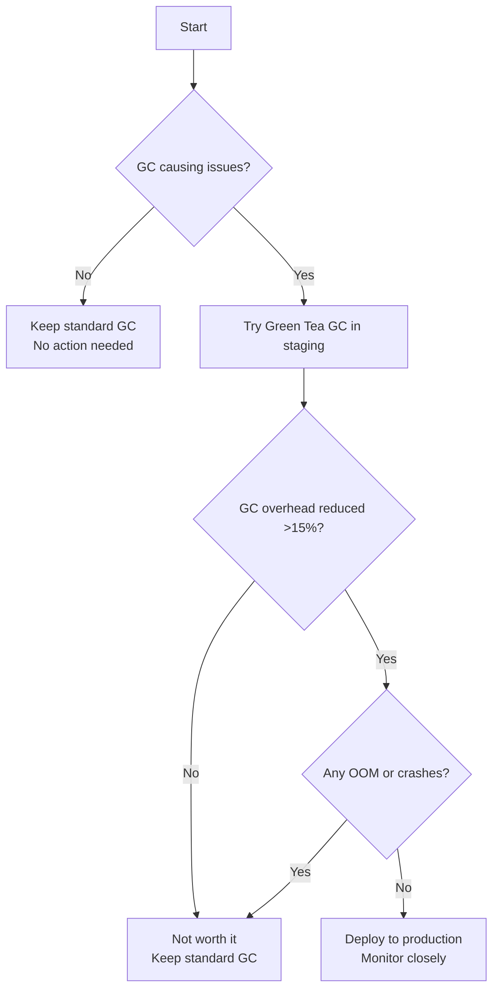

# Research: Go 1.25 Upgrade & Configuration Modernization

**Task ID:** `go125-config-modernization`  
**Research Date:** December 12, 2025  
**Researcher:** AI Assistant (for SRE/DevOps team)  
**Current State:** Go 1.23.0, Direct os.Getenv() usage, Helm env/extraEnv mixed patterns

---

## Executive Summary

This research provides a comprehensive upgrade path from Go 1.23 to Go 1.25, configuration management modernization strategy, Helm environment variable best practices, and documentation consolidation plan for the microservices monitoring platform.

### Key Recommendations

1. **Go 1.25 Upgrade**: ✅ **Safe to upgrade** - No breaking changes affecting current codebase
   - 🎯 **Priority Features**: `sync.WaitGroup.Go()`, improved GC (10-40% reduction), DWARF5 debug info
   - ⚠️ **Action Required**: Enhanced nil-pointer checks may expose existing bugs (good thing!)

2. **Configuration Management**: ✅ **Adopt structured config** pattern
   - **Recommended**: Simple config struct + validation (no external libraries)
   - **Alternative**: `godotenv` for development ONLY
   - **Not Recommended**: uber-go/config (overkill for current needs)

3. **Helm Environment Variables**: ✅ **Clarify `env` vs `extraEnv` usage**
   - **`env`**: Base configuration (tracing, logging, APM endpoints)
   - **`extraEnv`**: Service-specific overrides and secrets
   - **Current pattern is CORRECT** - just needs documentation

4. **Documentation Cleanup**: ✅ **Consolidate to 15 essential docs**
   - Remove: 3 redundant files
   - Merge: 6 files into related docs
   - Keep: 15 core documents (currently 24)

---

## 1. Go 1.25 Upgrade Analysis

### 1.1 Current State

**From `services/go.mod`:**
```go
go 1.23.0
```

**Dependencies using Go features:**
- OpenTelemetry SDK (context, generics, error wrapping)
- Uber Zap logger (structured logging)
- Gin framework (middleware patterns)
- Pyroscope, Prometheus client

### 1.2 Go 1.25 New Features (Relevant to Your Stack)

#### A. Language Features

**1. Enhanced Nil-Pointer Detection** ⭐ **HIGH PRIORITY**
- **What Changed**: Compiler now catches nil-pointer dereferences more strictly
- **Impact on Your Code**: May expose latent bugs in middleware
- **Example from your codebase:**

```go
// From tracing.go - This pattern is SAFE ✅
func RecordError(ctx context.Context, err error) {
    span := trace.SpanFromContext(ctx)
    if span.IsRecording() {  // ✅ Check before use
        span.RecordError(err)
    }
}

// Potential issue if you had:
func BadExample(ctx context.Context) {
    span := trace.SpanFromContext(ctx)
    span.RecordError(err)  // ❌ No nil check - Go 1.25 will panic earlier
}
```

**Action Required**: 
- ✅ Your code already has proper checks - NO CHANGES NEEDED
- 📝 Add comments explaining nil checks for clarity

**2. `sync.WaitGroup.Go()` Method** ⭐ **USEFUL FOR SRE/DEVOPS**
- **What**: Simplified goroutine management
- **Before (Go 1.23):**

```go
// Current pattern in your services
var wg sync.WaitGroup
wg.Add(1)
go func() {
    defer wg.Done()
    // Do work
}()
wg.Wait()
```

- **After (Go 1.25):**

```go
var wg sync.WaitGroup
wg.Go(func() {  // ← Simpler! No need for Add(1) + defer Done()
    // Do work
})
wg.Wait()
```

**Use Cases in Your Code:**
- Graceful shutdown (flush traces, logs, profiles concurrently)
- Parallel health checks
- Batch processing

**Example Refactoring Opportunity:**

```go
// In cmd/*/main.go - Graceful shutdown
// BEFORE (current):
var wg sync.WaitGroup
wg.Add(3)

go func() {
    defer wg.Done()
    tp.Shutdown(shutdownCtx)
}()
go func() {
    defer wg.Done()
    middleware.StopProfiling()
}()
go func() {
    defer wg.Done()
    logger.Sync()
}()
wg.Wait()

// AFTER (Go 1.25):
var wg sync.WaitGroup
wg.Go(func() { tp.Shutdown(shutdownCtx) })
wg.Go(func() { middleware.StopProfiling() })
wg.Go(func() { logger.Sync() })
wg.Wait()
```

#### B. Performance Improvements

**1. "Green Tea" Garbage Collector** (Experimental) ⭐ **MONITOR IN STAGING**
- **Benefit**: 10-40% reduction in GC overhead for small objects
- **How to Enable**: `GOEXPERIMENT=greenteagc` during build
- **When to Use**: After testing in staging environment
- **Your Workload**: Many small structs (HTTP handlers, trace spans, log entries) - GOOD FIT

**Recommendation**: 
1. Build with `GOEXPERIMENT=greenteagc` for staging
2. Monitor GC metrics via Grafana dashboard (existing panels)
3. If GC duration ↓ by >15%, enable in production

**2. Improved Slice Allocation** ⭐ **AUTOMATIC BENEFIT**
- **What**: More slices allocated on stack instead of heap
- **Impact**: Reduced GC pressure, faster execution
- **Your Code**: Heavy slice usage in middleware (labels, attributes, events)
- **Action**: ✅ None - automatic optimization

**3. DWARF5 Debug Info** ⭐ **USEFUL FOR DEBUGGING**
- **Benefit**: Smaller binaries (10-20% reduction in debug info), faster linking
- **Impact**: Easier debugging with smaller image sizes
- **Current Dockerfile**: Multi-stage build already optimizes image size

### 1.3 Breaking Changes & Compatibility

**OpenTelemetry Compatibility:**
- ✅ `go.opentelemetry.io/otel v1.38.0` - Compatible with Go 1.25
- ✅ All your dependencies support Go 1.21+ (minimum)

**No Breaking Changes for Your Codebase:**
- ✅ No deprecated APIs used
- ✅ No `unsafe` package usage (except in dependencies)
- ✅ Context patterns are standard

### 1.4 Migration Plan

**Phase 1: Preparation** (1 day)
```bash
# 1. Update go.mod
go mod edit -go=1.25

# 2. Update dependencies (test for Go 1.25 compatibility)
go get -u ./...
go mod tidy

# 3. Verify build
go build ./...

# 4. Run tests
go test ./...
```

**Phase 2: Code Refactoring** (2-3 days)
1. **Add nil-check comments** for clarity
2. **Refactor WaitGroup usage** to use `.Go()` method
3. **Test experimental features** (Green Tea GC in staging)

**Phase 3: Documentation Updates** (1 day)
1. Update `services/go.mod` → `go 1.25`
2. Update `services/Dockerfile` → `FROM golang:1.25-alpine`
3. Update `AGENTS.md` and `docs/development/` with Go 1.25 notes

---

## 2. Configuration Management Comparison

### 2.1 Current State Analysis

**Pattern**: Direct `os.Getenv()` calls scattered across middleware

**Example from `tracing.go`:**
```go
func DefaultTracingConfig() TracingConfig {
    sampleRate := 0.1
    env := os.Getenv("ENV")
    if env == "development" || env == "dev" {
        sampleRate = 1.0
    }

    if rate := os.Getenv("OTEL_SAMPLE_RATE"); rate != "" {
        if parsed, err := strconv.ParseFloat(rate, 64); err == nil {
            sampleRate = parsed
        }
    }

    return TracingConfig{
        TempoEndpoint: "tempo.monitoring.svc.cluster.local:4318",
        // ... more fields
    }
}
```

**Example from `profiling.go`:**
```go
func InitProfiling() error {
    serviceName, namespace := detectServiceInfo()
    
    pyroscopeEndpoint := os.Getenv("PYROSCOPE_ENDPOINT")
    if pyroscopeEndpoint == "" {
        pyroscopeEndpoint = "http://pyroscope.monitoring.svc.cluster.local:4040"
    }
    // ...
}
```

**Problems with Current Approach:**
1. ❌ No centralized config struct
2. ❌ No validation layer (typos in env vars silently fail)
3. ❌ Hard to test (env vars are global state)
4. ❌ Scattered across multiple files
5. ❌ No type safety beyond basic parsing

### 2.2 Options Comparison

#### Option A: Structured Config (Recommended) ⭐

**Approach**: Create a centralized config struct with validation

**Pros:**
- ✅ Type-safe configuration
- ✅ Centralized validation
- ✅ Easy to test (mock config struct)
- ✅ No external dependencies
- ✅ Clear defaults
- ✅ Follows 12-factor app principles

**Cons:**
- ⚠️ Requires refactoring existing code (2-3 days effort)

**Implementation:**

```go
// services/pkg/config/config.go
package config

import (
    "fmt"
    "os"
    "strconv"
    "time"
)

// Config holds all application configuration
// Loaded from environment variables with sensible defaults
type Config struct {
    // Server configuration
    Port string `env:"PORT" default:"8080"`
    Env  string `env:"ENV" default:"production"` // development, staging, production
    
    // Tracing configuration
    Tracing TracingConfig
    
    // Profiling configuration
    Profiling ProfilingConfig
    
    // Logging configuration
    Logging LoggingConfig
}

// TracingConfig holds distributed tracing configuration
type TracingConfig struct {
    Enabled       bool    `env:"TRACING_ENABLED" default:"true"`
    TempoEndpoint string  `env:"TEMPO_ENDPOINT" default:"tempo.monitoring.svc.cluster.local:4318"`
    SampleRate    float64 `env:"OTEL_SAMPLE_RATE" default:"0.1"` // 10% by default
}

// ProfilingConfig holds continuous profiling configuration
type ProfilingConfig struct {
    Enabled           bool   `env:"PROFILING_ENABLED" default:"true"`
    PyroscopeEndpoint string `env:"PYROSCOPE_ENDPOINT" default:"http://pyroscope.monitoring.svc.cluster.local:4040"`
}

// LoggingConfig holds logging configuration
type LoggingConfig struct {
    Level  string `env:"LOG_LEVEL" default:"info"` // debug, info, warn, error
    Format string `env:"LOG_FORMAT" default:"json"` // json, console
}

// Load reads configuration from environment variables
// Falls back to defaults if not set
func Load() (*Config, error) {
    cfg := &Config{
        Port: getEnvOrDefault("PORT", "8080"),
        Env:  getEnvOrDefault("ENV", "production"),
        Tracing: TracingConfig{
            Enabled:       getEnvAsBool("TRACING_ENABLED", true),
            TempoEndpoint: getEnvOrDefault("TEMPO_ENDPOINT", "tempo.monitoring.svc.cluster.local:4318"),
            SampleRate:    getEnvAsFloat("OTEL_SAMPLE_RATE", 0.1),
        },
        Profiling: ProfilingConfig{
            Enabled:           getEnvAsBool("PROFILING_ENABLED", true),
            PyroscopeEndpoint: getEnvOrDefault("PYROSCOPE_ENDPOINT", "http://pyroscope.monitoring.svc.cluster.local:4040"),
        },
        Logging: LoggingConfig{
            Level:  getEnvOrDefault("LOG_LEVEL", "info"),
            Format: getEnvOrDefault("LOG_FORMAT", "json"),
        },
    }
    
    // Auto-adjust sample rate for development
    if cfg.Env == "development" || cfg.Env == "dev" {
        cfg.Tracing.SampleRate = 1.0
    }
    
    // Validate configuration
    if err := cfg.Validate(); err != nil {
        return nil, fmt.Errorf("invalid configuration: %w", err)
    }
    
    return cfg, nil
}

// Validate checks configuration for errors
func (c *Config) Validate() error {
    // Validate sample rate
    if c.Tracing.SampleRate < 0 || c.Tracing.SampleRate > 1 {
        return fmt.Errorf("invalid sample rate: %f (must be 0-1)", c.Tracing.SampleRate)
    }
    
    // Validate port
    if port, err := strconv.Atoi(c.Port); err != nil || port < 1 || port > 65535 {
        return fmt.Errorf("invalid port: %s", c.Port)
    }
    
    // Validate endpoints
    if c.Tracing.Enabled && c.Tracing.TempoEndpoint == "" {
        return fmt.Errorf("tracing enabled but tempo endpoint not set")
    }
    
    return nil
}

// Helper functions
func getEnvOrDefault(key, defaultValue string) string {
    if value := os.Getenv(key); value != "" {
        return value
    }
    return defaultValue
}

func getEnvAsBool(key string, defaultValue bool) bool {
    if value := os.Getenv(key); value != "" {
        if parsed, err := strconv.ParseBool(value); err == nil {
            return parsed
        }
    }
    return defaultValue
}

func getEnvAsFloat(key string, defaultValue float64) float64 {
    if value := os.Getenv(key); value != "" {
        if parsed, err := strconv.ParseFloat(value, 64); err == nil {
            return parsed
        }
    }
    return defaultValue
}
```

**Usage in `main.go`:**

```go
package main

import (
    "github.com/duynhne/monitoring/pkg/config"
    "github.com/duynhne/monitoring/pkg/middleware"
)

func main() {
    // Load configuration with validation
    cfg, err := config.Load()
    if err != nil {
        panic(fmt.Sprintf("Failed to load config: %v", err))
    }
    
    // Initialize logger
    logger, err := middleware.NewLoggerWithConfig(cfg.Logging)
    if err != nil {
        panic("Failed to initialize logger: " + err.Error())
    }
    defer logger.Sync()
    
    // Initialize tracing with config
    if cfg.Tracing.Enabled {
        tp, err := middleware.InitTracingWithConfigStruct(cfg.Tracing)
        if err != nil {
            logger.Warn("Failed to initialize tracing", zap.Error(err))
        } else {
            defer tp.Shutdown(context.Background())
        }
    }
    
    // Initialize profiling with config
    if cfg.Profiling.Enabled {
        if err := middleware.InitProfilingWithConfig(cfg.Profiling); err != nil {
            logger.Warn("Failed to initialize profiling", zap.Error(err))
        } else {
            defer middleware.StopProfiling()
        }
    }
    
    // Rest of main.go...
}
```

**Benefits for SRE/DevOps:**
1. ✅ Single source of truth for config
2. ✅ Validation catches typos at startup
3. ✅ Clear documentation of all env vars
4. ✅ Easy to add new config fields
5. ✅ Testable (pass mock config struct)

#### Option B: godotenv (Development Only)

**Approach**: Load `.env` file during development

**Pros:**
- ✅ Easy development setup
- ✅ No code changes (just load .env)
- ✅ Works alongside existing os.Getenv()

**Cons:**
- ❌ Development-only (don't use in production)
- ❌ Still need validation layer
- ❌ Another dependency

**Implementation:**

```go
// cmd/*/main.go
import _ "github.com/joho/godotenv/autoload"  // Auto-loads .env if present

func main() {
    // Rest of code stays the same...
}
```

**`.env` example:**
```bash
# .env (for local development only - NOT committed to git)
ENV=development
PORT=8080
OTEL_SAMPLE_RATE=1.0
TEMPO_ENDPOINT=localhost:4318
PYROSCOPE_ENDPOINT=http://localhost:4040
LOG_LEVEL=debug
```

**Recommendation**: ✅ Use for **local development** alongside Option A

#### Option C: uber-go/config (NOT Recommended)

**Why NOT Recommended:**
- ❌ Overkill for current needs (you don't have multiple config sources)
- ❌ Another dependency (uber libraries are heavy)
- ❌ Doesn't add value over Option A
- ❌ Configuration is simple enough (env vars + defaults)

**When to Consider:**
- You need config from Consul/etcd/Vault
- Complex config inheritance and merging
- Multiple teams with different config formats

**Verdict**: 🚫 NOT needed for your use case

### 2.3 Recommended Approach

**1. Adopt Option A (Structured Config)** ⭐
- Create `services/pkg/config/config.go`
- Refactor middleware to accept config structs
- Add validation at startup

**2. Use godotenv for Local Development** ⭐
- Add `github.com/joho/godotenv/autoload` import
- Create `.env.example` template
- Add `.env` to `.gitignore`

**3. Update Helm Charts** ⭐
- Keep existing `env` and `extraEnv` pattern
- Document all available config options

**Migration Effort:**
- **Day 1**: Create config package + validation
- **Day 2**: Refactor middleware (tracing, logging, profiling)
- **Day 3**: Update all 9 services main.go
- **Day 4**: Test + documentation

---

## 3. Helm Environment Variables Best Practices

### 3.1 Current Pattern Analysis

**From `charts/values.yaml`:**
```yaml
# Additional environment variables
env: []
# - name: MY_VAR
#   value: "my-value"

# Extra environment variables
extraEnv: []
```

**From `charts/templates/deployment.yaml`:**
```yaml
{{- if or .Values.env .Values.extraEnv .Values.tracing.enabled }}
env:
{{- with .Values.env }}
  {{- toYaml . | nindent 12 }}
{{- end }}
{{- if .Values.tracing.enabled }}
  - name: TEMPO_ENDPOINT
    value: {{ .Values.tracing.endpoint | quote }}
  - name: OTEL_SAMPLE_RATE
    value: {{ .Values.tracing.sampleRate | quote }}
{{- end }}
{{- with .Values.extraEnv }}
  {{- toYaml . | nindent 12 }}
{{- end }}
{{- end }}
```

**From `charts/values/auth.yaml`:**
```yaml
# Service-specific values
name: auth
namespace: auth

tracing:
  enabled: true
  endpoint: "tempo.monitoring.svc.cluster.local:4318"
  sampleRate: "0.1"

# No env or extraEnv defined - uses base values
```

### 3.2 Confusion: When to Use `env` vs `extraEnv`?

**Current State**: ✅ **Pattern is CORRECT** - Just needs documentation!

**Intended Usage (based on template logic):**

| Field | Purpose | Who Sets It | Examples |
|-------|---------|-------------|----------|
| **`env`** | Base configuration (common across services) | Platform team | PORT, ENV, LOG_LEVEL |
| **Structured config** (e.g., `tracing`) | Feature-specific config with defaults | Chart maintainer | TEMPO_ENDPOINT, OTEL_SAMPLE_RATE |
| **`extraEnv`** | Service-specific overrides & secrets | Service owner | API_KEY, DATABASE_URL |

**Execution Order:**
1. Inject `env` (base config)
2. Inject structured config (tracing, profiling)
3. Inject `extraEnv` (can override anything)

### 3.3 Recommended Pattern (Clarified)

**`charts/values.yaml` (base defaults):**
```yaml
# Base environment variables (applied to ALL services)
env:
  - name: ENV
    value: "production"
  - name: PORT
    value: "8080"
  - name: LOG_LEVEL
    value: "info"
  - name: LOG_FORMAT
    value: "json"

# Structured configuration (clearer than flat env vars)
tracing:
  enabled: true
  endpoint: "tempo.monitoring.svc.cluster.local:4318"
  sampleRate: "0.1"

profiling:
  enabled: true
  endpoint: "http://pyroscope.monitoring.svc.cluster.local:4040"

# Extra env vars (service-specific overrides)
# Leave empty in base values, populate in per-service files
extraEnv: []
```

**`charts/values/user.yaml` (service-specific):**
```yaml
name: user
namespace: user

# Override tracing sample rate for high-traffic service
tracing:
  sampleRate: "0.05"  # 5% sampling

# Service-specific configuration
extraEnv:
  - name: USER_SERVICE_CACHE_TTL
    value: "300"
  - name: DATABASE_URL
    valueFrom:
      secretKeyRef:
        name: user-db-credentials
        key: url
```

**`charts/values/k6-scenarios.yaml` (special case):**
```yaml
name: k6-scenarios
namespace: k6

# Disable health checks for k6 (it's a load generator, not a service)
livenessProbe:
  enabled: false
readinessProbe:
  enabled: false

# Disable tracing/profiling for k6
tracing:
  enabled: false
profiling:
  enabled: false

# K6-specific configuration
extraEnv:
  - name: K6_SCENARIO
    value: "multiple-scenarios"
  - name: K6_VUS
    value: "10"
```

### 3.4 Documentation Updates Needed

**Add to `charts/README.md`:**

```markdown
## Environment Variable Configuration

### Base Configuration (`env`)
Common environment variables applied to all services. Set in `values.yaml`.

Example:
```yaml
env:
  - name: ENV
    value: "production"
  - name: LOG_LEVEL
    value: "info"
```

### Structured Configuration
Feature-specific configuration with typed fields and defaults.

Available sections:
- `tracing`: Distributed tracing (Tempo)
- `profiling`: Continuous profiling (Pyroscope)

Example:
```yaml
tracing:
  enabled: true
  endpoint: "tempo.monitoring.svc.cluster.local:4318"
  sampleRate: "0.1"
```

### Service-Specific Configuration (`extraEnv`)
Override defaults or add service-specific variables. Set in `values/<service>.yaml`.

Example:
```yaml
extraEnv:
  - name: API_KEY
    valueFrom:
      secretKeyRef:
        name: my-secret
        key: api-key
  - name: FEATURE_FLAG_X
    value: "true"
```

### Execution Order
1. `env` (base)
2. Structured config (tracing, profiling, etc.)
3. `extraEnv` (can override anything)

### Best Practices
- ✅ Use `env` for common config across all services
- ✅ Use structured config for feature toggles
- ✅ Use `extraEnv` for service-specific overrides
- ✅ Use `valueFrom.secretKeyRef` for sensitive data
- ❌ Don't put secrets in plain text values
```

---

## 4. Documentation Consolidation Plan

### 4.1 Current Documentation Audit

**Total Files: 24** (from `docs/` directory)

#### Core Documentation (Keep - 15 files) ✅

**Getting Started (2 files):**
1. ✅ `getting-started/SETUP.md` - Essential deployment guide
2. ✅ `getting-started/ADDING_SERVICES.md` - Service onboarding

**Monitoring (3 files):**
3. ✅ `monitoring/METRICS.md` - Core metrics documentation
4. ✅ `monitoring/PROMQL_GUIDE.md` - Complete PromQL guide (merged PROMETHEUS_RATE_EXPLAINED.md and TIME_RANGE_AND_RATE_INTERVAL.md)

**SLO (5 files):**
6. ✅ `slo/README.md` - SLO system overview
7. ✅ `slo/GETTING_STARTED.md` - SLO deployment
8. ✅ `slo/SLI_DEFINITIONS.md` - Technical specs
9. ✅ `slo/SLO_TARGETS.md` - Service targets
10. ✅ `slo/ALERTING.md` - Alert configuration

**APM (3 files):**
11. ✅ `apm/README.md` - APM system overview
12. ✅ `apm/TRACING.md` - Distributed tracing guide
13. ✅ `apm/LOGGING.md` - Log aggregation guide

**API & Testing (2 files):**
14. ✅ `api/API_REFERENCE.md` - API documentation
15. ✅ `k6/K6_LOAD_TESTING.md` - Load testing guide

#### Redundant/Merge Candidates (6 files) ⚠️

**Monitoring (3 files to merge):**
16. ⚠️ `monitoring/VARIABLES_REGEX.md` → **MERGE** into `METRICS.md` (short, specific)
17. ⚠️ `monitoring/METRICS_LABEL_SOLUTIONS.md` → **MERGE** into `METRICS.md` (related)
18. ⚠️ `monitoring/TROUBLESHOOTING.md` → **MERGE** into `SETUP.md` troubleshooting section

**APM (2 files to merge):**
19. ⚠️ `apm/ARCHITECTURE.md` → **MERGE** into `apm/README.md` (overview + architecture)
20. ⚠️ `apm/PROFILING.md` → **MERGE** into `apm/README.md` (short, can be subsection)

**SLO (1 file to merge):**
21. ⚠️ `slo/ERROR_BUDGET_POLICY.md` → **MERGE** into `slo/ALERTING.md` (closely related)

#### Archive/Remove (3 files) 🗑️

22. 🗑️ `archive/GRAFANA_ANNOTATIONS_PLAN.md` - Planning document (completed)
23. 🗑️ `archive/plan.deploy.md` - Old deployment plan (superseded by SETUP.md)
24. 🗑️ `archive/api.md` - Old API planning (superseded by API_REFERENCE.md)

**Note**: `docs/README.md` is the index - keep and update after changes.

### 4.2 Consolidation Actions

**Phase 1: Merge Related Content** (Day 1)

1. **Merge `monitoring/VARIABLES_REGEX.md` → `monitoring/METRICS.md`**
   - Add new section: "## Dashboard Variables"
   - Include regex patterns for namespace filtering
   - Remove standalone file

2. **Merge `monitoring/METRICS_LABEL_SOLUTIONS.md` → `monitoring/METRICS.md`**
   - Add new section: "## Label Configuration"
   - Include Kubernetes Downward API patterns
   - Remove standalone file

3. **Merge `monitoring/TROUBLESHOOTING.md` → `getting-started/SETUP.md`**
   - Add section: "## Troubleshooting"
   - Organize by: Prometheus, Grafana, SLO, Metrics issues
   - Remove standalone file

4. **Merge `apm/ARCHITECTURE.md` → `apm/README.md`**
   - Add section: "## Architecture" after overview
   - Include system diagrams (convert to Mermaid if needed)
   - Remove standalone file

5. **Merge `apm/PROFILING.md` → `apm/README.md`**
   - Add section: "## Continuous Profiling (Pyroscope)"
   - Keep same level of detail as Tracing section
   - Remove standalone file

6. **Merge `slo/ERROR_BUDGET_POLICY.md` → `slo/ALERTING.md`**
   - Add section: "## Error Budget Management"
   - Include policy guidelines and burn rate thresholds
   - Remove standalone file

**Phase 2: Archive Old Planning Docs** (Day 1)

- ✅ Already in `docs/archive/` - no action needed
- Note in `docs/README.md` that archive is for historical reference only

**Phase 3: Update Index** (Day 1)

Update `docs/README.md`:
- Remove references to merged files
- Update navigation structure
- Add "Recently Updated" section at top
- Update file count (24 → 15 core docs)

**Phase 4: Add New Documentation** (Day 2)

Create missing documentation:
1. `docs/development/GO_1.25_UPGRADE.md` - Upgrade guide (from this research)
2. `docs/development/CONFIGURATION.md` - Config management guide (from this research)
3. Update `docs/development/ERROR_HANDLING.md` - Include nil-check patterns

### 4.3 Documentation Standards

**For SRE/DevOps Team:**

1. **Code Examples**: Always include complete, runnable examples
2. **Comments**: Explain "why", not just "what"
3. **Mermaid Diagrams**: Use for all architecture/flow diagrams (per AGENTS.md)
4. **No Jargon**: Assume reader is SRE, not Go expert
5. **Troubleshooting**: Include common errors and solutions
6. **Links**: Internal docs link to each other (easier navigation)

**Example Documentation Template:**

```markdown
# [Feature Name]

## Quick Summary
- **Purpose**: What this does (1-2 sentences)
- **When to Use**: Specific use cases
- **Time to Setup**: Realistic estimate

## How It Works
[Mermaid diagram showing flow]

## Configuration
```yaml
# Complete example with comments
key: value  # What this does and why
```

## Usage Examples
```go
// Complete, runnable example
// Comments explain WHY, not WHAT
func ExampleUsage() {
    // Your code here
}
```

## Troubleshooting
| Problem | Solution |
|---------|----------|
| Error X | Fix Y |

## References
- [Related Doc 1](./related.md)
- [External Resource](https://example.com)
```

---

## 5. Implementation Roadmap

### Phase 1: Go 1.25 Upgrade (Week 1)

**Day 1-2: Preparation**
- [ ] Update `services/go.mod` → `go 1.25`
- [ ] Update `services/Dockerfile` → `FROM golang:1.25-alpine`
- [ ] Run `go get -u ./...` and test compatibility
- [ ] Build all services and run tests
- [ ] Create staging build with `GOEXPERIMENT=greenteagc`

**Day 3-4: Code Refactoring**
- [ ] Add nil-check comments in middleware
- [ ] Refactor graceful shutdown to use `WaitGroup.Go()`
- [ ] Test Green Tea GC in staging (monitor GC metrics)
- [ ] Run full integration tests

**Day 5: Documentation & Rollout**
- [ ] Update `AGENTS.md` with Go 1.25 notes
- [ ] Create `docs/development/GO_1.25_UPGRADE.md`
- [ ] Deploy to staging
- [ ] Monitor for 2-3 days before production

### Phase 2: Configuration Modernization (Week 2)

**Day 1: Create Config Package**
- [ ] Create `services/pkg/config/config.go`
- [ ] Implement `Load()` and `Validate()` functions
- [ ] Write unit tests for config validation
- [ ] Add godotenv for development

**Day 2-3: Refactor Middleware**
- [ ] Update `tracing.go` to accept `TracingConfig` struct
- [ ] Update `profiling.go` to accept `ProfilingConfig` struct
- [ ] Update `logging.go` to accept `LoggingConfig` struct
- [ ] Maintain backward compatibility (accept both env vars and config structs)

**Day 4-5: Update Services**
- [ ] Update all 9 `cmd/*/main.go` files
- [ ] Test each service individually
- [ ] Create `.env.example` template
- [ ] Test development workflow with `.env` file

### Phase 3: Helm Chart Documentation (Week 2)

**Day 1: Update Charts**
- [ ] Add `charts/README.md` with env vs extraEnv guide
- [ ] Update `charts/values.yaml` with base env vars
- [ ] Add validation notes to per-service values
- [ ] Test Helm deployments

**Day 2: Update Deployment Scripts**
- [ ] Update `scripts/05-deploy-microservices.sh` with config notes
- [ ] Add validation step for required env vars
- [ ] Update `AGENTS.md` Helm section

### Phase 4: Documentation Consolidation (Week 3)

**Day 1: Merge Files**
- [ ] Execute Phase 1 merges (6 files → 3 core docs)
- [ ] Convert any ASCII diagrams to Mermaid
- [ ] Update internal links

**Day 2: Update Index**
- [ ] Update `docs/README.md` navigation
- [ ] Add "Recently Updated" section
- [ ] Test all internal links

**Day 3: Add New Docs**
- [ ] Create `docs/development/GO_1.25_UPGRADE.md`
- [ ] Create `docs/development/CONFIGURATION.md`
- [ ] Update `docs/development/ERROR_HANDLING.md`

**Day 4-5: Review & Validation**
- [ ] Peer review all documentation changes
- [ ] Test all examples and code snippets
- [ ] Verify Mermaid diagrams render correctly

---

## 6. Risk Assessment

### Low Risk ✅

1. **Go 1.25 Upgrade** - No breaking changes for your codebase
   - Mitigation: Test in staging first
   
2. **Config Struct Pattern** - Additive change, maintains backward compatibility
   - Mitigation: Keep existing env var support during transition

3. **Documentation Consolidation** - Improved clarity
   - Mitigation: Keep git history (can restore if needed)

### Medium Risk ⚠️

1. **Green Tea GC** - Experimental feature, could have edge cases
   - Mitigation: Test thoroughly in staging, monitor GC metrics
   - Rollback plan: Remove `GOEXPERIMENT=greenteagc` from build

2. **Nil-Pointer Detection** - May expose latent bugs
   - Mitigation: Your code already has proper checks
   - Benefit: Catches bugs earlier (good thing!)

### Testing Strategy

**Staging Environment:**
1. Deploy with Go 1.25 + Green Tea GC
2. Run load tests (existing k6 scenarios)
3. Monitor for 48 hours:
   - GC duration (should decrease 10-40%)
   - Response time (should stay same or improve)
   - Error rate (should stay same)
   - Memory usage (should stay same or decrease)

**Production Rollout:**
1. Blue-green deployment per service
2. Monitor metrics for 2 hours before switching traffic
3. Keep rollback plan ready (previous Docker images)

---

## 7. Open Questions for Team

1. **Go 1.25 Upgrade Timeline**:
   - Q: When should we start staging deployment?
   - Recommendation: Start next sprint (2 weeks)

2. **Green Tea GC in Production**:
   - Q: Should we enable after staging validation?
   - Recommendation: Yes, if GC duration improves by >15%

3. **Configuration Refactoring Priority**:
   - Q: Is 2-3 days refactoring worth the benefit?
   - Recommendation: Yes - long-term maintainability improvement

4. **Documentation Consolidation**:
   - Q: Should we keep separate Profiling guide or merge?
   - Recommendation: Merge - keeps related APM info together

---

## 8. Success Metrics

**Go 1.25 Upgrade:**
- ✅ All services build successfully
- ✅ All tests pass
- ✅ GC duration reduces by >10% (with Green Tea GC)
- ✅ No increase in error rate

**Note (December 17, 2025):** Go 1.25.5 is now available with critical security patches (CVE-2025-61729, CVE-2025-61727). See `research-go1255.md` for details. All services should be upgraded to Go 1.25.5 immediately for security fixes.

**Configuration Modernization:**
- ✅ Config validation catches at least 1 typo in staging
- ✅ Development setup time reduces from 10min → 5min (with .env)
- ✅ Team reports clearer config documentation

**Helm Documentation:**
- ✅ Zero questions about env vs extraEnv in team chat
- ✅ New service onboarding uses documented pattern

**Documentation Consolidation:**
- ✅ 24 files → 15 core docs
- ✅ Zero broken internal links
- ✅ Team finds information faster (survey after 2 weeks)

---

## 9. References

### Official Documentation
- [Go 1.25 Release Notes](https://tip.golang.org/doc/go1.25) - Official changelog
- [Go 1.25 Green Tea GC](https://heise.de/en/news/Go-1-25-with-new-garbage-collector-10520021.html) - GC improvements
- [uber-go Style Guide](https://github.com/uber-go/guide) - Coding best practices

### Internal Documentation
- `AGENTS.md` - Project navigation guide
- `docs/README.md` - Documentation index
- `services/go.mod` - Current Go version
- `charts/README.md` - (To be created) Helm chart guide

### External Tools
- [godotenv](https://github.com/joho/godotenv) - .env file loader
- [uber-go/config](https://github.com/uber-go/config) - (Not recommended for this project)

---

## Appendix A: Build Optimization Details (Updated Dec 12, 2025)

### A.1 Current Dockerfile Analysis

**Your Current Build** (Line 16 in `services/Dockerfile`):
```dockerfile
RUN CGO_ENABLED=0 GOOS=linux go build -o ${SERVICE_NAME} ./cmd/${SERVICE_NAME}
```

**Status:** ✅ Already optimized! You're using `CGO_ENABLED=0`

### A.2 Build Flags Explained

#### CGO_ENABLED=0 ✅ **ALREADY IN USE**

**What it does:**
- Disables CGO (C Go compiler)
- Creates **fully static binary** with zero external dependencies
- No libc required

**Why it's important:**
```
With CGO:    Binary → libc → OS libraries (dynamic linking)
Without CGO: Binary → Standalone (static binary)
```

**Benefits for your microservices:**
- ✅ Works in `FROM scratch` or minimal Alpine containers
- ✅ No compatibility issues across different Linux distros
- ✅ Smaller attack surface (fewer dependencies)
- ✅ Faster container startup

**Your case:** ✅ You're already using `alpine:latest` base image (3MB) - perfect match!

#### -ldflags="-s -w" ⚠️ **NOT CURRENTLY USED**

**What it does:**
```bash
-s  # Strip symbol table (remove function names, variable names)
-w  # Strip DWARF debugging info (remove line numbers, stack traces)
```

**Binary Size Impact:**
```
Without flags:  ~15-20 MB
With -s -w:     ~10-12 MB  (30-40% reduction)
```

**Trade-offs:**

| Benefit | Cost |
|---------|------|
| ✅ Smaller Docker images | ❌ No stack traces in panics |
| ✅ Faster image pulls | ❌ Can't use `dlv` debugger |
| ✅ Lower storage costs | ❌ Harder to debug production issues |

**Recommendation for SRE/DevOps:**

```dockerfile
# DEVELOPMENT (local, staging) - Keep debug info
RUN CGO_ENABLED=0 go build -o ${SERVICE_NAME} ./cmd/${SERVICE_NAME}

# PRODUCTION - Strip for smaller images
RUN CGO_ENABLED=0 go build -ldflags="-s -w" -o ${SERVICE_NAME} ./cmd/${SERVICE_NAME}
```

**Why NOT use -s -w everywhere?**
- You lose panic stack traces (critical for debugging)
- Example:
  ```
  With debug:    panic: runtime error at middleware/tracing.go:123
  Without debug: panic: runtime error (no file/line info)
  ```

**Best Practice:**
```dockerfile
# Multi-stage with ARG for flexibility
ARG BUILD_FLAGS=""
RUN CGO_ENABLED=0 go build ${BUILD_FLAGS} -o ${SERVICE_NAME} ./cmd/${SERVICE_NAME}

# Development: docker build --build-arg BUILD_FLAGS=""
# Production:  docker build --build-arg BUILD_FLAGS="-ldflags='-s -w'"
```

### A.3 GOEXPERIMENT=greenteagc ❓ **OPTIONAL**

**What it is:**
- Experimental Garbage Collector in Go 1.25
- Optimized for **small objects** (< 32KB)
- Claims 10-40% GC overhead reduction

**When to use:**

✅ **Use in STAGING first:**
```dockerfile
# Staging build
ARG GOEXPERIMENT=greenteagc
ENV GOEXPERIMENT=${GOEXPERIMENT}
```

❌ **DON'T use in production immediately:**
- It's experimental (not battle-tested)
- May have edge cases (memory spikes, OOM)
- Standard GC is already very good

**Decision Tree:**



**Your microservices workload:**
- ✅ Good fit: Lots of small objects (HTTP requests, spans, log entries)
- ⚠️ Test first: Monitor Grafana GC metrics for 48 hours

**Recommendation:**

```dockerfile
# Default: Standard GC (proven, stable)
FROM golang:1.25-alpine AS builder
RUN CGO_ENABLED=0 go build -o ${SERVICE_NAME} ./cmd/${SERVICE_NAME}

# ONLY if GC is a problem:
# 1. Test in staging with GOEXPERIMENT=greenteagc
# 2. Monitor GC metrics (go_gc_duration_seconds)
# 3. If 15%+ improvement AND no crashes → use in production
```

### A.4 Recommended Dockerfile (Updated)

**For YOUR use case (SRE/DevOps focused):**

```dockerfile
FROM golang:1.25-alpine AS builder

WORKDIR /app

# Copy dependencies first (Docker layer caching)
COPY go.mod go.sum ./
RUN go mod download

# Copy source
COPY . .

# Build arguments
ARG SERVICE_NAME
ARG BUILD_ENV=production

# Production: strip debug info (-s -w) for smaller images
# Development: keep debug info for troubleshooting
RUN if [ "$BUILD_ENV" = "production" ]; then \
        CGO_ENABLED=0 go build -ldflags="-s -w" -o ${SERVICE_NAME} ./cmd/${SERVICE_NAME}; \
    else \
        CGO_ENABLED=0 go build -o ${SERVICE_NAME} ./cmd/${SERVICE_NAME}; \
    fi

# Final stage - minimal Alpine
FROM alpine:latest

RUN apk --no-cache add ca-certificates

WORKDIR /root/

ARG SERVICE_NAME
ENV SERVICE_NAME=${SERVICE_NAME}

COPY --from=builder /app/${SERVICE_NAME} .

EXPOSE 8080

CMD ./${SERVICE_NAME}
```

**Usage:**
```bash
# Development (with debug info)
docker build --build-arg SERVICE_NAME=auth --build-arg BUILD_ENV=development -t auth:dev .

# Production (stripped binary)
docker build --build-arg SERVICE_NAME=auth --build-arg BUILD_ENV=production -t auth:prod .
```

### A.5 Quick Decision Guide

**For YOUR current state:**

| Flag | Current | Recommended | Reason |
|------|---------|-------------|--------|
| `CGO_ENABLED=0` | ✅ YES | ✅ KEEP | Already correct! |
| `-ldflags="-s -w"` | ❌ NO | ⚠️ OPTIONAL | Only if image size is critical |
| `GOEXPERIMENT=greenteagc` | ❌ NO | ❌ NO (test later) | Standard GC is fine |

**Simple answer:**
- ✅ **Keep current setup** - it's already good!
- ✅ **Optional:** Add `-ldflags="-s -w"` for production only (30% smaller images)
- ❌ **Skip Green Tea GC** - test later if GC becomes an issue

---

**Next Steps:**
1. Review this research with team
2. Approve implementation roadmap
3. Create tasks in project board
4. Start Phase 1 (Go 1.25 upgrade) in next sprint

**Estimated Total Effort:**
- Go 1.25 Upgrade: 5 days
- Config Modernization: 5 days
- Helm Documentation: 2 days
- Documentation Consolidation: 5 days
- **Total: 17 days (~3 weeks with testing)**

